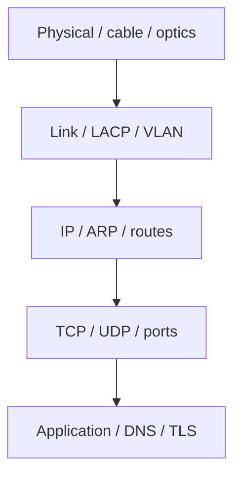
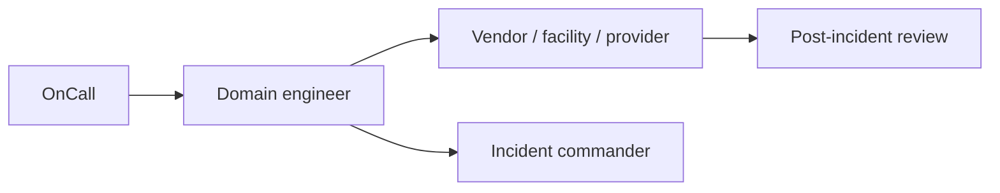

# 12. Troubleshooting

- **Purpose:** Use a disciplined method to isolate faults across hardware, firmware, OS, network, storage, performance, and application layers.
- **Style:** Production-oriented, concise bullets, commands, expected outputs, diagrams, and operational guardrails.
- **Audience:** Platform engineers, SREs, systems administrators, datacenter operators, and architects.
- **Use this guide when:** Building, refreshing, or auditing physical server infrastructure.
> **Disclaimer:** Third-party logos and screenshots are used for educational purposes only.

## Methodology

- Identify the symptom, blast radius, start time, and recent changes.
- Isolate the failing layer.
- Fix with the lowest-risk reversible action first.
- Document evidence, timeline, root cause, and prevention items.

### Troubleshooting workflow


## Hardware issues

- No POST: inspect diagnostic LEDs, PSU state, and BMC event log.
- Memory errors: check ECC events in `dmesg` and BMC SEL.
- Disk failures: inspect SMART, RAID controller status, and rebuild state.
- NIC issues: verify link state, optics/DAC compatibility, and switch port status.
- PSU failures: verify both cords and both PDUs.
- Fan failures: respond to thermal alerts quickly.

## Hardware triage commands

```bash
ipmitool sel list | tail
ipmitool sensor list | egrep "Temp|FAN|PSU"
dmesg -T | egrep -i "mce|ecc|edac|error|fail" | tail
```

**Expected output**

```text
Power Supply Failure detected
FAN1 | 4200 RPM | nc
EDAC MC0: 1 CE memory read error on DIMM_A1
```

## OS and boot issues

- GRUB rescue: boot rescue media, chroot, reinstall GRUB, rebuild config.
- Kernel panic: collect console output, recent changes, and crash dump if configured.
- Filesystem corruption: `fsck` for ext4, `xfs_repair` for XFS on unmounted filesystems.
- LVM issues: run `pvscan`, `vgscan`, and `vgchange -ay`.

## GRUB recovery example

```bash
mount /dev/mapper/vg_root-lv_root /mnt
mount /dev/sda2 /mnt/boot
mount /dev/sda1 /mnt/boot/efi
for i in /dev /proc /sys /run; do mount --bind $i /mnt$i; done
chroot /mnt
grub2-install /dev/sda
grub2-mkconfig -o /boot/grub2/grub.cfg
```

### Layer-by-layer network debug



## Network issues

- No connectivity: start at physical link, then VLAN, IP, routes, transport, and app.
- Bond/LACP failures: compare host bond state with switch port-channel state.
- DNS failures: verify resolvers, upstream reachability, and split-horizon expectations.
- MTU issues: test path MTU and check tunnel overhead.

## Performance issues

- CPU: `top`, `mpstat`, `pidstat`, `perf top`.
- Memory: `free -h`, `vmstat`, `sar -r`, OOM traces.
- Disk I/O: `iostat -xz`, `iotop`.
- Network: `iperf3`, `ss -s`, retransmits, NIC counters.

## Service and log analysis

```bash
systemctl status myapp --no-pager
journalctl -u myapp -n 50 --no-pager
ss -tlnp | egrep ':80|:443|:5432|:3306'
ausearch -m avc -ts recent | tail
```

**Expected output**

```text
Active: failed (Result: exit-code)
listen tcp :8080: bind: address already in use
```

### Escalation path



## Escalation matrix template

| Severity | When to use | Primary owner | Secondary owner | External contact |
| --- | --- | --- | --- | --- |
| SEV1 | Production outage / safety risk | On-call lead | Incident commander | Vendor TAC / colo NOC |
| SEV2 | Major degradation / reduced redundancy | Service owner | Platform lead | Relevant vendor |
| SEV3 | Minor issue / non-prod impact | Team queue | Duty engineer | As needed |

## Storage troubleshooting

```bash
iostat -xz 1 5
dmesg -T | egrep -i "error|io|reset|abort|fail" | tail -20
smartctl -H /dev/sdb
mdadm --detail /dev/md0
pvs; vgs; lvs
```

**Expected output (healthy)**

```text
Device r/s rkB/s w/s wkB/s await aqu-sz %util
sdb     0.0    0.0  0.0     0.0   0.00      0    0.00
SMART overall-health self-assessment test result: PASSED
/dev/md0 : active raid1 sdb[0] sdc[1] ... State : clean
```

**Common storage symptoms and actions:**

| Symptom | First action | Second action |
| --- | --- | --- |
| `/dev/md0` in degraded state | `mdadm --detail /dev/md0` | Replace failed disk, `mdadm --manage /dev/md0 --add /dev/sdd` |
| High `await` in `iostat` | Check queue depth and workload pattern | Check controller status, optics, and SAN paths |
| XFS errors in dmesg | Run `xfs_repair` on unmounted LV | Check underlying RAID/disk health first |
| LV not visible after reboot | `pvscan --cache`; `vgchange -ay` | Check multipath, RAID state, and fstab |

## Network troubleshooting deep-dive

```bash
# Check packet errors on all interfaces
ip -s link | awk '/^[0-9]/{iface=$2} /RX:|TX:/{print iface, $0}' | grep -v "^lo"
# Trace full path
traceroute -n 10.20.30.1
mtr --report --report-cycles 10 10.20.30.1
# Check BGP or routing table (if routing protocols in use)
ip route show table all
# Verify firewall
nft list ruleset | head -30
firewall-cmd --list-all-zones 2>/dev/null | head -40
```

**Expected output**

```text
bond0  RX: bytes  packets  errors  dropped
       123456789  98765    0       0
       TX: bytes  packets  errors  dropped
       234567890  87654    0       0
```

## Application troubleshooting

```bash
# Check what is listening
ss -tlnp
# Test local health endpoint
curl -sv http://localhost:8080/healthz 2>&1 | tail -20
# Inspect last 100 lines of app logs
journalctl -u myapp -n 100 --no-pager
# Check file descriptor limits
cat /proc/$(pidof myapp)/limits | grep "open files"
# Check memory usage
ps aux --sort=-%mem | head -5
```

**Expected output**

```text
LISTEN  0  511  0.0.0.0:8080  *  users:(("myapp",pid=4321,...))
HTTP/1.1 200 OK
{"status":"ok"}
Max open files  65535
```

## Kernel and OS troubleshooting

```bash
# Last kernel messages
dmesg -T --level=err,crit,alert,emerg | tail -20
# OOM killer events
journalctl -k | grep -i oom | tail -10
# Last system crash
ls -lh /var/crash/
# Kernel parameters
sysctl -a | egrep "vm.swappiness|net.ipv4.tcp_retries|kernel.panic"
# Hung processes
ps aux | awk '$8 ~ /^D/ {print}'
```

**Expected output**

```text
kernel: oom-kill event-some-process pid=4444 total-vm:2097152kB
kernel.panic = 0   # consider kernel.panic=10 for auto-reboot
```

## BMC and hardware telemetry deep-dive

```bash
ipmitool sel elist 2>/dev/null | tail -20
ipmitool sdr type Temperature
ipmitool sdr type Fan
ipmitool sdr type Voltage
ipmitool chassis status
```

**Expected output**

```text
System Power  : on
Power Overload : false
Drive Fault   : false
Cooling Fault : false
```

### Post-incident documentation template

```
## Incident report: <title>
- **Date/time:** YYYY-MM-DD HH:MM UTC
- **Duration:** X hours Y minutes
- **Severity:** SEV1/SEV2/SEV3
- **Impact:** <what broke and for how long>
- **Timeline:**
  - HH:MM - Symptom first observed
  - HH:MM - On-call alerted
  - HH:MM - Root cause identified
  - HH:MM - Mitigation applied
  - HH:MM - Service restored
- **Root cause:** <technical description>
- **Contributing factors:**
  - ...
- **Action items:**
  - [ ] Fix: ...
  - [ ] Detect: ...
  - [ ] Prevent: ...
```

### Troubleshooting tool reference

| Tool | Purpose | Key flags |
| --- | --- | --- |
| `dmesg -T` | Kernel ring buffer | `--level=err,crit` |
| `journalctl` | Systemd journal | `-u service -n 100 --no-pager` |
| `iostat -xz` | Disk I/O | `1 5` for 5 second samples |
| `ss -tlnp` | Socket state | `--no-header` for scripting |
| `ipmitool sel elist` | BMC event log | Most useful hardware view |
| `smartctl -a` | Disk SMART data | `-H` for quick health |
| `mtr --report` | Network path | `--report-cycles 20` |
| `perf top` | CPU profiling | `-a` for system-wide |
| `strace -p` | Syscall tracing | `-e trace=network,file` |
| `tcpdump` | Packet capture | `-i bond0 -nn port 443 -w out.pcap` |

## Container troubleshooting

```bash
# Check container runtime status
systemctl status docker  # or podman
# List all containers including stopped
docker ps -a
# Inspect failing container
docker logs myapp --tail 50
docker inspect myapp | python3 -m json.tool | egrep "State|OOMKilled|ExitCode"
# Check resource limits and usage
docker stats --no-stream
```

**Expected output**

```text
Active: active (running)
myapp  Up 2 hours  0.0.0.0:8080->8080/tcp
"ExitCode": 0,
"OOMKilled": false,
```

## Security incident triage

```bash
# Check for unexpected listening ports
ss -tlnp | awk '{print $4, $6}' | sort -u
# Identify unexpected processes
ps aux --sort=-%cpu | head -10
# Check for unusual cron entries
crontab -l
cat /etc/cron.d/*
# Inspect recent auth events
journalctl -u sshd --since -1h | egrep "Failed|Accepted|session opened"
# Check for unexpected kernel modules
lsmod | diff - /var/lib/cmdb/$(hostname)-lsmod-baseline.txt 2>/dev/null
```

## Performance profiling workflow

```bash
# CPU flame graph (requires perf and FlameGraph tools)
perf record -ag -F 99 -- sleep 30
perf script | ./stackcollapse-perf.pl | ./flamegraph.pl > /var/www/html/flamegraph.svg

# Disk I/O tracing with blktrace
blktrace -d /dev/sdb -o /var/log/blktrace &
sleep 30 && pkill blktrace
blkparse /var/log/blktrace.blktrace.0 | head -20

# Memory leak detection
valgrind --leak-check=full --log-file=/var/log/valgrind.log myapp --config /etc/myapp/app.yaml &
```

## Automation-related issues

- If Ansible fails due to SSH host key change (host rebuilt): `ssh-keygen -R <hostname>` on the controller.
- If Ansible facts are stale: clear the fact cache (`rm -rf /tmp/ansible_facts_cache`).
- If AWX shows template errors: validate YAML syntax with `ansible-playbook --syntax-check`.
- If Terraform state diverges from reality: `terraform refresh` or `terraform import` to reconcile.

```bash
ansible-playbook site.yml --syntax-check
ansible-lint site.yml | head -20
```

**Expected output**

```text
playbook: site.yml
# [yaml]: violations: 0
```

### Common error → cause → fix reference

| Error message | Likely cause | Fix |
| --- | --- | --- |
| `Connection refused :22` | sshd not running | Boot to console, `systemctl start sshd` |
| `kernel: oom-kill` | Memory exhausted | Identify offending process, resize or throttle |
| `EXT4-fs error` | Disk corruption | `fsck -y /dev/sda3` (unmounted) |
| `NFS: server not responding` | NFS server / network | Check NFS server, network path, firewall |
| `mdadm: Array is degraded` | Disk failure | Replace failed disk, `mdadm --add` |
| `ERR_SSL_PROTOCOL_ERROR` | Cert expired / mismatch | Check cert expiry; renew |
| `too many open files` | fd limit hit | Raise `LimitNOFILE` in systemd unit |

## Troubleshooting

- Always capture timestamps, commands run, and system state before rebooting.
- Do not replace hardware before collecting BMC SEL, SMART, and kernel evidence unless safety demands it.
- If multiple layers look broken, restore the lowest layer first.
- If a change caused the incident, prefer rollback during the active outage.

## Official references

- [RHEL docs](https://access.redhat.com/documentation/en-us/red_hat_enterprise_linux/9)
- [Ubuntu Server docs](https://documentation.ubuntu.com/server/)
- [systemd man pages](https://www.freedesktop.org/software/systemd/man/)
- [smartmontools docs](https://www.smartmontools.org/wiki/Documentation)
