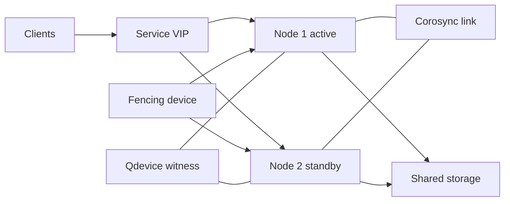
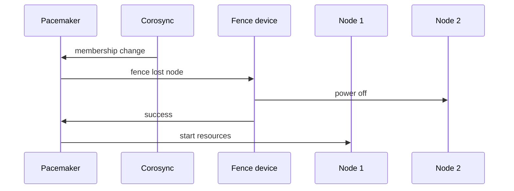
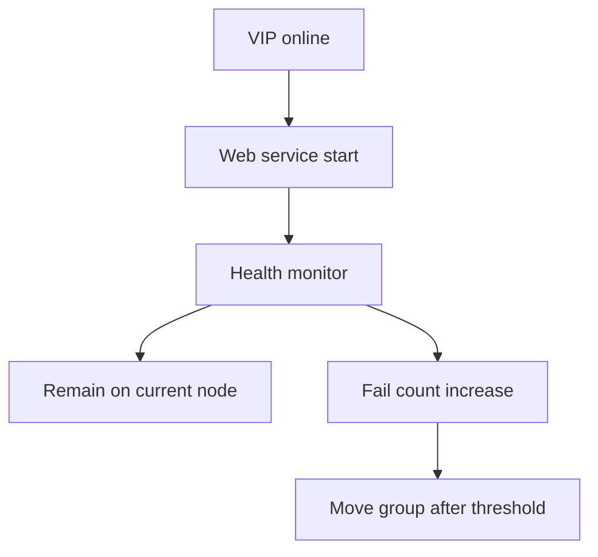
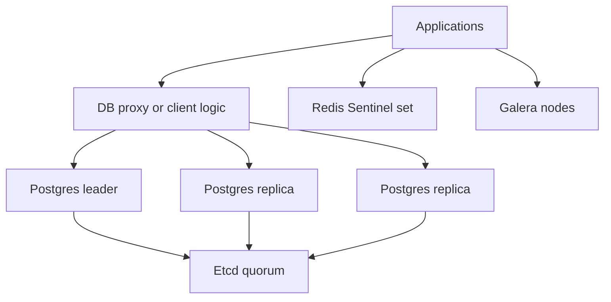
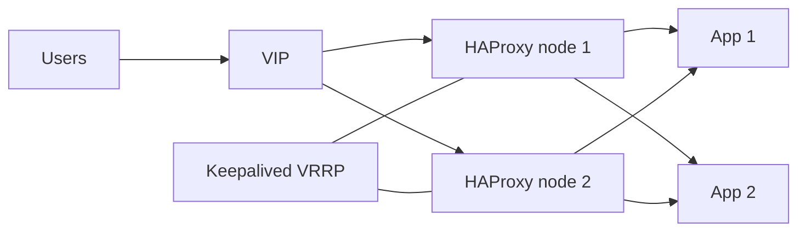

# 13. High Availability and Clustering on Bare Metal

- **Purpose:** Design and operate production high availability services on physical servers with predictable failover and clear failure domains.
- **Style:** Production-oriented, concise bullets, commands, expected outputs, diagrams, and operational guardrails.
- **Audience:** Platform engineers, SREs, systems administrators, datacenter operators, database administrators, and architects.
- **Use this guide when:** Building active-passive clusters, active-active services, replicated storage, and highly available load balancing on bare metal.
> **Disclaimer:** Third-party logos and screenshots are used for educational purposes only.

## 13.1 HA concepts

- High availability reduces service downtime during node, process, power, storage, or network failures.
- HA does not remove the need for backup, DR, patch windows, or capacity planning.
- Design around failure domains: host, rack, switch pair, power feed, storage fabric, and site.
- Every HA design needs a policy for leadership, membership, fencing, data consistency, and client failover.

### 13.1.1 Active Passive versus Active Active

| Pattern | How it works | Best use cases | Strengths | Trade offs |
| --- | --- | --- | --- | --- |
| Active Passive | One node serves traffic while one or more standby nodes wait to take over | Stateful apps, legacy monoliths, VIP based failover, filesystems with single writer | Simple operations, predictable ownership, easier troubleshooting | Idle capacity, failover event required, single active writer |
| Active Active | Multiple nodes serve traffic at the same time | Web tiers, API tiers, Galera, Redis read scaling, load balanced stateless apps | Better capacity use, rolling maintenance easier, no cold standby | Needs app awareness, harder consistency, session management required |
| N plus 1 | Many active nodes with one standby | Large fleets with shared spares | Efficient spare model | More scheduling logic |
| Geo redundant | Active site with warm or active DR site | Critical external services | Improves site resilience | More cost and replication complexity |

### 13.1.2 Split brain, quorum, and fencing

- **Split brain:** Two nodes believe they own the same service or storage and both start writing.
- Common causes:
  - Cluster interconnect loss.
  - Storage path asymmetry.
  - Broken fencing device.
  - Manual overrides without quorum checks.
- Result:
  - Duplicate VIP ownership.
  - Filesystem corruption.
  - Divergent DRBD generations.
  - Client inconsistency and data loss.
- **Fencing** solves this by forcibly isolating the losing node before service promotion.
- **STONITH** means the cluster can power off, reset, or isolate a failed peer.
- Treat fencing as mandatory in production, not optional.

| Fencing type | Typical device | When to use | Advantages | Watch items |
| --- | --- | --- | --- | --- |
| IPMI | BMC over LAN | Most rack servers | Common, scriptable, supported by Pacemaker | Separate management network and credential hygiene required |
| iLO | HPE servers | HPE estates | Rich remote control and logs | License level may affect features |
| iDRAC | Dell servers | Dell estates | Strong remote power and media control | Keep firmware current |
| XCC | Lenovo servers | Lenovo estates | Similar to IPMI plus vendor API | Validate API auth modes |
| PDU fencing | Managed PDU outlet | Final fallback when BMC is unreliable | Independent of server software | Coarse control, map outlets carefully |
| SBD | Shared block device | Two node clusters | Useful quorum tie breaker | Needs reliable shared storage |

### 13.1.3 Quorum design

- Quorum means more than half of eligible votes can communicate and agree on membership.
- Prefer odd numbered voting members: 3, 5, 7.
- Two node clusters need a tie breaker such as `qdevice`, SBD, or strict fencing policy.
- Never disable quorum permanently just to make a cluster start.

| Cluster size | Majority needed | Recommended policy | Notes |
| --- | --- | --- | --- |
| 2 nodes | 2 of 2 unless qdevice used | Add `qdevice` or SBD, enable fencing | Avoid no quorum freeze bypasses |
| 3 nodes | 2 of 3 | Default majority policy | Smallest clean production quorum model |
| 5 nodes | 3 of 5 | Default majority policy | Better for distributed resource groups |
| Stretch cluster | Site local majority plus witness | Use site labels and tie breaker | Validate WAN latency and fencing path |

### 13.1.4 Shared storage requirements

- Use shared storage only when the application or filesystem requires simultaneous block access.
- Validate multipath, write ordering, cache policy, and fencing integration before cluster go live.
- Separate production traffic from storage and cluster messaging.
- For write intensive data, prefer replicated local storage or application level replication when possible.

| Requirement | Why it matters | Production target |
| --- | --- | --- |
| Dual paths | Survives HBA or switch loss | Two fabrics or two iSCSI paths |
| Deterministic latency | Prevents false failover | Less than 5 ms intra cluster where possible |
| Write barriers or flush support | Preserves consistency | Enabled end to end |
| Multipath validation | Prevents single path dependency | `multipath -ll` healthy on all nodes |
| Fencing integration | Prevents shared write corruption | Mandatory before resource start |

### 13.1.5 HA cluster architecture



- Client traffic lands on a floating VIP.
- Corosync maintains membership and messaging.
- Shared storage or replicated storage holds state.
- Fencing removes unsafe nodes before failover.

## 13.2 Pacemaker and Corosync cluster setup

### 13.2.1 Package installation

**RHEL and CentOS Stream**

```bash
dnf install -y pacemaker corosync pcs fence-agents-all resource-agents
systemctl enable --now pcsd
passwd hacluster
```

**Expected output**

```text
Installed:
  pacemaker corosync pcs fence-agents-all resource-agents
Created symlink /etc/systemd/system/multi-user.target.wants/pcsd.service
passwd: all authentication tokens updated successfully
```

**Ubuntu and Debian**

```bash
apt update
apt install -y pacemaker corosync pcs fence-agents resource-agents
systemctl enable --now pcsd
passwd hacluster
```

**Preflight checklist**

| Item | Command | Healthy result |
| --- | --- | --- |
| DNS or hosts file | `getent hosts node1 node2` | Both nodes resolve to cluster IPs |
| Time sync | `chronyc sources -v` | Same time source and low offset |
| Firewall | `firewall-cmd --list-ports` or `nft list ruleset` | Cluster ports permitted |
| Hostname | `hostnamectl` | Static hostname matches cluster node name |
| Fencing reachability | `ipmitool -I lanplus -H bmc1 chassis power status` | Returns current power state |

### 13.2.2 Initialize the cluster

```bash
pcs host auth node1 node2 -u hacluster -p 'StrongPassword'
pcs cluster setup ha-cluster node1 node2
pcs cluster start --all
pcs cluster enable --all
```

**Expected output**

```text
node1: Authorized
node2: Authorized
Cluster has been successfully set up.
Starting Cluster...
node1: Started
node2: Started
Cluster Enabled on node1
Cluster Enabled on node2
```

### 13.2.3 Cluster verification

```bash
pcs status
crm_mon -1
corosync-cfgtool -s
```

**Expected output**

```text
Cluster name: ha-cluster
Stack: corosync
Current DC: node1
2 nodes configured
2 resources configured
Online: [ node1 node2 ]
LINK ID 0 udp transport knet status connected
```

### 13.2.4 Corosync transport

- `knet` is the default for modern Corosync and supports multiple links.
- `udpu` is simpler but usually used only for small or legacy designs.
- Use dedicated cluster interfaces for token traffic where possible.
- Keep latency low and packet loss near zero.

**knet example**

```conf
totem {
    version: 2
    cluster_name: ha-cluster
    transport: knet
}

nodelist {
    node {
        ring0_addr: 10.0.10.11
        name: node1
        nodeid: 1
    }
    node {
        ring0_addr: 10.0.10.12
        name: node2
        nodeid: 2
    }
}
quorum {
    provider: corosync_votequorum
    two_node: 1
}
```

**udpu example**

```conf
totem {
    version: 2
    transport: udpu
    interface {
        ringnumber: 0
        bindnetaddr: 10.0.10.0
        mcastport: 5405
    }
}
```

### 13.2.5 Cluster messaging and fencing flow



## 13.3 Resource configuration

### 13.3.1 Create a floating VIP and web service

```bash
pcs resource create vip ocf:heartbeat:IPaddr2 ip=10.0.1.100 cidr_netmask=24 op monitor interval=10s
pcs resource create webserver systemd:nginx op monitor interval=20s
pcs status --full
```

**Expected output**

```text
Creating resource 'vip'
Creating resource 'webserver'
Resource Group: started on node1
  vip        (ocf:heartbeat:IPaddr2): Started node1
  webserver  (systemd:nginx):        Started node1
```

### 13.3.2 Group and order resources

```bash
pcs resource group add web-group vip webserver
pcs constraint order start vip then webserver
pcs constraint colocation add webserver with vip INFINITY
```

**Expected output**

```text
Adding vip webserver to group web-group
Adding webserver vip (kind: Mandatory) (Options: first-action=start then-action=start)
Adding webserver with vip (score: INFINITY)
```

- Grouping keeps the VIP and service on the same node.
- Ordering ensures the IP exists before the daemon starts.
- Colocation prevents the web service from starting away from the VIP.

### 13.3.3 Resource stickiness and failure policy

```bash
pcs resource defaults update resource-stickiness=200 migration-threshold=3
pcs resource op defaults timeout=60s record-pending=true
pcs property set stonith-enabled=true
pcs property set no-quorum-policy=stop
```

**Expected output**

```text
Resource defaults updated
Operation defaults updated
Cluster property stonith-enabled set to true
Cluster property no-quorum-policy set to stop
```

| Setting | Why it matters | Typical baseline |
| --- | --- | --- |
| `resource-stickiness` | Avoids unnecessary move back after transient events | 100 to 300 |
| `migration-threshold` | Stops endless restarts on a bad node | 2 to 5 |
| `failure-timeout` | Clears failure count after cooling period | 60s to 300s |
| `no-quorum-policy` | Defines behavior during partition | `stop` for most services |
| `stonith-enabled` | Prevents split brain | `true` always in production |

### 13.3.4 Location constraints

```bash
pcs constraint location web-group prefers node1=50
pcs constraint location web-group avoids node2=20
pcs constraint
```

**Expected output**

```text
Location Constraints:
  Resource: web-group
    Enabled on:
      Node: node1 Score: 50
      Node: node2 Score: -20
```

### 13.3.5 Resource dependency diagram



## 13.4 DRBD replicated block storage

### 13.4.1 What DRBD is

- DRBD is network mirrored block storage for Linux, often described as RAID 1 over the network.
- It replicates writes from a primary node to a secondary node.
- Use it when you need local disk based replication without external SAN hardware.
- Pair it with Pacemaker for promotion, demotion, and service placement.

### 13.4.2 Install DRBD

```bash
dnf install -y drbd-utils kmod-drbd90
modprobe drbd
cat /proc/drbd
```

**Expected output**

```text
version: 9.2.x
GIT-hash: 1234567
No currently configured DRBD resourses
```

### 13.4.3 DRBD resource example

`/etc/drbd.d/wwwdata.res`

```conf
resource wwwdata {
    protocol C;
    startup {
        wfc-timeout 30;
        degr-wfc-timeout 120;
    }
    net {
        cram-hmac-alg sha256;
        shared-secret "ReplaceWithLongSecret";
        after-sb-0pri discard-zero-changes;
        after-sb-1pri consensus;
        after-sb-2pri disconnect;
    }
    on node1 {
        device /dev/drbd0;
        disk /dev/vgdata/lv_www;
        address 10.0.20.11:7789;
        meta-disk internal;
    }
    on node2 {
        device /dev/drbd0;
        disk /dev/vgdata/lv_www;
        address 10.0.20.12:7789;
        meta-disk internal;
    }
}
```

### 13.4.4 Initialize DRBD

```bash
drbdadm create-md wwwdata
drbdadm up wwwdata
drbdadm primary --force wwwdata
mkfs.xfs /dev/drbd0
drbdadm status
```

**Expected output**

```text
initializing activity log
successfully created internal meta data for wwwdata
role:Primary
  disk:UpToDate
  peer role:Secondary
  replication:Established peer-disk:UpToDate
```

### 13.4.5 DRBD replication flow


### 13.4.6 Primary and secondary operations

```bash
drbdadm status wwwdata
drbdadm secondary wwwdata
drbdadm primary wwwdata
```

**Expected output**

```text
wwwdata role:Primary
  disk:UpToDate open:yes
  node-id:1
  peer role:Secondary
```

### 13.4.7 Split brain recovery procedure

1. Stop dependent applications on both nodes.
2. Confirm which node has the authoritative data.
3. Fence or power off the losing node if cluster state is uncertain.
4. On the node that will be discarded, disconnect and wipe DRBD metadata.
5. Reconnect and resync from the source of truth.

```bash
drbdadm disconnect wwwdata
drbdadm secondary wwwdata
drbdadm connect --discard-my-data wwwdata
drbdadm status wwwdata
```

**Expected output**

```text
wwwdata role:Secondary
  peer role:Primary
  replication:SyncTarget done:18.4
```

**Recovery guardrails**

- Never run `--discard-my-data` on the node that has the newest valid writes.
- Review `/proc/drbd`, `drbdadm status`, and application checksums first.
- If in doubt, preserve both copies and restore from backup instead of guessing.

## 13.5 GFS2 and OCFS2 shared filesystems

### 13.5.1 When to use a cluster aware filesystem

- Use GFS2 or OCFS2 only when multiple nodes must mount the same block device read write at the same time.
- Common use cases:
  - Shared application content.
  - Cluster aware middleware.
  - Legacy apps needing one shared POSIX namespace.
- Do not use them as a shortcut for general file sharing when NFS or object storage is sufficient.

| Filesystem | Best fit | Control plane | Notes |
| --- | --- | --- | --- |
| GFS2 | RHEL based Pacemaker clusters | DLM plus Corosync | Strong RHEL integration |
| OCFS2 | Oracle heavy Linux estates | O2CB or cluster stack | Simpler niche deployments |
| NFS | Shared files for many clients | NFS server pair | Easier for read heavy content |
| CephFS | Scale out shared file workloads | Ceph monitors and MDS | Better horizontal growth |

### 13.5.2 GFS2 quick setup with DLM

```bash
pcs resource create dlm ocf:pacemaker:controld op monitor interval=30s clone interleave=true ordered=true
pcs resource create fs_web Filesystem device=/dev/drbd0 directory=/srv/www fstype=gfs2 options=noatime op monitor interval=20s
mkfs.gfs2 -p lock_dlm -t ha-cluster:webfs -j 2 /dev/drbd0
mount -t gfs2 /dev/drbd0 /srv/www
```

**Expected output**

```text
Device: /dev/drbd0
Cluster Name: ha-cluster
Resource Name: webfs
Mount successful
```

### 13.5.3 Shared filesystem decision points

- Need strict single writer: use XFS or ext4 on DRBD active passive.
- Need multi writer with small node count: GFS2.
- Need distributed shared storage across many nodes: consider CephFS.
- Need simple read sharing: NFS behind HA pair.

## 13.6 Database HA patterns

### 13.6.1 Pattern comparison

| Platform | HA model | Strengths | Trade offs | Best use |
| --- | --- | --- | --- | --- |
| MariaDB Galera | Multi master synchronous | Fast local failover, active active writes | Write latency rises with distance, conflict handling needed | Small to medium OLTP clusters |
| PostgreSQL Patroni plus etcd | Single writer with automated failover | Mature PostgreSQL ecosystem, strong consistency | One primary writer only | Transactional systems |
| Redis Sentinel | Primary replica with sentinel election | Lightweight and common | Asynchronous replication risks data loss on failover | Cache and queue style workloads |
| Pacemaker managed single DB | Active passive with VIP | Simple legacy design | Slower failover, shared storage concerns | Older monoliths |

### 13.6.2 Galera baseline

```bash
dnf install -y mariadb-server galera
systemctl enable --now mariadb
mysql -e "SHOW STATUS LIKE 'wsrep_cluster_size';"
```

**Expected output**

```text
+--------------------+-------+
| Variable_name      | Value |
+--------------------+-------+
| wsrep_cluster_size | 3     |
+--------------------+-------+
```

### 13.6.3 Patroni plus etcd baseline

```bash
patronictl -c /etc/patroni.yml list
etcdctl --endpoints=http://10.0.30.11:2379 endpoint health
```

**Expected output**

```text
+ Cluster: pg-ha ------+---------+----+-----------+
| Member | Host        | Role    | TL | Lag in MB |
| pg1    | 10.0.30.21  | Leader  | 14 |         0 |
| pg2    | 10.0.30.22  | Replica | 14 |         0 |
+--------+-------------+---------+----+-----------+
http://10.0.30.11:2379 is healthy
```

### 13.6.4 Redis Sentinel baseline

```bash
redis-cli -p 26379 SENTINEL masters
redis-cli -p 26379 SENTINEL get-master-addr-by-name mymaster
```

**Expected output**

```text
1) 1) "name"
   2) "mymaster"
2) 1) "10.0.40.21"
   2) "6379"
```

### 13.6.5 Database HA architecture



## 13.7 Load balancer HA with HAProxy and Keepalived

### 13.7.1 Why combine them

- HAProxy handles traffic distribution and health checks.
- Keepalived owns the VIP using VRRP.
- Together they give active passive load balancer high availability.
- Place each load balancer on separate racks and power feeds.

### 13.7.2 HAProxy configuration example

`/etc/haproxy/haproxy.cfg`

```cfg
global
    log /dev/log local0
    maxconn 20000
    daemon

defaults
    mode http
    log global
    timeout connect 5s
    timeout client 30s
    timeout server 30s

frontend web_front
    bind 10.0.1.100:80
    bind 10.0.1.100:443 ssl crt /etc/pki/tls/private/site.pem
    default_backend web_back

backend web_back
    balance roundrobin
    option httpchk GET /healthz
    server app1 10.0.1.21:80 check
    server app2 10.0.1.22:80 check
    server app3 10.0.1.23:80 check

listen stats
    bind 127.0.0.1:8404
    stats enable
    stats uri /stats
```

### 13.7.3 Keepalived configuration example

`/etc/keepalived/keepalived.conf`

```conf
vrrp_script chk_haproxy {
    script "/usr/bin/test -n \"$(pidof haproxy)\""
    interval 2
    weight -20
}

vrrp_instance VI_1 {
    state BACKUP
    interface bond0.100
    virtual_router_id 51
    priority 150
    advert_int 1
    authentication {
        auth_type PASS
        auth_pass ReplaceMe
    }
    virtual_ipaddress {
        10.0.1.100/24 dev bond0.100
    }
    track_script {
        chk_haproxy
    }
}
```

### 13.7.4 Verify load balancer state

```bash
systemctl enable --now haproxy keepalived
ss -tlnp | egrep ':80|:443|:8404'
ip addr show bond0.100 | grep 10.0.1.100
curl -s http://127.0.0.1:8404/stats | head
```

**Expected output**

```text
LISTEN 0 4096 10.0.1.100:80
LISTEN 0 4096 10.0.1.100:443
inet 10.0.1.100/24 scope global secondary bond0.100
<html><body><h1>Statistics Report for HAProxy</h1>
```

### 13.7.5 LB failover diagram



## 13.8 Testing HA behavior

### 13.8.1 Controlled failover tests

| Test | Command | Expected behavior | Target outcome |
| --- | --- | --- | --- |
| Put active node in standby | `pcs node standby node1` | Resources relocate to node2 | Planned maintenance succeeds |
| Kill service process | `pid=$(pidof nginx); kill -9 "$pid"` | Pacemaker restarts or moves resource after monitor failure | Service restored within SLA |
| Simulate network partition | `iptables -A INPUT -s 10.0.10.12 -j DROP` | Quorum and fencing policy decide surviving node | No split brain |
| Fence test | `pcs stonith fence node2` | Node2 powers off and recovers per policy | Fencing path proven |
| DRBD resync test | Disconnect replication link | DRBD shows `WFConnection` then resync on restore | Replica consistency preserved |

### 13.8.2 Planned node failover

```bash
pcs node standby node1
pcs status
curl -I http://10.0.1.100
```

**Expected output**

```text
Node node1: standby
Online: [ node2 ]
HTTP/1.1 200 OK
```

### 13.8.3 Service failure simulation

```bash
pid=$(pidof nginx)
kill -9 "$pid"
sleep 25
pcs status --full
journalctl -u pacemaker -n 20 --no-pager
```

**Expected output**

```text
Failed Resource Actions:
  webserver_start_0 on node1 'error'
Resource Group: web-group
  vip        Started node2
  webserver  Started node2
```

### 13.8.4 Network partition simulation

```bash
iptables -A INPUT -s 10.0.10.12 -j DROP
crm_mon -1
journalctl -u corosync -n 20 --no-pager
iptables -D INPUT -s 10.0.10.12 -j DROP
```

**Expected output**

```text
Partition with quorum policy detected
Node node2 is offline
stonith operation for node2 successful
```

### 13.8.5 Log review commands

```bash
journalctl -u pacemaker -u corosync -u pcsd -n 50 --no-pager
pcs resource failures
pcs config
```

**Expected output**

```text
node1 pacemaker-fenced: notice: Operation reboot of node2 by stonith-ipmi OK
No resource failures
```

## 13.9 Troubleshooting

### 13.9.1 Cluster will not form

- Check required ports:
  - TCP 2224 for `pcsd`.
  - TCP 3121 for `pacemaker remote` where used.
  - UDP 5403 to 5405 for Corosync.
  - TCP 21064 for DLM and some cluster services.
- Validate hostname resolution, NTP, and firewall symmetry.
- Compare `/etc/corosync/corosync.conf` on all nodes.

```bash
firewall-cmd --permanent --add-port=2224/tcp
firewall-cmd --permanent --add-port=3121/tcp
firewall-cmd --permanent --add-port=5403-5405/udp
firewall-cmd --permanent --add-port=21064/tcp
firewall-cmd --reload
ss -tulpen | egrep '2224|3121|5403|5404|5405|21064'
```

**Expected output**

```text
success
success
success
success
udp UNCONN 0 0 0.0.0.0:5405
LISTEN 0 128 0.0.0.0:2224
```

### 13.9.2 Resource will not start

```bash
pcs resource debug-start webserver
systemctl status nginx --no-pager
journalctl -u nginx -n 30 --no-pager
```

**Expected output**

```text
Debug-start for resource webserver succeeded
Active: failed (Result: exit-code)
nginx: [emerg] bind() to 10.0.1.100:80 failed
```

**Common causes**

| Symptom | Likely cause | Action |
| --- | --- | --- |
| VIP starts but web service fails | Daemon bound to wrong IP or port conflict | Fix listen directives and restart agent |
| Resource flaps between nodes | Too aggressive monitor timeout | Increase timeout and check latency |
| Group stays stopped | Fencing disabled or no quorum | Restore fence agent and quorum state |
| Filesystem start fails | Wrong device, fsck needed, mount point missing | Validate block device and mount path |

### 13.9.3 Fencing failures

- Confirm BMC DNS, routing, credentials, and cipher support.
- Test outside the cluster first.
- Use one fence device per node, not a shared ambiguous target.
- Manual override is last resort and must be documented.

```bash
pcs stonith show
stonith_admin --list-installed
stonith_admin --reboot node2
```

**Expected output**

```text
 fence-node1  fence_ipmilan
 fence-node2  fence_ipmilan
Node node2 was fenced successfully
```

### 13.9.4 Manual recovery after fencing issues

1. Stop resource start attempts: `pcs property set maintenance-mode=true`.
2. Verify actual power state through BMC or PDU.
3. Repair the fence path.
4. Clear failure counters.
5. Exit maintenance mode only after safe state is proven.

```bash
pcs property set maintenance-mode=true
pcs resource cleanup
pcs property set maintenance-mode=false
```

### 13.9.5 Split brain emergency checklist

- Freeze automation and operator changes.
- Determine which node served the last acknowledged write.
- Fence the other side.
- Preserve logs and replication metadata.
- Recover DRBD or database replication using authoritative source only.
- Validate application data before reopening traffic.

## 13.10 Operational guardrails

- Keep cluster software, BMC firmware, and fence agents on validated versions.
- Test failover after every major change: kernel, NIC, switch, storage, or application update.
- Use separate VLANs for cluster heartbeat, production traffic, and storage replication.
- Monitor cluster state, fence history, replication lag, and service probe success.
- Record expected failover time and compare against real test results.

## Official references

- [Red Hat High Availability documentation](https://access.redhat.com/documentation/en-us/red_hat_enterprise_linux/9/html/configuring_and_managing_high_availability_clusters/index)
- [Pacemaker documentation](https://clusterlabs.org/pacemaker/)
- [Corosync documentation](https://corosync.github.io/corosync/)
- [ClusterLabs pcs documentation](https://clusterlabs.org/projects/pacemaker/doc/)
- [LINBIT DRBD documentation](https://linbit.com/drbd-user-guide/)
- [GFS2 documentation](https://access.redhat.com/documentation/en-us/red_hat_enterprise_linux/9/html/configuring_gfs2_file_systems/index)
- [MariaDB Galera Cluster documentation](https://mariadb.com/kb/en/galera-cluster/)
- [Patroni documentation](https://patroni.readthedocs.io/)
- [Redis Sentinel documentation](https://redis.io/docs/latest/operate/oss_and_stack/management/sentinel/)
