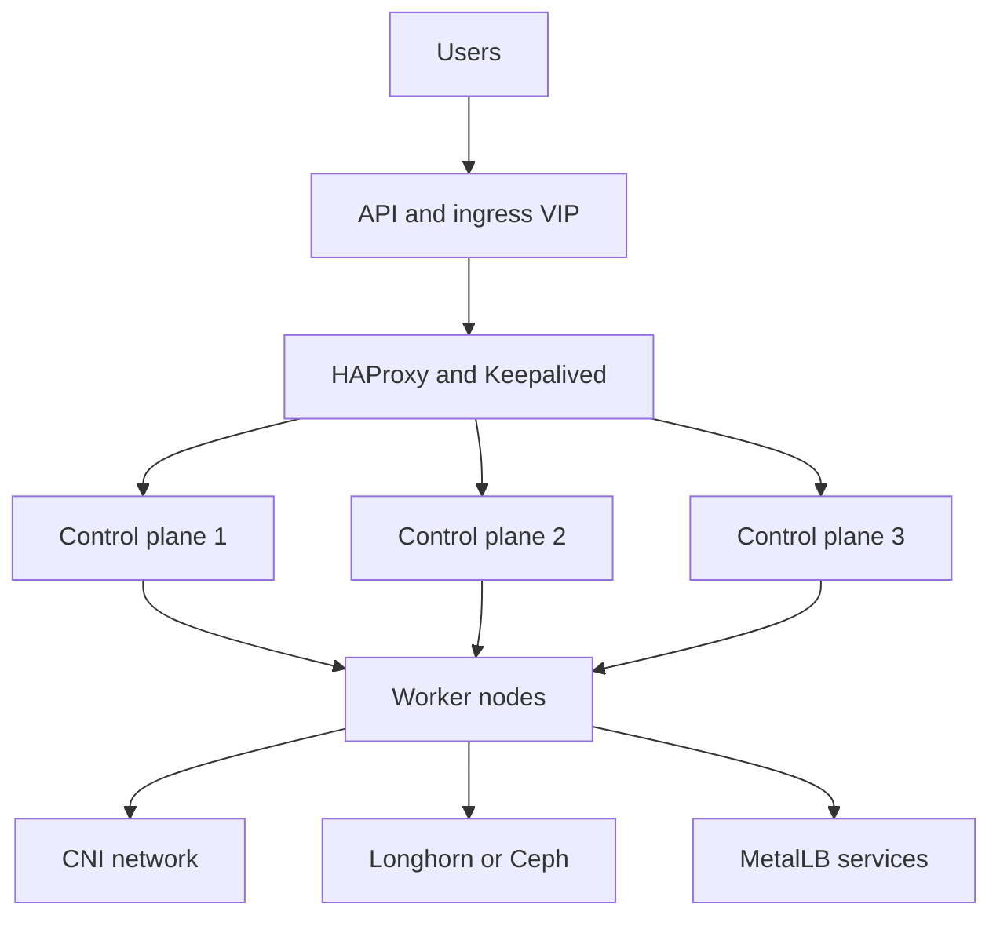
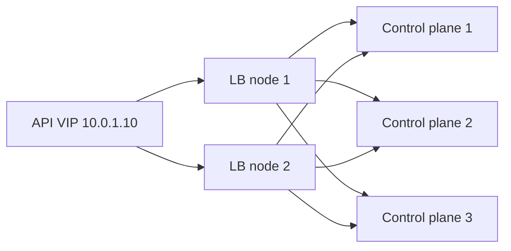
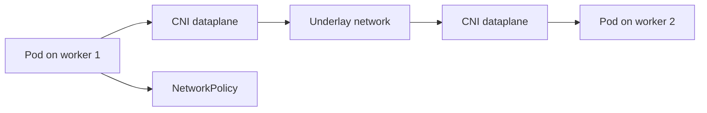
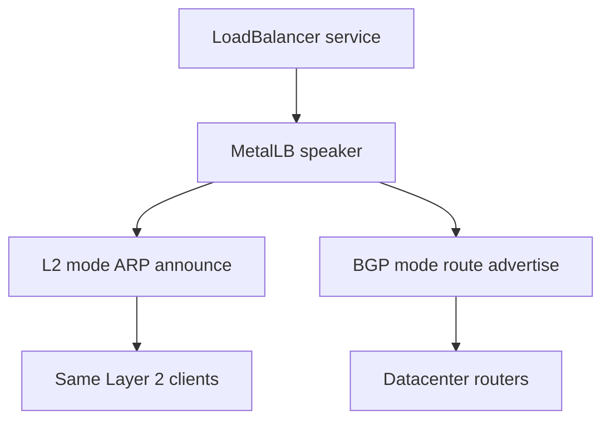
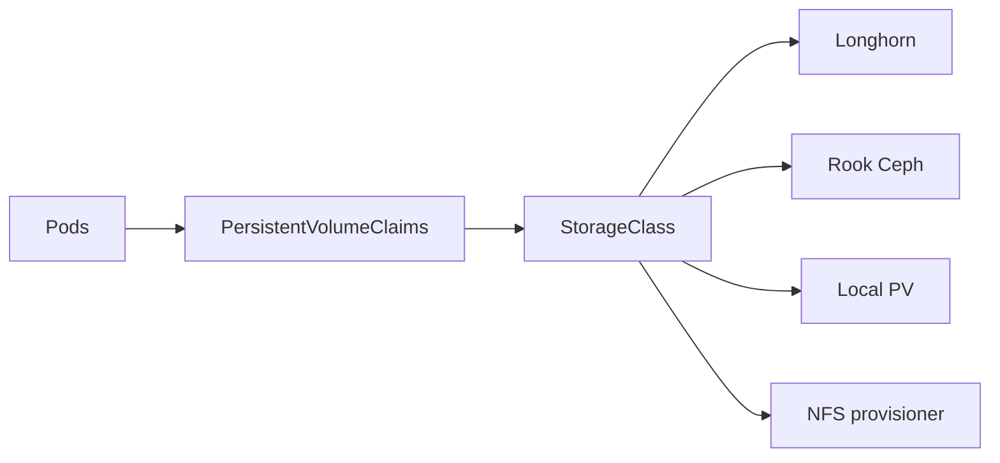
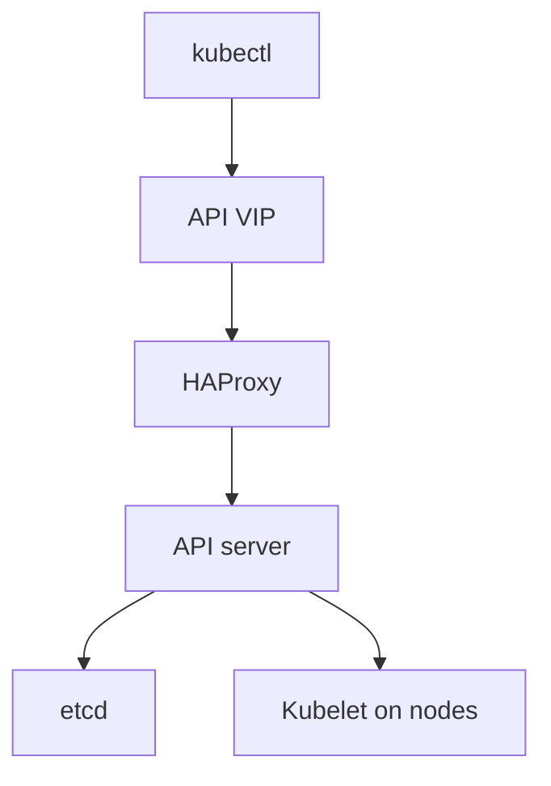

# 14. Kubernetes on Bare Metal

- **Purpose:** Build highly available Kubernetes clusters on physical servers with predictable networking, storage, and lifecycle operations.
- **Style:** Production-oriented, concise bullets, commands, expected outputs, diagrams, and operational guardrails.
- **Audience:** Platform engineers, SREs, Kubernetes administrators, systems administrators, and architects.
- **Use this guide when:** Bootstrapping `kubeadm` based clusters on bare metal with HA control planes, MetalLB, and persistent storage.
> **Disclaimer:** Third-party logos and screenshots are used for educational purposes only.

## 14.1 Why Kubernetes on bare metal

- Removes hypervisor overhead for CPU, network, storage, and accelerator access.
- Reduces long term cost at scale when utilization is steady and facility capacity already exists.
- Supports data sovereignty, custom network design, and direct GPU or RDMA access.
- Fits latency sensitive workloads, edge clusters, AI platforms, and internal platforms with predictable demand.

| Driver | Why bare metal helps | When cloud may still be better |
| --- | --- | --- |
| Performance | Direct NIC and NVMe access, no noisy hypervisor | Bursty workloads |
| Cost at scale | No cloud provider markup on always on capacity | Small short lived clusters |
| Data control | Full custody of hardware and location | Global edge rollout |
| Hardware choice | GPUs, DPU, SR IOV, huge memory nodes | Managed service preference |

### 14.1.1 Bare metal Kubernetes architecture



## 14.2 Prerequisites

### 14.2.1 Hardware requirements

| Role | Minimum CPU | Minimum RAM | Minimum storage | Production guidance |
| --- | --- | --- | --- | --- |
| Control plane | 4 vCPU | 8 GB | 50 GB SSD | Prefer 8 cores, mirrored SSD, redundant NICs |
| Worker | 8 vCPU | 16 GB | 100 GB SSD | Size by pod density, local cache, and storage needs |
| Load balancer | 2 vCPU | 4 GB | 20 GB | Two nodes minimum for VIP failover |
| External etcd | 4 vCPU | 8 GB | 80 GB SSD | Dedicated nodes for larger clusters |
| Storage node | 8 vCPU | 32 GB | Dedicated disks | Needed for Longhorn or Rook Ceph |

### 14.2.2 OS and network baseline

- Supported examples in this guide:
  - Ubuntu Server 22.04 LTS.
  - RHEL 9 or Rocky Linux 9.
- Requirements:
  - Unique hostnames and MAC addresses.
  - Forward and reverse DNS for all nodes.
  - All nodes reach TCP 6443, 10250, 2379 to 2380, 8472 or BGP ports depending on CNI.
  - NTP or Chrony synchronized.
  - MTU validated end to end, especially for VXLAN overlays.

### 14.2.3 Disable swap

```bash
swapoff -a
sed -ri '/\sswap\s/s/^/#/' /etc/fstab
free -h
```

**Expected output**

```text
Swap:             0B          0B          0B
```

### 14.2.4 Load required kernel modules

```bash
cat <<'EOM' >/etc/modules-load.d/k8s.conf
overlay
br_netfilter
EOM
modprobe overlay
modprobe br_netfilter
lsmod | egrep 'overlay|br_netfilter'
```

**Expected output**

```text
overlay               151552  0
br_netfilter           32768  0
```

### 14.2.5 Configure sysctl

```bash
cat <<'EOM' >/etc/sysctl.d/99-kubernetes-cri.conf
net.bridge.bridge-nf-call-iptables = 1
net.bridge.bridge-nf-call-ip6tables = 1
net.ipv4.ip_forward = 1
EOM
sysctl --system | egrep 'bridge-nf-call|ip_forward'
```

**Expected output**

```text
net.bridge.bridge-nf-call-iptables = 1
net.bridge.bridge-nf-call-ip6tables = 1
net.ipv4.ip_forward = 1
```

### 14.2.6 Preflight checklist

| Check | Command | Healthy result |
| --- | --- | --- |
| Hostname | `hostnamectl --static` | Matches inventory name |
| DNS | `getent hosts k8s-api.example.com` | VIP resolves |
| Time sync | `chronyc tracking` | Low offset |
| Container runtime absent old config | `which docker` or `crictl info` | No conflicting runtime or known state |
| Firewall | `ss -tulpen` and policy review | Required kube ports open |

## 14.3 Container runtime setup

### 14.3.1 Install containerd on Ubuntu

```bash
apt update
apt install -y containerd
mkdir -p /etc/containerd
containerd config default >/etc/containerd/config.toml
sed -i 's/SystemdCgroup = false/SystemdCgroup = true/' /etc/containerd/config.toml
systemctl restart containerd
systemctl enable containerd
ctr version
```

**Expected output**

```text
Client:
  Version:  1.7.x
Server:
  Version:  1.7.x
```

### 14.3.2 Install containerd on RHEL

```bash
dnf install -y containerd
mkdir -p /etc/containerd
containerd config default >/etc/containerd/config.toml
sed -i 's/SystemdCgroup = false/SystemdCgroup = true/' /etc/containerd/config.toml
systemctl enable --now containerd
crictl info | head
```

**Expected output**

```text
runtimeType: io.containerd.runc.v2
```

### 14.3.3 Validate CRI tooling

```bash
cat <<'EOM' >/etc/crictl.yaml
runtime-endpoint: unix:///run/containerd/containerd.sock
image-endpoint: unix:///run/containerd/containerd.sock
timeout: 10
EOM
crictl ps
```

**Expected output**

```text
CONTAINER           IMAGE               CREATED             STATE               NAME                ATTEMPT             POD ID
```

### 14.3.4 CRI O alternative

- CRI O integrates tightly with Kubernetes and often tracks Kubernetes versions closely.
- Prefer CRI O when your distribution packages it cleanly and you want an OCI focused runtime.
- Prefer containerd when you want the broadest ecosystem support and fewer moving parts.

| Runtime | Strengths | Trade offs |
| --- | --- | --- |
| containerd | Common default, large ecosystem, simple | More generic than Kubernetes specific |
| CRI O | Kubernetes native focus, lean stack | Repo management differs by distro |

## 14.4 kubeadm cluster bootstrap for HA

### 14.4.1 Install kubeadm, kubelet, and kubectl on all nodes

**Ubuntu 22.04 example with version pinning**

```bash
apt-get update
apt-get install -y apt-transport-https ca-certificates curl gpg
mkdir -p /etc/apt/keyrings
curl -fsSL https://pkgs.k8s.io/core:/stable:/v1.30/deb/Release.key | gpg --dearmor -o /etc/apt/keyrings/kubernetes-apt-keyring.gpg
echo 'deb [signed-by=/etc/apt/keyrings/kubernetes-apt-keyring.gpg] https://pkgs.k8s.io/core:/stable:/v1.30/deb/ /' >/etc/apt/sources.list.d/kubernetes.list
apt-get update
apt-get install -y kubelet=1.30.2-1.1 kubeadm=1.30.2-1.1 kubectl=1.30.2-1.1
apt-mark hold kubelet kubeadm kubectl
systemctl enable kubelet
```

**Expected output**

```text
kubelet set on hold
kubeadm set on hold
kubectl set on hold
Created symlink /etc/systemd/system/multi-user.target.wants/kubelet.service
```

**RHEL 9 example with version pinning**

```bash
cat <<'EOM' >/etc/yum.repos.d/kubernetes.repo
[kubernetes]
name=Kubernetes
baseurl=https://pkgs.k8s.io/core:/stable:/v1.30/rpm/
enabled=1
gpgcheck=1
gpgkey=https://pkgs.k8s.io/core:/stable:/v1.30/rpm/repodata/repomd.xml.key
exclude=kubelet kubeadm kubectl cri-tools kubernetes-cni
EOM
dnf install -y kubelet-1.30.2 kubeadm-1.30.2 kubectl-1.30.2 --disableexcludes=kubernetes
systemctl enable --now kubelet
```

### 14.4.2 Stacked etcd versus external etcd

| Model | How it works | Best fit | Strengths | Trade offs |
| --- | --- | --- | --- | --- |
| Stacked etcd | etcd runs on control plane nodes | Small to medium clusters | Fewer nodes, simpler bootstrap | Control plane pressure affects etcd |
| External etcd | Dedicated etcd nodes | Larger or very critical clusters | Better isolation, easier control plane scaling | More hosts and more certificate work |

### 14.4.3 HAProxy for the API server

`/etc/haproxy/haproxy.cfg`

```cfg
global
    log /dev/log local0
    maxconn 5000
    daemon

defaults
    mode tcp
    log global
    timeout connect 5s
    timeout client  1m
    timeout server  1m

frontend k8s_api
    bind 10.0.1.10:6443
    default_backend k8s_api_back

backend k8s_api_back
    option tcp-check
    balance roundrobin
    default-server inter 3s fall 3 rise 2
    server cp1 10.0.1.11:6443 check
    server cp2 10.0.1.12:6443 check
    server cp3 10.0.1.13:6443 check
```

### 14.4.4 Keepalived VIP for the API server

`/etc/keepalived/keepalived.conf`

```conf
vrrp_script chk_haproxy {
    script "/usr/bin/test -n \"$(pidof haproxy)\""
    interval 2
    weight -10
}

vrrp_instance VI_K8S {
    state BACKUP
    interface bond0.100
    virtual_router_id 60
    priority 150
    advert_int 1
    authentication {
        auth_type PASS
        auth_pass ReplaceMe
    }
    virtual_ipaddress {
        10.0.1.10/24 dev bond0.100
    }
    track_script {
        chk_haproxy
    }
}
```

### 14.4.5 API load balancer flow



### 14.4.6 Initialize the first control plane node

```bash
kubeadm init \
  --control-plane-endpoint "k8s-api.example.com:6443" \
  --upload-certs \
  --pod-network-cidr=10.244.0.0/16
```

**Expected output**

```text
Your Kubernetes control-plane has initialized successfully.

To start using your cluster, you need to run the following as a regular user:
  mkdir -p $HOME/.kube
  sudo cp -i /etc/kubernetes/admin.conf $HOME/.kube/config
  sudo chown $(id -u):$(id -g) $HOME/.kube/config

You can now join any number of control-plane node by running the following command on each as root:
  kubeadm join k8s-api.example.com:6443 --token abcdef.0123456789abcdef \
    --discovery-token-ca-cert-hash sha256:1111111111111111111111111111111111111111111111111111111111111111 \
    --control-plane --certificate-key 2222222222222222222222222222222222222222222222222222222222222222

Then you can join worker nodes by running the following on each as root:
  kubeadm join k8s-api.example.com:6443 --token abcdef.0123456789abcdef \
    --discovery-token-ca-cert-hash sha256:1111111111111111111111111111111111111111111111111111111111111111
```

### 14.4.7 Configure kubectl access

```bash
mkdir -p $HOME/.kube
cp -i /etc/kubernetes/admin.conf $HOME/.kube/config
chown $(id -u):$(id -g) $HOME/.kube/config
kubectl get nodes
```

**Expected output**

```text
NAME   STATUS     ROLES           AGE   VERSION
cp1    NotReady   control-plane   2m    v1.30.2
```

### 14.4.8 Join additional control plane nodes

```bash
kubeadm join k8s-api.example.com:6443 --token abcdef.0123456789abcdef \
  --discovery-token-ca-cert-hash sha256:1111111111111111111111111111111111111111111111111111111111111111 \
  --control-plane --certificate-key 2222222222222222222222222222222222222222222222222222222222222222
```

**Expected output**

```text
This node has joined the cluster and a new control plane instance was created successfully.
```

### 14.4.9 Join worker nodes

```bash
kubeadm join k8s-api.example.com:6443 --token abcdef.0123456789abcdef \
  --discovery-token-ca-cert-hash sha256:1111111111111111111111111111111111111111111111111111111111111111
```

**Expected output**

```text
This node has joined the cluster successfully.
```

### 14.4.10 Verify the cluster after joins

```bash
kubectl get nodes -o wide
kubectl get pods -A
kubectl -n kube-system get endpoints kube-apiserver
```

**Expected output**

```text
NAME   STATUS   ROLES           AGE   VERSION   INTERNAL-IP
cp1    Ready    control-plane   10m   v1.30.2   10.0.1.11
cp2    Ready    control-plane   6m    v1.30.2   10.0.1.12
cp3    Ready    control-plane   5m    v1.30.2   10.0.1.13
wk1    Ready    <none>          4m    v1.30.2   10.0.1.21
wk2    Ready    <none>          4m    v1.30.2   10.0.1.22
```

## 14.5 CNI selection and installation

### 14.5.1 Calico

- Good default for bare metal because it supports BGP, NetworkPolicy, and common operational patterns.
- Use VXLAN for simple overlay deployments.
- Use BGP mode when you want routed pod reachability in the datacenter.

```bash
kubectl apply -f https://docs.projectcalico.org/manifests/calico.yaml
kubectl -n kube-system rollout status daemonset/calico-node
kubectl get pods -n kube-system | grep calico
```

**Expected output**

```text
daemon set "calico-node" successfully rolled out
calico-kube-controllers-abcde   1/1 Running
calico-node-xyz12               1/1 Running
```

### 14.5.2 Flannel

- Simpler than Calico.
- Good for labs and small clusters without advanced policy requirements.
- Commonly uses VXLAN backend.

### 14.5.3 Cilium

- Uses eBPF for networking, policy, and observability.
- Strong choice when you want kube proxy replacement, Hubble, or advanced performance features.
- Requires careful kernel and feature validation on bare metal hosts.

### 14.5.4 CNI comparison

| CNI | Networking modes | NetworkPolicy | Bare metal fit | Complexity |
| --- | --- | --- | --- | --- |
| Calico | BGP, VXLAN, IPIP | Yes | Excellent | Medium |
| Flannel | VXLAN, host gw | Limited via add ons | Good for simple clusters | Low |
| Cilium | eBPF native routing, VXLAN, Geneve | Yes | Excellent when kernel supports it | Medium to high |

### 14.5.5 CNI data path view



## 14.6 MetalLB for bare metal services

### 14.6.1 Why MetalLB is required

- Bare metal clusters do not have a cloud load balancer controller.
- MetalLB advertises service IPs from a local address pool.
- Use L2 mode for simple Layer 2 domains.
- Use BGP mode for routed datacenter fabrics and larger scale.

### 14.6.2 Install MetalLB

```bash
kubectl apply -f https://raw.githubusercontent.com/metallb/metallb/v0.14.5/config/manifests/metallb-native.yaml
kubectl -n metallb-system rollout status deployment/controller
kubectl -n metallb-system get pods
```

**Expected output**

```text
deployment "controller" successfully rolled out
controller-abcde   1/1 Running
speaker-fghij      1/1 Running
```

### 14.6.3 L2 mode configuration

```yaml
apiVersion: metallb.io/v1beta1
kind: IPAddressPool
metadata:
  name: production
  namespace: metallb-system
spec:
  addresses:
    - 10.0.1.200-10.0.1.250
---
apiVersion: metallb.io/v1beta1
kind: L2Advertisement
metadata:
  name: production
  namespace: metallb-system
spec:
  ipAddressPools:
    - production
```

```bash
kubectl apply -f metallb-production.yaml
kubectl get ipaddresspools -n metallb-system
```

**Expected output**

```text
ipaddresspool.metallb.io/production created
NAME         AUTO ASSIGN   AVOID BUGGY IPS   ADDRESSES
production   true          false             [10.0.1.200-10.0.1.250]
```

### 14.6.4 BGP mode notes

- Use BGP mode when you want the leaf or core routers to learn service IP routes dynamically.
- Requires peer configuration on both MetalLB and the network fabric.
- Preferred for multi rack or routed topologies with many services.

### 14.6.5 Test a LoadBalancer service

```bash
kubectl create deployment demo --image=nginx
kubectl expose deployment demo --port=80 --type=LoadBalancer
kubectl get svc demo -w
```

**Expected output**

```text
NAME   TYPE           CLUSTER-IP      EXTERNAL-IP    PORT(S)
demo   LoadBalancer   10.96.108.220   10.0.1.200     80:31764/TCP
```

### 14.6.6 MetalLB L2 and BGP modes



## 14.7 Ingress controller on bare metal

### 14.7.1 Deployment options

| Option | How it works | Best fit | Watch items |
| --- | --- | --- | --- |
| `hostNetwork: true` | Ingress binds directly to node network | Small clusters or edge | Port conflicts and node placement |
| MetalLB service | Ingress is fronted by LoadBalancer IP | Common production choice | Needs IP pools and health checks |
| NodePort behind external LB | HAProxy or F5 points to ingress nodes | Existing network LB estate | More moving parts |

### 14.7.2 Example ingress manifest

```yaml
apiVersion: networking.k8s.io/v1
kind: Ingress
metadata:
  name: app-ingress
  annotations:
    cert-manager.io/cluster-issuer: letsencrypt-prod
spec:
  ingressClassName: nginx
  tls:
    - hosts:
        - app.example.com
      secretName: app-example-com-tls
  rules:
    - host: app.example.com
      http:
        paths:
          - path: /
            pathType: Prefix
            backend:
              service:
                name: app-service
                port:
                  number: 80
```

### 14.7.3 Cert manager note

- Use cert manager for ACME or internal PKI based certificate rotation.
- Keep external DNS and firewall rules aligned with ingress VIP changes.

## 14.8 Persistent storage options

### 14.8.1 Longhorn

- Distributed block storage implemented inside Kubernetes.
- Good for small to medium clusters needing simple replicated PVCs.
- Supports snapshots, recurring backups, and S3 compatible backup targets.

```bash
helm repo add longhorn https://charts.longhorn.io
helm repo update
helm install longhorn longhorn/longhorn --namespace longhorn-system --create-namespace
kubectl -n longhorn-system get pods
```

**Expected output**

```text
NAME                                  READY   STATUS
longhorn-driver-deployer-abcde        1/1     Running
longhorn-manager-fghij                1/1     Running
```

**PVC example**

```yaml
apiVersion: v1
kind: PersistentVolumeClaim
metadata:
  name: app-data
spec:
  accessModes:
    - ReadWriteOnce
  storageClassName: longhorn
  resources:
    requests:
      storage: 20Gi
```

### 14.8.2 Rook Ceph

- Production grade distributed storage for block, file, and object workloads.
- Minimum sensible starting point:
  - 3 nodes.
  - Dedicated data disks.
  - Strong network bandwidth and low latency.
- Choose when you need scale, fault domain awareness, and mature storage features.

### 14.8.3 Local persistent volumes

- Highest raw performance.
- No built in replication.
- Good for cache tiers, single replica workloads, or platforms with app level redundancy.

### 14.8.4 NFS provisioner

- Simple shared file storage for CI, content repositories, and non latency sensitive shared data.
- Avoid for heavy database style random IO.

### 14.8.5 Storage comparison

| Option | Access model | Resilience | Performance | Complexity | Best use |
| --- | --- | --- | --- | --- | --- |
| Longhorn | RWO block | Replicated across nodes | Good | Medium | General app PVCs |
| Rook Ceph | Block, file, object | High with proper sizing | Good to very good | High | Large production platforms |
| Local PV | Node local block | None beyond node | Excellent | Low | Fast ephemeral or app replicated data |
| NFS | Shared file | Depends on NFS HA | Medium | Low to medium | Shared content and home directories |

### 14.8.6 Storage architecture view



## 14.9 etcd backup and restore

### 14.9.1 Snapshot backup

```bash
export ETCDCTL_API=3
etcdctl \
  --endpoints=https://127.0.0.1:2379 \
  --cacert=/etc/kubernetes/pki/etcd/ca.crt \
  --cert=/etc/kubernetes/pki/etcd/server.crt \
  --key=/etc/kubernetes/pki/etcd/server.key \
  snapshot save /var/backups/etcd-snapshot.db
etcdctl snapshot status /var/backups/etcd-snapshot.db -w table
```

**Expected output**

```text
Snapshot saved at /var/backups/etcd-snapshot.db
+----------+----------+------------+------------+
| HASH     | REVISION | TOTAL KEYS | TOTAL SIZE |
+----------+----------+------------+------------+
```

### 14.9.2 Restore outline

```bash
systemctl stop kubelet
mv /var/lib/etcd /var/lib/etcd.bak
etcdctl snapshot restore /var/backups/etcd-snapshot.db --data-dir=/var/lib/etcd
systemctl start kubelet
```

**Restore notes**

- Restore on the failed member only if following a documented control plane recovery runbook.
- In multi member clusters, maintain member IDs and peer URLs correctly.
- Verify API server and controller manager health after restore.

### 14.9.3 Automated backup cron example

```cron
0 */6 * * * root ETCDCTL_API=3 /usr/local/bin/etcd-backup.sh >>/var/log/etcd-backup.log 2>&1
```

## 14.10 Cluster operations

### 14.10.1 Node maintenance

```bash
kubectl drain wk1 --ignore-daemonsets --delete-emptydir-data
kubectl cordon wk2
kubectl uncordon wk2
```

**Expected output**

```text
node/wk1 cordoned
node/wk1 drained
node/wk2 cordoned
node/wk2 uncordoned
```

### 14.10.2 Upgrade sequence with kubeadm

1. Upgrade one control plane node at a time.
2. Upgrade `kubeadm` first.
3. Run `kubeadm upgrade plan` and `kubeadm upgrade apply` on the first control plane.
4. Upgrade `kubelet` and `kubectl`.
5. Drain and repeat for remaining control plane nodes, then workers.

```bash
apt-get install -y kubeadm=1.30.3-1.1
kubeadm upgrade plan
kubeadm upgrade apply v1.30.3
apt-get install -y kubelet=1.30.3-1.1 kubectl=1.30.3-1.1
systemctl restart kubelet
```

### 14.10.3 Certificate rotation

```bash
kubeadm certs check-expiration
kubeadm certs renew all
systemctl restart kubelet
```

**Expected output**

```text
CERTIFICATE                EXPIRES                  RESIDUAL TIME
apiserver                  2025-06-09T10:00:00Z    364d
```

### 14.10.4 Add or remove nodes

```bash
kubeadm token create --print-join-command
kubectl delete node wk3
kubeadm reset -f
```

## 14.11 Monitoring and troubleshooting

### 14.11.1 Monitoring stack

- Use `kube-prometheus-stack` for Prometheus, Grafana, Alertmanager, kube state metrics, and node exporters.
- Track dashboards:
  - Cluster overview.
  - Node CPU, memory, disk, and network.
  - Control plane health.
  - Pod restarts and scheduling pressure.
- Add bare metal alerts for disk SMART, BMC sensor failures, and storage latency.

### 14.11.2 Bare metal Kubernetes alert examples

| Alert | Signal | Why it matters |
| --- | --- | --- |
| `KubeNodeNotReady` | Node heartbeat missing | Workloads may be stranded |
| `APIServerDown` | HAProxy or API health failure | Cluster control lost |
| `EtcdHighFsyncDurations` | Slow etcd disk | Risk of control plane instability |
| `PersistentVolumeErrors` | PVC attach or mount errors | Storage outage |
| `MetalLBPoolExhausted` | No free LB IPs | New services cannot publish |

### 14.11.3 Troubleshooting quick map

| Symptom | First checks | Common fixes |
| --- | --- | --- |
| Node `NotReady` | `journalctl -u kubelet`, `crictl ps`, CNI pods | Fix runtime, CNI, cert, or DNS issue |
| Pod `Pending` | `kubectl describe pod`, resource requests, PV status | Add capacity, fix StorageClass, remove bad selectors |
| `CrashLoopBackOff` | `kubectl logs`, `kubectl describe pod` | Fix config, probes, env vars, or secret mounts |
| CoreDNS failure | `kubectl logs -n kube-system deploy/coredns` | Fix upstream DNS, CNI, or API reachability |
| API unreachable | HAProxy, certs, etcd health | Restore LB, renew certs, fix etcd |
| MetalLB not assigning | `kubectl logs -n metallb-system`, pool config | Fix IP pool or speaker scheduling |

### 14.11.4 Common commands

```bash
journalctl -u kubelet -n 50 --no-pager
kubectl get pods -A -o wide
kubectl describe pod mypod -n app
kubectl logs deploy/app -n app --tail=100
crictl ps -a
```

**Expected output**

```text
E0609 kubelet: failed to get sandbox image
NAME        READY   STATUS             RESTARTS
coredns     1/1     Running            0
app-xyz12   0/1     CrashLoopBackOff   4
```

### 14.11.5 API path troubleshooting diagram



## 14.12 Operational guardrails

- Use at least three control plane nodes for production HA.
- Keep one spare worker or headroom for drain operations.
- Separate management, storage, and pod or service traffic where required by risk model.
- Track firmware, kernel, container runtime, Kubernetes, and CNI compatibility.
- Rehearse control plane loss, etcd restore, and ingress failover before production launch.

## Official references

- [Kubernetes kubeadm documentation](https://kubernetes.io/docs/setup/production-environment/tools/kubeadm/)
- [Kubernetes container runtimes](https://kubernetes.io/docs/setup/production-environment/container-runtimes/)
- [Kubernetes high availability topology](https://kubernetes.io/docs/setup/production-environment/tools/kubeadm/high-availability/)
- [Calico documentation](https://docs.tigera.io/calico/latest/getting-started/kubernetes/self-managed-onprem/)
- [Cilium documentation](https://docs.cilium.io/)
- [Flannel documentation](https://github.com/flannel-io/flannel)
- [MetalLB documentation](https://metallb.universe.tf/)
- [NGINX Ingress Controller documentation](https://kubernetes.github.io/ingress-nginx/)
- [Longhorn documentation](https://longhorn.io/docs/)
- [Rook Ceph documentation](https://rook.io/docs/rook/latest-release/)
- [etcd documentation](https://etcd.io/docs/)
