# 15. Architecture and HLD Reference Diagrams

- **Purpose:** Provide reusable high level Mermaid diagrams for common bare metal infrastructure designs.
- **Style:** Production-oriented, concise bullets, diagrams, and planning notes.
- **Audience:** Architects, platform engineers, SREs, operations teams, and documentation owners.
- **Use this guide when:** Preparing HLDs, design reviews, migration plans, and executive summaries.
> **Disclaimer:** Third-party logos and screenshots are used for educational purposes only.

- Use these diagrams as reference templates, then adapt labels, rack IDs, VLANs, and host counts to your environment.
- Keep naming consistent with CMDB, IPAM, and change records.
- Each diagram is intentionally generic so it renders cleanly in Markdown and Mermaid.

### 15.1 Complete Datacenter Rack Layout

- Shows a single 42U rack with PDUs, patch panels, switches, and servers mapped by position.
- Use it for rack elevation planning, capacity checks, and documenting management versus production cabling.

```mermaid
flowchart TD
    U42[U42 Patch panel]
    U41[U41 Patch panel]
    U40[U40 Spine uplink panel]
    U39[U39 ToR switch A]
    U38[U38 ToR switch B]
    U37[U37 Management switch]
    U36[U36 KVM and console]
    U35[U35 Server 01]
    U34[U34 Server 02]
    U33[U33 Server 03]
    U32[U32 Server 04]
    U31[U31 Storage node 01]
    U30[U30 Storage node 02]
    U29[U29 GPU node 01]
    U28[U28 GPU node 02]
    U06[U06 UPS monitor]
    U05[U05 PDU A]
    U04[U04 PDU B]
    U39 --> U35
    U39 --> U31
    U38 --> U34
    U38 --> U32
    U37 --> U35
    U37 --> U34
    U37 --> U31
    U37 --> U29
    U05 --> U35
    U04 --> U35
```

### 15.2 Network Architecture Spine Leaf Topology

- Shows the modern leaf and spine model with routed underlay and server attachment at the leaf layer.
- Use it for new datacenter builds, rack expansion plans, and bandwidth discussions.

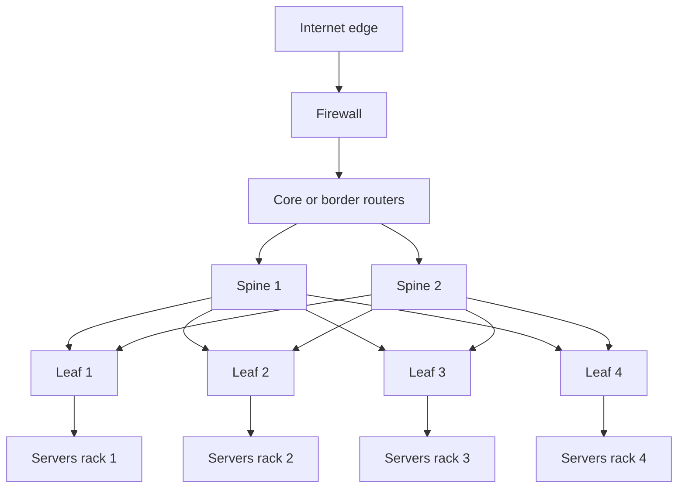

### 15.3 Three Tier Application Architecture

- Shows a classic application stack with HA load balancers, app nodes, database replication, cache, and storage.
- Use it for internal business apps, web platforms, and migration planning from legacy estates.

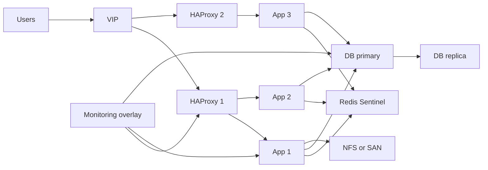

### 15.4 Kubernetes Bare Metal Cluster

- Shows a highly available Kubernetes platform on physical nodes with ingress, storage, and service advertisement.
- Use it when documenting platform services and control plane dependencies.

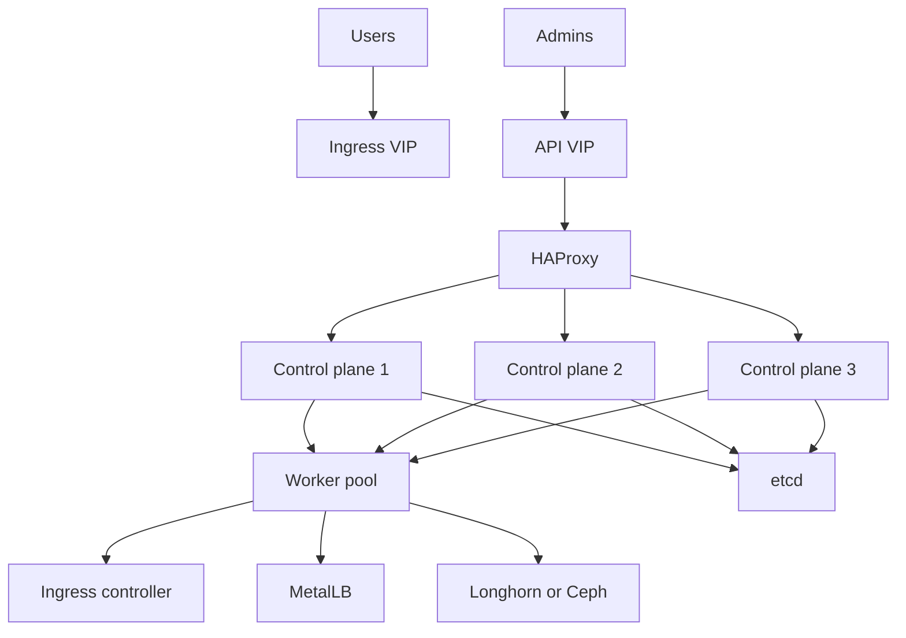

### 15.5 High Availability Active Passive Failover

- Shows two nodes managed by Pacemaker and Corosync with DRBD replication and a floating VIP.
- Use it for stateful legacy applications or simple highly available services.

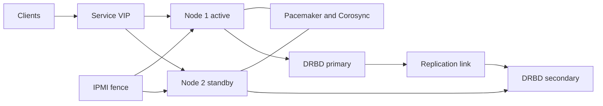

### 15.6 High Availability Active Active with Load Balancing

- Shows multiple active application nodes behind a shared load balancer with multi node storage and Galera.
- Use it for horizontally scalable web and API platforms.

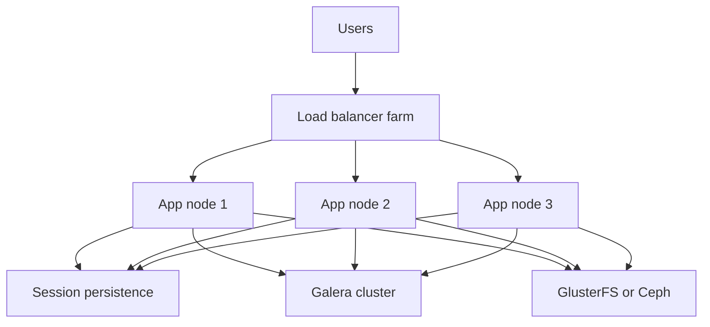

### 15.7 Disaster Recovery Flow

- Shows the movement of data and decision making from the primary site to the DR site.
- Use it to explain RTO, RPO, and failover activation points to stakeholders.

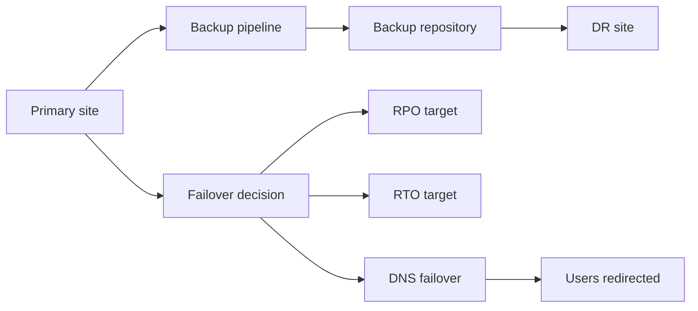

### 15.8 PXE Boot Provisioning Flow

- Shows the end to end bare metal provisioning process from firmware through unattended OS installation.
- Use it for server factory, rack expansion, and rebuild documentation.

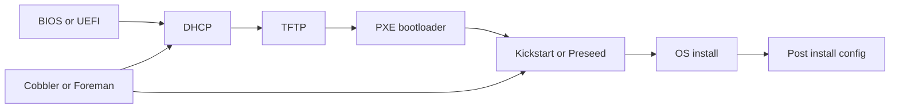

### 15.9 Monitoring Stack Architecture

- Shows metrics, logs, and alert routing across hosts, devices, and operator channels.
- Use it when designing observability and on call workflows.

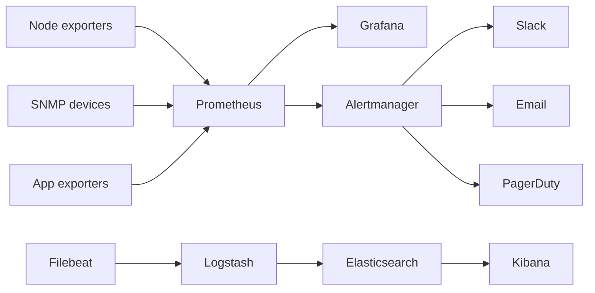

### 15.10 Security Zones and Network Segmentation

- Shows common network zones and the firewall control points between them.
- Use it for security reviews, remote access planning, and segmentation policy design.

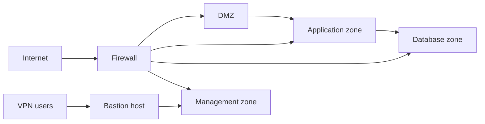

### 15.11 Backup Architecture

- Shows local, remote, and offsite backup tiers plus retention concepts.
- Use it for backup platform planning and audit evidence.

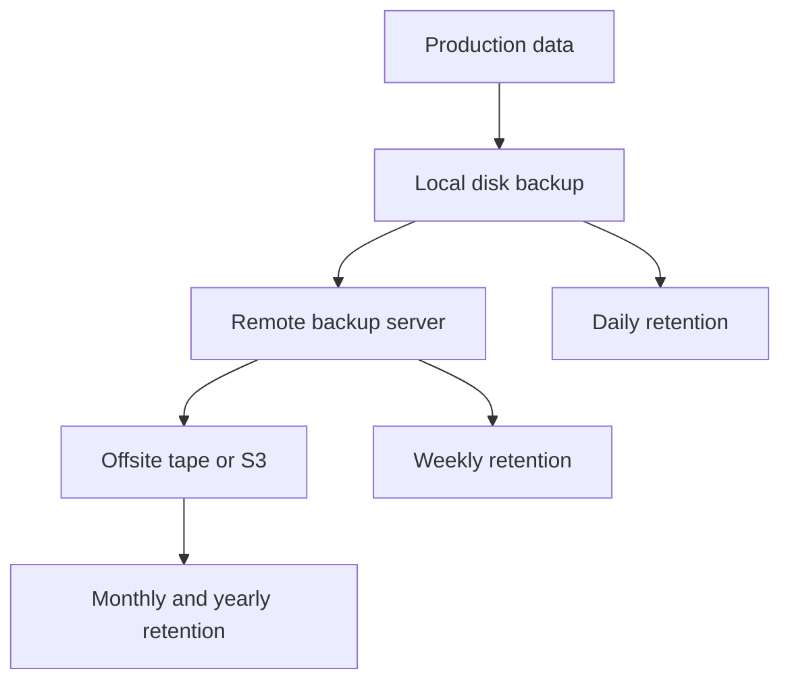

### 15.12 Full Infrastructure HLD

- Shows the end to end executive summary for a typical production bare metal platform.
- Use it in overview decks, architecture records, and environment handoff documents.

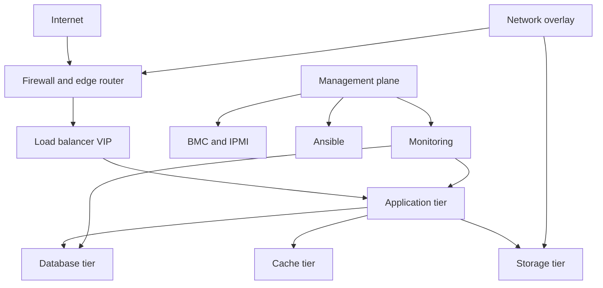

## Usage notes

- Keep Mermaid node labels short and consistent to avoid render issues.
- Split overly dense diagrams into separate views for management, data, and security planes.
- Store the source Markdown in version control and regenerate exports from the same source.
- Pair every HLD with an IP plan, VLAN map, and service inventory.

## Official references

- [Mermaid documentation](https://mermaid.js.org/)
- [Kubernetes architecture concepts](https://kubernetes.io/docs/concepts/architecture/)
- [Red Hat HA documentation](https://access.redhat.com/documentation/en-us/red_hat_enterprise_linux/9/html/configuring_and_managing_high_availability_clusters/index)
- [Prometheus architecture overview](https://prometheus.io/docs/introduction/overview/)
- [Keepalived documentation](https://keepalived.readthedocs.io/)
- [HAProxy documentation](https://www.haproxy.org/)
