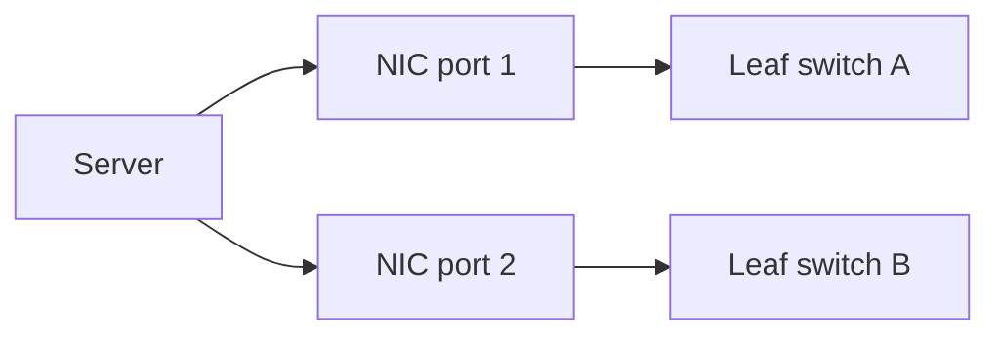
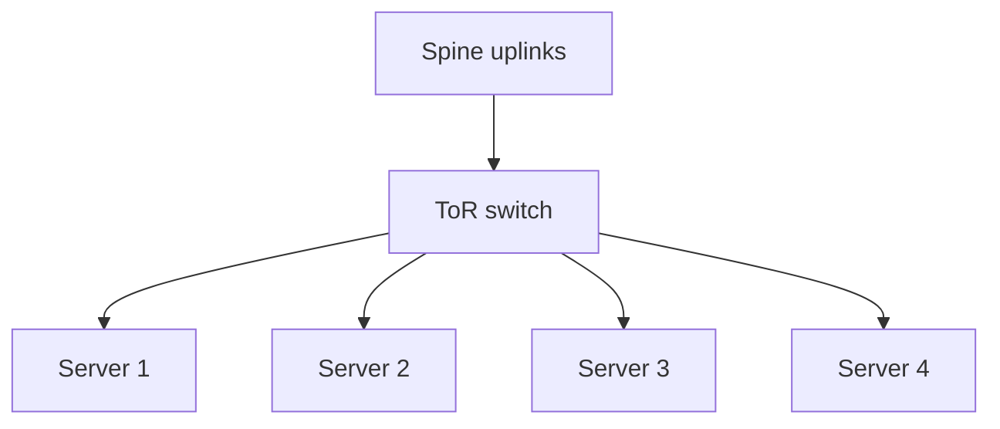
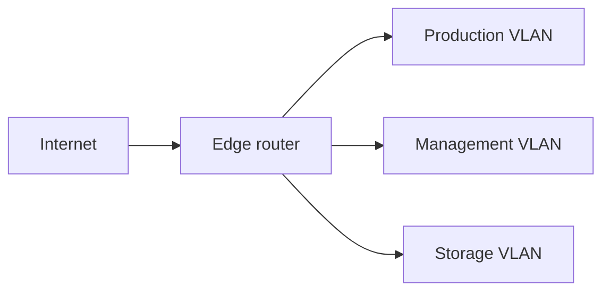
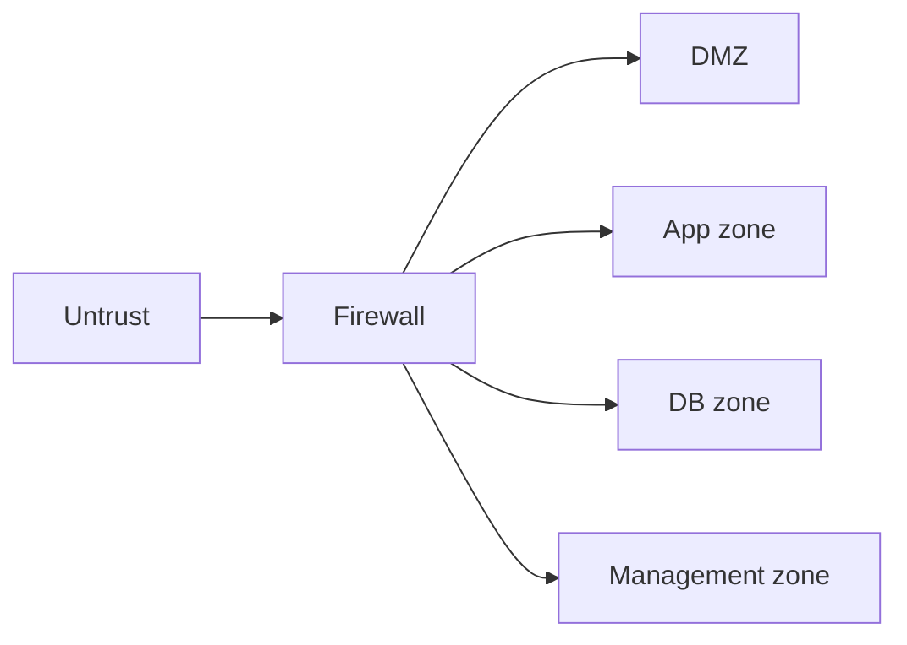
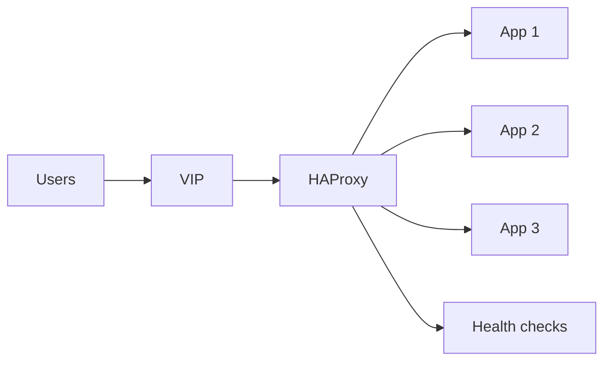
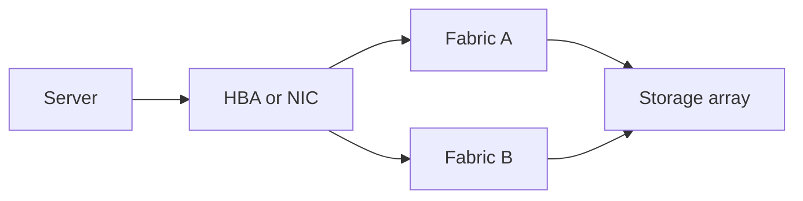
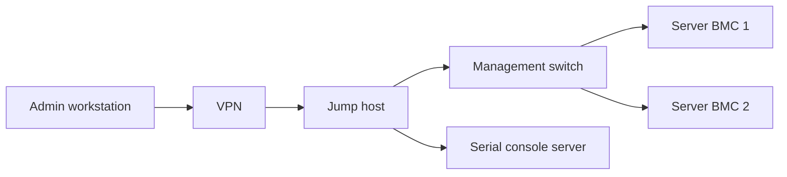
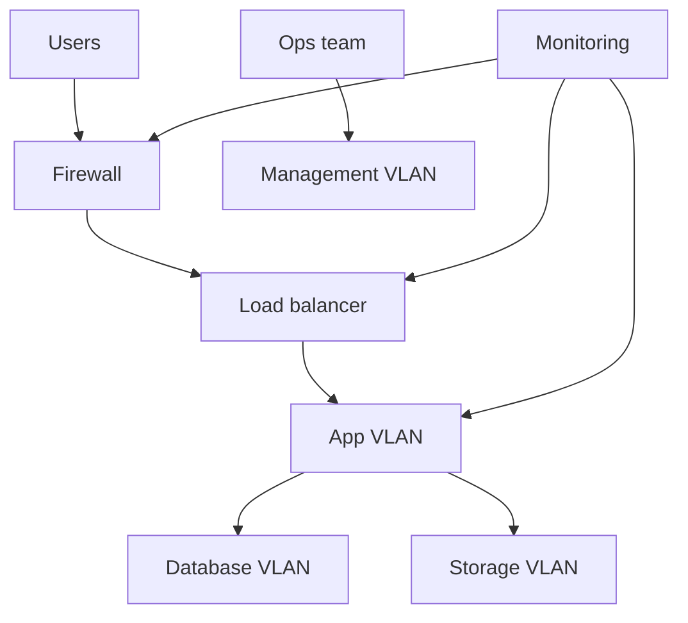

# 16. Network Components from Basic to Advanced

- **Purpose:** Explain production network building blocks used in bare metal environments from host NICs to datacenter design choices.
- **Style:** Production-oriented, concise bullets, commands, expected outputs, diagrams, and operational guardrails.
- **Audience:** Platform engineers, network engineers, SREs, systems administrators, and architects.
- **Use this guide when:** Selecting hardware, validating designs, standardizing operations, and troubleshooting physical network dependencies.
> **Disclaimer:** Third-party logos and screenshots are used for educational purposes only.

## 16.1 Network Interface Card

### What it is

- A NIC is the hardware interface that connects a server to an Ethernet or InfiniBand network.
- It provides link negotiation, MAC addressing, offloads, and queueing between the host and the wire.

### How it works

- The OS exposes each port as a network device such as `eno1`, `ens1f0`, or `enp4s0f1`.
- Packets are placed on transmit queues and processed by NIC ASICs and DMA engines.
- Receive side scaling spreads interrupts across CPU cores for throughput.

### Why it is needed in production

- Determines bandwidth ceiling, latency profile, and hardware offload capabilities.
- Affects virtualization, RDMA, storage networking, and east west traffic performance.
- NIC reliability and driver quality directly affect cluster stability.

### Types and models

| Speed | Typical use | Notes |
| --- | --- | --- |
| 1GbE | Management, legacy access | Fine for BMC and low bandwidth services |
| 10GbE | Small production clusters | Common minimum for app nodes |
| 25GbE | Modern server standard | Best balance of price and throughput |
| 100GbE | AI, storage, spine leaf uplinks | For dense east west traffic and GPU workloads |

| Form factor | When to choose | Notes |
| --- | --- | --- |
| Onboard LOM | General servers | Lowest cost, limited replaceability |
| PCIe add in | Flexible upgrade path | Easy to replace or standardize |
| OCP 3.0 | Hyperscale style builds | Clean cable path and vendor ecosystem |

### Key features

- RSS for parallel receive queues.
- RDMA for low latency storage or AI fabrics.
- SR IOV for direct VM or container access.
- Checksum, TSO, LRO, and VLAN offloads for CPU savings.

### Vendors and common families

- Intel X710 and E810.
- NVIDIA Mellanox ConnectX.
- Broadcom NetXtreme and Thor.

### How to select

- Match speed to switch tier and server role.
- Prefer two ports minimum for production hosts.
- Validate driver maturity on your OS and kernel.
- Check support for PXE, UEFI HTTP boot, SR IOV, and RDMA if required.

### Basic CLI and setup

```bash
lspci | grep -i ethernet
ip -br link
ethtool ens1f0 | egrep 'Speed|Duplex|Link detected'
ethtool -k ens1f0 | head
```

**Expected output**

```text
3b:00.0 Ethernet controller: Intel Corporation Ethernet Controller E810
ens1f0           UP             aa:bb:cc:dd:ee:ff
Speed: 25000Mb/s
Duplex: Full
Link detected: yes
```

### Bonding or teaming

- Use active backup for simple redundancy across two switches.
- Use LACP when both server and switch design support it.
- Keep identical optics, cables, speed, and MTU on both links.

### NIC redundancy diagram



## 16.2 Network cable types

### What they are

- Cables and transceivers form the physical media between NICs, switches, and patch panels.
- They define maximum speed, distance, and signal quality.

### How they work

- Copper uses electrical signaling.
- Fiber uses light through transceivers or integrated optics.
- DAC and AOC are pre terminated cable assemblies for short and medium reach links.

### Why needed in production

- Wrong media causes link flap, speed downgrade, and compatibility issues.
- Cabling determines rack layout flexibility and upgrade path.

### Media comparison

| Media | Speed range | Distance | Typical use |
| --- | --- | --- | --- |
| Cat5e | 1G | Up to 100 m | Legacy access and management |
| Cat6 | 1G and short 10G | Up to 55 m for 10G | Small rooms and short runs |
| Cat6a | 10G | Up to 100 m | Standard copper 10G structured cabling |
| Cat8 | 25G and 40G short | Up to 30 m | High speed short copper runs |
| OM3 or OM4 | 10G to 100G | Short to medium | In room and row fiber |
| OS2 | 10G to 400G | Long | Campus and metro links |
| DAC | 10G to 100G | 1 to 7 m | Cheap same rack links |
| AOC | 10G to 100G | 10 to 100 m | Simple medium reach optics |

### Transceiver quick map

| Module | Common speed | Typical port |
| --- | --- | --- |
| SFP plus | 10G | Server or switch |
| SFP28 | 25G | Server or switch |
| QSFP plus | 40G | Switch uplink |
| QSFP28 | 100G | Switch uplink or GPU fabric |

### Color coding guidance

- Use one color for management, one for production, one for storage, and one for uplinks.
- Keep color meaning documented because site conventions differ.
- Label both cable ends with rack, device, and port.

### How to select

- Same rack server to ToR at 25G: DAC is usually most cost effective.
- Cross row or noisy environment: use fiber.
- Long campus runs: OS2 single mode fiber.
- Large scale upgrades: standardize on 25G server and 100G uplink optics where budget allows.

### Basic CLI and setup

```bash
ethtool -m ens1f0 | head
ip -br link show ens1f0
lldpcli show neighbors summary
```

**Expected output**

```text
Identifier                                : 0x03
Connector                                 : SFP
ens1f0           UP
Local interface: ens1f0   Chassis: leaf01   Port: Ethernet1
```

### Cable path diagram


## 16.3 Network switch

### What it is

- A switch forwards Ethernet frames between ports based on MAC address tables.
- Access switches live near servers while aggregation and core switches handle larger routing domains.

### How it works

- Learns source MAC addresses per VLAN.
- Floods unknown unicast or broadcast as needed.
- Uses STP or routing to avoid loops.
- May also route between VLANs if it is a Layer 3 switch.

### Why needed in production

- Provides host connectivity, VLAN segmentation, uplinks, and redundancy.
- Switch features define host scale, rack density, and oversubscription.

### L2 versus L3 switch

| Type | Main function | Best fit |
| --- | --- | --- |
| Layer 2 | Frame switching, VLANs, trunks | Simple access layers |
| Layer 3 | Switching plus routing | Modern leaf and core designs |

### Types by role

- Access or ToR for rack local servers.
- Aggregation for multi rack uplinks.
- Core for campus or datacenter backbone.

### Key features

- VLANs.
- STP or RSTP.
- LACP.
- Port mirroring.
- QoS.
- PoE where edge devices require it.

### Vendors

- Cisco Catalyst and Nexus.
- Arista EOS platforms.
- Juniper EX.
- Dell PowerSwitch.
- HPE FlexNetwork.

### How to select

- Port count, port speed, and breakout options.
- Stacking or MLAG support.
- Buffer size and latency.
- Telemetry, API, and automation support.
- Cooling direction and power supply compatibility with rack design.

### Basic CLI and setup

```text
switch# show interfaces status
switch# show vlan brief
switch(config)# interface GigabitEthernet0/1
switch(config-if)# switchport mode access
switch(config-if)# switchport access vlan 100
```

**Expected output**

```text
Port      Name      Status  Vlan  Duplex Speed Type
Gi0/1               connected 100 a-full a-1000 10Gbase-SR
100       PROD_APP  active
```

### ToR switch diagram



## 16.4 Router

### What it is

- A router forwards packets between IP networks based on routing tables.
- It connects VLANs, WAN links, and internet or inter site paths.

### How it works

- Matches destination IP to a route.
- Chooses next hop based on longest prefix and routing metrics.
- Can perform NAT, ACLs, policy routing, and VPN termination.

### Why needed in production

- Required for inter VLAN routing, WAN connectivity, and north south traffic control.
- Essential in routed datacenter fabrics and edge connectivity.

### Routing protocol comparison

| Protocol | When to use | Strengths | Trade offs |
| --- | --- | --- | --- |
| Static | Small simple networks | Predictable and simple | Manual changes do not scale |
| OSPF | Single administrative domain | Fast convergence and common support | Area design required |
| BGP | Datacenter fabrics and WAN | Scalable, policy rich, ECMP friendly | More design and policy effort |

### Vendors and software

- Cisco ISR and ASR.
- Juniper MX and SRX.
- Arista routing platforms.
- MikroTik for budget conscious sites.
- Linux with FRRouting for software routing.

### How to select

- Required throughput and PPS.
- Route table scale.
- VPN or security feature needs.
- High availability options and control plane telemetry.

### Basic CLI and setup

```bash
sysctl -w net.ipv4.ip_forward=1
ip route add 10.20.30.0/24 via 10.0.1.1
ip route show
vtysh -c 'show ip route'
```

**Expected output**

```text
net.ipv4.ip_forward = 1
10.20.30.0/24 via 10.0.1.1 dev bond0
Codes: K kernel, C connected, S static, B BGP, O OSPF
```

### Routing segments diagram



## 16.5 Firewall

### What it is

- A firewall filters traffic according to policy.
- It enforces trust boundaries between internet, DMZ, applications, data, and management networks.

### How it works

- Stateless packet filters match headers only.
- Stateful firewalls track connections.
- Next generation firewalls inspect applications and user identity.
- WAFs protect HTTP applications at Layer 7.

### Why needed in production

- Limits blast radius.
- Enforces least privilege.
- Produces audit logs for security and compliance.

### Types

| Type | Layer focus | Best fit |
| --- | --- | --- |
| Packet filter | L3 and L4 | Simple filtering and host firewalls |
| Stateful firewall | L3 and L4 with connection state | Most datacenter boundaries |
| NGFW | L3 to L7 | Deep inspection and advanced policy |
| WAF | L7 HTTP | Public web application protection |

### Vendors and software

- Palo Alto PA series.
- Fortinet FortiGate.
- Cisco Firepower.
- Check Point.
- `iptables`, `nftables`, `firewalld`, pfSense, and OPNsense.

### Rule design principles

- Default deny inbound.
- Permit only required sources, ports, and protocols.
- Log critical denies.
- Separate internet, DMZ, application, database, and management zones.

### Basic CLI and setup

```bash
nft add table inet filter
nft add chain inet filter input '{ type filter hook input priority 0; policy drop; }'
nft add rule inet filter input ct state established,related accept
nft add rule inet filter input tcp dport { 22, 443 } accept
nft list ruleset
```

**Expected output**

```text
table inet filter {
    chain input {
        type filter hook input priority filter; policy drop;
        ct state established,related accept
        tcp dport { 22, 443 } accept
    }
}
```

### Rule audit checklist

- Are all allow rules justified by an application dependency.
- Are source ranges restricted.
- Is outbound control required for sensitive tiers.
- Are deny logs sent to SIEM.
- Are expired temporary rules removed.

### Zone based firewall diagram



## 16.6 Load balancer

### What it is

- A load balancer spreads traffic across multiple backends.
- It improves availability, capacity, and maintenance flexibility.

### How it works

- Layer 4 balances TCP or UDP connections.
- Layer 7 balances HTTP and HTTPS with header or path awareness.
- Health checks determine which backends are eligible.

### Why needed in production

- Removes single server dependence.
- Supports blue green and rolling updates.
- Centralizes TLS offload and access logging.

### Types and algorithms

| Type | Common tools | Best fit |
| --- | --- | --- |
| Layer 4 | HAProxy, LVS, F5 | High throughput TCP and UDP |
| Layer 7 | NGINX, HAProxy, F5 | HTTP routing and TLS termination |

| Algorithm | Best fit |
| --- | --- |
| Round robin | Similar backends |
| Least connections | Uneven long lived sessions |
| IP hash | Simple persistence |
| Weighted | Mixed node sizes |

### Hardware and software options

- F5 BIG IP.
- Citrix ADC.
- A10.
- HAProxy.
- NGINX Plus.
- Keepalived for VIP control.

### How to select

- Connection rate and TLS throughput.
- L4 only or L7 routing needs.
- Automation support and metrics.
- HA design for the load balancer itself.

### Basic CLI and setup

```cfg
frontend web_front
    bind *:80
    default_backend web_back

backend web_back
    balance leastconn
    option httpchk GET /healthz
    server app1 10.0.1.21:80 check
    server app2 10.0.1.22:80 check

listen stats
    bind 127.0.0.1:8404
    stats enable
    stats uri /stats
```

```bash
haproxy -c -f /etc/haproxy/haproxy.cfg
curl -s http://127.0.0.1:8404/stats | head
```

**Expected output**

```text
Configuration file is valid
<html><body><h1>Statistics Report for HAProxy</h1>
```

### Load balancing diagram



## 16.7 Storage networking

### What it is

- Storage networking connects servers to block or file storage systems.
- Common models are SAN, iSCSI, NFS, and SMB.

### How it works

- SAN uses Fibre Channel or iSCSI for block access.
- NAS uses file protocols such as NFS or SMB.
- Multipath I O provides redundant access to the same LUN.

### Why needed in production

- Centralizes data for clusters, virtualization, and databases.
- Enables snapshots, replication, and storage tiering.

### SAN versus NAS versus DAS

| Model | Access type | Strengths | Trade offs | Best fit |
| --- | --- | --- | --- | --- |
| SAN | Block | High performance and shared block | Cost and fabric complexity | Databases and hypervisors |
| NAS | File | Easy sharing and simple clients | More protocol overhead | Home shares and shared content |
| DAS | Local block | Fast and simple | No shared access | Single host workloads |

### Platforms and vendors

- Brocade and Cisco MDS for Fibre Channel.
- Ethernet iSCSI arrays and software targets.
- NFS and SMB appliances or Linux servers.

### How to select

- Shared block requirement or simple file share.
- Latency sensitivity.
- Multipath and fabric redundancy needs.
- Team skill set and budget.

### Basic CLI and setup

```bash
multipath -ll
iscsiadm -m session
showmount -e nfs01.example.com
```

**Expected output**

```text
mpatha dm-2 vendor,model
`-+- policy='service-time 0'
10.0.50.10:3260,1 iqn.2024-01.com.example:target1
Export list for nfs01.example.com:
/srv/shared 10.0.1.0/24
```

### Storage network diagram



## 16.8 Out of band management

### What it is

- Out of band management is a separate management network for server control even when the OS is down.
- It includes BMC interfaces, management switches, KVM over IP, and serial consoles.

### How it works

- The BMC runs independently from the host CPU and OS.
- Operators access power control, sensors, firmware console, and remote media.
- Management networks stay isolated from production traffic.

### Why needed in production

- Critical for remote recovery, crash investigation, and bare metal provisioning.
- Required for fencing in HA clusters and emergency access during network outages.

### Common platforms

- Dell iDRAC.
- HPE iLO.
- Lenovo XCC.
- IPMI compatible BMCs.
- Console servers for serial access.

### How to select

- Verify Redfish or API support.
- Ensure dedicated management ports.
- Standardize on one authentication and logging model.
- Keep the management switch redundant where feasible.

### Basic CLI and setup

```bash
ipmitool -I lanplus -H 10.0.99.21 -U admin chassis power status
ipmitool -I lanplus -H 10.0.99.21 -U admin sensor list | head
curl -k -u admin:password https://10.0.99.21/redfish/v1/Systems/1 | head
```

**Expected output**

```text
Chassis Power is on
CPU1 Temp | 38 degrees C | ok
{
  "@odata.id": "/redfish/v1/Systems/1"
```

### OOB management diagram



## 16.9 Network design for production

### What it is

- Production network design combines redundancy, segmentation, capacity planning, visibility, and documentation.
- Good design treats cabling, switching, routing, and security as one operating system.

### How it works

- Dual NICs connect to dual switches.
- VLANs or VRFs segment traffic by trust and function.
- Monitoring and telemetry expose congestion, errors, and path changes.

### Why needed in production

- Prevents single points of failure.
- Limits blast radius.
- Aligns network behavior with application SLAs.

### Core design rules

- Dual switches, dual uplinks, dual power for network gear.
- Separate management, production, storage, and backup traffic.
- Use routing instead of large flat Layer 2 domains when possible.
- Standardize MTU, QoS, and monitoring policy.

### Bandwidth planning examples

| Workload | Planning input | Example calculation |
| --- | --- | --- |
| Web tier | Peak requests and response size | 2000 rps x 100 KB approx 1.6 Gbps |
| Backup | Backup window and data size | 20 TB over 8 h approx 5.5 Gbps |
| Storage replication | Write rate and growth | 500 MBps sustained approx 4 Gbps |
| East west microservices | Service mesh chatter and pod count | Often 2 to 5x north south traffic |

### Latency guidance

| Workload | Typical target |
| --- | --- |
| Human web apps | Sub 20 ms inside site |
| Databases | Sub 2 ms host to storage where possible |
| HPC and AI east west | Lowest possible, often sub 1 ms |
| Backup | Throughput over latency |

### Monitoring and documentation

- Use SNMP, NetFlow, or sFlow.
- Keep rack diagrams, port maps, and IPAM current.
- Record optic type, cable ID, and switch port at install time.

### Production network diagram



## Official references

- [Linux kernel networking documentation](https://www.kernel.org/doc/html/latest/networking/index.html)
- [Red Hat networking documentation](https://access.redhat.com/documentation/en-us/red_hat_enterprise_linux/9/html/configuring_and_managing_networking/index)
- [Ubuntu Server networking documentation](https://documentation.ubuntu.com/server/how-to/networking/)
- [Cisco campus and datacenter design guides](https://www.cisco.com/c/en/us/solutions/design-zone/data-center-design-guides.html)
- [Arista EOS documentation](https://www.arista.com/en/support/documentation)
- [Juniper documentation](https://www.juniper.net/documentation/)
- [HAProxy documentation](https://www.haproxy.org/)
- [NVIDIA networking documentation](https://docs.nvidia.com/networking/)
- [FRRouting documentation](https://docs.frrouting.org/)
