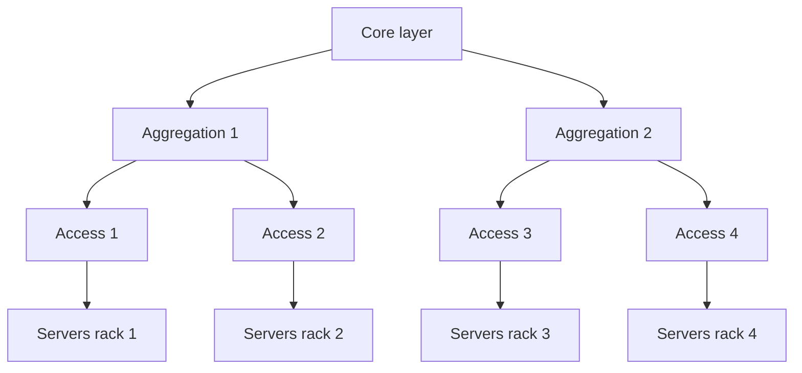
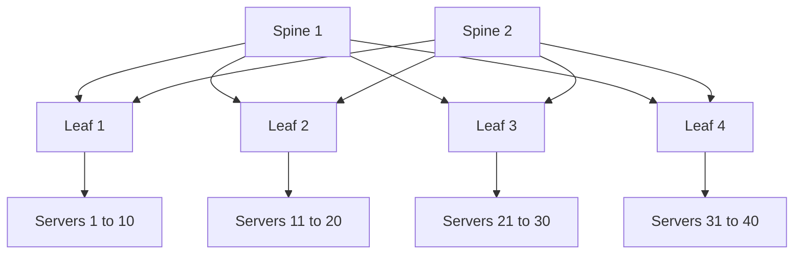
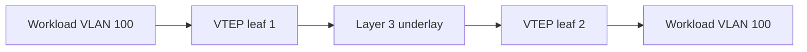
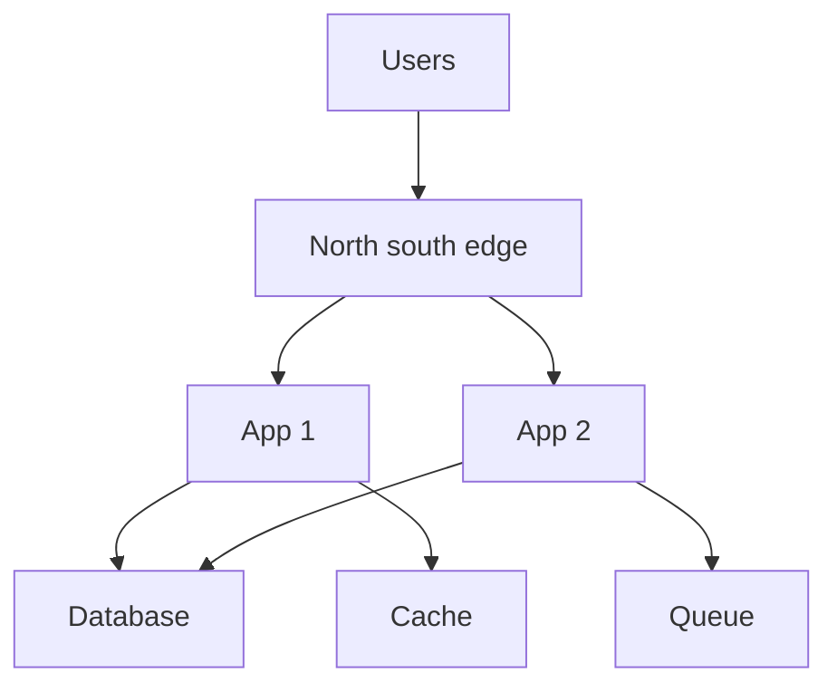
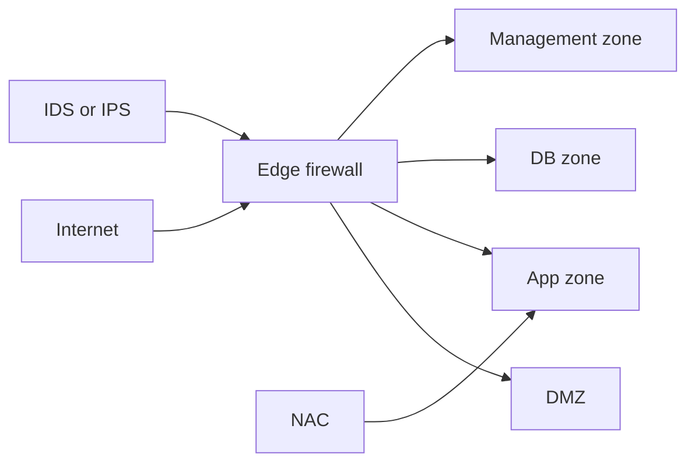

# 17. Datacenter Networking Architecture

- **Purpose:** Explain modern datacenter network design patterns for bare metal platforms from classic three tier networks to routed fabrics and automation.
- **Style:** Production-oriented, concise bullets, commands, expected outputs, diagrams, and operational guardrails.
- **Audience:** Network engineers, platform engineers, SREs, systems administrators, and architects.
- **Use this guide when:** Planning new racks, scaling east west traffic, modernizing leaf and spine fabrics, and building repeatable operations.
> **Disclaimer:** Third-party logos and screenshots are used for educational purposes only.

## 17.1 Traditional three tier architecture

- Layers:
  - Access for server attachment.
  - Aggregation for policy and uplinks.
  - Core for fast backbone routing.
- STP prevents loops in Layer 2 designs.
- Limitations:
  - STP convergence delays.
  - Blocked links waste bandwidth.
  - Aggregation becomes a bottleneck.
  - Oversubscription rises quickly as racks grow.
- Still appropriate for small or medium environments with simple east west demands.

### 17.1.1 Three tier topology



## 17.2 Spine leaf architecture

- Every leaf connects to every spine.
- Servers attach only to leaf switches.
- The design uses routing and ECMP instead of large Layer 2 domains.
- Predictable latency because each rack to rack path crosses a fixed number of hops.
- Recommended for any new datacenter build beyond a very small footprint.

### 17.2.1 Why it scales

- No blocked uplinks from STP.
- East west traffic stays efficient.
- Capacity grows by adding leafs or spines.
- Works well with BGP EVPN VXLAN fabrics.

### 17.2.2 Oversubscription planning

| Ratio | Meaning | Typical use |
| --- | --- | --- |
| 1 to 1 | Server downlink equals uplink | Storage or AI clusters |
| 2 to 1 | Moderate contention | General production |
| 3 to 1 | More shared uplink | Budget sensitive app tiers |

### 17.2.3 Spine leaf topology



### 17.2.4 Sizing example

- 2 spines with 32 ports each.
- 4 leafs with 48 downlinks and 4 uplinks each.
- 40 servers total using dual attached 25G ports.
- Uplinks at 100G give clean rack to rack bandwidth for general workloads.

## 17.3 BGP in the datacenter

- BGP replaces large Layer 2 domains and removes STP dependency in modern fabrics.
- eBGP per leaf ASN is common.
- ECMP lets traffic use multiple equal paths.
- BFD speeds failure detection.
- BGP unnumbered reduces point to point addressing overhead.

### 17.3.1 Basic FRR BGP example

```conf
router bgp 65101
 bgp router-id 10.255.1.1
 neighbor SPINE peer-group
 neighbor SPINE remote-as external
 neighbor swp49 interface peer-group SPINE
 neighbor swp50 interface peer-group SPINE
 address-family ipv4 unicast
  network 10.1.1.0/24
 exit-address-family
```

```bash
vtysh -c 'show ip bgp summary'
vtysh -c 'show bfd peers'
```

**Expected output**

```text
Neighbor        V    AS    MsgRcvd  MsgSent  UpDown State
swp49           4 65001       120      118  01:22:10 Estab
swp50           4 65002       122      121  01:22:10 Estab
Peer             Status
swp49            up
```

### 17.3.2 Route policy notes

- Advertise loopbacks and rack local prefixes only.
- Filter anything unexpected at fabric edges.
- Use communities for policy where fabrics grow beyond simple defaults.

## 17.4 OSPF in the datacenter

- OSPF still fits smaller single domain environments.
- Easier to explain for teams with classic enterprise routing backgrounds.
- Use area 0 as the backbone and limit complexity unless scale demands more structure.

### 17.4.1 FRR OSPF example

```conf
router ospf
 ospf router-id 10.255.1.1
 network 10.0.0.0/31 area 0
 network 10.1.1.0/24 area 0
```

```bash
vtysh -c 'show ip ospf neighbor'
vtysh -c 'show ip route ospf'
```

**Expected output**

```text
Neighbor ID     Pri State           Dead Time Address         Interface
10.255.0.1        1 Full            00:00:34 10.0.0.0        swp49
O   10.1.2.0/24 [110/20] via 10.0.0.0, swp49
```

### 17.4.2 OSPF versus BGP

| Feature | OSPF | BGP |
| --- | --- | --- |
| Best fit | Small to medium single domain | Modern fabrics and large policy driven networks |
| ECMP support | Yes | Yes |
| Policy depth | Moderate | High |
| Operational style | Simpler start | Better long term scale |

## 17.5 VXLAN

- VXLAN extends Layer 2 segments across a Layer 3 underlay.
- Uses VNIs instead of being limited to 4094 VLANs.
- VTEPs sit on leaf switches or hosts.
- EVPN provides a clean control plane for MAC and IP advertisement.

### 17.5.1 Why it matters

- Enables multi tenant segmentation.
- Supports workload mobility across racks.
- Fits Kubernetes, virtualization, and stretch cluster overlays when justified.

### 17.5.2 VXLAN and VTEP diagram



### 17.5.3 Validation commands

```bash
ip -d link show vxlan100
bridge fdb show dev vxlan100 | head
vtysh -c 'show bgp l2vpn evpn summary'
```

**Expected output**

```text
vxlan100: mtu 1450 state UP
00:11:22:33:44:55 dst 10.255.1.2 self permanent
Neighbor        V    AS    State
10.255.1.2      4 65102    Estab
```

## 17.6 Software defined networking

- SDN separates the control plane from device data planes.
- Controllers push policy and topology intent to the network.
- Common platforms include OpenDaylight, ONOS, VMware NSX, and Cisco ACI.
- Consider SDN when you need centralized segmentation, automation, and rapid tenant provisioning.

### 17.6.1 Traditional versus SDN

| Topic | Traditional network | SDN approach |
| --- | --- | --- |
| Change model | Device by device | Intent and policy based |
| Visibility | Per device CLI | Central controller and telemetry |
| Automation | Optional | Core operating model |
| Risk | Human config drift | Controller dependence and design complexity |

## 17.7 Network automation

- Use Ansible for repeatable switch and router changes.
- Use NetBox for IPAM and DCIM source of truth.
- Use NAPALM for multi vendor abstraction.
- Store configs in Git and run change validation in CI.

### 17.7.1 Example Ansible playbook for VLAN provisioning

```yaml
- name: Provision access VLAN on switches
  hosts: leafs
  connection: network_cli
  gather_facts: false
  tasks:
    - name: Ensure VLAN 120 exists
      cisco.ios.ios_config:
        lines:
          - vlan 120
          - name PROD_APP
    - name: Put interface in access VLAN 120
      cisco.ios.ios_config:
        parents: interface GigabitEthernet0/1
        lines:
          - switchport mode access
          - switchport access vlan 120
```

## 17.8 Traffic engineering

- East west traffic dominates modern datacenters because apps call databases, caches, and peer services continuously.
- North south traffic still matters at the internet or WAN edge.
- Use ECMP, QoS, and good topology placement to reduce hotspots.
- Mark critical traffic with DSCP only where the policy is consistent end to end.

### 17.8.1 Bandwidth planning formula

- Required throughput equals concurrent flows multiplied by average payload rate and protocol overhead.
- Always reserve headroom for failure scenarios because one uplink or leaf can disappear during an incident.

### 17.8.2 East west versus north south



## 17.9 Network security in the datacenter

- Use micro segmentation between workload classes.
- Adopt Zero Trust ideas for identity, posture, and least privilege.
- Use NAC with 802.1X where port level trust matters.
- Place IDS or IPS inline for enforcement or on taps for visibility.
- Prepare DDoS controls at the edge with rate limiting or upstream scrubbing.

### 17.9.1 Security zones diagram



## 17.10 Network troubleshooting at scale

- Core tools:
  - `traceroute` and `mtr` for path visibility.
  - `tcpdump` and `tshark` for packets.
  - `iperf3` for throughput.
  - `nmap` for reachability and service checks.
- Monitoring:
  - SNMP with LibreNMS or Zabbix.
  - NetFlow or sFlow with ntopng or Elastiflow.
- Common issues:
  - MTU mismatches.
  - Asymmetric routing.
  - ARP storms.
  - Broadcast storms.
  - Optic mismatch or CRC errors.

### 17.10.1 Common commands

```bash
mtr --report --report-cycles 10 10.0.1.1
tcpdump -ni bond0 vlan 120 -c 20
iperf3 -c 10.0.1.50 -P 4
nmap -Pn -p 179,443,6443 10.0.1.10
```

**Expected output**

```text
HOST: node1 Loss%   Snt   Last   Avg  Best  Wrst StDev
1. 10.0.1.1 0.0%    10   0.4   0.5   0.3   1.0   0.2
[SUM]   0.00-10.00 sec  11.2 GBytes  9.62 Gbits/sec
179/tcp open  bgp
6443/tcp open  kubernetes-api
```

### 17.10.2 Runbook template

| Step | Question | Example action |
| --- | --- | --- |
| Detect | What broke and when | Pull alerts, change timeline, blast radius |
| Isolate | Which layer is affected | Link, VLAN, routing, ACL, host, app |
| Measure | How big is the impact | Compare path, error counters, and flow loss |
| Mitigate | Lowest risk fix | Drain traffic, disable bad link, roll back config |
| Verify | Is service stable | Repeat tests and watch metrics |
| Document | How to prevent repeat | Create RCA and config guardrails |

## Official references

- [Cisco datacenter design guides](https://www.cisco.com/c/en/us/solutions/design-zone/data-center-design-guides.html)
- [Arista EVPN VXLAN documentation](https://www.arista.com/en/um-eos/eos-evpn-and-vxlan)
- [Juniper EVPN VXLAN documentation](https://www.juniper.net/documentation/)
- [FRRouting documentation](https://docs.frrouting.org/)
- [BGP RFC overview](https://www.rfc-editor.org/rfc/rfc4271)
- [VXLAN RFC overview](https://www.rfc-editor.org/rfc/rfc7348)
- [EVPN RFC overview](https://www.rfc-editor.org/rfc/rfc7432)
- [Ansible network automation documentation](https://docs.ansible.com/ansible/latest/network/getting_started/index.html)
- [NetBox documentation](https://netbox.readthedocs.io/)
