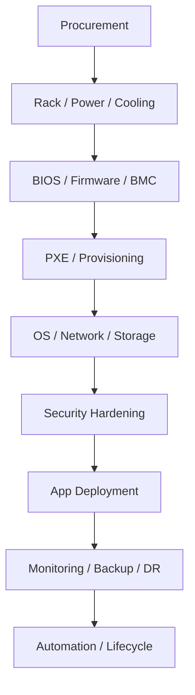
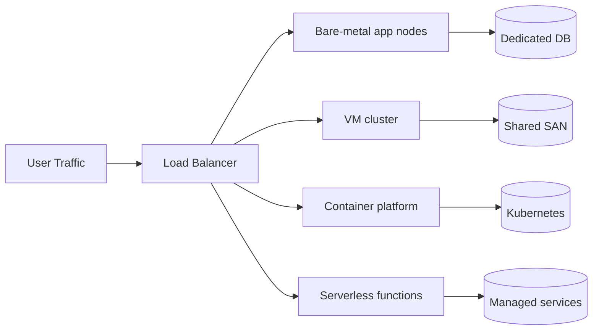
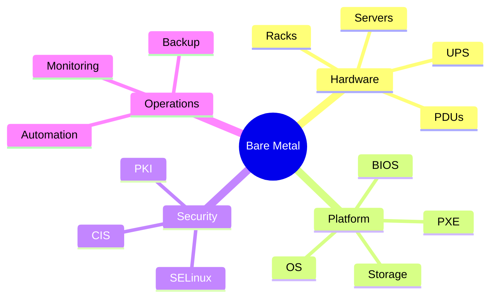

# Bare-Metal Infrastructure. Guide Index and Overview

- **Purpose:** Provide a high-level map for building and operating production bare-metal platforms end to end.
- **Style:** Production-oriented, concise bullets, commands, expected outputs, diagrams, and operational guardrails.
- **Audience:** Platform engineers, SREs, systems administrators, datacenter operators, and architects.
- **Use this guide when:** Building, refreshing, or auditing physical server infrastructure.
> **Disclaimer:** Third-party logos and screenshots are used for educational purposes only.

## What is bare-metal infrastructure

- Physical servers dedicated to a single tenant or workload with no mandatory hypervisor abstraction layer.
- Direct control over BIOS/UEFI, firmware, storage controllers, NICs, topology, power, and lifecycle management.
- Common for latency-sensitive systems, regulated workloads, data-intensive platforms, edge sites, and appliance-style deployments.
- Usually paired with out-of-band management, automated provisioning, centralized logging, and configuration management.
- Can still run VMs, containers, and Kubernetes; “bare metal” describes the substrate, not the application model.

### Architecture overview

## When to choose bare-metal

- Need predictable low latency, deterministic CPU scheduling, or direct device access.
- Require high core counts, local NVMe density, GPU/FPGA acceleration, or large memory footprints.
- Must satisfy data sovereignty, licensing, or compliance constraints that disallow public cloud tenancy models.
- Operate steady-state workloads where capital expense is cheaper than long-term on-demand cloud spend.
- Need custom networking, jumbo frames, DPDK, SR-IOV, or specialized storage controllers.

## When cloud or hybrid is better

- Short-lived or bursty workloads benefit from elastic cloud capacity.
- Global expansion is faster in cloud when you lack datacenter footprint and carrier contracts.
- Teams with limited hardware operations staff may prefer managed control planes and storage services.
- Hybrid is ideal when regulated data remains on-prem but front-end, analytics, or DR use cloud services.
- Use cloud for ephemeral CI runners, sandbox environments, or public-facing edge caches around core bare-metal systems.

## Decision matrix: bare-metal vs VM vs container vs serverless

| Model | Best for | Strengths | Trade-offs |
| --- | --- | --- | --- |
| Bare metal | Databases, HFT, storage nodes, hypervisors | Performance, hardware control, isolation | CapEx, slower scaling, ops-heavy |
| VM | Mixed enterprise apps, legacy stacks | Isolation, snapshots, consolidation | Hypervisor overhead, licensing |
| Container | Microservices, CI/CD, stateless apps | Density, portability, fast rollout | Needs strong orchestration and host hygiene |
| Serverless | Event-driven APIs, glue code, burst jobs | No server management, rapid scale | Cold starts, runtime limits, platform lock-in |

### Deployment model comparison

## Operating model summary

- Hardware lifecycle: source, receive, rack, cable, burn-in, document, warranty-track, refresh, decommission.
- Control planes: BMC/IPMI, PXE/Cobbler/MAAS, DNS/DHCP/IPAM, configuration management, observability, backup.
- Network segmentation: management, production, storage, backup, and optionally cluster interconnect.
- Storage choices: local RAID/LVM, SAN, NAS, or distributed storage such as Ceph/GlusterFS.
- Security baseline: CIS controls, MFA on management planes, patching, audit logs, and certificate hygiene.

## Cost considerations summary

| Cost area | Typical driver | Optimization note |
| --- | --- | --- |
| Servers | CPU generation, memory, NVMe count, warranty years | Standardize SKUs and buy in volume |
| Networking | 25/100G optics, ToR redundancy, support contracts | Prefer repeatable leaf designs |
| Power/Cooling | Rack density, PUE, dual feeds | Right-size density to facility limits |
| Software | OS, hypervisor, backup, security, monitoring | Prefer open source where support model fits |
| Staffing | Remote hands, admins, on-call depth | Automate provisioning and patching early |
| Refresh | 3–5 year lifecycle, spares, data sanitization | Budget for staggered refresh waves |

## Guide map

| File | Primary outcome |
| --- | --- |
| [README.md](./README.md) | Architecture overview and decision framing |
| [01-hardware-procurement.md](./01-hardware-procurement.md) | Select servers, racks, power, and vendor SLAs |
| [02-datacenter-setup.md](./02-datacenter-setup.md) | Prepare facility, rack, power, cooling, and security |
| [03-server-bios-firmware.md](./03-server-bios-firmware.md) | Configure BIOS/UEFI, BMC, RAID, TPM, and firmware |
| [04-os-installation.md](./04-os-installation.md) | Automate OS installs with PXE, Kickstart, Preseed, and Cobbler |
| [05-network-configuration.md](./05-network-configuration.md) | Build production-ready networks, bonds, VLANs, and firewalling |
| [06-storage-configuration.md](./06-storage-configuration.md) | Deploy local, SAN, NAS, and distributed storage |
| [07-security-hardening.md](./07-security-hardening.md) | Apply baseline security controls and compliance scanning |
| [08-application-deployment.md](./08-application-deployment.md) | Run web, app, DB, cache, queue, and container workloads |
| [09-monitoring-observability.md](./09-monitoring-observability.md) | Implement monitoring, logging, alerting, and SLOs |
| [10-backup-disaster-recovery.md](./10-backup-disaster-recovery.md) | Design backups, restore workflows, and DR runbooks |
| [11-automation-at-scale.md](./11-automation-at-scale.md) | Automate fleet provisioning, patching, CMDB, and lifecycle |
| [12-troubleshooting.md](./12-troubleshooting.md) | Use structured troubleshooting across hardware, OS, network, and apps |
| [13-high-availability-clusters.md](./13-high-availability-clusters.md) | Build HA clusters with Pacemaker, DRBD, shared filesystems, and HA load balancers |
| [14-kubernetes-baremetal.md](./14-kubernetes-baremetal.md) | Deploy HA Kubernetes on bare metal with kubeadm, MetalLB, and persistent storage |
| [15-architecture-diagrams.md](./15-architecture-diagrams.md) | Reuse Mermaid HLD diagrams for racks, networks, HA, DR, and Kubernetes |
| [16-network-components.md](./16-network-components.md) | Understand production network components from NICs and switches to OOB management |
| [17-datacenter-networking.md](./17-datacenter-networking.md) | Design routed datacenter fabrics with spine leaf, BGP, VXLAN, and automation |

### Operational domains

## Quick usage sequence

- Start with hardware procurement before signing power, rack, and cross-connect contracts.
- Validate facility constraints before choosing dense GPU or NVMe-heavy configurations.
- Standardize firmware baselines and install workflows before production rollout.
- Deploy security, monitoring, and backup controls before onboarding applications.
- Automate every repeatable step after the first successful manual pilot.

## Troubleshooting

- If the scope is greenfield, follow files 01 through 12 in order.
- If the scope is a datacenter refresh, jump to files 01, 02, 03, 09, 10, and 11 first.
- If the scope is an incident, start with 12-troubleshooting.md and then the relevant domain guide.
- If lifecycle documentation diverges from reality, update CMDB/IPAM and as-built diagrams immediately.

## Official references

- [Red Hat documentation](https://access.redhat.com/documentation/en-us)
- [Ubuntu Server documentation](https://documentation.ubuntu.com/server/)
- [Dell PowerEdge manuals](https://www.dell.com/support/home/en-us/product-support/product/poweredge-r760/docs)
- [HPE ProLiant documentation](https://support.hpe.com/connect/s/product?language=en_US)
- [Lenovo ThinkSystem docs](https://pubs.lenovo.com/)
- [Supermicro support](https://www.supermicro.com/support/)
- [Uptime Institute overview](https://uptimeinstitute.com/tiers)
