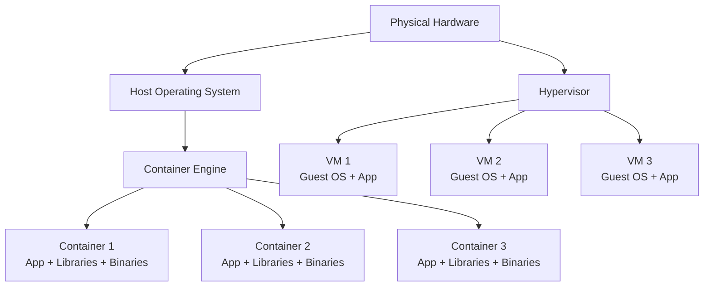
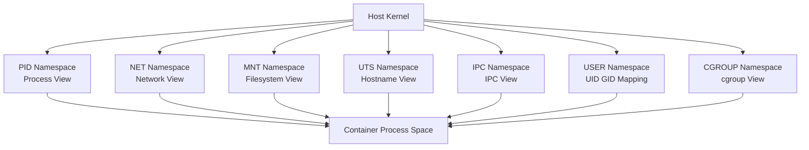
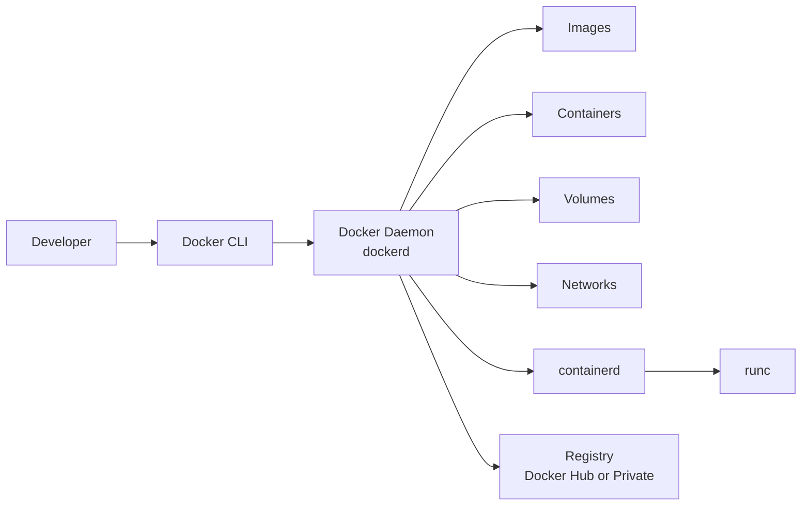
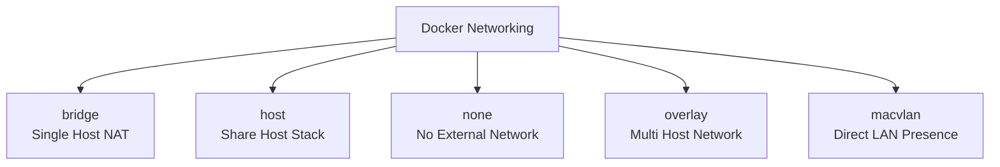
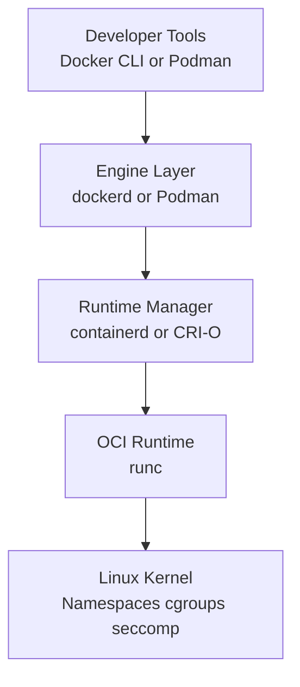

# Linux Containers & Docker Guide

> A production-oriented guide to Linux containers and Docker, covering fundamentals through advanced topics with practical examples, security guidance, troubleshooting workflows, and architecture diagrams.

---

## Table of Contents

1. [Container Fundamentals](#1-container-fundamentals)
2. [Linux Kernel Features](#2-linux-kernel-features)
3. [Docker](#3-docker)
4. [Dockerfile](#4-dockerfile)
5. [Docker Networking](#5-docker-networking)
6. [Docker Volumes & Storage](#6-docker-volumes--storage)
7. [Docker Compose](#7-docker-compose)
8. [Container Runtimes](#8-container-runtimes)
9. [Container Security](#9-container-security)
10. [Container Orchestration Basics](#10-container-orchestration-basics)
11. [Troubleshooting](#11-troubleshooting)
12. [Real-World Patterns](#12-real-world-patterns)
13. [Command Cheat Sheet](#13-command-cheat-sheet)
14. [Glossary](#14-glossary)
15. [Further Reading & Practice Plan](#15-further-reading--practice-plan)

---

# 1. Container Fundamentals

## 1.1 What Is a Container?

A container is a lightweight, isolated execution environment that packages:

- An application
- Its runtime
- Its libraries
- Its dependencies
- Its configuration

Unlike a virtual machine, a container does **not** include a full guest operating system kernel.
Containers share the host kernel while isolating processes, filesystems, networking, and resources.

A practical definition:

- A container is a process or set of processes
- Running with Linux kernel isolation primitives
- Often using a layered filesystem
- Often packaged as an OCI-compatible image

Containers are popular because they:

- Improve portability
- Reduce “works on my machine” problems
- Start quickly
- Use fewer resources than VMs
- Simplify CI/CD and deployment pipelines

## 1.2 Why Containers Exist

Before containers, teams often deployed applications directly on servers.
That created problems:

- Dependency conflicts between apps
- Environment drift between dev, test, and prod
- Hard rollbacks
- Difficult scaling
- Long provisioning times

Containers address these issues by standardizing the application package and its runtime environment.

## 1.3 Core Container Properties

A good containerized workload usually has these characteristics:

| Property | Meaning | Why It Matters |
|---|---|---|
| Isolated | Separated process, network, and mount view | Limits interference between workloads |
| Portable | Runs consistently across systems with compatible runtimes | Simplifies deployment |
| Immutable | Image contents do not change at runtime | Predictable behavior |
| Ephemeral | Containers can be replaced instead of patched in place | Safer operations |
| Declarative | Built and run from code/config | Easier automation |

## 1.4 Container vs Virtual Machine

Containers and VMs both provide isolation, but they operate at different layers.

### Containers

- Share the host kernel
- Package application + userspace dependencies
- Start fast
- Usually smaller images
- Higher density on the same hardware

### Virtual Machines

- Virtualize hardware
- Each VM runs its own guest OS kernel
- Stronger isolation boundary in many cases
- Heavier footprint
- Slower startup

## 1.5 Container vs VM Comparison Table

| Area | Containers | Virtual Machines |
|---|---|---|
| Isolation layer | OS-level | Hardware-level via hypervisor |
| Kernel | Shared with host | Separate guest kernel per VM |
| Startup time | Seconds or less | Seconds to minutes |
| Image size | Often MB to low GB | Often GBs |
| Density | High | Lower |
| Portability | Very good within compatible architectures/kernels | Good but heavier |
| Security boundary | Good but kernel-sharing matters | Usually stronger boundary |
| Use cases | Microservices, CI, batch jobs, dev environments | Full OS isolation, legacy apps, strong tenancy |

## 1.6 Mermaid Diagram: Container vs VM Architecture



## 1.7 What Containers Are Not

Containers are not:

- Magic security boundaries
- Replacements for good OS hardening
- Always stateless by default
- Always smaller than VMs in every workload
- Limited only to microservices

You can run many workload types in containers:

- Web services
- Batch jobs
- CI tasks
- Message consumers
- Databases in some scenarios
- Developer tooling

## 1.8 The OCI Standard

OCI stands for **Open Container Initiative**.
It defines standards that let different tools interoperate.

Key OCI specifications:

| Spec | Purpose |
|---|---|
| OCI Image Spec | Defines container image format |
| OCI Runtime Spec | Defines how a runtime should run a container |
| OCI Distribution Spec | Standardizes image distribution APIs |

Why OCI matters:

- Images built by one tool can often run in another
- Vendors can innovate without locking you into a single format
- Ecosystem tools can target shared standards

## 1.9 OCI Image Basics

An OCI image typically contains:

- Metadata
- Configuration
- One or more layers
- Content-addressable digests

Important image terms:

| Term | Meaning |
|---|---|
| Layer | Immutable filesystem delta |
| Manifest | Metadata describing layers and config |
| Digest | Content hash, usually SHA-256 |
| Tag | Human-friendly mutable name |

## 1.10 OCI Runtime Basics

The OCI runtime spec describes how a runtime launches containers.
A low-level runtime like `runc` receives a bundle and creates a container using Linux kernel features.

## 1.11 Containers as Processes

A crucial concept:

**A container is fundamentally a process on the host.**

You can often inspect container processes using normal Linux tools:

```bash
ps aux
ps -ef
pstree -a
```

This matters because debugging containers often means debugging processes, namespaces, cgroups, and mounts.

## 1.12 Images vs Containers

These terms are often confused.

| Term | Meaning |
|---|---|
| Image | Read-only template used to create containers |
| Container | Running or stopped instance created from an image |

Analogy:

- Image = class blueprint
- Container = object instance

## 1.13 Layered Filesystem Concept

Most container images use layered filesystems.
Each Dockerfile instruction can create a new layer.
At runtime, the container gets a writable layer on top.

Benefits:

- Efficient storage reuse
- Fast pulls when layers are cached
- Easier incremental builds

Trade-offs:

- Too many layers can hurt clarity
- Large layers can slow pull/push/build time
- Deleting files later does not always shrink prior layers

## 1.14 Stateless vs Stateful Containers

A common principle:

- Put mutable data outside the container writable layer
- Use volumes, bind mounts, or external services for persistence

Stateless examples:

- API services
- Frontend servers
- Workers that read/write external storage

Stateful examples:

- Databases
- Queues
- Stateful batch tools

## 1.15 Immutable Infrastructure Mindset

With containers, prefer:

- Rebuild image for changes
- Redeploy new image
- Replace old containers

Avoid:

- SSH into running containers to patch software
- Manual hot-fixes inside containers
- Treating containers like pets

## 1.16 Typical Container Workflow

1. Write application code
2. Define Dockerfile
3. Build image
4. Push image to registry
5. Run container locally or in orchestration platform
6. Monitor, update, and replace when needed

## 1.17 Common Use Cases

- Developer environments
- Continuous integration runners
- Packaging CLI tools
- Blue/green deployments
- Scalable microservices
- Reproducible data processing jobs

## 1.18 Advantages of Containers

- Fast startup
- Efficient resource usage
- Reproducible environments
- Easy dependency packaging
- Simplified deployment pipelines
- Better scaling patterns

## 1.19 Limitations of Containers

- Shared-kernel security model
- Need Linux kernel compatibility concepts
- Complex networking at scale
- Persistent storage requires careful design
- Debugging minimal images can be harder

## 1.20 When to Use Containers

Use containers when you want:

- Consistent deployment artifacts
- Automated build and release flows
- Environment isolation
- Efficient packaging of dependencies
- Scalable service deployment

## 1.21 When Not to Use Containers Blindly

Containers may not be ideal when:

- You need strong VM-level isolation for hostile multi-tenancy
- You have very low-level kernel-coupled software requirements
- The operational complexity exceeds the value for a tiny static deployment

## 1.22 Example: Running a Simple Container

```bash
docker run --rm hello-world
```

What happens conceptually:

1. Docker checks for the image locally
2. Pulls it if missing
3. Creates container metadata
4. Sets up filesystem, namespaces, cgroups, and networking
5. Starts the configured process
6. Streams output
7. Removes container when finished because of `--rm`

## 1.23 Example: Interactive Shell Container

```bash
docker run --rm -it ubuntu:24.04 bash
```

Flags explained:

| Flag | Meaning |
|---|---|
| `--rm` | Remove container after exit |
| `-i` | Keep STDIN open |
| `-t` | Allocate a pseudo-TTY |

## 1.24 Basic Terms You Must Know

| Term | Short Definition |
|---|---|
| Registry | Image storage/distribution service |
| Repository | Collection of image tags |
| Tag | Mutable image reference |
| Digest | Immutable content hash |
| Runtime | Software that runs containers |
| Namespace | Isolation primitive |
| cgroup | Resource control/accounting primitive |
| Volume | Persistent data storage mechanism |
| Entrypoint | Main process definition |

## 1.25 Container Lifecycle

Typical states:

- Created
- Running
- Paused
- Exited
- Removed

## 1.26 Why PID 1 Matters

Inside a container, the main process often becomes PID 1 in that container namespace.
PID 1 has special signal-handling and zombie-reaping behavior.
If your app is PID 1, you must think about:

- SIGTERM handling
- Graceful shutdown
- Child process reaping

## 1.27 Single Process Per Container?

Best practice often says one main concern per container.
That does **not** literally mean exactly one OS process at all times.
It means:

- One primary responsibility
- Clear lifecycle ownership
- Avoid bundling unrelated services together

## 1.28 Container Misconceptions

Misconception: containers are just lightweight VMs.

Better view:

- Containers are isolated processes with packaged userspace
- They feel VM-like operationally, but work differently technically

## 1.29 Production Guidelines from the Start

- Pin image versions
- Use non-root users where possible
- Keep images small
- Prefer immutable deployments
- Externalize config
- Add health checks carefully
- Set CPU and memory limits
- Log to stdout/stderr

## 1.30 Summary

Containers package applications efficiently by leveraging kernel isolation and layered images.
Understanding that they are isolated processes rather than mini-VMs is the foundation for everything else in this guide.

---

# 2. Linux Kernel Features

## 2.1 Why Kernel Features Matter

Containers are enabled by Linux kernel primitives.
Docker and other runtimes orchestrate these primitives; they do not invent isolation from scratch.

The most important container-related kernel features are:

- Namespaces
- cgroups
- Capabilities
- seccomp
- Union/overlay filesystems
- LSMs such as AppArmor and SELinux

## 2.2 Namespaces Overview

Namespaces provide isolated views of system resources.
Each namespace type isolates a specific aspect of the system.

Main namespace types used by containers:

| Namespace | Purpose |
|---|---|
| PID | Process ID isolation |
| NET | Network stack isolation |
| MNT | Mount point isolation |
| UTS | Hostname and domain isolation |
| IPC | Inter-process communication isolation |
| USER | User/group ID mapping |
| CGROUP | cgroup view isolation |

## 2.3 PID Namespace

A PID namespace gives a container its own process numbering space.
Inside the container, the main process may appear as PID 1.

Benefits:

- Process lists are isolated
- Signals and supervision behave more predictably inside the container

Example concept:

- Host sees container process as PID 12345
- Container sees same process as PID 1

## 2.4 NET Namespace

A network namespace provides isolated network devices, routes, firewall rules, and ports.
Each container can have its own:

- Interfaces
- IP addresses
- Routing table
- ARP table
- iptables/nftables view

This is why multiple containers can each listen on port 80 internally.

## 2.5 MNT Namespace

The mount namespace isolates filesystem mount points.
A container can see its own root filesystem and mounted volumes without exposing all host mounts.

## 2.6 UTS Namespace

The UTS namespace isolates hostname and NIS domain name.
A container can have its own hostname independent of the host.

## 2.7 IPC Namespace

The IPC namespace isolates System V IPC and POSIX message queues/shared memory objects.
This helps prevent unrelated workloads from interfering through shared IPC resources.

## 2.8 USER Namespace

User namespaces map container user IDs to host user IDs.
This is foundational for rootless containers and stronger privilege separation.

Example:

- Container UID 0 may map to an unprivileged host UID range
- Container “root” is not host root

## 2.9 CGROUP Namespace

The cgroup namespace isolates the view of cgroup paths.
This is more about visibility and consistency than the primary enforcement itself.

## 2.10 Mermaid Diagram: Namespace Isolation Layers



## 2.11 cgroups Overview

Control groups, or cgroups, control and measure resource usage.
They are essential for:

- CPU limits
- Memory limits
- I/O controls
- Process count limits
- Accounting and monitoring

Without cgroups, containers would isolate views but not necessarily constrain resource consumption.

## 2.12 What cgroups Can Control

Typical resources:

| Resource | Example Control |
|---|---|
| CPU | Shares, quotas, cpuset |
| Memory | Hard limit, swap behavior |
| PIDs | Max process count |
| Block I/O | Weight or throttling |
| Huge pages | Reservation/limits |

## 2.13 cgroups v1 vs v2

cgroups v1 and v2 differ significantly.
Modern Linux distributions increasingly prefer v2.

### cgroups v1

- Multiple independent hierarchies
- Separate controllers often mounted separately
- More fragmented model

### cgroups v2

- Unified hierarchy
- More consistent semantics
- Better delegation model
- Preferred for many modern systems

## 2.14 cgroups v1 vs v2 Table

| Feature | v1 | v2 |
|---|---|---|
| Hierarchy | Multiple | Unified |
| Controller model | Independent | Unified and stricter |
| Delegation | Harder | Improved |
| Modern recommendation | Legacy but still common | Preferred when supported |

## 2.15 Memory Limits

Memory control is one of the most important production settings.
Without memory limits:

- A container may exhaust host memory
- The kernel OOM killer may terminate arbitrary processes

Example Docker run:

```bash
docker run --memory=512m --memory-swap=1g nginx:stable
```

## 2.16 CPU Limits

You can constrain CPU access using quotas or shares.

Examples:

```bash
docker run --cpus=1.5 nginx:stable
```

```bash
docker run --cpu-shares=512 nginx:stable
```

Use cases:

- Prevent noisy neighbors
- Reserve performance-sensitive capacity
- Improve fairness

## 2.17 PID Limits

PID limits prevent fork bombs and runaway process creation.

```bash
docker run --pids-limit=200 myapp:latest
```

## 2.18 Capabilities Overview

Traditional Unix has a binary model:

- Root can do almost everything
- Non-root can do much less

Linux capabilities split root privileges into fine-grained units.
This lets runtimes drop dangerous privileges while keeping only what an app needs.

## 2.19 Common Linux Capabilities

| Capability | Meaning |
|---|---|
| `CAP_NET_BIND_SERVICE` | Bind to ports below 1024 |
| `CAP_NET_ADMIN` | Change network configuration |
| `CAP_SYS_ADMIN` | Very broad administrative power |
| `CAP_CHOWN` | Change file ownership |
| `CAP_SETUID` | Set user IDs |
| `CAP_SETGID` | Set group IDs |

## 2.20 Capability Best Practice

- Drop all capabilities you do not need
- Avoid privileged containers
- Add back only specific capabilities when required

Example:

```bash
docker run --cap-drop=ALL --cap-add=NET_BIND_SERVICE myweb:latest
```

## 2.21 Why `CAP_SYS_ADMIN` Is Dangerous

`CAP_SYS_ADMIN` is often called the “new root” because it unlocks many sensitive kernel operations.
Grant it only when absolutely necessary.

## 2.22 seccomp Overview

seccomp filters restrict which syscalls a process can make.
This reduces kernel attack surface.

Container engines often provide a default seccomp profile that blocks risky syscalls.

Benefits:

- Defense in depth
- Limits exploit options
- Helps enforce least privilege

## 2.23 seccomp Modes

At a high level:

- Strict mode: very restrictive
- Filter mode: BPF-based syscall filtering

In practice, container runtimes typically use filter-based profiles.

## 2.24 Example seccomp Use

```bash
docker run --security-opt seccomp=default.json myapp:latest
```

You can also disable it, but that is rarely recommended:

```bash
docker run --security-opt seccomp=unconfined myapp:latest
```

## 2.25 AppArmor and SELinux

These are Linux Security Modules that provide mandatory access control.
They can restrict:

- File access
- Network access
- Capabilities
- Process interactions

Container security on many systems relies on these controls in addition to namespaces and cgroups.

## 2.26 Overlay Filesystem Overview

Overlay filesystems make image layering practical.
A common Linux implementation is `overlay2`.

Conceptually:

- Lower layers are read-only image layers
- Upper layer is container writable layer
- Merged view is presented as container filesystem

## 2.27 Why Overlay Filesystems Matter

They enable:

- Layer reuse across images
- Efficient image pulls
- Faster builds with caching
- Minimal duplication of unchanged files

## 2.28 Overlay Filesystem Terms

| Term | Meaning |
|---|---|
| Lowerdir | Read-only base layers |
| Upperdir | Writable container layer |
| Workdir | Internal overlay work area |
| Merged | Unified view presented to container |

## 2.29 Copy-on-Write Behavior

If a container modifies a file from a lower read-only layer:

1. The file is copied into the upper writable layer
2. Changes apply there
3. Lower layer remains unchanged

This is copy-on-write.

## 2.30 Whiteouts

When files are deleted from upper layers, special markers called whiteouts may hide files from lower layers.
This explains why deleting files in later Dockerfile layers does not necessarily shrink earlier layer storage.

## 2.31 Mount Propagation Considerations

Advanced storage and nested container scenarios may require understanding mount propagation modes:

- private
- shared
- slave
- recursive variants

This matters more in Kubernetes, privileged debugging, and advanced bind mount setups.

## 2.32 User Namespaces and Rootless Containers

Rootless containers rely on user namespaces to avoid host-root privileges.
This improves safety but can add constraints around:

- Port binding
- Filesystem permissions
- Some networking modes
- Device access

## 2.33 Inspecting Namespaces on Linux

Useful commands:

```bash
lsns
```

```bash
readlink /proc/<pid>/ns/*
```

```bash
nsenter --target <pid> --mount --uts --ipc --net --pid
```

## 2.34 Inspecting cgroups

Useful paths and commands:

```bash
mount | grep cgroup
```

```bash
cat /proc/self/cgroup
```

```bash
systemd-cgls
```

## 2.35 Why Containers Need Multiple Layers of Control

No single primitive is enough.

- Namespaces isolate views
- cgroups constrain resources
- Capabilities reduce privilege
- seccomp filters syscalls
- LSMs constrain access further
- Overlay filesystems provide packaging efficiency

## 2.36 Example Mental Model

Think of a container as:

- A process tree
- In isolated namespaces
- Attached to resource-controlled cgroups
- Running with filtered privileges
- Seeing a merged layered filesystem

## 2.37 Common Kernel-Feature Failures

- Container cannot bind to low port due to missing capability
- App crashes under seccomp because it needs blocked syscall
- Rootless container cannot access host-owned files
- OOM kill due to tight memory limit
- Mount visibility issues due to namespace/propagation configuration

## 2.38 Production Recommendations

- Prefer cgroups v2 on modern hosts when compatible
- Use default seccomp and LSM profiles unless you have a reason not to
- Avoid privileged mode
- Limit CPU, memory, and pids
- Understand how your storage driver works

## 2.39 Summary

Linux containers are built on kernel features, not magic.
Understanding namespaces, cgroups, capabilities, seccomp, and overlay filesystems turns container behavior from mysterious to debuggable.

---

# 3. Docker

## 3.1 What Is Docker?

Docker is a platform and ecosystem for building, shipping, and running containers.
It popularized developer-friendly container workflows through:

- Docker CLI
- Docker Engine
- Dockerfile
- Registry integration
- Compose

Docker is not the only container tool, but it remains the most widely recognized.

## 3.2 Docker Components at a Glance

| Component | Role |
|---|---|
| Docker CLI | User-facing command tool |
| Docker Engine | Daemon/API that manages containers |
| Dockerfile | Image build recipe |
| Docker Hub or registry | Stores and distributes images |
| BuildKit | Modern image build backend |

## 3.3 Docker Architecture

Docker typically follows a client-server model.

- CLI sends commands
- Daemon performs image/container operations
- Registry stores images

## 3.4 Mermaid Diagram: Docker Architecture



## 3.5 Docker Engine Internals Simplified

Modern Docker Engine commonly uses:

- `dockerd` for management/API
- `containerd` for container lifecycle management
- `runc` as low-level OCI runtime

## 3.6 Docker Installation on Ubuntu

Example approach using Docker's package repository:

```bash
sudo apt-get update
sudo apt-get install -y ca-certificates curl gnupg
sudo install -m 0755 -d /etc/apt/keyrings
curl -fsSL https://download.docker.com/linux/ubuntu/gpg | sudo gpg --dearmor -o /etc/apt/keyrings/docker.gpg
sudo chmod a+r /etc/apt/keyrings/docker.gpg
echo \
  "deb [arch=$(dpkg --print-architecture) signed-by=/etc/apt/keyrings/docker.gpg] https://download.docker.com/linux/ubuntu \
  $(. /etc/os-release && echo "$VERSION_CODENAME") stable" | \
  sudo tee /etc/apt/sources.list.d/docker.list > /dev/null
sudo apt-get update
sudo apt-get install -y docker-ce docker-ce-cli containerd.io docker-buildx-plugin docker-compose-plugin
```

## 3.7 Post-Install Steps

Add your user to the `docker` group if appropriate:

```bash
sudo usermod -aG docker $USER
newgrp docker
```

Caution:

- Membership in the `docker` group effectively grants root-equivalent access on many systems
- Prefer rootless Docker where security requirements demand it

## 3.8 Verify Docker Installation

```bash
docker version
```

```bash
docker info
```

```bash
docker run --rm hello-world
```

## 3.9 Common Docker Objects

| Object | Description |
|---|---|
| Image | Immutable template |
| Container | Runnable instance of image |
| Volume | Managed persistent storage |
| Network | Connectivity abstraction |
| Registry | Remote image storage |
| Context | Named target endpoint for Docker CLI |

## 3.10 Docker Images

Images are the blueprint for containers.
They contain:

- Base OS userspace or minimal runtime
- App binaries
- Dependencies
- Metadata

Useful commands:

```bash
docker image ls
```

```bash
docker image inspect nginx:stable
```

```bash
docker pull alpine:3.20
```

## 3.11 Tags vs Digests

Tags are convenient but mutable.
Digests are immutable content references.

Examples:

```bash
docker pull nginx:1.27
```

```bash
docker pull nginx@sha256:<digest>
```

Production guidance:

- Prefer digests for strict reproducibility
- Use carefully controlled tags in CI/CD when needed

## 3.12 Docker Containers

A container is created from an image and runs a configured command.

Basic commands:

```bash
docker container ls
```

```bash
docker container ls -a
```

```bash
docker run -d --name web nginx:stable
```

```bash
docker stop web
```

```bash
docker rm web
```

## 3.13 `docker run` Anatomy

A typical `docker run` command may define:

- Name
- Detached or interactive mode
- Port mappings
- Environment variables
- Volumes
- Network
- Resource limits
- User
- Security options

Example:

```bash
docker run -d \
  --name api \
  -p 8080:8080 \
  --memory=512m \
  --cpus=1 \
  --read-only \
  --tmpfs /tmp \
  -e APP_ENV=production \
  myorg/api:1.0.0
```

## 3.14 Detached vs Foreground Mode

| Mode | Use Case |
|---|---|
| Foreground | Interactive testing, one-shot commands |
| Detached | Background services |

Commands:

```bash
docker run --rm ubuntu:24.04 echo hello
```

```bash
docker run -d nginx:stable
```

## 3.15 Docker Logs

Containers should generally log to stdout/stderr.
Then use:

```bash
docker logs web
```

```bash
docker logs -f web
```

## 3.16 Docker Exec

Use `docker exec` to run commands in a running container.

```bash
docker exec -it web sh
```

Prefer this for debugging instead of SSH.

## 3.17 Restart Policies

Docker supports restart policies such as:

- `no`
- `on-failure`
- `always`
- `unless-stopped`

Example:

```bash
docker run -d --restart unless-stopped nginx:stable
```

## 3.18 Port Publishing

Port mapping syntax:

```bash
docker run -p HOST_PORT:CONTAINER_PORT nginx:stable
```

Example:

```bash
docker run -d -p 8080:80 nginx:stable
```

## 3.19 Environment Variables

Set environment variables with `-e` or `--env-file`.

```bash
docker run -e APP_ENV=prod -e LOG_LEVEL=info myapp:latest
```

```bash
docker run --env-file .env myapp:latest
```

Do not use environment variables for highly sensitive secrets unless you understand the exposure risks.

## 3.20 Volumes Overview in Docker

Docker supports:

- Named volumes
- Bind mounts
- tmpfs mounts

We cover these deeply later.

## 3.21 Networks Overview in Docker

Common drivers:

- bridge
- host
- none
- overlay
- macvlan

We cover these deeply later.

## 3.22 Docker Hub and Registries

Registries store and distribute images.
Common options:

- Docker Hub
- GitHub Container Registry
- Amazon ECR
- Google Artifact Registry
- Azure Container Registry
- Self-hosted registries

## 3.23 Registry Naming Example

```text
registry.example.com/team/myapp:1.2.3
```

Parts:

| Part | Meaning |
|---|---|
| `registry.example.com` | Registry host |
| `team/myapp` | Repository path |
| `1.2.3` | Tag |

## 3.24 Push and Pull Example

```bash
docker login registry.example.com
```

```bash
docker build -t registry.example.com/team/myapp:1.2.3 .
```

```bash
docker push registry.example.com/team/myapp:1.2.3
```

```bash
docker pull registry.example.com/team/myapp:1.2.3
```

## 3.25 Image Build Basics

```bash
docker build -t myapp:dev .
```

Important build context reminder:

- Docker sends the build context to the daemon/build backend
- Large contexts slow builds and can leak unnecessary files
- Use `.dockerignore`

## 3.26 Docker BuildKit

BuildKit is the modern build engine with improvements like:

- Better caching
- Parallel build steps
- Secret mounts
- SSH forwarding
- Build output improvements

Enable explicitly when needed:

```bash
DOCKER_BUILDKIT=1 docker build -t myapp:dev .
```

## 3.27 Docker CLI Categories

| Category | Example Commands |
|---|---|
| Build | `docker build`, `docker image build` |
| Run | `docker run`, `docker start`, `docker stop` |
| Inspect | `docker inspect`, `docker stats`, `docker logs` |
| Cleanup | `docker rm`, `docker image prune`, `docker system prune` |
| Network | `docker network ls`, `docker network inspect` |
| Volume | `docker volume ls`, `docker volume inspect` |

## 3.28 Docker Contexts

Docker contexts let the CLI target different environments.

```bash
docker context ls
```

```bash
docker context use default
```

Useful for:

- Remote engines
- Local vs cloud environments
- Multiple clusters/endpoints

## 3.29 Common Docker Workflow for Developers

1. Write code
2. Build image locally
3. Run container locally
4. Test functionality
5. Push image to registry
6. Deploy to target environment

## 3.30 Cleaning Up Docker Resources

Useful commands:

```bash
docker ps -aq
```

```bash
docker container prune
```

```bash
docker image prune
```

```bash
docker volume prune
```

```bash
docker system prune
```

Use cleanup commands carefully in shared environments.

## 3.31 Docker Info Worth Checking

`docker info` reveals:

- Storage driver
- cgroup version
- Rootless mode
- Logging driver
- Security options
- Default runtimes

## 3.32 Docker Desktop vs Docker Engine

Docker Desktop is a packaged desktop experience for macOS/Windows/Linux.
Docker Engine is the Linux server/daemon foundation.
In Linux server environments, Engine is usually the more relevant layer.

## 3.33 Common Mistakes with Docker

- Using `latest` everywhere
- Running everything as root
- Putting secrets in images
- Ignoring health and shutdown behavior
- Shipping giant build contexts
- Treating containers like mutable servers

## 3.34 Summary

Docker makes container workflows accessible by combining build, distribution, and runtime management into a cohesive toolchain.

---

# 4. Dockerfile

## 4.1 What Is a Dockerfile?

A Dockerfile is a text file containing instructions to build a container image.
Each instruction creates metadata and often a new layer.

## 4.2 Simple Dockerfile Example

```dockerfile
FROM python:3.12-slim
WORKDIR /app
COPY requirements.txt .
RUN pip install --no-cache-dir -r requirements.txt
COPY . .
EXPOSE 8000
CMD ["python", "app.py"]
```

## 4.3 Dockerfile Instruction Overview

| Instruction | Purpose |
|---|---|
| `FROM` | Select base image |
| `RUN` | Execute build-time commands |
| `COPY` | Copy files from build context |
| `ADD` | Copy plus archive/URL extras |
| `CMD` | Default runtime command/args |
| `ENTRYPOINT` | Main executable |
| `ENV` | Set environment variables |
| `ARG` | Build-time variable |
| `EXPOSE` | Document listening ports |
| `WORKDIR` | Set working directory |
| `USER` | Set default user |
| `HEALTHCHECK` | Define health command |

## 4.4 `FROM`

`FROM` sets the base image.

Examples:

```dockerfile
FROM ubuntu:24.04
```

```dockerfile
FROM node:22-alpine
```

Best practices:

- Pin versions
- Prefer trusted sources
- Prefer minimal images when appropriate
- Consider digest pinning for critical builds

## 4.5 `RUN`

`RUN` executes commands during image build.

Example:

```dockerfile
RUN apt-get update && apt-get install -y curl && rm -rf /var/lib/apt/lists/*
```

Guidelines:

- Combine related commands to reduce layers and keep cleanup in same layer
- Remove package manager caches when useful
- Use shell options for safer builds when appropriate

## 4.6 `COPY`

`COPY` copies files from the build context into the image.

Example:

```dockerfile
COPY . /app
```

Prefer `COPY` over `ADD` unless you need `ADD` features.

## 4.7 `ADD`

`ADD` can:

- Copy local files
- Auto-extract certain local tar archives
- Fetch remote URLs in some implementations/workflows

Because `ADD` has extra behavior, prefer `COPY` for predictability.

## 4.8 `CMD`

`CMD` provides default runtime command or arguments.

Example:

```dockerfile
CMD ["nginx", "-g", "daemon off;"]
```

Only one `CMD` is effective; the last one wins.

## 4.9 `ENTRYPOINT`

`ENTRYPOINT` defines the main executable.

Example:

```dockerfile
ENTRYPOINT ["python", "app.py"]
```

Use `CMD` with `ENTRYPOINT` to provide default arguments.

## 4.10 `CMD` vs `ENTRYPOINT`

| Pattern | Behavior |
|---|---|
| `CMD ["python", "app.py"]` | Default command, easily overridden |
| `ENTRYPOINT ["python", "app.py"]` | Fixed executable |
| `ENTRYPOINT` + `CMD` | Fixed executable with default arguments |

Example:

```dockerfile
ENTRYPOINT ["gunicorn"]
CMD ["-b", "0.0.0.0:8000", "app:wsgi"]
```

## 4.11 `ENV`

`ENV` sets environment variables in the image/runtime environment.

```dockerfile
ENV APP_ENV=production
ENV PYTHONUNBUFFERED=1
```

Use for:

- Runtime defaults
- Tool behavior

Avoid baking sensitive values into images.

## 4.12 `ARG`

`ARG` defines build-time variables.

```dockerfile
ARG APP_VERSION=dev
RUN echo "$APP_VERSION"
```

Important:

- `ARG` is available only during build unless promoted to `ENV`
- Build args may still appear in metadata/history
- Do not pass secrets with plain `ARG`

## 4.13 `EXPOSE`

`EXPOSE` documents intended listening ports.
It does **not** publish ports by itself.

```dockerfile
EXPOSE 8080
```

## 4.14 `WORKDIR`

`WORKDIR` sets the working directory for following instructions.

```dockerfile
WORKDIR /app
```

Prefer this instead of repeated `cd` in `RUN` commands.

## 4.15 `USER`

`USER` sets the default user for later instructions and runtime.

```dockerfile
RUN useradd -r -u 10001 appuser
USER appuser
```

Running as non-root is one of the simplest and most valuable image hardening steps.

## 4.16 `HEALTHCHECK`

`HEALTHCHECK` defines how the runtime checks container health.

Example:

```dockerfile
HEALTHCHECK --interval=30s --timeout=3s --start-period=10s --retries=3 \
  CMD curl -f http://localhost:8080/health || exit 1
```

Cautions:

- Keep checks lightweight
- Avoid false positives
- Do not hide real failures with overly permissive checks

## 4.17 Multi-Stage Builds Overview

Multi-stage builds let you separate build and runtime environments.
This reduces final image size and attack surface.

## 4.18 Multi-Stage Build Example: Go

```dockerfile
FROM golang:1.23 AS builder
WORKDIR /src
COPY go.mod go.sum ./
RUN go mod download
COPY . .
RUN CGO_ENABLED=0 GOOS=linux go build -o /out/app ./cmd/app

FROM gcr.io/distroless/static-debian12
COPY --from=builder /out/app /app
USER 65532:65532
ENTRYPOINT ["/app"]
```

## 4.19 Multi-Stage Build Example: Node.js

```dockerfile
FROM node:22 AS deps
WORKDIR /app
COPY package*.json ./
RUN npm ci

FROM node:22 AS build
WORKDIR /app
COPY --from=deps /app/node_modules ./node_modules
COPY . .
RUN npm run build

FROM node:22-alpine AS runtime
WORKDIR /app
ENV NODE_ENV=production
COPY package*.json ./
RUN npm ci --omit=dev
COPY --from=build /app/dist ./dist
USER node
CMD ["node", "dist/server.js"]
```

## 4.20 Why Multi-Stage Builds Help

- Keep compilers out of runtime image
- Reduce image size
- Reduce vulnerability surface
- Separate concerns cleanly

## 4.21 Docker Layer Caching

Docker reuses previous layers if the instruction and inputs have not changed.

Example optimization:

```dockerfile
COPY package*.json ./
RUN npm ci
COPY . .
```

If only application code changes, the dependency install layer can remain cached.

## 4.22 Bad Layer Ordering Example

```dockerfile
COPY . .
RUN npm ci
```

This invalidates the dependency layer every time any source file changes.

## 4.23 Good Layer Ordering Example

```dockerfile
COPY package*.json ./
RUN npm ci
COPY . .
```

## 4.24 Minimal Base Images

Popular choices:

| Base Type | Pros | Cons |
|---|---|---|
| Alpine | Small | musl differences may cause surprises |
| Debian slim | Good compatibility | Larger than Alpine |
| Distroless | Minimal runtime attack surface | Harder debugging |
| Scratch | Smallest possible | Only for static binaries |

## 4.25 Choosing a Base Image

Choose based on:

- Runtime compatibility
- Security patch cadence
- Debuggability needs
- Team familiarity
- Library requirements

## 4.26 `.dockerignore`

`.dockerignore` reduces build context size and prevents unnecessary files from being sent into builds.

Example:

```gitignore
.git
node_modules
venv
__pycache__
.env
coverage
Dockerfile*
*.log
```

## 4.27 Why `.dockerignore` Matters

It helps:

- Speed up builds
- Avoid leaking secrets or local artifacts
- Improve cache behavior
- Reduce disk/network usage

## 4.28 Shell Form vs Exec Form

Shell form:

```dockerfile
CMD python app.py
```

Exec form:

```dockerfile
CMD ["python", "app.py"]
```

Exec form is preferred because:

- Better signal handling
- No implicit shell wrapping
- More predictable argument parsing

## 4.29 Apt Best Practices

For Debian/Ubuntu-based images:

```dockerfile
RUN apt-get update \
 && apt-get install -y --no-install-recommends curl ca-certificates \
 && rm -rf /var/lib/apt/lists/*
```

Guidelines:

- Combine update/install/cleanup in one layer
- Use `--no-install-recommends`
- Clean package lists in the same layer

## 4.30 Package Manager Cache Considerations

For Python:

```dockerfile
RUN pip install --no-cache-dir -r requirements.txt
```

For npm:

- Consider `npm ci`
- Clean caches if necessary
- Keep lockfile consistent

## 4.31 Example Production Dockerfile: Python API

```dockerfile
FROM python:3.12-slim AS base
ENV PYTHONDONTWRITEBYTECODE=1
ENV PYTHONUNBUFFERED=1
WORKDIR /app

RUN apt-get update \
 && apt-get install -y --no-install-recommends curl \
 && rm -rf /var/lib/apt/lists/*

COPY requirements.txt .
RUN pip install --no-cache-dir -r requirements.txt

RUN useradd -r -u 10001 appuser
COPY . .
USER appuser
EXPOSE 8000
HEALTHCHECK --interval=30s --timeout=3s --retries=3 CMD curl -f http://localhost:8000/health || exit 1
CMD ["gunicorn", "-b", "0.0.0.0:8000", "app:app"]
```

## 4.32 Example Production Dockerfile: Java

```dockerfile
FROM maven:3.9-eclipse-temurin-21 AS build
WORKDIR /src
COPY pom.xml .
RUN mvn -q -DskipTests dependency:go-offline
COPY . .
RUN mvn -q -DskipTests package

FROM eclipse-temurin:21-jre
WORKDIR /app
COPY --from=build /src/target/app.jar app.jar
RUN useradd -r -u 10001 appuser
USER appuser
EXPOSE 8080
ENTRYPOINT ["java", "-jar", "app.jar"]
```

## 4.33 Example Production Dockerfile: Static Nginx Site

```dockerfile
FROM node:22 AS build
WORKDIR /src
COPY package*.json ./
RUN npm ci
COPY . .
RUN npm run build

FROM nginx:1.27-alpine
COPY --from=build /src/dist /usr/share/nginx/html
EXPOSE 80
CMD ["nginx", "-g", "daemon off;"]
```

## 4.34 Build Arguments Example

```dockerfile
ARG VERSION=dev
LABEL org.opencontainers.image.version=$VERSION
```

Build with:

```bash
docker build --build-arg VERSION=1.0.0 -t myapp:1.0.0 .
```

## 4.35 Labels

OCI labels help add metadata.

Example:

```dockerfile
LABEL org.opencontainers.image.title="myapp"
LABEL org.opencontainers.image.source="https://github.com/example/myapp"
LABEL org.opencontainers.image.description="Example service"
```

## 4.36 Stop Signal

You can define a stop signal:

```dockerfile
STOPSIGNAL SIGTERM
```

This can improve graceful shutdown behavior for some workloads.

## 4.37 Build Secrets with BuildKit

Use BuildKit secret mounts instead of baking secrets into layers.

Example command:

```bash
DOCKER_BUILDKIT=1 docker build --secret id=npmrc,src=$HOME/.npmrc -t myapp:dev .
```

Dockerfile example:

```dockerfile
RUN --mount=type=secret,id=npmrc,target=/root/.npmrc npm ci
```

## 4.38 SSH Forwarding in Builds

For private Git dependencies:

```bash
DOCKER_BUILDKIT=1 docker build --ssh default -t myapp:dev .
```

Dockerfile example:

```dockerfile
RUN --mount=type=ssh git clone git@github.com:org/private-repo.git
```

## 4.39 Common Dockerfile Anti-Patterns

- Using `latest`
- Installing unnecessary packages
- Running as root by default
- Copying the entire repo too early
- Storing secrets in image layers
- Using shell form when exec form is better
- Huge monolithic Dockerfiles with no stage separation

## 4.40 Dockerfile Best Practices Checklist

- Pin base image versions
- Use multi-stage builds
- Order layers for caching
- Minimize installed packages
- Use non-root users
- Keep runtime image small
- Add only necessary files
- Use `.dockerignore`
- Document ports with `EXPOSE`
- Use health checks judiciously

## 4.41 Summary

A well-designed Dockerfile produces smaller, safer, faster, and more reproducible images.
Dockerfile quality directly impacts build speed, security posture, and operational reliability.

---

# 5. Docker Networking

## 5.1 Networking Overview

Docker networking determines how containers communicate:

- With each other
- With the host
- With external systems

Docker abstracts networking through drivers and network objects.

## 5.2 Common Network Drivers

| Driver | Typical Use |
|---|---|
| bridge | Default single-host container networking |
| host | Share host network stack |
| none | No networking |
| overlay | Multi-host swarm-style networking |
| macvlan | Direct attachment to physical network |

## 5.3 Default Bridge Network

When you run a container without specifying a network, Docker usually connects it to the default bridge network.

Characteristics:

- NAT to outside world
- Basic isolation
- Less ideal than user-defined bridge for service discovery

## 5.4 User-Defined Bridge Networks

A user-defined bridge network is often better than the default bridge.

Benefits:

- Built-in DNS resolution by container name
- Better isolation between stacks
- Easier organization

Example:

```bash
docker network create app-net
```

```bash
docker run -d --name db --network app-net postgres:16
```

```bash
docker run -d --name api --network app-net myapi:latest
```

Now `api` can often reach `db` via hostname `db`.

## 5.5 Host Network Mode

Host mode shares the host network namespace.
The container does not get its own virtual network stack.

Example:

```bash
docker run --network host myservice:latest
```

Pros:

- Low overhead
- No port publishing required

Cons:

- Reduced isolation
- Port conflicts with host services
- Less portable behavior

## 5.6 None Network Mode

`none` gives the container no network interfaces beyond loopback.
Useful for:

- Isolated batch jobs
- Strongly restricted processing
- Testing offline behavior

```bash
docker run --network none myjob:latest
```

## 5.7 Overlay Networks

Overlay networks span multiple Docker hosts, commonly in Docker Swarm environments.
They enable service-to-service connectivity across nodes.

## 5.8 Macvlan Networks

Macvlan assigns containers their own MAC addresses on the physical network.
This can make containers appear as first-class devices on the LAN.

Use cases:

- Legacy network monitoring systems
- Apps requiring direct L2 presence

Trade-offs:

- More complex setup
- Host-to-container communication may require extra configuration

## 5.9 Mermaid Diagram: Docker Network Types



## 5.10 Port Publishing and NAT

With bridge networking, Docker usually uses NAT and port publishing.

Example:

```bash
docker run -d -p 8080:80 nginx:stable
```

Meaning:

- Host port `8080`
- Container port `80`

## 5.11 Binding Addresses

You can bind only to localhost if needed:

```bash
docker run -d -p 127.0.0.1:8080:80 nginx:stable
```

This is safer than exposing to all host interfaces when only local access is required.

## 5.12 Exposed Ports vs Published Ports

| Concept | Meaning |
|---|---|
| `EXPOSE` in Dockerfile | Documentation/metadata |
| `-p` in `docker run` | Actual host port publication |

## 5.13 DNS Resolution in Docker Networks

On user-defined bridge networks, Docker provides embedded DNS.
Containers can often resolve each other by:

- Container name
- Network alias
- Service name in Compose/Swarm

## 5.14 Network Aliases

Example:

```bash
docker run -d --name postgres-db --network app-net --network-alias db postgres:16
```

Other containers on `app-net` can resolve `db`.

## 5.15 Multiple Networks per Container

A container can join multiple networks.
This is useful for network segmentation.

Example:

- Frontend joins `public-net`
- API joins both `public-net` and `private-net`
- Database joins only `private-net`

## 5.16 Example: Segmented Architecture

```bash
docker network create public-net
```

```bash
docker network create private-net
```

```bash
docker run -d --name frontend --network public-net myfrontend:latest
```

```bash
docker run -d --name api --network public-net myapi:latest
```

```bash
docker network connect private-net api
```

```bash
docker run -d --name db --network private-net postgres:16
```

## 5.17 Inspecting Networks

```bash
docker network ls
```

```bash
docker network inspect app-net
```

## 5.18 Container-to-Host Access

Methods vary by platform.
On Linux, common approaches include:

- Publishing host ports and connecting to host IP
- Special host gateway mappings
- Host network mode when appropriate

Example:

```bash
docker run --add-host=host.docker.internal:host-gateway myapp:latest
```

## 5.19 Custom Subnets

You can define custom IPAM settings.

```bash
docker network create \
  --driver bridge \
  --subnet 172.28.0.0/16 \
  --gateway 172.28.0.1 \
  custom-net
```

Use with caution to avoid subnet overlap.

## 5.20 IPv6 Considerations

Docker can be configured for IPv6, but this requires deliberate daemon/network configuration.
Ensure your infrastructure and firewall policies actually support it.

## 5.21 Name Resolution Order

Inside containers, name resolution may involve:

- `/etc/hosts`
- Embedded Docker DNS
- Upstream resolvers configured by the engine

Understanding this helps debug strange DNS issues.

## 5.22 Common Networking Problems

- App listening on `127.0.0.1` inside container instead of `0.0.0.0`
- Port published incorrectly
- Using default bridge and expecting automatic DNS by container name
- Firewall blocking host port
- Conflicting subnets
- Wrong network attachment

## 5.23 Example: App Must Listen on All Interfaces

Bad application config in container:

```text
listen=127.0.0.1:8080
```

Better:

```text
listen=0.0.0.0:8080
```

## 5.24 Testing Connectivity

Useful tools:

```bash
docker exec -it api sh
```

```bash
ping db
```

```bash
nc -zv db 5432
```

```bash
curl http://api:8080/health
```

Minimal images may not include these tools, so you may use debug sidecars or temporary diagnostics containers.

## 5.25 Advanced: Internal Networks

Compose supports internal networks where external connectivity is restricted.
This reduces accidental exposure for sensitive back-end services.

## 5.26 Service Discovery Strategy

Recommended patterns:

- Use service names, not hardcoded IPs
- Keep application config environment-driven
- Avoid assumptions about static container IPs

## 5.27 Security Guidance for Networking

- Publish only required ports
- Bind sensitive ports to localhost or private interfaces when possible
- Segment networks by trust zone
- Avoid host network mode unless needed
- Audit exposed surfaces regularly

## 5.28 Summary

Docker networking combines Linux namespace isolation with virtual networking abstractions.
Using user-defined networks, proper port binding, and service-name-based discovery leads to cleaner and safer deployments.

---

# 6. Docker Volumes & Storage

## 6.1 Why Storage Needs Special Attention

Container writable layers are not ideal for persistent data.
If a container is removed, its writable layer typically disappears.

Persistent storage should usually live in:

- Named volumes
- Bind mounts
- External storage systems

## 6.2 Storage Types in Docker

| Type | Managed By | Best For |
|---|---|---|
| Named volume | Docker | Persistent app data |
| Bind mount | Host filesystem | Dev workflows, specific host file integration |
| tmpfs | Memory | Sensitive or temporary runtime data |

## 6.3 Named Volumes

Named volumes are Docker-managed storage objects.
They are generally the preferred choice for persistent container data.

Create and use:

```bash
docker volume create pgdata
```

```bash
docker run -d --name db -v pgdata:/var/lib/postgresql/data postgres:16
```

## 6.4 Benefits of Named Volumes

- Managed by Docker
- Easier backup/migration than ad hoc writable layers
- Less tied to exact host path layout
- Better portability than many bind-mount setups

## 6.5 Bind Mounts

Bind mounts map a host path into a container.

Example:

```bash
docker run -v $(pwd):/app -w /app node:22 npm test
```

Common use cases:

- Local development
- Mounting configuration files
- Sharing source code with tools running in containers

## 6.6 Bind Mount Risks

- Ties workload to specific host path structure
- Permissions mismatches can cause failures
- Container may modify host files
- Can reduce portability and reproducibility

## 6.7 tmpfs Mounts

A tmpfs mount stores data in memory.
It is useful for:

- Temporary files
- Sensitive data that should not hit disk
- Performance-sensitive ephemeral scratch data

Example:

```bash
docker run --tmpfs /run:rw,noexec,nosuid,size=64m myapp:latest
```

## 6.8 Volume Syntax Variants

Short syntax examples:

```bash
docker run -v myvol:/data myapp:latest
```

```bash
docker run -v /host/path:/data:ro myapp:latest
```

Long syntax example:

```bash
docker run --mount type=volume,src=myvol,dst=/data myapp:latest
```

Long syntax is often clearer and less error-prone.

## 6.9 Read-Only Mounts

Use read-only mounts when writes are unnecessary.

```bash
docker run --mount type=bind,src=$(pwd)/config,dst=/app/config,readonly myapp:latest
```

## 6.10 Volume Inspection

```bash
docker volume ls
```

```bash
docker volume inspect pgdata
```

## 6.11 Backing Up a Volume

Example using a temporary helper container:

```bash
docker run --rm \
  -v pgdata:/source:ro \
  -v $(pwd):/backup \
  alpine sh -c 'cd /source && tar czf /backup/pgdata-backup.tar.gz .'
```

## 6.12 Restoring a Volume

```bash
docker run --rm \
  -v pgdata:/target \
  -v $(pwd):/backup \
  alpine sh -c 'cd /target && tar xzf /backup/pgdata-backup.tar.gz'
```

## 6.13 Volume Drivers

Docker supports plugins/drivers for specialized storage backends.
These may integrate with:

- NFS
- Cloud block storage
- Distributed filesystems
- Vendor-specific CSI-like solutions in broader ecosystems

## 6.14 Storage Driver vs Volume Driver

These are different concepts.

| Term | Meaning |
|---|---|
| Storage driver | How image/container layers are stored, such as `overlay2` |
| Volume driver | How Docker-managed volumes are provisioned/accessed |

## 6.15 Overlay2 and Writable Layers

The container writable layer is fine for transient changes but not ideal for durable application data.
Reasons include:

- Performance considerations
- Lifecycle coupling to container
- Harder backup semantics

## 6.16 Database Storage Guidance

For databases:

- Use named volumes or dedicated host/cloud storage
- Know your fsync and durability assumptions
- Monitor free space and I/O behavior
- Back up independently of the container lifecycle

## 6.17 File Ownership and Permissions

Common source of problems:

- Host path owned by one UID/GID
- Container process runs as another UID/GID

Fixes may include:

- Matching container UID/GID
- Pre-chowning host directories
- Using named volumes where possible
- Using user namespace or rootless-aware setups carefully

## 6.18 Mount Propagation and Recursive Options

Most users do not need advanced mount propagation settings, but they matter for:

- Nested containers
- Kubernetes hostPath edge cases
- System-level tooling

## 6.19 Volume Lifecycle

Named volumes outlive containers unless explicitly removed.
This is valuable but can also create stale-data surprises.

Useful cleanup:

```bash
docker volume prune
```

Use carefully.

## 6.20 Example: Nginx with Read-Only Static Content

```bash
docker run -d \
  --name site \
  -p 8080:80 \
  --mount type=bind,src=$(pwd)/public,dst=/usr/share/nginx/html,readonly \
  nginx:stable
```

## 6.21 Example: PostgreSQL with Named Volume

```bash
docker run -d \
  --name pg \
  -e POSTGRES_PASSWORD=secret \
  --mount type=volume,src=pgdata,dst=/var/lib/postgresql/data \
  postgres:16
```

## 6.22 Example: tmpfs for Temporary Secrets Material

```bash
docker run -d \
  --name secure-app \
  --read-only \
  --tmpfs /run/secrets:rw,noexec,nosuid,size=16m \
  myapp:latest
```

## 6.23 Storage Performance Considerations

Performance varies by:

- Host filesystem
- Storage driver
- Bind vs volume choice
- OS platform
- Virtualization layer

On macOS/Windows with desktop virtualization, bind mounts can be significantly slower than native Linux.

## 6.24 Data Management Best Practices

- Separate code, config, and data clearly
- Back up volumes explicitly
- Avoid storing mutable data in image layers
- Use read-only mounts where possible
- Document data paths in runbooks

## 6.25 Summary

Persistent data should be treated as a first-class operational concern.
Named volumes are usually the cleanest default, bind mounts are powerful but host-coupled, and tmpfs is excellent for ephemeral or sensitive scratch data.

---

# 7. Docker Compose

## 7.1 What Is Docker Compose?

Docker Compose lets you define and run multi-container applications using a YAML file.
It is ideal for:

- Local development
- Integration testing
- Small single-host deployments
- Demonstrations and reproducible environments

## 7.2 Compose File Purpose

A Compose file can define:

- Services
- Networks
- Volumes
- Environment variables
- Health checks
- Dependency relationships
- Profiles

## 7.3 Basic Compose Commands

```bash
docker compose up
```

```bash
docker compose up -d
```

```bash
docker compose down
```

```bash
docker compose ps
```

```bash
docker compose logs -f
```

## 7.4 Minimal Compose File Example

```yaml
services:
  web:
    image: nginx:stable
    ports:
      - "8080:80"
```

## 7.5 Compose File Structure Overview

| Key | Purpose |
|---|---|
| `services` | Containers that make up the app |
| `networks` | Custom network definitions |
| `volumes` | Persistent storage definitions |
| `configs` | Externalized config data in some environments |
| `secrets` | Managed secrets in supported contexts |

## 7.6 Service Example with Build

```yaml
services:
  api:
    build:
      context: .
      dockerfile: Dockerfile
    ports:
      - "8000:8000"
```

## 7.7 Environment Variables in Compose

```yaml
services:
  api:
    image: myapi:latest
    environment:
      APP_ENV: production
      LOG_LEVEL: info
```

Or via `.env` file and substitution:

```yaml
services:
  api:
    image: myapi:${APP_TAG}
```

## 7.8 `depends_on`

`depends_on` controls startup ordering, not full application readiness by itself.

```yaml
services:
  api:
    depends_on:
      - db
```

Modern Compose also supports health-based dependency conditions in some setups.

## 7.9 Health Checks in Compose

```yaml
services:
  api:
    image: myapi:latest
    healthcheck:
      test: ["CMD", "curl", "-f", "http://localhost:8000/health"]
      interval: 30s
      timeout: 3s
      retries: 3
      start_period: 10s
```

## 7.10 Networks in Compose

```yaml
services:
  api:
    image: myapi:latest
    networks:
      - backend
  db:
    image: postgres:16
    networks:
      - backend

networks:
  backend:
```

## 7.11 Volumes in Compose

```yaml
services:
  db:
    image: postgres:16
    volumes:
      - pgdata:/var/lib/postgresql/data

volumes:
  pgdata:
```

## 7.12 Profiles

Profiles let you enable optional services.

```yaml
services:
  api:
    image: myapi:latest
  debug-ui:
    image: adminer
    profiles: ["debug"]
```

Run with:

```bash
docker compose --profile debug up
```

## 7.13 Full Multi-Container Example: Web + API + DB + Cache

```yaml
services:
  web:
    build:
      context: ./web
    ports:
      - "8080:80"
    depends_on:
      api:
        condition: service_healthy
    networks:
      - frontend
      - backend

  api:
    build:
      context: ./api
    environment:
      APP_ENV: development
      DATABASE_URL: postgres://app:secret@db:5432/appdb
      REDIS_URL: redis://cache:6379/0
    depends_on:
      db:
        condition: service_healthy
      cache:
        condition: service_started
    healthcheck:
      test: ["CMD", "curl", "-f", "http://localhost:8000/health"]
      interval: 15s
      timeout: 3s
      retries: 5
      start_period: 20s
    networks:
      - backend

  db:
    image: postgres:16
    environment:
      POSTGRES_DB: appdb
      POSTGRES_USER: app
      POSTGRES_PASSWORD: secret
    volumes:
      - pgdata:/var/lib/postgresql/data
    healthcheck:
      test: ["CMD-SHELL", "pg_isready -U app -d appdb"]
      interval: 10s
      timeout: 5s
      retries: 5
    networks:
      - backend

  cache:
    image: redis:7-alpine
    networks:
      - backend

networks:
  frontend:
  backend:

volumes:
  pgdata:
```

## 7.14 Development Compose Example with Bind Mount

```yaml
services:
  app:
    image: node:22
    working_dir: /workspace
    command: sh -c "npm ci && npm run dev"
    ports:
      - "3000:3000"
    volumes:
      - ./:/workspace
```

## 7.15 Build Configuration Options

Common build keys:

| Key | Meaning |
|---|---|
| `context` | Build context path |
| `dockerfile` | Alternate Dockerfile path |
| `target` | Multi-stage target |
| `args` | Build arguments |
| `ssh` | SSH forwarding |
| `secrets` | Build secrets |

## 7.16 Example: Multi-Stage Target in Compose

```yaml
services:
  app:
    build:
      context: .
      target: runtime
```

## 7.17 `command` and `entrypoint` Overrides

```yaml
services:
  worker:
    image: myapp:latest
    command: ["python", "worker.py"]
```

```yaml
services:
  debug:
    image: myapp:latest
    entrypoint: ["sh", "-c"]
    command: ["sleep infinity"]
```

## 7.18 Compose Variable Substitution

Compose reads `.env` from the project directory by default.

Example `.env`:

```env
APP_TAG=1.2.3
HOST_PORT=8080
```

Compose usage:

```yaml
services:
  api:
    image: myorg/api:${APP_TAG}
    ports:
      - "${HOST_PORT}:8000"
```

## 7.19 Secrets in Compose

Avoid plain environment variables for highly sensitive data where possible.
Depending on environment and tooling support, Compose can define secrets more safely.

Example:

```yaml
services:
  app:
    image: myapp:latest
    secrets:
      - db_password

secrets:
  db_password:
    file: ./secrets/db_password.txt
```

## 7.20 Readiness vs Ordering

A classic mistake is assuming `depends_on` means “database is ready.”
It usually only helps with start order unless combined with health checks and proper app retry behavior.

Best practice:

- Add service health checks
- Make clients retry connections sensibly
- Design startup to tolerate dependency delays

## 7.21 Scaling Services in Compose

You can scale some stateless services:

```bash
docker compose up -d --scale api=3
```

Be mindful of:

- Port conflicts
- Session affinity
- Shared state issues

## 7.22 Compose Logs and Lifecycle

```bash
docker compose logs -f api
```

```bash
docker compose restart api
```

```bash
docker compose down -v
```

`-v` removes named volumes created by the stack.
Use carefully.

## 7.23 Example: Observability Sidecar in Compose

```yaml
services:
  app:
    image: myapp:latest
    ports:
      - "8000:8000"
    networks:
      - appnet

  log-shipper:
    image: fluent/fluent-bit:latest
    volumes:
      - ./fluent-bit.conf:/fluent-bit/etc/fluent-bit.conf:ro
    networks:
      - appnet

networks:
  appnet:
```

## 7.24 Compose Best Practices

- Use user-defined networks
- Keep service names stable
- Use health checks for critical dependencies
- Prefer named volumes for persistent data
- Separate dev and prod concerns
- Parameterize versions and ports with environment variables where useful

## 7.25 Compose for Production?

Compose can be acceptable for small single-host production environments, but for larger or more dynamic systems, orchestration platforms like Kubernetes or Swarm usually provide stronger scheduling and resilience features.

## 7.26 Summary

Docker Compose is excellent for defining reproducible, multi-container environments with clean service wiring and manageable configuration.

---

# 8. Container Runtimes

## 8.1 Why Container Runtimes Matter

The container ecosystem has multiple layers.
Docker is not the only runtime interface.
Modern systems often involve specialized components.

## 8.2 Runtime Stack Overview

At a high level:

- High-level tools manage UX and lifecycle
- Mid-level runtimes manage images and containers
- Low-level runtimes talk to the kernel

## 8.3 Key Tools and Runtimes

| Component | Category | Purpose |
|---|---|---|
| `runc` | Low-level OCI runtime | Creates/runs containers per OCI spec |
| `containerd` | Container runtime | Manages images, snapshots, container lifecycle |
| `CRI-O` | Kubernetes-focused runtime | Implements Kubernetes CRI |
| `Podman` | Docker-like daemonless tool | Builds and runs containers |
| `Buildah` | Build tool | Builds OCI images without requiring Docker daemon |
| `Skopeo` | Image utility | Copies/inspects images between registries |

## 8.4 `runc`

`runc` is a low-level OCI runtime.
It takes an OCI bundle and uses Linux primitives to start the container.

It is not usually the interface most developers interact with directly every day.

## 8.5 `containerd`

`containerd` is an industry-standard container runtime.
It manages:

- Image transfer/storage
- Snapshotters
- Container lifecycle
- Task execution

Docker uses `containerd` internally in common setups.
Kubernetes can also use `containerd` directly.

## 8.6 Snapshotters

Snapshotters manage filesystem snapshots/layers for containers.
Examples include overlayfs-based snapshotters.
This is part of how images become runnable root filesystems.

## 8.7 `CRI-O`

`CRI-O` is designed specifically as a Kubernetes CRI implementation.
It focuses on being:

- Lightweight
- Kubernetes-native
- OCI-compliant

## 8.8 Podman

Podman is a daemonless container engine with a Docker-like CLI.
It is popular because it:

- Works well rootless
- Integrates with systemd
- Does not require a central daemon in the same way Docker does

Basic comparison:

| Feature | Docker | Podman |
|---|---|---|
| Daemon | Usually yes | No central daemon |
| Rootless support | Good | Strong focus |
| CLI similarity | Native | Intentionally similar |

## 8.9 Buildah

Buildah focuses on building OCI images.
It is useful in automation and environments that want fine-grained image build control without relying on Docker Engine.

## 8.10 Skopeo

Skopeo works with container images and registries without necessarily pulling images into a local daemon store.
Common uses:

- Inspect image metadata
- Copy images between registries
- Sync images

## 8.11 Mermaid Diagram: Container Runtime Stack



## 8.12 Kubernetes and Runtime Evolution

Historically, Kubernetes supported Docker via dockershim.
Modern Kubernetes typically uses:

- `containerd`
- `CRI-O`

This is why understanding runtime layers beyond Docker is important.

## 8.13 OCI Compliance in Practice

OCI standards let images and runtimes interoperate.
Examples:

- Build image with Buildah
- Copy with Skopeo
- Run via Podman or containerd-backed system

## 8.14 Example: Inspect Image with Skopeo

```bash
skopeo inspect docker://docker.io/library/nginx:stable
```

## 8.15 Example: Build with Buildah

```bash
buildah bud -t myapp:latest .
```

## 8.16 Example: Run with Podman

```bash
podman run --rm -p 8080:80 nginx:stable
```

## 8.17 Rootless Runtime Benefits

Rootless/container daemonless approaches reduce attack surface by:

- Avoiding host-root daemon privileges
- Using user namespaces
- Limiting blast radius of user-level operations

## 8.18 Runtime Selection Criteria

Choose based on:

- Orchestrator requirements
- Security model
- Rootless needs
- Ecosystem compatibility
- Operational tooling
- Team skillset

## 8.19 Common Confusion to Avoid

People sometimes use “Docker” to mean any container runtime.
Technically, the stack is more nuanced.
It is better to distinguish:

- Build tool
- Engine
- Runtime manager
- Low-level runtime
- Registry tooling

## 8.20 Summary

Container runtimes form a layered ecosystem.
Docker remains important, but `containerd`, `runc`, `CRI-O`, Podman, Buildah, and Skopeo each play distinct roles in modern container platforms.

---

# 9. Container Security

## 9.1 Security Is Shared Responsibility

Containers can improve consistency and reduce some risks, but they do not automatically make workloads secure.
You must secure:

- Images
- Runtime configuration
- Host OS
- Registry access
- Supply chain
- Secrets
- Network exposure

## 9.2 Threat Categories

Common container security risks:

- Vulnerable base images
- Excessive runtime privileges
- Secrets baked into images
- Overexposed ports
- Untrusted registries
- Insecure CI/CD pipelines
- Weak image provenance
- Host kernel escape vulnerabilities

## 9.3 Root vs Rootless

### Root in Container

Running as root inside a container is common but risky.
Even if isolated, container root often has more power than necessary.

### Rootless Containers

Rootless mode reduces privilege by running daemon and containers without host root.
This can significantly improve safety, especially in multi-user systems.

## 9.4 Root vs Rootless Table

| Aspect | Rootful | Rootless |
|---|---|---|
| Privilege level | Higher | Lower |
| Compatibility | Broadest | Some limitations |
| Attack surface | Larger | Reduced |
| Ease of adoption | Often simpler initially | May need more setup |

## 9.5 Run as Non-Root User

Inside the image, create and use a non-root user whenever possible.

```dockerfile
RUN useradd -r -u 10001 appuser
USER appuser
```

If the app must bind to low ports, consider capabilities or use a reverse proxy rather than making the whole process root.

## 9.6 Read-Only Filesystems

A read-only root filesystem reduces runtime mutation opportunities.

```bash
docker run --read-only --tmpfs /tmp myapp:latest
```

Benefits:

- Limits persistence of malicious writes
- Encourages better filesystem design
- Prevents accidental in-container drift

## 9.7 Resource Limits as Security Controls

CPU, memory, and PID limits are not just performance controls.
They also reduce denial-of-service blast radius.

Example:

```bash
docker run --memory=512m --cpus=1 --pids-limit=200 myapp:latest
```

## 9.8 Drop Capabilities

Start from least privilege.

```bash
docker run --cap-drop=ALL --cap-add=NET_BIND_SERVICE myapp:latest
```

Avoid:

```bash
docker run --privileged myapp:latest
```

Unless you fully understand the implications and absolutely need it.

## 9.9 Privileged Containers

`--privileged` effectively disables many isolation protections.
It can grant access to devices and broad kernel functionality.
This should be exceptional, not normal.

## 9.10 seccomp Profiles

Docker applies a default seccomp profile in many environments.
Keep it enabled unless you must adjust it for a specific syscall requirement.

## 9.11 AppArmor/SELinux Profiles

Use host security modules as another containment layer.
Ensure your operational platform supports and enforces them consistently.

## 9.12 Image Scanning

Image scanning identifies known vulnerabilities in packages and OS layers.
Common tools:

- Trivy
- Snyk
- Grype
- Registry-native scanners

### Trivy example

```bash
trivy image myapp:latest
```

### Snyk example

```bash
snyk container test myapp:latest
```

## 9.13 Interpreting Scan Results

Do not blindly chase every CVE count.
Consider:

- Is the package actually present in runtime path?
- Is the vulnerable component reachable?
- Is there a fix available?
- What is the exploitability in your context?

Still, high and critical issues in active packages should be addressed quickly.

## 9.14 Base Image Hygiene

- Use official or trusted vendor images
- Rebuild frequently for security patches
- Pin versions/digests
- Remove unnecessary software
- Prefer smaller runtime images

## 9.15 Supply Chain Security

Important topics:

- Provenance
- SBOMs
- Signing
- Trusted builders
- Dependency pinning

## 9.16 Image Signing

Image signing helps verify authenticity and integrity.
Common ecosystem tools include:

- Cosign
- Notation

Example concept with Cosign:

```bash
cosign sign registry.example.com/team/myapp:1.2.3
```

Verification:

```bash
cosign verify registry.example.com/team/myapp:1.2.3
```

## 9.17 SBOMs

SBOM stands for Software Bill of Materials.
It lists components included in the image.
This helps with:

- Vulnerability management
- Compliance
- Incident response
- Dependency visibility

## 9.18 Secrets Management Principles

Never bake secrets into:

- Dockerfiles
- Image layers
- Git repositories
- Default environment files committed to source control

Prefer:

- Runtime secret injection
- Secret managers
- Short-lived credentials
- BuildKit secret mounts for build-time secrets

## 9.19 Runtime Secret Options

Options vary by platform:

- Docker Swarm secrets
- Compose secrets in supported scenarios
- Kubernetes Secrets with extra hardening
- External systems like Vault, AWS Secrets Manager, Azure Key Vault, GCP Secret Manager

## 9.20 Environment Variables and Secrets

Environment variables are convenient but have caveats:

- May appear in process metadata
- May leak through logs or diagnostics
- May persist in deployment definitions

Use them carefully for low/medium sensitivity config; prefer stronger secret mechanisms for high sensitivity data.

## 9.21 Network Hardening

- Publish only necessary ports
- Use private networks for internal traffic
- Restrict egress where possible
- Segment workloads by trust boundary
- Apply TLS for service communication as appropriate

## 9.22 Registry Security

- Enforce authentication and authorization
- Use least-privilege tokens
- Enable image scanning
- Require signed images where possible
- Audit push/pull activity

## 9.23 CI/CD Security for Containers

- Build from trusted sources
- Protect build secrets
- Use ephemeral runners when possible
- Scan images before push/deploy
- Sign release images
- Block deployment of untrusted or high-risk artifacts

## 9.24 Rootless Docker Notes

Rootless Docker can reduce daemon risk, but remember:

- It may have networking/storage differences
- Some privileged operations are unavailable
- Not every legacy workflow fits rootless cleanly

## 9.25 Distroless Security Trade-Off

Distroless images reduce attack surface because they exclude shells and package managers.
But debugging becomes harder.
Mitigation strategies:

- Use ephemeral debug containers
- Keep symbols/artifacts elsewhere
- Reproduce with a debug image variant if needed

## 9.26 File Permissions and Ownership

Harden writable paths.
Prefer:

- Minimal writable directories
- Correct ownership for app user
- Read-only mounts for config and code where possible

## 9.27 Securing the Host

Container security depends on host security.
Protect:

- Kernel patch levels
- SSH/admin access
- Audit logging
- Runtime versions
- Storage/network configurations
- Monitoring and alerting

## 9.28 Example Hardened Run Command

```bash
docker run -d \
  --name api \
  --user 10001:10001 \
  --read-only \
  --tmpfs /tmp:rw,noexec,nosuid,size=64m \
  --cap-drop=ALL \
  --cap-add=NET_BIND_SERVICE \
  --security-opt no-new-privileges:true \
  --pids-limit=200 \
  --memory=512m \
  --cpus=1 \
  -p 127.0.0.1:8080:8080 \
  myorg/api:1.2.3
```

## 9.29 `no-new-privileges`

This security option prevents processes from gaining new privileges via mechanisms like setuid binaries.
It is a valuable hardening flag.

## 9.30 Security Checklist

- Use trusted, minimal base images
- Rebuild often
- Run as non-root
- Use rootless where feasible
- Drop capabilities
- Keep seccomp enabled
- Use LSM profiles
- Set read-only rootfs when possible
- Limit CPU/memory/pids
- Scan images
- Sign release artifacts
- Manage secrets safely
- Harden host OS and registry

## 9.31 Summary

Container security requires layered defenses across build, image, runtime, host, and supply chain.
Least privilege, image hygiene, and strong secret handling are foundational.

---

# 10. Container Orchestration Basics

## 10.1 Why Orchestration Exists

Running one container on one host is simple.
Running many containers across many hosts requires automation.
Orchestration platforms help with:

- Scheduling
- Scaling
- Service discovery
- Rolling updates
- Health-based replacement
- Secret/config management
- Declarative desired state

## 10.2 Docker Swarm Overview

Docker Swarm is Docker's native clustering/orchestration mode.
It offers:

- Service abstraction
- Overlay networking
- Built-in load balancing
- Secrets/configs
- Rolling updates

## 10.3 Swarm Concepts

| Concept | Meaning |
|---|---|
| Node | Machine in the swarm |
| Manager | Control-plane node |
| Worker | Executes tasks |
| Service | Desired state definition |
| Task | Running unit of a service |

## 10.4 Swarm Quick Example

Initialize swarm:

```bash
docker swarm init
```

Create service:

```bash
docker service create --name web --replicas 3 -p 8080:80 nginx:stable
```

Inspect services:

```bash
docker service ls
```

## 10.5 Swarm Strengths and Limitations

Strengths:

- Simpler than Kubernetes for some teams
- Built into Docker ecosystem
- Good for smaller clusters

Limitations:

- Smaller ecosystem
- Less feature depth than Kubernetes
- Less dominant in industry adoption

## 10.6 Kubernetes Overview

Kubernetes is the dominant container orchestration platform.
It provides declarative management for containerized workloads at scale.

## 10.7 Core Kubernetes Concepts

| Concept | Meaning |
|---|---|
| Pod | Smallest deployable unit, one or more containers |
| Deployment | Manages stateless replica rollout |
| Service | Stable network endpoint/load balancing |
| ConfigMap | Non-secret configuration |
| Secret | Sensitive configuration data |
| StatefulSet | Stateful workload management |
| DaemonSet | One pod per node pattern |
| Ingress | HTTP/S routing into cluster |
|
Node | Worker machine |
|
Namespace | Logical cluster grouping |

## 10.8 Pod Concept

A Pod can contain:

- One primary container
- Optionally helper sidecars/init containers
- Shared network namespace
- Shared volumes

This is a key difference from plain Docker single-container mental models.

## 10.9 Deployment Concept

A Deployment manages replica sets for stateless apps.
It handles:

- Desired replica count
- Rolling updates
- Rollbacks

## 10.10 Service Concept

A Service provides stable discovery/load balancing for pods whose IPs may change.
Common types:

- ClusterIP
- NodePort
- LoadBalancer

## 10.11 ConfigMaps and Secrets

These externalize configuration from container images.
That supports immutable image patterns.

## 10.12 Ingress Basics

Ingress provides HTTP/S routing into cluster services.
It is typically backed by an ingress controller such as NGINX Ingress or Traefik.

## 10.13 Kubernetes Scheduling

The scheduler decides where pods run based on:

- Resource requests/limits
- Affinity/anti-affinity
- Taints/tolerations
- Node selectors
- Topology constraints

## 10.14 Requests and Limits

Resource requests influence scheduling.
Limits constrain runtime usage.
These concepts extend the cgroup principles discussed earlier.

## 10.15 Rolling Updates

Orchestrators can update workloads gradually.
Typical goals:

- Minimize downtime
- Replace unhealthy instances automatically
- Roll back bad releases

## 10.16 Self-Healing

A big advantage of orchestration is self-healing.
If a container or node fails, the platform tries to restore desired state automatically.

## 10.17 Basic Kubernetes YAML Example

```yaml
apiVersion: apps/v1
kind: Deployment
metadata:
  name: web
spec:
  replicas: 3
  selector:
    matchLabels:
      app: web
  template:
    metadata:
      labels:
        app: web
    spec:
      containers:
        - name: web
          image: nginx:1.27
          ports:
            - containerPort: 80
```

## 10.18 Kubernetes Learning Path for Docker Users

If you know Docker, learn Kubernetes in this order:

1. Pods
2. Deployments
3. Services
4. ConfigMaps/Secrets
5. Probes
6. Volumes/PVCs
7. Ingress
8. RBAC and security contexts

## 10.19 Compose vs Kubernetes

| Area | Compose | Kubernetes |
|---|---|---|
| Scope | Single host mostly | Cluster orchestration |
| Complexity | Lower | Higher |
| Scheduling | Minimal | Advanced |
| Self-healing | Limited | Strong |
| Ecosystem | Developer-centric | Production platform-centric |

## 10.20 Summary

Orchestration automates the lifecycle of many containers across one or more hosts.
Swarm offers approachable clustering; Kubernetes offers a broader, deeper platform with more operational power.

---

# 11. Troubleshooting

## 11.1 Troubleshooting Mindset

Effective container troubleshooting starts with the right questions:

- Did the container start?
- Is the main process running?
- Is it healthy or merely alive?
- Is networking correct?
- Is storage mounted correctly?
- Are permissions or resource limits causing failure?

## 11.2 First Inspection Commands

```bash
docker ps -a
```

```bash
docker logs <container>
```

```bash
docker inspect <container>
```

```bash
docker stats
```

## 11.3 `docker logs`

Use logs first for quick signal.

Examples:

```bash
docker logs api
```

```bash
docker logs -f --tail=100 api
```

Look for:

- Startup exceptions
- Missing environment variables
- Port binding errors
- Database connection failures
- Permission errors

## 11.4 `docker inspect`

`docker inspect` reveals low-level container configuration and state.
Useful fields include:

- Entrypoint/command
- Environment variables
- Mounts
- Network settings
- Restart count
- State exit code

Example:

```bash
docker inspect api
```

## 11.5 Exit Codes Matter

| Exit Code | Typical Meaning |
|---|---|
| `0` | Success/completed normally |
| `1` | Generic application error |
| `126` | Command invoked cannot execute |
| `127` | Command not found |
| `137` | Killed, often OOM or SIGKILL |
| `143` | Terminated with SIGTERM |

## 11.6 `docker stats`

Monitor live resource usage:

```bash
docker stats
```

This helps detect:

- Memory pressure
- CPU saturation
- Unexpected spikes

## 11.7 Common Failure: App Exits Immediately

Cause:

- Main process completed
- Wrong command/entrypoint
- Missing dependencies
- Config error

Checks:

- `docker ps -a`
- `docker logs`
- `docker inspect` for command

## 11.8 Common Failure: Crash Loop

Possible causes:

- Missing dependency service
- Bad environment variables
- Permission issue
- Health check killing container repeatedly
- OOM kill

## 11.9 Common Failure: Port Not Reachable

Checklist:

- Is port published with `-p`?
- Is app listening on `0.0.0.0`, not `127.0.0.1`?
- Is firewall blocking host port?
- Is correct network mode used?

## 11.10 Common Failure: Database Connection Refused

Checklist:

- Is DB container running?
- Are both services on same network?
- Is hostname correct?
- Has DB finished startup?
- Are credentials valid?

## 11.11 Debugging with `docker exec`

If the container stays running:

```bash
docker exec -it api sh
```

Then inspect:

- Environment
- Config files
- DNS resolution
- Open ports
- File permissions

## 11.12 Debugging Crashed Containers

If the container exits too quickly, override entrypoint/command temporarily.

Example:

```bash
docker run --rm -it --entrypoint sh myapp:latest
```

This lets you inspect the filesystem and environment manually.

## 11.13 Using `nsenter`

`nsenter` lets you enter namespaces of a target process.
This is powerful for advanced debugging.

Example workflow:

1. Find host PID of container process
2. Enter namespaces

```bash
docker inspect --format '{{.State.Pid}}' api
```

```bash
sudo nsenter --target <pid> --mount --uts --ipc --net --pid
```

Use cases:

- Low-level network debugging
- Namespace inspection
- Investigating weird runtime behavior

## 11.14 Inspecting Network Configuration

```bash
docker network inspect app-net
```

```bash
docker exec -it api ip addr
```

```bash
docker exec -it api ip route
```

```bash
docker exec -it api cat /etc/resolv.conf
```

## 11.15 Inspecting Mounts

```bash
docker inspect api --format '{{json .Mounts}}'
```

Inside container:

```bash
mount
```

Check for:

- Wrong path
- Missing volume
- Read-only vs read-write mismatch
- Ownership errors

## 11.16 OOM Kill Diagnosis

Symptoms:

- Exit code 137
- Container restarts unexpectedly
- Kernel messages show OOM kill

Checks:

```bash
docker inspect api --format '{{.State.OOMKilled}}'
```

Mitigations:

- Increase memory limit
- Reduce app memory usage
- Tune JVM/GC/runtime settings
- Fix leaks

## 11.17 Health Check Issues

Common pitfalls:

- Health check command missing from image
- Endpoint not ready during startup
- Timeout too strict
- Probe too expensive

Inspect health state:

```bash
docker inspect api --format '{{json .State.Health}}'
```

## 11.18 Minimal Images and Debugging

Small images often lack tools like:

- `curl`
- `ps`
- `ping`
- `bash`

Options:

- Use temporary debug image/container on same network
- Add diagnostics only to a debug variant, not production image
- Use orchestration debug mechanisms

## 11.19 File Permission Problems

Symptoms:

- `Permission denied`
- Cannot write logs/data
- Cannot read mounted config

Checks:

- `id`
- `ls -l`
- Mount ownership on host
- Container `USER`

## 11.20 DNS Troubleshooting

Checks:

- Service names
- Attached networks
- `/etc/resolv.conf`
- Embedded DNS behavior on user-defined network

Temporary checks:

```bash
docker exec -it api getent hosts db
```

```bash
docker exec -it api nslookup db
```

## 11.21 Signal and Shutdown Debugging

If your app does not stop gracefully:

- Check PID 1 behavior
- Use exec form in Dockerfile
- Ensure the app handles SIGTERM
- Avoid shell wrappers that swallow signals unnecessarily

## 11.22 Log Driver Considerations

Docker supports multiple log drivers.
If logs are missing, inspect logging configuration.

```bash
docker inspect api --format '{{.HostConfig.LogConfig.Type}}'
```

## 11.23 `docker events`

Real-time event stream can help track restarts and state changes.

```bash
docker events
```

## 11.24 Cleaning Broken State

Sometimes stale containers, networks, or volumes cause confusion.
Carefully clean up:

```bash
docker compose down
```

```bash
docker container prune
```

```bash
docker network prune
```

```bash
docker volume ls
```

Do not destroy needed data accidentally.

## 11.25 Troubleshooting Workflow Checklist

1. Check container state
2. Read logs
3. Inspect configuration
4. Validate networking
5. Validate mounts and permissions
6. Check resource constraints
7. Reproduce interactively if needed
8. Use namespace-level tools for advanced cases

## 11.26 Summary

Troubleshooting containers is easiest when you remember that containers are processes with namespaces, cgroups, networks, and mounts.
Start with logs and inspect output; escalate to `exec`, `nsenter`, and runtime internals only when needed.

---

# 12. Real-World Patterns

## 12.1 Why Patterns Matter

Real production systems rarely consist of a single isolated container.
Patterns help structure supporting behavior cleanly.

## 12.2 Sidecar Pattern

A sidecar is a helper container running alongside a primary application container, usually sharing a pod or tight deployment context.

Common sidecar uses:

- Log shipping
- Metrics export
- Service mesh proxying
- File sync or config reload

Benefits:

- Separation of concerns
- Reusable helper capabilities
- Independent lifecycle in some orchestrators

Trade-offs:

- More moving parts
- Resource overhead
- Operational complexity

## 12.3 Ambassador Pattern

An ambassador container acts as a local proxy to external services.
It hides complexity such as:

- TLS setup
- Service discovery
- Connection retry logic
- Protocol translation

Example use case:

- App talks to `localhost:5432`
- Ambassador proxies to external managed PostgreSQL

## 12.4 Adapter Pattern

An adapter container transforms one interface into another.
Examples:

- Convert application logs into a standard format
- Translate metrics protocol
- Normalize output for centralized systems

## 12.5 Init Container Pattern

An init container runs before the main application starts.
Common jobs:

- Database schema migrations
- Waiting for dependency readiness
- Fetching config artifacts
- Preparing filesystem permissions

In Kubernetes this is explicit.
In plain Docker/Compose, similar behavior often requires startup scripts or dedicated one-shot jobs.

## 12.6 Health Check Pattern

Health checks should answer the right question.
There are multiple kinds of health:

- Is the process running?
- Is the app ready to serve traffic?
- Is the app making progress?

A weak health check may say “healthy” while the app is effectively broken.

## 12.7 Graceful Shutdown Pattern

A containerized app should:

1. Receive SIGTERM
2. Stop accepting new work
3. Finish or safely abort in-flight work
4. Flush necessary state/logs
5. Exit before timeout

This is critical for rolling updates and autoscaling events.

## 12.8 Reverse Proxy Frontend Pattern

Common deployment:

- NGINX/Traefik/Envoy container in front
- App containers behind it

Benefits:

- TLS termination
- Routing
- Compression
- Rate limiting
- Centralized access logs

## 12.9 Worker Pattern

Separate async/background tasks into worker containers rather than embedding them inside the web container.

Benefits:

- Independent scaling
- Clearer resource allocation
- Better failure isolation

## 12.10 One-Off Job Pattern

Use ephemeral containers for:

- Migrations
- Backfills
- Admin tasks
- Data imports

These should usually:

- Have clear logging
- Be idempotent where possible
- Run with limited privileges

## 12.11 Batch Processing Pattern

For large jobs:

- Use queue-driven workers
- Externalize progress/state
- Handle retries explicitly
- Make jobs restart-safe

## 12.12 Config Injection Pattern

Keep images generic.
Inject environment-specific config at runtime via:

- Environment variables
- Config files via mounts
- Orchestrator config objects
- Secret managers

## 12.13 Sidecar Example in Compose Style

```yaml
services:
  app:
    image: myapp:latest
    networks:
      - appnet

  metrics-exporter:
    image: prom/statsd-exporter:latest
    networks:
      - appnet

networks:
  appnet:
```

## 12.14 Graceful Shutdown Example: Node.js

```javascript
process.on('SIGTERM', async () => {
  server.close(() => {
    process.exit(0);
  });
});
```

## 12.15 Graceful Shutdown Example: Python

```python
import signal
import sys

def handle_sigterm(signum, frame):
    # stop accepting traffic, flush work, close connections
    sys.exit(0)

signal.signal(signal.SIGTERM, handle_sigterm)
```

## 12.16 Health Endpoint Guidance

A `/health` endpoint should usually verify only what is needed for liveness.
A readiness endpoint may check dependencies required for serving traffic.
Do not overload one probe for every purpose.

## 12.17 Logging Pattern

Recommended approach:

- Application logs to stdout/stderr
- Platform collects/ships logs
- Avoid writing app logs only to local files inside container

## 12.18 Metrics Pattern

Expose metrics on a dedicated endpoint when possible.
Examples:

- `/metrics` for Prometheus
- StatsD sidecar/agent
- OpenTelemetry exporter

## 12.19 Twelve-Factor Influence

Many container best practices align with twelve-factor app ideas:

- Config in environment
- Logs as event streams
- Disposable processes
- Backing services as attached resources

## 12.20 Anti-Patterns to Avoid

- SSH daemon inside app container
- Multiple unrelated long-lived services in one container
- Writing all state only inside container root filesystem
- Relying on manual hot-fixes in running containers
- Hardcoding environment-specific IPs

## 12.21 Pattern Selection Guidance

Choose patterns based on needs:

| Need | Pattern |
|---|---|
| Extra observability helper | Sidecar |
| Proxy to external dependency | Ambassador |
| Format/protocol conversion | Adapter |
| Pre-start initialization | Init container |
| Controlled shutdown | Graceful shutdown |

## 12.22 Summary

Real-world container architecture succeeds when responsibilities are separated clearly, lifecycle is explicit, and helpers are used intentionally rather than ad hoc.

---

# 13. Command Cheat Sheet

## 13.1 Image Commands

```bash
docker pull nginx:stable
```

```bash
docker image ls
```

```bash
docker image inspect nginx:stable
```

```bash
docker build -t myapp:latest .
```

```bash
docker push registry.example.com/team/myapp:1.0.0
```

## 13.2 Container Commands

```bash
docker run --rm hello-world
```

```bash
docker run -d --name web -p 8080:80 nginx:stable
```

```bash
docker ps
```

```bash
docker ps -a
```

```bash
docker stop web
```

```bash
docker rm web
```

```bash
docker exec -it web sh
```

```bash
docker logs -f web
```

```bash
docker inspect web
```

```bash
docker stats
```

## 13.3 Network Commands

```bash
docker network ls
```

```bash
docker network create app-net
```

```bash
docker network inspect app-net
```

```bash
docker network connect app-net api
```

## 13.4 Volume Commands

```bash
docker volume ls
```

```bash
docker volume create pgdata
```

```bash
docker volume inspect pgdata
```

## 13.5 Compose Commands

```bash
docker compose up -d
```

```bash
docker compose ps
```

```bash
docker compose logs -f
```

```bash
docker compose down
```

## 13.6 Cleanup Commands

```bash
docker container prune
```

```bash
docker image prune
```

```bash
docker volume prune
```

```bash
docker system prune
```

---

# 14. Glossary

## 14.1 Terms

| Term | Definition |
|---|---|
| OCI | Open Container Initiative |
| Image | Immutable container template |
| Container | Runnable instance of an image |
| Registry | Remote image storage |
| Repository | Named collection of image tags |
| Layer | Immutable filesystem delta |
| Digest | Content-addressable hash |
| Namespace | Kernel isolation mechanism |
| cgroup | Kernel resource control/accounting mechanism |
| Capability | Fine-grained Linux privilege |
| seccomp | Syscall filtering mechanism |
| OverlayFS | Layered union filesystem |
| Rootless | Running without host-root privileges |
| Sidecar | Helper container next to main workload |
| Entrypoint | Main executable configured for container |
| Health check | Command used to judge container health |

---

# 15. Further Reading & Practice Plan

## 15.1 Suggested Learning Sequence

1. Run simple containers
2. Build your own image
3. Learn Dockerfile optimization
4. Practice networking with custom bridge networks
5. Practice named volumes and bind mounts
6. Create a multi-service Compose stack
7. Harden a container with non-root, read-only FS, and limits
8. Explore rootless runtimes and Podman
9. Learn orchestration basics with Swarm or Kubernetes

## 15.2 Hands-On Labs

### Lab 1: Run NGINX

```bash
docker run -d --name web -p 8080:80 nginx:stable
curl http://localhost:8080
```

### Lab 2: Build a Simple App Image

```dockerfile
FROM python:3.12-slim
WORKDIR /app
COPY app.py .
CMD ["python", "app.py"]
```

Build and run:

```bash
docker build -t hello-python .
docker run --rm hello-python
```

### Lab 3: Multi-Container App with Compose

```yaml
services:
  db:
    image: postgres:16
    environment:
      POSTGRES_PASSWORD: secret
  app:
    image: myapp:latest
    depends_on:
      - db
```

### Lab 4: Harden a Container

Try adding:

- `USER`
- `--read-only`
- `--cap-drop=ALL`
- `--memory`
- `--pids-limit`

### Lab 5: Debug a Failing Container

Practice with:

```bash
docker logs <name>
docker inspect <name>
docker exec -it <name> sh
```

## 15.3 Final Recommendations

- Learn the kernel primitives, not only the Docker commands
- Keep images small and explicit
- Treat runtime config and secrets carefully
- Prefer immutable rebuilds over in-place patching
- Make health, logging, and graceful shutdown part of the design
- Think about supply chain trust early

## 15.4 Closing Summary

Containers are one of the most important operational abstractions in modern software delivery.
Mastering them means understanding both the developer workflow and the Linux primitives beneath it.
With Docker, good Dockerfiles, disciplined networking/storage practices, and layered security, you can build portable and production-ready containerized systems.

---

# Appendix A: Extended Notes by Topic

## Appendix A.1 Container Fundamentals Quick Reference

- Containers share the host kernel
- Images are immutable templates
- Containers are isolated processes
- OCI enables interoperability
- Layered filesystems improve reuse

## Appendix A.2 Kernel Features Quick Reference

- Namespaces isolate views
- cgroups control resources
- Capabilities split root privileges
- seccomp filters syscalls
- OverlayFS enables layered images

## Appendix A.3 Docker Quick Reference

- `dockerd` manages lifecycle
- CLI talks to daemon
- Registry stores images
- BuildKit improves builds

## Appendix A.4 Dockerfile Quick Reference

- Prefer exec form
- Use multi-stage builds
- Order layers for caching
- Use `.dockerignore`
- Run as non-root

## Appendix A.5 Networking Quick Reference

- Prefer user-defined bridge networks
- Use service names instead of IPs
- Publish only needed ports
- Segment networks by trust boundary

## Appendix A.6 Storage Quick Reference

- Named volumes for persistent data
- Bind mounts for dev or specific integration
- tmpfs for ephemeral sensitive data

## Appendix A.7 Security Quick Reference

- Least privilege
- Non-root users
- Read-only root filesystem
- Capability dropping
- Scanning and signing

## Appendix A.8 Troubleshooting Quick Reference

- Logs first
- Inspect config second
- Check mounts and networks
- Verify health and resource limits
- Use `nsenter` for advanced issues

---

# Appendix B: 250 Practical Q&A Items

## B.1 Fundamentals Q&A

### Q1. What is the main difference between a container and a VM?
A1. A container shares the host kernel; a VM runs its own guest kernel.

### Q2. Why are containers usually faster to start?
A2. They do not boot a full guest OS.

### Q3. Are containers always more secure than VMs?
A3. Not necessarily; containers share the host kernel, so the security model differs.

### Q4. What standard defines container image format interoperability?
A4. The OCI image spec.

### Q5. Is an image the same as a container?
A5. No. An image is a template; a container is an instance.

### Q6. Why are containers described as immutable?
A6. Because images are built once and ideally replaced rather than modified in place.

### Q7. What is a registry?
A7. A service that stores and distributes container images.

### Q8. What is a tag?
A8. A mutable label that points to an image.

### Q9. Why are digests more reproducible than tags?
A9. A digest identifies exact content, while a tag can be moved.

### Q10. What does OCI stand for?
A10. Open Container Initiative.

### Q11. Why do containers help reduce “works on my machine” issues?
A11. They package dependencies and runtime consistently.

### Q12. Is a container just one process?
A12. Usually one main concern, but there can be multiple processes.

### Q13. What is PID 1 inside a container?
A13. The main process in that PID namespace.

### Q14. Why does PID 1 need special attention?
A14. It handles signals and zombie reaping differently.

### Q15. What is layered filesystem storage?
A15. A model where image layers stack to form the runtime view.

### Q16. What is copy-on-write?
A16. Modifying a lower-layer file creates a copy in the writable layer.

### Q17. Why should mutable data live outside the container layer?
A17. Because container writable layers are ephemeral and operationally awkward for persistence.

### Q18. What is immutable infrastructure in the container world?
A18. Rebuilding and redeploying artifacts instead of patching them in place.

### Q19. What kind of workloads fit containers well?
A19. Web apps, APIs, workers, CI jobs, and many batch workloads.

### Q20. Do containers eliminate the need to understand Linux?
A20. No; deep troubleshooting often requires Linux knowledge.

## B.2 Linux Kernel Q&A

### Q21. What kernel feature isolates process IDs?
A21. The PID namespace.

### Q22. What isolates network interfaces and routes?
A22. The NET namespace.

### Q23. What isolates mount points?
A23. The MNT namespace.

### Q24. What isolates hostnames?
A24. The UTS namespace.

### Q25. What isolates IPC resources?
A25. The IPC namespace.

### Q26. What maps container IDs to host IDs?
A26. The USER namespace.

### Q27. What enforces CPU and memory limits?
A27. cgroups.

### Q28. What is the difference between cgroups and namespaces?
A28. Namespaces isolate views; cgroups constrain and account for resources.

### Q29. Why are capabilities useful?
A29. They split root privilege into smaller units.

### Q30. What does seccomp do?
A30. It filters syscalls to reduce kernel attack surface.

### Q31. Why is `CAP_SYS_ADMIN` dangerous?
A31. It grants broad administrative powers and is often treated as near-root.

### Q32. What does OverlayFS provide?
A32. Efficient layered filesystem support.

### Q33. Why can deleting files in later layers fail to shrink the image?
A33. Because earlier layers still contain the data.

### Q34. What is cgroups v2 known for?
A34. A unified hierarchy and improved consistency.

### Q35. What can `--pids-limit` protect against?
A35. Fork bombs and runaway process creation.

### Q36. Why do rootless containers rely on user namespaces?
A36. To map container root to unprivileged host IDs.

### Q37. What tool can list namespaces?
A37. `lsns`.

### Q38. What tool can enter another process's namespaces?
A38. `nsenter`.

### Q39. Are AppArmor and SELinux the same as seccomp?
A39. No; they are broader mandatory access control systems.

### Q40. Why do containers need multiple kernel features together?
A40. No single feature provides full isolation, control, and hardening.

## B.3 Docker Q&A

### Q41. What daemon usually powers Docker Engine?
A41. `dockerd`.

### Q42. What runtime manager commonly sits under Docker?
A42. `containerd`.

### Q43. What low-level runtime commonly executes OCI containers?
A43. `runc`.

### Q44. What command verifies Docker installation quickly?
A44. `docker run --rm hello-world`.

### Q45. What command lists running containers?
A45. `docker ps`.

### Q46. What command lists all containers including exited ones?
A46. `docker ps -a`.

### Q47. What command runs a container in detached mode?
A47. `docker run -d ...`.

### Q48. What command shows container logs?
A48. `docker logs <name>`.

### Q49. What command runs a command inside a running container?
A49. `docker exec`.

### Q50. What command inspects container low-level config?
A50. `docker inspect`.

### Q51. What does `--rm` do in `docker run`?
A51. It removes the container after it exits.

### Q52. Why should you avoid `latest` in production?
A52. It is mutable and harms reproducibility.

### Q53. What is BuildKit?
A53. Docker's modern build backend with better caching and build features.

### Q54. Why is the `docker` group security-sensitive?
A54. Because it often grants root-equivalent control over the daemon.

### Q55. What command shows Docker daemon and environment info?
A55. `docker info`.

### Q56. What does `docker image ls` show?
A56. Local images.

### Q57. What does `docker container prune` do?
A57. Removes stopped containers.

### Q58. What command shows real-time container resource usage?
A58. `docker stats`.

### Q59. Why use a registry?
A59. To share and deploy images across systems.

### Q60. What is the relationship between CLI and daemon?
A60. The CLI sends requests to the daemon API.

## B.4 Dockerfile Q&A

### Q61. What does `FROM` do?
A61. It sets the base image.

### Q62. What does `RUN` do?
A62. It executes build-time commands.

### Q63. What does `COPY` do?
A63. It copies files from build context into the image.

### Q64. Why prefer `COPY` over `ADD`?
A64. `COPY` is simpler and more predictable.

### Q65. What does `CMD` define?
A65. The default runtime command or arguments.

### Q66. What does `ENTRYPOINT` define?
A66. The main executable for the container.

### Q67. What does `ENV` do?
A67. Sets environment variables in the image/runtime environment.

### Q68. What does `ARG` do?
A68. Defines build-time variables.

### Q69. Does `EXPOSE` publish a port?
A69. No; it only documents intended ports.

### Q70. What does `WORKDIR` do?
A70. Sets the working directory for subsequent instructions.

### Q71. Why use `USER`?
A71. To avoid running as root by default.

### Q72. What does `HEALTHCHECK` provide?
A72. A command to assess container health.

### Q73. Why use multi-stage builds?
A73. To keep build tools out of the final runtime image.

### Q74. Why does layer order matter?
A74. It affects cache reuse and build speed.

### Q75. What is `.dockerignore` for?
A75. Excluding files from the build context.

### Q76. Why is exec form preferred for `CMD` and `ENTRYPOINT`?
A76. Better signal handling and predictable argument parsing.

### Q77. Why should cleanup happen in the same `RUN` layer?
A77. To avoid leaving unnecessary data in earlier layers.

### Q78. Why is `npm ci` often preferred in images?
A78. It is more reproducible for lockfile-based installs.

### Q79. Why avoid secrets in `ARG`?
A79. They can leak via build history and metadata.

### Q80. What is a distroless image?
A80. A minimal runtime image without package managers and shells.

## B.5 Networking Q&A

### Q81. What is the default single-host network driver?
A81. Bridge.

### Q82. Why prefer a user-defined bridge network over the default bridge?
A82. Better service discovery and cleaner isolation.

### Q83. What does host mode do?
A83. Shares the host network namespace.

### Q84. What does `none` mode do?
A84. Disables external networking for the container.

### Q85. What is overlay networking used for?
A85. Multi-host networking, commonly in Swarm.

### Q86. What is macvlan used for?
A86. Giving containers direct L2 presence on the physical network.

### Q87. What does `-p 8080:80` mean?
A87. Host port 8080 maps to container port 80.

### Q88. Does `EXPOSE 80` publish port 80?
A88. No.

### Q89. Why must an app listen on `0.0.0.0` inside a container?
A89. So it is reachable via the container network interface, not only loopback.

### Q90. How do containers resolve service names on a user-defined network?
A90. Through Docker's embedded DNS.

### Q91. Can a container join multiple networks?
A91. Yes.

### Q92. Why avoid hardcoded container IPs?
A92. They are not stable and hurt portability.

### Q93. What command lists networks?
A93. `docker network ls`.

### Q94. What command inspects a network?
A94. `docker network inspect <name>`.

### Q95. What is a network alias?
A95. An alternate DNS name for a container on a network.

### Q96. Why bind ports to `127.0.0.1` sometimes?
A96. To limit exposure to the local host only.

### Q97. What is a common reason published ports still fail?
A97. The app is listening only on `127.0.0.1` inside the container.

### Q98. Why can firewall rules still matter with Docker?
A98. Because host-level packet filtering can block traffic to published ports.

### Q99. What does a segmented network design achieve?
A99. Reduced exposure between tiers.

### Q100. Why is service-name-based discovery recommended?
A100. It decouples applications from unstable addressing.

## B.6 Storage Q&A

### Q101. Why is container writable layer poor for persistent data?
A101. It is ephemeral and tightly coupled to container lifecycle.

### Q102. What is a named volume?
A102. Docker-managed persistent storage.

### Q103. What is a bind mount?
A103. A direct mount of a host path into the container.

### Q104. What is tmpfs?
A104. An in-memory filesystem mount.

### Q105. When are bind mounts especially useful?
A105. Local development and host-file integration.

### Q106. Why can bind mounts cause permission issues?
A106. Host UID/GID ownership may not match the container user.

### Q107. What command creates a named volume?
A107. `docker volume create <name>`.

### Q108. What command lists volumes?
A108. `docker volume ls`.

### Q109. What command inspects a volume?
A109. `docker volume inspect <name>`.

### Q110. Why use read-only mounts?
A110. To reduce accidental or malicious modification.

### Q111. What is the difference between storage driver and volume driver?
A111. Storage driver handles image/container layers; volume driver handles managed volumes.

### Q112. Why are named volumes often better than bind mounts in production?
A112. They are less host-path-coupled and easier to manage consistently.

### Q113. Why are tmpfs mounts good for secrets material?
A113. Data stays in memory instead of being written to disk.

### Q114. Why should volume backup be explicit?
A114. Containers are easy to redeploy, but data loss is permanent.

### Q115. Can named volumes outlive containers?
A115. Yes.

### Q116. What is a common mistake with `docker compose down -v`?
A116. Accidentally deleting persistent data volumes.

### Q117. Why can storage performance differ across platforms?
A117. Filesystem drivers and virtualization layers vary, especially on desktop OSes.

### Q118. Why should data paths be documented?
A118. For operations, backup, restore, and incident response.

### Q119. Why might a non-root container fail to write to a mounted path?
A119. Ownership/permission mismatch.

### Q120. What is a good default for database storage in Docker?
A120. Named volumes or dedicated external storage.

## B.7 Compose Q&A

### Q121. What is Compose mainly used for?
A121. Defining and running multi-container applications.

### Q122. What command starts a Compose app in background?
A122. `docker compose up -d`.

### Q123. What command stops and removes Compose resources?
A123. `docker compose down`.

### Q124. What top-level key defines services?
A124. `services`.

### Q125. What top-level key defines reusable volumes?
A125. `volumes`.

### Q126. What top-level key defines custom networks?
A126. `networks`.

### Q127. Does `depends_on` guarantee full readiness?
A127. No.

### Q128. Why combine `depends_on` with health checks?
A128. To improve dependency startup sequencing.

### Q129. What are profiles used for?
A129. Enabling optional services by scenario.

### Q130. Can Compose build images as part of startup?
A130. Yes.

### Q131. Why is `.env` useful with Compose?
A131. For variable substitution and environment-specific parameters.

### Q132. What command tails logs for a Compose app?
A132. `docker compose logs -f`.

### Q133. Can Compose scale services?
A133. Yes, for suitable stateless services.

### Q134. Why is service naming important in Compose?
A134. It affects discoverability and clarity.

### Q135. Why prefer named volumes in Compose for databases?
A135. For durable and manageable data storage.

### Q136. What is a health check in Compose?
A136. A container health evaluation command with timing controls.

### Q137. What is `build.context`?
A137. The directory sent as the build context.

### Q138. What is `target` in build config?
A138. A selected stage in a multi-stage Dockerfile.

### Q139. Why keep dev and prod Compose concerns separate?
A139. Different workflows, mounts, performance, and security requirements.

### Q140. Is Compose a full cluster orchestrator?
A140. No.

## B.8 Runtime Q&A

### Q141. What is `runc`?
A141. A low-level OCI runtime.

### Q142. What is `containerd`?
A142. A container runtime manager for image and lifecycle operations.

### Q143. What is `CRI-O`?
A143. A Kubernetes-focused container runtime implementing CRI.

### Q144. What is Podman known for?
A144. Docker-like daemonless containers with strong rootless support.

### Q145. What is Buildah for?
A145. Building OCI images.

### Q146. What is Skopeo for?
A146. Inspecting and copying container images across registries.

### Q147. Does Kubernetes require Docker Engine today?
A147. No; modern clusters usually use `containerd` or `CRI-O`.

### Q148. Why does OCI matter in runtime tooling?
A148. It enables interoperability across build and runtime tools.

### Q149. What is a snapshotter?
A149. A component that manages filesystem snapshots/layers.

### Q150. Why might someone choose Podman over Docker?
A150. Rootless and daemonless operation.

### Q151. Why might someone choose `containerd` directly?
A151. It integrates well with orchestration platforms and lower-level tooling.

### Q152. Why is runtime layering often hidden from users?
A152. High-level tools abstract the complexity.

### Q153. Are Docker images usually OCI-compatible today?
A153. Often yes in practical terms, though tooling details matter.

### Q154. Why is Buildah useful in CI?
A154. It can build images without requiring a Docker daemon.

### Q155. Why is Skopeo useful in air-gap or registry sync workflows?
A155. It can move images between registries without a local daemon store.

### Q156. What is CRI?
A156. Kubernetes' Container Runtime Interface.

### Q157. Can Podman often run Docker-style commands?
A157. Many commands are intentionally similar.

### Q158. What role does `runc` play compared to Docker CLI?
A158. `runc` directly launches containers; CLI is high-level UX.

### Q159. What does daemonless mean in Podman context?
A159. There is no long-lived central daemon managing all containers in the same model as Docker.

### Q160. Why should Docker users still learn about other runtimes?
A160. Modern platforms often rely on them underneath or instead.

## B.9 Security Q&A

### Q161. Why run as non-root?
A161. To reduce privilege and blast radius.

### Q162. What does `--read-only` do?
A162. Makes the container root filesystem read-only.

### Q163. Why use `--tmpfs /tmp` with read-only rootfs?
A163. Many apps still need a writable temporary directory.

### Q164. What does `--cap-drop=ALL` do?
A164. Removes all Linux capabilities by default.

### Q165. Why is `--privileged` risky?
A165. It effectively disables many isolation protections.

### Q166. What does `no-new-privileges` help prevent?
A166. Gaining extra privileges via exec/setuid-style behavior.

### Q167. What is image scanning for?
A167. Detecting known vulnerabilities in image contents.

### Q168. Name two common image scanners.
A168. Trivy and Snyk.

### Q169. What is image signing for?
A169. Verifying authenticity and integrity of images.

### Q170. What is an SBOM?
A170. Software Bill of Materials.

### Q171. Why are secrets in Dockerfiles bad?
A171. They can persist in layers and leak widely.

### Q172. Are environment variables always safe for secrets?
A172. No.

### Q173. What is rootless mode's main security benefit?
A173. Reduced host-root exposure.

### Q174. Why harden the registry too?
A174. Because it is part of the software supply chain.

### Q175. Why should images be rebuilt frequently?
A175. To pick up security patches.

### Q176. What is a trusted base image?
A176. An image from a reputable, maintained source.

### Q177. Why pin digests for critical workloads?
A177. To guarantee exact image content.

### Q178. Why use minimal runtime images?
A178. Reduced attack surface and smaller vulnerability footprint.

### Q179. Why does host security still matter with containers?
A179. Containers share the host kernel and depend on host controls.

### Q180. What is least privilege in container context?
A180. Granting only the permissions, resources, and access the workload truly needs.

## B.10 Orchestration Q&A

### Q181. Why use orchestration?
A181. To manage many containers declaratively across hosts.

### Q182. What is Docker Swarm?
A182. Docker's native orchestration/clustering mode.

### Q183. What is a Swarm service?
A183. A desired state definition for replicated tasks.

### Q184. What is Kubernetes' smallest deployable unit?
A184. A Pod.

### Q185. What does a Deployment manage?
A185. Replica rollout and desired state for stateless pods.

### Q186. What provides a stable network endpoint to changing pods?
A186. A Kubernetes Service.

### Q187. What is a ConfigMap?
A187. Non-secret configuration object in Kubernetes.

### Q188. What is a Secret in Kubernetes?
A188. Sensitive configuration data object.

### Q189. What is a StatefulSet for?
A189. Stateful workloads with stable identities/storage patterns.

### Q190. What is a DaemonSet for?
A190. Running one pod per node.

### Q191. What is Ingress for?
A191. HTTP/S routing into cluster services.

### Q192. What is a node?
A192. A worker machine in the cluster.

### Q193. Why are resource requests and limits important in Kubernetes?
A193. Scheduling and runtime control.

### Q194. What is self-healing in orchestration?
A194. Replacing failed workloads automatically to restore desired state.

### Q195. What is a rolling update?
A195. Gradual replacement of old instances with new ones.

### Q196. Is Compose equivalent to Kubernetes?
A196. No.

### Q197. Why do pods often contain sidecars?
A197. For tightly coupled helper functions like logging or proxies.

### Q198. Why externalize config in orchestration platforms?
A198. To keep images immutable and portable.

### Q199. Why is service discovery essential in clusters?
A199. Pod IPs are dynamic.

### Q200. Why does orchestration complexity increase with scale?
A200. Scheduling, networking, security, and observability all become multi-node problems.

## B.11 Troubleshooting Q&A

### Q201. What command should you try first for many container failures?
A201. `docker logs`.

### Q202. What exit code often indicates OOM kill or SIGKILL?
A202. 137.

### Q203. What exit code indicates command not found?
A203. 127.

### Q204. What command shows detailed container config and state?
A204. `docker inspect`.

### Q205. What command shows real-time usage?
A205. `docker stats`.

### Q206. How do you inspect inside a running container?
A206. `docker exec -it <name> sh`.

### Q207. How do you debug a container that exits immediately?
A207. Override entrypoint or command to start a shell.

### Q208. What command reveals the host PID of a container process?
A208. `docker inspect --format '{{.State.Pid}}' <name>`.

### Q209. What tool enters target namespaces?
A209. `nsenter`.

### Q210. What is a common reason a published port is unreachable?
A210. The app binds only to container loopback.

### Q211. Why inspect mounts during troubleshooting?
A211. Wrong paths or read-only settings can break apps.

### Q212. Why inspect environment variables?
A212. Missing or incorrect config is a frequent cause of startup failure.

### Q213. How can health checks cause trouble?
A213. They can mark recovering apps unhealthy or fail if required tools are absent.

### Q214. What command shows Docker events in real time?
A214. `docker events`.

### Q215. Why are minimal images harder to debug?
A215. They lack common diagnostic tools.

### Q216. What does `.State.OOMKilled` show?
A216. Whether Docker recorded an OOM kill.

### Q217. Why do permissions matter more with non-root images?
A217. The process cannot simply bypass ownership constraints.

### Q218. Why should cleanup commands be used carefully?
A218. They can destroy needed state or data.

### Q219. Why are network inspection tools useful?
A219. They reveal connectivity, DNS, and route issues.

### Q220. What is the best general troubleshooting order?
A220. Logs, inspect, runtime checks, network/storage checks, then low-level tools.

## B.12 Pattern Q&A

### Q221. What is a sidecar?
A221. A helper container running alongside the main app.

### Q222. What is an ambassador container?
A222. A proxy helper that mediates access to external services.

### Q223. What is an adapter container?
A223. A helper that transforms output or protocols.

### Q224. What is an init container?
A224. A pre-start helper that runs before the app.

### Q225. Why is graceful shutdown important?
A225. To avoid dropped requests and corrupted in-flight work during stop or rollout.

### Q226. What signal is commonly used for graceful stop?
A226. SIGTERM.

### Q227. Why should apps log to stdout/stderr?
A227. So the platform can collect logs consistently.

### Q228. Why separate web and worker containers?
A228. For independent scaling and clearer responsibility boundaries.

### Q229. What is a one-off job container used for?
A229. Migrations, imports, or admin tasks.

### Q230. Why should one-off jobs be idempotent when possible?
A230. So retries do not cause inconsistent side effects.

### Q231. Why avoid SSH daemons inside app containers?
A231. They add complexity, attack surface, and conflict with container-native access patterns.

### Q232. Why expose metrics separately?
A232. To support monitoring systems cleanly.

### Q233. Why should readiness and liveness checks differ?
A233. They answer different operational questions.

### Q234. Why use reverse proxy containers?
A234. For TLS termination, routing, and edge concerns.

### Q235. Why use queues for worker patterns?
A235. To decouple async work and support retry/backpressure.

### Q236. Why keep images generic across environments?
A236. So the same artifact can move through environments with config injected at runtime.

### Q237. Why do sidecars increase complexity?
A237. More containers mean more lifecycle, monitoring, and resource considerations.

### Q238. What pattern helps prepare filesystem permissions before app start?
A238. Init container pattern.

### Q239. What pattern helps standardize log formats?
A239. Adapter pattern.

### Q240. What pattern helps hide remote DB connection details from the app?
A240. Ambassador pattern.

## B.13 Advanced Q&A

### Q241. Why are digests better than tags for SRE runbooks?
A241. They identify exact immutable content.

### Q242. Why can distroless images complicate incident response?
A242. They often lack a shell and debug tools.

### Q243. Why are rootless containers not a complete security solution?
A243. They reduce privilege but do not replace broader security controls.

### Q244. What does it mean that a container is “just a process”?
A244. The kernel ultimately sees processes with namespaces, cgroups, and mounts.

### Q245. Why can deleting files in a later Dockerfile layer fail to save space?
A245. Earlier immutable layers still retain the bytes.

### Q246. Why do multi-stage builds improve security?
A246. They omit build tools and reduce attack surface in the final image.

### Q247. Why is service discovery by DNS name preferred over IPs in Compose and Kubernetes?
A247. Because container/pod addresses can change.

### Q248. Why does BuildKit matter for secure builds?
A248. It supports safer secret and SSH mount mechanisms.

### Q249. What is the biggest operational mistake beginners make with containers?
A249. Treating them like mutable VMs instead of replaceable artifacts.

### Q250. What is the core principle tying all advanced container practice together?
A250. Explicitness: explicit images, explicit config, explicit permissions, explicit networking, explicit lifecycle.

---

# Appendix C: 300 Line-by-Line Best Practices Checklist

1. Pin image versions.
2. Prefer digests for critical deployments.
3. Avoid `latest` in production.
4. Keep images small.
5. Prefer multi-stage builds.
6. Use `.dockerignore`.
7. Keep build context small.
8. Copy dependency manifests before source code.
9. Use deterministic package installs.
10. Remove package manager caches.
11. Avoid unnecessary packages.
12. Run as non-root.
13. Use explicit `USER`.
14. Keep writable paths minimal.
15. Consider `--read-only`.
16. Add `tmpfs` for temporary paths.
17. Drop capabilities.
18. Avoid `--privileged`.
19. Keep seccomp enabled.
20. Use AppArmor/SELinux where supported.
21. Set CPU limits.
22. Set memory limits.
23. Set PID limits.
24. Log to stdout/stderr.
25. Avoid SSH in containers.
26. Handle SIGTERM.
27. Reap child processes properly.
28. Prefer exec form for `CMD`.
29. Prefer exec form for `ENTRYPOINT`.
30. Use health checks carefully.
31. Separate liveness from readiness concepts.
32. Use named volumes for persistent data.
33. Use bind mounts mostly for development.
34. Use read-only mounts when possible.
35. Back up volumes explicitly.
36. Test restore procedures.
37. Document data locations.
38. Use user-defined networks.
39. Publish only necessary ports.
40. Bind local-only ports to `127.0.0.1` when appropriate.
41. Use service names instead of IPs.
42. Segment frontend and backend networks.
43. Avoid hardcoding credentials.
44. Do not bake secrets into images.
45. Use secret managers when possible.
46. Use BuildKit secrets for build-time credentials.
47. Scan images regularly.
48. Rebuild images for security patches.
49. Sign release images.
50. Track SBOMs.
51. Use trusted base images.
52. Review high-severity CVEs.
53. Minimize runtime packages.
54. Prefer slim or distroless images where compatible.
55. Keep debug tooling out of runtime image when possible.
56. Use debug variants for troubleshooting.
57. Prefer immutable deployments.
58. Replace containers instead of patching them.
59. Keep Compose files organized.
60. Use profiles for optional services.
61. Use health-based dependencies when available.
62. Make apps tolerate dependency startup delays.
63. Validate configuration on startup.
64. Fail fast for missing required config.
65. Keep default configs safe.
66. Use environment variables carefully.
67. Avoid leaking secrets in logs.
68. Review port exposure after every deployment change.
69. Inspect images for unnecessary files.
70. Remove `.git` and local artifacts from contexts.
71. Keep CI pipelines reproducible.
72. Build in clean environments when possible.
73. Use lockfiles.
74. Avoid manual builds on pet servers.
75. Promote the same artifact across environments.
76. Test images locally before pushing.
77. Check image history when investigating size.
78. Use `docker inspect` often.
79. Use `docker logs` first in incidents.
80. Learn `nsenter` for advanced debugging.
81. Monitor container restarts.
82. Monitor OOM events.
83. Monitor resource saturation.
84. Monitor storage usage.
85. Monitor volume growth.
86. Audit registry permissions.
87. Rotate registry tokens.
88. Limit CI credentials.
89. Use short-lived credentials where possible.
90. Review daemon access carefully.
91. Treat `docker` group membership as sensitive.
92. Consider rootless for developer environments.
93. Verify signal handling in apps.
94. Use one main concern per container.
95. Split workers from web services.
96. Externalize state.
97. Keep containers disposable.
98. Do not assume startup order equals readiness.
99. Add retry logic for dependencies.
100. Keep health checks lightweight.
101. Document exposed ports.
102. Document required environment variables.
103. Document mount points.
104. Document run commands.
105. Keep images architecture-aware.
106. Know your target CPU architecture.
107. Use multi-arch builds when needed.
108. Test on the same OS family when possible.
109. Understand libc differences.
110. Validate Alpine compatibility before adopting it.
111. Do not over-optimize size at the cost of operability blindly.
112. Use distroless intentionally.
113. Keep shell access available in debug workflows.
114. Avoid cron inside app containers when a scheduler exists elsewhere.
115. Prefer one-off job containers for migrations.
116. Make migrations safe to rerun.
117. Use reverse proxies for edge concerns.
118. Keep TLS termination strategy explicit.
119. Separate public and private services.
120. Restrict egress where feasible.
121. Validate DNS resolution during debugging.
122. Validate bind addresses during debugging.
123. Inspect `/etc/resolv.conf` when needed.
124. Use network aliases deliberately.
125. Avoid relying on container IP ordering.
126. Review Docker daemon defaults.
127. Understand storage driver behavior.
128. Learn overlay copy-on-write costs.
129. Avoid heavy write workloads in container layer.
130. Use volumes for persistent write-heavy data.
131. Match host and container UIDs where needed.
132. Avoid blanket `chmod 777` fixes.
133. Apply precise file permissions.
134. Keep runtime users unprivileged.
135. Do not grant `CAP_SYS_ADMIN` casually.
136. Add only required capabilities.
137. Use `no-new-privileges`.
138. Check whether `HEALTHCHECK` binaries exist in the image.
139. Tune health check intervals thoughtfully.
140. Distinguish startup probes from runtime checks conceptually.
141. Review Compose overrides carefully.
142. Keep production and local dev configurations separate.
143. Avoid gigantic monolithic Compose files when modularity helps.
144. Name volumes clearly.
145. Name networks clearly.
146. Name containers only when it aids operations.
147. Avoid name collisions in shared hosts.
148. Use labels for metadata.
149. Standardize OCI labels.
150. Record source repository metadata.
151. Record version metadata.
152. Record build timestamps when useful.
153. Preserve reproducibility when adding metadata.
154. Avoid nondeterministic build steps when possible.
155. Cache dependency layers strategically.
156. Keep frequently changing files late in the Dockerfile.
157. Group related package installs.
158. Verify apt cleanup in same layer.
159. Use `--no-install-recommends` on Debian/Ubuntu.
160. Prefer `pip --no-cache-dir`.
161. Prefer `npm ci` over `npm install` in CI images.
162. Keep lockfiles committed.
163. Validate `.dockerignore` regularly.
164. Exclude secrets from context.
165. Exclude test artifacts if not needed.
166. Exclude local virtual environments.
167. Exclude dependency caches that will be reinstalled.
168. Do not copy SSH keys into images.
169. Do not copy cloud credentials into images.
170. Prefer runtime IAM integration when possible.
171. Separate build-time and runtime credentials.
172. Treat build logs as potentially sensitive.
173. Review image layers with history tools.
174. Prune stale resources carefully.
175. Avoid destructive cleanup on shared hosts.
176. Check restart policy behavior.
177. Use `unless-stopped` intentionally.
178. Use `on-failure` for crash-sensitive jobs when appropriate.
179. Avoid infinite restart loops hiding root causes.
180. Inspect exit codes.
181. Inspect health state.
182. Inspect OOMKilled state.
183. Use `docker events` during incident timelines.
184. Capture logs before cleanup.
185. Keep operational runbooks current.
186. Document dependency ports.
187. Document service names.
188. Prefer declarative infrastructure.
189. Version-control Dockerfiles and Compose files.
190. Review changes with security lens.
191. Scan base images before adoption.
192. Reassess old images periodically.
193. Decommission unused registries and repos.
194. Remove stale tags when appropriate.
195. Keep retention policies sane.
196. Align container tags with release processes.
197. Use semantic versioning where it fits.
198. Use immutable deployment references where possible.
199. Understand orchestration readiness semantics.
200. Understand graceful termination timeouts.
201. Test stop behavior under load.
202. Test failover behavior.
203. Test cold-start latency.
204. Test image pull time in real environments.
205. Watch for large image regressions.
206. Benchmark startup and memory patterns.
207. Profile app behavior under cgroup limits.
208. Tune JVM/.NET/Node settings for containers.
209. Make logs structured when possible.
210. Keep timestamps consistent.
211. Include request correlation IDs.
212. Send logs to platform collectors, not local files only.
213. Expose metrics endpoints.
214. Monitor container health separately from app SLA.
215. Define SLO-aware probes.
216. Use sidecars sparingly and intentionally.
217. Prefer simpler architectures when sidecars are unnecessary.
218. Separate protocol adaptation concerns cleanly.
219. Use init containers or one-off jobs for prep tasks.
220. Avoid giant entrypoint scripts when better patterns exist.
221. Keep entrypoint scripts explicit if you need them.
222. Use `exec` in shell scripts to hand off PID 1.
223. Avoid signal-swallowing wrappers.
224. Ensure child processes are reaped.
225. Validate locale/timezone assumptions.
226. Keep time synchronization on hosts healthy.
227. Understand if the app needs writable home directories.
228. Mount writable state explicitly.
229. Audit container device access.
230. Avoid mounting Docker socket unless absolutely necessary.
231. Treat Docker socket access as highly privileged.
232. Isolate build systems from runtime systems when possible.
233. Keep registries near deployment targets when performance matters.
234. Use content trust and signing where possible.
235. Enforce policy on allowed images.
236. Track provenance from source to image to deployment.
237. Make rollback artifacts readily available.
238. Keep previous known-good digests documented.
239. Test disaster recovery for stateful services.
240. Know whether data backups are application-consistent.
241. For databases, understand WAL/binlog behavior.
242. Monitor disk latency for storage-heavy containers.
243. Use dedicated storage classes in orchestration platforms when relevant.
244. Review kernel compatibility for specialized workloads.
245. Know when VM isolation is more appropriate.
246. Avoid overloading containers with unrelated services.
247. Keep operational ownership clear.
248. Teach teams image hygiene early.
249. Teach teams runtime hardening early.
250. Teach teams troubleshooting fundamentals early.
251. Teach teams difference between build-time and runtime.
252. Teach teams difference between tag and digest.
253. Teach teams difference between liveness and readiness.
254. Teach teams difference between bind mounts and volumes.
255. Teach teams why `localhost` inside a container is not the host.
256. Teach teams why `EXPOSE` is documentation, not publishing.
257. Teach teams why a stopped main process stops the container.
258. Teach teams why interactive fixes are temporary and dangerous.
259. Teach teams how to gather incident data before deleting containers.
260. Teach teams how to reproduce failures with same image digest.
261. Teach teams to design for replacement, not repair.
262. Teach teams to externalize state and config.
263. Teach teams to build once and deploy many times.
264. Teach teams to prefer simplicity over fashionable complexity.
265. Teach teams to document required capabilities and permissions.
266. Teach teams to question every privileged setting.
267. Teach teams to review networking assumptions.
268. Teach teams to review mount assumptions.
269. Teach teams to practice rootless workflows.
270. Teach teams to scan and sign continuously.
271. Teach teams to keep base images current.
272. Teach teams to reduce container startup dependencies when possible.
273. Teach teams to use queues and retries thoughtfully.
274. Teach teams to avoid coupling boot success to slow optional services.
275. Teach teams to use structured, queryable logs.
276. Teach teams to use reproducible build tools.
277. Teach teams to keep supply chain visibility.
278. Teach teams to adopt SBOMs pragmatically.
279. Teach teams to align app shutdown with orchestrator expectations.
280. Teach teams to reserve capacity for spikes.
281. Teach teams to tune GC for memory-limited containers.
282. Teach teams to observe file descriptor limits when relevant.
283. Teach teams to check DNS early when connectivity fails.
284. Teach teams to check health state early when restarts happen.
285. Teach teams to check exit codes before speculating.
286. Teach teams to check `docker inspect` before rebuilding blindly.
287. Teach teams to avoid chasing every CVE without context.
288. Teach teams to prioritize exploitable risk.
289. Teach teams to record operational decisions near the code.
290. Teach teams to review Compose and Dockerfile changes together.
291. Teach teams to keep host patching disciplined.
292. Teach teams to keep container runtimes updated.
293. Teach teams to validate runtime behavior in staging.
294. Teach teams to rehearse incident response with containers.
295. Teach teams to measure deployment rollback time.
296. Teach teams to keep image promotion pipelines auditable.
297. Teach teams to minimize manual production access.
298. Teach teams to rely on automation and policy.
299. Teach teams to verify assumptions with tests.
300. Teach teams that container excellence is mostly disciplined systems engineering.

---

# Appendix D: 200 Common Commands with Brief Explanations

1. `docker version` — Show client and server version details.
2. `docker info` — Show engine configuration and environment data.
3. `docker login` — Authenticate to a registry.
4. `docker logout` — Remove registry credentials.
5. `docker search nginx` — Search Docker Hub images.
6. `docker pull alpine:3.20` — Download an image.
7. `docker push repo/app:1.0.0` — Upload an image.
8. `docker image ls` — List local images.
9. `docker image rm image:tag` — Remove a local image.
10. `docker image inspect image:tag` — Inspect image metadata.
11. `docker image history image:tag` — Show image layer history.
12. `docker build -t app:dev .` — Build image from Dockerfile.
13. `docker build --no-cache -t app:dev .` — Build without cache.
14. `docker build --target runtime -t app:runtime .` — Build a specific stage.
15. `docker build --build-arg VERSION=1.0.0 -t app:1.0.0 .` — Pass build arg.
16. `DOCKER_BUILDKIT=1 docker build .` — Enable BuildKit for build.
17. `docker run --rm hello-world` — Run test container.
18. `docker run -it ubuntu:24.04 bash` — Run interactive shell.
19. `docker run -d nginx:stable` — Run detached container.
20. `docker run --name web nginx:stable` — Name the container.
21. `docker run -p 8080:80 nginx:stable` — Publish a port.
22. `docker run -e APP_ENV=prod app:latest` — Set env var.
23. `docker run --env-file .env app:latest` — Load env file.
24. `docker run -v myvol:/data app:latest` — Mount named volume.
25. `docker run -v $(pwd):/app app:latest` — Bind mount current directory.
26. `docker run --mount type=tmpfs,dst=/tmp app:latest` — Mount tmpfs.
27. `docker run --network app-net app:latest` — Attach to network.
28. `docker run --cpus=1 app:latest` — Limit CPU.
29. `docker run --memory=512m app:latest` — Limit memory.
30. `docker run --pids-limit=200 app:latest` — Limit process count.
31. `docker run --read-only app:latest` — Read-only root filesystem.
32. `docker run --cap-drop=ALL app:latest` — Drop all capabilities.
33. `docker run --cap-add=NET_BIND_SERVICE app:latest` — Add one capability.
34. `docker run --security-opt no-new-privileges:true app:latest` — Block new privilege gain.
35. `docker run --user 10001:10001 app:latest` — Run as specific UID/GID.
36. `docker run --restart unless-stopped app:latest` — Set restart policy.
37. `docker ps` — List running containers.
38. `docker ps -a` — List all containers.
39. `docker stop web` — Stop container gracefully.
40. `docker kill web` — Send SIGKILL.
41. `docker start web` — Start stopped container.
42. `docker restart web` — Restart container.
43. `docker rm web` — Remove stopped container.
44. `docker rm -f web` — Force-remove container.
45. `docker rename old new` — Rename container.
46. `docker logs web` — Show container logs.
47. `docker logs -f web` — Follow logs.
48. `docker logs --tail=100 web` — Show last 100 lines.
49. `docker exec -it web sh` — Open shell in running container.
50. `docker exec web env` — Print env vars inside container.
51. `docker cp web:/app/file ./file` — Copy file from container.
52. `docker cp ./file web:/app/file` — Copy file into container.
53. `docker inspect web` — Inspect container JSON.
54. `docker inspect --format '{{.State.Pid}}' web` — Show host PID.
55. `docker top web` — Show container processes.
56. `docker stats` — Show live usage stats.
57. `docker attach web` — Attach local terminal to container streams.
58. `docker wait web` — Wait for container exit.
59. `docker commit web debug-image:latest` — Snapshot a container into image.
60. `docker diff web` — Show container filesystem changes.
61. `docker network ls` — List networks.
62. `docker network create app-net` — Create network.
63. `docker network inspect app-net` — Inspect network.
64. `docker network connect app-net web` — Connect container to network.
65. `docker network disconnect app-net web` — Disconnect container.
66. `docker network rm app-net` — Remove network.
67. `docker volume ls` — List volumes.
68. `docker volume create pgdata` — Create volume.
69. `docker volume inspect pgdata` — Inspect volume.
70. `docker volume rm pgdata` — Remove volume.
71. `docker container prune` — Remove stopped containers.
72. `docker image prune` — Remove dangling images.
73. `docker image prune -a` — Remove unused images.
74. `docker volume prune` — Remove unused volumes.
75. `docker network prune` — Remove unused networks.
76. `docker system prune` — Remove unused resources.
77. `docker system df` — Show Docker disk usage.
78. `docker context ls` — List Docker contexts.
79. `docker context use default` — Switch context.
80. `docker compose up` — Start Compose app.
81. `docker compose up -d` — Start Compose app detached.
82. `docker compose down` — Stop/remove Compose app.
83. `docker compose down -v` — Stop/remove app and volumes.
84. `docker compose ps` — Show Compose service state.
85. `docker compose logs -f` — Follow Compose logs.
86. `docker compose build` — Build Compose services.
87. `docker compose pull` — Pull service images.
88. `docker compose exec api sh` — Exec into a service container.
89. `docker compose restart api` — Restart one service.
90. `docker compose config` — Render resolved Compose config.
91. `docker compose top` — Show service processes.
92. `docker compose images` — Show images used by services.
93. `docker compose up --scale api=3` — Scale service replicas.
94. `docker swarm init` — Initialize swarm.
95. `docker node ls` — List swarm nodes.
96. `docker service ls` — List swarm services.
97. `docker service ps web` — Show service tasks.
98. `docker service inspect web` — Inspect service.
99. `docker service scale web=5` — Scale swarm service.
100. `docker service rm web` — Remove swarm service.
101. `podman version` — Show Podman version.
102. `podman run --rm alpine:3.20 echo hi` — Run with Podman.
103. `podman ps` — List Podman containers.
104. `podman images` — List Podman images.
105. `buildah bud -t app:latest .` — Build image with Buildah.
106. `skopeo inspect docker://docker.io/library/nginx:stable` — Inspect remote image.
107. `ctr images ls` — List images in containerd.
108. `ctr containers ls` — List containers in containerd.
109. `nerdctl ps` — Docker-like CLI for containerd environments.
110. `trivy image app:latest` — Scan image for vulnerabilities.
111. `grype app:latest` — Scan image with Grype.
112. `cosign sign repo/app:1.0.0` — Sign image.
113. `cosign verify repo/app:1.0.0` — Verify image signature.
114. `lsns` — List namespaces.
115. `readlink /proc/<pid>/ns/net` — Inspect a namespace reference.
116. `cat /proc/<pid>/cgroup` — Show process cgroup membership.
117. `mount | grep overlay` — Inspect overlay mounts.
118. `sudo nsenter --target <pid> --net` — Enter network namespace.
119. `sudo nsenter --target <pid> --mount --pid --ipc --uts --net` — Enter multiple namespaces.
120. `ip addr` — Show interfaces.
121. `ip route` — Show routing table.
122. `ss -lntp` — Show listening TCP sockets.
123. `ps -ef` — Show processes.
124. `pstree -a` — Show process tree.
125. `free -m` — Show memory usage.
126. `df -h` — Show disk space.
127. `du -sh .` — Show directory size.
128. `curl http://localhost:8080/health` — Test HTTP endpoint.
129. `wget -qO- http://localhost:8080` — Fetch page content.
130. `nc -zv db 5432` — Test TCP connectivity.
131. `ping db` — Test basic connectivity.
132. `getent hosts db` — Resolve hostname.
133. `cat /etc/resolv.conf` — Inspect DNS resolver config.
134. `env | sort` — Review environment variables.
135. `id` — Show current user identity.
136. `ls -l /path` — Inspect permissions.
137. `stat /path` — Show file metadata.
138. `find . -maxdepth 2 -type f` — List files for context checks.
139. `tar czf backup.tar.gz data/` — Make archive backup.
140. `tar xzf backup.tar.gz` — Restore archive.
141. `journalctl -u docker` — Show Docker service logs on systemd systems.
142. `systemctl status docker` — Show Docker daemon status.
143. `systemctl restart docker` — Restart Docker daemon.
144. `docker buildx ls` — Show buildx builders.
145. `docker buildx create --use` — Create and use a builder.
146. `docker buildx build --platform linux/amd64,linux/arm64 .` — Multi-platform build.
147. `docker buildx build --push -t repo/app:1.0.0 .` — Build and push.
148. `docker save image:tag -o image.tar` — Save image archive.
149. `docker load -i image.tar` — Load image archive.
150. `docker tag app:latest repo/app:1.0.0` — Tag image.
151. `docker export web -o web.tar` — Export container filesystem.
152. `docker import web.tar imported:latest` — Import image from tar.
153. `docker inspect --format '{{json .Mounts}}' web` — Show mounts JSON.
154. `docker inspect --format '{{.HostConfig.NetworkMode}}' web` — Show network mode.
155. `docker inspect --format '{{.State.OOMKilled}}' web` — Show OOM state.
156. `docker inspect --format '{{.HostConfig.RestartPolicy.Name}}' web` — Show restart policy.
157. `docker events` — Stream Docker events.
158. `docker system events` — Same general event stream.
159. `docker builder prune` — Remove build cache.
160. `docker image history --no-trunc app:latest` — Detailed image history.
161. `docker compose config --services` — List service names.
162. `docker compose config --volumes` — List volume names.
163. `docker compose pull --ignore-buildable` — Pull pullable images only.
164. `docker compose rm` — Remove stopped service containers.
165. `docker compose stop` — Stop services without removing.
166. `docker compose start` — Start existing services.
167. `docker compose pause` — Pause services.
168. `docker compose unpause` — Unpause services.
169. `docker compose events` — Stream Compose events.
170. `docker compose port web 80` — Show published port mapping.
171. `docker compose run --rm app sh` — Run one-off service command.
172. `docker compose build --no-cache` — Build Compose images without cache.
173. `docker compose up --build` — Rebuild before starting.
174. `docker compose down --remove-orphans` — Remove extra service containers.
175. `docker network create --driver bridge custom-net` — Create custom bridge.
176. `docker network create --subnet 172.28.0.0/16 custom-net` — Create bridge with subnet.
177. `docker run --network none app:latest` — Disable networking.
178. `docker run --network host app:latest` — Use host networking.
179. `docker run --add-host=host.docker.internal:host-gateway app:latest` — Add host gateway mapping.
180. `docker run --health-cmd='curl -f http://localhost:8080/health || exit 1' app:latest` — Set runtime health check.
181. `docker run --entrypoint sh app:latest` — Override entrypoint.
182. `docker run -w /app app:latest` — Set runtime working directory.
183. `docker run --hostname app1 app:latest` — Set hostname.
184. `docker run --dns 1.1.1.1 app:latest` — Override DNS server.
185. `docker run --ipc=host app:latest` — Share host IPC namespace.
186. `docker run --pid=host app:latest` — Share host PID namespace.
187. `docker run --uts=host app:latest` — Share host UTS namespace.
188. `docker run --cgroupns=host app:latest` — Share host cgroup namespace.
189. `docker run --device /dev/fuse app:latest` — Pass through device.
190. `docker run --ulimit nofile=65535:65535 app:latest` — Set file descriptor limit.
191. `docker run --init app:latest` — Use tiny init process to reap zombies.
192. `docker run --sig-proxy=true app:latest` — Proxy signals to process.
193. `docker run --stop-timeout 30 app:latest` — Set stop timeout.
194. `docker run --stop-signal SIGTERM app:latest` — Set stop signal.
195. `docker run --label com.example.role=api app:latest` — Apply metadata label.
196. `docker inspect --format '{{json .Config.Labels}}' app` — Show labels.
197. `docker plugin ls` — List Docker plugins.
198. `docker volume prune -f` — Force prune unused volumes.
199. `docker image prune -af` — Remove all unused images.
200. `docker system prune -af --volumes` — Aggressively prune unused resources and volumes.

---

# Appendix E: Scenario Walkthroughs

## Scenario E.1: My container exits immediately

Symptoms:

- `docker ps` does not show it running
- `docker ps -a` shows it exited

Steps:

1. `docker logs <name>`
2. `docker inspect <name>`
3. Check exit code
4. Verify entrypoint and command
5. Run with `--entrypoint sh` for manual inspection

## Scenario E.2: Port mapping exists but app is unreachable

Symptoms:

- `docker ps` shows `0.0.0.0:8080->8080/tcp`
- `curl localhost:8080` fails

Likely causes:

- App bound to `127.0.0.1`
- App crashed after startup
- Firewall issue
- Wrong container port in mapping

## Scenario E.3: Database container starts, app still fails

Symptoms:

- DB container is running
- App logs show connection refused

Likely causes:

- Startup race
- Wrong hostname
- Wrong network
- Wrong credentials
- DB not ready yet

## Scenario E.4: Non-root container cannot write files

Symptoms:

- Permission denied on startup

Likely causes:

- Bind mount ownership mismatch
- Image creates directories as root
- Runtime `USER` not aligned with data path ownership

Fixes:

- Pre-create/chown directory
- Use matching UID/GID
- Use named volumes if cleaner

## Scenario E.5: Image is too large

Checklist:

- Use multi-stage build
- Choose slimmer base image
- Review `.dockerignore`
- Reorder layers for cache and minimal content
- Remove build tools from final stage
- Inspect image history

## Scenario E.6: Container OOMKilled

Checklist:

- Inspect `.State.OOMKilled`
- Check memory limit
- Profile memory behavior
- Tune runtime memory settings
- Reduce concurrency if needed

## Scenario E.7: Rootless mode behaves differently

Checklist:

- Confirm user namespace mapping
- Check file permission behavior
- Review networking assumptions
- Verify unsupported privileged features are not required

## Scenario E.8: Health check always fails

Checklist:

- Confirm tool like `curl` exists
- Verify endpoint path and port
- Relax timing during slow startup
- Separate readiness from liveness logic

## Scenario E.9: Compose stack works locally but not in CI

Checklist:

- Check bind mount assumptions
- Check architecture differences
- Check missing environment variables
- Check race conditions masked locally
- Check service health timing

## Scenario E.10: Production deploy uses wrong image unexpectedly

Checklist:

- Review tag mutability
- Check registry repository and namespace
- Use digest-based deployment
- Audit CI promotion pipeline

---

# Appendix F: Minimal Reference Tables

## F.1 Namespace Summary

| Namespace | Isolates |
|---|---|
| PID | Process IDs |
| NET | Network stack |
| MNT | Mount points |
| UTS | Hostname/domain |
| IPC | IPC objects |
| USER | UID/GID mappings |
| CGROUP | cgroup view |

## F.2 Mount Type Summary

| Type | Typical Usage |
|---|---|
| Named volume | Persistent app data |
| Bind mount | Dev and host path integration |
| tmpfs | Ephemeral memory-backed data |

## F.3 Security Flag Summary

| Option | Purpose |
|---|---|
| `--user` | Run as specified UID/GID |
| `--read-only` | Read-only root filesystem |
| `--tmpfs` | Writable temp path in memory |
| `--cap-drop=ALL` | Remove capabilities |
| `--cap-add` | Add only required capabilities |
| `--security-opt no-new-privileges:true` | Prevent gaining new privileges |
| `--pids-limit` | Limit process count |
| `--memory` | Limit memory |
| `--cpus` | Limit CPU |

## F.4 Compose Keys Summary

| Key | Role |
|---|---|
| `services` | Define application containers |
| `volumes` | Define named volumes |
| `networks` | Define custom networks |
| `environment` | Define environment variables |
| `depends_on` | Startup dependency ordering |
| `healthcheck` | Define health evaluation |
| `profiles` | Optional service grouping |

## F.5 Runtime Tool Summary

| Tool | Focus |
|---|---|
| Docker | Full developer workflow |
| containerd | Runtime management |
| runc | OCI execution |
| CRI-O | Kubernetes runtime |
| Podman | Daemonless engine |
| Buildah | OCI image builds |
| Skopeo | Registry/image operations |

---

# End of Guide
