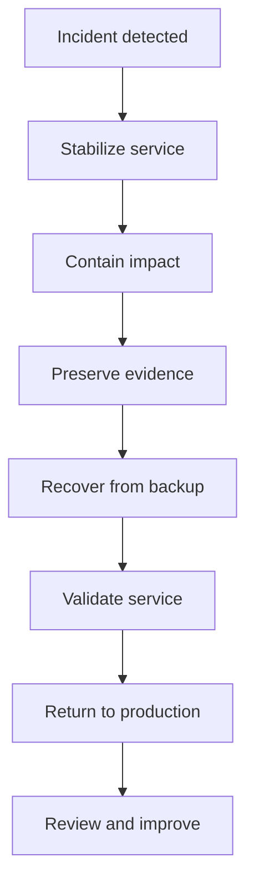
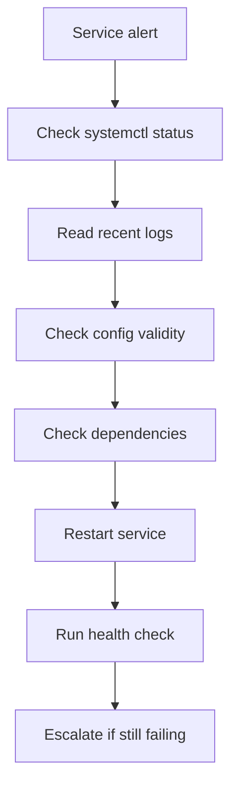
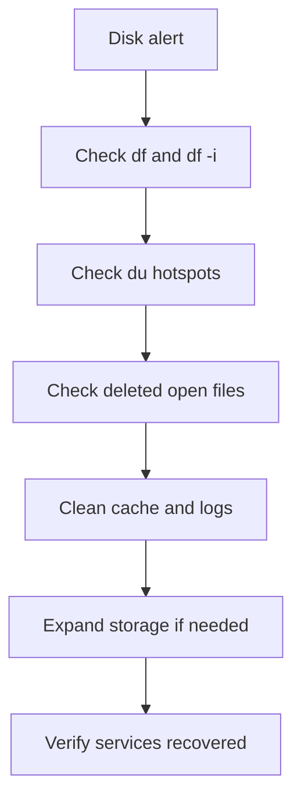
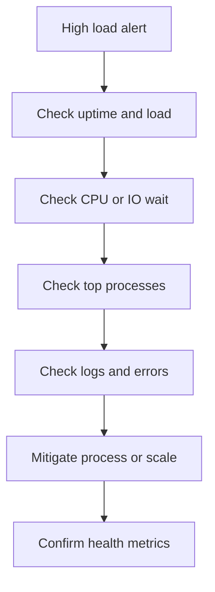

# Linux Day-to-Day Tasks Guide

> Production-oriented reference for Linux sysadmins and DevOps engineers.
> Focus: repeatable daily operations, safe change practices, quick diagnostics, recovery steps, and practical commands.

---

## How to use this guide

- Run commands as a regular user when possible.
- Use `sudo` only for privileged operations.
- Test on non-production systems first.
- Record all changes in tickets, change requests, or runbooks.
- Take backups before destructive operations.
- Prefer idempotent scripts over ad-hoc manual commands.
- Validate before and after every change.
- Use maintenance windows for risky work.
- Keep shell history enabled and centralized where policy allows.
- Review logs after any operational change.

---

## Common conventions used in examples

| Placeholder | Meaning |
|---|---|
| `server01` | Example hostname |
| `appuser` | Example application user |
| `example.com` | Example domain |
| `/opt/app` | Example application directory |
| `eth0` | Example interface name |
| `192.168.1.10` | Example IP |
| `myservice` | Example service |

---

## Safety checklist before running commands

- Confirm hostname and environment.
- Confirm you are on the correct server.
- Confirm package manager type.
- Confirm the shell prompt is not production unless intended.
- Confirm current backups are valid.
- Confirm free disk space is sufficient.
- Confirm maintenance window if required.
- Confirm rollback plan exists.
- Confirm monitoring is active.
- Confirm alert suppression only when appropriate.

---

# 1. Server Setup & Provisioning

## 1.1 Initial server setup checklist

### Goals

- Standardize new server onboarding.
- Reduce security drift.
- Ensure time, identity, access, and networking are correct.
- Prepare the server for monitoring and configuration management.

### Day-0 checklist

- Set hostname.
- Set timezone.
- Enable NTP.
- Create admin user.
- Harden SSH.
- Disable password login if policy allows.
- Install updates.
- Configure firewall.
- Install baseline packages.
- Configure logging and monitoring agent.
- Register DNS if needed.
- Add asset tags or CMDB entries.
- Verify backups are scheduled.
- Verify security agent is installed.
- Confirm storage layout.
- Confirm swap configuration.
- Confirm cloud-init finished successfully.

### Identify distro and version

```bash
cat /etc/os-release
uname -r
hostnamectl
```

### Set hostname

```bash
sudo hostnamectl set-hostname server01.example.com
hostnamectl status
cat /etc/hostname
```

### Update `/etc/hosts` when needed

```bash
sudo tee -a /etc/hosts >/dev/null <<'EOF'
127.0.0.1 localhost
127.0.1.1 server01.example.com server01
EOF
```

### Set timezone

```bash
timedatectl list-timezones | grep -i kolkata
sudo timedatectl set-timezone Asia/Kolkata
timedatectl
```

### Enable NTP synchronization

```bash
sudo timedatectl set-ntp true
timedatectl status
chronyc tracking || true
systemctl status systemd-timesyncd --no-pager || true
systemctl status chronyd --no-pager || true
```

### Install baseline packages on Debian or Ubuntu

```bash
sudo apt update
sudo apt install -y \
  vim curl wget git rsync unzip zip jq \
  net-tools dnsutils telnet traceroute \
  tcpdump htop iotop sysstat lsof \
  gnupg ca-certificates ufw fail2ban \
  logrotate cron bash-completion
```

### Install baseline packages on RHEL or Rocky or AlmaLinux

```bash
sudo dnf install -y \
  vim curl wget git rsync unzip zip jq \
  net-tools bind-utils telnet traceroute \
  tcpdump htop iotop sysstat lsof \
  gnupg2 ca-certificates firewalld fail2ban \
  logrotate cronie bash-completion
```

### Update packages

```bash
sudo apt update && sudo apt upgrade -y
sudo apt autoremove -y
```

```bash
sudo dnf check-update || true
sudo dnf upgrade -y
```

### Verify reboots required

```bash
[ -f /var/run/reboot-required ] && cat /var/run/reboot-required || echo "No reboot required"
needs-restarting -r || true
```

### Create admin user

```bash
sudo useradd -m -s /bin/bash opsadmin
sudo passwd opsadmin
sudo usermod -aG sudo opsadmin
id opsadmin
getent group sudo
```

### RHEL family sudo group

```bash
sudo usermod -aG wheel opsadmin
id opsadmin
getent group wheel
```

### Create `.ssh` directory securely

```bash
sudo install -d -m 700 -o opsadmin -g opsadmin /home/opsadmin/.ssh
sudo touch /home/opsadmin/.ssh/authorized_keys
sudo chown opsadmin:opsadmin /home/opsadmin/.ssh/authorized_keys
sudo chmod 600 /home/opsadmin/.ssh/authorized_keys
```

### SSH hardening checklist

- Disable root login.
- Disable password auth if key auth is enforced.
- Restrict allowed users or groups.
- Set idle timeout.
- Limit authentication attempts.
- Use modern ciphers and MACs if required by policy.
- Change default port only if operationally justified.
- Send logs to central logging.
- Add banner if required by compliance.

### Example `/etc/ssh/sshd_config` baseline

```conf
Port 22
Protocol 2
PermitRootLogin no
PasswordAuthentication no
PubkeyAuthentication yes
PermitEmptyPasswords no
MaxAuthTries 3
LoginGraceTime 30
ClientAliveInterval 300
ClientAliveCountMax 2
X11Forwarding no
AllowTcpForwarding no
UseDNS no
AllowUsers opsadmin deployer
Subsystem sftp /usr/lib/openssh/sftp-server
```

### Validate SSH config before reload

```bash
sudo sshd -t
sudo systemctl reload sshd || sudo systemctl reload ssh
sudo systemctl status sshd --no-pager || sudo systemctl status ssh --no-pager
```

### Firewall quick start with UFW

```bash
sudo ufw default deny incoming
sudo ufw default allow outgoing
sudo ufw allow 22/tcp
sudo ufw allow 80/tcp
sudo ufw allow 443/tcp
sudo ufw enable
sudo ufw status verbose
```

### Firewall quick start with firewalld

```bash
sudo systemctl enable --now firewalld
sudo firewall-cmd --permanent --add-service=ssh
sudo firewall-cmd --permanent --add-service=http
sudo firewall-cmd --permanent --add-service=https
sudo firewall-cmd --reload
sudo firewall-cmd --list-all
```

### Kernel and sysctl baseline

```bash
sudo tee /etc/sysctl.d/99-ops-baseline.conf >/dev/null <<'EOF'
net.ipv4.tcp_syncookies = 1
net.ipv4.conf.all.rp_filter = 1
net.ipv4.conf.default.rp_filter = 1
vm.swappiness = 10
fs.file-max = 2097152
EOF
sudo sysctl --system
```

### Validate DNS resolution

```bash
resolvectl status || systemd-resolve --status || cat /etc/resolv.conf
getent hosts example.com
```

### Verify storage layout

```bash
lsblk -f
findmnt
sudo pvs || true
sudo vgs || true
sudo lvs || true
```

### Check swap

```bash
swapon --show
free -h
cat /proc/swaps
```

### Configure audit trail basics

```bash
sudo systemctl enable --now rsyslog || true
sudo systemctl enable --now auditd || true
sudo systemctl status rsyslog --no-pager || true
sudo systemctl status auditd --no-pager || true
```

### Register with monitoring system

- Add node to Prometheus inventory.
- Install node exporter.
- Install log shipper.
- Install EDR if required.
- Verify alert labels and environment tags.

### Provisioning validation checklist

- `hostnamectl` shows expected hostname.
- `timedatectl` shows correct timezone.
- NTP synchronized.
- SSH login with key works.
- Root login blocked.
- Firewall active.
- Packages updated.
- Monitoring agent reporting.
- Disk layout documented.
- Backups configured.

## 1.2 User account provisioning

### Standard onboarding steps

- Create user.
- Create primary group if required.
- Add supplementary groups.
- Set password expiration policy.
- Deploy SSH key.
- Configure sudo if required.
- Verify shell and home directory.
- Record owner and purpose.

### Create a normal user

```bash
sudo useradd -m -s /bin/bash alice
sudo passwd alice
id alice
getent passwd alice
```

### Create service account without interactive shell

```bash
sudo useradd -r -M -s /usr/sbin/nologin appsvc
id appsvc
getent passwd appsvc
```

### Create user with explicit UID and group

```bash
sudo groupadd -g 1050 developers
sudo useradd -m -u 1050 -g developers -s /bin/bash bob
id bob
```

### Set password aging

```bash
sudo chage -M 90 -m 1 -W 7 alice
sudo chage -l alice
```

### Lock or unlock account

```bash
sudo usermod -L alice
sudo usermod -U alice
sudo passwd -S alice
```

### Expire password immediately

```bash
sudo chage -d 0 alice
```

## 1.3 SSH key deployment

### Generate an Ed25519 key on admin workstation

```bash
ssh-keygen -t ed25519 -C "alice@example.com"
```

### Deploy public key with `ssh-copy-id`

```bash
ssh-copy-id -i ~/.ssh/id_ed25519.pub alice@server01.example.com
```

### Manually deploy SSH key

```bash
sudo install -d -m 700 -o alice -g alice /home/alice/.ssh
sudo tee -a /home/alice/.ssh/authorized_keys >/dev/null <<'EOF'
ssh-ed25519 AAAAC3NzaC1lZDI1NTE5AAAAIExamplePublicKeyData alice@example.com
EOF
sudo chown alice:alice /home/alice/.ssh/authorized_keys
sudo chmod 600 /home/alice/.ssh/authorized_keys
```

### Verify key login

```bash
ssh -o PreferredAuthentications=publickey -o PasswordAuthentication=no alice@server01.example.com 'hostname && id'
```

### Restrict a key to a command

```text
command="/usr/local/bin/backup-runner",no-port-forwarding,no-agent-forwarding,no-pty ssh-ed25519 AAAAC3... backup-key
```

### Rotate SSH keys

- Add new key first.
- Verify login using new key.
- Remove old key.
- Record rotation date.
- Update inventory or password vault notes.

## 1.4 Complete example initial setup script

```bash
#!/usr/bin/env bash
set -euo pipefail

NEW_HOSTNAME="server01.example.com"
ADMIN_USER="opsadmin"
ADMIN_PUBKEY="ssh-ed25519 AAAAC3NzaC1lZDI1NTE5AAAAIExamplePublicKey opsadmin@example"

if command -v apt >/dev/null 2>&1; then
  PM_UPDATE='apt update'
  PM_INSTALL='apt install -y'
  SUDO_GROUP='sudo'
elif command -v dnf >/dev/null 2>&1; then
  PM_UPDATE='dnf makecache'
  PM_INSTALL='dnf install -y'
  SUDO_GROUP='wheel'
else
  echo "Unsupported package manager"
  exit 1
fi

sudo hostnamectl set-hostname "$NEW_HOSTNAME"
sudo timedatectl set-timezone UTC
sudo timedatectl set-ntp true
sudo bash -c "$PM_UPDATE"
sudo bash -c "$PM_INSTALL vim curl wget git rsync jq htop lsof fail2ban logrotate"

if ! id "$ADMIN_USER" >/dev/null 2>&1; then
  sudo useradd -m -s /bin/bash "$ADMIN_USER"
fi

sudo usermod -aG "$SUDO_GROUP" "$ADMIN_USER"
sudo install -d -m 700 -o "$ADMIN_USER" -g "$ADMIN_USER" "/home/$ADMIN_USER/.ssh"
sudo touch "/home/$ADMIN_USER/.ssh/authorized_keys"
sudo chmod 600 "/home/$ADMIN_USER/.ssh/authorized_keys"
sudo chown "$ADMIN_USER:$ADMIN_USER" "/home/$ADMIN_USER/.ssh/authorized_keys"
if ! sudo grep -qF "$ADMIN_PUBKEY" "/home/$ADMIN_USER/.ssh/authorized_keys"; then
  echo "$ADMIN_PUBKEY" | sudo tee -a "/home/$ADMIN_USER/.ssh/authorized_keys" >/dev/null
fi

SSHD_CONFIG='/etc/ssh/sshd_config'
sudo cp "$SSHD_CONFIG" "${SSHD_CONFIG}.bak.$(date +%F-%H%M%S)"
sudo sed -i 's/^#\?PermitRootLogin.*/PermitRootLogin no/' "$SSHD_CONFIG"
sudo sed -i 's/^#\?PasswordAuthentication.*/PasswordAuthentication no/' "$SSHD_CONFIG"
sudo sshd -t
sudo systemctl reload sshd || sudo systemctl reload ssh

echo "Initial setup completed for $NEW_HOSTNAME"
```

## 1.5 Example user provisioning script

```bash
#!/usr/bin/env bash
set -euo pipefail

USERNAME="${1:?Usage: $0 <username> <pubkey-file>}"
PUBKEY_FILE="${2:?Usage: $0 <username> <pubkey-file>}"

sudo useradd -m -s /bin/bash "$USERNAME" || true
sudo install -d -m 700 -o "$USERNAME" -g "$USERNAME" "/home/$USERNAME/.ssh"
sudo install -m 600 -o "$USERNAME" -g "$USERNAME" "$PUBKEY_FILE" "/home/$USERNAME/.ssh/authorized_keys"
sudo chage -M 90 -m 1 -W 7 "$USERNAME"
id "$USERNAME"
sudo chage -l "$USERNAME"
```

## 1.6 Provisioning one-liners

```bash
hostnamectl; timedatectl; ip -br a; ss -tulpn
```

```bash
id opsadmin && sudo -l -U opsadmin
```

```bash
sudo sshd -T | egrep 'permitrootlogin|passwordauthentication|maxauthtries|clientaliveinterval'
```

```bash
sudo ufw status numbered || sudo firewall-cmd --list-all
```

---

# 2. System Health Checks

## 2.1 Daily health check objectives

- Detect CPU saturation.
- Detect memory pressure.
- Detect disk exhaustion.
- Detect service failures.
- Detect unusual reboots.
- Detect filesystem errors.
- Detect network issues.
- Detect security anomalies.

## 2.2 Quick dashboard commands

### Overall snapshot

```bash
date; hostname; uptime; who -b
```

### Load and CPU

```bash
uptime
cat /proc/loadavg
mpstat -P ALL 1 3
sar -u 1 3
```

### Memory

```bash
free -h
vmstat 1 5
sar -r 1 3
cat /proc/meminfo | egrep 'MemTotal|MemFree|MemAvailable|SwapTotal|SwapFree'
```

### Disk

```bash
df -hT
lsblk -f
findmnt -lo TARGET,SOURCE,FSTYPE,OPTIONS
```

### Top processes

```bash
ps -eo pid,ppid,user,%cpu,%mem,cmd --sort=-%cpu | head -20
ps -eo pid,ppid,user,%mem,%cpu,cmd --sort=-%mem | head -20
```

### Failed services

```bash
systemctl --failed
```

### Recent critical logs

```bash
journalctl -p 3 -xb --no-pager | tail -100
```

### Reboots and uptime history

```bash
last reboot | head
who -b
uptime -p
```

## 2.3 Daily health check script

```bash
#!/usr/bin/env bash
set -euo pipefail

HOST=$(hostname -f 2>/dev/null || hostname)
NOW=$(date '+%F %T %Z')

section() {
  echo
  echo "===== $1 ====="
}

echo "Health Check Report"
echo "Host: $HOST"
echo "Generated: $NOW"

section "Uptime"
uptime
who -b || true
last reboot | head -5 || true

section "CPU and Load"
cat /proc/loadavg
command -v mpstat >/dev/null && mpstat -P ALL 1 1 || true
ps -eo pid,user,%cpu,%mem,cmd --sort=-%cpu | head -10

section "Memory"
free -h
vmstat 1 3
ps -eo pid,user,%mem,%cpu,cmd --sort=-%mem | head -10

section "Disk"
df -hT
for mount in / /var /home; do
  [ -d "$mount" ] && du -xhd1 "$mount" 2>/dev/null | sort -h | tail -20
done

section "Inodes"
df -ih

section "Services"
systemctl --failed || true
systemctl list-units --type=service --state=running | head -40 || true

section "Network"
ip -br a
ip route
ss -tulpn | head -100

section "Logs"
journalctl -p warning -n 50 --no-pager || true
journalctl -p err -n 50 --no-pager || true

section "Filesystem errors"
dmesg --level=err,warn | tail -50 || true

section "Security"
last -a | head -20 || true
lastb -a | head -20 || true

section "Summary thresholds"
ROOT_USE=$(df --output=pcent / | tail -1 | tr -dc '0-9')
MEM_AVAIL=$(awk '/MemAvailable/ {print int($2/1024)}' /proc/meminfo)
echo "Root filesystem used: ${ROOT_USE}%"
echo "Available memory: ${MEM_AVAIL} MB"
if [ "$ROOT_USE" -ge 90 ]; then
  echo "ALERT: Root filesystem above 90%"
fi
if [ "$MEM_AVAIL" -le 512 ]; then
  echo "ALERT: Available memory below 512 MB"
fi
```

## 2.4 Health check with email alert example

```bash
#!/usr/bin/env bash
set -euo pipefail

REPORT=$(/usr/local/bin/daily-health-check.sh)
ALERTS=$(printf '%s
' "$REPORT" | grep '^ALERT:' || true)

if [ -n "$ALERTS" ]; then
  printf '%s

%s
' "Daily health check alerts" "$REPORT" | mail -s "[ALERT] $(hostname) daily health" ops@example.com
fi
```

## 2.5 Automated health monitoring pointers

- Prometheus Node Exporter for metrics.
- Alertmanager for notifications.
- Grafana for dashboards.
- Monit for simple process checks.
- systemd watchdog for service supervision.
- Ping checks for availability.
- Blackbox Exporter for HTTP, TCP, and DNS.

## 2.6 Uptime and availability tracking

### Local uptime tracking

```bash
uptime -s
systemd-analyze
who -b
```

### External availability check examples

```bash
curl -fsS -o /dev/null -w '%{http_code} %{time_total}
' https://example.com/healthz
```

```bash
for i in {1..5}; do date; curl -fsS -o /dev/null -w '%{http_code} %{time_total}
' https://example.com/healthz; sleep 5; done
```

### Ping loss quick test

```bash
ping -c 10 8.8.8.8
```

## 2.7 System status dashboard commands

```bash
watch -n 2 'date; echo; uptime; echo; free -h; echo; df -h / /var; echo; systemctl --failed; echo; ss -s'
```

```bash
watch -n 2 'ps -eo pid,user,%cpu,%mem,cmd --sort=-%cpu | head -15'
```

```bash
watch -n 5 'journalctl -p err -n 20 --no-pager'
```

## 2.8 Health check interpretation tips

- High load with low CPU usage often means I/O wait or blocked tasks.
- High memory usage is not always bad if cache is reclaimable.
- Disk alerts require checking both space and inodes.
- Repeated service restarts indicate crash loops or bad dependencies.
- Kernel warnings in `dmesg` may point to hardware or driver issues.
- Many `TIME_WAIT` sockets may be normal for busy web servers.

## 2.9 Real-world health check one-liners

```bash
journalctl --since today -p warning --no-pager | tail -100
```

```bash
ps -eo state,pid,ppid,cmd | awk '$1 ~ /D/ {print}'
```

```bash
df -hP | awk 'NR==1 || int($5+0) > 80'
```

```bash
for s in sshd nginx docker; do systemctl is-active --quiet "$s" || echo "$s is not active"; done
```

---

# 3. Log Management & Analysis

## 3.1 Log locations to know

### Common files

- `/var/log/syslog`
- `/var/log/messages`
- `/var/log/auth.log`
- `/var/log/secure`
- `/var/log/kern.log`
- `/var/log/dmesg`
- `/var/log/nginx/access.log`
- `/var/log/nginx/error.log`
- `/var/log/httpd/access_log`
- `/var/log/httpd/error_log`
- `/var/log/mysql/error.log`
- `/var/log/postgresql/`
- `/var/log/audit/audit.log`

### Quick listing

```bash
sudo find /var/log -maxdepth 2 -type f | sort
```

## 3.2 Using `journalctl`

### Current boot logs

```bash
journalctl -xb --no-pager
```

### Follow logs live

```bash
journalctl -f
journalctl -u nginx -f
```

### Show last hour

```bash
journalctl --since '1 hour ago' --no-pager
```

### Show errors only

```bash
journalctl -p err --since today --no-pager
```

### Show logs for a service

```bash
journalctl -u sshd --no-pager
journalctl -u docker --since yesterday --no-pager
```

### Show previous boot logs

```bash
journalctl -b -1 --no-pager
```

## 3.3 Grep patterns for error hunting

```bash
sudo grep -RiE 'error|fail|fatal|panic|segfault|denied|timeout|refused' /var/log | head -200
```

```bash
journalctl --since today --no-pager | grep -Ei 'oom|killed process|segfault|i/o error|read-only file system'
```

### Useful patterns

- `error`
- `failed`
- `fatal`
- `panic`
- `exception`
- `segfault`
- `oom`
- `out of memory`
- `denied`
- `permission denied`
- `connection refused`
- `timed out`
- `reset by peer`
- `disk full`
- `read-only file system`

## 3.4 Log rotation with `logrotate`

### Example application rotation config

```conf
/var/log/myapp/*.log {
    daily
    rotate 14
    compress
    delaycompress
    missingok
    notifempty
    create 0640 myapp myapp
    sharedscripts
    postrotate
        systemctl reload myapp >/dev/null 2>&1 || true
    endscript
}
```

### Test `logrotate`

```bash
sudo logrotate -d /etc/logrotate.conf
sudo logrotate -f /etc/logrotate.conf
```

### Inspect rotation status

```bash
sudo cat /var/lib/logrotate/status
```

## 3.5 Centralized logging setup ideas

- rsyslog forwarding.
- syslog-ng forwarding.
- Filebeat to Elasticsearch.
- Fluent Bit to Loki or OpenSearch.
- journald remote forwarding.
- Cloud-native agents for cloud VMs.

### rsyslog forwarding example

```conf
*.* action(type="omfwd" target="loghub.example.com" port="514" protocol="tcp")
```

### Restart rsyslog

```bash
sudo systemctl restart rsyslog
sudo systemctl status rsyslog --no-pager
```

## 3.6 Real-world log analysis one-liners

### Top 20 IPs hitting Nginx access log

```bash
awk '{print $1}' /var/log/nginx/access.log | sort | uniq -c | sort -nr | head -20
```

### Top 20 URLs

```bash
awk '{print $7}' /var/log/nginx/access.log | sort | uniq -c | sort -nr | head -20
```

### Count HTTP status codes

```bash
awk '{print $9}' /var/log/nginx/access.log | sort | uniq -c | sort -nr
```

### Show 5xx responses

```bash
awk '$9 ~ /^5/' /var/log/nginx/access.log | tail -50
```

### Find auth failures

```bash
sudo grep -Ei 'failed password|authentication failure|invalid user' /var/log/auth.log /var/log/secure 2>/dev/null
```

### Top invalid usernames attempted

```bash
sudo grep -h 'Invalid user' /var/log/auth.log /var/log/secure 2>/dev/null | awk '{print $(NF-2)}' | sort | uniq -c | sort -nr | head
```

### Find OOM kills

```bash
journalctl -k --since yesterday --no-pager | grep -Ei 'killed process|out of memory|oom'
```

### Detect disk I/O errors

```bash
journalctl -k --since today --no-pager | grep -Ei 'I/O error|buffer I/O error|blk_update_request|EXT4-fs error|XFS'
```

### Extract slow queries from MySQL log

```bash
grep -Ei 'Query_time|^# Time|^SET timestamp|^[A-Z]' /var/log/mysql/mysql-slow.log | tail -100
```

### Count SSH login successes by user

```bash
sudo grep 'Accepted ' /var/log/auth.log /var/log/secure 2>/dev/null | awk '{print $(NF-5)}' | sort | uniq -c | sort -nr
```

### Show journald disk usage

```bash
journalctl --disk-usage
```

## 3.7 Log retention planning

| Log type | Typical retention | Notes |
|---|---|---|
| Security logs | 90 to 365 days | Compliance-driven |
| Syslog | 14 to 30 days | Depends on disk |
| App logs | 7 to 30 days | Ship centrally |
| Access logs | 14 to 90 days | Depends on traffic |
| Audit logs | 180+ days | Often immutable storage |

## 3.8 Journald maintenance

```bash
sudo journalctl --vacuum-time=14d
sudo journalctl --vacuum-size=1G
sudo journalctl --verify
```

## 3.9 Log troubleshooting workflow

- Confirm the affected host and time range.
- Identify the impacted service.
- Check application logs.
- Check service logs with `journalctl -u`.
- Check kernel logs.
- Correlate with deployment time.
- Correlate with config changes.
- Correlate with traffic spikes.
- Capture evidence before cleanup.

---

# 4. User Management Tasks

## 4.1 Creating users

```bash
sudo useradd -m -s /bin/bash dev1
sudo passwd dev1
id dev1
```

### Create multiple users from a file

```bash
while read -r u; do sudo useradd -m -s /bin/bash "$u" || true; done < users.txt
```

## 4.2 Removing users

### Remove account but keep home

```bash
sudo userdel dev1
```

### Remove account and home directory

```bash
sudo userdel -r dev1
```

### Find files owned by a deleted UID

```bash
sudo find / -xdev -uid 1050 -ls 2>/dev/null
```

## 4.3 Password resets

```bash
sudo passwd dev1
sudo chage -d 0 dev1
sudo passwd -S dev1
```

## 4.4 Sudo access management

### Add user to sudo or wheel

```bash
sudo usermod -aG sudo dev1
sudo usermod -aG wheel dev1
```

### Validate sudo rights

```bash
sudo -l -U dev1
id dev1
```

### Use `/etc/sudoers.d`

```bash
echo 'dev1 ALL=(ALL) NOPASSWD:/bin/systemctl,/usr/bin/journalctl' | sudo tee /etc/sudoers.d/dev1-ops
sudo chmod 440 /etc/sudoers.d/dev1-ops
sudo visudo -cf /etc/sudoers
```

## 4.5 SSH key management

### List keys for a user

```bash
sudo ls -la /home/dev1/.ssh
sudo cat /home/dev1/.ssh/authorized_keys
```

### Remove old key safely

```bash
sudo cp /home/dev1/.ssh/authorized_keys /home/dev1/.ssh/authorized_keys.bak.$(date +%F-%H%M%S)
sudo sed -i '/old-key-comment@example.com/d' /home/dev1/.ssh/authorized_keys
```

### Check permissions

```bash
namei -l /home/dev1/.ssh/authorized_keys
```

## 4.6 Auditing user activity

### Who is logged in now

```bash
w
who
users
```

### Last login history

```bash
last -a | head -50
lastlog | head -50
```

### Failed login attempts

```bash
lastb | head -50
```

### Recent sudo activity

```bash
sudo journalctl _COMM=sudo --since today --no-pager
```

### Accounts with shell access

```bash
getent passwd | awk -F: '$7 !~ /(nologin|false)$/ {print $1, $7}'
```

### Accounts with UID 0

```bash
awk -F: '($3 == 0) {print}' /etc/passwd
```

### Password status for all users

```bash
sudo awk -F: '{print $1}' /etc/passwd | xargs -I{} sudo passwd -S {}
```

## 4.7 Lockdown and offboarding checklist

- Disable user account.
- Remove from sudo or wheel.
- Remove SSH keys.
- Kill user processes.
- Archive home directory if policy requires.
- Transfer ownership of service files.
- Remove cron jobs.
- Remove API or deploy credentials.
- Update access management system.

### Offboard example

```bash
USER=dev1
sudo usermod -L "$USER"
sudo gpasswd -d "$USER" sudo || true
sudo gpasswd -d "$USER" wheel || true
sudo pkill -u "$USER" || true
sudo tar -czf "/root/${USER}-home-$(date +%F).tgz" "/home/$USER"
sudo userdel -r "$USER"
```

## 4.8 Group management

```bash
sudo groupadd dockerops
sudo usermod -aG dockerops alice
getent group dockerops
```

## 4.9 User management one-liners

```bash
comm -23 <(getent passwd | cut -d: -f1 | sort) <(lastlog | awk 'NR>1 {print $1}' | sort)
```

```bash
sudo find /home -maxdepth 2 -name authorized_keys -exec grep -H 'ssh-ed25519' {} \;
```

---

# 5. Disk & Storage Management

## 5.1 Checking disk usage

```bash
df -hT
```

```bash
df -ih
```

```bash
sudo du -xhd1 / | sort -h
```

### ncdu for interactive analysis

```bash
sudo ncdu /
```

## 5.2 Finding large files

```bash
sudo find / -xdev -type f -size +1G -printf '%10s %p
' 2>/dev/null | sort -nr | head -50
```

```bash
sudo find /var/log -type f -size +100M -ls
```

```bash
sudo lsof +L1
```

### Top 20 directories under `/var`

```bash
sudo du -xhd1 /var | sort -h | tail -20
```

## 5.3 Cleaning up disk space safely

### Debian or Ubuntu package cache

```bash
sudo apt clean
sudo apt autoremove -y
```

### RHEL family package cache

```bash
sudo dnf clean all
```

### Journald cleanup

```bash
sudo journalctl --vacuum-time=7d
sudo journalctl --vacuum-size=500M
```

### Remove old kernels on Debian or Ubuntu

```bash
dpkg -l 'linux-image*' | awk '/^ii/ { print $2 }'
```

```bash
sudo apt autoremove --purge -y
```

### Remove old kernels on RHEL family

```bash
sudo dnf remove $(dnf repoquery --installonly --latest-limit=-2 -q)
```

### Clean temp files

```bash
sudo find /tmp -xdev -type f -mtime +7 -delete
sudo find /var/tmp -xdev -type f -mtime +7 -delete
```

### Truncate oversized logs after copying if needed

```bash
sudo cp /var/log/myapp.log /var/log/myapp.log.bak.$(date +%F-%H%M%S)
sudo truncate -s 0 /var/log/myapp.log
```

### Remove orphaned Docker objects

```bash
docker system df
docker system prune -f
docker image prune -af
```

## 5.4 LVM extend and resize operations

### Check current LVM layout

```bash
sudo pvs
sudo vgs
sudo lvs -a -o +devices
```

### Extend logical volume and filesystem in one step

```bash
sudo lvextend -r -L +20G /dev/vgdata/lvdata
```

### Extend to all free space

```bash
sudo lvextend -r -l +100%FREE /dev/vgdata/lvdata
```

### XFS grow manually

```bash
sudo lvextend -L +10G /dev/vgdata/lvlogs
sudo xfs_growfs /var/log
```

### ext4 grow manually

```bash
sudo lvextend -L +10G /dev/vgdata/lvapp
sudo resize2fs /dev/vgdata/lvapp
```

## 5.5 Adding a new disk

### Discover disk

```bash
lsblk
sudo fdisk -l
```

### Partition disk with GPT

```bash
sudo parted /dev/sdb --script mklabel gpt
sudo parted /dev/sdb --script mkpart primary ext4 0% 100%
```

### Format and mount

```bash
sudo mkfs.ext4 /dev/sdb1
sudo mkdir -p /data
sudo mount /dev/sdb1 /data
sudo blkid /dev/sdb1
```

### Add to `/etc/fstab`

```bash
UUID=$(sudo blkid -s UUID -o value /dev/sdb1)
echo "UUID=$UUID /data ext4 defaults,nofail 0 2" | sudo tee -a /etc/fstab
sudo mount -a
findmnt /data
```

### Add new disk to LVM

```bash
sudo pvcreate /dev/sdb1
sudo vgextend vgdata /dev/sdb1
sudo vgs
```

## 5.6 Filesystem checks

```bash
sudo fsck -N /dev/sdb1
sudo tune2fs -l /dev/sdb1 | egrep 'Filesystem volume name|Block count|Reserved block count|Mount count'
xfs_info /var || true
```

## 5.7 Inode exhaustion checks

```bash
df -ih
sudo find /var -xdev -type f | cut -d/ -f1-3 | sort | uniq -c | sort -nr | head -20
```

## 5.8 Storage troubleshooting workflow

- Check `df -hT`.
- Check `df -ih`.
- Check `du -xhd1 /`.
- Check deleted but open files with `lsof +L1`.
- Check logs and package caches.
- Check container runtime directories.
- Check backup leftovers.
- Check snapshots if using LVM or storage platform.

## 5.9 Disk management one-liners

```bash
sudo find / -xdev -type f -printf '%s %p
' 2>/dev/null | sort -nr | head -20 | numfmt --to=iec
```

```bash
sudo du -xah /var | sort -hr | head -30
```

---

# 6. Service Management

## 6.1 Basic service lifecycle with systemd

### Start service

```bash
sudo systemctl start nginx
```

### Stop service

```bash
sudo systemctl stop nginx
```

### Restart service

```bash
sudo systemctl restart nginx
```

### Reload configuration

```bash
sudo systemctl reload nginx
```

### Enable at boot

```bash
sudo systemctl enable nginx
```

### Disable at boot

```bash
sudo systemctl disable nginx
```

### Check status

```bash
systemctl status nginx --no-pager
systemctl is-active nginx
systemctl is-enabled nginx
```

## 6.2 Reading service logs

```bash
journalctl -u nginx --since '30 min ago' --no-pager
journalctl -u nginx -f
```

## 6.3 List failed units

```bash
systemctl --failed
```

## 6.4 View dependency chain

```bash
systemctl list-dependencies nginx
systemctl show nginx -p After -p Wants -p Requires
```

## 6.5 Reload systemd after unit change

```bash
sudo systemctl daemon-reload
```

## 6.6 Creating a custom systemd service

### Example unit file

```ini
[Unit]
Description=My Python App
After=network.target

[Service]
Type=simple
User=appuser
Group=appuser
WorkingDirectory=/opt/app
ExecStart=/usr/bin/python3 /opt/app/app.py
Restart=on-failure
RestartSec=5
Environment=APP_ENV=production

[Install]
WantedBy=multi-user.target
```

### Install and start it

```bash
sudo tee /etc/systemd/system/myapp.service >/dev/null <<'EOF'
[Unit]
Description=My Python App
After=network.target

[Service]
Type=simple
User=appuser
Group=appuser
WorkingDirectory=/opt/app
ExecStart=/usr/bin/python3 /opt/app/app.py
Restart=on-failure
RestartSec=5
Environment=APP_ENV=production

[Install]
WantedBy=multi-user.target
EOF
sudo systemctl daemon-reload
sudo systemctl enable --now myapp
systemctl status myapp --no-pager
```

## 6.7 Override unit settings safely

```bash
sudo systemctl edit nginx
```

### Example override content

```ini
[Service]
LimitNOFILE=65535
Environment=ENVIRONMENT=production
```

### Show merged unit

```bash
systemctl cat nginx
```

## 6.8 Troubleshooting services

- Check unit file syntax.
- Check environment variables.
- Check file permissions.
- Check working directory.
- Check dependency readiness.
- Check port conflicts.
- Check SELinux or AppArmor denials.
- Check resource limits.

### Service debugging commands

```bash
sudo systemd-analyze verify /etc/systemd/system/myapp.service
```

```bash
ss -tulpn | grep ':80 '
```

```bash
sudo journalctl -u myapp -xe --no-pager
```

### Restart loop detection

```bash
systemctl show myapp -p NRestarts -p ExecMainStatus -p ExecMainCode
```

## 6.9 Service management one-liners

```bash
systemctl list-units --type=service --state=running | egrep 'nginx|httpd|sshd|docker'
```

```bash
for s in nginx sshd docker; do printf '%s: ' "$s"; systemctl is-active "$s"; done
```

---

# 7. Backup & Restore

## 7.1 Backup principles

- Follow 3-2-1 backup strategy.
- Encrypt backups in transit and at rest.
- Verify backups regularly.
- Test restores, not just backup jobs.
- Separate backup credentials.
- Use immutable storage where possible.
- Monitor backup age and success.

## 7.2 rsync backup script

```bash
#!/usr/bin/env bash
set -euo pipefail

SRC="/etc /var/www /opt/app"
DEST="backup@example.com:/backups/$(hostname -s)/daily"
LOGFILE="/var/log/rsync-backup.log"

/usr/bin/rsync -aHAX --delete --numeric-ids --stats $SRC "$DEST" >> "$LOGFILE" 2>&1
```

## 7.3 rsync with exclusions

```bash
rsync -aHAX --delete \
  --exclude='/var/cache/' \
  --exclude='/var/tmp/' \
  --exclude='*.log' \
  / backup@example.com:/backups/server01/rootfs/
```

## 7.4 Database backup for MySQL or MariaDB

### Full dump

```bash
mysqldump --single-transaction --routines --triggers --events -u root -p --all-databases | gzip > all-databases-$(date +%F).sql.gz
```

### Single database

```bash
mysqldump --single-transaction -u backup -p appdb | gzip > appdb-$(date +%F-%H%M).sql.gz
```

### Backup all schemas separately

```bash
mysql -NBe 'show databases' | egrep -v '^(information_schema|performance_schema|mysql|sys)$' | while read -r db; do
  mysqldump --single-transaction "$db" | gzip > "${db}-$(date +%F).sql.gz"
done
```

## 7.5 Database backup for PostgreSQL

### Full cluster logical backup

```bash
pg_dumpall -U postgres | gzip > pgdumpall-$(date +%F).sql.gz
```

### Single database custom format

```bash
pg_dump -U postgres -Fc appdb > appdb-$(date +%F).dump
```

### Schema-only backup

```bash
pg_dump -U postgres -s appdb > appdb-schema-$(date +%F).sql
```

## 7.6 Automated backup with cron

```cron
0 2 * * * /usr/local/bin/rsync-backup.sh
30 2 * * * /usr/local/bin/mysql-backup.sh
0 3 * * 0 /usr/local/bin/backup-verify.sh
```

## 7.7 Backup verification

### Verify file exists and size is sane

```bash
ls -lh *.sql.gz *.dump 2>/dev/null
```

### Test gzip archive

```bash
gzip -t appdb-2025-01-01.sql.gz
```

### Validate MySQL dump header

```bash
zcat appdb-2025-01-01.sql.gz | head -20
```

### Validate PostgreSQL dump

```bash
pg_restore -l appdb-2025-01-01.dump | head -20
```

### Verify rsync backup freshness

```bash
find /backups/server01 -type f -mtime -1 | head
```

## 7.8 Restore procedures

### Restore files with rsync

```bash
rsync -aHAX backup@example.com:/backups/server01/daily/etc/ /etc/
```

### Restore MySQL dump

```bash
gunzip -c appdb-2025-01-01.sql.gz | mysql -u root -p appdb
```

### Restore PostgreSQL custom dump

```bash
createdb -U postgres appdb_restore
pg_restore -U postgres -d appdb_restore appdb-2025-01-01.dump
```

### Restore PostgreSQL plain SQL

```bash
gunzip -c pgdumpall-2025-01-01.sql.gz | psql -U postgres
```

## 7.9 Example backup verification script

```bash
#!/usr/bin/env bash
set -euo pipefail

LATEST=$(ls -1t /backups/db/appdb-*.sql.gz | head -1)
[ -n "$LATEST" ] || { echo "No backup found"; exit 1; }
gzip -t "$LATEST"
SIZE=$(stat -c%s "$LATEST")
[ "$SIZE" -gt 1048576 ] || { echo "Backup too small"; exit 1; }
echo "Backup verification passed: $LATEST"
```

## 7.10 Backup operations checklist

- Confirm source paths.
- Confirm exclusion rules.
- Confirm destination reachable.
- Confirm free space at destination.
- Confirm encryption if required.
- Confirm retention job exists.
- Confirm verification job exists.
- Confirm restore test completed recently.

## 7.11 Backup one-liners

```bash
find /backups -type f -printf '%TY-%Tm-%Td %TT %s %p
' | sort | tail -20
```

```bash
ssh backup@example.com 'df -h /backups && find /backups/server01 -type f | wc -l'
```

---

# 8. Security Tasks

## 8.1 Checking failed login attempts

```bash
sudo lastb | head -50
```

```bash
sudo grep -Ei 'failed password|invalid user|authentication failure' /var/log/auth.log /var/log/secure 2>/dev/null | tail -100
```

## 8.2 Checking successful logins

```bash
sudo grep 'Accepted ' /var/log/auth.log /var/log/secure 2>/dev/null | tail -100
```

## 8.3 Updating packages and security patches

### Debian or Ubuntu

```bash
sudo apt update
sudo apt list --upgradable
sudo unattended-upgrade --dry-run -d || true
sudo apt upgrade -y
```

### RHEL family

```bash
sudo dnf check-update || true
sudo dnf updateinfo list security
sudo dnf upgrade --security -y
```

## 8.4 Checking open ports

```bash
ss -tulpn
```

```bash
sudo lsof -i -P -n | grep LISTEN
```

## 8.5 Firewall rule management

### UFW

```bash
sudo ufw status numbered
sudo ufw allow from 192.168.1.0/24 to any port 22 proto tcp
sudo ufw delete 3
```

### firewalld

```bash
sudo firewall-cmd --list-all
sudo firewall-cmd --permanent --add-port=8080/tcp
sudo firewall-cmd --reload
```

### nftables quick view

```bash
sudo nft list ruleset
```

## 8.6 Certificate renewal with Let's Encrypt

### Test renewal

```bash
sudo certbot renew --dry-run
```

### Actual renewal via systemd timer or cron

```bash
systemctl list-timers | grep certbot || true
sudo certbot renew
```

### Reload web server after renewal if needed

```bash
sudo systemctl reload nginx
sudo systemctl reload apache2 || sudo systemctl reload httpd
```

## 8.7 Vulnerability scanning

### Package-level checks

```bash
sudo apt list --upgradable 2>/dev/null | grep -i security || true
sudo dnf updateinfo list security || true
```

### File permissions review

```bash
sudo find / -xdev -type f -perm -0002 -ls 2>/dev/null
```

### SUID and SGID review

```bash
sudo find / -xdev \( -perm -4000 -o -perm -2000 \) -type f -ls 2>/dev/null
```

### Check listening services exposed externally

```bash
ss -tulpn | awk 'NR==1 || $5 !~ /127.0.0.1|::1/'
```

### Lynis example

```bash
sudo lynis audit system
```

## 8.8 Inspect security services

```bash
systemctl status fail2ban --no-pager || true
fail2ban-client status || true
systemctl status auditd --no-pager || true
```

## 8.9 SELinux and AppArmor quick checks

```bash
getenforce || true
sudo ausearch -m AVC,USER_AVC -ts recent || true
sudo aa-status || true
```

## 8.10 Security hardening reminders

- Remove unused packages.
- Disable unused services.
- Enforce MFA on jump hosts.
- Rotate keys and credentials.
- Restrict sudo by command where possible.
- Monitor privileged group membership.
- Forward auth logs centrally.
- Patch kernel and browser-exposed apps quickly.

## 8.11 Security one-liners

```bash
sudo awk -F: '($2 == "" ) {print "Empty password field:", $1}' /etc/shadow
```

```bash
sudo grep -R "NOPASSWD" /etc/sudoers /etc/sudoers.d 2>/dev/null
```

```bash
sudo find /home -maxdepth 2 -name authorized_keys -mtime -30 -ls
```

---

# 9. Network Tasks

## 9.1 Checking connectivity

### Ping

```bash
ping -c 4 8.8.8.8
ping -c 4 example.com
```

### TCP connectivity

```bash
nc -vz example.com 443
curl -I https://example.com
```

### Route and interface overview

```bash
ip -br a
ip route
ip rule
```

## 9.2 DNS troubleshooting

```bash
dig example.com
```

```bash
dig +short example.com
```

```bash
dig @8.8.8.8 example.com
```

```bash
host example.com
nslookup example.com
```

### Reverse lookup

```bash
dig -x 8.8.8.8 +short
```

### Resolver status

```bash
resolvectl status || cat /etc/resolv.conf
```

## 9.3 Bandwidth monitoring

```bash
sar -n DEV 1 5
ip -s link
nload || true
iftop -nP || true
```

## 9.4 Port forwarding

### Temporary local forward

```bash
ssh -L 8080:127.0.0.1:80 user@server01.example.com
```

### Remote forward

```bash
ssh -R 2222:127.0.0.1:22 jumpbox.example.com
```

### Dynamic SOCKS proxy

```bash
ssh -D 1080 user@server01.example.com
```

## 9.5 VPN connection management

### OpenVPN example

```bash
sudo systemctl status openvpn-client@corp --no-pager
sudo systemctl restart openvpn-client@corp
```

### WireGuard example

```bash
sudo wg show
sudo systemctl restart wg-quick@wg0
ip a show wg0
```

## 9.6 Network interface management

### Bring interface up or down

```bash
sudo ip link set eth0 down
sudo ip link set eth0 up
```

### Add temporary IP

```bash
sudo ip addr add 192.168.1.10/24 dev eth0
```

### Remove temporary IP

```bash
sudo ip addr del 192.168.1.10/24 dev eth0
```

### Check ARP or neighbor table

```bash
ip neigh
```

## 9.7 Troubleshooting ports and sockets

```bash
ss -s
ss -antp | head -50
ss -lntp
```

### Identify process using a port

```bash
sudo lsof -i :8080
sudo fuser -n tcp 8080
```

## 9.8 Packet capture basics

```bash
sudo tcpdump -i eth0 -nn host 192.168.1.10 and port 443
```

```bash
sudo tcpdump -i any -nn 'tcp port 53 or udp port 53'
```

## 9.9 MTU and route diagnostics

```bash
ip link show eth0
tracepath example.com
traceroute example.com
```

## 9.10 Network task one-liners

```bash
for h in 8.8.8.8 1.1.1.1 example.com; do echo "== $h =="; ping -c 2 "$h"; done
```

```bash
ss -ant state established '( sport = :443 or dport = :443 )' | awk 'NR>1 {print $5}' | cut -d: -f1 | sort | uniq -c | sort -nr | head
```

---

# 10. Application Deployment

## 10.1 Deployment fundamentals

- Build artifact once.
- Promote same artifact across environments.
- Externalize configuration.
- Use health checks.
- Automate migrations carefully.
- Keep rollback fast.
- Capture deployment metadata.

## 10.2 Deploying web applications with Nginx

### Basic release layout

```text
/opt/app/releases/2025-01-01-120000
/opt/app/releases/2025-01-02-173000
/opt/app/current -> /opt/app/releases/2025-01-02-173000
```

### Simple deploy flow

- Upload artifact.
- Extract into new release directory.
- Install dependencies if required.
- Run migrations.
- Update symlink.
- Restart or reload service.
- Run smoke tests.

### Example Nginx server block

```nginx
server {
    listen 80;
    server_name app.example.com;

    location / {
        proxy_pass http://127.0.0.1:3000;
        proxy_set_header Host $host;
        proxy_set_header X-Real-IP $remote_addr;
        proxy_set_header X-Forwarded-For $proxy_add_x_forwarded_for;
        proxy_set_header X-Forwarded-Proto $scheme;
    }
}
```

### Validate and reload Nginx

```bash
sudo nginx -t
sudo systemctl reload nginx
```

## 10.3 Apache deployment basics

```bash
sudo apachectl configtest
sudo systemctl reload apache2 || sudo systemctl reload httpd
```

## 10.4 Database migrations

### General approach

- Confirm backup exists.
- Confirm migration reviewed.
- Confirm lock impact.
- Confirm maintenance window if needed.
- Run in staging first.
- Monitor errors after execution.

### Examples

```bash
python manage.py migrate
```

```bash
bundle exec rake db:migrate
```

```bash
npm run migrate
```

## 10.5 Rolling restart procedure

- Drain one node.
- Stop app on drained node.
- Deploy new version.
- Start app.
- Run health checks.
- Re-add node to load balancer.
- Repeat node by node.

### Example with systemd and HAProxy backend maintenance

```bash
sudo systemctl restart myapp
curl -fsS http://127.0.0.1:8080/healthz
```

## 10.6 Blue-green deployment flow


### Blue-green steps

- Keep two identical environments.
- Deploy to inactive environment.
- Run smoke tests.
- Switch load balancer or DNS.
- Monitor latency and error rates.
- Roll back by switching traffic back.

## 10.7 Rollback procedures

### Symlink-based rollback

```bash
ls -1 /opt/app/releases
sudo ln -sfn /opt/app/releases/2025-01-01-120000 /opt/app/current
sudo systemctl restart myapp
curl -fsS http://127.0.0.1:8080/healthz
```

### Package-based rollback

```bash
sudo apt install myapp=1.2.2-1
sudo dnf downgrade myapp
```

## 10.8 Deployment script example

```bash
#!/usr/bin/env bash
set -euo pipefail

APP_DIR=/opt/myapp
RELEASE=$(date +%F-%H%M%S)
RELEASE_DIR="$APP_DIR/releases/$RELEASE"
ARTIFACT=/tmp/myapp.tar.gz

sudo mkdir -p "$RELEASE_DIR"
sudo tar -xzf "$ARTIFACT" -C "$RELEASE_DIR"
sudo ln -sfn "$RELEASE_DIR" "$APP_DIR/current"
sudo systemctl restart myapp
curl -fsS http://127.0.0.1:8080/healthz
```

## 10.9 Deployment smoke tests

```bash
curl -fsS -o /dev/null -w '%{http_code}
' http://127.0.0.1/healthz
curl -fsS http://127.0.0.1/version
```

## 10.10 Deployment one-liners

```bash
readlink -f /opt/app/current
ls -1dt /opt/app/releases/* | head -5
```

```bash
journalctl -u myapp --since '10 min ago' --no-pager | tail -100
```

---

# 11. Docker Day-to-Day

## 11.1 Container lifecycle

### List containers

```bash
docker ps
docker ps -a
```

### Start or stop or restart

```bash
docker start web
docker stop web
docker restart web
```

### Logs

```bash
docker logs web --tail 100
docker logs -f web
```

### Exec into container

```bash
docker exec -it web /bin/sh
docker exec -it web /bin/bash
```

### Inspect container

```bash
docker inspect web
```

## 11.2 Image management

### Pull image

```bash
docker pull nginx:stable
```

### Build image

```bash
docker build -t myapp:1.0.0 .
```

### Tag and push

```bash
docker tag myapp:1.0.0 registry.example.com/myapp:1.0.0
docker push registry.example.com/myapp:1.0.0
```

### Remove unused images

```bash
docker image prune -af
```

### Show disk usage

```bash
docker system df
```

## 11.3 Docker Compose operations

```bash
docker compose up -d
```

```bash
docker compose ps
```

```bash
docker compose logs -f
```

```bash
docker compose pull
```

```bash
docker compose up -d --force-recreate
```

```bash
docker compose down
```

## 11.4 Container resource monitoring

```bash
docker stats --no-stream
```

```bash
docker top web
```

```bash
docker inspect -f '{{.State.Status}} {{.State.RestartCount}}' web
```

## 11.5 Debugging containers

### Check environment

```bash
docker exec web env | sort
```

### Check mounted volumes

```bash
docker inspect -f '{{json .Mounts}}' web | jq .
```

### Check network settings

```bash
docker inspect -f '{{json .NetworkSettings.Networks}}' web | jq .
```

### Check recent exits

```bash
docker ps -a --filter status=exited
```

### Capture logs from all containers

```bash
for c in $(docker ps --format '{{.Names}}'); do echo "==== $c ===="; docker logs --tail 50 "$c"; done
```

## 11.6 Cleanup tasks

```bash
docker container prune -f
docker network prune -f
docker volume prune -f
```

## 11.7 Common operational tasks

### Copy file into container

```bash
docker cp config.yaml web:/etc/myapp/config.yaml
```

### Copy file out of container

```bash
docker cp web:/var/log/app.log ./app.log
```

### Run one-off command

```bash
docker run --rm alpine:3.20 date
```

## 11.8 Docker troubleshooting checklist

- Check restart count.
- Check entrypoint and command.
- Check image tag.
- Check env vars.
- Check secrets mounts.
- Check port mappings.
- Check disk usage.
- Check daemon logs.
- Check host firewall.

### Docker daemon logs

```bash
journalctl -u docker --since '1 hour ago' --no-pager
```

## 11.9 Docker one-liners

```bash
docker ps --format 'table {{.Names}}	{{.Status}}	{{.Image}}	{{.Ports}}'
```

```bash
docker images --format 'table {{.Repository}}	{{.Tag}}	{{.Size}}	{{.CreatedSince}}'
```

---

# 12. Kubernetes Day-to-Day

## 12.1 Common `kubectl` commands

### Context and namespace

```bash
kubectl config get-contexts
kubectl config current-context
kubectl config set-context --current --namespace=prod
```

### Get workloads

```bash
kubectl get nodes -o wide
kubectl get ns
kubectl get pods -A
kubectl get deploy -A
kubectl get svc -A
kubectl get ingress -A
```

### Describe resources

```bash
kubectl describe pod mypod -n prod
kubectl describe deploy myapp -n prod
```

## 12.2 Pod troubleshooting

### Logs

```bash
kubectl logs pod/mypod -n prod
kubectl logs pod/mypod -n prod --previous
kubectl logs deploy/myapp -n prod --tail=100
```

### Exec into pod

```bash
kubectl exec -it pod/mypod -n prod -- /bin/sh
```

### Events

```bash
kubectl get events -n prod --sort-by=.lastTimestamp
```

### Watch pod changes

```bash
kubectl get pods -n prod -w
```

## 12.3 Deployment rollouts

### Check rollout status

```bash
kubectl rollout status deploy/myapp -n prod
```

### Restart deployment

```bash
kubectl rollout restart deploy/myapp -n prod
```

### Roll back deployment

```bash
kubectl rollout undo deploy/myapp -n prod
```

### Roll back to specific revision

```bash
kubectl rollout history deploy/myapp -n prod
kubectl rollout undo deploy/myapp --to-revision=3 -n prod
```

## 12.4 Scaling applications

```bash
kubectl scale deploy/myapp --replicas=5 -n prod
```

```bash
kubectl autoscale deploy/myapp --min=2 --max=10 --cpu-percent=70 -n prod
```

## 12.5 Log aggregation from pods

### All pods by label

```bash
kubectl logs -n prod -l app=myapp --tail=100 --prefix=true
```

### Follow all matching pods one at a time

```bash
for p in $(kubectl get pods -n prod -l app=myapp -o name); do
  echo "==== $p ===="
  kubectl logs -n prod "$p" --tail=50
done
```

## 12.6 Debugging scheduling issues

```bash
kubectl describe pod mypod -n prod | egrep -A5 'Events:|Warning|FailedScheduling'
```

```bash
kubectl get nodes
kubectl describe node worker01
```

## 12.7 Resource usage

```bash
kubectl top nodes
kubectl top pods -A --containers
```

## 12.8 Common maintenance actions

### Cordon and drain node

```bash
kubectl cordon worker01
kubectl drain worker01 --ignore-daemonsets --delete-emptydir-data
```

### Uncordon node

```bash
kubectl uncordon worker01
```

## 12.9 Kubernetes troubleshooting checklist

- Check namespace.
- Check rollout status.
- Check events.
- Check logs current and previous.
- Check readiness and liveness probes.
- Check secrets and configmaps.
- Check image pull errors.
- Check node pressure.
- Check network policy.

## 12.10 Kubernetes one-liners

```bash
kubectl get pods -A -o wide | egrep 'CrashLoopBackOff|Error|Pending|ImagePullBackOff'
```

```bash
kubectl get deploy -A -o custom-columns='NS:.metadata.namespace,NAME:.metadata.name,READY:.status.readyReplicas,DESIRED:.spec.replicas,UPDATED:.status.updatedReplicas,AVAILABLE:.status.availableReplicas'
```

---

# 13. Cron Job Management

## 13.1 Creating and editing cron jobs

### Edit current user crontab

```bash
crontab -e
```

### List current user crontab

```bash
crontab -l
```

### Edit root crontab

```bash
sudo crontab -e
sudo crontab -l
```

### System-wide cron files

- `/etc/crontab`
- `/etc/cron.d/`
- `/etc/cron.daily/`
- `/etc/cron.hourly/`
- `/etc/cron.weekly/`
- `/etc/cron.monthly/`

## 13.2 Cron expression examples

| Expression | Meaning |
|---|---|
| `* * * * *` | Every minute |
| `*/5 * * * *` | Every 5 minutes |
| `0 * * * *` | Hourly |
| `0 2 * * *` | Daily at 02:00 |
| `30 2 * * 0` | Weekly Sunday 02:30 |
| `0 1 1 * *` | First day of month 01:00 |
| `15 9 * * 1-5` | Weekdays 09:15 |

### Example jobs

```cron
*/5 * * * * /usr/local/bin/check-disk.sh
0 2 * * * /usr/local/bin/db-backup.sh >> /var/log/db-backup.log 2>&1
15 3 * * 0 /usr/local/bin/log-cleanup.sh
```

## 13.3 Cron job debugging

### Check cron service

```bash
systemctl status cron --no-pager || systemctl status crond --no-pager
```

### Review cron logs

```bash
journalctl -u cron --since today --no-pager || journalctl -u crond --since today --no-pager
```

### Environment issues

- Cron uses a minimal environment.
- Use full paths to commands.
- Set `PATH` explicitly.
- Redirect output to log files.
- Confirm script is executable.
- Confirm shebang is correct.

### Example robust cron entry

```cron
SHELL=/bin/bash
PATH=/usr/local/sbin:/usr/local/bin:/usr/sbin:/usr/bin:/sbin:/bin
MAILTO=ops@example.com

0 2 * * * /usr/local/bin/backup.sh >> /var/log/backup.log 2>&1
```

### Test script as cron would run it

```bash
env -i PATH=/usr/local/sbin:/usr/local/bin:/usr/sbin:/usr/bin:/sbin:/bin /bin/bash -c '/usr/local/bin/backup.sh'
```

## 13.4 systemd timers as an alternative

### Example service unit

```ini
[Unit]
Description=Run backup script

[Service]
Type=oneshot
ExecStart=/usr/local/bin/backup.sh
```

### Example timer unit

```ini
[Unit]
Description=Daily backup timer

[Timer]
OnCalendar=*-*-* 02:00:00
Persistent=true

[Install]
WantedBy=timers.target
```

### Enable timer

```bash
sudo systemctl daemon-reload
sudo systemctl enable --now backup.timer
systemctl list-timers --all
```

## 13.5 Common scheduled tasks

- Health checks.
- Backups.
- Log rotation validation.
- Certificate renewal.
- Temp file cleanup.
- Report generation.
- Security updates.
- Database vacuum or analyze jobs.

## 13.6 Cron one-liners

```bash
for u in root appuser deploy; do echo "== $u =="; sudo crontab -u "$u" -l 2>/dev/null; done
```

```bash
grep -R '' /etc/cron.d /etc/cron.daily /etc/cron.hourly 2>/dev/null
```

---

# 14. Performance Quick Fixes

## 14.1 Identifying resource hogs

### CPU hogs

```bash
top -o %CPU
ps -eo pid,user,%cpu,%mem,cmd --sort=-%cpu | head -20
pidstat -u 1 5
```

### Memory hogs

```bash
top -o %MEM
ps -eo pid,user,%mem,%cpu,rss,cmd --sort=-%mem | head -20
smem -rtk | head -20
```

### Disk I/O hogs

```bash
iotop -oPa
iostat -xz 1 5
pidstat -d 1 5
```

## 14.2 Killing runaway processes

### Graceful terminate first

```bash
kill -TERM 12345
```

### Force kill if necessary

```bash
kill -KILL 12345
```

### Kill by user

```bash
sudo pkill -u baduser
```

### Renice busy process

```bash
sudo renice +10 -p 12345
```

## 14.3 Clearing caches carefully

### Sync before dropping page cache

```bash
sync
echo 3 | sudo tee /proc/sys/vm/drop_caches
```

> Use cache dropping only for testing or special troubleshooting, not as routine tuning.

## 14.4 Quick tuning

### Swappiness

```bash
cat /proc/sys/vm/swappiness
sudo sysctl vm.swappiness=10
```

### File limits

```bash
ulimit -n
cat /proc/$(pgrep -n nginx)/limits | grep 'open files'
```

### Temporary file descriptor raise via systemd override

```ini
[Service]
LimitNOFILE=65535
```

### Sysctl for connection backlog

```bash
sudo sysctl net.core.somaxconn=4096
sudo sysctl net.ipv4.tcp_max_syn_backlog=8192
```

## 14.5 Connection limit adjustments

### Check current connections by state

```bash
ss -s
ss -ant | awk 'NR>1 {print $1}' | sort | uniq -c | sort -nr
```

### Top remote IPs on port 443

```bash
ss -ant '( sport = :443 )' | awk 'NR>1 {print $5}' | cut -d: -f1 | sort | uniq -c | sort -nr | head -20
```

### Adjust ephemeral port range

```bash
cat /proc/sys/net/ipv4/ip_local_port_range
sudo sysctl net.ipv4.ip_local_port_range='10240 65000'
```

## 14.6 Quick service tuning examples

### Nginx worker file limits

```bash
nginx -T | grep -E 'worker_processes|worker_connections'
```

### PostgreSQL activity snapshot

```bash
sudo -u postgres psql -c "select pid, usename, state, wait_event_type, wait_event, query from pg_stat_activity order by state;"
```

### MySQL process list

```bash
mysql -e 'show full processlist'
```

## 14.7 Performance one-liners

```bash
vmstat 1 10
```

```bash
sar -n TCP,ETCP 1 5
```

```bash
dmesg | grep -Ei 'oom|throttl|blocked for more than|hung task'
```

---

# 15. Disaster Recovery Scenarios

## 15.1 Server will not boot — recovery steps

### Symptoms

- Stuck at boot loader.
- Kernel panic.
- Filesystem check failure.
- Emergency mode prompt.
- Reboot loop.

### Immediate actions

- Capture console screenshot or serial output.
- Identify recent changes.
- Check cloud provider console logs if virtual machine.
- Boot into rescue mode if available.
- Mount root filesystem read-only first.

### Recovery sequence

1. Access console or rescue ISO.
2. Identify root disk.
3. Run filesystem check.
4. Inspect `/etc/fstab` for bad mounts.
5. Chroot if needed.
6. Rebuild initramfs if needed.
7. Reinstall bootloader if needed.
8. Roll back recent kernel if required.

### Example rescue commands

```bash
lsblk
blkid
mount /dev/sda2 /mnt
mount /dev/sda1 /mnt/boot || true
for i in /dev /dev/pts /proc /sys /run; do mount --bind "$i" "/mnt$i"; done
chroot /mnt
```

### Check `fstab`

```bash
cat /etc/fstab
mount -a
```

### Rebuild initramfs

```bash
update-initramfs -u -k all
mkinitcpio -P || true
dracut -f || true
```

### Reinstall GRUB

```bash
grub-install /dev/sda
update-grub || grub2-mkconfig -o /boot/grub2/grub.cfg
```

## 15.2 Database corruption — recovery

### Initial containment

- Stop writes.
- Take snapshot if possible.
- Preserve logs.
- Confirm whether corruption is logical or physical.
- Check replication state.
- Notify stakeholders.

### MySQL checks

```bash
mysqlcheck --all-databases
mysqlcheck -u root -p --auto-repair mydb
```

### PostgreSQL checks

```bash
sudo -u postgres pg_checksums --check -D /var/lib/postgresql/15/main || true
sudo -u postgres reindexdb --all
```

### Restore from backup path

- Verify latest good backup.
- Restore to isolated host first.
- Validate application integrity.
- Replay binlogs or WAL if available.
- Cut over once validated.

## 15.3 Accidental file deletion — recovery

### Immediate actions

- Stop writes to affected filesystem.
- Check backups.
- Check snapshots.
- Check whether file is still open by process.

### Recover deleted but open file

```bash
sudo lsof | grep '(deleted)'
```

### Copy data from open FD

```bash
sudo cp /proc/1234/fd/5 recovered.log
```

### Snapshot restore idea

- Mount snapshot read-only.
- Copy required files.
- Verify ownership and SELinux context.
- Compare checksums.

## 15.4 Full disk — emergency cleanup

### Emergency checklist

- Identify filesystem at 100%.
- Check inodes.
- Check deleted-open files.
- Remove package caches.
- Vacuum journals.
- Rotate or truncate huge logs.
- Move large data off-host if needed.
- Expand volume if possible.

### Emergency commands

```bash
df -hT
df -ih
sudo lsof +L1
sudo du -xah / | sort -hr | head -50
```

```bash
sudo journalctl --vacuum-size=200M
sudo apt clean || true
sudo dnf clean all || true
```

## 15.5 Compromised server — incident response

### First priorities

- Isolate host from network.
- Preserve volatile evidence if policy requires.
- Do not destroy logs.
- Rotate credentials from a clean host.
- Notify security team.
- Treat host as untrusted.

### Containment steps

- Remove from load balancer.
- Block outbound traffic if possible.
- Stop nonessential services.
- Snapshot disks.
- Export relevant logs.
- Record running processes and network connections.

### Evidence commands

```bash
date
hostname -f
who
w
last -a | head -50
ps auxwwf
ss -tulpn
ip -br a
crontab -l
systemctl list-units --type=service --state=running
journalctl --since '24 hours ago' --no-pager > incident-journal.txt
```

### Search for persistence

```bash
sudo find /etc/systemd /usr/lib/systemd /etc/cron* /var/spool/cron -type f -mtime -30 -ls
```

```bash
sudo find /tmp /var/tmp /dev/shm -type f -ls
```

### Rootkit and integrity tools

```bash
sudo rkhunter --check || true
sudo chkrootkit || true
sudo aide --check || true
```

### Recovery principle

- Rebuild from trusted image.
- Restore only verified application data.
- Do not trust existing binaries.
- Rotate all secrets.
- Review lateral movement.
- Perform postmortem.

## 15.6 Disaster recovery workflow map



## 15.7 DR drill checklist

- Test backup restore monthly.
- Test failover quarterly.
- Verify contact list.
- Verify runbooks are current.
- Verify monitoring during drills.
- Record timing metrics.
- Capture lessons learned.

---

# Appendix A. Command Reference Tables

## A.1 Essential system inspection commands

| Task | Command |
|---|---|
| OS info | `cat /etc/os-release` |
| Kernel | `uname -r` |
| Uptime | `uptime` |
| Memory | `free -h` |
| CPU | `mpstat -P ALL 1 1` |
| Disk | `df -hT` |
| Inodes | `df -ih` |
| Services | `systemctl --failed` |
| Logs | `journalctl -p err -n 50 --no-pager` |
| Sockets | `ss -tulpn` |

## A.2 Common package manager commands

| Action | Debian or Ubuntu | RHEL family |
|---|---|---|
| Update metadata | `apt update` | `dnf makecache` |
| Upgrade packages | `apt upgrade -y` | `dnf upgrade -y` |
| Install package | `apt install -y pkg` | `dnf install -y pkg` |
| Remove package | `apt remove -y pkg` | `dnf remove -y pkg` |
| Clean cache | `apt clean` | `dnf clean all` |
| List installed | `dpkg -l` | `rpm -qa` |

## A.3 Common file locations

| File or directory | Purpose |
|---|---|
| `/etc/ssh/sshd_config` | SSH daemon config |
| `/etc/fstab` | Persistent mounts |
| `/etc/hosts` | Local hostname mapping |
| `/etc/resolv.conf` | DNS resolver config |
| `/var/log/` | Logs |
| `/etc/systemd/system/` | Custom unit files |
| `/etc/cron.d/` | System cron jobs |
| `/etc/sudoers.d/` | Sudo fragments |

---

# Appendix B. Reusable Scripts Library

## B.1 Lightweight service check script

```bash
#!/usr/bin/env bash
set -euo pipefail
SERVICES=(sshd nginx docker cron)
for s in "${SERVICES[@]}"; do
  if systemctl is-active --quiet "$s"; then
    echo "OK: $s"
  else
    echo "CRITICAL: $s"
  fi
done
```

## B.2 Disk alert script

```bash
#!/usr/bin/env bash
set -euo pipefail
THRESHOLD=85
df -hP | awk -v t="$THRESHOLD" 'NR>1 {gsub(/%/,"",$5); if ($5 >= t) print "ALERT", $6, $5"%"}'
```

## B.3 Failed login summary script

```bash
#!/usr/bin/env bash
set -euo pipefail
LOGS="/var/log/auth.log /var/log/secure"
grep -hEi 'failed password|invalid user' $LOGS 2>/dev/null | awk '{print $(NF-3)}' | sort | uniq -c | sort -nr | head -20
```

## B.4 Port check script

```bash
#!/usr/bin/env bash
set -euo pipefail
HOST=${1:?Usage: $0 host port}
PORT=${2:?Usage: $0 host port}
if nc -z -w 3 "$HOST" "$PORT"; then
  echo "OPEN: $HOST:$PORT"
else
  echo "CLOSED: $HOST:$PORT"
  exit 1
fi
```

## B.5 Rolling restart helper outline

```bash
#!/usr/bin/env bash
set -euo pipefail
NODES=(app01 app02 app03)
for n in "${NODES[@]}"; do
  echo "Draining $n from load balancer"
  ssh "$n" 'sudo systemctl restart myapp && curl -fsS http://127.0.0.1:8080/healthz'
  echo "$n healthy"
done
```

---

# Appendix C. Operations Checklists

## C.1 Daily checklist

- Review monitoring alerts.
- Review failed services.
- Review disk usage.
- Review backup status.
- Review security events.
- Review package updates.
- Review certificate expiry.
- Review cron job outcomes.
- Review unusual log errors.
- Review capacity trends.

## C.2 Weekly checklist

- Validate restores.
- Review privileged access.
- Clean up stale users.
- Check filesystem growth.
- Verify time sync.
- Review firewall changes.
- Review kernel errors.
- Rotate old keys if scheduled.
- Review container image drift.
- Review Kubernetes failed pods.

## C.3 Monthly checklist

- Patch systems.
- Reboot where required.
- Review backup retention.
- Review cloud costs.
- Review certificate inventory.
- Review open ports.
- Review unused services.
- Run vulnerability scans.
- Test disaster recovery steps.
- Update runbooks.

---

# Appendix D. Long-form Command Catalog

## D.1 Server setup commands

1. `hostnamectl status`
2. `timedatectl status`
3. `ip -br a`
4. `ip route`
5. `ss -tulpn`
6. `lsblk -f`
7. `findmnt`
8. `swapon --show`
9. `systemctl --failed`
10. `journalctl -p err -n 50 --no-pager`
11. `apt update`
12. `apt upgrade -y`
13. `dnf upgrade -y`
14. `useradd -m -s /bin/bash user`
15. `passwd user`
16. `usermod -aG sudo user`
17. `usermod -aG wheel user`
18. `sshd -t`
19. `systemctl reload sshd`
20. `ufw status verbose`
21. `firewall-cmd --list-all`
22. `sysctl --system`
23. `resolvectl status`
24. `chronyc tracking`
25. `who -b`
26. `last reboot | head`
27. `journalctl -xb --no-pager`
28. `cat /etc/os-release`
29. `uname -a`
30. `hostname -f`
31. `cat /etc/hosts`
32. `cat /etc/fstab`
33. `mount -a`
34. `getent passwd user`
35. `getent group sudo`
36. `getent group wheel`
37. `visudo -cf /etc/sudoers`
38. `namei -l /home/user/.ssh/authorized_keys`
39. `chmod 600 ~/.ssh/authorized_keys`
40. `chmod 700 ~/.ssh`

## D.2 Health check commands

41. `uptime`
42. `free -h`
43. `vmstat 1 5`
44. `mpstat -P ALL 1 3`
45. `sar -u 1 3`
46. `sar -r 1 3`
47. `iostat -xz 1 3`
48. `pidstat 1 3`
49. `df -hT`
50. `df -ih`
51. `du -xhd1 /`
52. `ps -eo pid,user,%cpu,%mem,cmd --sort=-%cpu | head`
53. `ps -eo pid,user,%mem,%cpu,cmd --sort=-%mem | head`
54. `systemctl --failed`
55. `journalctl -p warning -n 50 --no-pager`
56. `journalctl -k -n 50 --no-pager`
57. `dmesg --level=err,warn | tail`
58. `last -a | head`
59. `lastb | head`
60. `ss -s`
61. `ip -br a`
62. `ip route`
63. `lsof +L1`
64. `findmnt -lo TARGET,SOURCE,FSTYPE,OPTIONS`
65. `cat /proc/loadavg`
66. `cat /proc/meminfo`
67. `swapon --show`
68. `systemd-analyze`
69. `who -b`
70. `uptime -p`

## D.3 Logging commands

71. `journalctl -xb --no-pager`
72. `journalctl -u nginx --no-pager`
73. `journalctl -u nginx -f`
74. `journalctl --since '1 hour ago' --no-pager`
75. `journalctl -p err --since today --no-pager`
76. `journalctl -b -1 --no-pager`
77. `journalctl --disk-usage`
78. `journalctl --vacuum-time=7d`
79. `journalctl --vacuum-size=500M`
80. `journalctl --verify`
81. `grep -RiE 'error|fail|fatal|panic' /var/log`
82. `awk '{print $1}' /var/log/nginx/access.log | sort | uniq -c | sort -nr | head`
83. `awk '{print $7}' /var/log/nginx/access.log | sort | uniq -c | sort -nr | head`
84. `awk '{print $9}' /var/log/nginx/access.log | sort | uniq -c | sort -nr`
85. `awk '$9 ~ /^5/' /var/log/nginx/access.log | tail`
86. `grep -Ei 'failed password|invalid user' /var/log/auth.log`
87. `grep -Ei 'oom|out of memory' /var/log/kern.log`
88. `logrotate -d /etc/logrotate.conf`
89. `logrotate -f /etc/logrotate.conf`
90. `cat /var/lib/logrotate/status`

## D.4 User management commands

91. `useradd -m -s /bin/bash alice`
92. `passwd alice`
93. `userdel alice`
94. `userdel -r alice`
95. `chage -l alice`
96. `chage -d 0 alice`
97. `passwd -S alice`
98. `usermod -L alice`
99. `usermod -U alice`
100. `usermod -aG sudo alice`
101. `usermod -aG wheel alice`
102. `sudo -l -U alice`
103. `w`
104. `who`
105. `users`
106. `last -a | head -50`
107. `lastlog | head -50`
108. `lastb | head -50`
109. `getent passwd`
110. `awk -F: '($3 == 0) {print}' /etc/passwd`
111. `find / -xdev -uid 1050 -ls`
112. `namei -l /home/alice/.ssh/authorized_keys`
113. `gpasswd -d alice sudo`
114. `gpasswd -d alice wheel`
115. `pkill -u alice`

## D.5 Disk and storage commands

116. `lsblk -f`
117. `blkid`
118. `fdisk -l`
119. `pvs`
120. `vgs`
121. `lvs -a -o +devices`
122. `lvextend -r -L +20G /dev/vg/lv`
123. `resize2fs /dev/vg/lv`
124. `xfs_growfs /mountpoint`
125. `pvcreate /dev/sdb1`
126. `vgextend vgdata /dev/sdb1`
127. `mkfs.ext4 /dev/sdb1`
128. `mkfs.xfs /dev/sdb1`
129. `mount /dev/sdb1 /data`
130. `mount -a`
131. `find / -xdev -type f -size +1G -printf '%s %p
'`
132. `du -xah /var | sort -hr | head -30`
133. `apt clean`
134. `dnf clean all`
135. `truncate -s 0 /var/log/big.log`
136. `docker system df`
137. `docker system prune -f`
138. `find /tmp -mtime +7 -delete`
139. `find /var/tmp -mtime +7 -delete`
140. `tune2fs -l /dev/sda1`

## D.6 Service management commands

141. `systemctl start nginx`
142. `systemctl stop nginx`
143. `systemctl restart nginx`
144. `systemctl reload nginx`
145. `systemctl enable nginx`
146. `systemctl disable nginx`
147. `systemctl status nginx --no-pager`
148. `systemctl is-active nginx`
149. `systemctl is-enabled nginx`
150. `systemctl cat nginx`
151. `systemctl daemon-reload`
152. `systemctl edit nginx`
153. `systemd-analyze verify /etc/systemd/system/myapp.service`
154. `journalctl -u myapp -xe --no-pager`
155. `systemctl show myapp -p NRestarts`
156. `systemctl list-dependencies nginx`
157. `systemctl show nginx -p After -p Wants -p Requires`
158. `journalctl -u sshd --since today --no-pager`
159. `systemctl list-units --type=service --state=running`
160. `systemctl --failed`

## D.7 Backup commands

161. `rsync -aHAX --delete /etc backup:/backups/host/`
162. `mysqldump --single-transaction appdb | gzip > appdb.sql.gz`
163. `mysql -e 'show databases'`
164. `pg_dump -Fc appdb > appdb.dump`
165. `pg_dumpall | gzip > cluster.sql.gz`
166. `pg_restore -l appdb.dump | head`
167. `gzip -t appdb.sql.gz`
168. `gunzip -c appdb.sql.gz | mysql appdb`
169. `createdb appdb_restore`
170. `pg_restore -d appdb_restore appdb.dump`
171. `find /backups -mtime -1 -type f | head`
172. `ssh backup 'df -h /backups'`
173. `tar -czf etc-backup.tgz /etc`
174. `sha256sum backupfile`
175. `rclone sync /data remote:host/data`

## D.8 Security commands

176. `lastb | head`
177. `grep -Ei 'failed password|invalid user' /var/log/auth.log`
178. `apt list --upgradable`
179. `dnf updateinfo list security`
180. `ss -tulpn`
181. `lsof -i -P -n | grep LISTEN`
182. `ufw status numbered`
183. `firewall-cmd --list-all`
184. `nft list ruleset`
185. `certbot renew --dry-run`
186. `find / -xdev -perm -4000 -type f -ls`
187. `find / -xdev -perm -0002 -type f -ls`
188. `getenforce`
189. `ausearch -m AVC,USER_AVC -ts recent`
190. `aa-status`
191. `fail2ban-client status`
192. `grep -R 'NOPASSWD' /etc/sudoers /etc/sudoers.d`
193. `find /home -name authorized_keys -mtime -30 -ls`
194. `lynis audit system`
195. `rpm -Va`

## D.9 Networking commands

196. `ping -c 4 example.com`
197. `nc -vz example.com 443`
198. `curl -I https://example.com`
199. `ip -br a`
200. `ip route`
201. `ip rule`
202. `dig example.com`
203. `dig +short example.com`
204. `dig @8.8.8.8 example.com`
205. `host example.com`
206. `nslookup example.com`
207. `dig -x 8.8.8.8 +short`
208. `resolvectl status`
209. `sar -n DEV 1 5`
210. `ip -s link`
211. `iftop -nP`
212. `ssh -L 8080:127.0.0.1:80 user@host`
213. `ssh -R 2222:127.0.0.1:22 jumpbox`
214. `ssh -D 1080 user@host`
215. `wg show`
216. `ip neigh`
217. `ss -lntp`
218. `lsof -i :8080`
219. `tcpdump -i any -nn port 53`
220. `tracepath example.com`

## D.10 Deployment commands

221. `nginx -t`
222. `apachectl configtest`
223. `systemctl reload nginx`
224. `systemctl reload httpd`
225. `python manage.py migrate`
226. `bundle exec rake db:migrate`
227. `npm run migrate`
228. `readlink -f /opt/app/current`
229. `ls -1dt /opt/app/releases/* | head`
230. `curl -fsS http://127.0.0.1/healthz`
231. `curl -fsS http://127.0.0.1/version`
232. `systemctl restart myapp`
233. `journalctl -u myapp --since '10 min ago'`
234. `ln -sfn /opt/app/releases/old /opt/app/current`
235. `apt install myapp=1.2.2-1`
236. `dnf downgrade myapp`
237. `tar -xzf artifact.tgz -C /opt/app/releases/new`
238. `chown -R appuser:appuser /opt/app/releases/new`
239. `find /opt/app/releases -maxdepth 1 -mindepth 1 -type d | sort`
240. `sha256sum artifact.tgz`

## D.11 Docker commands

241. `docker ps`
242. `docker ps -a`
243. `docker start web`
244. `docker stop web`
245. `docker restart web`
246. `docker logs web --tail 100`
247. `docker logs -f web`
248. `docker exec -it web /bin/sh`
249. `docker inspect web`
250. `docker pull nginx:stable`
251. `docker build -t myapp:1.0.0 .`
252. `docker tag myapp:1.0.0 registry/myapp:1.0.0`
253. `docker push registry/myapp:1.0.0`
254. `docker image prune -af`
255. `docker system df`
256. `docker compose up -d`
257. `docker compose ps`
258. `docker compose logs -f`
259. `docker compose pull`
260. `docker compose down`
261. `docker stats --no-stream`
262. `docker top web`
263. `docker inspect -f '{{.State.Status}} {{.State.RestartCount}}' web`
264. `docker exec web env | sort`
265. `docker inspect -f '{{json .Mounts}}' web | jq .`
266. `docker inspect -f '{{json .NetworkSettings.Networks}}' web | jq .`
267. `docker ps -a --filter status=exited`
268. `docker container prune -f`
269. `docker network prune -f`
270. `docker volume prune -f`
271. `docker cp web:/var/log/app.log ./app.log`
272. `docker run --rm alpine date`
273. `journalctl -u docker --since '1 hour ago'`
274. `docker events --since 1h`
275. `docker system prune -af --volumes`

## D.12 Kubernetes commands

276. `kubectl config get-contexts`
277. `kubectl config current-context`
278. `kubectl get nodes -o wide`
279. `kubectl get pods -A`
280. `kubectl get deploy -A`
281. `kubectl get svc -A`
282. `kubectl get ingress -A`
283. `kubectl describe pod mypod -n prod`
284. `kubectl logs pod/mypod -n prod`
285. `kubectl logs pod/mypod -n prod --previous`
286. `kubectl exec -it pod/mypod -n prod -- /bin/sh`
287. `kubectl get events -n prod --sort-by=.lastTimestamp`
288. `kubectl get pods -n prod -w`
289. `kubectl rollout status deploy/myapp -n prod`
290. `kubectl rollout restart deploy/myapp -n prod`
291. `kubectl rollout undo deploy/myapp -n prod`
292. `kubectl rollout history deploy/myapp -n prod`
293. `kubectl scale deploy/myapp --replicas=5 -n prod`
294. `kubectl autoscale deploy/myapp --min=2 --max=10 --cpu-percent=70 -n prod`
295. `kubectl logs -n prod -l app=myapp --tail=100 --prefix=true`
296. `kubectl top nodes`
297. `kubectl top pods -A --containers`
298. `kubectl cordon worker01`
299. `kubectl drain worker01 --ignore-daemonsets --delete-emptydir-data`
300. `kubectl uncordon worker01`

---

# Appendix E. Runbook Templates

## E.1 Incident triage template

- Incident ID:
- Start time:
- Reporter:
- Affected systems:
- Customer impact:
- Initial symptoms:
- Severity:
- Current mitigation:
- Next action owner:
- Communications channel:
- Recovery ETA:

## E.2 Change checklist template

- Change ID:
- Purpose:
- Risk level:
- Backout plan:
- Validation plan:
- Monitoring plan:
- Maintenance window:
- Approver:
- Operator:
- Start time:
- End time:

## E.3 Backup restore test template

- Backup source:
- Backup timestamp:
- Restore target:
- Restore operator:
- Integrity checks:
- App validation result:
- Time to restore:
- Issues found:
- Follow-up tasks:

---

# Appendix F. Extra Practical One-Liners

## F.1 Process inspection

```bash
ps -eo pid,lstart,cmd --sort=lstart | tail -20
```

```bash
pstree -ap | head -100
```

```bash
for p in $(pgrep nginx); do cat /proc/$p/status | egrep 'Name|State|VmRSS|Threads'; done
```

## F.2 Filesystem inspection

```bash
findmnt -R /
```

```bash
mount | column -t
```

```bash
stat /etc/passwd
```

## F.3 Authentication checks

```bash
sudo journalctl -u sshd --since today --no-pager | egrep 'Accepted|Failed|Invalid'
```

```bash
sudo awk -F: '$3 >= 1000 && $7 !~ /(nologin|false)$/ {print $1}' /etc/passwd
```

## F.4 Package verification

```bash
dpkg -l | head -30
rpm -qa | head -30
```

```bash
apt-mark showhold || true
dnf versionlock list || true
```

## F.5 Service and socket checks

```bash
systemctl list-sockets
```

```bash
ss -lntup | sort -k5
```

## F.6 Kernel and boot checks

```bash
uname -r
sysctl kernel.hostname
systemd-analyze blame | head -30
```

```bash
journalctl -k -b --no-pager | tail -100
```

## F.7 Container and orchestration quick checks

```bash
docker ps --format '{{.Names}} {{.Status}}'
```

```bash
kubectl get pods -A --field-selector=status.phase!=Running
```

## F.8 Database quick checks

```bash
mysqladmin ping
```

```bash
sudo -u postgres pg_isready
```

```bash
sudo -u postgres psql -c 'select now();'
```

## F.9 Web checks

```bash
curl -fsS -o /dev/null -w '%{http_code} %{time_total}
' http://127.0.0.1/
```

```bash
openssl s_client -connect example.com:443 -servername example.com </dev/null 2>/dev/null | openssl x509 -noout -dates -issuer -subject
```

## F.10 Cleanup checks

```bash
find /var/log -type f -size +100M -printf '%p %k KB
' | sort -k2 -nr | head -20
```

```bash
find /home -maxdepth 2 -type f -name '*.log' -mtime +30 -ls
```

---

# Appendix G. Troubleshooting Decision Trees

## G.1 Service down flow



## G.2 Disk full flow



## G.3 High load flow



---

# Appendix H. Practical Daily Task Lists by Role

## H.1 Linux sysadmin daily list

1. Check overnight alerts.
2. Check failed services.
3. Check disk use on critical mounts.
4. Check backup completion.
5. Check auth failures.
6. Check package updates.
7. Check certificate expiry.
8. Check unusual kernel logs.
9. Check hardware or VM host alerts.
10. Check cron results.
11. Check new user requests.
12. Check expiring passwords if applicable.
13. Check firewall changes.
14. Check pending reboot requirements.
15. Check monitoring agent status.
16. Check NTP sync.
17. Check VPN or tunnel status.
18. Check open incidents.
19. Check CMDB accuracy if changes occurred.
20. Update shift notes.

## H.2 DevOps engineer daily list

1. Check CI pipeline failures.
2. Check deployment health.
3. Check error budgets.
4. Check app latency and saturation.
5. Check container crash loops.
6. Check Kubernetes pending pods.
7. Check node pressure.
8. Check backup age.
9. Check cert expiry.
10. Check release queue.
11. Check feature flag status.
12. Check DB replication lag.
13. Check queue depth.
14. Check object storage usage.
15. Check ingress errors.
16. Check image vulnerabilities.
17. Check secrets rotation tasks.
18. Check infrastructure drift.
19. Check rollback readiness.
20. Write operational notes.

---

# Appendix I. Validation After Common Changes

## I.1 After package updates

- Confirm services are active.
- Confirm apps respond.
- Confirm kernel version if rebooted.
- Confirm monitoring healthy.
- Confirm no new journal errors.

## I.2 After SSH changes

- Keep current session open.
- Open second session and test login.
- Confirm root login policy.
- Confirm public key auth works.
- Confirm logs show expected behavior.

## I.3 After firewall changes

- Confirm expected ports reachable.
- Confirm denied ports blocked.
- Confirm app health checks pass.
- Confirm monitoring connectivity.
- Save rule set if required.

## I.4 After storage expansion

- Confirm block device size changed.
- Confirm PV or partition updated.
- Confirm LV size updated.
- Confirm filesystem expanded.
- Confirm mount has expected free space.

## I.5 After deployment

- Confirm service active.
- Confirm health endpoint passes.
- Confirm recent logs clean.
- Confirm correct version exposed.
- Confirm monitoring stable.

---

# Appendix J. More Ready-to-Use Scripts

## J.1 Failed service reporter

```bash
#!/usr/bin/env bash
set -euo pipefail
FAILED=$(systemctl --failed --no-legend | awk '{print $1}')
if [ -z "$FAILED" ]; then
  echo "No failed units"
  exit 0
fi
for s in $FAILED; do
  echo "==== $s ===="
  systemctl status "$s" --no-pager || true
  journalctl -u "$s" -n 50 --no-pager || true
done
```

## J.2 Cert expiry checker

```bash
#!/usr/bin/env bash
set -euo pipefail
HOST=${1:?Usage: $0 host}
END=$(echo | openssl s_client -servername "$HOST" -connect "$HOST:443" 2>/dev/null | openssl x509 -noout -enddate | cut -d= -f2)
echo "$HOST expires on $END"
```

## J.3 Port inventory script

```bash
#!/usr/bin/env bash
set -euo pipefail
ss -tulpn | awk 'NR==1 || /LISTEN|UNCONN/'
```

## J.4 Large file finder script

```bash
#!/usr/bin/env bash
set -euo pipefail
PATH_TO_SCAN=${1:-/}
find "$PATH_TO_SCAN" -xdev -type f -size +500M -printf '%10s %p
' 2>/dev/null | sort -nr | head -50 | numfmt --field=1 --to=iec
```

## J.5 Journal error summary script

```bash
#!/usr/bin/env bash
set -euo pipefail
journalctl -p err --since yesterday --no-pager | awk '{count[$5]++} END {for (i in count) print count[i], i}' | sort -nr | head -20
```

---

# Closing Notes

- Build repeatable habits.
- Prefer automation over memory.
- Validate every change.
- Keep rollback simple.
- Document edge cases after incidents.
- Review this guide periodically.
- Adapt commands to your distro and policy.
- Treat production changes with discipline.
- Test restores often.
- Keep learning from outages.
