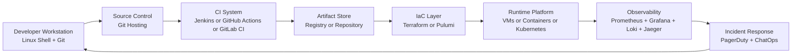
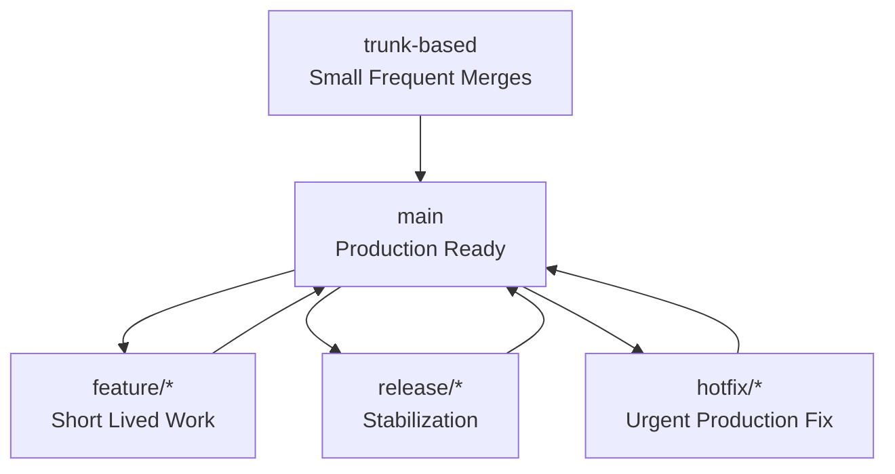
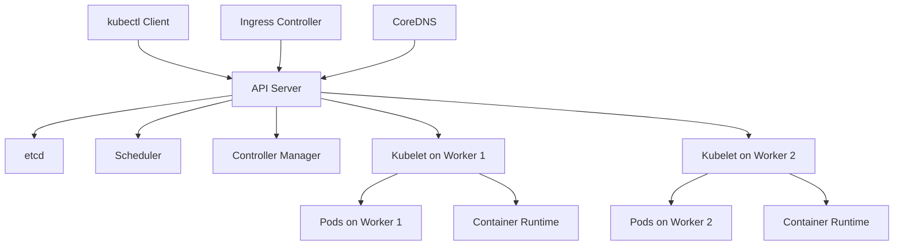
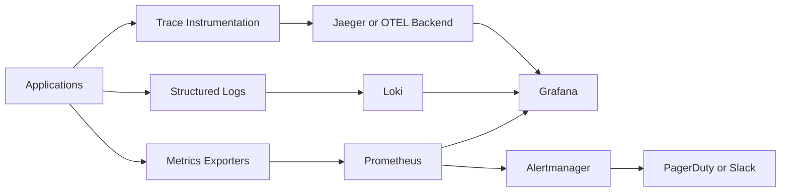
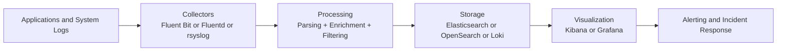
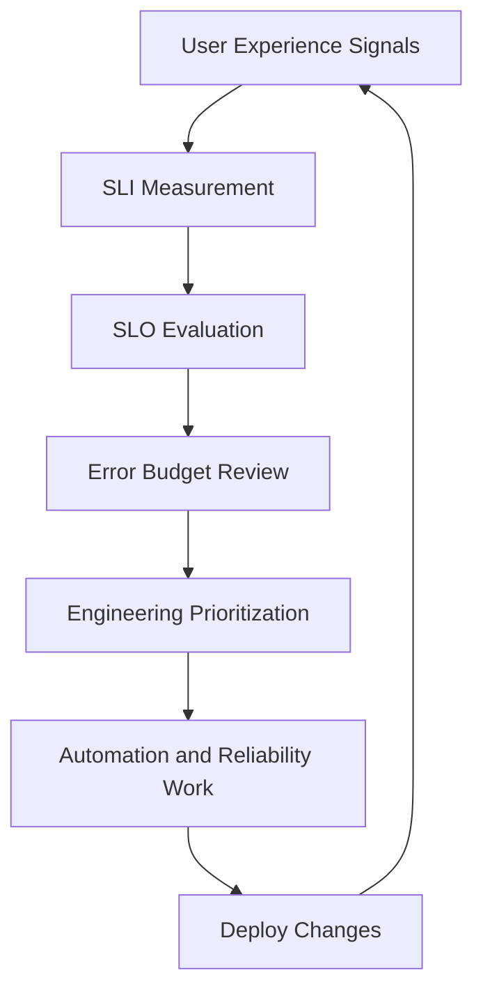

# Linux for DevOps

## 1. DevOps & Linux

### 1.1 Why Linux is the DevOps standard
Linux is the default operating system for modern infrastructure. Most cloud images, containers, Kubernetes nodes, CI runners, load balancers, and observability stacks run on Linux. DevOps engineers use Linux not just as a workstation environment, but as the runtime where services are deployed, logs are collected, networks are inspected, and automation is executed.

Why Linux dominates DevOps:
- Open source ecosystem with strong automation tooling.
- Strong scripting support with Bash, Python, Go, and package managers.
- Predictable remote administration through SSH.
- Native support for containers, cgroups, namespaces, and systemd.
- Rich networking, storage, and process inspection tools.
- Standard platform for cloud VMs and Kubernetes worker nodes.

Linux skills matter because DevOps work happens at the boundary between code and operations. If you can read logs, trace a port, inspect a process tree, tune a unit file, package an application, and automate infrastructure from the shell, you can support delivery at scale.

### 1.2 Linux skill map for DevOps engineers
A practical DevOps Linux skill map includes:

| Skill Area | What You Need | Why It Matters |
|---|---|---|
| Shell | Bash basics, pipes, redirection, variables, loops | Automation and incident response |
| Filesystem | Permissions, ownership, mounts, disk usage | Secure and reliable systems |
| Processes | ps, top, htop, kill, nice, systemd | Service administration |
| Networking | ss, ip, ping, traceroute, curl, dig, tcpdump | Connectivity troubleshooting |
| Packages | apt, dnf, yum, zypper, snap | Installing build/runtime dependencies |
| Logs | journalctl, rsyslog, app logs | Debugging failures |
| Scheduling | cron, systemd timers | Recurring automation |
| Security | sudo, SSH, firewalls, SELinux/AppArmor | Hardening and access control |
| Containers | Docker, Podman, BuildKit | Build and runtime portability |
| Kubernetes | kubeadm, kubectl, Helm | Orchestration and platform ops |
| CI/CD | Jenkins, GitHub Actions, GitLab CI | Automated delivery |
| IaC | Terraform, CloudFormation, Pulumi | Reproducible infrastructure |
| Observability | Prometheus, Grafana, Loki, Jaeger | Monitoring and incident response |

### 1.3 DevOps toolchain on Linux


### 1.4 Core Linux command patterns every DevOps engineer should know
```bash
# find files
find /var/log -type f -name '*.log'

# inspect disk usage
du -sh /var/lib/* | sort -h

# inspect listening ports
ss -tulpn

# inspect recent logs
journalctl -u nginx -n 100 --no-pager

# inspect CPU and memory
ps aux --sort=-%mem | head

# test an HTTP endpoint
curl -I https://example.com

# test DNS resolution
dig api.example.com +short
```

### 1.5 Linux distributions commonly used in DevOps
| Distribution Family | Examples | Common Use Cases |
|---|---|---|
| Debian-based | Ubuntu, Debian | Cloud VMs, CI runners, developer workstations |
| RHEL-based | RHEL, Rocky Linux, AlmaLinux, CentOS Stream | Enterprise servers, regulated environments |
| SUSE-based | SLES, openSUSE | Enterprise workloads, SAP landscapes |
| Minimal container OS | Alpine, Flatcar, Bottlerocket | Containers and Kubernetes nodes |

### 1.6 Package management quick reference
```bash
# Debian/Ubuntu
sudo apt update
sudo apt install -y git curl jq

# RHEL/Rocky/Alma
sudo dnf install -y git curl jq

# Older yum systems
sudo yum install -y git curl jq

# SUSE
sudo zypper install -y git curl jq
```

### 1.7 systemd essentials
Most modern Linux distributions use systemd. For DevOps engineers, systemd is important because it manages services, logs, dependencies, boot targets, timers, resource controls, and failure recovery.

```bash
sudo systemctl status nginx
sudo systemctl start nginx
sudo systemctl enable nginx
sudo systemctl restart nginx
sudo journalctl -u nginx --since '10 minutes ago' --no-pager
```

Example unit file:
```ini
[Unit]
Description=My API Service
After=network.target

[Service]
User=appuser
WorkingDirectory=/opt/myapi
ExecStart=/opt/myapi/bin/server
Restart=always
RestartSec=5
Environment=APP_ENV=production

[Install]
WantedBy=multi-user.target
```

### 1.8 Files, permissions, and ownership
```bash
chmod 640 config.yaml
chown appuser:appgroup config.yaml
umask 027
```

Permission basics:
- Read: `r`
- Write: `w`
- Execute: `x`
- User, group, and others control access boundaries.

### 1.9 SSH for remote operations
```bash
ssh user@server
ssh -i ~/.ssh/id_rsa ubuntu@10.0.0.10
scp app.tar.gz user@server:/opt/app/
rsync -avz ./site/ user@server:/var/www/html/
```

SSH best practices:
- Prefer key-based authentication.
- Disable password auth where possible.
- Rotate keys and remove stale access.
- Use `~/.ssh/config` for maintainable host aliases.
- Consider bastions or VPN access for private hosts.

Example `~/.ssh/config`:
```sshconfig
Host prod-bastion
  HostName bastion.example.com
  User ops
  IdentityFile ~/.ssh/prod_ops

Host prod-app-1
  HostName 10.20.1.11
  User ubuntu
  ProxyJump prod-bastion
  IdentityFile ~/.ssh/prod_ops
```

### 1.10 Bash scripting essentials
```bash
#!/usr/bin/env bash
set -euo pipefail

BACKUP_DIR=/var/backups/app
TIMESTAMP=$(date +%F-%H%M%S)
ARCHIVE="$BACKUP_DIR/app-$TIMESTAMP.tar.gz"

mkdir -p "$BACKUP_DIR"
tar -czf "$ARCHIVE" /opt/myapp/data

echo "Backup created: $ARCHIVE"
```

Bash script rules for production:
- Use `set -euo pipefail`.
- Quote variables.
- Validate inputs.
- Log clearly.
- Prefer idempotent operations.
- Exit with useful status codes.

### 1.11 Linux troubleshooting workflow
1. Confirm symptom.
2. Identify scope.
3. Check recent changes.
4. Inspect service status.
5. Read logs.
6. Validate network path.
7. Validate disk, memory, and CPU.
8. Confirm config files.
9. Roll back or patch safely.
10. Capture findings in a runbook or postmortem.

### 1.12 Daily Linux checklist for DevOps teams
- Check system health dashboards.
- Validate backup jobs.
- Review failed cron jobs and timers.
- Review security updates.
- Confirm CI runners and build agents are healthy.
- Validate monitoring targets are up.
- Review disk growth on key nodes.
- Review certificate expiry.

### 1.13 Linux glossary for DevOps
| Term | Meaning |
|---|---|
| Kernel | Core of the operating system |
| Distro | Linux distribution combining kernel + userland |
| Init | First userspace process, typically systemd |
| Daemon | Background service process |
| TTY | Terminal interface |
| PID | Process identifier |
| Cgroup | Resource isolation/control mechanism |
| Namespace | Isolation primitive used by containers |
| FHS | Filesystem Hierarchy Standard |

### 1.14 Important Linux paths
| Path | Purpose |
|---|---|
| `/etc` | Configuration files |
| `/var/log` | Log files |
| `/var/lib` | Application state |
| `/usr/bin` | Common user commands |
| `/opt` | Optional third-party software |
| `/home` | User home directories |
| `/tmp` | Temporary files |
| `/proc` | Kernel and process information |
| `/sys` | Device and kernel state |

### 1.15 Practical command examples
```bash
# show mounted filesystems
mount | column -t

# show memory usage
free -h

# show uptime and load
uptime

# check who is logged in
who

# inspect a process tree
pstree -p

# compare file contents
diff -u old.conf new.conf
```

### 1.16 What makes Linux central to DevOps success
Linux succeeds in DevOps because it is scriptable, observable, composable, and close to production realities. Learning Linux deeply improves everything else: your Git workflows become faster, your CI runners become easier to maintain, your infrastructure becomes reproducible, and your incidents become easier to diagnose.

---

## 2. Git & Version Control

### 2.1 Why Git matters in DevOps
Git is the system of record for application code, infrastructure definitions, CI pipelines, Kubernetes manifests, Helm charts, policies, and documentation. In DevOps, Git is not just source control. It is the trigger point for automation.

### 2.2 Git configuration basics
```bash
git config --global user.name "Your Name"
git config --global user.email "you@example.com"
git config --global init.defaultBranch main
git config --global pull.rebase false
git config --global core.editor vim
```

Example `~/.gitconfig`:
```ini
[user]
    name = Your Name
    email = you@example.com
[init]
    defaultBranch = main
[pull]
    rebase = false
[core]
    editor = vim
[alias]
    st = status -sb
    co = checkout
    br = branch
    lg = log --oneline --graph --decorate --all
[merge]
    ff = only
```

### 2.3 Repository lifecycle basics
```bash
# initialize a repository
git init

# clone a remote repository
git clone git@github.com:org/project.git

# see current status
git status

# stage changes
git add .

# commit changes
git commit -m "Add deployment config"

# see history
git log --oneline --graph --decorate --all
```

### 2.4 Common Git commands for DevOps engineers
| Command | Purpose |
|---|---|
| `git init` | Start a new repository |
| `git clone` | Copy an existing repository |
| `git status` | Show working tree changes |
| `git add` | Stage files |
| `git commit` | Save staged changes |
| `git pull` | Fetch and integrate changes |
| `git fetch` | Download remote refs only |
| `git push` | Publish local changes |
| `git branch` | List or manage branches |
| `git checkout` | Switch branches or restore files |
| `git switch` | Modern branch switch command |
| `git merge` | Merge history |
| `git rebase` | Replay commits onto another base |
| `git cherry-pick` | Apply selected commit(s) |
| `git stash` | Temporarily save local changes |
| `git tag` | Mark versions/releases |

### 2.5 Branching and merging workflow
```bash
# create and switch to a branch
git switch -c feature/add-healthcheck

# push and set upstream
git push -u origin feature/add-healthcheck

# merge main into your branch
git fetch origin
git merge origin/main

# open a pull request after push
```

### 2.6 Rebase workflow
Rebasing keeps history linear, but must be used carefully on shared branches.

```bash
git fetch origin
git rebase origin/main

# if conflicts occur, resolve files then
git add conflicted-file
git rebase --continue
```

Use rebase when:
- You want a clean feature branch history.
- Your team accepts rebased feature branches.
- You have not published the branch widely, or teammates agree on the process.

Avoid rebasing:
- Shared branches with multiple contributors unless coordinated.
- Release branches in tightly controlled environments where audit trail matters.

### 2.7 Cherry-pick workflow
Cherry-pick is useful when hotfixes need to move selectively across branches.

```bash
# apply a commit from another branch
git cherry-pick abc1234

# cherry-pick a range
git cherry-pick startSHA^..endSHA
```

### 2.8 Stashing changes
```bash
git stash push -m "wip debug nginx issue"
git stash list
git stash pop
```

### 2.9 Tags and releases
```bash
git tag -a v1.2.0 -m "Release v1.2.0"
git push origin v1.2.0
```

Tags are often used by CI/CD systems to trigger release pipelines.

### 2.10 Undo operations carefully
```bash
# unstage a file
git restore --staged README.md

# discard local changes in a file
git restore README.md

# revert a commit safely
git revert HEAD

# reset branch to a prior commit locally only
git reset --hard HEAD~1
```

### 2.11 Git branching strategies diagram


### 2.12 GitFlow overview
GitFlow is a branch-heavy workflow with long-lived branches like `main`, `develop`, `release/*`, and `hotfix/*`.

Typical flow:
1. Create feature branch from `develop`.
2. Merge feature into `develop`.
3. Cut release branch from `develop`.
4. Stabilize release branch.
5. Merge release to `main` and back to `develop`.
6. Create hotfix from `main` if needed.

Advantages:
- Clear release staging structure.
- Works well for scheduled release trains.

Trade-offs:
- More merge overhead.
- Slower feedback.
- Less aligned with continuous delivery.

### 2.13 Trunk-based development overview
Trunk-based development uses one main integration branch, short-lived feature branches, and frequent merges.

Advantages:
- Faster integration.
- Fewer merge conflicts.
- Better fit for CI/CD.
- Encourages feature flags and smaller changes.

Trade-offs:
- Requires stronger automated tests.
- Teams must keep branch lifetimes short.

### 2.14 Git hooks
Git hooks automate local or server-side checks.

Common hooks:
- `pre-commit`
- `commit-msg`
- `pre-push`
- `post-merge`

Example `pre-commit` hook:
```bash
#!/usr/bin/env bash
set -euo pipefail

if grep -R "password=" .; then
  echo "Potential secret detected"
  exit 1
fi
```

Store hooks in `.git/hooks` or manage them with tools like Husky, pre-commit, or Lefthook.

### 2.15 Secure Git usage in DevOps
- Never commit secrets.
- Use `.gitignore` aggressively for credentials, `.env`, and artifacts.
- Scan for secrets in CI.
- Sign commits if required by policy.
- Protect main branches with reviews and status checks.

Example `.gitignore`:
```gitignore
.env
*.pem
*.key
node_modules/
.terraform/
*.tfstate
*.tfstate.backup
```

### 2.16 Git remotes
```bash
git remote -v
git remote add origin git@github.com:org/repo.git
git remote set-url origin git@github.com:org/repo.git
```

### 2.17 Working with submodules
```bash
git submodule add git@github.com:org/shared-lib.git vendor/shared-lib
git submodule update --init --recursive
```

Use submodules carefully; they add operational complexity.

### 2.18 Git bisect for incident debugging
```bash
git bisect start
git bisect bad
git bisect good v1.0.0
# test each revision until culprit found
git bisect reset
```

### 2.19 Patch-based collaboration
```bash
git format-patch -1 HEAD
git apply change.patch
```

### 2.20 Git reflog for recovery
```bash
git reflog
git reset --hard HEAD@{2}
```

### 2.21 Pull request best practices
- Keep PRs small.
- Include rollout and rollback notes.
- Link changes to tickets.
- Require CI checks.
- Include screenshots or logs when relevant.
- Explain infrastructure impact clearly.

### 2.22 GitOps connection
In GitOps, Git becomes the desired-state source for infrastructure and deployment configuration. Reconciliation agents compare cluster state to Git state and continuously close drift.

### 2.23 Sample release workflow
```bash
git switch main
git pull --ff-only
git tag -a v2.3.1 -m "Release v2.3.1"
git push origin main --tags
```

### 2.24 Daily Git checklist for DevOps teams
- Validate branch protections.
- Review stale branches.
- Enforce secret scanning.
- Ensure release tags are signed or controlled.
- Keep CI pipeline definitions versioned.

---

## 3. CI/CD on Linux

### 3.1 Why CI/CD relies on Linux
CI/CD systems frequently run on Linux because Linux offers strong automation, package availability, shell scripting, container support, and lower overhead for ephemeral build agents.

### 3.2 CI/CD core concepts
- Continuous Integration: merge and validate code frequently.
- Continuous Delivery: keep software releasable.
- Continuous Deployment: automatically deploy every validated change.

### 3.3 CI/CD pipeline stages


### 3.4 Linux build agent responsibilities
A Linux build agent commonly handles:
- Source checkout.
- Dependency installation.
- Build tool execution.
- Test execution.
- Container image builds.
- Artifact upload.
- Secrets retrieval.
- Deployment orchestration.

### 3.5 Jenkins installation on Linux
Ubuntu example:
```bash
sudo apt update
sudo apt install -y fontconfig openjdk-17-jre curl
curl -fsSL https://pkg.jenkins.io/debian-stable/jenkins.io-2023.key | sudo tee \
  /usr/share/keyrings/jenkins-keyring.asc > /dev/null
echo deb [signed-by=/usr/share/keyrings/jenkins-keyring.asc] \
  https://pkg.jenkins.io/debian-stable binary/ | sudo tee \
  /etc/apt/sources.list.d/jenkins.list > /dev/null
sudo apt update
sudo apt install -y jenkins
sudo systemctl enable --now jenkins
```

### 3.6 Jenkins service operations
```bash
sudo systemctl status jenkins
sudo journalctl -u jenkins -n 200 --no-pager
sudo cat /var/lib/jenkins/secrets/initialAdminPassword
```

### 3.7 Jenkins pipeline concepts
- Controller manages orchestration.
- Agents execute jobs.
- Pipelines are code in `Jenkinsfile`.
- Plugins add SCM, build, scan, and deploy integrations.

### 3.8 Declarative Jenkinsfile example
```groovy
pipeline {
  agent any

  environment {
    REGISTRY = 'registry.example.com'
    IMAGE = 'myapp'
  }

  stages {
    stage('Checkout') {
      steps {
        checkout scm
      }
    }

    stage('Build') {
      steps {
        sh 'make build'
      }
    }

    stage('Test') {
      steps {
        sh 'make test'
      }
    }

    stage('Build Image') {
      steps {
        sh 'docker build -t $REGISTRY/$IMAGE:$BUILD_NUMBER .'
      }
    }

    stage('Push Image') {
      steps {
        withCredentials([usernamePassword(credentialsId: 'registry-creds', usernameVariable: 'USER', passwordVariable: 'PASS')]) {
          sh 'echo $PASS | docker login $REGISTRY -u $USER --password-stdin'
          sh 'docker push $REGISTRY/$IMAGE:$BUILD_NUMBER'
        }
      }
    }
  }
}
```

### 3.9 Scripted Jenkins pipeline example
```groovy
node {
  stage('Checkout') {
    checkout scm
  }
  stage('Build') {
    sh 'npm ci'
    sh 'npm run build'
  }
  stage('Test') {
    sh 'npm test'
  }
}
```

### 3.10 Jenkins agent models
| Agent Type | Description | Best Use |
|---|---|---|
| Static VM | Persistent Linux node | Stable enterprise workloads |
| Dynamic container | Ephemeral container agents | Scale-out parallel jobs |
| Kubernetes agent | Pod-per-build model | Cloud-native CI |
| Bare metal | Direct host execution | Specialized toolchains |

### 3.11 Jenkins hardening tips
- Use HTTPS and reverse proxy.
- Disable unnecessary plugins.
- Store secrets in credential store.
- Back up `$JENKINS_HOME`.
- Run agents with least privilege.
- Prefer ephemeral agents.
- Restrict shell access on shared builders.

### 3.12 GitHub Actions on Linux
GitHub Actions uses workflows defined in `.github/workflows/*.yml`. Linux runners are common for builds, tests, packaging, and deployment.

Example workflow:
```yaml
name: ci

on:
  push:
    branches: [main]
  pull_request:

jobs:
  test:
    runs-on: ubuntu-latest
    steps:
      - uses: actions/checkout@v4
      - uses: actions/setup-node@v4
        with:
          node-version: '20'
      - run: npm ci
      - run: npm test
```

### 3.13 Self-hosted GitHub Actions runners on Linux
Why self-hosted runners:
- Custom network access.
- Specialized dependencies.
- Faster builds with cached tooling.
- Compliance requirements.

Setup outline:
1. Create a runner in repository/org settings.
2. Download runner package.
3. Configure runner with token.
4. Install as a service.

```bash
mkdir actions-runner && cd actions-runner
curl -o actions-runner-linux-x64.tar.gz -L https://github.com/actions/runner/releases/download/v2.317.0/actions-runner-linux-x64-2.317.0.tar.gz
tar xzf ./actions-runner-linux-x64.tar.gz
./config.sh --url https://github.com/org/repo --token RUNNER_TOKEN
sudo ./svc.sh install
sudo ./svc.sh start
```

### 3.14 Self-hosted runner operational guidance
- Use dedicated service accounts.
- Isolate runners per trust level.
- Avoid sharing privileged runners across teams.
- Auto-scale ephemeral runners for safer workloads.
- Clean workspaces between jobs.

### 3.15 GitLab CI on Linux
GitLab CI uses `.gitlab-ci.yml` and GitLab Runner. Linux runners can use shell, Docker, or Kubernetes executors.

Example `.gitlab-ci.yml`:
```yaml
stages:
  - build
  - test
  - deploy

build:
  stage: build
  script:
    - make build

unit_test:
  stage: test
  script:
    - make test

deploy_prod:
  stage: deploy
  script:
    - ./deploy.sh
  when: manual
  only:
    - main
```

### 3.16 GitLab Runner installation
```bash
curl -L --output gitlab-runner.deb https://gitlab-runner-downloads.s3.amazonaws.com/latest/deb/gitlab-runner_amd64.deb
sudo dpkg -i gitlab-runner.deb
sudo gitlab-runner register
sudo systemctl enable --now gitlab-runner
```

### 3.17 CI/CD secrets handling on Linux
Never hardcode secrets in pipeline files. Prefer:
- Jenkins Credentials.
- GitHub Actions Secrets.
- GitLab CI Variables.
- Vault integration.
- Short-lived cloud identities.

### 3.18 Artifact handling in pipelines
Artifacts may include:
- Build outputs.
- Test reports.
- Coverage reports.
- Container images.
- Helm charts.
- SBOMs.

### 3.19 Build cache strategies
- Language package caches.
- Docker layer caching.
- BuildKit cache exports.
- Remote cache services.
- Immutable dependencies.

### 3.20 Linux troubleshooting for build agents
Check:
- Disk space.
- Memory pressure.
- CPU saturation.
- Package mirror access.
- DNS resolution.
- Clock drift.
- Credentials and token expiry.
- Container daemon health.

Useful commands:
```bash
df -h
free -h
journalctl -u docker -n 100 --no-pager
ss -tulpn
curl -v https://registry.example.com/v2/
```

### 3.21 Example deployment gate logic
```bash
#!/usr/bin/env bash
set -euo pipefail

if ! curl -fsS https://staging.example.com/health; then
  echo "Staging health check failed"
  exit 1
fi

echo "Promoting release"
```

### 3.22 Promotion patterns
| Pattern | Description | Notes |
|---|---|---|
| Rebuild per environment | Build separately in each env | Less reproducible |
| Promote same artifact | Build once, promote unchanged | Best for traceability |
| Blue/green | Parallel environments | Easier rollback |
| Canary | Partial traffic shift | Better risk management |

### 3.23 Deployment rollback basics
- Keep prior artifact versions available.
- Use immutable image tags plus digests.
- Maintain DB migration rollback plans.
- Automate rollback triggers where safe.

### 3.24 Pipeline quality gates
- Unit tests.
- Integration tests.
- Linting.
- SAST.
- Dependency scanning.
- Image scanning.
- Policy checks.
- Manual approval for sensitive stages.

### 3.25 Sample Linux CI node bootstrap checklist
- Install language runtimes.
- Install container tooling.
- Configure DNS and CA certificates.
- Configure system limits.
- Set up logging and monitoring.
- Harden SSH and sudo.
- Rotate runner tokens.

---

## 4. Infrastructure as Code

### 4.1 Why IaC matters in DevOps
Infrastructure as Code makes infrastructure versioned, reviewable, testable, and reproducible. Linux is the main execution environment for IaC tooling in CI pipelines and operations workflows.

### 4.2 Terraform overview
Terraform defines infrastructure in HCL and uses providers to manage cloud or platform resources.

Basic workflow:
```bash
terraform init
terraform fmt
terraform validate
terraform plan
terraform apply
```

### 4.3 Terraform project structure
```text
terraform/
├── main.tf
├── variables.tf
├── outputs.tf
├── providers.tf
├── versions.tf
├── terraform.tfvars
└── modules/
```

### 4.4 Terraform example
```hcl
terraform {
  required_version = ">= 1.6.0"
  required_providers {
    aws = {
      source  = "hashicorp/aws"
      version = "~> 5.0"
    }
  }
}

provider "aws" {
  region = var.region
}

resource "aws_s3_bucket" "artifacts" {
  bucket = var.bucket_name
}
```

### 4.5 Terraform state management
State is critical and sensitive.

Best practices:
- Use remote backends.
- Enable locking.
- Encrypt at rest.
- Restrict access.
- Never commit state files.

Popular backends:
- S3 + DynamoDB lock table.
- Terraform Cloud.
- Azure Storage.
- GCS.

### 4.6 Terraform Linux provisioning patterns
Common techniques:
- Use `cloud-init` to bootstrap instances.
- Pass startup scripts with metadata.
- Use config management after provisioning.
- Keep instance bootstrap idempotent.

Example user data:
```bash
#!/usr/bin/env bash
set -euo pipefail
apt update
apt install -y nginx
systemctl enable --now nginx
```

### 4.7 Terraform module practices
- Keep modules focused.
- Version modules.
- Document inputs/outputs.
- Avoid hidden behavior.
- Use `locals` for clarity.

### 4.8 CloudFormation overview
CloudFormation is AWS-native IaC using YAML or JSON templates.

Example snippet:
```yaml
Resources:
  MyBucket:
    Type: AWS::S3::Bucket
    Properties:
      BucketName: my-devops-artifacts
```

Strengths:
- Native AWS integration.
- Stack drift detection.
- Change sets.

Trade-offs:
- AWS-only.
- Verbose templates for complex cases.

### 4.9 Pulumi overview
Pulumi uses general-purpose languages like TypeScript, Python, Go, or C# to define infrastructure.

TypeScript example:
```typescript
import * as aws from "@pulumi/aws";

const bucket = new aws.s3.Bucket("artifacts", {
  bucket: "my-devops-artifacts",
});
```

### 4.10 IaC comparison table
| Tool | Language | Best Fit | Notes |
|---|---|---|---|
| Terraform | HCL | Multi-cloud infrastructure | Large ecosystem |
| CloudFormation | YAML/JSON | AWS-native environments | Strong AWS support |
| Pulumi | TS/Python/Go/C# | Teams preferring general languages | Good developer ergonomics |

### 4.11 Linux provisioning layers
A practical stack often looks like:
1. Terraform creates VM, network, disk, IAM.
2. Cloud-init configures packages and users.
3. Ansible or scripts apply software config.
4. systemd manages runtime services.
5. Monitoring agents are installed at bootstrap.

### 4.12 Example cloud-init file
```yaml
#cloud-config
package_update: true
packages:
  - nginx
  - curl
write_files:
  - path: /etc/motd
    content: |
      Managed by cloud-init
runcmd:
  - systemctl enable --now nginx
```

### 4.13 Drift management
Drift happens when manual changes differ from declared state.

Mitigation:
- Limit manual changes.
- Use drift detection tools.
- Reconcile through pipelines.
- Review emergency changes post-incident.

### 4.14 Policy as code
Policy tools enforce guardrails such as:
- Required tags.
- Encryption enabled.
- No public buckets.
- Allowed instance types.

Examples:
- Open Policy Agent.
- Sentinel.
- Conftest.

### 4.15 IaC testing strategies
- `terraform validate`
- `terraform plan` in CI
- Static analysis with Checkov or tfsec
- Terratest for integration testing
- Policy tests

### 4.16 Secret management in IaC
- Avoid inline secrets in code.
- Use secret stores or encrypted values.
- Mark sensitive outputs.
- Limit state exposure.

### 4.17 Reusable Linux server baseline module
A reusable module often includes:
- Standard users/groups.
- SSH hardening.
- Cloud-init.
- Logging agent.
- Monitoring agent.
- Firewall rules.
- Common tags.

### 4.18 Example Terraform variable definitions
```hcl
variable "region" {
  type        = string
  description = "AWS region"
}

variable "bucket_name" {
  type        = string
  description = "Artifact bucket name"
}
```

### 4.19 Pipeline for IaC delivery
A safe IaC pipeline usually includes:
- Formatting check.
- Validation.
- Security scan.
- Plan artifact.
- Approval.
- Apply from controlled environment.

### 4.20 Production IaC checklist
- Remote state locked and encrypted.
- Least privilege credentials.
- Modules versioned.
- Review required.
- Cost visibility.
- Rollback or remediation strategy documented.

---

## 5. Kubernetes on Linux

### 5.1 Why Linux matters for Kubernetes
Kubernetes nodes are primarily Linux systems. Kubernetes relies on Linux primitives such as cgroups, namespaces, iptables/nftables, overlay networks, and container runtimes.

### 5.2 Kubernetes architecture diagram


### 5.3 kubeadm cluster setup overview
kubeadm is a common way to bootstrap a Kubernetes cluster on Linux for labs, learning, or some production models.

High-level steps:
1. Prepare Linux nodes.
2. Install container runtime.
3. Install kubeadm, kubelet, kubectl.
4. Initialize control plane.
5. Join workers.
6. Install CNI plugin.

### 5.4 Linux prerequisites for kubeadm
- Swap disabled.
- Required kernel modules loaded.
- Sysctl settings enabled.
- Container runtime installed.
- Time synchronized.
- Unique hostname and MAC per node.

Example setup:
```bash
sudo swapoff -a
sudo sed -i '/ swap / s/^/#/' /etc/fstab

cat <<EOF | sudo tee /etc/modules-load.d/k8s.conf
overlay
br_netfilter
EOF

sudo modprobe overlay
sudo modprobe br_netfilter

cat <<EOF | sudo tee /etc/sysctl.d/k8s.conf
net.bridge.bridge-nf-call-iptables = 1
net.bridge.bridge-nf-call-ip6tables = 1
net.ipv4.ip_forward = 1
EOF

sudo sysctl --system
```

### 5.5 Installing containerd
```bash
sudo apt update
sudo apt install -y containerd
sudo mkdir -p /etc/containerd
containerd config default | sudo tee /etc/containerd/config.toml
sudo systemctl restart containerd
sudo systemctl enable containerd
```

### 5.6 Installing Kubernetes packages
```bash
sudo apt update
sudo apt install -y apt-transport-https ca-certificates curl gpg
curl -fsSL https://pkgs.k8s.io/core:/stable:/v1.29/deb/Release.key | \
  sudo gpg --dearmor -o /etc/apt/keyrings/kubernetes-apt-keyring.gpg
echo 'deb [signed-by=/etc/apt/keyrings/kubernetes-apt-keyring.gpg] https://pkgs.k8s.io/core:/stable:/v1.29/deb/ /' | \
  sudo tee /etc/apt/sources.list.d/kubernetes.list
sudo apt update
sudo apt install -y kubelet kubeadm kubectl
sudo apt-mark hold kubelet kubeadm kubectl
```

### 5.7 Initialize control plane
```bash
sudo kubeadm init --pod-network-cidr=10.244.0.0/16
```

Then configure kubectl:
```bash
mkdir -p $HOME/.kube
sudo cp -i /etc/kubernetes/admin.conf $HOME/.kube/config
sudo chown $(id -u):$(id -g) $HOME/.kube/config
```

### 5.8 Install a CNI plugin
Example using Flannel:
```bash
kubectl apply -f https://github.com/flannel-io/flannel/releases/latest/download/kube-flannel.yml
```

### 5.9 Join worker nodes
Run the `kubeadm join` command produced by `kubeadm init` on each worker.

### 5.10 kubectl cheat sheet
```bash
kubectl get nodes
kubectl get pods -A
kubectl describe pod mypod
kubectl logs mypod
kubectl logs -f deployment/myapp
kubectl exec -it mypod -- /bin/sh
kubectl get svc,ingress
kubectl get events --sort-by=.lastTimestamp
kubectl top nodes
kubectl top pods -A
```

### 5.11 Pods
Pods are the smallest deployable unit in Kubernetes.

Example pod:
```yaml
apiVersion: v1
kind: Pod
metadata:
  name: nginx
spec:
  containers:
    - name: nginx
      image: nginx:1.25
      ports:
        - containerPort: 80
```

### 5.12 Deployments
Deployments manage desired replica count and rollout strategy.

Example deployment:
```yaml
apiVersion: apps/v1
kind: Deployment
metadata:
  name: web
spec:
  replicas: 3
  selector:
    matchLabels:
      app: web
  template:
    metadata:
      labels:
        app: web
    spec:
      containers:
        - name: nginx
          image: nginx:1.25
          ports:
            - containerPort: 80
```

### 5.13 Services
Service types:
- ClusterIP
- NodePort
- LoadBalancer
- ExternalName

Example service:
```yaml
apiVersion: v1
kind: Service
metadata:
  name: web
spec:
  selector:
    app: web
  ports:
    - port: 80
      targetPort: 80
  type: ClusterIP
```

### 5.14 Ingress
Ingress manages HTTP(S) routing into services.

Example ingress:
```yaml
apiVersion: networking.k8s.io/v1
kind: Ingress
metadata:
  name: web
spec:
  ingressClassName: nginx
  rules:
    - host: web.example.com
      http:
        paths:
          - path: /
            pathType: Prefix
            backend:
              service:
                name: web
                port:
                  number: 80
```

### 5.15 ConfigMaps
ConfigMaps store non-secret configuration.

```bash
kubectl create configmap app-config --from-literal=APP_MODE=prod
```

Example usage:
```yaml
envFrom:
  - configMapRef:
      name: app-config
```

### 5.16 Secrets
Secrets store sensitive values, but need careful handling.

```bash
kubectl create secret generic db-creds \
  --from-literal=username=app \
  --from-literal=password='supersecret'
```

Notes:
- Base64 is encoding, not encryption.
- Enable encryption at rest.
- Prefer external secret managers for high-security environments.

### 5.17 RBAC basics
RBAC controls access to Kubernetes resources.

Example role:
```yaml
apiVersion: rbac.authorization.k8s.io/v1
kind: Role
metadata:
  namespace: default
  name: pod-reader
rules:
  - apiGroups: [""]
    resources: ["pods"]
    verbs: ["get", "list", "watch"]
```

RoleBinding:
```yaml
apiVersion: rbac.authorization.k8s.io/v1
kind: RoleBinding
metadata:
  name: read-pods
  namespace: default
subjects:
  - kind: User
    name: jane@example.com
    apiGroup: rbac.authorization.k8s.io
roleRef:
  kind: Role
  name: pod-reader
  apiGroup: rbac.authorization.k8s.io
```

### 5.18 Helm overview
Helm is the package manager for Kubernetes.

```bash
helm repo add bitnami https://charts.bitnami.com/bitnami
helm repo update
helm install my-nginx bitnami/nginx
helm list -A
helm upgrade my-nginx bitnami/nginx
helm rollback my-nginx 1
```

### 5.19 Helm chart structure
```text
mychart/
├── Chart.yaml
├── values.yaml
├── templates/
└── charts/
```

### 5.20 Namespace strategy
Use namespaces to isolate teams, environments, or applications.

```bash
kubectl create namespace payments
kubectl config set-context --current --namespace=payments
```

### 5.21 Resource requests and limits
```yaml
resources:
  requests:
    cpu: "100m"
    memory: "128Mi"
  limits:
    cpu: "500m"
    memory: "512Mi"
```

### 5.22 Health probes
```yaml
livenessProbe:
  httpGet:
    path: /health
    port: 8080
  initialDelaySeconds: 10
readinessProbe:
  httpGet:
    path: /ready
    port: 8080
  initialDelaySeconds: 5
```

### 5.23 Rolling updates
```bash
kubectl rollout status deployment/web
kubectl rollout history deployment/web
kubectl rollout undo deployment/web
```

### 5.24 Troubleshooting pods on Linux
- Check events.
- Check logs.
- Inspect image pull errors.
- Verify DNS.
- Verify node pressure.
- Inspect CNI plugin health.
- Check kubelet logs.

Useful commands:
```bash
kubectl describe pod web-123
kubectl logs web-123 --previous
journalctl -u kubelet -n 200 --no-pager
crictl ps -a
crictl logs CONTAINER_ID
```

### 5.25 Storage basics
Common storage patterns:
- `emptyDir`
- hostPath
- PersistentVolume
- PersistentVolumeClaim
- StorageClass

### 5.26 Example PVC
```yaml
apiVersion: v1
kind: PersistentVolumeClaim
metadata:
  name: data
spec:
  accessModes:
    - ReadWriteOnce
  resources:
    requests:
      storage: 10Gi
```

### 5.27 Security basics
- Use RBAC.
- Limit service account permissions.
- Use NetworkPolicies.
- Scan images.
- Sign images where possible.
- Enforce Pod Security Standards.

### 5.28 NetworkPolicy example
```yaml
apiVersion: networking.k8s.io/v1
kind: NetworkPolicy
metadata:
  name: allow-ingress-from-ingress-controller
spec:
  podSelector:
    matchLabels:
      app: web
  policyTypes:
    - Ingress
  ingress:
    - from:
        - namespaceSelector:
            matchLabels:
              name: ingress-nginx
```

### 5.29 Common production add-ons
- Ingress controller
- cert-manager
- metrics-server
- Prometheus stack
- external-dns
- external-secrets
- cluster-autoscaler

### 5.30 Kubernetes operational checklist
- Backup etcd or use managed control plane.
- Patch nodes regularly.
- Rotate certificates and tokens.
- Enforce policies.
- Monitor control plane and workloads.
- Test restore procedures.

---

## 6. Monitoring & Observability

### 6.1 Why observability matters
Observability lets teams detect, understand, and remediate issues using metrics, logs, and traces. Linux is the typical platform for agents, collectors, and backends.

### 6.2 Observability stack diagram


### 6.3 The three pillars
- Metrics: numeric time-series data.
- Logs: event records.
- Traces: distributed request paths.

### 6.4 Prometheus overview
Prometheus scrapes metrics endpoints and stores time-series data locally.

Key concepts:
- Targets
- Exporters
- PromQL
- Alerts
- Service discovery

### 6.5 Prometheus installation on Linux
Binary-based installation outline:
```bash
sudo useradd --no-create-home --shell /usr/sbin/nologin prometheus
curl -LO https://github.com/prometheus/prometheus/releases/latest/download/prometheus-*.linux-amd64.tar.gz
# extract, copy binaries, create config and service
```

### 6.6 Minimal Prometheus config
```yaml
global:
  scrape_interval: 15s

scrape_configs:
  - job_name: prometheus
    static_configs:
      - targets: ['localhost:9090']
  - job_name: node
    static_configs:
      - targets: ['server1:9100', 'server2:9100']
```

### 6.7 node_exporter
node_exporter exposes Linux host metrics.

Common metrics:
- CPU usage
- Memory usage
- Disk utilization
- Filesystem errors
- Network statistics
- Load average

Run example:
```bash
./node_exporter
```

### 6.8 Useful PromQL examples
```promql
up
rate(node_cpu_seconds_total{mode!="idle"}[5m])
node_memory_MemAvailable_bytes / node_memory_MemTotal_bytes * 100
sum(rate(container_cpu_usage_seconds_total[5m])) by (pod)
```

### 6.9 Alertmanager overview
Alertmanager handles routing, grouping, silencing, and deduplication of Prometheus alerts.

Example routing snippet:
```yaml
route:
  receiver: default
  routes:
    - matchers:
        - severity="critical"
      receiver: pagerduty

receivers:
  - name: default
  - name: pagerduty
    pagerduty_configs:
      - routing_key: YOUR_KEY
```

### 6.10 Grafana overview
Grafana provides dashboards and alert visualization across metrics, logs, and traces.

Best practices:
- Standardize dashboard folders.
- Use variables.
- Keep dashboards actionable.
- Version control dashboard JSON or provisioning files.

### 6.11 Loki for logs
Loki stores logs efficiently by indexing labels rather than full text. It integrates tightly with Grafana.

Typical flow:
- promtail or agent ships logs.
- Loki stores them.
- Grafana queries them.

### 6.12 Jaeger for tracing
Jaeger helps follow distributed requests through microservices.

Use cases:
- Latency investigation.
- Service dependency mapping.
- Root cause analysis.

### 6.13 OpenTelemetry in observability stacks
OpenTelemetry standardizes collection of metrics, logs, and traces.

Benefits:
- Vendor-neutral instrumentation.
- Consistent data pipeline.
- Flexible export targets.

### 6.14 Golden signals
The four golden signals:
- Latency
- Traffic
- Errors
- Saturation

### 6.15 RED and USE methods
RED for services:
- Rate
- Errors
- Duration

USE for resources:
- Utilization
- Saturation
- Errors

### 6.16 Host monitoring checklist
- CPU busy and steal time.
- Memory available and swap use.
- Disk usage and inode pressure.
- Network errors and drops.
- Process count.
- Service restarts.

### 6.17 Example node_exporter systemd unit
```ini
[Unit]
Description=Prometheus Node Exporter
After=network.target

[Service]
User=node_exporter
ExecStart=/usr/local/bin/node_exporter
Restart=always

[Install]
WantedBy=multi-user.target
```

### 6.18 Dashboard categories
| Dashboard | Typical Panels |
|---|---|
| Host | CPU, memory, disk, network |
| Kubernetes | cluster, node, pod, namespace |
| Application | request rate, latency, errors |
| CI/CD | pipeline duration, failure rate |
| Database | QPS, latency, locks, replication lag |

### 6.19 Alert design principles
- Alert on symptoms users feel.
- Avoid noisy thresholds.
- Include runbook links.
- Tune severity and routing.
- Use multi-window burn-rate alerts for SLOs.

### 6.20 Example Prometheus alert rule
```yaml
groups:
  - name: host
    rules:
      - alert: HostOutOfDisk
        expr: (node_filesystem_avail_bytes{fstype!="tmpfs"} / node_filesystem_size_bytes{fstype!="tmpfs"}) < 0.1
        for: 10m
        labels:
          severity: warning
        annotations:
          summary: Host disk nearly full
          description: Less than 10 percent disk space available.
```

### 6.21 Log-to-metric patterns
Examples:
- Count HTTP 5xx from logs.
- Detect auth failures.
- Track deployment events.
- Build synthetic error rates from audit logs.

### 6.22 Tracing adoption tips
- Start with ingress and key APIs.
- Propagate trace headers consistently.
- Sample intelligently.
- Correlate traces with logs and metrics.

### 6.23 Linux operations for observability services
- Allocate enough disk for TSDB and logs.
- Tune retention.
- Monitor scrape failures.
- Back up dashboards and alert configs.
- Secure endpoints with auth and network controls.

### 6.24 Blackbox monitoring
Blackbox probes validate endpoints externally.

Example checks:
- HTTP reachability
- TLS expiry
- DNS resolution
- TCP connectivity

### 6.25 Production observability checklist
- Metrics, logs, traces integrated.
- Alert ownership defined.
- Runbooks linked.
- Retention policies set.
- Capacity forecast reviewed.

---

## 7. Log Aggregation

### 7.1 Why centralized logging matters
Logs scattered across Linux hosts are hard to search during incidents. Centralized logging enables correlation, retention, and investigation.

### 7.2 Log pipeline diagram


### 7.3 ELK and EFK overview
- ELK: Elasticsearch, Logstash, Kibana.
- EFK: Elasticsearch, Fluentd, Kibana.

Typical roles:
- Collector/shipper gathers logs.
- Processor parses and enriches.
- Store indexes and retains.
- UI supports search and dashboards.

### 7.4 Fluentd and Fluent Bit
Fluentd is a powerful log processor. Fluent Bit is lighter weight and ideal for node-level collection.

### 7.5 rsyslog forwarding
rsyslog can forward traditional syslog streams to a remote collector.

Example config:
```conf
*.* action(type="omfwd" target="logs.example.com" port="514" protocol="tcp")
```

### 7.6 Structured logging basics
Prefer JSON logs with fields such as:
- timestamp
- level
- service
- environment
- trace_id
- request_id
- user_id when allowed
- message

Example:
```json
{"timestamp":"2025-01-20T10:15:00Z","level":"error","service":"payments-api","trace_id":"abc123","message":"database timeout"}
```

### 7.7 Common Linux log sources
| Source | Path or Command |
|---|---|
| systemd journal | `journalctl` |
| Syslog | `/var/log/syslog` or `/var/log/messages` |
| Auth logs | `/var/log/auth.log` or `/var/log/secure` |
| Nginx | `/var/log/nginx/` |
| Application logs | `/var/log/app/` or stdout/stderr |
| Kubernetes pod logs | `/var/log/containers/` |

### 7.8 Journal shipping considerations
If applications log to stdout under systemd, the journal becomes the collection point. Use agents that can read journald efficiently.

### 7.9 Example Fluent Bit input and output
```ini
[INPUT]
    Name tail
    Path /var/log/nginx/access.log
    Tag nginx.access

[OUTPUT]
    Name es
    Match nginx.*
    Host elasticsearch.example.com
    Port 9200
    Index nginx-logs
```

### 7.10 Parsing patterns
Common parsing targets:
- Apache/Nginx access logs
- JSON app logs
- Syslog format
- Multiline Java stack traces

### 7.11 Elasticsearch basics for log ops
Key topics:
- Index lifecycle management
- Shards and replicas
- Retention
- Mapping control
- Search performance

### 7.12 Kibana dashboards
Use Kibana or Grafana dashboards to:
- Explore errors by service.
- Track 5xx spikes.
- Investigate deployment windows.
- Inspect auth or security events.

### 7.13 Loki as a simpler log stack
Loki is attractive when:
- You already use Grafana.
- You want lower index cost.
- You rely on labels more than full-text indexing.

### 7.14 Logging anti-patterns
- Logging secrets.
- Unbounded debug logs in production.
- Free-form messages with no structure.
- No correlation IDs.
- No retention policy.

### 7.15 Retention planning
Retention depends on:
- Compliance needs.
- Incident investigation windows.
- Cost constraints.
- Storage performance.

### 7.16 Security logging basics
Collect logs for:
- Authentication failures.
- sudo usage.
- SSH logins.
- IAM/API calls.
- Container runtime events.
- Auditd events where required.

### 7.17 Example rsyslog TCP listener
```conf
module(load="imtcp")
input(type="imtcp" port="514")
```

### 7.18 Example logrotate policy
```conf
/var/log/myapp/*.log {
    daily
    rotate 14
    compress
    missingok
    notifempty
    copytruncate
}
```

### 7.19 Kubernetes logging notes
- Write app logs to stdout/stderr.
- Use DaemonSet collectors.
- Attach pod, namespace, and cluster metadata.
- Control cardinality in labels.

### 7.20 Production logging checklist
- Structured logs enabled.
- Sensitive fields redacted.
- Central retention configured.
- Alert queries tested.
- Correlation IDs propagated.

---

## 8. Secrets Management

### 8.1 Why secrets management matters
DevOps teams handle credentials for cloud APIs, databases, registries, CI systems, and application runtimes. Poor secret hygiene is one of the fastest ways to create severe incidents.

### 8.2 Secret types
- Passwords
- API keys
- TLS private keys
- Tokens
- SSH keys
- Encryption keys
- Certificates

### 8.3 Environment variables vs files
| Method | Pros | Cons |
|---|---|---|
| Environment variables | Easy injection, common in containers | Can leak in process listings or crash dumps |
| Mounted files | Good for multiline certs/keys | File permission management required |
| Secret manager API | Dynamic and auditable | Requires runtime integration |

### 8.4 HashiCorp Vault overview
Vault provides secret storage, dynamic credentials, encryption as a service, and leasing.

Core concepts:
- Auth methods
- Policies
- Secrets engines
- Leases
- Audit logs

### 8.5 Vault use cases
- Dynamic database credentials.
- PKI issuance.
- Cloud IAM secrets.
- Transit encryption.
- Kubernetes auth.

### 8.6 Vault CLI basics
```bash
vault login
vault kv put secret/app username=app password='supersecret'
vault kv get secret/app
```

### 8.7 SOPS overview
SOPS encrypts YAML, JSON, ENV, and other files using KMS, GPG, or age.

Benefits:
- Encrypted values live in Git.
- Teams can review config safely.
- Works well with GitOps.

### 8.8 SOPS example workflow
```bash
sops secrets.enc.yaml
sops -d secrets.enc.yaml
```

### 8.9 Sealed Secrets for Kubernetes
Sealed Secrets lets you store encrypted Kubernetes secrets in Git and decrypt them only in the target cluster.

Workflow:
1. Create secret manifest.
2. Seal it with controller public key.
3. Commit sealed secret.
4. Controller decrypts in cluster.

### 8.10 Kubernetes secret handling guidance
- Enable encryption at rest.
- Restrict RBAC access.
- Avoid mounting broad secrets into many pods.
- Rotate secrets automatically where possible.
- Prefer external secret operators for cloud secret stores.

### 8.11 External Secrets patterns
Popular integrations:
- AWS Secrets Manager
- AWS SSM Parameter Store
- Azure Key Vault
- Google Secret Manager
- Vault

### 8.12 Secret rotation strategies
- Scheduled rotation.
- Rotation on personnel change.
- Rotation on suspected exposure.
- Dynamic short-lived credentials where possible.

### 8.13 Secret scanning
Tools and practices:
- Pre-commit scanning.
- CI secret scanning.
- Repository scanning.
- DLP rules.

### 8.14 Linux file permission example for secrets
```bash
install -m 600 /dev/null /etc/myapp/secret.env
chown myapp:myapp /etc/myapp/secret.env
```

### 8.15 systemd environment file example
```ini
[Service]
EnvironmentFile=/etc/myapp/secret.env
ExecStart=/opt/myapp/bin/server
```

### 8.16 Secret lifecycle checklist
- Store centrally.
- Audit access.
- Rotate regularly.
- Remove stale secrets.
- Redact from logs.
- Scan repos continuously.

---

## 9. Artifact Management

### 9.1 Why artifact management matters
Artifacts are the outputs of build pipelines. Without a managed artifact repository or registry, builds are harder to reproduce and releases are harder to audit.

### 9.2 Artifact types
- Application packages
- Binary tarballs
- Maven packages
- npm packages
- Python wheels
- Helm charts
- Container images
- SBOMs

### 9.3 JFrog Artifactory overview
Artifactory supports many repository types and enterprise promotion patterns.

Use cases:
- Central package management.
- Proxying upstream dependencies.
- Build info and traceability.
- Promotion across lifecycle stages.

### 9.4 Sonatype Nexus overview
Nexus Repository supports hosted, proxy, and group repositories for multiple package formats.

### 9.5 Container registries
Common options:
- Harbor
- Amazon ECR
- Google GCR or Artifact Registry
- Azure ACR
- Docker Hub
- GitHub Container Registry

### 9.6 Registry practices
- Use immutable tags when possible.
- Track digests.
- Enforce vulnerability scanning.
- Control retention.
- Sign artifacts.

### 9.7 Harbor overview
Harbor adds enterprise features like role-based access, replication, scanning, and content trust.

### 9.8 Image naming example
```text
registry.example.com/platform/payments-api:1.4.2
registry.example.com/platform/payments-api@sha256:abcd...
```

### 9.9 Docker login and push
```bash
echo "$REGISTRY_PASSWORD" | docker login registry.example.com -u "$REGISTRY_USER" --password-stdin
docker build -t registry.example.com/team/app:1.0.0 .
docker push registry.example.com/team/app:1.0.0
```

### 9.10 Helm chart repositories
Helm charts can be stored in:
- Artifactory
- Nexus
- Harbor
- OCI registries

Example OCI push:
```bash
helm package charts/myapp
helm push myapp-1.0.0.tgz oci://registry.example.com/helm
```

### 9.11 Dependency proxy benefits
A proxy cache:
- Reduces internet dependency.
- Improves speed.
- Helps during upstream outages.
- Supports compliance review.

### 9.12 Promotion models
| Model | Description |
|---|---|
| Copy | Duplicate artifact between repos |
| Move | Promote artifact to next stage repo |
| Metadata tag | Mark artifact state without copying |
| Digest pinning | Promote by immutable digest |

### 9.13 SBOM and provenance
Modern artifact management often includes:
- SBOM generation.
- Signature storage.
- Provenance attestations.
- Scan reports.

### 9.14 Linux storage considerations for artifact repos
- Fast disk for metadata-heavy operations.
- Retention cleanup.
- Backup strategy.
- TLS and certificate management.

### 9.15 Artifact repository checklist
- Access controls defined.
- Upstream proxies configured.
- Retention enforced.
- Vulnerability scanning enabled.
- Backup and restore tested.

---

## 10. ChatOps & Incident Management

### 10.1 What is ChatOps
ChatOps connects operational workflows to collaboration platforms like Slack or Microsoft Teams. Teams can observe alerts, run approved commands, coordinate incidents, and reference runbooks from chat.

### 10.2 Why ChatOps helps DevOps teams
- Faster collaboration.
- Shared situational awareness.
- Auditable operational actions.
- Easier coordination during incidents.

### 10.3 PagerDuty overview
PagerDuty manages on-call schedules, alert routing, escalation policies, and incident response coordination.

### 10.4 Opsgenie overview
Opsgenie provides alerting, escalation, and on-call management similar to PagerDuty, often integrated with Atlassian ecosystems.

### 10.5 Slack integrations
Common integrations:
- Alertmanager to Slack.
- CI/CD deployment notifications.
- Runbook bots.
- Incident channel automation.

### 10.6 Typical incident flow
1. Alert fires.
2. Alert routed to on-call.
3. Chat channel created.
4. Roles assigned.
5. Runbook followed.
6. Mitigation or rollback applied.
7. Postmortem scheduled.

### 10.7 Runbooks
Runbooks should include:
- Symptom.
- Detection source.
- Immediate checks.
- Commands to run.
- Safe remediation options.
- Escalation path.
- Rollback steps.

### 10.8 Example runbook skeleton
```text
Title: High 5xx rate on payments API
Impact: Checkout failures
Checks:
1. Grafana dashboard link
2. kubectl get pods -n payments
3. kubectl logs deploy/payments-api -n payments --tail=100
4. Check database latency panel
Mitigation:
- Roll back deployment
- Scale up pods
- Fail over to standby DB if applicable
Escalation:
- Database team
- Platform team
```

### 10.9 Incident roles
| Role | Responsibility |
|---|---|
| Incident Commander | Coordinates response |
| Communications Lead | Updates stakeholders |
| Operations Lead | Executes mitigation |
| Subject Matter Expert | Deep technical support |
| Scribe | Notes timeline and actions |

### 10.10 Alert quality principles
- Actionable.
- Routed to owners.
- Includes context.
- Avoids duplicates.
- Tied to service impact where possible.

### 10.11 ChatOps command safety
If bots can trigger ops actions:
- Require RBAC.
- Log all commands.
- Use approvals for destructive actions.
- Restrict production actions.

### 10.12 Deployment notifications
Notify teams about:
- Deployment started.
- Deployment succeeded.
- Deployment failed.
- Rollback executed.
- Change summary.

### 10.13 Incident metrics
Track:
- MTTA
- MTTR
- Alert volume
- False positive rate
- Escalation count
- Repeat incidents

### 10.14 Post-incident review inputs
Collect:
- Alert data.
- Timeline.
- Deployment history.
- Infra changes.
- Logs, metrics, traces.
- Communication history.

### 10.15 ChatOps checklist
- Critical alerts integrated.
- Incident templates ready.
- Runbook links included.
- Escalation policies reviewed.
- Bot permissions controlled.

---

## 11. SRE Practices

### 11.1 SRE and DevOps relationship
SRE applies software engineering to operations. DevOps emphasizes collaboration and automation. In practice, strong DevOps organizations adopt many SRE principles.

### 11.2 SLI, SLO, SLA definitions
- SLI: Service Level Indicator, a measured signal.
- SLO: Service Level Objective, a target for the SLI.
- SLA: Service Level Agreement, an external contractual commitment.

Example:
- SLI: successful API requests / total API requests.
- SLO: 99.9 percent success over 30 days.
- SLA: 99.5 percent contractual uptime.

### 11.3 Error budgets
Error budget = acceptable unreliability within an SLO period.

Why it matters:
- Balances delivery speed and reliability.
- Helps decide when to slow feature releases.
- Supports objective reliability decisions.

### 11.4 Toil reduction
Toil is repetitive, manual, automatable work tied to service operation.

Examples:
- Repeated restarts.
- Manual log scraping.
- Hand-driven failovers.
- Repetitive access grants.

Reduce toil with:
- Self-service automation.
- Better monitoring.
- Runbooks turned into scripts.
- Platform abstractions.

### 11.5 Postmortems
Good postmortems are:
- Blameless.
- Specific.
- Focused on system causes.
- Action-oriented.

Typical sections:
- Summary.
- Impact.
- Timeline.
- Root causes.
- Contributing factors.
- What went well.
- What went poorly.
- Action items.

### 11.6 Chaos engineering
Chaos engineering tests system resilience under controlled failure.

Goals:
- Validate assumptions.
- Discover weak points.
- Improve recovery confidence.

### 11.7 Chaos tools
- Litmus
- Chaos Monkey
- Gremlin
- PowerfulSeal

### 11.8 SRE feedback loop diagram


### 11.9 Example SLI formulas
Availability:
```text
successful requests / valid requests
```

Latency:
```text
percentage of requests below threshold
```

### 11.10 Multi-window burn rate alerts
Burn-rate alerts detect when error budget is consumed too quickly using short and long windows.

### 11.11 Capacity planning basics
Watch:
- CPU growth
- Memory pressure
- Storage growth
- QPS trends
- Queue depth
- Replica utilization

### 11.12 Reliability design patterns
- Retries with backoff.
- Circuit breakers.
- Bulkheads.
- Timeouts.
- Idempotency.
- Graceful degradation.

### 11.13 Deployment safety patterns
- Feature flags.
- Canary releases.
- Blue/green deployments.
- Automatic rollback.
- Progressive delivery.

### 11.14 Operational maturity checklist
- Services have owners.
- SLOs defined.
- Alerts tied to symptoms.
- Runbooks exist.
- Postmortems drive improvements.
- Toil is tracked and reduced.

### 11.15 Example postmortem action items
- Add DB latency alert.
- Add canary analysis to deployment.
- Reduce pod startup time.
- Improve secret rotation automation.
- Create dashboard for retry storm detection.

---

## 12. Linux Command Reference for DevOps

### 12.1 File and directory operations
```bash
pwd
ls -lah
mkdir -p /opt/myapp/releases
cp -a source/ target/
mv old.conf new.conf
rm -rf old_directory
ln -s /opt/myapp/current /srv/myapp
```

### 12.2 Permissions and ownership
```bash
chmod 755 script.sh
chmod 640 app.conf
chown -R app:app /opt/myapp
chgrp ops /var/log/myapp.log
```

### 12.3 Search and text processing
```bash
grep -R "ERROR" /var/log/myapp
awk '{print $1}' access.log
sed -n '1,20p' file.txt
cut -d: -f1 /etc/passwd
sort data.txt | uniq -c
```

### 12.4 Archives and compression
```bash
tar -czf backup.tar.gz /etc/myapp
unzip archive.zip
gzip app.log
```

### 12.5 Process inspection
```bash
ps aux
ps -ef
pgrep nginx
pidof sshd
kill -15 1234
kill -9 1234
nice -n 10 ./batch-job
```

### 12.6 Service management
```bash
systemctl list-units --type=service
systemctl restart nginx
systemctl is-enabled docker
journalctl -xe --no-pager
```

### 12.7 Networking
```bash
ip addr
ip route
ss -tulpn
ping -c 4 8.8.8.8
traceroute example.com
curl -fsS https://example.com/health
dig example.com +short
```

### 12.8 Storage and memory
```bash
df -h
du -sh /var/lib/* | sort -h
lsblk
mount
free -h
vmstat 1 5
iostat -xz 1 5
```

### 12.9 User and group management
```bash
id
whoami
sudo useradd -m deploy
sudo passwd deploy
sudo usermod -aG sudo deploy
sudo groupadd appgroup
```

### 12.10 SSH and transfer
```bash
ssh user@host
scp file.txt user@host:/tmp/
rsync -avz ./build/ user@host:/opt/app/
```

### 12.11 Scheduling
```bash
crontab -l
crontab -e
systemctl list-timers
```

### 12.12 Container tooling
```bash
docker ps
docker logs container_id
docker exec -it container_id /bin/sh
docker images
ctr containers ls
crictl pods
```

### 12.13 Security inspection
```bash
sudo -l
getenforce
sestatus
ufw status
iptables -L -n
```

### 12.14 JSON and YAML tooling
```bash
jq . response.json
yq '.spec.template.spec.containers[0].image' deploy.yaml
```

### 12.15 Performance troubleshooting starters
```bash
top
htop
sar -u 1 5
sar -n DEV 1 5
strace -p 1234
lsof -i :443
```

---

## 13. Practical DevOps Scenarios on Linux

### 13.1 Investigating a failing web service
Checklist:
1. `systemctl status service`
2. `journalctl -u service -n 200 --no-pager`
3. `ss -tulpn`
4. `curl -v localhost:port/health`
5. Check config and recent deployment changes.

### 13.2 Investigating high disk usage
```bash
df -h
du -xhd1 /var | sort -h
find /var/log -type f -size +100M
journalctl --disk-usage
```

### 13.3 Investigating DNS issues
```bash
cat /etc/resolv.conf
dig api.example.com
dig @8.8.8.8 api.example.com
nslookup api.example.com
```

### 13.4 Investigating TLS issues
```bash
openssl s_client -connect example.com:443 -servername example.com
curl -vk https://example.com
```

### 13.5 Investigating Kubernetes pod crashes
```bash
kubectl get pods -A
kubectl describe pod POD -n NS
kubectl logs POD -n NS --previous
kubectl get events -n NS --sort-by=.lastTimestamp
```

### 13.6 Investigating CI runner failures
```bash
systemctl status gitlab-runner
journalctl -u gitlab-runner -n 200 --no-pager
df -h
free -h
```

### 13.7 Rolling out a new app version safely
- Build immutable artifact.
- Scan it.
- Deploy to staging.
- Run smoke tests.
- Use canary or blue/green in production.
- Monitor golden signals.
- Keep rollback ready.

### 13.8 Backing up configuration
```bash
tar -czf etc-backup-$(date +%F).tar.gz /etc
```

### 13.9 Shipping logs to a central platform
- Standardize log paths or stdout usage.
- Deploy collectors.
- Parse and enrich.
- Set retention and alert queries.

### 13.10 Hardening a Linux CI host
- Minimal packages.
- Separate runner user.
- Restricted sudo.
- Automatic updates where allowed.
- Endpoint monitoring.
- Clean workspaces after builds.

---

## 14. DevOps Checklists

### 14.1 Linux host baseline checklist
- Time sync enabled.
- SSH hardened.
- sudo access reviewed.
- Monitoring agent installed.
- Log forwarding configured.
- Firewall configured.
- Backups validated.
- Patch policy defined.

### 14.2 Git repository checklist
- Branch protection enabled.
- CODEOWNERS defined.
- Secret scanning enabled.
- CI required on pull requests.
- Release tagging standard documented.

### 14.3 CI/CD checklist
- Pipelines version controlled.
- Secrets externalized.
- Artifacts immutable.
- Rollback path tested.
- Staging environment available.
- Deployment approvals where needed.

### 14.4 Kubernetes checklist
- Resource requests set.
- Liveness/readiness probes set.
- RBAC least privilege.
- Ingress TLS configured.
- Monitoring and logs integrated.
- Backup plan for stateful workloads.

### 14.5 Observability checklist
- Metrics dashboards exist.
- Logs searchable centrally.
- Tracing enabled for critical paths.
- Alerts routed correctly.
- Runbooks linked from alerts.

### 14.6 Incident management checklist
- On-call rotation current.
- Escalations tested.
- Incident templates ready.
- Status communication template ready.
- Postmortem process defined.

### 14.7 SRE checklist
- SLOs defined.
- Error budget reviewed.
- Toil tracked.
- Reliability roadmap maintained.
- Chaos or resilience tests scheduled.

---

## 15. Best Practices Summary

### 15.1 Linux best practices
- Automate repeatable work.
- Standardize service management with systemd.
- Prefer package-managed installs or controlled binaries.
- Log consistently.
- Minimize privilege.

### 15.2 Git best practices
- Keep branches short-lived.
- Review everything important.
- Protect mainline branches.
- Tag releases consistently.
- Avoid secret commits.

### 15.3 CI/CD best practices
- Build once, promote many.
- Fail fast.
- Keep pipelines observable.
- Use ephemeral agents when possible.
- Treat pipelines as production systems.

### 15.4 IaC best practices
- Use remote state.
- Review every change.
- Detect drift.
- Standardize modules.
- Embed policy checks.

### 15.5 Kubernetes best practices
- Define requests and limits.
- Use health probes.
- Secure service accounts.
- Prefer declarative deployment.
- Keep add-ons versioned.

### 15.6 Observability best practices
- Alert on user impact.
- Correlate metrics, logs, and traces.
- Avoid noisy dashboards.
- Keep runbooks close to alerts.

### 15.7 Security best practices
- Store secrets centrally.
- Rotate credentials.
- Scan code and images.
- Log access to critical systems.
- Prefer short-lived credentials.

### 15.8 Reliability best practices
- Set SLOs before over-optimizing.
- Automate rollback.
- Practice incidents.
- Write blameless postmortems.
- Reduce toil continuously.

---

## 16. Extended Reference Tables

### 16.1 Git command quick table
| Task | Command |
|---|---|
| New repo | `git init` |
| Clone repo | `git clone URL` |
| New branch | `git switch -c feature/x` |
| Rebase main | `git fetch origin && git rebase origin/main` |
| Stash work | `git stash push -m "msg"` |
| Tag release | `git tag -a v1.0.0 -m "Release"` |

### 16.2 kubectl quick table
| Task | Command |
|---|---|
| List pods | `kubectl get pods -A` |
| Describe pod | `kubectl describe pod NAME -n NS` |
| View logs | `kubectl logs NAME -n NS` |
| Exec shell | `kubectl exec -it NAME -n NS -- /bin/sh` |
| Rollout status | `kubectl rollout status deploy/NAME -n NS` |
| Scale deploy | `kubectl scale deploy/NAME --replicas=3 -n NS` |

### 16.3 systemd quick table
| Task | Command |
|---|---|
| Start service | `systemctl start NAME` |
| Stop service | `systemctl stop NAME` |
| Restart service | `systemctl restart NAME` |
| Enable service | `systemctl enable NAME` |
| View logs | `journalctl -u NAME --no-pager` |

### 16.4 Network quick table
| Task | Command |
|---|---|
| Listen ports | `ss -tulpn` |
| Routes | `ip route` |
| DNS lookup | `dig host +short` |
| HTTP test | `curl -I URL` |
| Packet capture | `tcpdump -i eth0 port 443` |

### 16.5 Observability component comparison
| Component | Purpose |
|---|---|
| Prometheus | Metrics collection and alerting |
| Grafana | Visualization |
| Loki | Log aggregation |
| Jaeger | Tracing |
| Alertmanager | Alert routing |

---

## 17. Learning Path

### 17.1 Beginner path
- Learn shell basics.
- Learn files, permissions, and processes.
- Learn Git basics.
- Learn systemd and logs.
- Learn basic networking.

### 17.2 Intermediate path
- Build CI pipelines.
- Learn Terraform basics.
- Learn container builds.
- Learn Kubernetes fundamentals.
- Learn metrics and logging.

### 17.3 Advanced path
- Operate self-hosted runners.
- Build reusable IaC modules.
- Tune Prometheus and Grafana.
- Manage secrets and policy as code.
- Define SLOs and error budgets.

### 17.4 Practice routine
Each week:
- Write one Bash script.
- Debug one service failure.
- Review one CI pipeline.
- Deploy one sample app.
- Improve one dashboard or alert.

---

## 18. Conclusion

Linux is the operational backbone of DevOps. If you master Linux fundamentals and connect them to Git, CI/CD, infrastructure as code, Kubernetes, observability, secrets, artifacts, ChatOps, and SRE practices, you become effective across the full software delivery lifecycle.

The essential pattern is consistent:
- Define systems declaratively.
- Automate everything repeatable.
- Observe production clearly.
- Secure access and secrets.
- Measure reliability.
- Learn from incidents.

Keep practicing commands, building pipelines, deploying services, and documenting runbooks. Production excellence in DevOps is built through repeated Linux fluency applied to real systems.

---

## 19. Appendix A: 100 Practical Linux One-Liners for DevOps

1. `uptime`
2. `free -h`
3. `df -h`
4. `du -sh /var/log/* | sort -h`
5. `ss -tulpn`
6. `ip addr`
7. `ip route`
8. `ping -c 4 1.1.1.1`
9. `dig github.com +short`
10. `curl -I https://example.com`
11. `journalctl -p err -b --no-pager`
12. `journalctl -u nginx -n 100 --no-pager`
13. `systemctl list-units --failed`
14. `ps aux --sort=-%cpu | head`
15. `ps aux --sort=-%mem | head`
16. `top`
17. `lsof -i :443`
18. `find /var/log -type f -mtime -1`
19. `find / -xdev -type f -size +500M 2>/dev/null`
20. `grep -R "ERROR" /var/log/myapp`
21. `awk '{print $9}' access.log | sort | uniq -c`
22. `cut -d' ' -f1 access.log | sort | uniq -c | sort -nr | head`
23. `sed -n '1,50p' /etc/nginx/nginx.conf`
24. `cat /etc/os-release`
25. `hostnamectl`
26. `timedatectl`
27. `who`
28. `last -n 10`
29. `id deploy`
30. `sudo -l`
31. `mount | column -t`
32. `lsblk`
33. `blkid`
34. `vmstat 1 5`
35. `iostat -xz 1 5`
36. `sar -u 1 5`
37. `sar -n DEV 1 5`
38. `tcpdump -i any port 53`
39. `openssl s_client -connect example.com:443 -servername example.com`
40. `curl -vk https://example.com`
41. `kubectl get pods -A`
42. `kubectl get events --sort-by=.lastTimestamp -A`
43. `kubectl top nodes`
44. `kubectl top pods -A`
45. `kubectl rollout status deploy/web -n app`
46. `helm list -A`
47. `docker ps`
48. `docker images`
49. `docker system df`
50. `docker logs CONTAINER_ID`
51. `docker exec -it CONTAINER_ID /bin/sh`
52. `crictl ps -a`
53. `ctr -n k8s.io containers ls`
54. `git status -sb`
55. `git log --oneline --graph --decorate --all | head -n 30`
56. `git branch -vv`
57. `git remote -v`
58. `git reflog | head`
59. `terraform fmt -check`
60. `terraform validate`
61. `terraform plan`
62. `ansible all -m ping`
63. `promtool check config prometheus.yml`
64. `curl -fsS localhost:9100/metrics | head`
65. `curl -fsS localhost:9090/-/ready`
66. `curl -fsS localhost:3000/api/health`
67. `vault status`
68. `sops -d secrets.enc.yaml | head`
69. `rsync -avz ./dist/ user@host:/opt/app/`
70. `scp config.yaml user@host:/etc/myapp/`
71. `tar -czf backup.tar.gz /etc/myapp`
72. `restorecon -Rv /var/www/html`
73. `getenforce`
74. `sestatus`
75. `ufw status verbose`
76. `iptables -S`
77. `nft list ruleset`
78. `sysctl -a | grep ip_forward`
79. `env | sort`
80. `printenv PATH`
81. `jq . response.json`
82. `yq '.metadata.name' manifest.yaml`
83. `watch -n 2 kubectl get pods -A`
84. `watch -n 2 'ss -s'`
85. `xargs -0`
86. `find . -type f -print0 | xargs -0 grep -n "TODO"`
87. `sort file.txt | uniq -d`
88. `paste file1 file2`
89. `comm -3 <(sort a.txt) <(sort b.txt)`
90. `diff -u a.conf b.conf`
91. `sha256sum artifact.tar.gz`
92. `gpg --verify file.sig file`
93. `crontab -l`
94. `systemctl list-timers --all`
95. `loginctl list-sessions`
96. `journalctl --disk-usage`
97. `dmesg | tail`
98. `uname -a`
99. `arch`
100. `which kubectl`

---

## 20. Appendix B: Extended Notes and Study Prompts

### 20.1 Study prompt list
- Explain the Linux boot process from firmware to systemd.
- Compare `ss`, `netstat`, and `lsof` for port debugging.
- Explain how cgroups and namespaces support containers.
- Explain why immutable artifacts improve deployment confidence.
- Explain the difference between logs, metrics, and traces using one incident example.
- Explain trunk-based development to a release-management team.
- Explain why Kubernetes secrets are not enough without broader secret strategy.
- Explain how SLOs influence release velocity.

### 20.2 Mini labs
1. Install Nginx on a Linux VM and expose a health endpoint.
2. Create a Git repo and simulate feature branching plus hotfix.
3. Build a Jenkins pipeline that runs `make test`.
4. Write a GitHub Actions workflow using a Linux runner.
5. Provision a bucket using Terraform.
6. Bootstrap a lab Kubernetes cluster with kubeadm.
7. Install Prometheus and node_exporter.
8. Send sample JSON logs into Loki or Elasticsearch.
9. Encrypt a file with SOPS.
10. Define one SLI and one SLO for a sample API.

### 20.3 Interview topics
- How do you debug a service outage on Linux?
- What is the difference between merge and rebase?
- How do you secure self-hosted CI runners?
- How do you manage Terraform state safely?
- How do you troubleshoot CrashLoopBackOff?
- How do you design actionable alerts?
- How do you reduce operational toil?

### 20.4 Final reminder
DevOps is not about memorizing tools. It is about using Linux-centered operational knowledge to build secure, automated, observable, and reliable delivery systems.

---

## 21. Line Expansion Reference

The following section intentionally expands the guide with concise production reminders so the document can serve as a long-form study reference and quick handbook.

### 21.1 Reminders
- Prefer reproducible automation over ad hoc commands.
- Record operational assumptions explicitly.
- Treat CI/CD outages as production-impacting platform incidents.
- Keep infrastructure state under version control.
- Standardize labels, tags, and naming.
- Review backup restore paths, not just backup success.
- Use immutable image digests for critical releases.
- Use smoke tests after every deployment.
- Add trace IDs to logs whenever possible.
- Tune alerts after incidents.
- Review on-call load for sustainability.
- Make rollback steps fast and boring.
- Keep build nodes disposable where possible.
- Separate duties for highly privileged systems.
- Audit secret access regularly.
- Prefer short-lived credentials.
- Validate time sync on all nodes.
- Track certificate expiration centrally.
- Use policy checks before apply or deploy.
- Keep documentation near the code.
- Practice failure recovery.
- Use namespaces and labels consistently.
- Control log cardinality.
- Monitor queue depth, not just CPU.
- Build once and promote the same artifact.
- Keep PRs small enough to review well.
- Prefer feature flags to long-lived branches.
- Ensure dashboards answer operational questions.
- Log what changed during incidents.
- Budget time for toil reduction.
- Back up configuration for critical services.
- Keep service ownership clear.
- Test access revocation procedures.
- Use canaries for high-risk changes.
- Watch disk inode usage, not only bytes.
- Watch error rate spikes during deployments.
- Rotate runner registration tokens.
- Prefer standard package repos or vetted binaries.
- Baseline host hardening in code.
- Design for graceful degradation.
- Keep runbooks command-focused.
- Remove manual release steps where possible.
- Validate health endpoints are meaningful.
- Prefer explicit dependencies in pipelines.
- Keep shell scripts idempotent.
- Use shellcheck in projects that already adopt it.
- Avoid mutable `latest` tags in production.
- Keep cluster add-ons versioned.
- Set resource requests realistically.
- Avoid over-privileged service accounts.
- Review emergency manual changes after incidents.
- Measure deploy frequency and change failure rate.
- Monitor storage growth trends.
- Standardize incident severity definitions.
- Link alerts to dashboards.
- Link dashboards to runbooks.
- Keep secret material out of build logs.
- Mask sensitive variables in CI.
- Separate dev, stage, and prod access boundaries.
- Prefer identity federation to static cloud keys.
- Use drift detection for important stacks.
- Control who can override pipeline gates.
- Keep release notes automated where possible.
- Use code reviews for infrastructure changes.
- Track mean time to restore, not just detect.
- Benchmark before and after performance tuning.
- Retire unused dashboards and alerts.
- Ensure DNS is part of troubleshooting checklists.
- Validate upstream dependency availability.
- Cache dependencies wisely but safely.
- Document non-obvious network paths.
- Monitor certificate renewal jobs.
- Harden artifact registries with RBAC.
- Keep audit trails for production actions.
- Use admission policies in Kubernetes where appropriate.
- Prefer declarative over imperative operations.
- Ensure backup credentials are also rotated.
- Test sealed secret recovery paths.
- Keep kubeconfig files protected.
- Ensure staging resembles production enough to matter.
- Track flaky tests and fix them quickly.
- Treat noise as a reliability bug.
- Review platform cost as part of system design.
- Keep ownership tags on cloud resources.
- Prefer standard Linux images with known baselines.
- Reduce one-off snowflake servers.
- Keep base images patched.
- Scan artifacts before promotion.
- Verify registry replication if multi-region.
- Practice node replacement in Kubernetes.
- Practice etcd restore in non-production.
- Prefer managed services when they reduce undifferentiated ops toil.
- Use port-forwarding carefully and temporarily.
- Rotate SSH keys and disable stale accounts.
- Keep cron jobs observable.
- Prefer systemd timers over ad hoc background scripts on modern Linux.
- Always capture post-change validation evidence.
- Make service dependencies visible.
- Control blast radius with progressive rollout.
- Review alert routing quarterly.
- Review service tiers and priorities.
- Keep incident communications simple and factual.
- Treat documentation drift like config drift.
- Review vendor SLAs but design for failure anyway.
- Keep packet capture as a last-resort but valuable skill.
- Learn enough SQL to inspect operational databases safely.
- Build confidence through drills, not only theory.

### 21.2 Additional command ideas
- `find /etc -type f | wc -l`
- `journalctl --since today --no-pager`
- `grep -R "Listen" /etc/nginx`
- `kubectl api-resources`
- `kubectl auth can-i list pods --all-namespaces`
- `helm template myapp ./chart`
- `git show HEAD~1`
- `git diff --stat origin/main...HEAD`
- `terraform output`
- `docker inspect IMAGE_ID`
- `crictl images`
- `ctr -n k8s.io images ls`
- `curl -fsS localhost:10248/healthz`
- `etcdctl endpoint health`
- `promtool check rules alerts.yml`
- `openssl x509 -in cert.pem -noout -dates`
- `nc -vz host 443`
- `route -n`
- `ip neigh`
- `resolvectl status`
- `systemd-analyze blame`
- `journalctl _PID=1234 --no-pager`
- `ls -l /proc/1234/fd`
- `cat /proc/meminfo`
- `cat /proc/cpuinfo | head`
- `ps -eo pid,ppid,cmd,%mem,%cpu --sort=-%cpu | head`
- `awk -F: '{print $1}' /etc/group`
- `find . -type f -name '*.yaml'`
- `grep -R "image:" k8s/`
- `sed -i 's/old/new/' file`
- `sha256sum *.tar.gz`
- `base64 -d secret.b64`
- `timeout 5 curl -fsS URL`
- `watch -n 1 'kubectl get ingress -A'`
- `systemctl cat nginx`
- `loginctl show-user deploy`
- `journalctl -k -n 100 --no-pager`
- `du -sh ~/.cache/* | sort -h | tail`
- `find /var/lib/docker -maxdepth 2 -type d | head`
- `docker system prune`
- `kubectl cordon NODE`
- `kubectl drain NODE --ignore-daemonsets --delete-emptydir-data`
- `kubectl uncordon NODE`
- `kubectl taint nodes NODE dedicated=ci:NoSchedule`
- `kubectl label namespace payments owner=team-payments`
- `helm get values RELEASE -n NS`
- `git clean -fd`
- `git stash branch debug-branch`
- `git cherry -v origin/main`
- `git verify-tag v1.0.0`
- `curl -fsS ifconfig.me`
- `tar -tf backup.tar.gz | head`
- `zgrep ERROR /var/log/*.gz`
- `strings binary | head`

### 21.3 Platform engineering tie-in
Platform engineering extends DevOps by building paved roads:
- Standard CI templates.
- Standard golden paths for services.
- Reusable Helm charts.
- Shared Terraform modules.
- Self-service environments.
- Central observability patterns.
- Secure defaults.

### 21.4 Final study advice
Read this guide section by section, then practice each domain on Linux. The fastest way to become strong in DevOps is to connect command-line confidence to delivery systems, reliability patterns, and production discipline.
