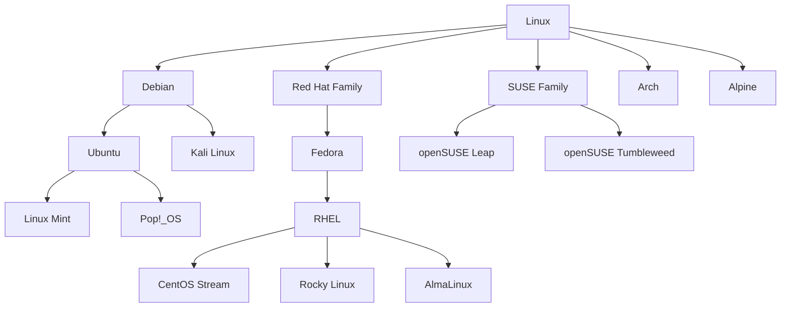
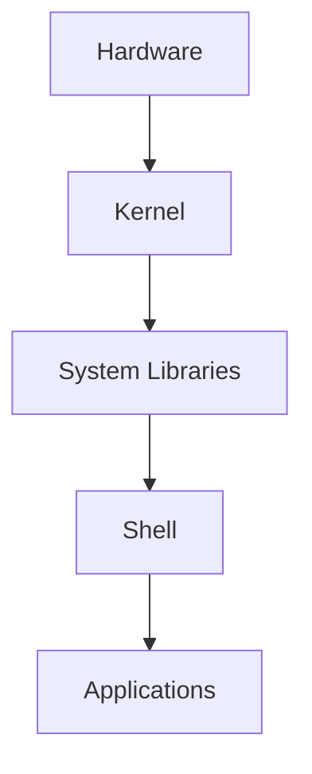
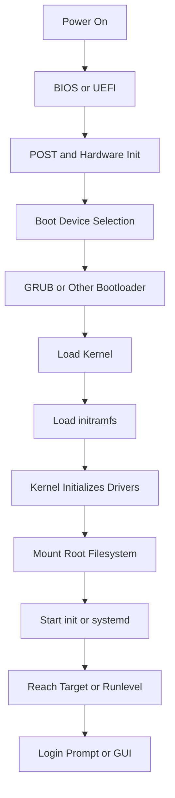
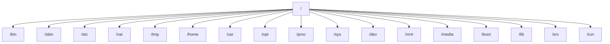
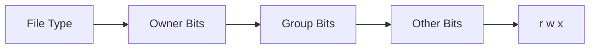

# Linux Fundamentals Guide

A comprehensive guide from basic concepts to advanced daily administration topics.

This guide is designed for learners, support engineers, system administrators, DevOps engineers, and developers who work on Linux systems.

---

## How to Use This Guide

- Read sections 1 to 5 first if you are new to Linux.
- Practice sections 7 to 13 on a lab VM or cloud instance.
- Copy commands exactly, but understand them before running as `root`.
- Prefer non-production systems when testing permissions, user management, or file operations.

> Tip:
> The fastest way to learn Linux is to read a concept, run the command, inspect the result, and repeat.

> Warning:
> Many commands in this guide can modify or delete data.
> Always verify the target path before pressing Enter.

---

## Table of Contents

1. [Linux Overview](#1-linux-overview)
2. [Linux Distributions](#2-linux-distributions)
3. [Linux Architecture](#3-linux-architecture)
4. [Boot Process](#4-boot-process)
5. [File System Hierarchy (FHS)](#5-file-system-hierarchy-fhs)
6. [Linux File Types](#6-linux-file-types)
7. [Basic Commands](#7-basic-commands)
8. [File Permissions and Ownership](#8-file-permissions-and-ownership)
9. [Users and Groups](#9-users-and-groups)
10. [I/O Redirection and Piping](#10-io-redirection-and-piping)
11. [Text Processing](#11-text-processing)
12. [Compression and Archiving](#12-compression-and-archiving)
13. [Help and Documentation](#13-help-and-documentation)

---

# 1. Linux Overview

## 1.1 What Is Linux?

Linux is an operating system kernel.

A kernel is the core software layer that talks to hardware and manages system resources.

Linux handles:

- CPU scheduling
- Memory management
- Device drivers
- Storage access
- Networking
- Process control
- Security boundaries

When most people say “Linux,” they usually mean a complete operating system built around the Linux kernel.

That complete system often includes:

- GNU userland tools
- a shell such as Bash or Zsh
- system libraries such as glibc or musl
- a package manager
- service management tools
- desktop or server software

## 1.2 Kernel vs Distribution

The Linux kernel is only one part of the full system.

A Linux distribution bundles the kernel with tools and policies so users can install and operate a complete environment.

Examples of what a distribution adds:

- installer
- package repository
- default shell
- init system
- desktop environment or server defaults
- security policies
- support lifecycle
- documentation

A simple mental model:

- Kernel = engine
- Distribution = complete vehicle

## 1.3 Why People Say GNU/Linux

GNU is a large collection of free software tools created by the GNU Project.

Many classic Linux systems combined the Linux kernel with GNU components.

Common GNU components include:

- Bash
- coreutils
- GCC
- glibc
- grep
- sed
- tar

That is why some people use the term GNU/Linux.

It highlights that the usable system is more than the kernel alone.

Not every Linux distribution is strictly GNU-based.

For example:

- Alpine Linux commonly uses musl and BusyBox.
- Android uses the Linux kernel but is not a traditional GNU/Linux distribution.

## 1.4 Key Characteristics of Linux

Linux is widely used because it is:

- open source
- portable
- stable
- scriptable
- multiuser
- multitasking
- network-friendly
- highly customizable
- well suited for automation

Linux is common in:

- servers
- cloud platforms
- containers
- embedded devices
- supercomputers
- developer workstations
- networking appliances
- security labs

## 1.5 Linux in the Real World

Linux powers a large percentage of internet infrastructure.

It is the default operating system for many cloud workloads.

It dominates in containers because Docker and Kubernetes ecosystems are Linux-native.

It is also widely used in edge devices and appliances.

Examples:

- web servers
- application servers
- CI/CD runners
- container hosts
- firewalls
- routers
- NAS devices
- IoT devices
- smartphones through Android

## 1.6 Linux vs Unix

Linux is Unix-like.

It was inspired by Unix design principles.

However, Linux is not the original Unix.

Important comparison points:

| Area | Linux | Traditional Unix |
|---|---|---|
| Source model | Usually open source | Often proprietary |
| Hardware support | Very broad | Often tied to vendor hardware |
| Cost | Often free | Often commercial |
| Distros | Many | Fewer vendor variants |
| Common use | Cloud, servers, containers, desktops | Enterprise legacy systems |

Unix design ideas that Linux inherits include:

- everything is treated like a file interface when possible
- small tools can be combined together
- text streams are powerful
- users, groups, and permissions matter
- shells enable automation

## 1.7 Linux History Timeline

| Year | Event |
|---|---|
| 1969 | Unix development begins at Bell Labs |
| 1983 | GNU Project is announced by Richard Stallman |
| 1991 | Linus Torvalds announces the Linux kernel |
| 1992 | Linux kernel is relicensed under GPL |
| 1993 | Debian and Slackware appear |
| 1994 | Linux kernel 1.0 is released |
| 1998 | Enterprise Linux interest grows rapidly |
| 2004 | Ubuntu is first released |
| 2011 | systemd adoption expands across distributions |
| 2013 | Docker popularizes containers on Linux |
| 2014+ | Kubernetes and cloud-native adoption accelerate |
| Present | Linux is dominant in servers, cloud, and containers |

## 1.8 Milestones Explained

### Unix foundations

Unix influenced shell design, permissions, process management, and the philosophy of small composable tools.

### GNU Project

The GNU Project created many tools needed for a complete free operating system environment.

### Linux kernel birth

Linus Torvalds began Linux as a personal project and it quickly became a global collaborative effort.

### Distribution era

Distributions made Linux practical to install, update, and support.

### Enterprise adoption

Linux became a serious platform for web hosting, databases, and application servers.

### Cloud-native era

Linux became the foundation for virtual machines, containers, orchestration, and automation.

## 1.9 Core Linux Philosophy

Common Linux habits come from a few principles:

- prefer text-based configuration
- automate repetitive work
- combine simple commands with pipes
- store logs and state predictably
- separate privileged tasks from normal user work
- favor transparency over hidden behavior

## 1.10 What Beginners Should Master First

Start with these building blocks:

- navigating directories
- reading files
- editing files
- understanding permissions
- redirecting output
- using `grep`, `find`, and `tar`
- reading `man` pages
- knowing when `sudo` is required

> Tip:
> Linux becomes much easier once you understand paths, permissions, processes, and text streams.

---

# 2. Linux Distributions

## 2.1 What Is a Distribution?

A Linux distribution, or distro, is a packaged operating system built around the Linux kernel.

A distro provides:

- kernel packages
- userland tools
- repositories
- security updates
- package manager
- installer
- defaults for networking, services, and storage

## 2.2 Why So Many Distros Exist

Different distributions optimize for different goals.

Common goals include:

- beginner friendliness
- enterprise support
- server stability
- bleeding-edge software
- minimal size
- security hardening
- container use
- customization

## 2.3 Major Distribution Comparison

| Distribution | Family | Package Manager | Release Style | Best For | Notes |
|---|---|---|---|---|---|
| Ubuntu | Debian | `apt` | Regular LTS and interim | Beginners, servers, cloud | Large community and docs |
| Debian | Independent | `apt` | Stable branches | Stable servers, base systems | Conservative and reliable |
| Fedora | Red Hat | `dnf` | Fast release cycle | Developers, modern desktops, testbed | Often introduces new tech first |
| RHEL | Red Hat | `dnf` | Enterprise lifecycle | Enterprises, supported production | Paid support and certifications |
| CentOS Stream | Red Hat | `dnf` | Rolling preview to RHEL | Development aligned with RHEL | Replaced classic CentOS model |
| Rocky Linux | Red Hat | `dnf` | Enterprise rebuild | RHEL-compatible environments | Community-driven |
| AlmaLinux | Red Hat | `dnf` | Enterprise rebuild | RHEL-compatible environments | Community-focused alternative |
| Arch Linux | Independent | `pacman` | Rolling release | Advanced users, custom systems | Minimal and highly configurable |
| Alpine Linux | Independent | `apk` | Small stable releases | Containers, embedded systems | Uses musl and BusyBox |
| openSUSE Leap | SUSE | `zypper` | Stable release | Enterprise-like desktop/server | Good admin tooling |
| openSUSE Tumbleweed | SUSE | `zypper` | Rolling release | Latest packages with testing | Strong for developers |
| Linux Mint | Ubuntu/Debian | `apt` | Stable desktop focus | Desktop users | Friendly user experience |

## 2.4 Distribution Families

Distributions often inherit packages, design choices, or release policies from parent projects.



## 2.5 Debian and Debian-Based Systems

Debian is known for stability and a strong free software culture.

It is common in:

- servers
- cloud images
- base containers
- appliances

Ubuntu builds on Debian and makes Linux more approachable for many users.

Ubuntu strengths:

- excellent documentation
- wide cloud support
- long-term support releases
- popular developer ecosystem

Mint focuses on desktop usability.

Kali focuses on security testing tools.

## 2.6 Red Hat Family

Fedora is often the innovation platform.

RHEL is the enterprise product with certification and support.

CentOS Stream sits between Fedora and RHEL as a preview path.

Rocky Linux and AlmaLinux are RHEL-compatible community distributions.

Typical uses:

- enterprise application servers
- middleware
- databases
- regulated environments
- certification-based deployments

## 2.7 SUSE Family

SUSE and openSUSE are well known in enterprise and data center environments.

They are respected for:

- YaST administration tooling
- strong package management with `zypper`
- enterprise integration
- stable server workflows

## 2.8 Arch Family

Arch Linux prioritizes simplicity, user control, and a rolling release model.

Arch is attractive for:

- advanced users
- minimal setups
- learning internals
- highly customized desktops

Arch users are expected to read documentation carefully and manage upgrades actively.

## 2.9 Alpine Linux

Alpine Linux is extremely small.

It is popular in:

- containers
- embedded systems
- minimal attack surface deployments

Key traits:

- musl libc instead of glibc
- BusyBox userland
- `apk` package manager
- lightweight images

> Warning:
> Alpine can behave differently from glibc-based systems.
> Some binaries compiled for Ubuntu or Debian may not run without adjustment.

## 2.10 Choosing the Right Distribution

Choose a distribution based on workload.

### For beginners

- Ubuntu
- Linux Mint

### For stable general-purpose servers

- Ubuntu LTS
- Debian Stable
- RHEL
- Rocky Linux
- AlmaLinux
- openSUSE Leap

### For learning internals

- Arch Linux
- Debian minimal install

### For bleeding-edge developer environments

- Fedora
- openSUSE Tumbleweed
- Arch Linux

### For containers and minimal systems

- Alpine Linux
- Debian slim images
- Ubuntu minimal images

## 2.11 Package Manager Cheat Sheet

| Family | Commands | Notes |
|---|---|---|
| Debian/Ubuntu | `apt install`, `apt remove`, `apt update`, `apt upgrade` | High-level package manager |
| Red Hat/Fedora | `dnf install`, `dnf remove`, `dnf check-update`, `dnf upgrade` | `yum` is legacy on older systems |
| Arch | `pacman -S`, `pacman -R`, `pacman -Sy`, `pacman -Syu` | Powerful but needs care |
| Alpine | `apk add`, `apk del`, `apk update`, `apk upgrade` | Fast and lightweight |
| SUSE | `zypper install`, `zypper remove`, `zypper refresh`, `zypper update` | Strong dependency handling |

## 2.12 Repository Concepts

Most Linux packages are installed from signed repositories.

This provides:

- trusted software sources
- dependency resolution
- update tracking
- easier automation

Repository concepts to know:

- enabled repos
- GPG signing keys
- mirrors
- package metadata cache
- stable vs testing channels

## 2.13 LTS vs Rolling Release

### LTS

Long-term support releases prioritize stability.

Benefits:

- fewer surprises
- longer security support
- easier enterprise planning

Tradeoff:

- older software versions

### Rolling release

Rolling distributions continuously update packages.

Benefits:

- newer software
- latest kernels and toolchains

Tradeoff:

- more change risk
- higher maintenance attention

## 2.14 Practical Distro Selection Examples

### Small web server in production

Recommended options:

- Ubuntu LTS
- Debian Stable
- Rocky Linux

Reason:

- stable packages
- long support
- abundant documentation

### Developer laptop for container and cloud tooling

Recommended options:

- Fedora
- Ubuntu LTS
- openSUSE Tumbleweed

Reason:

- fresh tooling
- good hardware support
- active ecosystems

### Security lab machine

Recommended options:

- Kali Linux
- Ubuntu with selected security tools

### Tiny container base image

Recommended options:

- Alpine Linux
- Debian slim

## 2.15 Distro Command Examples

```bash
# Ubuntu or Debian
sudo apt update
sudo apt install nginx

# Fedora, RHEL, Rocky, AlmaLinux
sudo dnf install nginx

# Arch Linux
sudo pacman -S nginx

# Alpine Linux
sudo apk add nginx

# openSUSE
sudo zypper install nginx
```

> Tip:
> Learn one distro deeply first.
> After that, switching families mostly means learning a different package manager, service naming style, and release philosophy.

---

# 3. Linux Architecture

## 3.1 Big Picture

Linux systems are layered.

The lower layers talk to hardware.

The upper layers provide user-facing tools and applications.



## 3.2 Hardware Layer

This is the physical or virtual machine layer.

Examples:

- CPU
- RAM
- disks
- network cards
- GPUs
- USB devices
- firmware

The kernel uses drivers to communicate with hardware.

## 3.3 Kernel Layer

The kernel is the privileged core of the operating system.

Main kernel responsibilities:

- process scheduling
- virtual memory management
- device management
- filesystems
- networking stack
- security enforcement
- inter-process communication

The kernel runs in kernel space.

Kernel space is protected from normal user applications.

## 3.4 System Libraries

System libraries provide standard interfaces that applications call.

Examples:

- glibc
- musl
- OpenSSL libraries
- ncurses

Applications usually do not talk directly to the kernel.

They call libraries, and libraries use system calls to reach the kernel.

## 3.5 Shell Layer

The shell is a command interpreter.

Popular shells include:

- Bash
- Zsh
- Fish
- Ksh
- Dash

A shell lets users:

- run commands
- navigate files
- redirect input and output
- script tasks
- manage environment variables

## 3.6 Application Layer

Applications sit on top of libraries and shell interfaces.

Examples:

- `nginx`
- `python`
- `vim`
- `git`
- `docker`
- desktop browsers

## 3.7 User Space vs Kernel Space

### Kernel space

- full hardware access
- highly privileged
- mistakes can crash the system

### User space

- where normal programs run
- isolated from kernel internals
- crashes usually affect only the program

## 3.8 System Calls

System calls are the boundary between applications and the kernel.

Common categories:

- file operations
- process control
- memory allocation
- networking
- permissions

Examples of system call concepts:

- open
- read
- write
- fork
- exec
- socket

## 3.9 Why Architecture Matters

Understanding the architecture helps you troubleshoot problems.

Examples:

- app fails because a shared library is missing
- device not detected because driver support is absent
- process denied because permissions are insufficient
- shell command fails because PATH is incorrect

## 3.10 Linux Architecture Summary Table

| Layer | Role | Examples |
|---|---|---|
| Hardware | Physical resources | CPU, disk, NIC |
| Kernel | Core OS control | Scheduler, VFS, TCP/IP |
| Libraries | Standard interfaces | glibc, musl |
| Shell | Command interpreter | Bash, Zsh |
| Applications | User workloads | nginx, vim, python |

> Tip:
> When debugging, ask yourself which layer is failing.
> Hardware, kernel, library, shell, and application issues often look different.

---

# 4. Boot Process

## 4.1 Overview

Linux booting is the chain of events that takes a machine from power-on to a usable login prompt or service-ready state.

Typical stages:

- firmware initialization
- bootloader execution
- kernel loading
- initramfs work
- root filesystem mount
- init system startup
- service activation
- login prompt or graphical session



## 4.2 BIOS vs UEFI

### BIOS

BIOS is older firmware.

It initializes hardware and looks for bootable media.

### UEFI

UEFI is the modern replacement.

It supports:

- larger disks
- Secure Boot
- EFI system partitions
- more flexible boot management

## 4.3 POST

POST stands for Power-On Self-Test.

The firmware checks key hardware components before boot continues.

Common checks:

- CPU availability
- memory initialization
- keyboard status on some systems
- storage device presence

## 4.4 Bootloader

The bootloader loads the Linux kernel into memory.

GRUB is the most common bootloader on Linux systems.

Common GRUB capabilities:

- boot menu display
- kernel parameter editing
- multiple OS support
- rescue mode access
- chainloading

Important files often associated with GRUB:

- `/boot/grub/grub.cfg`
- `/etc/default/grub`
- EFI boot files under `/boot/efi`

> Warning:
> Do not edit generated GRUB config files blindly.
> On many systems you should update `/etc/default/grub` and regenerate configuration using the distro tools.

## 4.5 Kernel Loading

The bootloader loads:

- the kernel image
- initial RAM filesystem image
- kernel command-line parameters

The kernel then:

- initializes core subsystems
- detects hardware
- loads built-in drivers
- begins mounting the root environment

## 4.6 initramfs

`initramfs` is a temporary early userspace environment.

It helps the kernel prepare enough drivers and tools to mount the real root filesystem.

This is important when the root filesystem depends on:

- RAID
- LVM
- encrypted disks
- unusual storage controllers
- network boot features

## 4.7 Root Filesystem Mount

After early initialization, the real root filesystem is mounted.

The system then switches from initramfs to the actual root filesystem.

## 4.8 init and systemd

Historically, Linux systems used SysV init.

Many modern distributions use systemd.

The init system is process ID 1.

It is the first long-running userspace process.

Its job is to start and supervise the rest of the system.

Common init responsibilities:

- starting services
- handling targets or runlevels
- managing dependencies
- cleaning temporary state
- responding to shutdown and reboot requests

## 4.9 Runlevels vs systemd Targets

### Traditional SysV runlevels

| Runlevel | Meaning |
|---|---|
| 0 | Halt |
| 1 | Single-user or rescue |
| 2 | Multi-user, distro-specific |
| 3 | Multi-user text mode |
| 4 | Unused or custom |
| 5 | Multi-user graphical |
| 6 | Reboot |

### Common systemd targets

| Target | Purpose |
|---|---|
| `poweroff.target` | Shut down system |
| `rescue.target` | Single-user rescue mode |
| `multi-user.target` | Multi-user text mode |
| `graphical.target` | Graphical environment |
| `reboot.target` | Reboot system |

## 4.10 Inspecting the Boot Process

Useful commands:

```bash
uname -r
systemctl get-default
systemctl list-units --type=service
journalctl -b
lsblk
cat /proc/cmdline
```

What they help with:

- confirm kernel version
- view default systemd target
- inspect services
- read boot logs
- inspect block devices
- inspect kernel boot parameters

## 4.11 Common Boot Problems

### GRUB menu not appearing

Possible causes:

- hidden timeout
- corrupted bootloader config
- EFI entry problems

### Kernel panic

Possible causes:

- missing root filesystem
- broken initramfs
- incompatible kernel modules

### Stuck in emergency mode

Possible causes:

- failed filesystem check
- bad `/etc/fstab`
- missing mount dependencies

### Service startup failures

Possible causes:

- bad configuration files
- missing network
- missing dependencies

## 4.12 Troubleshooting Boot Issues

Use these tools carefully:

```bash
journalctl -b -p err
systemctl --failed
cat /etc/fstab
lsblk -f
mount
```

Questions to ask:

- Did the kernel boot successfully?
- Did the root filesystem mount?
- Did systemd reach the expected target?
- Which service failed first?

## 4.13 Boot Process Summary

1. Firmware starts.
2. Hardware is initialized.
3. Boot device is chosen.
4. Bootloader runs.
5. Kernel and initramfs load.
6. Kernel initializes drivers.
7. Root filesystem mounts.
8. `init` or `systemd` starts.
9. Services start.
10. System reaches a login target.

> Tip:
> If a Linux system does not boot, divide the problem into stages.
> Firmware, bootloader, kernel, filesystem, and init failures each leave different clues.

---

# 5. File System Hierarchy (FHS)

## 5.1 What Is FHS?

FHS stands for Filesystem Hierarchy Standard.

It defines common directory purposes so Linux systems remain understandable and consistent.

Even across distributions, the general layout is similar.

## 5.2 Why the Hierarchy Matters

When you know where things belong, you can:

- find configuration files quickly
- locate logs
- diagnose storage growth
- package software correctly
- back up the right paths
- troubleshoot services faster

## 5.3 High-Level View



## 5.4 Root Directory `/`

This is the top of the entire filesystem tree.

Everything begins from `/`.

Examples:

- `/etc/ssh/sshd_config`
- `/var/log/messages`
- `/home/user/.bashrc`

## 5.5 `/bin`

Historically, `/bin` stored essential user commands required for booting and single-user mode.

Typical commands once found here:

- `ls`
- `cp`
- `mv`
- `cat`
- `bash`

On many modern systems, `/bin` is a symlink into `/usr/bin`.

Why it exists conceptually:

- essential commands available early in boot
- standard location for core user binaries

## 5.6 `/sbin`

Historically, `/sbin` stored essential system administration commands.

Examples:

- `fsck`
- `ip`
- `mount`
- `reboot`
- `shutdown`

On many systems, `/sbin` may also be merged into `/usr/sbin`.

## 5.7 `/etc`

`/etc` contains system-wide configuration files.

Examples:

- `/etc/passwd`
- `/etc/shadow`
- `/etc/hosts`
- `/etc/fstab`
- `/etc/ssh/sshd_config`
- `/etc/systemd/system/`

Characteristics:

- text-heavy
- human-editable
- critical for system behavior

> Warning:
> Back up configuration files before editing critical items like `/etc/fstab`, SSH configs, or sudo policy files.

## 5.8 `/var`

`/var` stores variable data that changes during normal operation.

Common subdirectories:

- `/var/log`
- `/var/spool`
- `/var/cache`
- `/var/lib`
- `/var/tmp`

Examples:

- service logs
- package caches
- mail queues
- database files
- state data for applications

## 5.9 `/tmp`

`/tmp` stores temporary files.

Important traits:

- writable by many users
- often cleared on reboot or cleanup policy
- not suitable for permanent storage

Security note:

- permissions usually include the sticky bit
- users typically cannot delete each other’s files there

## 5.10 `/home`

`/home` stores personal directories for normal users.

Examples:

- `/home/alex`
- `/home/devops`

Typical contents:

- documents
- downloads
- scripts
- shell dotfiles
- SSH keys
- user-specific application settings

## 5.11 `/root`

Although not in the requested list, `/root` is worth knowing.

It is the home directory of the `root` user.

It is separate from `/home`.

## 5.12 `/usr`

`/usr` contains userland applications, libraries, and documentation.

Common subdirectories:

- `/usr/bin`
- `/usr/sbin`
- `/usr/lib`
- `/usr/share`
- `/usr/local`

Think of `/usr` as the main software tree for the installed system.

### `/usr/bin`

Most user commands live here on modern systems.

### `/usr/sbin`

System administration commands often live here.

### `/usr/lib`

Shared libraries and internal support files.

### `/usr/share`

Architecture-independent data.

Examples:

- man pages
- icons
- locale files
- documentation

### `/usr/local`

Locally installed software that is not managed by the distro package manager often goes here.

Examples:

- `/usr/local/bin`
- `/usr/local/lib`
- `/usr/local/share`

## 5.13 `/opt`

`/opt` stores optional add-on software packages.

This is common for:

- third-party applications
- vendor packages
- self-contained tools

Example:

- `/opt/vendor-app/`

## 5.14 `/proc`

`/proc` is a virtual filesystem.

It exposes kernel and process information.

It does not behave like normal persistent storage.

Useful files:

- `/proc/cpuinfo`
- `/proc/meminfo`
- `/proc/uptime`
- `/proc/cmdline`
- `/proc/<PID>/`

Example:

```bash
cat /proc/cpuinfo
cat /proc/meminfo
```

## 5.15 `/sys`

`/sys` is another virtual filesystem.

It exposes device and kernel object information.

It is widely used by the kernel, udev, and low-level tooling.

Examples:

- device attributes
- driver information
- power settings

## 5.16 `/dev`

`/dev` contains device files.

These files represent hardware or pseudo-devices.

Examples:

- `/dev/sda`
- `/dev/null`
- `/dev/zero`
- `/dev/random`
- `/dev/tty`

## 5.17 `/mnt`

`/mnt` is a traditional temporary mount point for administrators.

It is often used when manually mounting filesystems.

Example:

```bash
sudo mount /dev/sdb1 /mnt
```

## 5.18 `/media`

`/media` is commonly used for removable media.

Examples:

- USB drives
- external disks
- optical media

Desktop environments often mount media here automatically.

## 5.19 `/boot`

`/boot` contains files required for booting.

Examples:

- kernel images
- initramfs images
- bootloader files
- GRUB configuration components

If `/boot` fills up, kernel updates may fail.

## 5.20 `/lib`

`/lib` contains essential shared libraries and kernel modules.

On many systems, this may be linked or merged with `/usr/lib`.

It remains conceptually important because:

- early boot programs need libraries
- kernel modules are stored under library trees

## 5.21 `/srv`

`/srv` stores data served by system services.

Examples:

- web content
- FTP data
- application-served static assets

Example layout:

- `/srv/www/`
- `/srv/ftp/`

## 5.22 `/run`

`/run` stores volatile runtime data.

It exists only during booted runtime.

Common contents:

- PID files
- sockets
- locks
- runtime status info

`/run` is typically mounted as tmpfs.

## 5.23 Common Subdirectories in `/var`

### `/var/log`

Stores logs.

Examples:

- system logs
- authentication logs
- service logs

### `/var/lib`

Stores persistent application state.

Examples:

- package manager metadata
- databases
- service state

### `/var/cache`

Stores cached data that can usually be recreated.

### `/var/spool`

Stores queued work.

Examples:

- print jobs
- mail queues
- scheduled task queues

### `/var/tmp`

Temporary files that may persist longer than `/tmp`.

## 5.24 Inspecting the Hierarchy

Useful commands:

```bash
pwd
ls /
ls /etc
ls /var/log
find /etc -maxdepth 1 -type f | head
```

## 5.25 Storage and Capacity Awareness

Directories that often grow unexpectedly:

- `/var/log`
- `/var/lib`
- `/tmp`
- `/home`
- `/opt`

Useful commands:

```bash
df -h
du -sh /var/* 2>/dev/null | sort -h
```

## 5.26 FHS Quick Reference Table

| Path | Purpose | Typical Content |
|---|---|---|
| `/` | Root of filesystem | Everything starts here |
| `/bin` | Essential user binaries | `ls`, `cp`, `cat` |
| `/sbin` | Essential admin binaries | `mount`, `fsck` |
| `/etc` | Configuration | service configs, passwd files |
| `/var` | Variable data | logs, cache, state |
| `/tmp` | Temporary files | scratch data |
| `/home` | User homes | personal files |
| `/usr` | Main software tree | binaries, libs, docs |
| `/opt` | Optional software | vendor apps |
| `/proc` | Process and kernel info | virtual files |
| `/sys` | Kernel device model | virtual files |
| `/dev` | Device files | disks, terminals |
| `/mnt` | Manual mounts | temporary mount points |
| `/media` | Removable media | USB mounts |
| `/boot` | Boot files | kernels, GRUB |
| `/lib` | Essential libraries | shared libs, modules |
| `/srv` | Service data | web content |
| `/run` | Runtime state | PIDs, sockets |

## 5.27 Practical Examples

### Example 1: Find SSH server config

```bash
ls /etc/ssh
cat /etc/ssh/sshd_config
```

### Example 2: Check recent logs

```bash
ls /var/log
sudo tail -n 50 /var/log/syslog
```

### Example 3: Identify mounted devices

```bash
ls /dev/sd*
lsblk
```

### Example 4: See kernel command line

```bash
cat /proc/cmdline
```

> Tip:
> If you do not know where a Linux file should live, first ask whether it is configuration, executable code, variable state, temporary data, or user data.

---

# 6. Linux File Types

## 6.1 Overview

Linux supports multiple file types.

You can often identify them with `ls -l`, `stat`, or `file`.

The first character of `ls -l` output is especially important.

## 6.2 File Type Indicators in `ls -l`

| Indicator | Type |
|---|---|
| `-` | Regular file |
| `d` | Directory |
| `l` | Symbolic link |
| `c` | Character device |
| `b` | Block device |
| `p` | Named pipe |
| `s` | Socket |

## 6.3 Regular File

A regular file stores data.

Examples:

- text files
- scripts
- images
- binaries
- archives

Example:

```bash
touch notes.txt
ls -l notes.txt
file notes.txt
```

## 6.4 Directory

A directory stores references to files and subdirectories.

It organizes the filesystem tree.

Example:

```bash
mkdir project
ls -ld project
```

## 6.5 Symbolic Link

A symbolic link points to another path.

It is similar to a shortcut.

Properties:

- can point across filesystems
- can point to directories
- can become broken if target disappears

Example:

```bash
ln -s /etc/hosts hosts-link
ls -l hosts-link
```

## 6.6 Hard Link

A hard link is an additional directory entry pointing to the same inode as another file.

Properties:

- refers to the same underlying file data
- does not cross filesystems in normal use
- usually not used for directories
- remains valid if the original filename is removed

Example:

```bash
echo "hello" > original.txt
ln original.txt hardlink.txt
ls -li original.txt hardlink.txt
```

## 6.7 Character Device

Character devices transfer data as a stream of characters.

Examples:

- terminals
- serial ports
- `/dev/null`

Example:

```bash
ls -l /dev/null
```

## 6.8 Block Device

Block devices transfer data in blocks.

They are used for storage devices.

Examples:

- disks
- partitions
- loop devices

Example:

```bash
ls -l /dev/sda
lsblk
```

## 6.9 Named Pipe

A named pipe, or FIFO, allows one process to send data to another.

Example:

```bash
mkfifo mypipe
ls -l mypipe
```

## 6.10 Socket

Sockets enable inter-process communication.

They are common for:

- daemons
- local service communication
- networked services

Example:

```bash
ss -lx
```

## 6.11 Inspecting File Types

Useful commands:

```bash
ls -l
stat /etc/passwd
file /bin/ls
find . -type l
```

## 6.12 Why File Types Matter

Understanding file types helps when:

- diagnosing broken symlinks
- managing device access
- backing up data correctly
- troubleshooting service sockets
- securing writable directories

> Tip:
> Use `ls -l` first, then `stat`, then `file` if you need deeper detail.

---

# 7. Basic Commands

## 7.1 Command Usage Principles

Before learning individual commands, remember these patterns:

- most commands support `--help`
- many commands accept short flags like `-l`
- many commands accept long flags like `--human-readable`
- spaces matter
- Linux is case-sensitive
- relative paths and absolute paths behave differently

## 7.2 `pwd`

### Purpose

Print the current working directory.

### Syntax

```bash
pwd
pwd -P
```

### Common Flags

| Flag | Meaning |
|---|---|
| `-P` | Show physical path without symlink resolution shortcuts |

### Examples

```bash
pwd
pwd -P
cd /etc && pwd
```

### Notes

Use `pwd` whenever you are unsure where you are before using `rm`, `cp`, or `mv`.

## 7.3 `ls`

### Purpose

List directory contents.

### Syntax

```bash
ls
ls [options] [path]
```

### Common Flags

| Flag | Meaning |
|---|---|
| `-l` | Long listing format |
| `-a` | Show hidden files |
| `-h` | Human-readable sizes with `-l` |
| `-t` | Sort by modification time |
| `-r` | Reverse sort order |
| `-R` | Recursive listing |
| `-d` | Show directory itself, not contents |

### Examples

```bash
ls
ls -la
ls -lh /var/log
ls -lt
ls -ld /etc
ls -R project
```

### Notes

Hidden files begin with `.`.

Examples include `.bashrc` and `.ssh`.

## 7.4 `cd`

### Purpose

Change the current directory.

### Syntax

```bash
cd [path]
```

### Useful Shortcuts

| Command | Meaning |
|---|---|
| `cd` | Go to home directory |
| `cd ~` | Go to home directory |
| `cd -` | Go to previous directory |
| `cd ..` | Go up one level |
| `cd /` | Go to root directory |

### Examples

```bash
cd /etc
cd ..
cd ~
cd -
```

### Notes

`cd` is a shell built-in in most shells.

## 7.5 `mkdir`

### Purpose

Create directories.

### Syntax

```bash
mkdir name
mkdir [options] path
```

### Common Flags

| Flag | Meaning |
|---|---|
| `-p` | Create parent directories as needed |
| `-v` | Verbose output |
| `-m` | Set permissions on creation |

### Examples

```bash
mkdir project
mkdir -p app/logs/archive
mkdir -m 755 scripts
mkdir -pv /home/user/test/a/b/c
```

### Notes

`mkdir -p` is safe for automation because it will not fail if directories already exist.

## 7.6 `rmdir`

### Purpose

Remove empty directories.

### Syntax

```bash
rmdir [options] dir
```

### Common Flags

| Flag | Meaning |
|---|---|
| `-p` | Remove parent directories if empty |
| `-v` | Verbose output |

### Examples

```bash
rmdir emptydir
rmdir -p a/b/c
```

### Notes

`rmdir` only works for empty directories.

Use `rm -r` only when you intend recursive removal.

## 7.7 `cp`

### Purpose

Copy files and directories.

### Syntax

```bash
cp source destination
cp [options] source destination
```

### Common Flags

| Flag | Meaning |
|---|---|
| `-r` or `-R` | Recursive copy for directories |
| `-a` | Archive mode, preserve attributes |
| `-i` | Prompt before overwrite |
| `-u` | Copy only when source is newer |
| `-v` | Verbose output |
| `-p` | Preserve mode, ownership, timestamps |

### Examples

```bash
cp file1.txt backup.txt
cp -i config.cfg config.cfg.bak
cp -r src/ backup/
cp -a website/ website-copy/
cp -u report.txt archive/
```

### Notes

Use `cp -a` for backups when you want to preserve metadata.

## 7.8 `mv`

### Purpose

Move or rename files and directories.

### Syntax

```bash
mv source destination
```

### Common Flags

| Flag | Meaning |
|---|---|
| `-i` | Prompt before overwrite |
| `-n` | Do not overwrite existing files |
| `-v` | Verbose output |
| `-u` | Move only when source is newer |

### Examples

```bash
mv old.txt new.txt
mv report.txt /archive/
mv -i app.conf /etc/app.conf
mv -n data.csv existing.csv
```

### Notes

A rename within the same filesystem is usually fast.

## 7.9 `rm`

### Purpose

Remove files or directories.

### Syntax

```bash
rm [options] target
```

### Common Flags

| Flag | Meaning |
|---|---|
| `-r` or `-R` | Recursive removal |
| `-f` | Force removal, no prompt |
| `-i` | Prompt before each removal |
| `-v` | Verbose output |
| `-d` | Remove empty directory |

### Examples

```bash
rm file.txt
rm -i important.txt
rm -r old_project/
rm -rf build/
rm -v *.log
```

### Notes

`rm -rf` is powerful and dangerous.

Always confirm the path with `pwd` and `ls` first.

> Warning:
> There is no recycle bin in standard shell usage.
> A mistaken `rm` can permanently remove data.

## 7.10 `touch`

### Purpose

Create an empty file or update file timestamps.

### Syntax

```bash
touch file
```

### Common Flags

| Flag | Meaning |
|---|---|
| `-a` | Change access time only |
| `-m` | Change modification time only |
| `-t` | Set explicit timestamp |
| `-c` | Do not create file if missing |

### Examples

```bash
touch newfile.txt
touch app.log
touch -c existing.txt
touch -t 202401011200 sample.txt
```

### Notes

`touch` is often used to create placeholder files quickly.

## 7.11 `cat`

### Purpose

Display file contents or concatenate files.

### Syntax

```bash
cat [options] file
```

### Common Flags

| Flag | Meaning |
|---|---|
| `-n` | Number output lines |
| `-b` | Number non-empty lines |
| `-A` | Show special characters |

### Examples

```bash
cat /etc/hosts
cat file1 file2 > merged.txt
cat -n script.sh
cat -A data.txt
```

### Notes

Use `cat` for short files.

Use `less` for longer files.

## 7.12 `less`

### Purpose

View file contents interactively, page by page.

### Syntax

```bash
less file
```

### Useful Keys

| Key | Meaning |
|---|---|
| `Space` | Next page |
| `b` | Previous page |
| `/pattern` | Search forward |
| `n` | Next match |
| `q` | Quit |

### Examples

```bash
less /var/log/syslog
less +G app.log
```

### Notes

`less` is safer and more practical for large text files.

## 7.13 `more`

### Purpose

View text one screen at a time.

### Examples

```bash
more README.txt
```

### Notes

`more` is older and simpler than `less`.

Most administrators prefer `less`.

## 7.14 `head`

### Purpose

Show the first lines of a file.

### Syntax

```bash
head [options] file
```

### Common Flags

| Flag | Meaning |
|---|---|
| `-n` | Number of lines |
| `-c` | Number of bytes |

### Examples

```bash
head /etc/passwd
head -n 20 app.log
head -c 100 file.bin
```

### Notes

Useful for quickly inspecting file structure.

## 7.15 `tail`

### Purpose

Show the last lines of a file.

### Syntax

```bash
tail [options] file
```

### Common Flags

| Flag | Meaning |
|---|---|
| `-n` | Number of lines |
| `-f` | Follow file growth |
| `-F` | Follow across rotations |
| `-c` | Number of bytes |

### Examples

```bash
tail /var/log/syslog
tail -n 50 app.log
tail -f /var/log/nginx/access.log
tail -F /var/log/messages
```

### Notes

`tail -f` is essential for real-time log monitoring.

## 7.16 `wc`

### Purpose

Count lines, words, bytes, or characters.

### Syntax

```bash
wc [options] file
```

### Common Flags

| Flag | Meaning |
|---|---|
| `-l` | Count lines |
| `-w` | Count words |
| `-c` | Count bytes |
| `-m` | Count characters |

### Examples

```bash
wc notes.txt
wc -l /etc/passwd
wc -w article.txt
```

### Notes

Useful in scripts for quick file metrics.

## 7.17 `file`

### Purpose

Identify file type based on content, not only extension.

### Syntax

```bash
file target
```

### Common Flags

| Flag | Meaning |
|---|---|
| `-i` | Show MIME type information |
| `-b` | Brief output |

### Examples

```bash
file script.sh
file /bin/ls
file -i image.png
```

### Notes

Very helpful when an unknown file lacks a useful extension.

## 7.18 `stat`

### Purpose

Display detailed file or filesystem status.

### Syntax

```bash
stat target
```

### Common Flags

| Flag | Meaning |
|---|---|
| `-f` | Show filesystem status |
| `-c` | Custom output format |

### Examples

```bash
stat /etc/passwd
stat -f /
stat -c '%n %a %U %G' myfile
```

### Notes

`stat` is excellent for permissions, timestamps, inode numbers, and ownership details.

## 7.19 `which`

### Purpose

Show the path of a command found in `PATH`.

### Syntax

```bash
which command
```

### Examples

```bash
which bash
which python3
which ls
```

### Notes

Works only for commands found in your executable path.

## 7.20 `whereis`

### Purpose

Locate binary, source, and man page files for a command.

### Syntax

```bash
whereis command
```

### Examples

```bash
whereis bash
whereis ssh
```

### Notes

Unlike `which`, it can return man page and source locations too.

## 7.21 `find`

### Purpose

Search for files and directories recursively.

### Syntax

```bash
find path [tests] [actions]
```

### Common Tests and Actions

| Pattern | Meaning |
|---|---|
| `-name` | Match name |
| `-type` | Match file type |
| `-size` | Match size |
| `-mtime` | Match modified time |
| `-user` | Match owner |
| `-perm` | Match permissions |
| `-exec` | Run command on each result |
| `-delete` | Delete results |

### Examples

```bash
find . -name '*.log'
find /etc -type f -name '*.conf'
find /var/log -type f -mtime -1
find . -type d -name '.git'
find . -type f -size +100M
find . -type f -name '*.tmp' -delete
find . -type f -exec ls -lh {} \;
```

### Notes

`find` is one of the most important Linux commands.

Be cautious with `-delete` and `-exec rm`.

## 7.22 `locate`

### Purpose

Search for files using a prebuilt database.

### Syntax

```bash
locate pattern
```

### Examples

```bash
locate sshd_config
locate '*.service'
```

### Notes

`locate` is fast, but results depend on an index that may not be up to date.

Database refresh often uses:

```bash
sudo updatedb
```

## 7.23 Combining Basic Commands

### Example: find the largest logs

```bash
find /var/log -type f -name '*.log' -exec du -h {} \; | sort -h | tail
```

### Example: copy a config before editing

```bash
cp -a /etc/ssh/sshd_config /etc/ssh/sshd_config.bak
```

### Example: inspect a directory safely

```bash
pwd
ls -lah
```

### Example: watch a log after deployment

```bash
tail -f /var/log/app/app.log
```

## 7.24 Path Concepts

### Absolute path

Starts from `/`.

Example:

```bash
/etc/hosts
```

### Relative path

Starts from the current directory.

Example:

```bash
./script.sh
../logs/app.log
```

## 7.25 Globbing Basics

The shell expands wildcards before the command runs.

| Pattern | Meaning |
|---|---|
| `*` | Any characters |
| `?` | One character |
| `[abc]` | One character from set |
| `[0-9]` | One digit |

Examples:

```bash
ls *.txt
rm file?.log
cp report[0-9].txt archive/
```

## 7.26 Safe Command Habits

- run `pwd` before destructive commands
- use `ls` to confirm target paths
- quote filenames with spaces
- use `cp -a` before editing critical configs
- prefer `rm -i` when learning
- avoid running as `root` unless needed

## 7.27 Practice Examples

### Create and inspect a workspace

```bash
mkdir -p ~/linux-lab/docs
cd ~/linux-lab
pwd
ls -la
```

### Create files and copy them

```bash
touch a.txt b.txt
cp a.txt a-copy.txt
ls -l
```

### Rename and move files

```bash
mkdir archive
mv a-copy.txt archive/renamed.txt
ls archive
```

### Search for shell scripts

```bash
find ~ -type f -name '*.sh'
```

### Count users listed in `/etc/passwd`

```bash
wc -l /etc/passwd
```

## 7.28 Command Summary Table

| Command | Primary Use | Common Example |
|---|---|---|
| `pwd` | Show current directory | `pwd` |
| `ls` | List files | `ls -lah` |
| `cd` | Change directory | `cd /etc` |
| `mkdir` | Create directory | `mkdir -p app/logs` |
| `rmdir` | Remove empty directory | `rmdir olddir` |
| `cp` | Copy files | `cp -a src/ backup/` |
| `mv` | Move or rename | `mv old new` |
| `rm` | Remove files | `rm -i file` |
| `touch` | Create file or update time | `touch notes.txt` |
| `cat` | Print files | `cat /etc/hosts` |
| `less` | Page through text | `less app.log` |
| `more` | Simple pager | `more file.txt` |
| `head` | First lines | `head -n 20 file` |
| `tail` | Last lines | `tail -f file` |
| `wc` | Count lines/words/bytes | `wc -l file` |
| `file` | Detect type | `file /bin/ls` |
| `stat` | Detailed metadata | `stat file` |
| `which` | Path of command | `which bash` |
| `whereis` | Binary and docs | `whereis ssh` |
| `find` | Recursive search | `find . -name '*.conf'` |
| `locate` | Indexed search | `locate passwd` |

> Tip:
> If you can master `ls`, `cd`, `cp`, `mv`, `rm`, `find`, and `tail`, you can already do useful Linux work every day.

---

# 8. File Permissions and Ownership

## 8.1 Why Permissions Matter

Linux is a multiuser operating system.

Permissions control who can read, write, or execute files and directories.

They are central to:

- security
- isolation
- service behavior
- collaboration

## 8.2 Ownership Basics

Every file has:

- a user owner
- a group owner
- permission bits

Example:

```bash
ls -l /etc/passwd
```

Sample style of output:

```text
-rw-r--r-- 1 root root 2048 Jan  1 10:00 /etc/passwd
```

Breakdown:

- `-` = regular file
- `rw-` = owner permissions
- `r--` = group permissions
- `r--` = others permissions
- first `root` = owner
- second `root` = group

## 8.3 Permission Types

| Symbol | Meaning |
|---|---|
| `r` | Read |
| `w` | Write |
| `x` | Execute |
| `-` | Permission not granted |

For files:

- read = view contents
- write = modify contents
- execute = run as program or script

For directories:

- read = list contents
- write = create or remove entries
- execute = enter directory and access items by name

## 8.4 Permission Structure



## 8.5 Numeric Values

| Permission | Value |
|---|---|
| `r` | 4 |
| `w` | 2 |
| `x` | 1 |

Add the values to compute numeric modes.

Examples:

- `rwx` = 7
- `rw-` = 6
- `r-x` = 5
- `r--` = 4
- `---` = 0

## 8.6 Numeric Permission Calculation Table

| Numeric | Symbolic | Meaning |
|---|---|---|
| 0 | `---` | No permissions |
| 1 | `--x` | Execute only |
| 2 | `-w-` | Write only |
| 3 | `-wx` | Write and execute |
| 4 | `r--` | Read only |
| 5 | `r-x` | Read and execute |
| 6 | `rw-` | Read and write |
| 7 | `rwx` | Read, write, execute |

## 8.7 Common Modes

| Mode | Typical Use |
|---|---|
| `644` | Normal file |
| `600` | Private file |
| `755` | Executable script or directory |
| `700` | Private directory or script |
| `775` | Shared group-writable directory |
| `777` | Almost never appropriate |

> Warning:
> Avoid `777` unless you fully understand the risk.
> It grants write access to everyone.

## 8.8 `chmod`

### Purpose

Change file mode bits.

### Syntax

```bash
chmod MODE file
chmod [ugoa][+-=][rwx] file
```

### Numeric Examples

```bash
chmod 644 notes.txt
chmod 755 deploy.sh
chmod 700 ~/.ssh
```

### Symbolic Examples

```bash
chmod u+x deploy.sh
chmod g-w report.txt
chmod o-r secret.txt
chmod ug+rw shared.txt
```

### Recursive Example

```bash
chmod -R 755 scripts/
```

### Notes

Use recursive permission changes carefully.

Directories and files often need different execute settings.

## 8.9 `chown`

### Purpose

Change file owner and optionally group.

### Syntax

```bash
chown user file
chown user:group file
```

### Examples

```bash
sudo chown alice report.txt
sudo chown alice:developers app.conf
sudo chown -R www-data:www-data /var/www/html
```

### Notes

Usually requires root privileges.

## 8.10 `chgrp`

### Purpose

Change group ownership.

### Syntax

```bash
chgrp group file
```

### Examples

```bash
sudo chgrp developers app.conf
sudo chgrp -R www-data /srv/www
```

## 8.11 `umask`

### Purpose

Set default permission mask for newly created files and directories.

### Concept

A umask removes permissions from the default creation mode.

Typical defaults:

- files start near `666`
- directories start near `777`

Then the umask subtracts permissions.

### Examples

| Umask | New File | New Directory |
|---|---|---|
| `022` | `644` | `755` |
| `027` | `640` | `750` |
| `077` | `600` | `700` |

### Commands

```bash
umask
umask 022
umask 077
```

### Notes

A stricter umask is useful for private environments and automation.

## 8.12 Special Permission Bits

### SUID

Set User ID causes a program to run with the file owner’s privileges.

Numeric prefix contribution:

- SUID = 4

Example permission form:

- `4755`

Typical use:

- `/usr/bin/passwd`

### SGID

Set Group ID causes execution with the file’s group privileges.

On directories, new files may inherit the directory’s group.

Numeric prefix contribution:

- SGID = 2

Example permission form:

- `2755`

### Sticky Bit

On directories, only the file owner, directory owner, or root can delete contained files.

Numeric prefix contribution:

- Sticky bit = 1

Typical directory:

- `/tmp`

Example permission form:

- `1777`

## 8.13 Special Bits Table

| Numeric Prefix | Special Bit | Example | Meaning |
|---|---|---|---|
| 4 | SUID | `4755` | Run with owner identity |
| 2 | SGID | `2755` | Run with group identity or inherit group on dir |
| 1 | Sticky | `1777` | Protected deletion in directory |

## 8.14 Viewing ACLs

Traditional permissions are simple but limited.

Access Control Lists allow more granular permissions.

### `getfacl`

```bash
getfacl file.txt
getfacl shared-dir/
```

### `setfacl`

```bash
setfacl -m u:alice:rw file.txt
setfacl -m g:devs:rwx shared-dir
setfacl -x u:alice file.txt
setfacl -b file.txt
```

## 8.15 When ACLs Are Useful

Use ACLs when:

- one extra user needs access without changing owner
- multiple teams share a directory
- standard owner/group/other is too coarse

## 8.16 Directory Permission Behavior

This is a common beginner confusion.

For directories:

- `r` lets you list names
- `w` lets you create or remove entries
- `x` lets you enter and traverse

A directory without execute permission may be unreadable in practice even if read is set.

## 8.17 Practical Permission Examples

### Private SSH directory

```bash
chmod 700 ~/.ssh
chmod 600 ~/.ssh/id_rsa
chmod 644 ~/.ssh/id_rsa.pub
```

### Shared group directory

```bash
sudo mkdir -p /srv/shared
sudo chown root:developers /srv/shared
sudo chmod 2775 /srv/shared
```

### Make a script executable

```bash
chmod u+x backup.sh
```

## 8.18 Auditing Permissions

Useful commands:

```bash
ls -l
find . -perm -4000
find . -perm -2000
find /tmp -maxdepth 1 -type d -ls
namei -l /path/to/file
```

## 8.19 Permission Troubleshooting

Questions to ask:

- who owns the file?
- what group owns the file?
- what are the mode bits?
- is a parent directory blocking access?
- is SELinux or AppArmor involved?
- are ACLs present?

## 8.20 Best Practices

- grant least privilege
- avoid world-writable files
- use groups for collaboration
- use ACLs only when needed
- preserve ownership during backup with `cp -a` or `rsync -a`
- protect private keys strictly

> Tip:
> If a user says “permission denied,” check the full path, not just the target file.
> One parent directory with missing execute permission is enough to block access.

---

# 9. Users and Groups

## 9.1 Why User Management Matters

Linux separates identities to control access and accountability.

Users and groups are foundational for:

- security
- auditing
- service isolation
- multiuser collaboration

## 9.2 Important Account Files

### `/etc/passwd`

Stores basic account information.

Fields include:

- username
- password placeholder
- UID
- GID
- comment field
- home directory
- login shell

Example:

```bash
cat /etc/passwd
```

### `/etc/shadow`

Stores password hashes and aging information.

Access is restricted.

Example:

```bash
sudo cat /etc/shadow
```

### `/etc/group`

Stores group definitions and memberships.

Example:

```bash
cat /etc/group
```

## 9.3 UIDs and GIDs

- UID = user ID
- GID = group ID

Special cases:

- UID 0 is `root`
- system/service accounts often use lower numeric ranges
- normal interactive users usually have higher numeric ranges

## 9.4 `useradd`

### Purpose

Create a user account.

### Examples

```bash
sudo useradd alice
sudo useradd -m -s /bin/bash bob
sudo useradd -m -c "App User" -s /usr/sbin/nologin appuser
```

### Common Flags

| Flag | Meaning |
|---|---|
| `-m` | Create home directory |
| `-s` | Set login shell |
| `-c` | Comment or full name |
| `-u` | Set UID |
| `-g` | Primary group |
| `-G` | Supplementary groups |

## 9.5 `usermod`

### Purpose

Modify an existing user account.

### Examples

```bash
sudo usermod -aG sudo alice
sudo usermod -s /bin/zsh bob
sudo usermod -d /home/newhome -m bob
```

### Notes

Use `-aG` when adding supplementary groups.

Without `-a`, group membership may be replaced.

## 9.6 `userdel`

### Purpose

Delete a user account.

### Examples

```bash
sudo userdel tempuser
sudo userdel -r olduser
```

### Notes

`-r` removes the home directory and mail spool.

Use carefully.

## 9.7 `groupadd`

### Purpose

Create a group.

### Examples

```bash
sudo groupadd developers
sudo groupadd -g 1500 analytics
```

## 9.8 `passwd`

### Purpose

Set or change a password.

### Examples

```bash
passwd
sudo passwd alice
sudo passwd -l alice
sudo passwd -u alice
```

### Notes

- `-l` locks an account password
- `-u` unlocks it

## 9.9 Checking Identity

Useful commands:

```bash
id
whoami
groups
getent passwd alice
getent group developers
```

## 9.10 `su`

### Purpose

Switch user identity.

### Examples

```bash
su -
su - alice
```

### Notes

`su -` starts a full login shell for the target user.

## 9.11 `sudo`

### Purpose

Run a command with elevated privileges.

### Examples

```bash
sudo ls /root
sudo systemctl restart nginx
sudo -u postgres psql
```

### Benefits

- reduces direct root logins
- creates audit trails
- allows controlled delegation

## 9.12 `visudo`

### Purpose

Safely edit the sudoers policy file.

### Example

```bash
sudo visudo
```

Why use it:

- syntax checking
- prevents simultaneous unsafe edits

## 9.13 Sudoers Concepts

Common sudo policy locations:

- `/etc/sudoers`
- `/etc/sudoers.d/`

Example policy line:

```text
alice ALL=(ALL) ALL
```

Meaning:

- user `alice`
- on all hosts
- may run commands as all users
- with password prompt unless configured otherwise

## 9.14 Common Administrative Tasks

### Create a new admin user

```bash
sudo useradd -m -s /bin/bash alice
sudo passwd alice
sudo usermod -aG sudo alice
```

On some distributions the admin group may be `wheel` instead of `sudo`.

### Create a service account

```bash
sudo useradd -r -s /usr/sbin/nologin appsvc
```

### Check sudo access

```bash
sudo -l
```

## 9.15 Security Best Practices

- avoid direct root logins when possible
- give sudo only to trusted admins
- use service accounts for services
- disable interactive shells for non-login accounts
- review group membership periodically
- protect `/etc/shadow`

## 9.16 Troubleshooting User Issues

Common questions:

- does the user exist?
- is the shell valid?
- does the home directory exist?
- is the account locked?
- is the user in the correct group?
- does sudo policy allow the command?

Useful checks:

```bash
id alice
getent passwd alice
sudo passwd -S alice
sudo -l -U alice
```

> Warning:
> Never edit `/etc/sudoers` directly with a normal editor unless you are absolutely sure what you are doing.
> A syntax error can block administrative access.

---

# 10. I/O Redirection and Piping

## 10.1 Standard Streams

Linux commands usually work with three standard streams.

| Stream | Number | Purpose |
|---|---|---|
| stdin | 0 | Input to a command |
| stdout | 1 | Normal output |
| stderr | 2 | Error output |

## 10.2 Basic Output Redirection

### `>`

Redirect stdout to a file and overwrite it.

```bash
echo "hello" > file.txt
ls > listing.txt
```

### `>>`

Append stdout to a file.

```bash
echo "next line" >> file.txt
```

## 10.3 Input Redirection

### `<`

Use a file as stdin.

```bash
wc -l < /etc/passwd
sort < names.txt
```

## 10.4 Error Redirection

### `2>`

Redirect stderr to a file.

```bash
find /root -name '*.conf' 2> errors.log
```

### `2>>`

Append stderr to a file.

```bash
command 2>> errors.log
```

## 10.5 Redirect Both stdout and stderr

### `2>&1`

Send stderr to the same place as stdout.

```bash
command > output.log 2>&1
```

Order matters.

This is correct:

```bash
command > output.log 2>&1
```

This means something else:

```bash
command 2>&1 > output.log
```

## 10.6 Discard Output

Use `/dev/null`.

```bash
command > /dev/null
command > /dev/null 2>&1
```

## 10.7 Pipes `|`

A pipe sends stdout of one command into stdin of another.

Examples:

```bash
ls -l | less
cat /etc/passwd | grep bash
ps aux | grep nginx
journalctl -b | tail -n 50
```

## 10.8 `tee`

`tee` writes output to both the screen and a file.

Examples:

```bash
echo "hello" | tee out.txt
ls -l | tee listing.txt
command 2>&1 | tee run.log
```

Useful for:

- logging command output
- preserving troubleshooting sessions

## 10.9 `xargs`

`xargs` builds command arguments from stdin.

Examples:

```bash
find . -name '*.log' | xargs ls -lh
find . -name '*.tmp' | xargs rm -f
printf 'a\nb\nc\n' | xargs -I{} echo file:{}
```

Safer form for unusual filenames:

```bash
find . -name '*.log' -print0 | xargs -0 ls -lh
```

## 10.10 Here Strings and Here Documents

Even though not required, they are useful to know.

### Here string

```bash
grep root <<< "root:x:0:0:root:/root:/bin/bash"
```

### Here document

```bash
cat <<EOF
line1
line2
EOF
```

## 10.11 Practical Examples

### Save command output for later review

```bash
df -h > disk-report.txt
```

### Capture only errors

```bash
find /etc -name '*.conf' 2> find-errors.txt
```

### Search logs through a pipeline

```bash
grep ERROR app.log | tail -n 20
```

### Count active TCP listeners

```bash
ss -tln | wc -l
```

### Log deployment output

```bash
./deploy.sh 2>&1 | tee deploy.log
```

## 10.12 Redirection Summary Table

| Operator | Meaning |
|---|---|
| `>` | Redirect stdout and overwrite |
| `>>` | Redirect stdout and append |
| `<` | Redirect stdin from file |
| `2>` | Redirect stderr |
| `2>>` | Append stderr |
| `2>&1` | Merge stderr into stdout |
| `|` | Pipe stdout to next command |

> Tip:
> If you are debugging a command, capture both stdout and stderr with `2>&1 | tee file.log`.

---

# 11. Text Processing

## 11.1 Why Text Processing Is a Core Linux Skill

Linux treats text as a universal interface.

Logs, config files, command output, and data exports are often plain text.

Being able to filter and transform text is a superpower.

## 11.2 `grep`

### Purpose

Search text using patterns.

### Common Flags

| Flag | Meaning |
|---|---|
| `-i` | Ignore case |
| `-n` | Show line numbers |
| `-r` | Recursive search |
| `-v` | Invert match |
| `-E` | Extended regex |
| `-w` | Match whole words |
| `-c` | Count matches |

### Examples

```bash
grep root /etc/passwd
grep -i error app.log
grep -rn "Listen" /etc/httpd
grep -v '^#' config.conf
grep -E 'warn|error|fatal' app.log
```

### Real-World Example

Find failed login attempts:

```bash
grep -i 'failed' /var/log/auth.log
```

## 11.3 `sed`

### Purpose

Stream editor for substitutions and line transformations.

### Common Uses

- replace text
- print selected lines
- delete lines
- edit in place

### Examples

```bash
sed 's/foo/bar/' file.txt
sed 's/foo/bar/g' file.txt
sed -n '1,10p' file.txt
sed '/^#/d' config.conf
sed -i 's/localhost/db.internal/' app.conf
```

### Real-World Example

Update a configuration value:

```bash
sed -i 's/^PORT=.*/PORT=8080/' .env
```

> Warning:
> Test `sed` commands without `-i` first so you can review the result before modifying files.

## 11.4 `awk`

### Purpose

Pattern scanning and text processing language.

### Strengths

- column-based extraction
- calculations
- filtering by conditions
- report generation

### Examples

```bash
awk '{print $1}' file.txt
awk -F: '{print $1,$7}' /etc/passwd
awk '$3 > 1000 {print $1,$3}' /etc/passwd
awk '{sum += $1} END {print sum}' numbers.txt
```

### Real-World Example

List usernames and shells:

```bash
awk -F: '{print $1 " -> " $7}' /etc/passwd
```

## 11.5 `cut`

### Purpose

Extract selected parts of each line.

### Examples

```bash
cut -d: -f1 /etc/passwd
cut -d, -f2,4 data.csv
cut -c1-10 file.txt
```

### Real-World Example

Get just usernames from `/etc/passwd`:

```bash
cut -d: -f1 /etc/passwd
```

## 11.6 `sort`

### Purpose

Sort lines of text.

### Common Flags

| Flag | Meaning |
|---|---|
| `-n` | Numeric sort |
| `-r` | Reverse order |
| `-u` | Unique output |
| `-k` | Sort by key field |
| `-t` | Field separator |
| `-h` | Human-readable size sort |

### Examples

```bash
sort names.txt
sort -n numbers.txt
sort -r names.txt
sort -t: -k3 -n /etc/passwd
sort -u users.txt
```

### Real-World Example

Sort disk usage values:

```bash
du -sh * | sort -h
```

## 11.7 `uniq`

### Purpose

Filter or count adjacent duplicate lines.

### Important Note

`uniq` only handles adjacent duplicates.

Use `sort` first when needed.

### Examples

```bash
sort users.txt | uniq
sort users.txt | uniq -c
sort users.txt | uniq -d
```

### Real-World Example

Count repeated IPs in a log:

```bash
awk '{print $1}' access.log | sort | uniq -c | sort -nr | head
```

## 11.8 `tr`

### Purpose

Translate or delete characters.

### Examples

```bash
echo 'abc' | tr 'a-z' 'A-Z'
tr -d '\r' < windows.txt > unix.txt
echo 'a b c' | tr ' ' '\n'
```

### Real-World Example

Normalize case before comparison:

```bash
echo 'Error' | tr 'A-Z' 'a-z'
```

## 11.9 `paste`

### Purpose

Merge lines from files side by side.

### Examples

```bash
paste file1.txt file2.txt
paste -d',' names.txt roles.txt
```

### Real-World Example

Combine usernames and shells from separate files:

```bash
paste -d':' users.txt shells.txt
```

## 11.10 `diff`

### Purpose

Compare files line by line.

### Examples

```bash
diff old.conf new.conf
diff -u old.conf new.conf
diff -r dir1 dir2
```

### Real-World Example

Compare config before and after a change:

```bash
diff -u app.conf.bak app.conf
```

## 11.11 `comm`

### Purpose

Compare two sorted files line by line.

### Output Columns

- lines only in file1
- lines only in file2
- lines common to both

### Examples

```bash
comm list1.txt list2.txt
comm -12 sorted1.txt sorted2.txt
```

### Real-World Example

Find common usernames between two inventories:

```bash
sort team1.txt > team1-sorted.txt
sort team2.txt > team2-sorted.txt
comm -12 team1-sorted.txt team2-sorted.txt
```

## 11.12 `join`

### Purpose

Join lines of two files on a common field.

### Examples

```bash
join users.txt shells.txt
join -t: -1 1 -2 1 file1 file2
```

### Real-World Example

Join an ID list with a name list:

```bash
join -t, ids.csv names.csv
```

## 11.13 End-to-End Text Pipelines

### Example 1: Top IP addresses in a web log

```bash
awk '{print $1}' access.log | sort | uniq -c | sort -nr | head
```

### Example 2: Non-comment configuration lines

```bash
grep -v '^#' app.conf | sed '/^$/d'
```

### Example 3: Extract usernames and shells

```bash
cut -d: -f1,7 /etc/passwd
```

### Example 4: Search and summarize errors

```bash
grep -i error app.log | awk '{print $5}' | sort | uniq -c | sort -nr
```

## 11.14 Choosing the Right Tool

| Need | Tool |
|---|---|
| Search lines by pattern | `grep` |
| Replace or rewrite streams | `sed` |
| Column logic and calculations | `awk` |
| Extract fields | `cut` |
| Order lines | `sort` |
| Collapse duplicates | `uniq` |
| Translate characters | `tr` |
| Merge files side by side | `paste` |
| Compare files | `diff` |
| Compare sorted lists | `comm` |
| Join records by key | `join` |

## 11.15 Regex Basics for Text Processing

A few useful regex concepts:

| Pattern | Meaning |
|---|---|
| `^` | Start of line |
| `$` | End of line |
| `.` | Any single character |
| `*` | Zero or more of previous item |
| `+` | One or more of previous item |
| `[abc]` | Any listed character |
| `[^abc]` | Any character not listed |

Examples:

```bash
grep '^root:' /etc/passwd
grep 'bash$' /etc/passwd
grep -E 'error|warn' app.log
```

## 11.16 Best Practices

- test commands on small samples first
- use `sort` before `uniq` when required
- avoid `sed -i` until you confirm the substitution
- quote patterns to avoid shell expansion
- learn one good log-analysis pipeline and reuse it

> Tip:
> `grep`, `awk`, `sort`, and `uniq` together solve a surprising percentage of real Linux troubleshooting problems.

---

# 12. Compression and Archiving

## 12.1 Archive vs Compression

These are related but not identical.

- archiving combines files into one package
- compression reduces size

`tar` is primarily an archiver.

`gzip`, `bzip2`, and `xz` are compressors.

## 12.2 `tar`

### Purpose

Create or extract archives.

### Common Flags

| Flag | Meaning |
|---|---|
| `-c` | Create archive |
| `-x` | Extract archive |
| `-t` | List archive contents |
| `-f` | Archive file name |
| `-v` | Verbose |
| `-z` | Use gzip |
| `-j` | Use bzip2 |
| `-J` | Use xz |

### Examples

```bash
tar -cvf project.tar project/
tar -xvf project.tar
tar -tvf project.tar
tar -czvf project.tar.gz project/
tar -xzvf project.tar.gz
tar -cJvf logs.tar.xz /var/log
```

## 12.3 `gzip`

### Purpose

Compress files using gzip.

### Examples

```bash
gzip file.txt
gzip -k file.txt
gzip -d file.txt.gz
```

### Notes

By default, `gzip` replaces the original file unless `-k` is used.

## 12.4 `bzip2`

### Purpose

Compress files using bzip2.

### Examples

```bash
bzip2 report.txt
bzip2 -dk report.txt.bz2
```

### Notes

Often compresses better than gzip, but can be slower.

## 12.5 `xz`

### Purpose

High compression ratio for single files.

### Examples

```bash
xz bigfile.log
xz -dk bigfile.log.xz
```

### Notes

`xz` is common for distribution images and large text archives.

## 12.6 `zip` and `unzip`

### Purpose

Create and extract ZIP archives.

### Examples

```bash
zip -r project.zip project/
unzip project.zip
unzip -l project.zip
```

### Notes

ZIP is very common for cross-platform exchange.

## 12.7 `zcat` and `zgrep`

### Purpose

Read or search compressed gzip files without manually decompressing them first.

### Examples

```bash
zcat app.log.gz | head
zgrep -i error app.log.gz
```

## 12.8 Common Archive Extensions

| Extension | Meaning |
|---|---|
| `.tar` | Uncompressed tar archive |
| `.tar.gz` or `.tgz` | tar archive compressed with gzip |
| `.tar.bz2` | tar archive compressed with bzip2 |
| `.tar.xz` | tar archive compressed with xz |
| `.zip` | ZIP archive |
| `.gz` | gzip-compressed single file |
| `.bz2` | bzip2-compressed single file |
| `.xz` | xz-compressed single file |

## 12.9 Practical Examples

### Back up a configuration directory

```bash
sudo tar -czvf etc-backup.tar.gz /etc
```

### Archive logs older than today

```bash
tar -czvf logs.tar.gz /var/log
```

### Inspect a compressed log

```bash
zgrep -i fail /var/log/auth.log.1.gz
```

### Extract to a specific directory

```bash
mkdir restore
 tar -xvf project.tar -C restore
```

## 12.10 Best Practices

- use `tar -tvf` before extraction if archive contents are unknown
- extract into a dedicated directory when unsure
- preserve permissions with tar archives when backing up Unix data
- use gzip for speed, xz for smaller size

> Warning:
> Be careful when extracting archives from untrusted sources.
> They may contain unexpected paths or overwrite files if extracted carelessly.

---

# 13. Help and Documentation

## 13.1 Why Documentation Skills Matter

Linux has enormous built-in documentation.

The best administrators are not the ones who memorize everything.

They are the ones who know how to find accurate information quickly.

## 13.2 `man`

### Purpose

Display manual pages.

### Examples

```bash
man ls
man 5 passwd
man 8 useradd
```

### Manual Sections

| Section | Content |
|---|---|
| 1 | User commands |
| 2 | System calls |
| 3 | Library functions |
| 4 | Devices and special files |
| 5 | File formats and config files |
| 6 | Games |
| 7 | Miscellaneous |
| 8 | Administrative commands |

### Useful Searches Inside `man`

- `/pattern` to search
- `n` for next match
- `q` to quit

## 13.3 `info`

### Purpose

Read GNU info documentation.

### Example

```bash
info coreutils
info bash
```

### Notes

Some GNU tools provide richer detail in `info` than in `man`.

## 13.4 `whatis`

### Purpose

Show a one-line manual page description.

### Examples

```bash
whatis ls
whatis passwd
```

## 13.5 `apropos`

### Purpose

Search manual page names and descriptions.

### Examples

```bash
apropos password
apropos archive
apropos permissions
```

### Notes

Use `apropos` when you know the concept but not the command name.

## 13.6 `--help`

### Purpose

Display quick command usage.

### Examples

```bash
ls --help
find --help
tar --help
```

### Notes

`--help` is often the fastest way to confirm syntax.

## 13.7 `/usr/share/doc`

Many packages install documentation under `/usr/share/doc`.

Examples:

```bash
ls /usr/share/doc
ls /usr/share/doc/bash
ls /usr/share/doc/openssh-client
```

Documentation there may include:

- changelogs
- examples
- README files
- package-specific notes

## 13.8 Other Helpful Documentation Sources on the System

- shell built-ins via `help` in Bash
- config examples under package directories
- service unit details via `systemctl cat`
- logs via `journalctl`

Examples:

```bash
help cd
systemctl cat sshd
journalctl -u sshd
```

## 13.9 Learning Workflow Example

When you encounter a new command:

1. run `command --help`
2. read `man command`
3. search `apropos` if needed
4. inspect examples in `/usr/share/doc`
5. test in a safe directory

## 13.10 Troubleshooting with Documentation

Example process for an unknown option error:

```bash
tar --help | less
man tar
apropos tar
info tar
```

## 13.11 Documentation Best Practices

- read the examples section first
- note whether a command is in section 1, 5, or 8
- prefer official manual pages over random copy-pasted internet snippets
- test commands on harmless files before production use
- keep personal notes of commands you use often

## 13.12 Quick Reference Table

| Tool | Best Use |
|---|---|
| `man` | Full manual pages |
| `info` | GNU detailed documentation |
| `whatis` | One-line summary |
| `apropos` | Search by topic |
| `--help` | Quick syntax reminder |
| `/usr/share/doc` | Package docs and examples |
| `help` | Shell built-ins |

> Tip:
> Documentation lookup is not a sign of weakness.
> It is standard professional Linux practice.

---

# Final Review Checklist

Use this checklist to verify your Linux fundamentals are solid.

- I know what Linux is and how it differs from a distribution.
- I can name major distro families and package managers.
- I understand Linux architecture layers.
- I can describe the boot process from firmware to login.
- I know the purpose of major FHS directories.
- I can identify Linux file types with `ls -l`.
- I can navigate and manage files with core shell commands.
- I understand permissions, ownership, and numeric modes.
- I can manage users, groups, and sudo safely.
- I can redirect stdin, stdout, and stderr.
- I can build useful pipelines.
- I can search and transform text with classic Unix tools.
- I can archive and compress data correctly.
- I know how to use `man`, `apropos`, and `--help`.

---

# Practice Lab Ideas

## Lab 1: Navigation and Files

- Create a test directory tree.
- Move between directories with `cd`.
- Create files with `touch`.
- Copy and rename them with `cp` and `mv`.
- Remove them safely.

## Lab 2: Permissions

- Create a private directory.
- Change modes with `chmod`.
- Observe the difference between `644`, `600`, `755`, and `700`.
- Test shared group access.

## Lab 3: Users and Groups

- Create a test user.
- Add the user to a group.
- Use `id` and `groups` to verify membership.
- Test `sudo -l`.

## Lab 4: Redirection and Pipelines

- Redirect `ls` output to a file.
- Append command results with `>>`.
- Capture errors using `2>`.
- Use `tee` for a command log.
- Build a `grep | sort | uniq` pipeline.

## Lab 5: Text Processing

- Search a config file with `grep`.
- Replace values with `sed`.
- Extract columns with `awk` and `cut`.
- Compare file versions with `diff`.

## Lab 6: Archives

- Create a tar archive of a sample project.
- Compress it with gzip.
- List its contents.
- Extract it into a restore directory.

---

# Closing Notes

Linux fundamentals are not about memorizing every flag.

They are about understanding the model:

- files and paths
- users and permissions
- processes and services
- text streams and automation
- standard locations and documentation

Once these foundations are strong, advanced topics such as process control, networking, storage administration, shell scripting, systemd, containers, security hardening, and performance tuning become much easier.

Keep practicing.

Read the manual pages.

Use a lab environment.

Build confidence one command at a time.
