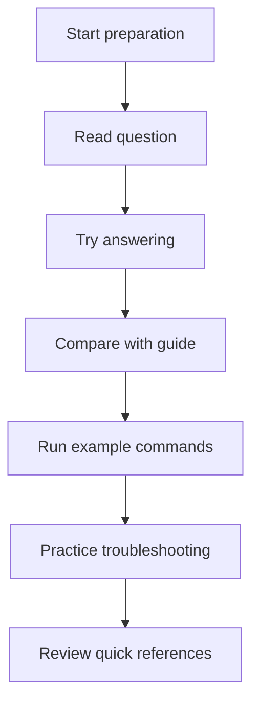
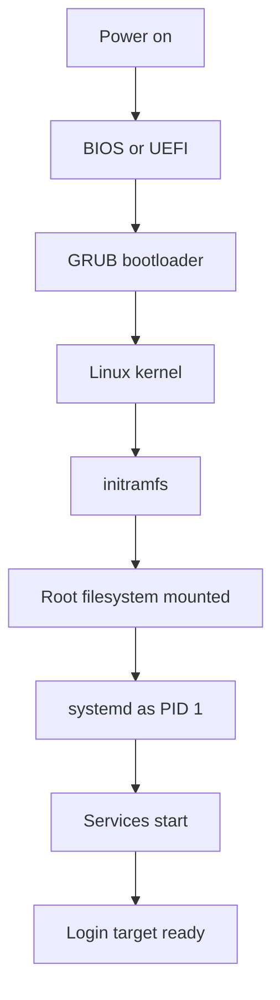
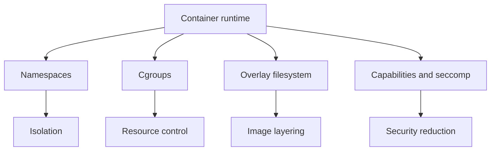
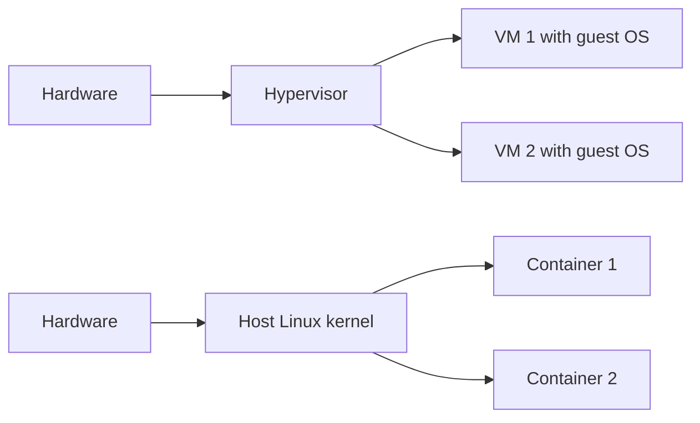
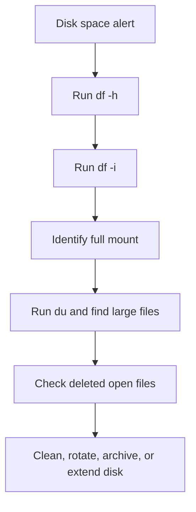
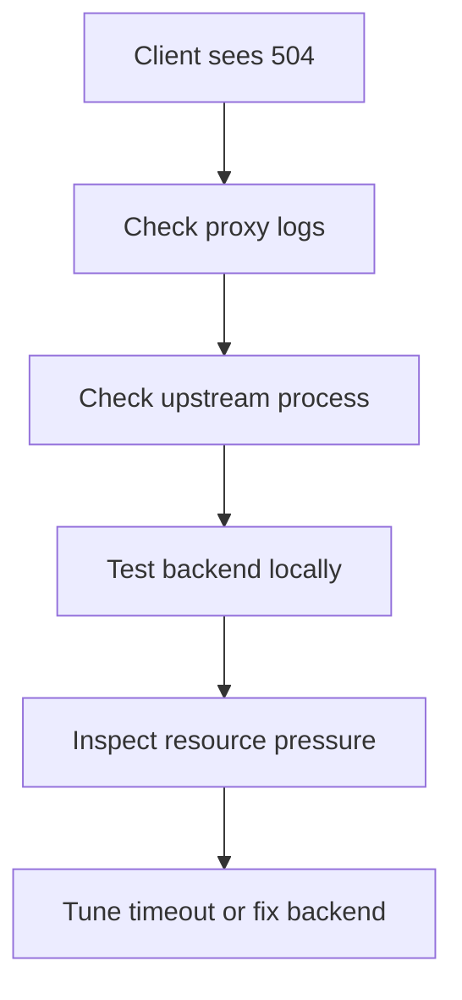
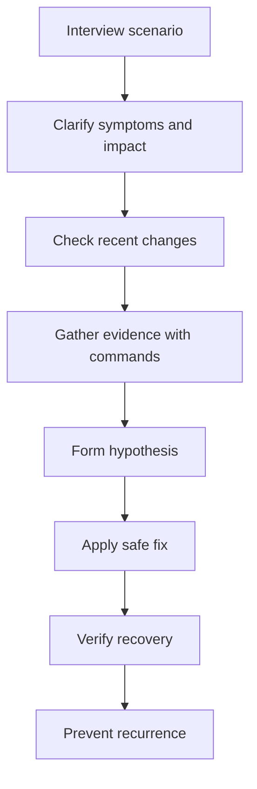

# Linux Interview Questions Guide

A production-quality Linux interview preparation guide covering beginner to expert topics, real-world scenarios, and DevOps/SRE-focused Linux knowledge. This guide is designed for self-study, interview preparation, team training, and practical operational reference.

---

## Table of Contents

- [How to Use This Guide](#how-to-use-this-guide)
- [Basic Level Questions](#basic-level-questions)
- [Intermediate Level Questions](#intermediate-level-questions)
- [Advanced Level Questions](#advanced-level-questions)
- [Scenario-Based Questions](#scenario-based-questions)
- [DevOps/SRE Linux Questions](#devopssre-linux-questions)
- [Quick Reference Tables](#quick-reference-tables)

---

## How to Use This Guide

- Read the **question** first and try answering it yourself.
- Compare your response with the **detailed answer**.
- Run the **example commands** in a lab or VM.
- Focus on **why** commands are used, not just syntax.
- Practice the **scenario-based questions** as incident-response drills.



---

# Basic Level Questions

## Q1: What is Linux?
**Answer:** Linux is an open-source Unix-like operating system kernel created by Linus Torvalds. In common usage, people often say "Linux" to refer to a full operating system distribution built around the Linux kernel, such as Ubuntu, Debian, Red Hat Enterprise Linux, Rocky Linux, Alpine, and SUSE. A Linux distribution includes the kernel, shell, package manager, system libraries, utilities, and services.

Linux is widely used in servers, cloud platforms, embedded systems, development environments, containers, supercomputers, and networking appliances. It is known for stability, security, automation-friendliness, and transparency.

Key characteristics:
- Multiuser
- Multitasking
- Permission-based security model
- Powerful command-line interface
- Rich networking and scripting capabilities
- Extensive open-source ecosystem

Example commands:
```bash
uname -a
cat /etc/os-release
hostnamectl
```

---

## Q2: What is the difference between the Linux kernel and a Linux distribution?
**Answer:** The **kernel** is the core component that interacts with hardware, manages CPU scheduling, memory, storage, devices, and system calls. A **distribution** is a complete operating system built around the kernel and includes user-space tools, package management, init system, shells, and documentation.

For example:
- Kernel: Linux 6.x
- Distribution: Ubuntu 24.04, RHEL 9, Debian 12

Think of it this way:
- Kernel = engine
- Distribution = complete vehicle

Example commands:
```bash
uname -r
cat /etc/os-release
ls /boot
```

---

## Q3: What are the main components of a Linux system?
**Answer:** A Linux system is typically made of the following major components:

1. **Kernel** — Handles hardware interaction, memory, processes, drivers, and system calls.
2. **Shell** — Command interpreter such as Bash, Zsh, or Fish.
3. **File system** — Organizes data in a hierarchical directory structure.
4. **System libraries** — Provide standard functions for applications, such as glibc.
5. **Init system** — Starts services and manages boot, commonly `systemd`.
6. **User-space utilities** — Tools like `ls`, `cp`, `grep`, `awk`, `sed`, and `ps`.
7. **Package manager** — Installs and updates software, such as `apt`, `dnf`, `yum`, `zypper`, or `pacman`.
8. **Applications/services** — Web servers, databases, SSH, cron, and monitoring tools.

Example commands:
```bash
ps -p 1 -o comm=
which bash
ldd --version
systemctl --version
```

---

## Q4: What is the Linux file system hierarchy?
**Answer:** Linux uses a single-rooted hierarchical directory structure starting at `/`. Every file and directory exists under this root.

Important directories:
- `/` — Root of the entire file system
- `/bin` — Essential user binaries
- `/sbin` — Essential system binaries
- `/etc` — Configuration files
- `/home` — User home directories
- `/root` — Root user home directory
- `/var` — Variable data like logs, caches, spool files
- `/usr` — User programs, libraries, documentation
- `/tmp` — Temporary files
- `/dev` — Device files
- `/proc` — Virtual process/kernel information
- `/sys` — Virtual kernel/device information
- `/boot` — Bootloader files and kernel images
- `/lib`, `/lib64` — Shared libraries
- `/mnt`, `/media` — Mount points
- `/opt` — Optional third-party software

Example commands:
```bash
ls /
tree -L 1 /
find /etc -maxdepth 1 -type f | head
```

---

## Q5: What is the difference between an absolute path and a relative path?
**Answer:** An **absolute path** begins from the root directory `/` and always points to the same location regardless of the current working directory. A **relative path** is interpreted from your current directory.

Examples:
- Absolute: `/etc/ssh/sshd_config`
- Relative: `../logs/app.log`

If you are in `/home/user/projects`:
- `cd ../docs` moves to `/home/user/docs`
- `cat /etc/hosts` always reads the same file

Example commands:
```bash
pwd
cd /var/log
cd ../tmp
readlink -f ../log
```

---

## Q6: What do `.` and `..` mean in Linux paths?
**Answer:** These are special directory references:
- `.` means the **current directory**
- `..` means the **parent directory**

They are useful in navigation, scripting, and file operations.

Examples:
- `./script.sh` runs a script in the current directory
- `cd ..` moves up one directory
- `cp file.txt ../backup/` copies a file to the parent directory's backup directory

Example commands:
```bash
pwd
ls -la .
ls -la ..
cd ..
```

---

## Q7: How do you list files in Linux?
**Answer:** The `ls` command lists files and directories. Common options provide detailed information, hidden files, sorting, and human-readable sizes.

Common options:
- `ls` — Simple listing
- `ls -l` — Long format
- `ls -a` — Include hidden files
- `ls -lh` — Human-readable sizes
- `ls -lt` — Sort by modification time
- `ls -R` — Recursive listing

Example commands:
```bash
ls
ls -la
ls -lh /var/log
ls -lt /etc | head
```

---

## Q8: How do you create, copy, move, and delete files?
**Answer:** Basic file operations are essential in Linux administration.

- Create empty file: `touch`
- Copy file: `cp`
- Move or rename file: `mv`
- Delete file: `rm`
- Remove directory: `rmdir` or `rm -r`

Be careful with deletion, especially with recursive operations.

Example commands:
```bash
touch notes.txt
cp notes.txt notes.bak
mv notes.bak archive.txt
rm archive.txt
mkdir demo_dir
rmdir demo_dir
```

---

## Q9: What are hidden files in Linux?
**Answer:** Hidden files are files or directories whose names begin with a dot (`.`). They are commonly used for configuration.

Examples:
- `.bashrc`
- `.profile`
- `.ssh/`
- `.gitconfig`

They are not shown in a normal `ls` output unless you use `-a`.

Example commands:
```bash
ls
ls -a
ls -ld ~/.ssh ~/.bashrc
```

---

## Q10: How do you view file contents?
**Answer:** Linux provides many tools for viewing file contents depending on use case.

Common tools:
- `cat` — Print full file content
- `less` — Paginated viewing
- `more` — Simpler pager
- `head` — First lines
- `tail` — Last lines
- `tail -f` — Follow a growing file, useful for logs

Example commands:
```bash
cat /etc/hosts
head -n 20 /etc/passwd
tail -n 50 /var/log/system.log
less /etc/ssh/sshd_config
```

---

## Q11: How do you search for files in Linux?
**Answer:** The main tools are `find`, `locate`, and shell globbing.

- `find` performs real-time searches with filters like name, type, size, and age.
- `locate` uses a prebuilt database and is faster but may be outdated.
- Globbing uses patterns such as `*.log`.

Example commands:
```bash
find /var/log -name "*.log"
find /home -type f -size +100M
locate sshd_config
ls /etc/*.conf
```

---

## Q12: How do you search for text inside files?
**Answer:** The `grep` command searches file content using patterns. It can search recursively, ignore case, show line numbers, or use regular expressions.

Useful options:
- `grep "text" file`
- `grep -i` — Case-insensitive
- `grep -r` — Recursive
- `grep -n` — Line numbers
- `grep -v` — Invert match
- `grep -E` — Extended regex

Example commands:
```bash
grep "PermitRootLogin" /etc/ssh/sshd_config
grep -rin "error" /var/log
grep -E "^(root|admin)" /etc/passwd
```

---

## Q13: What is a regular expression?
**Answer:** A regular expression (regex) is a pattern used to match text. Linux tools such as `grep`, `sed`, `awk`, and many programming languages support regex.

Common patterns:
- `.` — Any character
- `*` — Zero or more of previous item
- `+` — One or more
- `^` — Start of line
- `$` — End of line
- `[0-9]` — Any digit
- `[^a-z]` — Not lowercase letter

Example commands:
```bash
grep -E "^root" /etc/passwd
grep -E "[0-9]{3}" sample.txt
grep -E "error|warning|critical" app.log
```

---

## Q14: What is the purpose of `pwd`?
**Answer:** `pwd` stands for **print working directory**. It shows your current location in the file system. This is especially useful in scripts and while navigating large directory trees.

Example commands:
```bash
pwd
cd /etc/ssh
pwd
```

---

## Q15: How do permissions work in Linux?
**Answer:** Linux file permissions control who can read, write, or execute files and directories. Permissions are divided into three categories:

- **User (u)** — Owner
- **Group (g)** — Group members
- **Others (o)** — Everyone else

Permission bits:
- `r` = read
- `w` = write
- `x` = execute

Example long listing:
```text
-rwxr-x--- 1 alice devops 2048 Jan 10 10:00 deploy.sh
```
This means:
- Owner: read, write, execute
- Group: read, execute
- Others: no access

Example commands:
```bash
ls -l deploy.sh
chmod u+x deploy.sh
chmod 750 deploy.sh
```

---

## Q16: What do numeric permission modes like 755 and 644 mean?
**Answer:** Numeric mode is an octal representation of permissions.

Values:
- `r = 4`
- `w = 2`
- `x = 1`

Examples:
- `755` = owner `7` (rwx), group `5` (r-x), others `5` (r-x)
- `644` = owner `6` (rw-), group `4` (r--), others `4` (r--)
- `600` = owner only read/write

Typical uses:
- Directories/scripts: `755`
- Regular config/data files: `644`
- Private key files: `600`

Example commands:
```bash
chmod 755 script.sh
chmod 644 app.conf
chmod 600 ~/.ssh/id_rsa
```

---

## Q17: What is the difference between file and directory permissions?
**Answer:** File and directory permissions behave differently.

For files:
- `r` = read contents
- `w` = modify file contents
- `x` = execute file as a program/script

For directories:
- `r` = list directory contents
- `w` = create, delete, rename entries within directory
- `x` = enter/traverse directory

Important nuance: to access a file inside a directory, you usually need execute permission on the directory.

Example commands:
```bash
mkdir testdir
chmod 700 testdir
ls -ld testdir
```

---

## Q18: How do you change file ownership?
**Answer:** Use `chown` to change owner and optionally group, and `chgrp` to change only the group.

Examples:
- `chown alice file.txt`
- `chown alice:devops file.txt`
- `chgrp devops file.txt`
- `chown -R nginx:nginx /var/www/html`

Example commands:
```bash
sudo chown alice report.txt
sudo chown alice:developers report.txt
sudo chgrp developers report.txt
```

---

## Q19: How do you create users in Linux?
**Answer:** User accounts can be created with commands such as `useradd` or `adduser` depending on distribution.

Typical steps:
1. Create the user
2. Set a password
3. Optionally assign shell, home directory, and groups

Example commands:
```bash
sudo useradd -m -s /bin/bash appuser
sudo passwd appuser
id appuser
getent passwd appuser
```

---

## Q20: How do you manage groups?
**Answer:** Groups simplify permission management across multiple users.

Common commands:
- `groupadd` — Create group
- `groupdel` — Delete group
- `usermod -aG` — Add user to supplementary group
- `groups` — Show user group membership
- `id` — Show UID, GID, and groups

Example commands:
```bash
sudo groupadd developers
sudo usermod -aG developers alice
id alice
groups alice
```

---

## Q21: What files store user and group account information?
**Answer:** Linux stores account information in several key files:

- `/etc/passwd` — User account information
- `/etc/shadow` — Password hashes and aging data
- `/etc/group` — Group definitions
- `/etc/gshadow` — Secure group information

Examples:
- `/etc/passwd` includes username, UID, GID, comment, home, shell
- `/etc/shadow` is readable only by privileged users

Example commands:
```bash
cat /etc/passwd | head
sudo cat /etc/shadow | head
cat /etc/group | head
getent passwd root
```

---

## Q22: What is the root user?
**Answer:** The `root` user is the superuser with unrestricted administrative privileges. Root can read or modify nearly any file, manage users, change configuration, install software, and control services.

Because root access is powerful and risky:
- Use it carefully
- Prefer `sudo` where possible
- Audit administrative actions
- Disable direct remote root login when appropriate

Example commands:
```bash
whoami
id
sudo -l
sudo systemctl restart sshd
```

---

## Q23: What is `sudo` and why is it preferred over logging in as root?
**Answer:** `sudo` allows an authorized user to run commands with elevated privileges, usually as root. It is preferred because it provides accountability, finer-grained control, and reduced exposure compared to logging in directly as root.

Benefits:
- Commands are logged
- Access can be delegated per user/group
- Reduces accidental full-session root usage
- Supports least privilege

Example commands:
```bash
sudo whoami
sudo visudo
sudo systemctl status sshd
```

---

## Q24: How do you change your password and view password aging settings?
**Answer:** Use `passwd` to change a password. Use `chage` to inspect or update password aging policies.

Example commands:
```bash
passwd
sudo passwd alice
chage -l alice
sudo chage -M 90 -W 7 alice
```

Meaning:
- `-M 90` — Maximum 90 days before expiry
- `-W 7` — Warn 7 days before expiry

---

## Q25: What is a shell?
**Answer:** A shell is a command interpreter that lets users interact with the operating system. It reads commands, executes programs, supports scripting, handles variables, redirection, pipes, and job control.

Common shells:
- `bash`
- `sh`
- `zsh`
- `ksh`
- `fish`

Example commands:
```bash
echo $SHELL
cat /etc/shells
ps -p $$ -o comm=
```

---

## Q26: What is the difference between Bash and Sh?
**Answer:** `sh` traditionally refers to the Bourne shell or a POSIX-compatible shell interface, while `bash` is the GNU Bourne Again Shell with many extended features.

Bash provides:
- Arrays
- Brace expansion
- Advanced conditionals
- Improved history and completion
- More scripting conveniences

Portable scripts often use POSIX `sh` syntax. Scripts requiring Bash features should declare `#!/bin/bash`.

Example commands:
```bash
ls -l /bin/sh /bin/bash
bash --version
sh --version || true
```

---

## Q27: What are environment variables?
**Answer:** Environment variables are key-value pairs inherited by processes. They influence shell behavior, executable lookup, locale, editors, and application runtime settings.

Common variables:
- `PATH`
- `HOME`
- `USER`
- `SHELL`
- `LANG`
- `EDITOR`

Example commands:
```bash
env | sort
echo $PATH
echo $HOME
export APP_ENV=production
echo $APP_ENV
```

---

## Q28: What is the `PATH` variable?
**Answer:** `PATH` is an environment variable containing a colon-separated list of directories that the shell searches to find executable commands.

If `PATH` includes `/usr/local/bin:/usr/bin:/bin`, then running `ls` causes the shell to search those directories in order.

Best practices:
- Avoid adding writable directories for untrusted users
- Use absolute paths in critical scripts
- Verify command location with `which`, `type`, or `command -v`

Example commands:
```bash
echo $PATH
which python3
command -v systemctl
type ls
```

---

## Q29: What are pipes and redirection in Linux?
**Answer:** Pipes and redirection are fundamental shell features.

- `>` redirects stdout to a file, overwriting it
- `>>` appends stdout to a file
- `<` redirects file input to a command
- `2>` redirects stderr
- `|` pipes stdout of one command into another command's stdin

Examples:
- `ls > files.txt`
- `grep error app.log | wc -l`
- `command >out.txt 2>err.txt`

Example commands:
```bash
ls -l > listing.txt
grep root /etc/passwd | cut -d: -f1
find /etc -name "*.conf" 2>/dev/null | head
```

---

## Q30: What is the difference between stdout, stderr, and stdin?
**Answer:** Standard streams are default communication channels for processes.

- **stdin (0)** — Standard input
- **stdout (1)** — Standard output
- **stderr (2)** — Standard error

Separating stdout and stderr is important in scripting and automation.

Example commands:
```bash
echo "hello" > out.txt
ls /does-not-exist 2> err.txt
sort < /etc/passwd | head
command > all.out 2>&1
```

---

## Q31: How do you count words, lines, and characters in a file?
**Answer:** Use `wc` (word count).

Common options:
- `wc -l` — Line count
- `wc -w` — Word count
- `wc -c` — Byte count
- `wc -m` — Character count

Example commands:
```bash
wc /etc/passwd
wc -l /etc/passwd
wc -w notes.txt
wc -c logfile.txt
```

---

## Q32: How do you compare files?
**Answer:** Linux offers several file comparison tools.

- `diff` — Line-by-line differences
- `cmp` — Byte-by-byte comparison
- `comm` — Compare sorted files
- `md5sum`/`sha256sum` — Compare checksums

Example commands:
```bash
diff file1.txt file2.txt
cmp file1.bin file2.bin
sha256sum image1.iso image2.iso
```

---

## Q33: What is the difference between a hard link and a symbolic link?
**Answer:** A **hard link** points to the same inode as the original file. A **symbolic link** is a separate file that stores a path to another file.

Hard link characteristics:
- Same inode as target
- Usually cannot span file systems
- Typically cannot link directories

Symbolic link characteristics:
- Different inode
- Can span file systems
- Can point to directories
- Can become broken if target is removed

Example commands:
```bash
ln original.txt hardlink.txt
ln -s original.txt symlink.txt
ls -li original.txt hardlink.txt symlink.txt
```

---

## Q34: What is an inode?
**Answer:** An inode is a metadata structure describing a file or directory. It stores information such as ownership, permissions, timestamps, size, and disk block pointers, but not the file name itself. File names are stored in directory entries mapping names to inode numbers.

Useful when troubleshooting:
- Many hard links point to same inode
- File systems can run out of inodes even with free space

Example commands:
```bash
ls -i /etc/hosts
stat /etc/hosts
df -i
```

---

## Q35: How do you check disk usage and free space?
**Answer:** Use `df` for file system free space and `du` for per-file or per-directory usage.

- `df -h` — Human-readable free space
- `df -i` — Inode usage
- `du -sh dir` — Size of directory
- `du -ah dir | sort -h` — Detailed usage

Example commands:
```bash
df -h
df -i
du -sh /var/log
du -ah /var | sort -h | tail
```

---

## Q36: How do you create and extract archives?
**Answer:** Archiving and compression are common admin tasks.

Tools:
- `tar` — Archive files/directories
- `gzip`, `gunzip` — Compress/decompress
- `bzip2`, `xz` — Alternative compressors
- `zip`, `unzip` — ZIP archives

Example commands:
```bash
tar -cvf backup.tar /etc
tar -czvf backup.tar.gz /etc
tar -xzvf backup.tar.gz
zip -r project.zip project/
unzip project.zip
```

---

## Q37: What is package management in Linux?
**Answer:** Package management is the process of installing, updating, removing, and verifying software using distribution-specific tools. Packages include binaries, dependencies, metadata, and scripts.

Major package families:
- Debian/Ubuntu: `.deb` with `apt`, `dpkg`
- RHEL/CentOS/Rocky/Alma: `.rpm` with `dnf`, `yum`, `rpm`
- SUSE: `zypper`, `rpm`
- Arch: `pacman`

Example commands:
```bash
apt list --installed | head
dnf list installed | head
rpm -qa | head
dpkg -l | head
```

---

## Q38: How do you install software on Debian/Ubuntu systems?
**Answer:** Use `apt` for package installation and repository-based management. Use `dpkg` for direct `.deb` file handling.

Common workflow:
1. Refresh package metadata
2. Install package
3. Verify installation

Example commands:
```bash
sudo apt update
sudo apt install -y nginx
apt show nginx
sudo dpkg -i package.deb
sudo apt -f install
```

---

## Q39: How do you install software on RHEL-based systems?
**Answer:** Modern RHEL-based systems commonly use `dnf`; older versions use `yum`. Direct RPM handling uses `rpm`.

Example commands:
```bash
sudo dnf makecache
sudo dnf install -y httpd
rpm -q httpd
sudo rpm -ivh package.rpm
sudo dnf remove -y httpd
```

---

## Q40: How do you update and remove packages?
**Answer:** Updating and removing packages depends on the package manager.

Debian/Ubuntu:
```bash
sudo apt update
sudo apt upgrade -y
sudo apt remove -y nginx
sudo apt purge -y nginx
```

RHEL-based:
```bash
sudo dnf upgrade -y
sudo dnf remove -y httpd
```

Difference between remove and purge:
- `remove` typically keeps some config files
- `purge` removes config files too

---

## Q41: How do you verify whether a command exists?
**Answer:** Use `which`, `type`, or `command -v`.

Recommended:
- `command -v` is POSIX-friendly and script-safe
- `type` shows whether a command is an alias, builtin, function, or file

Example commands:
```bash
command -v ssh
which ssh
type cd
type ll || true
```

---

## Q42: What is the purpose of `man` pages?
**Answer:** `man` pages are built-in documentation for commands, system calls, configuration formats, and library functions. They are invaluable during troubleshooting and interviews.

Man page sections include:
1. User commands
5. File formats/configs
8. System administration commands

Example commands:
```bash
man ls
man 5 passwd
man 8 systemctl
```

---

## Q43: How do you see command history?
**Answer:** Bash stores command history and allows reuse of previous commands.

Useful methods:
- `history` — Show history list
- `!n` — Re-run command number `n`
- `!!` — Re-run previous command
- `Ctrl+r` — Reverse search interactively

Example commands:
```bash
history | tail
history | grep ssh
!!
```

---

## Q44: What is the difference between `echo` and `printf`?
**Answer:** Both print text, but `printf` is more predictable and script-friendly.

- `echo` is simple but behavior may vary with escape sequences or `-n`
- `printf` supports formatting and avoids portability issues

Example commands:
```bash
echo "Hello"
printf "User: %s\n" "$USER"
printf "CPU: %.2f\n" 87.25
```

---

## Q45: How do you sort and extract columns from text output?
**Answer:** Common tools include `sort`, `cut`, `awk`, `column`, and `uniq`.

Examples:
- `sort file.txt`
- `cut -d: -f1 /etc/passwd`
- `awk '{print $1}'`
- `sort | uniq -c`

Example commands:
```bash
cut -d: -f1 /etc/passwd | sort | head
awk -F: '{print $1, $7}' /etc/passwd
sort names.txt | uniq -c
```

---

## Q46: What is the purpose of `touch`?
**Answer:** `touch` creates an empty file if it does not exist, or updates access and modification timestamps if it does exist.

Use cases:
- Create placeholder files
- Update timestamps for build or deployment workflows
- Test scripts and file monitoring

Example commands:
```bash
touch app.log
stat app.log
touch -t 202501011200 sample.txt
```

---

## Q47: How do you determine file type?
**Answer:** Use `file` to inspect file content type and `stat` for metadata. File extensions are not authoritative in Linux.

Example commands:
```bash
file /bin/ls
file archive.tar.gz
stat /bin/ls
```

Typical output can show ELF binary, ASCII text, shell script, gzip compressed data, or symbolic link.

---

## Q48: How do you monitor log files in real time?
**Answer:** The most common tool is `tail -f`, which follows new log entries as they are written. This is extremely useful during deployments, service restarts, and troubleshooting.

Alternative tools:
- `less +F`
- `journalctl -f` for systemd journals
- `multitail` if installed

Example commands:
```bash
tail -f /var/log/syslog
journalctl -u nginx -f
```

---

## Q49: What is the difference between soft reboot and shutdown commands?
**Answer:** Reboot and shutdown commands are used for system power state management.

Common commands:
- `reboot` — Restart the system
- `shutdown -r now` — Reboot now
- `shutdown -h now` — Halt/power off now
- `poweroff` — Shut down system

In production, always ensure users, applications, storage, and maintenance windows are handled properly before rebooting.

Example commands:
```bash
sudo shutdown -r +5 "Kernel maintenance"
sudo shutdown -h now
sudo systemctl reboot
```

---

## Q50: What are the most important beginner Linux commands to know?
**Answer:** A strong beginner should be comfortable with navigation, file management, viewing content, searching, permissions, process observation, package management, and basic networking commands.

Essential commands include:
- `pwd`, `cd`, `ls`
- `cp`, `mv`, `rm`, `mkdir`, `touch`
- `cat`, `less`, `head`, `tail`
- `grep`, `find`, `sort`, `cut`, `awk`
- `chmod`, `chown`, `chgrp`
- `ps`, `top`, `kill`
- `df`, `du`, `free`
- `ip`, `ping`, `ss`
- `apt`, `dnf`, `yum`
- `systemctl`, `journalctl`

Example commands:
```bash
pwd
ls -la
find /etc -name "*.conf" | head
grep -rin "listen" /etc/nginx
ps aux | head
df -h
free -h
ip a
```

---

# Intermediate Level Questions

## Q51: What is a process in Linux?
**Answer:** A process is an instance of a running program with its own PID, memory space, open file descriptors, environment variables, and execution context. Linux is process-oriented: everything from shells to web servers to cron jobs runs as processes.

Important concepts:
- PID: Process ID
- PPID: Parent Process ID
- Foreground vs background process
- User/system processes
- States such as running, sleeping, stopped, zombie

Example commands:
```bash
ps -ef | head
ps -p 1 -f
pstree -p | head
```

---

## Q52: What is the difference between a process and a thread?
**Answer:** A process is an independent execution unit with its own address space. A thread is a lighter execution unit within a process that shares memory and resources with sibling threads.

Why it matters:
- Processes provide stronger isolation
- Threads are cheaper to create and switch between
- Multi-threaded apps can use multiple CPU cores efficiently

Example commands:
```bash
ps -eLf | head
top -H -p $(pgrep -n java)
```

---

## Q53: How do you list running processes?
**Answer:** Common tools include `ps`, `top`, `htop`, `pgrep`, and `pidof`.

Examples:
- `ps -ef` — Full listing
- `ps aux` — BSD-style listing
- `top` — Real-time process view
- `pgrep nginx` — Find PID by name
- `pidof sshd` — PID(s) by program name

Example commands:
```bash
ps -ef | grep nginx
pgrep -a sshd
pidof systemd
top -b -n 1 | head -20
```

---

## Q54: How do you kill a process?
**Answer:** Use `kill`, `pkill`, or `killall` depending on context, though `kill` with a specific PID is safer and more precise.

Common signals:
- `SIGTERM (15)` — Graceful termination
- `SIGKILL (9)` — Force kill
- `SIGHUP (1)` — Reload/restart behavior in some daemons

Example commands:
```bash
kill 1234
kill -TERM 1234
kill -9 1234
pkill -f gunicorn
```

Operational guidance:
- Try `SIGTERM` first
- Use `SIGKILL` only if the process refuses to exit

---

## Q55: What is a zombie process?
**Answer:** A zombie process is a terminated process whose exit status has not yet been collected by its parent via `wait()`. It no longer executes, but it still has a process table entry.

Characteristics:
- Shows state `Z`
- Consumes PID slot, not CPU or meaningful memory
- Usually disappears when the parent reaps it

If zombies accumulate, the parent process may be buggy.

Example commands:
```bash
ps -el | grep ' Z '
ps -eo pid,ppid,state,cmd | awk '$3=="Z"'
```

---

## Q56: What is an orphan process?
**Answer:** An orphan process is a process whose parent has exited before the child. The kernel reassigns the orphan to PID 1 (or another designated reaper process such as systemd), which later collects its exit status.

This is normal behavior in Unix-like systems.

Example commands:
```bash
ps -eo pid,ppid,cmd | awk '$2==1 {print}' | head
```

---

## Q57: What do process states like R, S, D, T, and Z mean?
**Answer:** Process state codes provide insight into system behavior.

Common states:
- `R` — Running or runnable
- `S` — Interruptible sleep
- `D` — Uninterruptible sleep, usually waiting on I/O
- `T` — Stopped or traced
- `Z` — Zombie

If many processes are stuck in `D`, investigate storage or kernel-level waits.

Example commands:
```bash
ps -eo pid,state,cmd | head -20
ps -eo pid,ppid,state,wchan,cmd | grep '^ *[0-9]'
```

---

## Q58: What is nice and renice?
**Answer:** Nice values influence process scheduling priority for normal user-space tasks. Lower nice values mean higher scheduling priority.

Range:
- `-20` highest priority
- `19` lowest priority

Commands:
- `nice` — Start a command with a given nice value
- `renice` — Change nice value of an existing process

Example commands:
```bash
nice -n 10 tar -czf backup.tar.gz /data
renice 5 -p 1234
ps -o pid,ni,cmd -p 1234
```

---

## Q59: What is the difference between top, htop, vmstat, and iostat?
**Answer:** These tools focus on different resource perspectives.

- `top` — Real-time CPU/memory/process view
- `htop` — Interactive enhanced version of top
- `vmstat` — Virtual memory, processes, CPU, I/O summary
- `iostat` — CPU and block device I/O statistics

Use them together during performance troubleshooting.

Example commands:
```bash
top
vmstat 1 5
iostat -xz 1 5
```

---

## Q60: How do you schedule recurring jobs?
**Answer:** Use `cron` for recurring tasks and `at` for one-time scheduled execution.

Cron concepts:
- Per-user crontab with `crontab -e`
- System-wide files like `/etc/crontab` and `/etc/cron.*`
- Standard fields: minute, hour, day-of-month, month, day-of-week

Example commands:
```bash
crontab -l
crontab -e
systemctl status cron || systemctl status crond
```

Example cron entry:
```cron
0 2 * * * /usr/local/bin/backup.sh
```

---

## Q61: What are systemd services and units?
**Answer:** `systemd` is the dominant init system and service manager in many Linux distributions. It manages different types of units such as services, sockets, mounts, timers, and targets.

Common unit types:
- `.service`
- `.socket`
- `.mount`
- `.timer`
- `.target`

Common tasks:
- Start/stop/restart services
- Enable services at boot
- Inspect status and logs

Example commands:
```bash
systemctl status sshd
systemctl list-units --type=service
systemctl cat nginx
```

---

## Q62: How do you start, stop, restart, and enable services?
**Answer:** Use `systemctl` for service operations.

Common commands:
- `systemctl start nginx`
- `systemctl stop nginx`
- `systemctl restart nginx`
- `systemctl reload nginx`
- `systemctl enable nginx`
- `systemctl disable nginx`
- `systemctl is-enabled nginx`

Example commands:
```bash
sudo systemctl start nginx
sudo systemctl restart nginx
sudo systemctl enable nginx
systemctl is-active nginx
systemctl is-enabled nginx
```

---

## Q63: How do you read logs in a systemd-based system?
**Answer:** Use `journalctl` to view systemd journal logs. It supports filtering by unit, boot, time, priority, and following live logs.

Useful options:
- `journalctl -u nginx`
- `journalctl -xe`
- `journalctl -b`
- `journalctl -f`
- `journalctl --since "1 hour ago"`

Example commands:
```bash
journalctl -u sshd --since today
journalctl -p err -b
journalctl -f
```

---

## Q64: How does Linux boot at a high level?
**Answer:** Linux boot involves several stages from firmware to user-space services.

Typical flow:
1. BIOS/UEFI initializes hardware
2. Bootloader such as GRUB loads kernel and initramfs
3. Kernel initializes memory, CPU, devices, drivers
4. Kernel mounts initramfs and then root file system
5. PID 1 starts, usually `systemd`
6. Services and targets are activated
7. Login prompt or graphical target becomes available



Example commands:
```bash
systemd-analyze
systemd-analyze blame
ls /boot
```

---

## Q65: What is networking in Linux and how do you view interface information?
**Answer:** Linux networking involves interfaces, IP addresses, routes, ARP/neighbor tables, sockets, firewall rules, and network services. The modern command suite is `ip` from `iproute2`.

Useful tasks:
- View interfaces and addresses
- Bring links up/down
- Inspect routes and neighbor entries

Example commands:
```bash
ip addr show
ip link show
ip route show
ip neigh show
```

---

## Q66: What is the difference between `ip`, `ifconfig`, and `nmcli`?
**Answer:** `ip` is the modern and preferred utility from `iproute2`. `ifconfig` is older and deprecated in many environments. `nmcli` is used to manage NetworkManager.

Use cases:
- `ip`: scripting and standard network inspection/configuration
- `ifconfig`: legacy systems
- `nmcli`: desktop/server systems managed by NetworkManager

Example commands:
```bash
ip a
ifconfig || true
nmcli device status || true
nmcli connection show || true
```

---

## Q67: How do you test network connectivity?
**Answer:** Several layers of testing are useful.

Layered checks:
1. Local interface status
2. IP reachability with `ping`
3. DNS resolution with `dig`, `host`, or `nslookup`
4. TCP reachability with `nc`, `telnet`, or `curl`
5. Route path with `traceroute` or `tracepath`

Example commands:
```bash
ping -c 4 8.8.8.8
ping -c 4 google.com
dig github.com
nc -vz example.com 443
traceroute 8.8.8.8
```

---

## Q68: How do you inspect listening ports and active connections?
**Answer:** Use `ss`, which is faster and more modern than `netstat`.

Useful options:
- `ss -tulnp` — TCP/UDP listening sockets with process info
- `ss -tan` — TCP connections
- `ss -s` — Summary

Example commands:
```bash
ss -tulnp
ss -tan | head
ss -s
lsof -i :443
```

---

## Q69: What is DNS and how do you troubleshoot it?
**Answer:** DNS converts domain names to IP addresses. Troubleshooting should separate name resolution problems from general network connectivity issues.

Checks:
- Verify `/etc/resolv.conf`
- Test with `dig` or `host`
- Compare internal vs external resolvers
- Check search domain behavior
- Confirm firewalls allow UDP/TCP 53

Example commands:
```bash
cat /etc/resolv.conf
dig example.com
host example.com
nslookup example.com
```

---

## Q70: What is a routing table?
**Answer:** A routing table determines where packets are sent based on destination networks, gateways, and interfaces. The kernel uses the most specific matching route.

Important fields:
- Destination network
- Gateway/next hop
- Interface
- Metric

Example commands:
```bash
ip route show
ip route get 8.8.8.8
netstat -rn || true
```

---

## Q71: How do you transfer files securely between systems?
**Answer:** Common secure methods include `scp`, `sftp`, and `rsync` over SSH.

Use cases:
- `scp` — Simple copy
- `sftp` — Interactive secure transfer
- `rsync -e ssh` — Efficient sync, preserves attributes, transfers deltas

Example commands:
```bash
scp backup.tar.gz user@server:/backups/
sftp user@server
rsync -avz -e ssh /data/ user@server:/data/
```

---

## Q72: What is SSH and what are key SSH files?
**Answer:** SSH provides secure remote login and encrypted data transfer. It uses host keys, user authentication, and optional public key authentication.

Important files:
- Client config: `~/.ssh/config`
- Private keys: `~/.ssh/id_rsa`, `~/.ssh/id_ed25519`
- Authorized keys: `~/.ssh/authorized_keys`
- Server config: `/etc/ssh/sshd_config`
- Known hosts: `~/.ssh/known_hosts`

Example commands:
```bash
ssh user@server
ssh -i ~/.ssh/id_ed25519 user@server
ssh-keygen -t ed25519
cat ~/.ssh/authorized_keys
```

---

## Q73: How do you troubleshoot SSH login failures?
**Answer:** Check the problem from both client and server perspectives.

Client-side:
- Use verbose mode with `ssh -vvv`
- Verify DNS and network reachability
- Check key permissions

Server-side:
- Inspect `sshd` status
- Review logs
- Validate `/etc/ssh/sshd_config`
- Confirm firewall and SELinux/AppArmor policies

Example commands:
```bash
ssh -vvv user@server
sudo systemctl status sshd
sudo sshd -t
journalctl -u sshd --since "10 minutes ago"
ls -ld ~/.ssh
ls -l ~/.ssh/authorized_keys
```

---

## Q74: What is a shell script?
**Answer:** A shell script is a text file containing shell commands executed in sequence. It is used for automation, administration, deployment, monitoring, backups, and bootstrapping.

Typical structure:
- Shebang line
- Variables
- Conditional logic
- Loops
- Functions
- Error handling

Example script:
```bash
#!/bin/bash
set -e
DATE=$(date +%F)
echo "Backup started on $DATE"
```

Example commands:
```bash
chmod +x backup.sh
./backup.sh
bash -x backup.sh
```

---

## Q75: What is the purpose of the shebang line?
**Answer:** The shebang tells the kernel which interpreter to use when executing a script directly.

Examples:
- `#!/bin/bash`
- `#!/usr/bin/env bash`
- `#!/bin/sh`
- `#!/usr/bin/python3`

Using `/usr/bin/env` can make scripts more portable across environments where interpreter locations vary.

Example commands:
```bash
head -n 1 script.sh
chmod +x script.sh
./script.sh
```

---

## Q76: How do variables work in shell scripts?
**Answer:** Variables store values for reuse in scripts. Bash variables are typically assigned without spaces around `=`.

Examples:
- `NAME="linux"`
- `COUNT=5`
- `echo "$NAME"`

Best practices:
- Quote variable expansions unless you intentionally want word splitting
- Use meaningful names
- Export variables only when child processes need them

Example commands:
```bash
NAME="server01"
echo "$NAME"
export ENV=prod
env | grep '^ENV='
```

---

## Q77: How do conditionals work in Bash?
**Answer:** Bash supports `if`, `elif`, `else`, and test expressions using `[ ]`, `[[ ]]`, or `test`.

Example:
```bash
if [ -f /etc/passwd ]; then
  echo "file exists"
else
  echo "missing"
fi
```

Useful tests:
- `-f` regular file
- `-d` directory
- `-z` empty string
- `-n` non-empty string
- `-eq`, `-lt`, `-gt` numeric comparisons

Example commands:
```bash
[ -d /etc ] && echo yes
[[ -n "$HOME" ]] && echo home-set
```

---

## Q78: How do loops work in shell scripts?
**Answer:** Loops let you repeat actions over lists, ranges, or conditions.

Common loop types:
- `for`
- `while`
- `until`

Example:
```bash
for user in alice bob carol; do
  echo "$user"
done
```

Example commands:
```bash
for f in /etc/*.conf; do echo "$f"; done | head
COUNT=1
while [ $COUNT -le 3 ]; do echo $COUNT; COUNT=$((COUNT+1)); done
```

---

## Q79: What is `set -euo pipefail` and why is it used?
**Answer:** This is a common Bash safety pattern.

- `set -e` — Exit on command failure
- `set -u` — Error on unset variables
- `set -o pipefail` — Pipeline fails if any command fails

It helps reduce silent errors in automation scripts.

Example:
```bash
#!/bin/bash
set -euo pipefail
```

Example commands:
```bash
bash -c 'set -euo pipefail; false; echo never'
```

---

## Q80: How do you debug shell scripts?
**Answer:** Common techniques:
- `bash -x script.sh` for execution trace
- `set -x` inside script to trace commands
- `set -e` for fail-fast behavior
- `echo` or `printf` for variable inspection
- ShellCheck for static analysis when available

Example commands:
```bash
bash -x deploy.sh
bash -n deploy.sh
set -x
```

---

## Q81: What is a file descriptor?
**Answer:** A file descriptor is an integer representing an open file, socket, pipe, or other I/O resource for a process.

Common descriptors:
- `0` stdin
- `1` stdout
- `2` stderr

Processes can open many more file descriptors for logs, sockets, temp files, and database connections.

Example commands:
```bash
ls -l /proc/$$/fd
lsof -p $$ | head
```

---

## Q82: What is `lsof` used for?
**Answer:** `lsof` stands for **list open files**. In Linux, everything is treated as a file abstraction, so `lsof` can show regular files, directories, block devices, libraries, and network sockets opened by processes.

Practical uses:
- Identify which process is using a port
- Find deleted-but-still-open files consuming space
- Inspect process file activity

Example commands:
```bash
lsof -i :8080
lsof -p 1234 | head
lsof | grep deleted
```

---

## Q83: How do you check memory usage?
**Answer:** Common memory inspection tools:
- `free -h`
- `top`
- `vmstat`
- `/proc/meminfo`
- `smem` if installed

Understand Linux memory behavior:
- Free memory alone is not enough
- Cached and buffered memory can be reclaimed
- Watch swap usage and OOM events

Example commands:
```bash
free -h
cat /proc/meminfo | head -20
vmstat 1 5
```

---

## Q84: What is swap space?
**Answer:** Swap is disk-backed virtual memory used when RAM pressure increases. It provides a safety buffer but is much slower than RAM.

Why it matters:
- Helps avoid immediate OOM conditions
- Excessive swap usage may indicate memory pressure
- Some swap is useful even on modern systems depending on workload

Example commands:
```bash
swapon --show
free -h
cat /proc/swaps
```

---

## Q85: How do you mount and unmount file systems?
**Answer:** Mounting attaches a file system to the directory tree. Unmounting detaches it.

Commands:
- `mount /dev/sdb1 /mnt/data`
- `umount /mnt/data`
- `findmnt`
- `lsblk`

Persistent mounts are configured in `/etc/fstab`.

Example commands:
```bash
lsblk
findmnt
sudo mount /dev/sdb1 /mnt
sudo umount /mnt
```

---

## Q86: What is `/etc/fstab`?
**Answer:** `/etc/fstab` defines file systems to mount automatically at boot or on demand. It includes device identifiers, mount points, file system types, mount options, dump value, and fsck order.

Typical fields:
1. Device or UUID
2. Mount point
3. File system type
4. Options
5. Dump
6. Fsck order

Example commands:
```bash
cat /etc/fstab
blkid
findmnt --verify
```

Sample entry:
```fstab
UUID=1234-5678 /data ext4 defaults,nofail 0 2
```

---

## Q87: What is the difference between ext4, XFS, and Btrfs?
**Answer:** These are common Linux file systems with different trade-offs.

- **ext4** — Mature, stable, widely supported, good default choice
- **XFS** — Excellent for large files and scalability, common in enterprise distributions
- **Btrfs** — Advanced features like snapshots, checksums, subvolumes, compression

Selection depends on workload, tooling, operational maturity, and recovery strategy.

Example commands:
```bash
lsblk -f
mount | grep -E 'ext4|xfs|btrfs'
```

---

## Q88: How do you manage partitions and disks?
**Answer:** Disk management typically involves these steps:
1. Detect disk
2. Partition disk
3. Create file system
4. Mount it
5. Persist in `/etc/fstab`

Tools:
- `lsblk`
- `fdisk`
- `parted`
- `mkfs.ext4`, `mkfs.xfs`
- `blkid`

Example commands:
```bash
lsblk
sudo fdisk /dev/sdb
sudo mkfs.ext4 /dev/sdb1
sudo blkid /dev/sdb1
sudo mount /dev/sdb1 /data
```

---

## Q89: What is LVM?
**Answer:** LVM (Logical Volume Manager) provides flexible storage management by abstracting physical disks into volume groups and logical volumes. It allows resizing, snapshots, and easier capacity planning.

Core terms:
- PV — Physical Volume
- VG — Volume Group
- LV — Logical Volume

Typical flow:
1. `pvcreate`
2. `vgcreate`
3. `lvcreate`
4. Create file system and mount

Example commands:
```bash
sudo pvcreate /dev/sdb1
sudo vgcreate vgdata /dev/sdb1
sudo lvcreate -n lvapp -L 20G vgdata
sudo mkfs.ext4 /dev/vgdata/lvapp
```

---

## Q90: How do you extend a logical volume and file system?
**Answer:** With LVM, you can often grow storage online.

Typical steps:
1. Confirm free space in the volume group
2. Extend the logical volume
3. Grow the file system

Example commands:
```bash
vgs
lvs
sudo lvextend -L +10G /dev/vgdata/lvapp
sudo resize2fs /dev/vgdata/lvapp
sudo xfs_growfs /mountpoint
```

Use `resize2fs` for ext-family file systems and `xfs_growfs` for XFS.

---

## Q91: How do you check CPU information?
**Answer:** CPU information can be obtained from multiple sources.

Useful commands:
- `lscpu`
- `cat /proc/cpuinfo`
- `nproc`
- `top`

Key details:
- Architecture
- Core count
- Thread count
- CPU model
- Virtualization support

Example commands:
```bash
lscpu
nproc
cat /proc/cpuinfo | grep 'model name' | head
```

---

## Q92: How do you identify startup performance issues?
**Answer:** On systemd systems, `systemd-analyze` is the main tool.

Useful commands:
- `systemd-analyze`
- `systemd-analyze blame`
- `systemd-analyze critical-chain`

These show total boot time and the units contributing most to delays.

Example commands:
```bash
systemd-analyze
systemd-analyze blame | head -20
systemd-analyze critical-chain
```

---

## Q93: What is SELinux at a high level?
**Answer:** SELinux (Security-Enhanced Linux) is a mandatory access control system that enforces security policies beyond traditional Unix permissions. Even if DAC permissions allow access, SELinux can still deny it.

Modes:
- Enforcing
- Permissive
- Disabled

Common commands:
- `getenforce`
- `sestatus`
- `restorecon`
- `semanage`

Example commands:
```bash
getenforce
sestatus
ls -Z /var/www/html
```

---

## Q94: What is a firewall and how do you inspect it?
**Answer:** A firewall controls allowed and blocked network traffic. Linux may use tools such as `firewalld`, `nftables`, or legacy `iptables`.

Common inspection tools:
- `firewall-cmd --list-all`
- `nft list ruleset`
- `iptables -L -n -v`

Example commands:
```bash
sudo firewall-cmd --list-all || true
sudo nft list ruleset || true
sudo iptables -L -n -v || true
```

---

## Q95: How do you troubleshoot high CPU usage?
**Answer:** Start by identifying the process, then determine whether the issue is expected load, bad code, inefficient queries, or system contention.

Approach:
1. Identify top CPU consumers
2. Check if one core or all cores are busy
3. Inspect process/thread behavior
4. Review recent deployments and logs
5. Consider profiling or strace if needed

Example commands:
```bash
top
ps -eo pid,ppid,%cpu,%mem,cmd --sort=-%cpu | head
top -H -p 1234
journalctl -xe
```

---

## Q96: How do you troubleshoot high memory usage?
**Answer:** Look for total memory pressure, swap usage, cache behavior, OOM events, and top consumers.

Approach:
1. Check overall memory and swap
2. Identify top memory-consuming processes
3. Review kernel logs for OOM killer
4. Determine leak vs legitimate cache growth
5. Tune application memory limits or scaling

Example commands:
```bash
free -h
ps -eo pid,%mem,rss,cmd --sort=-%mem | head
dmesg | grep -i -E 'oom|killed process'
cat /proc/meminfo | head -20
```

---

## Q97: How do you troubleshoot disk I/O bottlenecks?
**Answer:** Symptoms include high load average with low CPU usage, slow application responses, blocked processes in `D` state, and elevated storage latencies.

Tools:
- `iostat -xz`
- `vmstat`
- `iotop` if available
- `dmesg`
- `smartctl` if hardware access is available

Example commands:
```bash
iostat -xz 1 5
vmstat 1 5
ps -eo pid,state,wchan,cmd | awk '$2=="D"'
dmesg | tail -50
```

---

## Q98: How do you troubleshoot a service that fails to start?
**Answer:** Diagnose configuration, dependencies, permissions, missing files, port conflicts, and security policy denials.

Step-by-step:
1. Check status
2. Read logs
3. Validate config
4. Check port conflicts
5. Confirm permissions and ownership
6. Review SELinux/AppArmor if applicable

Example commands:
```bash
systemctl status nginx
journalctl -u nginx -n 100 --no-pager
nginx -t
ss -tulnp | grep ':80 '
ls -ld /var/www/html
```

---

## Q99: What is the difference between load average and CPU utilization?
**Answer:** CPU utilization shows how busy the CPUs are. Load average represents the average number of processes that are running or waiting for CPU or uninterruptible I/O.

Important insight:
- High load does not always mean high CPU usage
- Disk or network I/O stalls can inflate load average
- Compare load to CPU core count

Example commands:
```bash
uptime
cat /proc/loadavg
lscpu | grep '^CPU(s):'
top
```

---

## Q100: What intermediate Linux topics are most important for interviews?
**Answer:** Strong intermediate candidates should be confident in process management, systemd, logs, networking, SSH, storage, shell scripting, performance basics, and troubleshooting methodology.

Top focus areas:
- `ps`, `top`, `kill`, `nice`
- `systemctl`, `journalctl`
- `ip`, `ss`, `ping`, `dig`
- `cron`, shell scripting, `bash -x`
- `df`, `du`, `mount`, `/etc/fstab`
- LVM and file systems
- `free`, `vmstat`, `iostat`
- SSH, DNS, firewall basics

Example commands:
```bash
systemctl status sshd
journalctl -u sshd -n 50
ip route
ss -tulnp
free -h
iostat -xz 1 3
```

---

# Advanced Level Questions

## Q101: What happens during a Linux system call?
**Answer:** A system call is the controlled interface through which a user-space program requests a service from the kernel. Examples include reading a file, creating a process, binding a socket, or allocating memory.

High-level flow:
1. User process executes a system call wrapper from libc or directly invokes syscall instruction
2. CPU switches from user mode to kernel mode
3. Kernel validates arguments and permissions
4. Kernel performs the requested operation
5. Result and errno are returned to user space

This boundary is fundamental to Linux isolation and resource control.

Example commands:
```bash
strace -c ls >/dev/null 2>&1
strace -e openat,read,write cat /etc/hosts
```

---

## Q102: What is the difference between user space and kernel space?
**Answer:** **User space** is where applications run with restricted privileges. **Kernel space** is where the kernel executes with full hardware and memory access.

Why it matters:
- Protects the system from buggy or malicious applications
- Enforces security and isolation
- Requires system calls for privileged operations

Kernel crashes can impact the whole system, while user-space process crashes are typically isolated.

Example commands:
```bash
uname -a
cat /proc/version
dmesg | tail
```

---

## Q103: What is the Linux scheduler?
**Answer:** The Linux scheduler decides which runnable task gets CPU time and on which core. It balances fairness, responsiveness, throughput, and latency.

Key points:
- Standard tasks typically use the Completely Fair Scheduler (CFS)
- Real-time classes exist for latency-sensitive workloads
- Priority, nice values, CPU affinity, and cgroups affect scheduling behavior

Example commands:
```bash
chrt -p $$
ps -eo pid,cls,rtprio,ni,cmd | head
taskset -p $$
```

---

## Q104: What are cgroups?
**Answer:** Control groups (cgroups) limit, account for, and isolate resource usage such as CPU, memory, I/O, and PIDs for groups of processes. They are heavily used by containers and systemd.

They enable:
- CPU quota/weight control
- Memory limits
- I/O throttling
- Process count limits

Example commands:
```bash
mount | grep cgroup
systemd-cgls | head -50
systemd-cgtop | head
```

---

## Q105: What are namespaces in Linux?
**Answer:** Namespaces provide isolation of system resources for a group of processes. They are a building block of containers.

Common namespace types:
- PID
- Network
- Mount
- UTS
- IPC
- User
- Cgroup

They allow processes to have isolated views of process IDs, hostnames, networking, and file system mounts.

Example commands:
```bash
lsns
unshare --help | head
```

---

## Q106: How do cgroups and namespaces relate to containers?
**Answer:** Containers rely primarily on:
- **Namespaces** for isolation
- **Cgroups** for resource limits and accounting
- **Union/overlay file systems** for image layering
- **Capabilities** and security policies for privilege reduction

This combination allows multiple application environments to run on one kernel while feeling isolated.



Example commands:
```bash
docker inspect container_id || true
podman inspect container_id || true
lsns
systemd-cgls
```

---

## Q107: What is the role of initramfs?
**Answer:** Initramfs is a temporary root file system loaded into memory during boot. It contains tools and drivers needed to initialize hardware and mount the real root file system.

It is especially important when:
- Root storage uses LVM, RAID, or encryption
- Special drivers are needed early in boot
- Recovery or rescue operations are required

Example commands:
```bash
lsinitramfs /boot/initrd.img-$(uname -r) | head || true
ls /boot
```

---

## Q108: What is GRUB?
**Answer:** GRUB is a bootloader that loads the Linux kernel and initramfs, passes kernel parameters, and can provide boot menus and recovery entries.

Common admin actions:
- Inspect GRUB config
- Update boot parameters
- Rebuild configuration after changes

Example commands:
```bash
cat /etc/default/grub
ls /boot/grub* 
sudo grub2-mkconfig -o /boot/grub2/grub.cfg || sudo update-grub
```

---

## Q109: What is the OOM killer?
**Answer:** The Out-Of-Memory (OOM) killer is a kernel mechanism that selects and terminates processes when the system cannot reclaim enough memory to continue operating safely.

Important notes:
- It chooses processes based on heuristic scores and badness factors
- Logs are recorded in kernel messages/journal
- Frequent OOM events indicate capacity or limit issues

Example commands:
```bash
dmesg | grep -i oom
journalctl -k | grep -i 'killed process'
cat /proc/$$/oom_score
cat /proc/$$/oom_score_adj
```

---

## Q110: What is copy-on-write?
**Answer:** Copy-on-write (CoW) is an optimization where data is shared until a modification occurs, at which point a copy is made. Linux uses CoW concepts in several places such as process forking, snapshots, and some file systems.

Examples:
- `fork()` initially shares memory pages until either process writes
- Btrfs and some storage snapshots use CoW semantics

Example commands:
```bash
ps -o pid,rss,cmd -p $$
```

---

## Q111: What are capabilities in Linux security?
**Answer:** Linux capabilities split the all-powerful root privilege into smaller discrete privileges such as binding low ports or changing file ownership. This helps implement least privilege.

Examples:
- `CAP_NET_BIND_SERVICE`
- `CAP_SYS_ADMIN`
- `CAP_CHOWN`

Example commands:
```bash
getcap /usr/bin/ping || true
capsh --print | head -40 || true
```

---

## Q112: What is PAM?
**Answer:** PAM (Pluggable Authentication Modules) is a framework for authentication, account checks, session handling, and password management. Many services like SSH, login, and sudo integrate with PAM.

PAM enables flexible authentication policy without changing application code.

Important locations:
- `/etc/pam.d/`
- `/etc/security/`

Example commands:
```bash
ls /etc/pam.d | head
cat /etc/pam.d/sshd
```

---

## Q113: What is the difference between discretionary and mandatory access control?
**Answer:** **Discretionary Access Control (DAC)** uses traditional Unix permissions and ownership, where object owners can control access. **Mandatory Access Control (MAC)** uses centrally enforced policies such as SELinux that users cannot arbitrarily bypass.

Why interviews ask this:
- Demonstrates security model understanding
- Explains why permissions alone may not solve access issues

Example commands:
```bash
ls -l /var/www/html
ls -Z /var/www/html || true
getenforce || true
```

---

## Q114: How do you harden SSH on Linux servers?
**Answer:** SSH hardening reduces brute-force risk, privilege abuse, and weak access methods.

Best practices:
- Disable password auth where possible
- Use key-based auth
- Disable direct root login
- Restrict users/groups
- Use strong ciphers and modern protocols
- Implement MFA or bastion access if required
- Rate-limit connection attempts

Example commands:
```bash
sudo grep -E '^(PermitRootLogin|PasswordAuthentication|PubkeyAuthentication)' /etc/ssh/sshd_config
sudo sshd -t
sudo systemctl reload sshd
```

Potential config:
```text
PermitRootLogin no
PasswordAuthentication no
PubkeyAuthentication yes
AllowGroups sshusers
```

---

## Q115: What is seccomp?
**Answer:** Seccomp is a Linux kernel feature that restricts which system calls a process can make. It reduces attack surface, especially for containers and sandboxed workloads.

Commonly used by:
- Docker and other container runtimes
- Sandboxed services
- Security-sensitive workloads

Example commands:
```bash
grep Seccomp /proc/$$/status
```

---

## Q116: What is AppArmor?
**Answer:** AppArmor is a Linux security module that confines programs according to per-application profiles. It is commonly used in Ubuntu-based systems.

Compared with SELinux:
- SELinux is label-based
- AppArmor is path-based

Example commands:
```bash
sudo aa-status || true
ls /etc/apparmor.d || true
```

---

## Q117: How do you analyze a system call issue or hanging program?
**Answer:** `strace` is often the first tool to inspect what a process is doing at the syscall layer. `ltrace` can help with library calls.

Use cases:
- Detect repeated failed syscalls
- Identify missing files or permissions
- See blocking I/O or network calls

Example commands:
```bash
strace -p 1234
strace -tt -f -o trace.log ./app
ltrace ./app || true
```

---

## Q118: What is the purpose of `perf`?
**Answer:** `perf` is a powerful Linux performance analysis toolkit for CPU profiling, hardware counters, tracing, and flame-graph-compatible workflows.

It helps identify:
- Hot functions
- CPU cycles and cache misses
- Scheduler behavior
- Kernel/user-space performance hotspots

Example commands:
```bash
perf stat ls >/dev/null
perf top || true
perf record -g -- sleep 5 || true
```

---

## Q119: What is the difference between RAID and LVM?
**Answer:** RAID and LVM solve different storage problems.

- **RAID** provides redundancy and/or performance across multiple disks
- **LVM** provides flexible logical storage management

They are often combined:
1. Build RAID array
2. Create LVM on top
3. Create logical volumes

Example commands:
```bash
cat /proc/mdstat || true
lsblk
pvs
vgs
lvs
```

---

## Q120: What are common RAID levels?
**Answer:** Common RAID levels:
- RAID 0 — Striping, no redundancy
- RAID 1 — Mirroring
- RAID 5 — Striping with single parity
- RAID 6 — Striping with double parity
- RAID 10 — Mirrored stripes

Trade-offs involve capacity, read/write performance, rebuild time, and fault tolerance.

Example commands:
```bash
cat /proc/mdstat
mdadm --detail /dev/md0 || true
```

---

## Q121: How do you troubleshoot a kernel panic or boot failure?
**Answer:** Start with boot logs, rescue mode, last known kernel, and storage/root file system validation.

Approach:
1. Capture the exact error from console/IPMI/cloud serial log
2. Try previous kernel from GRUB
3. Boot rescue/emergency mode
4. Verify `/etc/fstab`, root UUID, initramfs, disk health
5. Rebuild initramfs or bootloader if needed

Example commands:
```bash
journalctl -b -1 -p err
cat /etc/fstab
blkid
ls /boot
```

---

## Q122: What is CPU affinity and when would you use it?
**Answer:** CPU affinity binds a process or thread to specific CPU cores. This can help with performance isolation, cache locality, licensing constraints, or troubleshooting noisy neighbors.

Use with care, because over-constraining workloads can reduce scheduler flexibility.

Example commands:
```bash
taskset -p 1234
taskset -cp 0,1 1234
```

---

## Q123: What is NUMA?
**Answer:** NUMA (Non-Uniform Memory Access) is a memory architecture where memory access latency depends on which CPU socket/node accesses which memory bank. On large servers, NUMA awareness matters for performance-sensitive workloads.

Useful when tuning databases, JVMs, and analytics systems.

Example commands:
```bash
numactl --hardware || true
lscpu | grep NUMA
```

---

## Q124: What is transparent huge pages and why can it matter?
**Answer:** Transparent Huge Pages (THP) automatically uses larger memory pages to improve TLB efficiency, but it can introduce latency or compaction overhead for some workloads like databases.

Depending on workload, THP may improve or hurt performance.

Example commands:
```bash
cat /sys/kernel/mm/transparent_hugepage/enabled
cat /sys/kernel/mm/transparent_hugepage/defrag
```

---

## Q125: How do you troubleshoot network latency on Linux?
**Answer:** Measure rather than guess. Determine whether the issue is DNS, TCP handshake, packet loss, routing, application latency, or server overload.

Approach:
1. Test ICMP reachability and latency
2. Resolve DNS separately
3. Check routes
4. Inspect interface errors and drops
5. Analyze sockets and retransmits
6. Capture packets if needed

Example commands:
```bash
ping -c 5 server
mtr -rw server || true
ip -s link
ss -ti dst server || true
tcpdump -i any host server -c 50 || true
```

---

## Q126: What is `tcpdump` used for?
**Answer:** `tcpdump` captures and displays network packets. It is essential for validating whether traffic is sent, received, retransmitted, reset, or blocked.

Use cases:
- DNS query verification
- TLS handshake debugging
- Load balancer/backend analysis
- Packet loss investigation

Example commands:
```bash
sudo tcpdump -i any port 53 -c 20
sudo tcpdump -i eth0 host 10.0.0.5 and port 443
sudo tcpdump -nn -i any tcp
```

---

## Q127: What is the Linux page cache?
**Answer:** The page cache stores file data in memory to accelerate reads and reduce disk I/O. This is why Linux may show low “free” memory while still performing well.

Important idea:
- Cache is generally reclaimable
- Cached memory is beneficial, not wasted
- Sudden drops in cache can indicate pressure

Example commands:
```bash
free -h
cat /proc/meminfo | grep -E 'Cached|Buffers|MemAvailable'
```

---

## Q128: How do you troubleshoot file descriptor exhaustion?
**Answer:** Symptoms include “too many open files” errors, inability to accept connections, or application instability.

Approach:
1. Check system and user limits
2. Identify process with excessive open files
3. Determine whether descriptors are sockets, files, pipes, or leaks
4. Tune limits and fix application behavior

Example commands:
```bash
ulimit -n
cat /proc/sys/fs/file-max
lsof -p 1234 | wc -l
cat /proc/1234/limits
```

---

## Q129: What is the difference between hard and soft resource limits?
**Answer:** Soft limits are the current enforced limits for a process/user session. Hard limits are the maximum values to which soft limits can be raised without additional privilege.

Commonly managed via:
- `ulimit`
- `/etc/security/limits.conf`
- systemd unit settings like `LimitNOFILE=`

Example commands:
```bash
ulimit -Sn
ulimit -Hn
cat /proc/$$/limits
```

---

## Q130: What are kernel modules?
**Answer:** Kernel modules are pieces of code that can be loaded/unloaded into the kernel at runtime to add functionality like drivers, file systems, or networking features without rebuilding the kernel.

Common commands:
- `lsmod`
- `modinfo`
- `modprobe`
- `rmmod`

Example commands:
```bash
lsmod | head
modinfo ext4 | head
sudo modprobe br_netfilter || true
```

---

## Q131: What is `/proc` and how is it used?
**Answer:** `/proc` is a virtual file system exposing kernel and process information. It is not stored on disk like a normal file system.

Useful paths:
- `/proc/cpuinfo`
- `/proc/meminfo`
- `/proc/loadavg`
- `/proc/<pid>/`
- `/proc/sys/`

Example commands:
```bash
cat /proc/cpuinfo | head
cat /proc/meminfo | head
ls /proc/$$
```

---

## Q132: What is `sysctl`?
**Answer:** `sysctl` is used to view and modify kernel runtime parameters, especially networking and memory tunables.

Examples of tunables:
- IP forwarding
- TCP settings
- VM behavior
- kernel panic configuration

Example commands:
```bash
sysctl net.ipv4.ip_forward
sysctl vm.swappiness
sudo sysctl -w net.ipv4.ip_forward=1
sysctl -a | head
```

---

## Q133: How do you make kernel parameter changes persistent?
**Answer:** Temporary changes with `sysctl -w` disappear on reboot. Persistent changes should be placed in configuration files loaded during boot.

Common locations:
- `/etc/sysctl.conf`
- `/etc/sysctl.d/*.conf`

Example commands:
```bash
echo 'net.ipv4.ip_forward = 1' | sudo tee /etc/sysctl.d/99-custom.conf
sudo sysctl --system
sysctl net.ipv4.ip_forward
```

---

## Q134: What is eBPF at a high level?
**Answer:** eBPF allows safe, programmable code to run in the kernel for tracing, networking, observability, and security use cases. It powers many modern performance and security tools.

Use cases:
- Low-overhead tracing
- Network filtering and load balancing
- Security enforcement
- Performance insights

Example commands:
```bash
bpftool prog show || true
bpftool map show || true
```

---

## Q135: What is the difference between virtualization and containerization?
**Answer:** Virtualization runs separate guest operating systems on virtual hardware, usually via a hypervisor. Containers share the host kernel while isolating user-space environments.

Trade-offs:
- VMs provide stronger isolation and OS heterogeneity
- Containers are lighter and faster to start
- Containers require kernel compatibility with the host



Example commands:
```bash
systemd-detect-virt
docker ps || true
podman ps || true
```

---

## Q136: How do Linux containers handle storage and networking?
**Answer:** Container runtimes typically use layered images and virtual networking abstractions.

Storage:
- Overlay/union file systems
- Writable container layers
- Volumes and bind mounts for persistence

Networking:
- Bridge networks
- Veth pairs
- NAT/port publishing
- CNI plugins in orchestrated environments

Example commands:
```bash
docker network ls || true
docker volume ls || true
ip link show | grep veth || true
bridge link || true
```

---

## Q137: What are systemd timers and how do they compare to cron?
**Answer:** Systemd timers provide scheduled execution similar to cron but integrate with systemd dependencies, logging, service units, and calendar expressions.

Advantages over cron:
- Better service integration
- Structured logs via journal
- Easier dependency handling
- Persistent timers can catch up after downtime

Example commands:
```bash
systemctl list-timers --all
systemctl cat logrotate.timer
```

---

## Q138: What is infrastructure as code from a Linux admin perspective?
**Answer:** Infrastructure as code (IaC) means managing servers, networks, configurations, and policies through version-controlled definitions rather than manual changes.

Benefits:
- Repeatability
- Auditability
- Faster provisioning
- Lower drift
- Easier rollback and peer review

Linux admins commonly touch:
- Ansible
- Terraform
- Cloud-init
- Shell bootstrap scripts

Example commands:
```bash
ansible --version || true
terraform version || true
cloud-init status || true
```

---

## Q139: What is configuration drift?
**Answer:** Configuration drift occurs when systems that should be identical diverge over time due to manual changes, inconsistent patching, or ad hoc fixes.

Problems caused:
- Hard-to-reproduce incidents
- Deployment failures
- Security inconsistencies
- Testing/production mismatch

Mitigation:
- Automation
- Immutable infrastructure where possible
- Regular compliance scans
- Version-controlled configuration

Example commands:
```bash
rpm -qa | sort | head
systemctl list-unit-files | head
```

---

## Q140: How do you secure secrets on Linux systems?
**Answer:** Secrets such as API keys, database passwords, TLS private keys, and tokens require strict handling.

Best practices:
- Avoid storing in shell history or plaintext files
- Use dedicated secret managers when possible
- Restrict file permissions
- Rotate regularly
- Inject at runtime rather than baking into images
- Audit access

Example commands:
```bash
chmod 600 /path/to/private.key
history | tail
printenv | grep -i token || true
```

---

## Q141: What is a bastion host?
**Answer:** A bastion host is a hardened server used as a controlled entry point to access systems in private networks. It centralizes audit, access policy, and network exposure.

Benefits:
- Reduced attack surface
- Centralized logging and authentication
- Better segmentation

Example commands:
```bash
ssh -J bastion user@internal-host
cat ~/.ssh/config
```

Sample SSH config:
```text
Host internal-app
    HostName 10.0.2.10
    User ec2-user
    ProxyJump bastion
```

---

## Q142: How do you investigate intermittent application slowness?
**Answer:** Intermittent issues require time-correlated evidence.

Approach:
1. Define the time window
2. Correlate application logs, system metrics, and deployment history
3. Check CPU, memory, disk, and network during the event
4. Look for GC pauses, connection pool exhaustion, lock contention, DNS delays, or downstream dependency latency
5. Capture short-term tracing if issue recurs

Example commands:
```bash
journalctl --since "2025-01-10 10:00" --until "2025-01-10 10:15"
ss -s
iostat -xz 1 5
vmstat 1 5
sar -n DEV 1 5 || true
```

---

## Q143: How do you approach Linux performance tuning safely?
**Answer:** Safe tuning follows a disciplined method.

Principles:
- Measure first
- Change one variable at a time
- Define success metrics
- Understand workload-specific trade-offs
- Document and automate changes
- Test in staging when possible

Areas often tuned:
- Sysctls
- File descriptor limits
- Service worker/thread counts
- Storage scheduler and queue depth
- CPU pinning or quotas

Example commands:
```bash
sysctl -a | grep somaxconn
ulimit -n
systemctl show nginx | grep LimitNOFILE
```

---

## Q144: What is journald and how is it different from traditional log files?
**Answer:** `journald` is the logging component of systemd. It stores structured logs and supports metadata such as unit name, PID, UID, boot ID, and priority.

Compared with flat files:
- Easier filtering by service or priority
- Centralized boot-aware query interface
- Binary journal storage by default
- May still forward to syslog depending on configuration

Example commands:
```bash
journalctl -u docker
journalctl -b -1
journalctl _PID=1
```

---

## Q145: How do you investigate packet drops or interface errors?
**Answer:** Interface-level problems can stem from duplex mismatch, hardware faults, driver issues, queue overflows, MTU problems, or upstream congestion.

Checks:
- Interface statistics
- Driver/firmware logs
- Offload settings if relevant
- Switch-side counters if accessible

Example commands:
```bash
ip -s link
ethtool -S eth0 || true
ethtool eth0 || true
dmesg | grep -i eth0
```

---

## Q146: What is the role of reverse proxies like Nginx on Linux servers?
**Answer:** Reverse proxies sit in front of backend services to handle TLS termination, routing, load balancing, buffering, caching, rate limiting, and header management.

Benefits:
- Hide backend topology
- Centralize TLS and access controls
- Improve resiliency and observability

Example commands:
```bash
nginx -t
ss -tulnp | grep nginx
curl -I http://localhost
```

---

## Q147: How do you diagnose DNS-related slowness in applications?
**Answer:** DNS issues can cause connection delays, startup latency, and failed upstream resolution.

Approach:
1. Measure lookup time directly
2. Compare with IP-based connection performance
3. Inspect resolver config and timeout behavior
4. Check caching layers and local stub resolvers
5. Review application DNS behavior

Example commands:
```bash
time getent hosts example.com
time dig example.com
curl -w 'namelookup=%{time_namelookup}\nconnect=%{time_connect}\nstarttransfer=%{time_starttransfer}\n' -o /dev/null -s https://example.com
cat /etc/resolv.conf
```

---

## Q148: What are common Linux security audit areas?
**Answer:** Security reviews often include:
- Patch level and unsupported packages
- User accounts and sudoers
- SSH configuration
- Open ports and exposed services
- Firewall rules
- File permissions on secrets
- SELinux/AppArmor status
- Audit logging and central log forwarding
- Kernel parameters and hardening

Example commands:
```bash
ss -tulnp
sudo -l
getent passwd
find / -xdev -perm -4000 2>/dev/null
rpm -qa --last | head || dpkg -l | head
```

---

## Q149: What is immutable infrastructure?
**Answer:** Immutable infrastructure means servers or images are not modified in place after deployment. Instead, changes are made by rebuilding and redeploying a new image or instance.

Benefits:
- Reduced drift
- Easier rollback
- Reproducible deployments
- Clear change provenance

Trade-offs:
- Requires stronger automation and artifact pipelines
- Debugging may rely more on logs/metrics than shell changes

Example commands:
```bash
uname -a
cat /etc/os-release
systemctl list-units --type=service | head
```

---

## Q150: What advanced Linux topics matter most in senior interviews?
**Answer:** Senior interviews often emphasize how the kernel, scheduler, memory, storage, networking, security, and automation interact under real production load.

Focus areas:
- System calls, `/proc`, `sysctl`, kernel modules
- cgroups, namespaces, containers
- OOM, page cache, file descriptors, limits
- perf, strace, tcpdump, iostat, vmstat
- SELinux/AppArmor, capabilities, PAM, SSH hardening
- Boot internals, GRUB, initramfs
- Performance tuning methodology and incident response

Example commands:
```bash
strace -p 1234
perf stat -- sleep 1
sysctl vm.swappiness
lsns
systemd-cgtop
```

---

# Scenario-Based Questions

## Q151: A production server is running out of disk space. How would you troubleshoot it?
**Answer:** Start by determining whether the issue is total space, inode exhaustion, a single mount filling up, or deleted files still held open.

Step-by-step approach:
1. Check file system usage
2. Check inode usage
3. Identify the mount point filling up
4. Find large directories and files
5. Check for deleted-but-open files
6. Review logs, caches, backups, core dumps, and container data
7. Clean safely or extend storage

Example commands:
```bash
df -h
df -i
du -xhd1 /var | sort -h
find /var -xdev -type f -size +500M -ls | sort -k7 -n
lsof | grep deleted
journalctl --disk-usage
```

Decision flow:


---

## Q152: Users complain about slow SSH connections. How would you investigate?
**Answer:** Slow SSH can be caused by DNS lookups, reverse DNS, GSSAPI, overloaded server CPU, network latency, authentication delays, PAM modules, or home directory/NFS issues.

Step-by-step:
1. Reproduce with verbose client logging
2. Check connection vs authentication delay
3. Inspect server logs
4. Test DNS and reverse DNS
5. Review `sshd_config`
6. Check PAM, LDAP, NFS, and load

Example commands:
```bash
ssh -vvv user@server
journalctl -u sshd -n 100 --no-pager
getent hosts client-ip
sudo grep -E 'UseDNS|GSSAPIAuthentication' /etc/ssh/sshd_config
uptime
```

Potential mitigations:
- Disable `UseDNS` if reverse lookups are slow
- Disable unused GSSAPI auth
- Fix directory service latency
- Reduce login shell startup overhead

---

## Q153: A web application returns 504 Gateway Timeout. What Linux-side checks would you perform?
**Answer:** A 504 usually means the upstream application did not respond in time to a gateway or reverse proxy. The Linux-side investigation should cover reverse proxy, backend process health, network path, DNS, resource contention, and logs.

Step-by-step:
1. Confirm which component emitted 504
2. Check reverse proxy status and logs
3. Check upstream application status and listening port
4. Test backend locally from the proxy host
5. Review CPU, memory, disk, and connection saturation
6. Inspect timeouts and keepalive settings

Example commands:
```bash
systemctl status nginx
journalctl -u nginx -n 100
ss -tulnp | grep -E ':80 |:443 |:8080 '
curl -I http://127.0.0.1:8080/health
ps -eo pid,%cpu,%mem,cmd --sort=-%cpu | head
```



---

## Q154: A service fails after reboot but runs manually. What would you check?
**Answer:** If a service works manually but not at boot, investigate timing, environment, dependencies, permissions, file system availability, and working directory assumptions.

Step-by-step:
1. Review systemd unit file
2. Check dependencies like network or mounts
3. Compare environment variables under service vs shell
4. Confirm paths are absolute
5. Check ownership and execute permissions
6. Review logs from boot

Example commands:
```bash
systemctl cat myapp
systemctl status myapp
journalctl -u myapp -b
systemctl show myapp | grep -E 'Environment|ExecStart|After|Requires'
findmnt
```

---

## Q155: The server has high load average, but CPU usage looks low. Why?
**Answer:** High load with low CPU often points to processes waiting in uninterruptible sleep, typically due to disk or sometimes network I/O. It can also happen when many runnable tasks are queued even if short bursts keep average CPU moderate.

Step-by-step:
1. Compare load to CPU count
2. Inspect process states
3. Look for `D` state tasks
4. Check disk latency and storage errors
5. Review NFS or remote storage issues

Example commands:
```bash
uptime
lscpu | grep '^CPU(s):'
ps -eo pid,state,wchan,cmd | awk '$2=="D"'
iostat -xz 1 5
dmesg | tail -50
```

---

## Q156: Users cannot write to a shared directory. How do you troubleshoot?
**Answer:** Shared-directory issues often involve ownership, group membership, permissions, ACLs, sticky bit, mount options, or SELinux/AppArmor.

Step-by-step:
1. Inspect directory permissions and ownership
2. Confirm user group membership
3. Check ACLs if used
4. Verify mount is not read-only
5. Review SELinux/AppArmor context if applicable

Example commands:
```bash
ls -ld /shared
id alice
getfacl /shared || true
mount | grep ' /shared '
ls -Zd /shared || true
```

---

## Q157: A process is stuck and won’t terminate with SIGTERM. What next?
**Answer:** First understand **why** it is stuck before jumping to SIGKILL. Processes in uninterruptible sleep (`D`) often cannot respond until the kernel wait completes.

Step-by-step:
1. Check state and wait channel
2. Inspect open files or network activity
3. Determine whether it is blocked on storage or IPC
4. Use `strace` if attachable
5. Use `SIGKILL` only if safe and necessary

Example commands:
```bash
ps -o pid,state,wchan,cmd -p 1234
lsof -p 1234 | head
strace -p 1234
kill -TERM 1234
kill -9 1234
```

---

## Q158: A server is reachable by IP but not by hostname. What do you check?
**Answer:** This points strongly to a DNS or name service resolution problem.

Step-by-step:
1. Verify general connectivity using IP
2. Test DNS queries directly
3. Inspect `/etc/resolv.conf`
4. Check search domains and `/etc/nsswitch.conf`
5. Compare `/etc/hosts` and resolver output

Example commands:
```bash
ping -c 2 8.8.8.8
getent hosts example.com
dig example.com
cat /etc/resolv.conf
cat /etc/nsswitch.conf
```

---

## Q159: A mount point did not come up after reboot. What would you do?
**Answer:** Boot-time mount issues are commonly caused by wrong UUIDs, missing devices, incorrect file system type, bad mount options, or dependency timing.

Step-by-step:
1. Check `/etc/fstab`
2. Verify device/UUID exists
3. Test mount manually
4. Check boot logs
5. Consider `nofail` or proper dependency ordering if external storage is slow

Example commands:
```bash
cat /etc/fstab
blkid
findmnt --verify
sudo mount -a
journalctl -b | grep -i mount
```

---

## Q160: A Linux VM suddenly becomes unresponsive. How would you respond?
**Answer:** Treat this as an incident. Determine whether the issue is CPU lockup, memory exhaustion, disk I/O hang, kernel panic, or network isolation.

Step-by-step:
1. Check hypervisor/cloud console or serial console
2. See if SSH is down but console is alive
3. Look for OOM, kernel panic, or file system errors after recovery
4. Preserve evidence before reboot if possible
5. Review metrics and recent changes

Example commands after recovery:
```bash
journalctl -b -1 -p err
journalctl -k -b -1
last -x | head
dmesg | tail -100
```

---

## Q161: A deployment succeeded, but the application is inaccessible. What Linux checks help first?
**Answer:** Start from the outside and move inward.

Step-by-step:
1. Check service status
2. Check listening ports
3. Check local firewall rules
4. Test locally with curl
5. Check reverse proxy and backend mapping
6. Confirm routes/security groups/load balancer health if relevant

Example commands:
```bash
systemctl status myapp
ss -tulnp | grep myapp
curl -v http://127.0.0.1:8080/health
sudo firewall-cmd --list-all || true
journalctl -u myapp -n 100
```

---

## Q162: A cron job is not running. How do you troubleshoot it?
**Answer:** Cron failures often come from wrong user context, PATH issues, missing execute permission, shell assumptions, or environment differences.

Step-by-step:
1. Confirm cron service is running
2. Check crontab syntax and ownership
3. Use absolute paths
4. Redirect stdout/stderr to a log
5. Test the command manually under the same user

Example commands:
```bash
systemctl status cron || systemctl status crond
crontab -l
sudo grep CRON /var/log/syslog || journalctl -u cron
sudo -u appuser /bin/bash -lc '/usr/local/bin/job.sh'
```

---

## Q163: A script works interactively but fails from cron. Why?
**Answer:** Cron provides a minimal environment. PATH, SHELL, HOME, locale, working directory, and interactive assumptions often differ.

Typical causes:
- Relative paths
- Missing environment variables
- Commands not found due to PATH
- Interactive prompts or TTY dependencies
- Different umask or permissions

Example commands:
```bash
env | sort
sudo -u appuser env -i /bin/bash --noprofile --norc -c '/usr/local/bin/job.sh'
```

Recommended fixes:
- Use absolute paths
- Set PATH explicitly
- Export required variables
- Redirect logs
- Avoid interactive commands

---

## Q164: A server keeps running out of memory. How do you narrow it down?
**Answer:** Determine whether this is a leak, legitimate growth, cache pressure, burst traffic, or bad memory limits.

Step-by-step:
1. Check memory and swap trends
2. Identify biggest consumers
3. Review OOM logs
4. Look for growth over time
5. Check container or cgroup limits if applicable
6. Decide between fixing, tuning, or scaling

Example commands:
```bash
free -h
ps -eo pid,%mem,rss,etime,cmd --sort=-%mem | head
journalctl -k | grep -i oom
cat /sys/fs/cgroup/memory.max 2>/dev/null || true
```

---

## Q165: You see “No space left on device,” but `df -h` shows free space. Why?
**Answer:** This often means inode exhaustion, a full different mount point, reserved blocks behavior, or quota limitations.

Step-by-step:
1. Check inode usage
2. Verify exact mount point of affected path
3. Check quotas if enabled
4. Confirm application isn’t writing to a smaller overlay/tmpfs mount

Example commands:
```bash
df -h
df -i
findmnt /var/app/data
quota -vs || true
mount | grep overlay || true
```

---

## Q166: Logs were deleted, but disk space did not return. Why?
**Answer:** A process may still have the deleted file open, so the space is not released until the file descriptor is closed.

Step-by-step:
1. Search for deleted open files
2. Identify owning process
3. Restart or signal the process to reopen logs safely
4. Avoid deleting active logs directly when logrotate is expected

Example commands:
```bash
lsof | grep deleted
lsof -p 1234 | grep deleted
kill -HUP 1234
systemctl restart app
```

---

## Q167: An application cannot bind to port 80. What could be wrong?
**Answer:** Common causes:
- Another process already using the port
- Insufficient privileges or missing capability
- SELinux/AppArmor denial
- Incorrect listen address

Step-by-step:
1. Check port ownership
2. Review service logs
3. Inspect privileges/capabilities
4. Validate configuration

Example commands:
```bash
ss -tulnp | grep ':80 '
journalctl -u nginx -n 50
getcap /path/to/binary || true
ls -Z /path/to/binary || true
```

---

## Q168: A package update broke an application. How do you handle it?
**Answer:** Treat this as a change-related incident.

Step-by-step:
1. Identify exactly what changed
2. Check package history and logs
3. Validate config syntax and service compatibility
4. Roll back if supported or reinstall known-good version
5. Preserve evidence for root cause analysis

Example commands:
```bash
rpm -qa --last | head || grep ' install ' /var/log/dpkg.log | tail
journalctl -u myapp -n 100
nginx -t || true
apt-cache policy nginx || true
dnf history list || true
```

---

## Q169: A server can reach some sites but not others. What would you test?
**Answer:** The issue may involve DNS, MTU, firewall policy, proxy configuration, routing asymmetry, or destination-specific blocking.

Step-by-step:
1. Compare DNS resolution for working vs failing sites
2. Test TCP reachability to failing destinations
3. Review routes and proxy settings
4. Check MTU/fragmentation-sensitive paths
5. Capture packets if needed

Example commands:
```bash
dig working.example
dig failing.example
curl -Iv https://failing.example
ip route
ip link show
env | grep -i proxy
```

---

## Q170: A database on Linux shows intermittent stalls. What OS-level checks are useful?
**Answer:** Databases are sensitive to storage latency, memory pressure, swap, CPU steal time, noisy neighbors, THP, and file descriptor limits.

Step-by-step:
1. Check CPU, memory, and swap
2. Check storage latency and queue depth
3. Review kernel logs for I/O issues
4. Check THP and NUMA settings
5. Verify limits and connection counts

Example commands:
```bash
vmstat 1 5
iostat -xz 1 5
free -h
dmesg | tail -50
cat /sys/kernel/mm/transparent_hugepage/enabled
ulimit -n
```

---

## Q171: A file system is mounted read-only unexpectedly. What would you inspect?
**Answer:** File systems may remount read-only due to detected corruption, storage errors, or underlying device problems.

Step-by-step:
1. Confirm mount options
2. Review kernel logs
3. Check hardware/storage errors
4. Plan controlled maintenance and fsck if needed
5. Avoid careless remounting before understanding data integrity risk

Example commands:
```bash
mount | grep ' ro,'
dmesg | tail -100
journalctl -k -n 100
lsblk
```

---

## Q172: A Linux host is dropping incoming connections during peak traffic. What do you check?
**Answer:** This may be due to SYN backlog overflow, connection tracking limits, file descriptor exhaustion, reverse proxy saturation, or firewall/load balancer constraints.

Step-by-step:
1. Check socket summaries
2. Review listen backlog and queue overflow metrics
3. Inspect fd limits and process limits
4. Examine conntrack if NAT/firewall is involved
5. Validate application worker capacity

Example commands:
```bash
ss -s
sysctl net.core.somaxconn
sysctl net.ipv4.tcp_max_syn_backlog
ulimit -n
cat /proc/sys/net/netfilter/nf_conntrack_max 2>/dev/null || true
```

---

## Q173: SSH works, but sudo is very slow. What could cause it?
**Answer:** Slow sudo often points to DNS lookups, LDAP/SSSD delays, PAM module latency, or misconfigured hostname resolution.

Step-by-step:
1. Measure delay precisely
2. Inspect `/etc/nsswitch.conf`
3. Check SSSD/LDAP status
4. Verify hostname resolution in `/etc/hosts`
5. Review PAM config and logs

Example commands:
```bash
time sudo -l
cat /etc/nsswitch.conf
systemctl status sssd || true
hostname
getent hosts $(hostname)
```

---

## Q174: You suspect a compromised Linux server. What initial actions do you take?
**Answer:** Prioritize containment, evidence preservation, and business impact assessment. Avoid blindly wiping evidence before understanding what happened.

Step-by-step:
1. Follow incident response process
2. Isolate host if needed
3. Preserve logs and volatile evidence if policy allows
4. Check suspicious logins, processes, network connections, and persistence
5. Rotate credentials and review scope
6. Rebuild from trusted images if compromise is confirmed

Example commands:
```bash
last -a | head
who
w
ps -ef
ss -tupan
find /etc/systemd /etc/cron* -type f | head
journalctl --since "24 hours ago"
```

---

## Q175: Kernel upgrade completed, but the host did not boot properly. What recovery path would you try?
**Answer:** Use a structured rollback path.

Step-by-step:
1. Select previous kernel from GRUB
2. Use rescue mode if needed
3. Review boot logs
4. Rebuild initramfs and GRUB config
5. Verify third-party kernel modules if used
6. Roll back package if necessary

Example commands:
```bash
journalctl -b -1
uname -r
ls /boot
lsmod | head
```

---

## Q176: A containerized app works locally but not on the host network path. What do you inspect?
**Answer:** Check published ports, bridge networking, firewall/NAT rules, bind addresses, reverse proxy upstream configuration, and service readiness.

Step-by-step:
1. Confirm container is running and healthy
2. Verify published ports
3. Test from host to container-exposed port
4. Inspect bridge networks and iptables/nft rules
5. Review logs and health checks

Example commands:
```bash
docker ps || true
docker port container_id || true
ss -tulnp | grep -E ':80 |:8080 '
curl -v http://127.0.0.1:8080/health
sudo nft list ruleset || true
```

---

## Q177: A Kubernetes node reports disk pressure. What Linux-level checks help?
**Answer:** Disk pressure on a node may come from container images, writable layers, logs, emptyDir volumes, kubelet data, or OS logs.

Step-by-step:
1. Check usage of root and container storage mounts
2. Inspect `/var/lib/containerd`, `/var/lib/docker`, `/var/log`, `/var/lib/kubelet`
3. Find large images, logs, and orphaned layers
4. Review inode exhaustion

Example commands:
```bash
df -h
df -i
du -xhd1 /var/lib | sort -h
du -xhd1 /var/log | sort -h
journalctl --disk-usage
```

---

## Q178: Time drift is causing application issues. How do you troubleshoot?
**Answer:** Time sync problems can break TLS, Kerberos, distributed systems, logs, and scheduled tasks.

Step-by-step:
1. Check current time and timezone
2. Verify NTP/chrony/systemd-timesyncd status
3. Confirm upstream time sources are reachable
4. Review drift and sync state

Example commands:
```bash
date
timedatectl
chronyc sources -v || true
chronyc tracking || true
systemctl status chronyd || systemctl status systemd-timesyncd
```

---

## Q179: An app randomly fails with “Too many open files.” What is your plan?
**Answer:** This usually indicates descriptor leaks, insufficient limits, or sudden traffic bursts beyond current sizing.

Step-by-step:
1. Confirm current soft and hard limits
2. Inspect process descriptor count over time
3. Identify dominant descriptor type
4. Raise limits appropriately if justified
5. Fix the application leak or connection management issue

Example commands:
```bash
ulimit -Sn
ulimit -Hn
lsof -p 1234 | wc -l
ls -l /proc/1234/fd | wc -l
cat /proc/1234/limits
```

---

## Q180: A reverse proxy returns 502 after a backend restart. What do you verify?
**Answer:** A 502 often indicates the proxy cannot establish or maintain a proper connection to the upstream.

Step-by-step:
1. Confirm backend is actually listening
2. Check socket path or TCP endpoint
3. Validate proxy upstream configuration
4. Check permissions if using Unix sockets
5. Review backend start timing and readiness

Example commands:
```bash
systemctl status backend
ss -tulnp | grep 8080
ls -l /run/backend.sock || true
journalctl -u nginx -n 100
curl -v http://127.0.0.1:8080/health
```

---

# DevOps/SRE Linux Questions

## Q181: Why is Linux foundational in DevOps and SRE roles?
**Answer:** Most cloud infrastructure, containers, CI runners, build agents, Kubernetes nodes, monitoring stacks, and production services run on Linux. DevOps and SRE engineers need Linux fluency because deployments, observability, security, automation, and incident response all depend on it.

Core reasons:
- Dominant server OS
- Strong automation interfaces
- Rich networking and process controls
- Native container ecosystem
- Flexible observability tooling

Example commands:
```bash
uname -a
cat /etc/os-release
systemctl list-units --type=service | head
```

---

## Q182: How does Linux knowledge help in CI/CD pipelines?
**Answer:** CI/CD pipelines often execute on Linux-based workers where jobs perform source checkout, package installation, testing, artifact creation, container builds, and deployments.

Important Linux skills for CI/CD:
- Shell scripting
- Package management
- File permissions
- Environment variable handling
- Service startup/troubleshooting
- Network debugging for artifact registries and APIs

Example commands:
```bash
env | sort
chmod +x build.sh
bash -x build.sh
curl -I https://registry.example.com
```

---

## Q183: What Linux troubleshooting is important for container platforms?
**Answer:** Container platforms still depend on Linux fundamentals. When pods or containers fail, the root cause may involve cgroups, namespaces, overlay storage, DNS, iptables/nftables, systemd, disk pressure, or process/resource limits.

Example commands:
```bash
lsns
systemd-cgls
df -h
ss -tulnp
journalctl -u containerd -n 100 || journalctl -u docker -n 100
```

---

## Q184: What are the Linux-level causes of Kubernetes pod restarts?
**Answer:** Pod restarts may be triggered by application issues, but Linux-level contributors include OOM kills, node pressure, file system issues, DNS failures, permission problems, and container runtime errors.

What to check:
- Node memory pressure and OOM logs
- Kubelet/runtime logs
- Disk usage and inode usage
- Cgroup limits

Example commands:
```bash
journalctl -u kubelet -n 100 || true
journalctl -u containerd -n 100 || true
journalctl -k | grep -i oom
free -h
df -h
df -i
```

---

## Q185: Why do SREs care about logs, metrics, and traces on Linux hosts?
**Answer:** Linux hosts are the substrate where signals originate. Application behavior is only part of the picture; host-level metrics and logs explain CPU saturation, memory pressure, network errors, file system saturation, and service crashes.

Three pillars in host context:
- Logs explain events and errors
- Metrics show resource trends
- Traces help understand request latency across components

Example commands:
```bash
journalctl -p err -n 50
top -b -n 1 | head
ss -s
```

---

## Q186: How do Linux file permissions affect CI/CD deployments?
**Answer:** Incorrect ownership or execute bits can break artifact extraction, startup scripts, SSH-based deployments, and secret handling.

Common issues:
- Script missing execute permission
- Wrong owner on deployment directory
- Private key too permissive
- Shared directories not writable by service account

Example commands:
```bash
ls -l deploy.sh
chmod 755 deploy.sh
chmod 600 ~/.ssh/id_ed25519
chown -R appuser:appgroup /opt/myapp
```

---

## Q187: How does Linux support observability agents?
**Answer:** Monitoring and logging agents on Linux collect process, CPU, memory, disk, journal, network, and service data. They often integrate with systemd, `/proc`, cgroups, kernel counters, and sometimes eBPF.

Operational considerations:
- Agent resource usage
- Access permissions
- Journal and log file access
- Network egress to observability backends

Example commands:
```bash
systemctl status node_exporter || true
systemctl status fluent-bit || true
journalctl -u node_exporter -n 50 || true
ss -tulnp
```

---

## Q188: What Linux checks help when a CI runner is slow?
**Answer:** Slow runners may suffer from CPU contention, memory pressure, saturated disks, registry/network slowness, or workspace cleanup issues.

Step-by-step:
1. Check CPU and memory
2. Check disk usage and I/O latency
3. Check network path to source/artifact registries
4. Review runner service logs

Example commands:
```bash
uptime
free -h
iostat -xz 1 3
df -h
curl -I https://github.com
journalctl -u gitlab-runner -n 100 || journalctl -u actions.runner.* -n 100 || true
```

---

## Q189: How do Linux concepts relate to Infrastructure as Code tools like Ansible?
**Answer:** Ansible automates Linux tasks by codifying operations such as package installs, file edits, service management, users/groups, firewall changes, and templated configuration.

Linux knowledge matters because you must understand what the automation is changing.

Example commands:
```bash
ansible localhost -m setup || true
ansible-playbook site.yml --check || true
systemctl status nginx
```

---

## Q190: What Linux topics matter for Docker image optimization?
**Answer:** Efficient Linux-based images depend on package selection, file system layering, permissions, process model, signal handling, and minimal runtime dependencies.

Best practices:
- Use smaller base images when appropriate
- Remove package caches
- Run as non-root where possible
- Use exec form entrypoints
- Keep layers clean and purposeful

Example commands:
```bash
docker history image:tag || true
docker inspect image:tag || true
```

---

## Q191: How do Linux signals matter in containers and orchestration?
**Answer:** Proper signal handling is critical for graceful shutdown during rolling deployments, autoscaling, and restarts. PID 1 behavior inside containers matters because signal forwarding and zombie reaping can differ from normal processes.

Important signals:
- `SIGTERM` for graceful stop
- `SIGKILL` if timeout exceeded
- `SIGHUP` for reload in some apps

Example commands:
```bash
ps -p 1 -o pid,comm,args
kill -TERM 1234
docker stop container_id || true
```

---

## Q192: What Linux checks help when Kubernetes DNS appears broken?
**Answer:** At the Linux level, verify node connectivity, resolver behavior, firewall policy, and DNS pod/service reachability.

Example commands:
```bash
cat /etc/resolv.conf
ss -lunp | grep ':53 '
iptables -L -n -v || nft list ruleset
ping -c 2 kube-dns.kube-system.svc.cluster.local || true
```

Also inspect CoreDNS and node-local DNS components from the platform side.

---

## Q193: How does Linux support blue-green or rolling deployments?
**Answer:** Linux hosts support deployment patterns through process isolation, service managers, reverse proxies, load balancers, health checks, and symlink-based releases.

Common implementation details:
- New app version starts on a new port/path
- Health checks validate readiness
- Proxy switches traffic gradually or atomically
- Old version drains and stops gracefully

Example commands:
```bash
systemctl status myapp-blue myapp-green || true
curl -f http://127.0.0.1:8081/health || true
nginx -t
ln -sfn /opt/releases/2025-01-10 /opt/myapp/current
```

---

## Q194: What host-level Linux security controls matter in cloud environments?
**Answer:** Even in cloud-native environments, host security remains critical.

Key controls:
- Patch management
- Minimal packages
- SSH hardening or agent-based access
- Firewalling
- SELinux/AppArmor
- Audit logs
- Non-root workloads
- Secure secret injection

Example commands:
```bash
ss -tulnp
sudo firewall-cmd --list-all || true
getenforce || true
sudo -l
```

---

## Q195: How do you debug a failing systemd service in an automated deployment?
**Answer:** Deployment automation often fails at the final service startup step. Linux-side debugging should validate the unit file, environment file, permissions, config syntax, working directory, and dependencies.

Example commands:
```bash
systemctl status myapp
journalctl -u myapp -n 100 --no-pager
systemctl cat myapp
systemctl show myapp | grep -E 'ExecStart|WorkingDirectory|EnvironmentFile'
```

---

## Q196: What Linux skills help with incident response in SRE?
**Answer:** Strong SRE response depends on fast host-level triage.

Critical skills:
- Read logs with `journalctl`
- Inspect processes with `ps`, `top`, `ss`, `lsof`
- Check resources with `df`, `free`, `vmstat`, `iostat`
- Validate networking with `ip`, `dig`, `curl`, `tcpdump`
- Read service state with `systemctl`

Example commands:
```bash
journalctl -p warning -n 100
ps -eo pid,%cpu,%mem,cmd --sort=-%cpu | head
ss -tulnp
free -h
df -h
```

---

## Q197: What Linux host issues commonly impact Terraform or provisioning workflows?
**Answer:** Provisioning steps can fail because of package repository issues, DNS failures, missing permissions, cloud-init errors, time drift, blocked outbound access, or incorrect SSH setup.

Example commands:
```bash
cloud-init status || true
journalctl -u cloud-init -n 100 || true
curl -I https://registry.terraform.io || true
ssh -vvv user@host || true
```

---

## Q198: How do Linux concepts relate to Kubernetes node reliability?
**Answer:** Kubernetes nodes are Linux systems. Node reliability depends on stable kernel behavior, container runtime health, storage space, cgroup correctness, time sync, DNS, and resource isolation.

Example commands:
```bash
systemctl status kubelet
systemctl status containerd || systemctl status docker
free -h
df -h
journalctl -u kubelet -n 100
```

---

## Q199: What Linux-level checks help with monitoring alert fatigue?
**Answer:** Host-level context helps distinguish real incidents from noisy symptoms.

Approach:
1. Correlate alerts with system state
2. Identify repeated false positives due to transient spikes
3. Improve thresholds and saturation indicators
4. Add dependency-aware alerting

Example commands:
```bash
uptime
free -h
df -h
ss -s
journalctl --since '1 hour ago' -p warning
```

---

## Q200: What should a DevOps/SRE engineer know deeply about Linux?
**Answer:** DevOps/SRE roles require more than command memorization. You should deeply understand how Linux handles processes, systemd, networking, filesystems, permissions, resource limits, containers, observability, and incident response.

A strong engineer can:
- Debug under pressure
- Automate safely
- Explain trade-offs clearly
- Correlate host-level signals with service health
- Prevent recurrence with better engineering controls

Example commands:
```bash
systemctl list-units --type=service | head
journalctl -b -p err
ip route
ss -s
df -h
free -h
```

---

# Quick Reference Tables

## Important File Locations

| Path | Purpose |
|---|---|
| `/etc/passwd` | User account definitions |
| `/etc/shadow` | Password hashes and aging information |
| `/etc/group` | Group definitions |
| `/etc/gshadow` | Group security information |
| `/etc/sudoers` | Sudo policy |
| `/etc/ssh/sshd_config` | OpenSSH server configuration |
| `/etc/hosts` | Static hostname mappings |
| `/etc/resolv.conf` | DNS resolver configuration |
| `/etc/fstab` | Static mount definitions |
| `/etc/crontab` | System-wide cron entries |
| `/etc/sysctl.conf` | Kernel parameter configuration |
| `/etc/sysctl.d/` | Drop-in kernel tuning files |
| `/etc/pam.d/` | PAM service configuration |
| `/etc/systemd/system/` | Local systemd unit files |
| `/usr/lib/systemd/system/` | Packaged systemd unit files |
| `/var/log/` | Traditional log directory |
| `/var/spool/cron/` | User cron spools on some systems |
| `/var/lib/` | Persistent application and service state |
| `/boot/` | Kernel, initramfs, bootloader files |
| `/proc/` | Virtual kernel and process info |
| `/sys/` | Virtual device and kernel interfaces |
| `/dev/` | Device nodes |
| `/home/` | User home directories |
| `/root/` | Root user home |
| `/tmp/` | Temporary files |
| `/run/` | Runtime state files and sockets |

---

## Essential Commands Cheat Sheet

| Area | Commands |
|---|---|
| Navigation | `pwd`, `cd`, `ls`, `tree` |
| Files | `touch`, `cp`, `mv`, `rm`, `mkdir`, `find` |
| Viewing | `cat`, `less`, `head`, `tail`, `tail -f` |
| Text processing | `grep`, `awk`, `sed`, `sort`, `cut`, `uniq`, `wc` |
| Permissions | `chmod`, `chown`, `chgrp`, `umask`, `getfacl`, `setfacl` |
| Users | `id`, `who`, `w`, `useradd`, `usermod`, `passwd` |
| Processes | `ps`, `top`, `htop`, `pgrep`, `kill`, `nice`, `renice` |
| Services | `systemctl`, `journalctl`, `loginctl` |
| Networking | `ip`, `ss`, `ping`, `dig`, `curl`, `nc`, `traceroute`, `tcpdump` |
| Storage | `df`, `du`, `lsblk`, `blkid`, `mount`, `umount`, `findmnt` |
| LVM | `pvs`, `vgs`, `lvs`, `lvextend`, `lvreduce` |
| Packages | `apt`, `dpkg`, `dnf`, `yum`, `rpm`, `zypper` |
| Scheduling | `crontab`, `at`, `systemctl list-timers` |
| Performance | `vmstat`, `iostat`, `sar`, `strace`, `perf` |
| Security | `sudo`, `getenforce`, `sestatus`, `firewall-cmd`, `nft`, `iptables` |
| Archives | `tar`, `gzip`, `gunzip`, `zip`, `unzip` |

---

## Common Port Numbers

| Port | Protocol | Typical Use |
|---|---|---|
| 20/21 | TCP | FTP |
| 22 | TCP | SSH/SCP/SFTP |
| 23 | TCP | Telnet |
| 25 | TCP | SMTP |
| 53 | TCP/UDP | DNS |
| 67/68 | UDP | DHCP |
| 69 | UDP | TFTP |
| 80 | TCP | HTTP |
| 110 | TCP | POP3 |
| 123 | UDP | NTP |
| 143 | TCP | IMAP |
| 161/162 | UDP | SNMP |
| 389 | TCP/UDP | LDAP |
| 443 | TCP | HTTPS |
| 465 | TCP | SMTPS |
| 514 | UDP | Syslog |
| 587 | TCP | SMTP submission |
| 636 | TCP | LDAPS |
| 993 | TCP | IMAPS |
| 995 | TCP | POP3S |
| 1433 | TCP | Microsoft SQL Server |
| 1521 | TCP | Oracle DB |
| 2049 | TCP/UDP | NFS |
| 2379 | TCP | etcd client |
| 2380 | TCP | etcd peer |
| 3000 | TCP | Common web app port |
| 3306 | TCP | MySQL/MariaDB |
| 3389 | TCP | RDP |
| 5432 | TCP | PostgreSQL |
| 5601 | TCP | Kibana |
| 5672 | TCP | RabbitMQ |
| 6379 | TCP | Redis |
| 6443 | TCP | Kubernetes API server |
| 8080 | TCP | Alternative HTTP/app port |
| 8443 | TCP | Alternative HTTPS/app port |
| 9090 | TCP | Prometheus |
| 9200 | TCP | Elasticsearch/OpenSearch |
| 9300 | TCP | Elasticsearch transport |
| 10250 | TCP | Kubelet |

---

## Common Signal Numbers

| Signal | Number | Meaning |
|---|---:|---|
| SIGHUP | 1 | Hangup or reload request |
| SIGINT | 2 | Interrupt from keyboard |
| SIGQUIT | 3 | Quit |
| SIGILL | 4 | Illegal instruction |
| SIGTRAP | 5 | Trace/breakpoint trap |
| SIGABRT | 6 | Abort |
| SIGBUS | 7 | Bus error |
| SIGFPE | 8 | Floating-point exception |
| SIGKILL | 9 | Force kill, cannot be caught |
| SIGUSR1 | 10 | User-defined signal 1 |
| SIGSEGV | 11 | Segmentation fault |
| SIGUSR2 | 12 | User-defined signal 2 |
| SIGPIPE | 13 | Broken pipe |
| SIGALRM | 14 | Alarm clock |
| SIGTERM | 15 | Graceful termination request |
| SIGCHLD | 17 | Child stopped or exited |
| SIGCONT | 18 | Continue if stopped |
| SIGSTOP | 19 | Stop, cannot be caught |
| SIGTSTP | 20 | Terminal stop |
| SIGTTIN | 21 | Background read from TTY |
| SIGTTOU | 22 | Background write to TTY |

Note: Signal numbering can vary slightly across Unix variants, but the above is standard enough for Linux interview reference.

---

## Common Exit Codes

| Exit Code | Meaning |
|---|---|
| 0 | Success |
| 1 | General error |
| 2 | Misuse of shell builtin or incorrect usage |
| 126 | Command found but not executable |
| 127 | Command not found |
| 128 | Invalid exit argument |
| 128+n | Fatal error due to signal `n` |
| 130 | Script terminated by `Ctrl+C` / SIGINT |
| 137 | Killed by SIGKILL, often OOM or forced kill |
| 139 | Segmentation fault / SIGSEGV |
| 143 | Terminated by SIGTERM |
| 255 | Exit status out of range or general failure in some tools |

Example:
```bash
ls /does-not-exist
echo $?
```

---

## Troubleshooting Command Packs

### Disk Investigation Pack
```bash
df -h
df -i
du -xhd1 /var | sort -h
find /var -xdev -type f -size +500M -ls
lsof | grep deleted
```

### CPU and Memory Investigation Pack
```bash
uptime
top -b -n 1 | head -20
free -h
vmstat 1 5
ps -eo pid,%cpu,%mem,cmd --sort=-%cpu | head
ps -eo pid,%mem,rss,cmd --sort=-%mem | head
```

### Network Investigation Pack
```bash
ip addr
ip route
ss -tulnp
ss -s
ping -c 4 8.8.8.8
dig example.com
curl -Iv https://example.com
```

### Service Failure Investigation Pack
```bash
systemctl status myservice
journalctl -u myservice -n 100 --no-pager
systemctl cat myservice
systemctl show myservice | grep -E 'ExecStart|Environment|After|Requires'
```

---

## Linux Interview Preparation Tips

1. Practice in a VM or cloud instance.
2. Learn the reasoning behind commands, not just syntax.
3. Be able to explain trade-offs.
4. When answering scenario questions, use a structured troubleshooting methodology.
5. Mention logs, metrics, and recent changes.
6. Be explicit about safety in production.
7. Know the difference between a quick fix and root cause.
8. Explain how to verify success after every action.

A strong interview answer usually includes:
- Problem framing
- Likely causes
- Validation steps
- Safe remediation
- Follow-up prevention measures



---

## Final Review Checklist

Use this checklist before a Linux interview:

- I can explain the Linux file system hierarchy.
- I can manage permissions, ownership, users, and groups.
- I can use pipes, redirection, grep, awk, and find effectively.
- I can inspect processes, logs, services, and ports.
- I can troubleshoot SSH, DNS, storage, and performance issues.
- I understand systemd, cron, and shell scripting basics.
- I know LVM, mounts, `/etc/fstab`, and file system basics.
- I understand load average, memory pressure, page cache, and swap.
- I can discuss containers using namespaces and cgroups.
- I can handle scenario questions with clear step-by-step logic.
- I can connect Linux concepts to DevOps, CI/CD, Kubernetes, and SRE work.

---

## Additional Practice Prompts

Use these prompts to extend your preparation:

1. Explain how Linux handles a TCP connection from SYN to application accept.
2. Compare ext4 and XFS for a database workload.
3. Describe how a reverse proxy communicates with an upstream service.
4. Explain what happens when a process writes to a file on a full file system.
5. Design a Linux hardening baseline for an internet-facing VM.
6. Troubleshoot why a container can reach the internet but not another pod.
7. Explain how systemd restarts a crashing service.
8. Investigate a sudden spike in context switches.
9. Explain the impact of a bad DNS resolver on a web app.
10. Describe how you would automate Linux patching safely.

---

## Closing Note

Linux interview success comes from combining command knowledge with systems thinking. The best answers show that you can:
- Operate safely in production
- Troubleshoot methodically
- Understand internals well enough to explain behavior
- Automate repeatable work
- Balance speed, reliability, and security

Study deeply, practice repeatedly, and always verify your assumptions with data.
