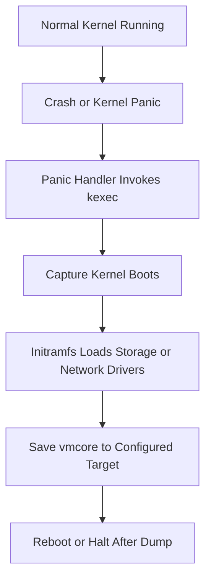
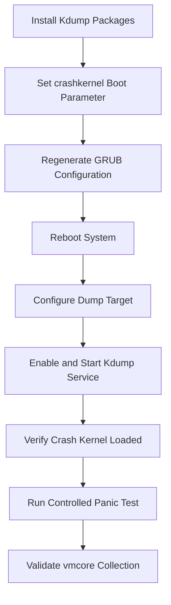
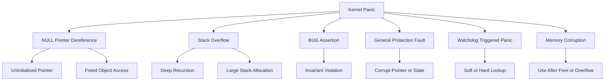
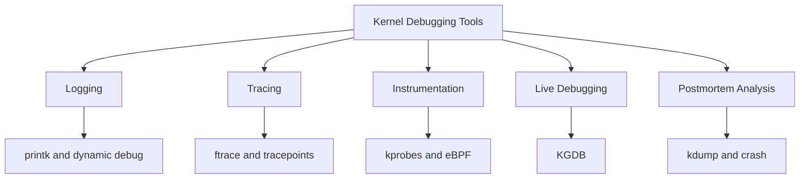
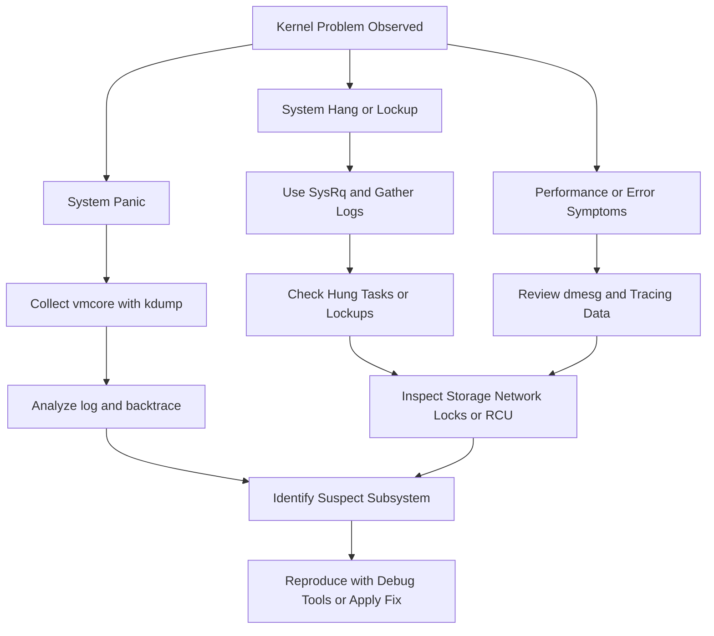
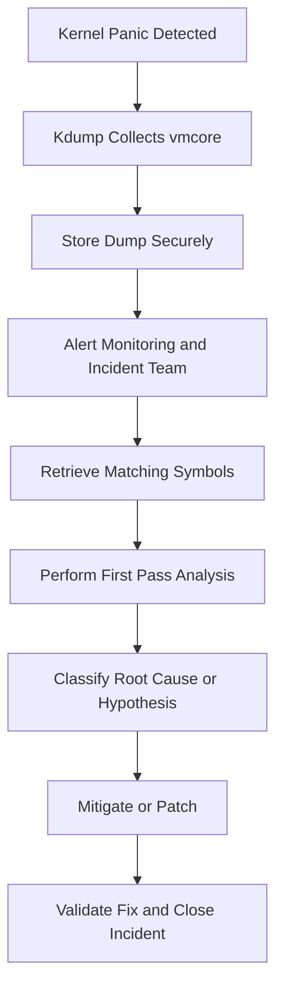

# Kdump, Crash Analysis & Kernel Debugging Guide

## Table of Contents

1. [Kdump Overview](#1-kdump-overview)
2. [Kdump Installation & Configuration](#2-kdump-installation--configuration)
3. [Crash Dump Analysis](#3-crash-dump-analysis)
4. [Kernel Panic Analysis](#4-kernel-panic-analysis)
5. [Core Dumps (Application Level)](#5-core-dumps-application-level)
6. [SysRq — Magic System Request Key](#6-sysrq--magic-system-request-key)
7. [Kernel Debugging Tools](#7-kernel-debugging-tools)
8. [SystemTap](#8-systemtap)
9. [dmesg & Kernel Logs](#9-dmesg--kernel-logs)
10. [Memory Debugging](#10-memory-debugging)
11. [Troubleshooting Kernel Issues](#11-troubleshooting-kernel-issues)
12. [Production Practices](#12-production-practices)
13. [Appendix A: Command Reference](#appendix-a-command-reference)
14. [Appendix B: Sample Files](#appendix-b-sample-files)
15. [Appendix C: Panic Signature Cheat Sheet](#appendix-c-panic-signature-cheat-sheet)
16. [Appendix D: Investigation Checklists](#appendix-d-investigation-checklists)
17. [Appendix E: Glossary](#appendix-e-glossary)

---

# 1. Kdump Overview

## 1.1 What is kdump?

Kdump is a Linux kernel crash dumping mechanism.

It captures memory from a crashed kernel and stores it as a dump file, usually called `vmcore`.

That dump can later be analyzed with tools such as `crash`, `gdb`, `makedumpfile`, `addr2line`, and `objdump`.

Kdump is critical because many serious kernel failures are transient.

After a hard crash or panic, live evidence is gone unless memory is captured immediately.

Kdump preserves the state of the kernel near the failure point.

That state often includes:

- kernel logs
- CPU register state
- process structures
- memory mappings
- loaded modules
- stacks of running tasks
- slab information
- lock state
- device driver state
- networking state

Without kdump, troubleshooting a production kernel panic often becomes guesswork.

With kdump, postmortem analysis becomes evidence-driven.

## 1.2 Why kdump is critical in production

Kdump matters in production for several reasons.

1. It reduces uncertainty after a kernel panic.
2. It shortens mean time to resolution.
3. It provides artifact-based root cause analysis.
4. It helps vendors and kernel maintainers reproduce and fix bugs.
5. It supports compliance and incident review processes.
6. It can reveal hardware-related corruption patterns.
7. It helps distinguish application failures from kernel failures.

In large fleets, a properly configured kdump setup is as important as log shipping.

A panic without a dump is often a lost incident.

A panic with a good dump is an actionable incident.

## 1.3 High-level idea

Kdump works by reserving memory for a second kernel.

This second kernel is often called the crash kernel or capture kernel.

When the main kernel panics, it uses `kexec` to boot directly into the capture kernel without going through firmware or full platform boot.

The capture kernel then saves the memory image of the crashed kernel to persistent storage.

This avoids overwriting too much of the memory you are trying to preserve.

## 1.4 Core components

The major components are:

| Component | Purpose |
|---|---|
| `crashkernel=` boot parameter | Reserves RAM for the capture kernel |
| `kexec` infrastructure | Jumps to another kernel without full reboot |
| capture kernel | Minimal kernel that runs after panic |
| initramfs for crash kernel | Includes storage/network drivers needed to save dump |
| `kdump` service/tooling | Loads the crash kernel during normal boot |
| `makedumpfile` | Filters or compresses memory dump |
| `vmcore` | Captured crash dump artifact |
| `crash` utility | Primary postmortem analysis tool |

## 1.5 Normal boot vs crash boot

During normal boot:

- the main kernel starts
- the system initializes services
- the kdump tooling loads a second kernel image into reserved memory
- the system continues serving workloads

During a crash:

- the main kernel panics
- panic path triggers `kexec`
- capture kernel starts in reserved RAM
- capture environment mounts target storage or network path
- dump is written as `vmcore`
- system can reboot automatically or stay halted based on configuration

## 1.6 Mermaid diagram: Kdump mechanism flow



## 1.7 How kdump differs from a normal reboot

A normal reboot tears down the system and restarts through firmware and bootloader.

That process is slow and destroys useful volatile memory contents.

A kexec-based crash transition is much faster.

It bypasses firmware and jumps directly into another kernel.

That speed is what makes memory capture practical.

## 1.8 Relationship between kdump and kexec

`kexec` is the mechanism.

`kdump` is the crash dump workflow built on top of that mechanism.

You can use `kexec` for fast reboots in other contexts too.

In kdump, the key use is loading a pre-prepared capture kernel and switching to it after panic.

## 1.9 Capture kernel requirements

The crash kernel must be able to:

- initialize CPU and memory sufficiently to run
- include drivers for dump target access
- have enough RAM reserved to handle dump operations
- avoid conflicting with damaged state from the original kernel
- mount filesystems or use network to save dump

If the capture kernel is too small or lacks needed drivers, kdump may fail even though panic handling begins correctly.

## 1.10 Kdump artifacts

Typical dump-related files include:

| File | Meaning |
|---|---|
| `/var/crash/.../vmcore` | raw or filtered memory image |
| `/var/crash/.../vmcore-dmesg.txt` | extracted kernel log from dump |
| `vmlinux` | uncompressed kernel image with debug symbols |
| `System.map` | symbol address table |
| `initrd` or `initramfs` | crash kernel initramfs |

## 1.11 When kdump is most useful

Kdump is especially useful for:

- kernel panics
- BUG and WARN escalation cases
- suspected memory corruption
- RCU stalls that later panic
- driver crashes
- lockups triggering watchdog panic
- machine check or fatal hardware events
- cluster nodes crashing under special workload conditions

## 1.12 When kdump may not help enough

Kdump is not always sufficient by itself.

Cases that may limit usefulness include:

- storage path unavailable during crash capture
- capture kernel missing needed driver
- memory corruption severe enough to affect capture handoff
- power loss instead of panic
- hard reset by external watchdog before dump completes
- firmware-level crashes below OS visibility

## 1.13 Kdump vs other crash dump mechanisms

### 1.13.1 Kdump vs netconsole

`netconsole` streams kernel log messages over the network.

It is lightweight and useful for early panic text.

It does not preserve full memory state.

Kdump captures much more detail.

### 1.13.2 Kdump vs pstore

`pstore` stores crash information in persistent firmware-backed storage.

It often keeps logs or small panic records.

It usually cannot store full memory images.

Kdump is much richer but needs more setup and resources.

### 1.13.3 Kdump vs firmware dump features

Some hardware or hypervisors provide dump features.

These may complement kdump.

But kdump remains the standard Linux-native software mechanism for postmortem kernel analysis.

### 1.13.4 Kdump vs application core dumps

Application core dumps capture a single process address space.

Kdump captures kernel state and system-wide context.

They solve different layers of debugging.

## 1.14 Benefits and trade-offs

| Benefit | Trade-off |
|---|---|
| Detailed postmortem evidence | Reserved memory reduces usable RAM |
| Faster root cause analysis | Setup complexity |
| Vendor supportability | Storage capacity required |
| Works on production systems | Need to test after kernel updates |
| Can compress or filter dumps | Dump may fail if config is incomplete |

## 1.15 Typical kdump workflow summary

1. Reserve memory with `crashkernel=`.
2. Install kdump tooling.
3. Configure dump target.
4. Load crash kernel at boot.
5. Trigger test panic in a safe environment.
6. Verify `vmcore` is written.
7. Analyze with `crash` and symbolized `vmlinux`.
8. Feed results into remediation or escalation workflow.

## 1.16 Terminology

| Term | Meaning |
|---|---|
| panic | unrecoverable kernel condition |
| oops | serious kernel fault, sometimes recoverable |
| vmcore | saved memory image from crashed kernel |
| crash kernel | kernel booted after panic to capture dump |
| kexec | mechanism for jumping to another kernel |
| initramfs | early userspace image used during boot |
| vmlinux | uncompressed symbol-rich kernel binary |

## 1.17 Key operational warning

Never first test kdump on a mission-critical production node.

Validate it in a staging environment or during a controlled maintenance window.

A misconfigured crashkernel reservation or broken capture path may leave the system unable to collect dumps when you need them most.

## 1.18 Minimal checklist

- confirm kernel supports kexec and crash dumping
- reserve crash memory
- install capture tooling
- configure target path
- enable service
- reboot to apply reservation if needed
- verify crash kernel loaded
- test panic in non-production
- retain matching debug symbols

---

# 2. Kdump Installation & Configuration

## 2.1 Overview

Configuration involves several layers:

- package installation
- boot parameter reservation
- capture kernel loading
- dump target selection
- initramfs driver inclusion
- service enablement
- test validation

Different distributions expose this through different tools, but the underlying concepts are the same.

## 2.2 Prerequisites

Before installation, confirm:

- supported kernel version
- enough RAM to reserve crash memory
- storage space for dumps
- access to kernel debug symbols if analysis is required
- console or remote management path for testing
- maintenance window for reboot if boot parameters change

## 2.3 General package summary

| Distribution | Common packages |
|---|---|
| Ubuntu/Debian | `linux-crashdump`, `kdump-tools`, `crash` |
| RHEL/CentOS | `kexec-tools`, `crash`, debug packages |
| SUSE | `kdump`, `kdumptool`, `crash` |

## 2.4 Ubuntu and Debian installation

On Ubuntu or Debian systems, the usual packages are `linux-crashdump` and `kdump-tools`.

Example:

```bash
sudo apt update
sudo apt install -y linux-crashdump kdump-tools crash
```

The installation may prompt for enabling kdump.

If not, it can be configured manually afterward.

## 2.5 Ubuntu and Debian configuration files

Important files include:

| File | Role |
|---|---|
| `/etc/default/kdump-tools` | main kdump-tools behavior |
| `/etc/initramfs-tools/modules` | add modules to initramfs if needed |
| `/etc/default/grub` | crashkernel boot parameter |
| `/etc/sysctl.d/*.conf` | sysrq or panic-related sysctls |

Example `/etc/default/kdump-tools` options often include:

```bash
USE_KDUMP=1
KDUMP_KERNEL=/var/lib/kdump/vmlinuz
KDUMP_INITRD=/var/lib/kdump/initrd.img
KDUMP_COREDIR="/var/crash"
KDUMP_CMDLINE_APPEND="irqpoll nr_cpus=1 reset_devices"
```

Exact contents vary by distribution release.

## 2.6 RHEL and CentOS installation

On RHEL-family systems, install `kexec-tools`.

Example:

```bash
sudo dnf install -y kexec-tools crash
```

Older releases may use `yum`:

```bash
sudo yum install -y kexec-tools crash
```

For symbolized analysis, install debuginfo packages from matching repositories.

Example conceptually:

```bash
sudo debuginfo-install kernel kernel-core kernel-modules
```

Package naming depends on release.

## 2.7 RHEL and CentOS configuration files

Common files:

| File | Role |
|---|---|
| `/etc/kdump.conf` | dump target and makedumpfile settings |
| `/etc/sysconfig/kdump` | extra options in some releases |
| `/etc/default/grub` | boot parameters |
| `/boot/grub2/grub.cfg` | generated boot config |

Sample `/etc/kdump.conf`:

```conf
path /var/crash
core_collector makedumpfile -l --message-level 1 -d 31
default reboot
```

## 2.8 SUSE installation

On SUSE Linux Enterprise or openSUSE, packages and tooling differ slightly.

Typical installation:

```bash
sudo zypper refresh
sudo zypper install -y kdump crash
```

Configuration is often managed using `kdumptool`, YaST, or config files depending on the version.

## 2.9 SUSE configuration notes

SUSE commonly uses files such as:

| File | Role |
|---|---|
| `/etc/sysconfig/kdump` | primary kdump settings |
| `/etc/default/grub` | boot parameters |
| initrd tooling | regenerate initrd after updates |

Example commands may include:

```bash
sudo systemctl enable kdump
sudo systemctl start kdump
```

Always verify against the exact release documentation because SUSE tooling conventions vary.

## 2.10 The crashkernel boot parameter

The most important boot parameter is `crashkernel=`.

It reserves memory for the capture kernel.

Without this reservation, kdump cannot boot a separate kernel reliably after panic.

Common forms include:

- `crashkernel=auto`
- `crashkernel=256M`
- `crashkernel=512M`
- `crashkernel=128M,high`
- `crashkernel=128M,low`
- `crashkernel=512M-2G:64M,2G-:128M`

## 2.11 Understanding `crashkernel=auto`

`auto` asks the distribution's tooling or kernel logic to choose a suitable reservation.

This is convenient.

However, automatic sizing may not always be enough for:

- large-memory systems
- drivers requiring extra initramfs content
- network dump targets
- storage stacks with many modules
- heavy filtering/compression needs

Production teams often prefer explicit sizing after validation.

## 2.12 Understanding fixed reservation sizes

Example:

```bash
crashkernel=256M
```

This reserves 256 MB for the crash kernel.

Whether it is enough depends on:

- CPU count
- RAM size
- drivers needed in capture initramfs
- dump target type
- kernel version
- architecture

## 2.13 High memory and low memory reservations

On some systems, especially x86_64, you may see:

```bash
crashkernel=128M,high crashkernel=64M,low
```

Or shorthand forms like:

```bash
crashkernel=128M,high
```

High memory is used for most crash kernel memory.

Low memory reservation is often needed for DMA and early boot requirements.

If low memory is insufficient, the capture kernel may fail in subtle ways.

## 2.14 Editing GRUB configuration

Typical Linux systems put boot arguments in `/etc/default/grub`.

Example:

```bash
GRUB_CMDLINE_LINUX="crashkernel=256M"
```

If other parameters are already present, append rather than replace.

Example:

```bash
GRUB_CMDLINE_LINUX="quiet splash crashkernel=256M"
```

After editing, regenerate GRUB config.

Ubuntu/Debian:

```bash
sudo update-grub
```

RHEL/CentOS BIOS systems:

```bash
sudo grub2-mkconfig -o /boot/grub2/grub.cfg
```

RHEL/CentOS UEFI systems:

```bash
sudo grub2-mkconfig -o /boot/efi/EFI/redhat/grub.cfg
```

SUSE examples vary, but commonly:

```bash
sudo grub2-mkconfig -o /boot/grub2/grub.cfg
```

## 2.15 Reboot requirement

Changes to `crashkernel=` require reboot.

You cannot reserve the crash kernel memory retroactively for the running kernel.

Plan a reboot window.

## 2.16 Verifying crashkernel reservation

After reboot, confirm reservation using:

```bash
dmesg | grep -i crashkernel
```

And:

```bash
cat /proc/cmdline
```

You can also inspect reserved memory from boot logs.

Example output may show reserved ranges or kdump status messages.

## 2.17 Starting and enabling kdump services

Ubuntu/Debian:

```bash
sudo systemctl enable kdump-tools
sudo systemctl start kdump-tools
```

RHEL/CentOS:

```bash
sudo systemctl enable kdump
sudo systemctl start kdump
```

SUSE:

```bash
sudo systemctl enable kdump
sudo systemctl start kdump
```

Check status:

```bash
systemctl status kdump
```

Or:

```bash
systemctl status kdump-tools
```

## 2.18 Verifying the crash kernel is loaded

Useful commands include:

```bash
sudo kexec -p
```

Or distro-specific service status checks.

On many systems, status output tells you whether the crash kernel is loaded.

Example:

```bash
kdumpctl status
```

Possible output:

```text
kdump: Kdump is operational
```

Or on Debian-based systems:

```text
Current state: ready to kdump
```

## 2.19 `/etc/kdump.conf` basics

This file controls where dumps go and how they are processed.

Typical directives include:

| Directive | Meaning |
|---|---|
| `path` | target directory |
| `ext4` / `xfs` / `nfs` / `ssh` | dump destination type |
| `core_collector` | dump filtering/compression command |
| `default` | post-dump action |
| `failure_action` | action when dump fails |
| `dracut_args` | initramfs customization |

## 2.20 Example local disk configuration

```conf
path /var/crash
core_collector makedumpfile -l --message-level 1 -d 31
default reboot
```

This saves dumps under `/var/crash`.

`makedumpfile` compresses and filters zero or irrelevant pages.

## 2.21 Example raw partition configuration

```conf
raw /dev/sdb1
core_collector makedumpfile -F -l --message-level 1 -d 31
default reboot
```

Raw partition targets can be faster or more reliable in some environments.

But they require careful operational handling because the dump is not simply a regular file in a mounted filesystem.

## 2.22 Example NFS target configuration

```conf
nfs 10.10.10.20:/exports/kdump
path client1
core_collector makedumpfile -l --message-level 1 -d 31
```

This is useful where local disk is limited.

You must ensure:

- network comes up in crash kernel
- NIC driver is in capture initramfs
- routing and firewall allow access
- NFS mount dependencies are minimal

## 2.23 Example SSH target configuration

```conf
ssh root@10.10.10.30
sshkey /root/.ssh/kdump_id_rsa
path /var/crash/client1
core_collector makedumpfile -F -l --message-level 1 -d 31
```

SSH targets provide encrypted transport.

They add dependency on network, authentication, and crypto in the capture environment.

Test carefully.

## 2.24 Example filesystem target directives

Some configurations specify the dump target device explicitly.

Example:

```conf
ext4 /dev/mapper/vg0-crashlv
path /dumps
```

Or:

```conf
xfs UUID=11111111-2222-3333-4444-555555555555
path /vmcores
```

The initramfs must contain the relevant filesystem and storage stack modules.

## 2.25 Choosing the right dump target

| Target | Pros | Cons |
|---|---|---|
| local filesystem | simplest | may be unavailable if local storage is broken |
| raw partition | robust, fast | harder retrieval workflow |
| NFS | central storage | depends on network |
| SSH | encrypted | more complexity in crash kernel |
| SAN/LVM volume | large dedicated space | stack complexity |

## 2.26 `makedumpfile` basics

`makedumpfile` reduces dump size by excluding unnecessary pages.

Common flags:

| Flag | Meaning |
|---|---|
| `-c` | compress dump |
| `-l` | compress with lzo-like method depending on version |
| `-d` | dump level bitmap |
| `-F` | flattened format |
| `--message-level` | verbosity |

Example:

```bash
makedumpfile -l --message-level 1 -d 31 /proc/vmcore vmcore.filtered
```

The exact set of dump levels determines what memory categories are excluded.

## 2.27 Dump level guidance

Dump level settings trade completeness against size.

If you exclude too much, later analysis may lose critical context.

For first production rollout, many teams start with a common proven value such as `-d 31` and validate whether retained data is enough.

For very tricky memory corruption bugs, consider collecting a fuller dump during controlled investigations.

## 2.28 Capture kernel command line

Many kdump setups append special arguments to the crash kernel.

Common examples include:

- `irqpoll`
- `nr_cpus=1`
- `reset_devices`
- `nousb`
- `cgroup_disable=memory`

These aim to simplify the crash environment and reduce failure risk.

Example:

```bash
KDUMP_COMMANDLINE_APPEND="irqpoll nr_cpus=1 reset_devices"
```

## 2.29 Why `nr_cpus=1` is common

It reduces complexity in the crash kernel.

The capture kernel does not need full workload performance.

It only needs enough functionality to save the dump reliably.

Reducing CPU count may avoid secondary issues during dump capture.

## 2.30 Regenerating initramfs

If you change capture kernel modules or related config, regenerate initramfs.

Ubuntu/Debian:

```bash
sudo update-initramfs -u
```

RHEL/CentOS with dracut:

```bash
sudo dracut -f
```

SUSE:

```bash
sudo dracut -f
```

Some distros regenerate the capture initramfs through their kdump tooling directly.

## 2.31 Adding missing modules

If a dump target depends on drivers not present in the crash initramfs, add them explicitly.

Examples:

- storage HBA drivers
- NVMe drivers
- RAID drivers
- network drivers
- bonding or VLAN modules
- filesystem modules
- multipath support

On Debian-based systems, `/etc/initramfs-tools/modules` may be used.

On dracut-based systems, use dracut configuration snippets.

## 2.32 Dracut-based customization example

Example file:

```conf
# /etc/dracut.conf.d/kdump.conf
add_drivers+=" ixgbe nvme xfs "
```

Then rebuild:

```bash
sudo dracut -f
```

## 2.33 Debian initramfs customization example

Example:

```text
# /etc/initramfs-tools/modules
ixgbe
nvme
xfs
```

Then rebuild:

```bash
sudo update-initramfs -u
```

## 2.34 Testing configuration before a real crash

Useful checks include:

- `cat /proc/cmdline`
- `dmesg | grep -i crash`
- service status
- kdump status command
- available target free space
- network reachability for remote target
- presence of `vmlinux` with matching symbols

## 2.35 Safe warning before test panic

A forced panic will crash the machine.

This must only be done on non-production systems or during an approved maintenance window.

Ensure there is out-of-band access if the machine fails to recover automatically.

## 2.36 Enabling SysRq for testing

A common panic test uses SysRq.

Enable it temporarily:

```bash
echo 1 | sudo tee /proc/sys/kernel/sysrq
```

Permanent configuration can be set through sysctl later.

## 2.37 Triggering a test panic

**Warning: this crashes the system immediately.**

```bash
echo c | sudo tee /proc/sysrq-trigger
```

This asks the kernel to panic intentionally.

If kdump is configured correctly:

- the kernel panics
- crash kernel boots
- vmcore is captured
- system reboots or halts based on config

## 2.38 After test panic

After the system comes back:

- inspect `/var/crash`
- verify a new timestamped crash directory exists
- confirm `vmcore` or filtered dump file is present
- inspect `vmcore-dmesg.txt`
- record capture duration and file size
- verify the dump is analyzable

## 2.39 Checking kdump logs

Useful commands:

```bash
journalctl -u kdump --no-pager
```

Or:

```bash
journalctl -u kdump-tools --no-pager
```

And system boot logs:

```bash
journalctl -k -b -1 --no-pager
```

Previous boot logs often contain panic-to-dump messages.

## 2.40 Common configuration failures

| Symptom | Possible cause |
|---|---|
| no dump produced | crash kernel not loaded |
| reboot loop after panic | broken capture kernel or boot settings |
| dump target missing | path not mounted or unavailable |
| network dump fails | driver absent in initramfs |
| capture kernel hangs | not enough reserved memory |
| service says ready but no dump | panic path blocked or watchdog reset too quickly |

## 2.41 Memory reservation sizing guidance

Sizing is environment-specific.

Broad guidelines:

- small VM with local disk target may work with 256M
- systems with complex storage/network stacks often need more
- large-memory servers may require 512M or more
- architectures and distro defaults vary

Always test rather than relying on generic minimums.

## 2.42 Secure Boot considerations

Secure Boot may affect `kexec` or signed kernel loading policies.

In secured environments, validate:

- signed kernel compatibility
- distro-supported kdump path under Secure Boot
- capture kernel/initramfs signature expectations

If crash kernel loading silently fails, Secure Boot policy may be involved.

## 2.43 Virtualized environments

Kdump works in many virtual environments.

Important considerations include:

- hypervisor reset timing
- available virtual disk in crash kernel
- network driver availability
- automatic reboot or watchdog settings
- cloud provider serial console access

Cloud instances may need special handling for persistent dump storage.

## 2.44 Bare metal environments

On bare metal, also validate:

- firmware behavior after panic
- BMC or IPMI access
- storage controller driver support
- multipath setup in crash kernel
- remote hands procedure if capture fails

## 2.45 Example end-to-end Ubuntu setup

```bash
sudo apt update
sudo apt install -y linux-crashdump kdump-tools crash
sudo sed -i 's/^GRUB_CMDLINE_LINUX=.*/GRUB_CMDLINE_LINUX="crashkernel=256M"/' /etc/default/grub
sudo update-grub
sudo systemctl enable kdump-tools
sudo reboot
```

After reboot:

```bash
systemctl status kdump-tools
cat /proc/cmdline
ls -lah /var/crash
```

## 2.46 Example end-to-end RHEL setup

```bash
sudo dnf install -y kexec-tools crash
sudo grubby --update-kernel=ALL --args="crashkernel=auto"
sudo systemctl enable kdump
sudo reboot
```

After reboot:

```bash
kdumpctl status
cat /proc/cmdline
sudo kdumpctl showmem
```

## 2.47 Example kdump configuration flow diagram



## 2.48 Example `/etc/kdump.conf` with comments

```conf
path /var/crash
core_collector makedumpfile -l --message-level 1 -d 31
default reboot
failure_action reboot
```

Interpretation:

- save under `/var/crash`
- compress and filter with `makedumpfile`
- reboot after success
- reboot even after failure

## 2.49 Example `/etc/default/kdump-tools`

```bash
USE_KDUMP=1
KDUMP_COREDIR="/var/crash"
KDUMP_CMDLINE_APPEND="irqpoll nr_cpus=1 reset_devices"
MAKEDUMP_ARGS="-l --message-level 1 -d 31"
```

Exact variables differ by release.

Treat this as a conceptual example.

## 2.50 Production validation checklist

- booted with intended `crashkernel=` value
- service enabled and active
- capture kernel loaded
- dump path writable
- enough free space for expected dump size
- debug symbols archived for exact kernel build
- panic test completed successfully
- runbook documented

---

# 3. Crash Dump Analysis

## 3.1 Overview

Collecting a dump is only half the job.

You then need to analyze it in a disciplined way.

The standard Linux tool for postmortem kernel analysis is `crash`.

It combines gdb-style symbol access with Linux kernel-specific commands.

## 3.2 Required inputs

You generally need:

- `vmcore`
- matching `vmlinux` with symbols
- sometimes relevant kernel modules with debug symbols
- system details such as kernel version and hardware context

The `vmlinux` file must match the crashed kernel build.

A mismatch can produce misleading stacks and corrupted symbol resolution.

## 3.3 Installing crash utility

Ubuntu/Debian:

```bash
sudo apt install -y crash
```

RHEL/CentOS:

```bash
sudo dnf install -y crash
```

SUSE:

```bash
sudo zypper install -y crash
```

## 3.4 Locating `vmlinux`

Depending on distro, symbol-rich images may be found in:

- `/usr/lib/debug/boot/vmlinux-*`
- `/usr/lib/debug/lib/modules/<kernel>/vmlinux`
- debuginfo package locations
- manually archived build outputs

## 3.5 Opening a vmcore

Basic syntax:

```bash
crash /usr/lib/debug/lib/modules/$(uname -r)/vmlinux /var/crash/2024-01-01-12:00/vmcore
```

Or with explicit versioned path:

```bash
crash /usr/lib/debug/boot/vmlinux-5.14.0-427.el9.x86_64 /var/crash/127.0.0.1-2024-01-01-12:00/vmcore
```

## 3.6 Initial crash session checklist

When `crash` opens, gather:

- system summary
- panic message
- backtrace of crashing task
- full log buffer
- task list
- module list
- suspect memory state

Good first commands are:

```text
sys
log
bt
ps
mod
```

## 3.7 Essential `crash` command: `sys`

`sys` prints general system information.

It typically includes:

- hostname
- kernel release
- machine type
- panic string
- dumpfile info
- CPU count
- uptime

Example:

```text
crash> sys
      KERNEL: /usr/lib/debug/lib/modules/5.14.0/vmlinux
    DUMPFILE: /var/crash/vmcore
        CPUS: 16
        DATE: Tue Jan  2 08:20:31 UTC 2024
      UPTIME: 12 days, 03:12:11
LOAD AVERAGE: 2.11, 1.98, 2.03
       TASKS: 1043
    NODENAME: db-node-01
     RELEASE: 5.14.0-427.el9.x86_64
     VERSION: #1 SMP PREEMPT_DYNAMIC
     MACHINE: x86_64  (2900 Mhz)
      MEMORY: 64 GB
       PANIC: "Kernel panic - not syncing: Fatal exception"
```

## 3.8 Essential `crash` command: `log`

`log` displays kernel log buffer captured in the dump.

This is often the fastest way to spot:

- panic string
- oops text
- watchdog messages
- RCU stall warnings
- filesystem corruption messages
- machine check reports

Example:

```text
crash> log
```

Use it early.

## 3.9 Essential `crash` command: `bt`

`bt` prints backtrace for the current context.

This is crucial for identifying where panic occurred.

Example:

```text
crash> bt
```

Useful variations:

```text
crash> bt -a
crash> bt -f
crash> bt <pid>
```

Meaning:

- `-a` backtrace all tasks or CPUs depending on context/version
- `-f` show full stack data
- `<pid>` inspect a specific task

## 3.10 Reading a backtrace

A good backtrace review asks:

- what function faulted?
- what function called it?
- what lock or subsystem was active?
- was it process context, interrupt context, or softirq?
- is the fault in core kernel or a module?
- is stack corrupted?

## 3.11 Essential `crash` command: `ps`

`ps` shows tasks in the system.

Example:

```text
crash> ps
```

Useful variants:

```text
crash> ps -m
crash> ps -G
crash> ps | grep D
```

This helps identify:

- blocked tasks
- runaway processes
- kernel threads
- panicing task PID
- tasks stuck in uninterruptible sleep

## 3.12 Essential `crash` command: `vm`

`vm` shows memory usage and virtual memory state.

Example:

```text
crash> vm
```

This helps investigate:

- memory pressure
- OOM scenarios
- page statistics
- swap state
- huge page use

## 3.13 Essential `crash` command: `files`

`files` lists open file information for a task.

Example:

```text
crash> files 1234
```

Use this when a process-related kernel bug may depend on specific files, sockets, or devices.

## 3.14 Essential `crash` command: `net`

`net` displays network subsystem state.

Example:

```text
crash> net
```

This can reveal:

- socket state
- interfaces
- routing data depending on version/support
- connections related to a stuck workload

## 3.15 Essential `crash` command: `mod`

`mod` lists loaded modules.

Example:

```text
crash> mod
```

Use this to identify:

- third-party modules
- suspect drivers
- module load addresses
- whether a crash address lands inside a module region

## 3.16 Essential `crash` command: `struct`

`struct` decodes kernel structures using symbols.

Example:

```text
crash> struct task_struct ffff888012345000
```

Or inspect a field:

```text
crash> struct task_struct.pid,comm,state ffff888012345000
```

This is one of the most powerful commands for deep kernel debugging.

## 3.17 Essential `crash` command: `dis`

`dis` disassembles code around an address or symbol.

Example:

```text
crash> dis panic
crash> dis -l do_page_fault
crash> dis ffffffffa0123456
```

This is useful when a faulting RIP points inside a function and you need instruction context.

## 3.18 Essential `crash` command: `rd`

`rd` reads raw memory.

Example:

```text
crash> rd ffff888012345000 16
```

This is lower-level and mainly useful when interpreting data structures, pointers, or corrupted memory.

## 3.19 Other high-value commands

| Command | Use |
|---|---|
| `help` | command help |
| `set` | session settings |
| `kmem` | slab/page allocator inspection |
| `mount` | mounted filesystems |
| `dev` | devices |
| `irq` | interrupt info |
| `runq` | run queue state |
| `pte` | page table entries |
| `search` | memory search |
| `foreach` | iterate over tasks or objects |

## 3.20 Typical first 10 minutes in `crash`

1. run `sys`
2. run `log`
3. run `bt`
4. identify panicing task or CPU
5. run `ps`
6. inspect modules with `mod`
7. inspect suspect structure with `struct`
8. disassemble fault location with `dis -l`
9. correlate with source and symbols
10. write down a hypothesis before exploring edge cases

## 3.21 Finding root cause from a crash dump

A disciplined root cause process usually looks like this:

1. Confirm panic type.
2. Identify faulting instruction and call chain.
3. Determine subsystem involved.
4. Determine whether the fault is deterministic or secondary fallout.
5. Check logs for earlier warnings before the final panic.
6. Look for taint flags or third-party modules.
7. Correlate addresses with source lines.
8. Check whether memory corruption is likely.
9. Compare with known bugs or fixed commits.
10. Document evidence and confidence level.

## 3.22 Panic vs consequence

The top of the stack is not always the root cause.

For example:

- watchdog panic may occur after long lockup caused elsewhere
- panic in slab allocator may stem from earlier use-after-free
- filesystem fault may be secondary to memory corruption

Always scan logs and other task stacks for earlier indicators.

## 3.23 Understanding taint flags

Kernel taint flags indicate non-standard conditions such as:

- proprietary modules loaded
- forced module load
- machine check occurred
- kernel warning happened
- externally built modules present

In `crash` or logs, note taint status because it influences supportability and suspicion.

## 3.24 Example analysis: NULL pointer dereference

Suppose the log shows:

```text
BUG: kernel NULL pointer dereference, address: 0000000000000018
RIP: 0010:my_driver_handle_event+0x2a/0x80 [my_driver]
```

A likely workflow:

1. run `log` and capture full oops
2. run `mod` and confirm `my_driver`
3. use `bt` on current task
4. use `dis -l my_driver_handle_event`
5. inspect source line with matching debuginfo
6. inspect structure pointer arguments if recoverable
7. determine whether object was NULL or freed

## 3.25 Example analysis: soft lockup leading to panic

Suppose the log shows repeated watchdog lines.

Workflow:

1. run `log` and identify stuck CPU
2. run `bt -a`
3. inspect stack on stuck CPU
4. inspect lock ownership if possible
5. check if stack loops in spinlock or interrupt-disabled region
6. check for driver or filesystem hot path

## 3.26 Example analysis: slab corruption panic

Symptoms may include:

- `list_del corruption`
- `slub` assertions
- invalid freelist pointer
- page allocation metadata damage

Workflow:

1. capture exact corruption message from `log`
2. inspect involved cache with `kmem`
3. inspect nearby objects or suspect structures
4. check recent kernel warnings before panic
5. consider use-after-free or overflow patterns
6. enable KASAN or slub debugging in reproduction environment

## 3.27 Example analysis: page fault in filesystem path

Possible symptoms:

- panic in `xfs_*` or `ext4_*` function
- page fault during I/O completion
- metadata corruption messages in log

Workflow:

1. verify whether filesystem corruption preceded panic
2. inspect stack for transaction or reclaim context
3. correlate with block device errors
4. check if memory corruption could have corrupted filesystem structures in RAM
5. examine loaded storage controller modules

## 3.28 Example analysis: networking crash

Possible clues:

- panic in `skb_*`, `napi_*`, NIC driver, GRO, or TCP path
- heavy network load on affected node
- log lines around DMA or reset failures

Workflow:

1. inspect `log`
2. inspect `bt`
3. inspect `net`
4. inspect NIC module via `mod`
5. inspect ring or device structure with `struct` if symbols are available

## 3.29 Using source correlation tools outside `crash`

After identifying a function and offset, use:

```bash
addr2line -e vmlinux 0xffffffff81012345
objdump -dS vmlinux | less
nm -n vmlinux | grep symbol_name
```

These help map addresses and instructions back to source.

## 3.30 `crash` session example

```text
$ crash vmlinux vmcore
crash> sys
crash> log
crash> bt
crash> mod
crash> ps | grep myservice
crash> struct task_struct ffff8881034e8000
crash> dis -l my_driver_handle_event
crash> quit
```

## 3.31 Working with modules

For module-related crashes, ensure module debug symbols match too.

Otherwise, offsets may be hard to interpret.

Useful steps:

- note module load base from `mod`
- calculate symbol offset if necessary
- obtain debuginfo for that module version

## 3.32 Looking at all task backtraces

`bt -a` is often invaluable.

You may discover:

- system-wide lock contention
- many tasks blocked on same mutex
- deadlocked worker threads
- I/O congestion patterns
- RCU grace period blockers

## 3.33 Investigating deadlocks

Signs of deadlock may include:

- many tasks in `D` state
- lockdep warning before panic
- watchdog panic on stuck CPU
- two or more threads holding opposite locks

Use combined evidence from:

- `log`
- `ps`
- `bt -a`
- lock-related structs if accessible

## 3.34 Inspecting a task structure

Example:

```text
crash> ps | grep myservice
  PID    PPID  CPU       TASK        ST  %MEM     VSZ    RSS  COMM
 1234    1     6  ffff8881034e8000   IN   0.1  100000  15000 myservice
crash> struct task_struct.pid,comm,state,stack ffff8881034e8000
```

This can help tie a task to stack, state, and scheduling context.

## 3.35 Inspecting files for a task

Example:

```text
crash> files 1234
```

Questions to ask:

- Is the task blocked on a device file?
- Is a socket involved?
- Is the file descriptor table corrupted?

## 3.36 Memory analysis with `kmem`

`kmem` can show page allocator and slab state.

Example:

```text
crash> kmem -i
crash> kmem -s
```

Potential use cases:

- slab growth anomalies
- memory exhaustion
- corrupted caches
- page ownership investigations depending on version/features

## 3.37 Reading registers from oops text

The log may contain register dumps.

These often matter more than people think.

For example:

- `RIP` shows fault instruction pointer
- `RSP` stack pointer
- `RAX`, `RBX`, etc. may hold structure pointers
- `CR2` on x86 often indicates faulting address for page faults

## 3.38 Using `dis -l` around RIP

If the oops says:

```text
RIP: 0010:my_func+0x2a/0x90
```

Run:

```text
crash> dis -l my_func
```

Then identify the instruction at offset `+0x2a`.

This often reveals whether the fault was:

- dereferencing pointer field
- copying to bad address
- using NULL structure member
- executing in corrupted code path

## 3.39 Common evidence bundle to save

During investigation, capture:

- `sys`
- `log`
- `bt`
- `bt -a`
- `ps`
- `mod`
- any key `struct` dumps
- disassembly around fault point
- kernel version and config

This bundle helps escalation to vendors or maintainers.

## 3.40 Reproducibility and confidence levels

Not every dump yields absolute proof.

Useful confidence labels:

| Level | Meaning |
|---|---|
| confirmed | direct evidence of defect location |
| strong suspicion | evidence strongly points to component |
| possible | multiple hypotheses remain |
| inconclusive | dump too damaged or incomplete |

## 3.41 Common pitfalls in dump analysis

- using wrong `vmlinux`
- ignoring earlier warnings in `log`
- focusing only on panic thread
- misreading secondary crash as root cause
- forgetting third-party module taint
- analyzing filtered dump that omitted needed data

## 3.42 Real-world style example 1: driver use-after-free suspicion

Observed symptoms:

- panic in network driver Tx cleanup
- invalid pointer dereference
- prior warnings around reset path

Analysis path:

1. `log` shows warning before panic during interface flap.
2. `bt` shows crash in cleanup function.
3. `mod` confirms out-of-tree driver version.
4. `dis -l` shows dereference of freed ring buffer pointer.
5. internal driver structure inspection shows inconsistent ownership.
6. conclusion: likely race between device reset and cleanup path.

Recommended next steps:

- compare against upstream fixes
- reproduce with debug kernel
- enable KASAN in lab if possible

## 3.43 Real-world style example 2: ext4 panic after storage errors

Observed symptoms:

- panic inside ext4 journal path
- prior block layer I/O errors
- controller timeout messages before panic

Analysis path:

1. `log` reveals many disk timeout events before ext4 failure.
2. `bt` shows filesystem transaction code in panic path.
3. module list shows storage HBA driver at known problematic version.
4. conclusion: filesystem panic is likely consequence of storage subsystem failure.

## 3.44 Real-world style example 3: watchdog panic due to CPU soft lockup

Observed symptoms:

- `watchdog: BUG: soft lockup`
- later panic configured on lockup

Analysis path:

1. `bt -a` reveals one CPU spinning in `spin_lock` path.
2. several tasks blocked behind I/O completion.
3. suspect module holds lock in interrupt-disabled region.
4. conclusion: root cause likely lock inversion or long critical section in driver path.

## 3.45 Practical incident template

Use a template like this:

| Field | Example |
|---|---|
| node | db-node-01 |
| kernel | 5.14.0-427.el9.x86_64 |
| panic time | 2024-01-02 08:20 UTC |
| panic string | Fatal exception |
| suspected subsystem | network driver |
| faulting function | `my_driver_handle_event+0x2a` |
| root cause confidence | strong suspicion |
| supporting evidence | log, bt, disassembly, taint |
| remediation | upgrade driver, reproduce in lab |

## 3.46 Recommended learning habit

Practice analysis on known-good test dumps.

Analysts improve quickly when they repeatedly inspect:

- panic strings
- backtraces
- task states
- common structures
- allocator state

Muscle memory with `crash` matters during real incidents.

---

# 4. Kernel Panic Analysis

## 4.1 What is a kernel panic?

A kernel panic is a fatal state from which the kernel decides it cannot safely continue.

The system typically halts, reboots, or triggers kdump depending on configuration.

A panic may result directly from a fatal exception or be intentionally invoked after a serious condition such as watchdog lockup.

## 4.2 Panic vs oops vs warning

| Event | Severity | Can system continue? |
|---|---|---|
| warning | lower | usually yes |
| oops | serious | sometimes |
| panic | fatal | no |

A kernel oops may not always panic immediately.

Some environments configure `panic_on_oops=1`, converting oopses into panics.

## 4.3 Common kernel panic types

- NULL pointer dereference
- invalid memory access
- stack overflow
- BUG assertion failure
- general protection fault
- divide by zero
- machine check fatal event
- double fault
- spinlock or scheduling invariant violation
- watchdog-triggered panic
- out-of-memory panic if configured

## 4.4 NULL pointer dereference

This is one of the most common bug classes.

Typical signs:

- address close to zero
- function offset near a structure member access
- `CR2` or fault address like `0x18`, `0x20`, `0x8`

These often correspond to dereferencing a NULL base pointer plus field offset.

## 4.5 Stack overflow

Kernel stacks are limited.

Deep recursion, excessive on-stack allocation, or pathological call chains can overflow the stack.

Symptoms may include:

- corrupt backtrace
n- `kernel stack overflow`
- strange return addresses
- double fault on x86

## 4.6 BUG() and BUG_ON()

`BUG()` and `BUG_ON()` force a fatal kernel failure when an invariant is violated.

They indicate the kernel reached a state the developer considered impossible or unrecoverable.

Modern kernels prefer warnings in some paths, but BUGs still exist.

## 4.7 General protection fault

On x86, a general protection fault can occur due to:

- invalid segment or access rules
- corrupted pointers
- executing invalid memory patterns
- stack corruption
- misuse of kernel/user address boundaries

## 4.8 Use-after-free and corruption panics

Memory corruption may not panic immediately.

The actual panic may happen later in allocator, list manipulation, or unrelated subsystem code.

Look for earlier warnings or inconsistent metadata.

## 4.9 Watchdog-triggered panic

Soft lockups, hard lockups, or hung tasks may be configured to panic.

This helps capture dumps instead of leaving a node frozen indefinitely.

The panic reason then reflects the watchdog policy rather than the first underlying bug.

## 4.10 Reading kernel oops messages

An oops message usually includes:

- bug description
- fault address
- CPU number
- PID and task name
- taint flags
- register dump
- call trace
- code bytes around RIP
- loaded modules list

## 4.11 Example oops snippet

```text
BUG: kernel NULL pointer dereference, address: 0000000000000018
#PF: supervisor read access in kernel mode
#PF: error_code(0x0000) - not-present page
PGD 0 P4D 0
Oops: 0000 [#1] SMP PTI
CPU: 3 PID: 2145 Comm: kworker/3:1 Tainted: G OE
RIP: 0010:my_driver_handle_event+0x2a/0x80 [my_driver]
Call Trace:
 process_one_work
 worker_thread
 kthread
 ret_from_fork
```

## 4.12 Important oops fields

| Field | Meaning |
|---|---|
| `BUG:` or exception line | class of failure |
| `address` or `CR2` | faulting memory address |
| `CPU` | processor that faulted |
| `PID` | current task |
| `Comm` | task command name |
| `Tainted` | kernel taint state |
| `RIP` or `PC` | instruction pointer |
| `Call Trace` | stack trace |
| `Code` | machine code bytes around fault |

## 4.13 Decoding call traces

A call trace lists functions from current frame outward.

Typical interpretation pattern:

- top frame is current function near crash
- next frames show caller chain
- bottom frames show thread entry or interrupt entry

Ask:

- is top frame the real bug site?
- is there recursion?
- is the stack normal for this task type?
- does the stack cross subsystem boundaries unexpectedly?

## 4.14 User context vs interrupt context

Not all stacks originate from a normal process.

A panic can happen in:

- process context
- softirq context
- hardirq context
- NMI context
- worker thread
- interrupt handler

Recognizing context is important because valid operations differ by context.

## 4.15 Decoding addresses with `addr2line`

Example:

```bash
addr2line -e /usr/lib/debug/boot/vmlinux-5.14.0-427.el9.x86_64 0xffffffff81012345
```

This maps an address to source file and line, assuming symbols match.

For module addresses, use the module debug object when appropriate.

## 4.16 Using `objdump`

Example:

```bash
objdump -dS /usr/lib/debug/boot/vmlinux-5.14.0-427.el9.x86_64 | less
```

This shows mixed source and assembly if debug info is present.

Useful for understanding exact faulting instruction.

## 4.17 Using `nm`

Example:

```bash
nm -n /usr/lib/debug/boot/vmlinux-5.14.0-427.el9.x86_64 | grep my_symbol
```

This helps when matching raw addresses to nearest symbols.

## 4.18 Panic sysctls worth knowing

| Sysctl | Meaning |
|---|---|
| `kernel.panic` | reboot delay after panic |
| `kernel.panic_on_oops` | panic after oops |
| `kernel.softlockup_panic` | panic on soft lockup |
| `kernel.hardlockup_panic` | panic on hard lockup |
| `kernel.hung_task_panic` | panic on hung task |
| `vm.panic_on_oom` | panic on OOM |

## 4.19 Example sysctl configuration

```conf
kernel.panic = 10
kernel.panic_on_oops = 1
kernel.softlockup_panic = 1
kernel.hardlockup_panic = 1
kernel.hung_task_panic = 0
vm.panic_on_oom = 0
```

Interpret cautiously.

A more aggressive panic policy increases dump capture opportunities but may reduce availability.

## 4.20 Panic strings and what they imply

| Panic string | Typical implication |
|---|---|
| `Kernel panic - not syncing: Fatal exception` | unrecoverable exception |
| `Kernel panic - not syncing: hung_task: blocked tasks` | panic configured on hung task |
| `Kernel panic - not syncing: softlockup` | watchdog-triggered panic |
| `Attempted to kill init!` | PID 1 died or could not continue |
| `Out of memory and no killable processes...` | fatal memory exhaustion |

## 4.21 Call trace reading tips

- look for first non-generic function above panic handlers
- ignore frames like `panic`, `oops_end`, `exc_page_fault` until you reach subsystem-specific code
- check whether trace is trustworthy or corrupted
- note module tags such as `[my_driver]`

## 4.22 Common x86 panic clues

| Clue | Interpretation |
|---|---|
| `CR2` near zero | NULL dereference likely |
| `RIP` in module range | driver/module crash |
| `double fault` | stack overflow or severe corruption |
| `invalid opcode` | BUG trap or corrupted code |
| `general protection fault` | memory corruption or bad pointer |

## 4.23 ARM and other architectures

Architecture-specific register names differ.

For example, ARM64 logs may show:

- `PC`
- `LR`
- `SP`
- `x0` to `x30`
- ESR syndrome information

The same analytical approach still applies.

## 4.24 Kernel panic types and causes diagram



## 4.25 Panic handling operational note

Do not rely only on screenshots or console snippets.

Those are useful, but the `vmcore` and full log buffer matter far more.

Capture both when possible.

## 4.26 Why previous warnings matter

Many panics are preceded by warnings minutes or hours earlier.

Examples:

- `workqueue lockup`
- DMA timeout
- RCU stall warnings
- memory allocation warnings
- filesystem checksum errors

These earlier messages often identify the real origin.

## 4.27 Panics from init failure

`Attempted to kill init!` is especially severe.

If PID 1 dies or cannot continue, the kernel panics because the system cannot function normally.

Investigate:

- userspace corruption
- root filesystem failure
- missing libraries
- initramfs or early boot issues
- kernel bug killing init indirectly

## 4.28 Panics from machine check

Machine check or ECC-related fatal errors may implicate hardware.

Look for:

- MCE logs
- EDAC messages
- corrected errors escalating over time
- DIMM, CPU, or motherboard suspicion

Even here, kdump helps preserve evidence.

## 4.29 Stack trace corruption signs

Be cautious if you see:

- impossible return addresses
- repeated nonsense frames
- addresses outside valid kernel range
- abrupt trace termination
- mismatch between code bytes and symbol location

This may indicate stack corruption, unwinder limits, or incorrect symbols.

## 4.30 Triage questions for any panic

- what exactly panicked?
- what faulted first?
- what subsystem owns the faulting code?
- was the kernel tainted?
- were there earlier warnings?
- is hardware implicated?
- is there a known fix in newer kernel or driver version?

## 4.31 Practical example: call trace interpretation

Trace:

```text
panic
oops_end
no_context
__bad_area_nosemaphore
bad_area_nosemaphore
do_kern_addr_fault
exc_page_fault
my_driver_handle_event [my_driver]
my_driver_poll [my_driver]
net_rx_action
__do_softirq
```

Interpretation:

- generic exception handling frames are not the root cause
- relevant subsystem-specific frame begins at `my_driver_handle_event`
- likely crash happened during network receive processing in softirq context

## 4.32 Practical example: BUG trace interpretation

Trace:

```text
invalid_op
asm_exc_invalid_op
BUG
ext4_handle_dirty_metadata
ext4_mark_inode_dirty
```

Interpretation:

- invalid opcode may reflect a BUG trap
- root cause is likely the ext4 invariant failure, not the generic opcode handler

## 4.33 Building a panic timeline

A good timeline often includes:

- earliest warning observed
- first user-visible symptom
- moment of lockup or degraded service
- exact panic time
- dump capture time
- reboot complete time

This helps tie panic analysis to operational impact.

## 4.34 Incident escalation package

Provide to vendors or maintainers:

- panic text
- `vmcore`
- matching `vmlinux`
- workload description
- reproduction hints
- hardware details
- whether issue is repeatable
- recent changes before incident

---

# 5. Core Dumps (Application Level)

## 5.1 Overview

Application core dumps are different from kernel dumps.

They capture a user-space process memory image when the process crashes.

These are analyzed with `gdb` or similar tools.

Use core dumps when the problem is in an application, shared library, or runtime rather than the kernel.

## 5.2 Core dump prerequisites

The kernel must permit dump generation.

The process or service environment must not suppress it.

Common requirements:

- `ulimit -c` not zero
- valid `core_pattern`
- writable target path or coredump handler
- service manager not restricting dumps

## 5.3 Checking current core size limit

```bash
ulimit -c
```

Typical output:

- `0` means disabled
- `unlimited` means enabled without size cap

## 5.4 Temporarily enabling core dumps

```bash
ulimit -c unlimited
```

This affects the current shell and child processes.

## 5.5 Persistent core limit settings

Options include:

- `/etc/security/limits.conf`
- systemd service limits
- shell startup files for specific contexts

Example:

```conf
* soft core unlimited
* hard core unlimited
```

## 5.6 `core_pattern`

The kernel uses `/proc/sys/kernel/core_pattern` to determine how core dumps are named or handled.

Show current value:

```bash
cat /proc/sys/kernel/core_pattern
```

Example simple pattern:

```text
core.%e.%p.%t
```

## 5.7 Setting core dump path and naming

Example:

```bash
echo '/var/coredumps/core.%e.%p.%t' | sudo tee /proc/sys/kernel/core_pattern
```

This stores core files under `/var/coredumps` with executable name, PID, and timestamp.

## 5.8 Useful `core_pattern` tokens

| Token | Meaning |
|---|---|
| `%e` | executable name |
| `%p` | PID |
| `%t` | UNIX timestamp |
| `%h` | hostname |
| `%u` | uid |
| `%g` | gid |
| `%s` | signal number |

## 5.9 Persistent sysctl configuration

Example file:

```conf
# /etc/sysctl.d/99-coredump.conf
kernel.core_pattern=/var/coredumps/core.%e.%p.%t
```

Apply with:

```bash
sudo sysctl --system
```

## 5.10 systemd-coredump overview

Many modern distributions route core dumps through `systemd-coredump`.

This means `core_pattern` may point to a pipe handler instead of a plain file path.

Example value:

```text
|/usr/lib/systemd/systemd-coredump %P %u %g %s %t %e
```

In this model, dumps are indexed and managed by systemd tooling.

## 5.11 Using `coredumpctl`

List dumps:

```bash
coredumpctl list
```

Show metadata for latest dump:

```bash
coredumpctl info
```

Debug latest dump directly in gdb:

```bash
coredumpctl gdb
```

Debug dump for specific executable:

```bash
coredumpctl gdb /usr/bin/myapp
```

## 5.12 Example `coredumpctl list` output

```text
TIME                            PID  UID  GID SIG COREFILE EXE
Tue 2024-01-02 10:00:00 UTC    4242 1000 1000 11 present  /usr/local/bin/myapp
```

## 5.13 GDB basics for core analysis

Open a binary with its core:

```bash
gdb /usr/local/bin/myapp /var/coredumps/core.myapp.4242.1704189600
```

If using systemd-coredump, `coredumpctl gdb` is often easier.

## 5.14 Essential GDB commands

| Command | Purpose |
|---|---|
| `bt` | backtrace |
| `thread apply all bt` | backtrace all threads |
| `info threads` | list threads |
| `info registers` | CPU register state |
| `frame N` | switch stack frame |
| `print var` | inspect variable |
| `x/16gx addr` | inspect memory |
| `disassemble` | show instructions |

## 5.15 Example GDB session

```text
(gdb) bt
(gdb) info threads
(gdb) thread apply all bt
(gdb) frame 2
(gdb) info locals
(gdb) print my_ptr
(gdb) info registers
```

## 5.16 What to inspect in an application core

- crashing thread backtrace
- all thread backtraces
- signal that triggered crash
- local variables in faulting frame
- heap pointers and object lifetimes
- shared library versions
- whether optimized-out variables limit analysis

## 5.17 Compiling for usable cores

For in-house binaries, build with debug symbols.

Example:

```bash
gcc -g -O0 -o app app.c
```

In production, you may use optimized builds plus split debug symbol packages.

## 5.18 Stripped binaries and separate debuginfo

A stripped production binary is common.

That is fine if separate debuginfo is available.

Without it, backtraces may be far less useful.

## 5.19 Generating a core dump on demand with `gcore`

`gcore` can dump a running process without crashing it.

Example:

```bash
gcore -o core.snapshot 4242
```

This is useful for investigating a hung or misbehaving process.

## 5.20 Signals that generate core dumps

Common signals include:

- `SIGSEGV`
- `SIGABRT`
- `SIGILL`
- `SIGFPE`
- `SIGBUS`
- sometimes `SIGQUIT` depending on handler behavior

## 5.21 Example forced core with abort

A process calling `abort()` typically generates `SIGABRT` and a core dump if enabled.

This is useful for assertion failures in applications.

## 5.22 Core dump security considerations

Core dumps may contain:

- credentials
- secrets in memory
- customer data
- encryption keys
- tokens

Protect storage, retention, access, and transfer paths accordingly.

## 5.23 systemd service configuration example

A service may need:

```ini
[Service]
LimitCORE=infinity
```

Then reload and restart the service.

## 5.24 Debugging containerized applications

Core dump behavior in containers depends on:

- runtime configuration
- ulimits
- namespace setup
- writable storage path
- host `core_pattern`

Container core dump collection often needs special design.

## 5.25 Distinguishing application vs kernel failure

Use this simple rule:

- application exits with signal and core file: user-space crash
- system panics or reboots: likely kernel or hardware-level failure

Sometimes both occur in sequence, so correlate timestamps carefully.

---

# 6. SysRq — Magic System Request Key

## 6.1 What is SysRq?

Magic SysRq is a low-level Linux emergency command interface.

It can trigger special kernel actions even when the system is partly hung.

It is especially useful for:

- safe emergency reboot sequences
- forcing sync
- remounting read-only
- collecting state
- triggering panic for kdump tests

## 6.2 Enabling SysRq

Check current value:

```bash
cat /proc/sys/kernel/sysrq
```

Enable all functions temporarily:

```bash
echo 1 | sudo tee /proc/sys/kernel/sysrq
```

Disable:

```bash
echo 0 | sudo tee /proc/sys/kernel/sysrq
```

## 6.3 Persistent SysRq configuration

Example sysctl file:

```conf
# /etc/sysctl.d/99-sysrq.conf
kernel.sysrq = 1
```

Apply:

```bash
sudo sysctl --system
```

## 6.4 Numeric SysRq mask values

Some kernels use bitmasks allowing only selected functions.

Example values vary by kernel documentation.

A common operational pattern is:

- `0` disabled
- `1` enabled all functions
- controlled mask for limited features in hardened environments

## 6.5 Triggering SysRq via `/proc/sysrq-trigger`

Example:

```bash
echo t | sudo tee /proc/sysrq-trigger
```

This triggers the `t` SysRq action, which dumps task backtraces to kernel log.

## 6.6 Important SysRq commands

| Key | Meaning |
|---|---|
| `b` | immediate reboot without sync |
| `c` | trigger crash/panic |
| `e` | send SIGTERM to all processes except init |
| `f` | invoke OOM killer |
| `h` | help |
| `i` | send SIGKILL to all processes except init |
| `l` | dump backtrace for all active CPUs |
| `m` | dump memory info |
| `o` | power off |
| `p` | dump registers/current flags |
| `r` | switch keyboard from raw to XLATE |
| `s` | sync disks |
| `t` | dump task lists/backtraces |
| `u` | remount filesystems read-only |
| `w` | dump blocked tasks |

Kernel support can vary somewhat by version and architecture.

## 6.7 The REISUB sequence

`REISUB` is a mnemonic for safer emergency reboot.

It commonly means:

- `R` unraw keyboard
- `E` terminate processes
- `I` kill processes
- `S` sync disks
- `U` remount read-only
- `B` reboot

This is better than hard power cycling when the system is partially responsive.

## 6.8 REISUB explained step by step

### R

Take keyboard out of raw mode.

### E

Try graceful termination first.

### I

Kill remaining processes if needed.

### S

Flush buffered writes to disk.

### U

Remount filesystems read-only to reduce corruption risk.

### B

Reboot immediately.

## 6.9 Using SysRq for debugging

Useful debug actions include:

- `t` dump current tasks
- `w` dump blocked tasks
- `m` dump memory info
- `l` dump stacks on all CPUs
- `p` dump registers

These can be invaluable before forcing a reboot.

## 6.10 Example: gather evidence from a hung system

```bash
echo w | sudo tee /proc/sysrq-trigger
echo t | sudo tee /proc/sysrq-trigger
echo m | sudo tee /proc/sysrq-trigger
journalctl -k --since "5 min ago" --no-pager
```

If the system still responds enough to log these, you may capture crucial evidence.

## 6.11 Example: controlled panic for kdump test

```bash
echo 1 | sudo tee /proc/sys/kernel/sysrq
echo c | sudo tee /proc/sysrq-trigger
```

Use only on test systems or during maintenance.

## 6.12 Example: safer emergency reboot

```bash
echo s | sudo tee /proc/sysrq-trigger
echo u | sudo tee /proc/sysrq-trigger
echo b | sudo tee /proc/sysrq-trigger
```

This is not as graceful as a normal reboot but may be safer than a hard reset.

## 6.13 Security considerations

SysRq can be very powerful.

Enabling it broadly may not fit locked-down environments.

Consider:

- who can write to `/proc/sysrq-trigger`
- whether console access is restricted
- whether only limited SysRq masks are appropriate

## 6.14 Operational caution

`b` and `o` do not perform a normal shutdown sequence.

They can still cause data loss.

Prefer `s` and `u` first if possible.

## 6.15 SysRq in virtual consoles

Traditionally, SysRq key combos can be sent from a physical keyboard.

On remote or headless systems, `/proc/sysrq-trigger` is often more practical.

---

# 7. Kernel Debugging Tools

## 7.1 Overview

Linux kernel debugging spans multiple layers.

Some tools are lightweight and production-safe.

Others are invasive and better suited to labs.

You should choose the minimum tool that answers the question.

## 7.2 Tool categories

| Category | Examples |
|---|---|
| logging | `printk`, `dynamic_debug`, `dmesg` |
| tracing | `ftrace`, tracepoints, perf |
| instrumentation | kprobes, kretprobes, eBPF |
| live debugging | KGDB |
| postmortem | kdump, `crash` |
| scripting | SystemTap, bpftrace |

## 7.3 `printk`

`printk` is the kernel's core logging mechanism.

It prints messages to the kernel log buffer.

Example levels include:

- `KERN_EMERG`
- `KERN_ALERT`
- `KERN_CRIT`
- `KERN_ERR`
- `KERN_WARNING`
- `KERN_NOTICE`
- `KERN_INFO`
- `KERN_DEBUG`

Example code:

```c
printk(KERN_ERR "my_driver: failed to init queue\n");
```

## 7.4 `pr_*` macros

Modern kernel code often uses convenience macros:

```c
pr_info("driver loaded\n");
pr_err("allocation failed\n");
pr_debug("x=%d\n", x);
```

These are cleaner than raw `printk` in many cases.

## 7.5 Dynamic debug

Dynamic debug lets you enable certain debug prints at runtime without rebuilding the kernel.

This is especially useful for selectively verbose driver diagnostics.

Control interface often lives at:

```text
/sys/kernel/debug/dynamic_debug/control
```

Example:

```bash
echo 'file drivers/net/ethernet/intel/* +p' | sudo tee /sys/kernel/debug/dynamic_debug/control
```

## 7.6 When dynamic debug is useful

Use it when:

- issue is intermittent
- full debug kernel is too expensive
- only one subsystem needs extra logging
- you want runtime enable/disable flexibility

## 7.7 ftrace overview

`ftrace` is a built-in kernel tracing framework.

It can trace:

- function calls
- function graph entry/exit
- scheduling events
- interrupts
- wakeups
- latency information

It is one of the most important live kernel tracing tools.

## 7.8 ftrace interface basics

The control files usually live under:

```text
/sys/kernel/debug/tracing/
```

Common files include:

- `current_tracer`
- `trace`
- `trace_pipe`
- `set_ftrace_filter`
- `tracing_on`
- `events/`

## 7.9 Enabling function tracer

Example:

```bash
cd /sys/kernel/debug/tracing
echo function | sudo tee current_tracer
echo 1 | sudo tee tracing_on
cat trace | head
```

## 7.10 Function graph tracer

This shows call nesting and function duration more clearly.

Example:

```bash
echo function_graph | sudo tee /sys/kernel/debug/tracing/current_tracer
```

Use filters to avoid massive output.

## 7.11 Filtering ftrace output

Example:

```bash
echo my_driver_* | sudo tee /sys/kernel/debug/tracing/set_ftrace_filter
```

This limits trace to functions of interest.

## 7.12 Tracepoints

Kernel tracepoints provide stable instrumentation sites for major subsystems.

Examples include:

- scheduler events
- block I/O events
- syscalls
- networking events
- IRQ events

Enable with tracing or eBPF tooling.

## 7.13 Example tracepoint usage

```bash
echo 1 | sudo tee /sys/kernel/debug/tracing/events/sched/sched_switch/enable
cat /sys/kernel/debug/tracing/trace_pipe
```

## 7.14 kprobes

Kprobes let you dynamically place probes on almost any kernel instruction or function entry.

They are powerful and flexible.

They should be used carefully because incorrect use can destabilize the system.

## 7.15 kretprobes

Kretprobes are similar but fire on function return.

They are useful for measuring latency or inspecting return values.

## 7.16 Why kprobes matter

Kprobes help when:

- no built-in tracepoint exists
- you need quick live instrumentation
- you need to inspect function arguments or return values
- you are diagnosing rare code paths

## 7.17 eBPF overview for kernel debugging

eBPF can attach to:

- kprobes
- kretprobes
- tracepoints
- uprobes
- perf events
- networking hooks

It allows safe, programmable, runtime instrumentation with strong ecosystem support.

## 7.18 eBPF benefits

- lower overhead than many older techniques
- flexible live observability
- can aggregate data in kernel space
- excellent for production-safe measurements when designed carefully

## 7.19 eBPF example using bpftrace

Example:

```bash
sudo bpftrace -e 'kprobe:do_sys_open { printf("open by pid %d\n", pid); }'
```

This is simple and powerful for one-off diagnostics.

## 7.20 KGDB overview

KGDB is kernel debugging with GDB.

It allows source-level debugging of a live kernel, typically through serial, network, or virtual machine channels.

It is powerful but intrusive.

It is mostly used in lab, development, or controlled environments.

## 7.21 KGDB use cases

- stepping through kernel code
- breakpoints in drivers
- early boot debugging in some setups
- reproducing deterministic crashes in a lab

## 7.22 KGDB caveats

- can stall the system
- requires careful setup
- unsuitable for most production debugging
- interaction with timing-sensitive bugs can change behavior

## 7.23 printk vs tracing vs kdump

| Tool | Best for |
|---|---|
| `printk` | quick logging and permanent code instrumentation |
| dynamic debug | selective runtime logging |
| ftrace | live call-flow tracing |
| eBPF | programmable observability |
| KGDB | lab-grade live debugging |
| kdump | postmortem crash analysis |

## 7.24 Kernel debugging tools hierarchy diagram



## 7.25 Choosing the right tool

Use this rough decision guide:

- system already crashed: use kdump and `crash`
- issue is live and timing-related: use ftrace or eBPF
- need selective debug prints: dynamic debug
- need instruction-level stepping: KGDB in lab

## 7.26 Practical example: tracing a suspected driver function

```bash
cd /sys/kernel/debug/tracing
echo nop | sudo tee current_tracer
echo my_driver_xmit | sudo tee set_ftrace_filter
echo function | sudo tee current_tracer
echo 1 | sudo tee tracing_on
sleep 5
cat trace
```

## 7.27 Practical example: event tracing for scheduling latency

```bash
echo 1 | sudo tee /sys/kernel/debug/tracing/events/sched/sched_wakeup/enable
echo 1 | sudo tee /sys/kernel/debug/tracing/events/sched/sched_switch/enable
cat /sys/kernel/debug/tracing/trace_pipe
```

## 7.28 Practical example: dynamic debug enablement

```bash
echo 'module my_driver +p' | sudo tee /sys/kernel/debug/dynamic_debug/control
```

## 7.29 Practical example: disable tracing cleanly

```bash
echo 0 | sudo tee /sys/kernel/debug/tracing/tracing_on
echo nop | sudo tee /sys/kernel/debug/tracing/current_tracer
```

## 7.30 Performance and safety note

Tracing can generate enormous output.

Scope narrowly.

Always:

- filter by function or event
- measure overhead
- stop tracing promptly
- avoid leaving verbose tracing enabled in production longer than necessary

---

# 8. SystemTap

## 8.1 What is SystemTap?

SystemTap is a Linux tracing and instrumentation framework.

It allows you to write scripts that probe kernel and user-space behavior.

Historically, it has been a powerful option for deep diagnostics, though eBPF is increasingly preferred in some environments.

## 8.2 Typical use cases

- tracing syscalls
- timing kernel functions
- observing lock behavior
- counting events
- debugging performance anomalies
- investigating rare code paths

## 8.3 Installation

RHEL-family example:

```bash
sudo dnf install -y systemtap systemtap-runtime kernel-devel kernel-debuginfo kernel-debuginfo-common
```

Ubuntu/Debian package availability varies by release.

Example conceptually:

```bash
sudo apt install -y systemtap systemtap-runtime linux-image-$(uname -r)-dbgsym
```

SUSE package names also vary.

The key dependency is matching kernel headers and debug information.

## 8.4 Permission model

SystemTap often requires elevated privileges or group membership because it instruments the kernel.

Use strict operational controls in production.

## 8.5 Basic script structure

A simple SystemTap script has probe blocks.

Example:

```stap
probe begin {
    printf("starting\n")
}

probe end {
    printf("ending\n")
}
```

## 8.6 Running a script

```bash
sudo stap script.stp
```

## 8.7 Common probe types

| Probe | Meaning |
|---|---|
| `syscall.*` | system call activity |
| `kernel.function("foo")` | function entry |
| `kernel.function("foo").return` | function return |
| `timer.s(N)` | periodic timer |
| `process("/path/bin").function("foo")` | user-space function |

## 8.8 Example: syscall tracing

```stap
probe syscall.open {
    printf("pid=%d file=%s\n", pid(), filename)
}
```

Run:

```bash
sudo stap open_trace.stp
```

## 8.9 Example: kernel function entry probe

```stap
probe kernel.function("do_sys_open") {
    printf("open by %s pid=%d\n", execname(), pid())
}
```

## 8.10 Example: function latency measurement

```stap
global start

probe kernel.function("vfs_read") {
    start[tid()] = gettimeofday_us()
}

probe kernel.function("vfs_read").return {
    if (start[tid()]) {
        printf("vfs_read took %d us\n", gettimeofday_us() - start[tid()])
        delete start[tid()]
    }
}
```

## 8.11 Example: periodic statistics

```stap
global counts

probe syscall.read {
    counts[execname()]++
}

probe timer.s(5) {
    foreach (name in counts)
        printf("%s %d\n", name, counts[name])
}
```

## 8.12 Debugging I/O stalls with SystemTap

Conceptual strategy:

- probe block-layer functions
- record timestamps on request issue
- measure completion latency
- group by device or process

This can help distinguish kernel scheduling delay from device delay.

## 8.13 Debugging lock contention with SystemTap

Possible approach:

- probe suspected lock acquire path
- record wait and hold durations
- sample top offenders

Be cautious with overhead.

## 8.14 Example: monitoring scheduler events

```stap
probe scheduler.process_fork {
    printf("fork parent=%d child=%d\n", parent_pid(), child_pid())
}
```

## 8.15 Example: monitoring kernel function returns

```stap
probe kernel.function("tcp_sendmsg").return {
    printf("tcp_sendmsg returned %d\n", $return)
}
```

## 8.16 Pros and cons of SystemTap

| Pros | Cons |
|---|---|
| expressive scripting | setup can be heavy |
| deep kernel visibility | depends on debuginfo |
| supports complex analysis | more intrusive than some eBPF tools |
| powerful in labs | less favored than eBPF in many modern fleets |

## 8.17 When to choose SystemTap

Choose it when:

- your environment already uses it
- you need advanced scripts that already exist in Stap form
- eBPF tooling is unavailable or insufficient
- you are working in a lab with matching debuginfo ready

## 8.18 When not to choose it

Avoid or limit it when:

- production safety margin is small
- matching debuginfo is unavailable
- simple tracing can be done with ftrace or bpftrace
- the team lacks experience maintaining Stap scripts

## 8.19 Troubleshooting SystemTap setup

Common problems:

- missing debuginfo
- version mismatch between running kernel and symbols
- compiler/toolchain missing
- probe resolution failure
- permission issues

## 8.20 Simple workflow for a new script

1. identify exact question
2. choose narrow probes
3. test in lab
4. estimate overhead
5. run for short time in production if approved
6. collect and summarize output

---

# 9. dmesg & Kernel Logs

## 9.1 Overview

`dmesg` reads the kernel ring buffer.

Kernel logs are often the fastest first source when diagnosing:

- driver issues
- boot failures
- hardware errors
- watchdog events
- OOM events
- panic precursors

## 9.2 Basic usage

```bash
dmesg
```

To make timestamps human-readable on supported versions:

```bash
dmesg -T
```

## 9.3 Filtering output

Examples:

```bash
dmesg | grep -i error
dmesg | grep -i -E 'panic|oops|BUG|watchdog'
dmesg -T | tail -100
```

## 9.4 Follow live kernel messages

```bash
dmesg -w
```

This is useful during reproduction tests.

## 9.5 Log levels

Linux log levels in descending severity:

| Level | Meaning |
|---|---|
| emerg | system unusable |
| alert | action must be taken immediately |
| crit | critical condition |
| err | error condition |
| warning | warning condition |
| notice | significant but normal |
| info | informational |
| debug | debug-level message |

## 9.6 `printk` log level prefixes

Kernel messages may carry numeric prefixes or level macros corresponding to these severities.

The console log level determines what is printed directly to console.

## 9.7 Example filtering by level

On some systems, `dmesg --level=` can be used.

Example:

```bash
dmesg --level=err,warn
```

## 9.8 Persistent kernel logs with journald

On systemd systems, kernel logs are often persisted by journald.

Useful commands:

```bash
journalctl -k --no-pager
journalctl -k -b --no-pager
journalctl -k -b -1 --no-pager
```

These allow viewing current or previous boot kernel logs.

## 9.9 Why previous boot logs matter

After a panic and reboot, the current `dmesg` may no longer contain the failing boot's messages.

Use previous boot journal or `vmcore-dmesg.txt` from kdump.

## 9.10 Common kernel messages and interpretations

| Message pattern | Typical meaning |
|---|---|
| `BUG:` | serious kernel bug or assertion |
| `Oops:` | kernel exception/oops |
| `watchdog:` | soft or hard lockup issue |
| `INFO: task ... blocked` | hung task |
| `rcu:` | RCU stall or warning |
| `Out of memory:` | OOM killer action or fatal shortage |
| `I/O error` | device or storage problem |
| `Call Trace:` | stack trace follows |

## 9.11 Example panic-related dmesg scan

```bash
journalctl -k -b -1 --no-pager | grep -i -E 'panic|BUG|Oops|watchdog|rcu|Call Trace'
```

## 9.12 Understanding timestamps

Kernel logs may show:

- monotonic timestamps since boot
- wall clock via journal formatting

When building incident timelines, convert carefully.

## 9.13 Boot-time diagnostics

`dmesg` is especially important for:

- driver initialization failures
- ACPI or firmware warnings
- PCIe enumeration problems
- filesystem mount errors
- memory map issues
- Secure Boot and lockdown messages

## 9.14 Hardware-related messages

Examples to watch:

- MCE errors
- EDAC memory errors
- AER PCIe errors
- disk timeout or reset messages
- NIC reset or DMA faults

These often precede instability.

## 9.15 OOM messages

Typical OOM log sections show:

- memory usage summary
- process list and scores
- killed task
- cgroup or system memory context

OOM is not always a kernel bug, but it can explain severe service disruptions.

## 9.16 Hung task messages

A typical message:

```text
INFO: task myapp:1234 blocked for more than 120 seconds.
```

This indicates a task stuck in uninterruptible sleep or similar blocked state.

Investigate storage, locks, and driver paths.

## 9.17 RCU stall messages

RCU stall logs often indicate:

- CPU not passing through quiescent state
- interrupt storm
- long non-preemptible section
- soft lockup or scheduler starvation

These are important precursors to panics.

## 9.18 Using `journalctl` for focused views

Examples:

```bash
journalctl -k --since "2024-01-02 08:00:00" --until "2024-01-02 08:30:00" --no-pager
journalctl -k -p err..alert --no-pager
```

## 9.19 Capturing logs before reboot

If the system is unstable but responsive:

- dump `dmesg`
- trigger SysRq task traces if useful
- preserve journal entries
- only then decide whether to reboot or force panic for kdump

## 9.20 Log flooding caution

Excessive debug logging can:

- obscure relevant messages
- increase overhead
- rotate logs quickly
- affect timing-sensitive problems

Use focused logging and save outputs quickly.

## 9.21 `vmcore-dmesg.txt`

Many kdump setups extract log buffer into `vmcore-dmesg.txt`.

This is convenient because you can inspect panic messages without opening the full dump immediately.

Still, do not stop there if the issue is complex.

## 9.22 Message prioritization heuristic

When scanning logs, prioritize:

1. earliest anomaly before panic
2. storage/network/controller errors
3. allocator warnings
4. lockup messages
5. taint or module warnings
6. final panic trace

## 9.23 Example workflow with logs

```bash
journalctl -k -b -1 --no-pager > previous_boot_kernel.log
grep -n -i -E 'panic|BUG|Oops|watchdog|rcu|blocked|error' previous_boot_kernel.log
```

## 9.24 Interpreting taint from logs

Logs often include a taint string like `Tainted: G OE`.

That means the kernel ran in a non-pristine state.

This can point to out-of-tree or proprietary modules and affect root cause direction.

## 9.25 Practical advice

Never review only the last 20 lines.

Many incidents start long before the visible crash.

Read enough history to find the first irregular event.

---

# 10. Memory Debugging

## 10.1 Overview

Memory bugs in the kernel are among the hardest issues to diagnose.

Examples include:

- use-after-free
- out-of-bounds access
- double free
- uninitialized reads
- allocator metadata corruption
- leaks

Linux provides several tools to help detect or narrow these problems.

## 10.2 KASAN

KASAN is the Kernel Address Sanitizer.

It detects invalid memory access bugs such as:

- heap out-of-bounds
- stack out-of-bounds in supported modes
- use-after-free
- use-after-scope in certain contexts

It is extremely valuable in reproducing memory corruption bugs in a lab.

## 10.3 KASAN trade-offs

KASAN has substantial memory and performance overhead.

It is typically used in test or debug kernels rather than production.

## 10.4 Interpreting KASAN reports

A KASAN report usually includes:

- bug class
- faulting access type and size
- stack trace for invalid access
- stack trace of allocation
- stack trace of free if applicable
- shadow memory info

This often makes root cause much clearer than a later generic panic.

## 10.5 UBSAN

UBSAN is the Undefined Behavior Sanitizer.

It detects undefined behavior such as:

- signed integer overflow in selected cases
- shift out of bounds
- invalid enum values
- misaligned access
- type violations depending on configuration

Useful especially when code depends on assumptions that fail only under rare inputs.

## 10.6 kmemleak

`kmemleak` detects kernel memory leaks by scanning for unreachable allocations.

It is useful when memory growth suggests leaked kernel objects.

## 10.7 Using kmemleak

If enabled in kernel config, interface typically exists at:

```text
/sys/kernel/debug/kmemleak
```

Example:

```bash
echo scan | sudo tee /sys/kernel/debug/kmemleak
cat /sys/kernel/debug/kmemleak
```

## 10.8 kmemcheck

`kmemcheck` is an older memory checking facility.

It is less common in modern practice, but historically helped detect use of uninitialized memory.

Current environments are more likely to rely on KASAN and related sanitizers.

## 10.9 `slub_debug`

SLUB allocator debugging options help detect heap corruption.

Boot parameter example:

```bash
slub_debug=FZPU
```

Common flags can enable:

- consistency checks
- red zones
- poisoning
- user tracking in some configurations

## 10.10 Why `slub_debug` helps

It can turn silent corruption into earlier, more localized failures.

Earlier failure points are often easier to debug than late random panics.

## 10.11 Memory poisoning

Poisoning fills freed or allocated objects with patterns.

This helps catch use-after-free or uninitialized use by making bugs more obvious during testing.

## 10.12 Page allocator debugging

Additional debugging features can help catch page-level corruption or allocation misuse.

These vary by kernel config and debug options.

## 10.13 Detecting use-after-free

Strong tools for this include:

- KASAN
- SLUB poisoning/red zones
- targeted reproducer plus `crash` analysis
- code audit of allocation/free paths

## 10.14 Detecting out-of-bounds writes

Useful tools:

- KASAN
- SLUB red zones
- hardware watchpoints in lab via KGDB or VM tools
- focused tracing around object lifecycle

## 10.15 Detecting leaks

Useful tools:

- kmemleak
- slab growth observation through `slabtop`
- `crash` `kmem` analysis on vmcore
- workload-specific allocation counters

## 10.16 `slabtop`

On a running system:

```bash
slabtop
```

This helps identify caches growing unusually large.

It is not a proof of leak, but it is a good symptom finder.

## 10.17 Typical memory corruption clues in logs

- `list_del corruption`
- `BUG kmalloc-...`
- `general protection fault` in unrelated code
- allocator freelist errors
- `bad page state`
- `page allocation failure` under normal load

## 10.18 Reproduction strategy for memory bugs

1. reproduce on debug kernel if possible
2. enable KASAN or `slub_debug`
3. isolate workload that triggers corruption
4. reduce concurrency only if it still reproduces
5. capture earliest report, not just final panic

## 10.19 Production-safe strategies

In production, heavy sanitizers may be impractical.

Safer options include:

- kdump for postmortem capture
- targeted ftrace or eBPF counters
- dynamic debug in suspect subsystem
- mirroring traffic/workload in lab reproduction

## 10.20 Memory debugging checklist

- exact symptom class identified
- allocator or object type known
- earliest warning captured
- object lifecycle understood
- debug build or sanitizer plan defined
- reproduction minimized and repeatable if possible

---

# 11. Troubleshooting Kernel Issues

## 11.1 Overview

Kernel issue troubleshooting is most effective when symptom patterns are mapped to likely categories.

This section covers common operational kernel problems and how to triage them.

## 11.2 Kernel module crashes

Symptoms:

- oops in module function
- tainted kernel
- instability after loading third-party driver
- crash only on certain hardware

First steps:

- inspect logs for module name
- verify version and provenance
- compare with upstream or vendor fixes
- capture `modinfo` and `mod` output
- collect kdump if panic occurs

## 11.3 Driver issues

Drivers often fail under:

- unusual device resets
- DMA errors
- suspend/resume transitions
- heavy concurrency
- firmware mismatches
- hotplug events

Useful evidence:

- `dmesg`
- `ethtool -i` for NICs
- controller firmware versions
- ftrace or dynamic debug in driver path
- vmcore if crash occurs

## 11.4 Hung tasks

Hung task messages indicate tasks blocked too long.

Relevant sysctl:

```bash
cat /proc/sys/kernel/hung_task_timeout_secs
```

To set temporarily:

```bash
echo 120 | sudo tee /proc/sys/kernel/hung_task_timeout_secs
```

## 11.5 Interpreting hung task reports

Common causes:

- blocked I/O
- deadlocked mutex or semaphore
- filesystem congestion
- NFS or network storage stalls
- driver command timeout

Look for task state `D` and blocked stack traces.

## 11.6 Soft lockups

A soft lockup means a CPU did not schedule for too long.

Usually the CPU is spinning or stuck in kernel context but still servicing some lower-level functions.

Common causes:

- infinite loop
- lock contention spin
- interrupts disabled too long
- pathological tracing or debug code

## 11.7 Hard lockups

A hard lockup usually indicates a CPU stopped handling interrupts for too long.

This is more severe than a soft lockup.

Possible causes:

- interrupts disabled indefinitely
- severe hardware problem
- stuck low-level loop
- NMI watchdog trigger conditions

## 11.8 RCU stalls

RCU stall warnings mean CPUs or tasks are not reaching expected quiescent states.

Common causes:

- long non-preemptible sections
- interrupt or softirq storms
- starvation or lockups
- broken driver behavior

## 11.9 Filesystem issues

Symptoms:

- metadata checksum errors
- journal aborts
- remount read-only
- stack traces in ext4/xfs/btrfs code

Investigate:

- underlying storage errors
- memory corruption possibility
- mount options
- known filesystem bugs in current kernel

## 11.10 Network stack issues

Symptoms:

- soft lockups under packet load
- skb corruption
- NAPI polling loops
- NIC reset storms

Investigate:

- driver version
- firmware version
- offload features
- workload pattern
- traces around Rx/Tx cleanup paths

## 11.11 Storage stack issues

Symptoms:

- task `D` states
- device timeouts
- filesystem hangs
- block layer warnings

Investigate:

- HBA or NVMe firmware
- multipath config
- queue depth tuning
- timeouts and reset behavior
- hardware logs outside OS

## 11.12 Memory pressure vs memory corruption

Do not confuse these.

Memory pressure produces:

- reclaim activity
- OOM logs
- swap churn

Memory corruption produces:

- invalid pointers
- allocator assertions
- list corruption
- random crashes in unrelated paths

## 11.13 Common operational tunables

| Tunable | Purpose |
|---|---|
| `kernel.hung_task_timeout_secs` | hung task reporting threshold |
| `kernel.watchdog_thresh` | watchdog threshold |
| `kernel.softlockup_panic` | panic on soft lockup |
| `kernel.hardlockup_panic` | panic on hard lockup |
| `kernel.panic` | auto reboot after panic |

## 11.14 Module debugging tips

- enable dynamic debug in module
- use ftrace filter for module functions
- collect exact module build ID
- validate against supported kernel ABI
- beware of out-of-tree modules after kernel updates

## 11.15 Driver issue triage checklist

- exact device model
- firmware version
- driver version
- kernel version
- reproduction trigger
- logs before failure
- panic or hang evidence
- whether issue follows device, host, or workload

## 11.16 Hung task triage checklist

- task name and PID
- blocked duration
- wait channel or stack trace
- storage/network dependency
- system-wide or isolated
- lock owner if known

## 11.17 Lockup triage checklist

- soft or hard lockup?
- affected CPU count
- stack trace of stuck CPU
- interrupts enabled?
- third-party module involved?
- recent kernel or firmware change?

## 11.18 RCU stall triage checklist

- which CPU(s) stalled?
- any heavy interrupt source?
- recent tracing or debug feature enabled?
- driver looping in softirq or IRQ?
- follow-up panic or only warnings?

## 11.19 Kernel issue diagnosis flowchart



## 11.20 Symptom-to-tool mapping

| Symptom | First tools |
|---|---|
| panic | kdump, `crash`, logs |
| hang | SysRq, `dmesg`, ftrace |
| intermittent driver bug | dynamic debug, ftrace, eBPF |
| suspected memory corruption | kdump, KASAN in lab |
| performance cliff | tracepoints, eBPF, perf |

## 11.21 Avoiding false conclusions

Do not assume the most visible subsystem is the guilty one.

Examples:

- ext4 panic can stem from storage timeout
- scheduler warning can stem from runaway driver interrupt loop
- random crash in VFS can stem from earlier memory corruption

## 11.22 Escalation readiness

Before escalation, gather:

- exact kernel version
- full logs
- vmcore if available
- reproduction steps
- hardware and firmware details
- recent changes
- scope of impact across nodes

---

# 12. Production Practices

## 12.1 Overview

Production kdump and crash analysis require more than just package installation.

You need a repeatable operational system.

That system should cover:

- configuration standards
- validation after updates
- storage planning
- security controls
- incident workflow
- alerting and retention

## 12.2 Production kdump principles

1. Reserve enough memory, not just minimum memory.
2. Keep configuration standardized across similar hosts.
3. Test after every significant kernel or initramfs change.
4. Centralize or retain dumps reliably.
5. Keep matching debug symbols archived.
6. Automate collection and indexing.
7. Protect dump confidentiality.

## 12.3 Choosing production dump targets

Good production target criteria:

- reliable during degraded state
- enough capacity
- secure access controls
- retrievable by responders
- monitored for failure

In many fleets, local disk plus later upload is a practical compromise.

## 12.4 Automated crash dump collection

Common patterns:

- local `/var/crash` collection followed by agent upload
- direct NFS/SSH dump to central crash store
- metadata indexing into incident system
- automated checksum and file size validation

## 12.5 Crash dump storage planning

Plan for:

- average filtered dump size
- worst-case unfiltered dump size
- dump rate during widespread incident
- retention window
- compression ratio expectations

## 12.6 Retention policies

Retention depends on risk and compliance.

Typical considerations:

- keep recent dumps online for fast access
- archive older dumps securely
- retain at least until incident closure
- preserve dumps linked to unreleased kernel bugs longer

## 12.7 Security of dumps

Kernel dumps can contain highly sensitive data.

Protect them with:

- restricted filesystem permissions
- encrypted storage where required
- secure transfer paths
- audited access
- defined deletion workflows

## 12.8 Monitoring integration

Monitoring systems should alert on:

- kernel panic detected
- host reboot with kdump artifact created
- kdump service failed or not loaded
- crash dump target low on space
- repeated WARN or OOPS signatures

## 12.9 Nagios integration ideas

Possible checks:

- service status of `kdump`
- existence of expected `crashkernel=` in `/proc/cmdline`
- disk free space in `/var/crash`
- recent panic signatures in logs

## 12.10 Zabbix integration ideas

Possible items/triggers:

- `system.run[cat /proc/cmdline]` contains `crashkernel=`
- `vfs.fs.size[/var/crash,free]` below threshold
- journal pattern for `Kernel panic`
- service state of kdump daemon

## 12.11 Post-incident workflow

A good workflow includes:

1. detect panic event
2. quarantine or mark node if needed
3. preserve dump and logs
4. retrieve matching symbols
5. perform first-pass analysis
6. classify issue
7. escalate or remediate
8. document findings
9. validate fix in staging
10. roll out fix and monitor recurrence

## 12.12 Keeping symbols aligned

This is critical.

For every production kernel deployed, archive:

- exact `vmlinux`
- matching module debuginfo
- package versions
- config if needed

Without matching symbols, later analysis quality drops sharply.

## 12.13 Validation after kernel updates

After every kernel update:

- verify `crashkernel=` still present
- ensure kdump service is active
- ensure capture kernel loads
- if initramfs changed significantly, run a controlled validation on representative hosts

## 12.14 Standard production defaults example

Example policy:

- `crashkernel=512M`
- local disk target `/var/crash`
- `makedumpfile -l -d 31`
- auto reboot after dump
- retain last 5 dumps locally
- upload to secure central store within 30 minutes

## 12.15 Handling repeated panics

If a node panics repeatedly:

- preserve first good dump immediately
- avoid overwriting evidence
- remove from service
- check if recent change correlates
- compare dumps for signature stability

## 12.16 Incident severity criteria

Potential criteria:

| Severity | Example |
|---|---|
| SEV1 | widespread kernel panic across fleet |
| SEV2 | repeated crash on critical cluster node |
| SEV3 | single node isolated driver crash |
| SEV4 | non-production reproducible panic |

## 12.17 Production crash handling workflow diagram



## 12.18 Runbook essentials

Every production team should document:

- how to verify kdump readiness
- where dumps are stored
- who can access dumps
- where symbols are archived
- how to test kdump safely
- how to open a vmcore in `crash`
- escalation path to kernel experts or vendors

## 12.19 Fleet auditing checklist

- all nodes have `crashkernel=`
- all nodes have active kdump service
- dump path capacity above threshold
- representative test panic validated after major upgrades
- debug symbol archive complete for current kernels

## 12.20 Balancing availability and evidence collection

Panicking on every serious anomaly can improve evidence collection.

But it can also reduce availability.

Choose policies carefully for:

- `panic_on_oops`
- watchdog panic settings
- auto reboot delays
- clustered or redundant service topology

## 12.21 Sample post-incident report outline

- incident summary
- business impact
- affected systems
- kernel version and hardware
- timeline
- panic signature
- root cause or best hypothesis
- corrective action
- preventive action
- references to vmcore and symbol archive

## 12.22 Continuous improvement practices

- review every panic for pattern recurrence
- maintain signature database
- link incidents to kernel or firmware changes
- update runbooks after each significant investigation
- rehearse kdump validation periodically

---

# Appendix A: Command Reference

## A.1 Kdump setup commands

```bash
sudo apt install -y linux-crashdump kdump-tools crash
sudo dnf install -y kexec-tools crash
sudo zypper install -y kdump crash
sudo update-grub
sudo grub2-mkconfig -o /boot/grub2/grub.cfg
sudo systemctl enable kdump
sudo systemctl start kdump
sudo systemctl enable kdump-tools
sudo systemctl start kdump-tools
```

## A.2 Verification commands

```bash
cat /proc/cmdline
dmesg | grep -i crash
systemctl status kdump
systemctl status kdump-tools
kdumpctl status
ls -lah /var/crash
```

## A.3 Test panic commands

```bash
echo 1 | sudo tee /proc/sys/kernel/sysrq
echo c | sudo tee /proc/sysrq-trigger
```

## A.4 Crash utility commands

```text
sys
log
bt
bt -a
ps
vm
mod
net
files 1234
struct task_struct ffff888012345000
dis -l do_page_fault
rd ffff888012345000 16
kmem -i
mount
irq
runq
```

## A.5 GDB commands for core dumps

```text
bt
thread apply all bt
info threads
info registers
frame 2
info locals
print var
disassemble
x/16gx 0xaddress
```

## A.6 SysRq commands

```bash
echo t | sudo tee /proc/sysrq-trigger
echo w | sudo tee /proc/sysrq-trigger
echo m | sudo tee /proc/sysrq-trigger
echo s | sudo tee /proc/sysrq-trigger
echo u | sudo tee /proc/sysrq-trigger
echo b | sudo tee /proc/sysrq-trigger
```

## A.7 ftrace commands

```bash
cd /sys/kernel/debug/tracing
echo function | sudo tee current_tracer
echo my_driver_* | sudo tee set_ftrace_filter
echo 1 | sudo tee tracing_on
cat trace_pipe
```

## A.8 journald and dmesg commands

```bash
dmesg -T
dmesg -w
journalctl -k --no-pager
journalctl -k -b -1 --no-pager
journalctl -u kdump --no-pager
```

---

# Appendix B: Sample Files

## B.1 Sample `/etc/kdump.conf`

```conf
path /var/crash
core_collector makedumpfile -l --message-level 1 -d 31
default reboot
failure_action reboot
```

## B.2 Sample `/etc/default/grub`

```bash
GRUB_TIMEOUT=5
GRUB_DISTRIBUTOR="Example Linux"
GRUB_CMDLINE_LINUX="quiet splash crashkernel=256M"
```

## B.3 Sample `/etc/sysctl.d/99-kernel-debug.conf`

```conf
kernel.sysrq = 1
kernel.panic = 10
kernel.panic_on_oops = 1
kernel.softlockup_panic = 1
kernel.hardlockup_panic = 1
kernel.hung_task_timeout_secs = 120
```

## B.4 Sample systemd unit override for core dumps

```ini
[Service]
LimitCORE=infinity
```

## B.5 Sample dracut config for kdump

```conf
add_drivers+=" nvme xfs ixgbe "
```

---

# Appendix C: Panic Signature Cheat Sheet

## C.1 NULL pointer dereference

Clues:

- fault address near zero
- member offset pattern like `0x18`
- often uninitialized or freed pointer

## C.2 Use-after-free

Clues:

- random invalid pointer
- allocator corruption later
- instability depends on timing
- KASAN often most revealing

## C.3 Stack overflow

Clues:

- double fault
- corrupted stack trace
- deep recursion or large stack object

## C.4 Watchdog soft lockup

Clues:

- repeated watchdog logs
- CPU spinning in same frame
- often lock or loop issue

## C.5 Hung task

Clues:

- `blocked for more than` messages
- task state `D`
- often I/O or lock wait

## C.6 RCU stall

Clues:

- `rcu:` warnings
- CPU not quiescent
- interrupt or preemption issues

## C.7 OOM condition

Clues:

- OOM killer logs
- memory pressure and reclaim activity
- may or may not be kernel bug

## C.8 Filesystem panic

Clues:

- ext4/xfs/btrfs frames
- storage errors often precede
- metadata or journal messages in log

## C.9 Hardware-related fault

Clues:

- MCE, EDAC, AER logs
- corrected errors increasing over time
- may span multiple subsystems randomly

---

# Appendix D: Investigation Checklists

## D.1 First response checklist after kernel panic

- confirm dump exists
- preserve logs from prior boot
- record exact kernel version
- locate matching symbols
- determine whether issue is isolated or widespread
- gather recent change history

## D.2 First `crash` session checklist

- run `sys`
- run `log`
- run `bt`
- run `bt -a`
- run `ps`
- run `mod`
- inspect suspect structures
- save evidence bundle

## D.3 Hang investigation checklist

- collect `dmesg`
- use SysRq `w`, `t`, `m`
- identify blocked tasks
- identify suspect storage or network dependencies
- decide whether to force panic for kdump

## D.4 Memory bug checklist

- classify symptom
- check for earlier allocator warnings
- reproduce with KASAN or `slub_debug` in lab
- inspect allocation and free paths
- reduce to minimal reproducer

## D.5 Production readiness checklist

- `crashkernel=` set
- kdump service active
- dump target tested
- symbol archive maintained
- runbook current
- monitoring alerts configured

---

# Appendix E: Glossary

## E.1 BUG

A macro or fatal assertion used when the kernel reaches an impossible or unrecoverable condition.

## E.2 Crash kernel

The secondary kernel booted after a panic to capture the crashed kernel's memory.

## E.3 `crash`

The primary Linux utility for postmortem analysis of kernel dumps.

## E.4 `kexec`

Kernel mechanism for loading and booting into another kernel without full firmware reboot.

## E.5 KASAN

Kernel Address Sanitizer, a debug feature for detecting invalid memory accesses.

## E.6 kdump

Linux crash dump mechanism built around reserved memory and `kexec`.

## E.7 vmcore

The memory image captured from a crashed kernel.

## E.8 oops

A serious kernel fault that may or may not be fatal depending on configuration and context.

## E.9 SysRq

Magic System Request facility for low-level kernel emergency commands.

## E.10 taint

Kernel state marker indicating non-standard conditions such as proprietary or out-of-tree modules.

---

# Extended Deep Dive Notes

## ED.1 Why symbol fidelity matters

Symbol fidelity means your analysis inputs must match the exact binary layout of the crashed kernel.

Even small mismatches can mislead:

- wrong function names
- bad line mapping
- incorrect structure offsets
- misleading disassembly context

In practice, always archive kernel build identifiers alongside dumps.

## ED.2 Debug package management strategy

A mature team often keeps:

- package repository snapshot for each release
- matching debuginfo mirror
- automated mapping from node kernel version to symbol storage path

This eliminates the painful situation where the dump exists but symbols are unavailable months later.

## ED.3 Why filtered dumps are usually enough

Most investigations do not need every page of RAM.

Filtered dumps exclude obviously irrelevant data such as zero pages and some caches, reducing time and storage.

However, when:

- corruption is extremely subtle
- object content in excluded pages matters
- vendor requests full memory state

You may need a fuller dump strategy.

## ED.4 Dump target design patterns

### Local first, upload later

Pros:

- simpler crash kernel networking
- faster local capture
- easier initial reliability

Cons:

- local storage may fail with system storage issues
- later upload agent required

### Direct remote write

Pros:

- dump leaves node immediately
- central availability faster

Cons:

- network dependency in crash kernel
- more complexity and more points of failure

## ED.5 Why panic-on-oops is debated

`panic_on_oops=1` ensures you get a dump for otherwise recoverable but serious kernel faults.

But it can reduce uptime if transient or non-fatal oopses would otherwise allow partial service continuation.

Production clusters with strong redundancy often accept this trade-off.

Single critical systems may choose differently.

## ED.6 Typical evidence chain for vendor escalation

A good escalation package contains:

- short executive summary
- panic signature
- logs before panic
- `vmcore`
- symbol package version
- module versions
- hardware and firmware inventory
- reproduction confidence
- exact workload pattern at time of crash

## ED.7 Avoiding dump loss during incidents

During widespread incidents, the most common operational failures are:

- dump target runs out of space
- symbols are missing for one kernel rollout
- crash kernel not retested after storage stack change
- too many nodes reboot before dump upload completes

Plan capacity and concurrency.

## ED.8 Capturing non-panic evidence first

Not every severe kernel issue should immediately be converted into a panic.

If the system is degraded but not yet lost, you may want to collect:

- live traces
- SysRq task dumps
- storage diagnostics
- hardware telemetry

Then decide whether a controlled panic is warranted.

## ED.9 When to use netconsole with kdump

Netconsole complements kdump well.

Use netconsole when you need:

- panic text even if dump fails
- live streaming of early warnings
- evidence from systems without reliable local logs

It is not a replacement for `vmcore`, but it is an excellent backup channel.

## ED.10 Recommended learning path for new engineers

1. learn kernel panic anatomy
2. practice reading call traces
3. learn basic `crash` commands
4. set up kdump in a VM
5. trigger a safe test panic
6. analyze the resulting `vmcore`
7. practice ftrace and dynamic debug on a live test system
8. explore KASAN on a lab kernel

---

# Frequently Asked Questions

## FAQ.1 Is `crashkernel=auto` good enough?

Sometimes yes.

For simple systems, it may work fine.

For production environments with complex storage or network dependencies, explicit sizing plus validation is safer.

## FAQ.2 Can I use compressed dumps?

Yes.

Compressed or filtered dumps are common and often recommended.

Just ensure the retained data is sufficient for your analysis needs.

## FAQ.3 Why did kdump service say ready but no dump was captured?

Common causes:

- crash kernel memory insufficient
- dump target unavailable in capture kernel
- required driver missing from initramfs
- watchdog or hardware reset interrupted capture
- Secure Boot or signature policy blocked proper loading

## FAQ.4 Can kdump work in cloud VMs?

Often yes.

But validate with your distribution, instance type, and storage/network setup.

Cloud watchdog and console behaviors vary.

## FAQ.5 Do I need the exact same kernel version for analysis?

Yes, or as close as exact build identity allows.

Minor differences can invalidate offsets and structure layouts.

## FAQ.6 Is `vmcore-dmesg.txt` enough?

For simple panics, it may be enough to identify the likely culprit.

For deep root cause analysis, you usually want the full `vmcore` too.

## FAQ.7 Should I always panic on soft lockups?

Not always.

It depends on how much you value dump capture versus immediate availability.

Clusters with redundancy often enable it more readily than single standalone critical hosts.

## FAQ.8 Is SystemTap obsolete?

Not obsolete, but often less common than eBPF-based tooling in newer environments.

It still has valid use cases.

## FAQ.9 Can application cores help with kernel panics?

Usually not directly.

They help user-space crash debugging.

Kernel panics require kernel logs, vmcores, and kernel analysis tools.

## FAQ.10 What is the fastest first pass after a panic?

1. verify dump exists
2. inspect `vmcore-dmesg.txt` or previous boot logs
3. open `vmcore` with `crash`
4. run `sys`, `log`, `bt`, `bt -a`, `mod`

---

# Field Notes and Practical Patterns

## FN.1 Repeated crash at same offset

If several dumps crash at the same function and offset, confidence in a code bug rises.

Compare:

- workload consistency
- device model consistency
- module version consistency

## FN.2 Different panic sites on same host class

If panic sites vary wildly but hardware class is constant, consider:

- memory corruption
- hardware instability
- firmware issue
- power integrity problems

## FN.3 Crash only under heavy I/O

Focus on:

- block layer timeouts
- filesystem journaling
- driver reset paths
- queue handling races

## FN.4 Crash only under suspend or resume

Focus on:

- PM callbacks
- device reinitialization
- IRQ reenable ordering
- DMA mapping lifecycle

## FN.5 Crash after kernel update only

Focus on:

- ABI-sensitive third-party modules
- changed structure layouts
- new default config options
- regressions already fixed upstream

## FN.6 Panic after firmware update only

Focus on:

- changed device behavior
- timing differences
- new DMA/interrupt patterns
- compatibility with older driver version

## FN.7 Watchdog panic with no obvious trace

Collect all CPU stacks.

One CPU may be stuck while panic CPU just reports the timeout.

The reporting CPU is not always the guilty CPU.

## FN.8 Correlating user workload

Always note:

- what application was active
- whether stress, backup, migration, or failover was occurring
- whether issue aligns with cron, batch, or maintenance windows

Kernel bugs are often workload-sensitive.

## FN.9 Value of small reproducer

A tiny reliable reproducer is often more valuable than many random dumps.

It allows:

- bisecting kernels
- testing debug options
- confirming fixes
- vendor collaboration

## FN.10 Why documentation matters

Many teams successfully configure kdump once and then forget how it works.

Months later, during a real incident, responders struggle.

Document:

- commands
- file locations
- symbol archive rules
- exact validation procedure

---

# Command Examples by Scenario

## SC.1 Verify kdump readiness on Ubuntu

```bash
cat /proc/cmdline
systemctl status kdump-tools --no-pager
ls -lah /var/crash
journalctl -u kdump-tools --no-pager | tail -50
```

## SC.2 Verify kdump readiness on RHEL

```bash
cat /proc/cmdline
kdumpctl status
systemctl status kdump --no-pager
journalctl -u kdump --no-pager | tail -50
```

## SC.3 Inspect previous boot for panic

```bash
journalctl -k -b -1 --no-pager | grep -i -E 'panic|BUG|Oops|watchdog|Call Trace|rcu|blocked'
```

## SC.4 Open and inspect vmcore quickly

```bash
crash /usr/lib/debug/boot/vmlinux-<kernel> /var/crash/<dir>/vmcore
```

Then inside `crash`:

```text
sys
log
bt
bt -a
mod
```

## SC.5 Save task traces from a live but hung system

```bash
echo w | sudo tee /proc/sysrq-trigger
echo t | sudo tee /proc/sysrq-trigger
journalctl -k --since "2 min ago" --no-pager
```

## SC.6 Force OOM killer for diagnostics

```bash
echo f | sudo tee /proc/sysrq-trigger
```

Use carefully and only when appropriate.

## SC.7 Investigate userspace crash from systemd coredump

```bash
coredumpctl list
coredumpctl info 4242
coredumpctl gdb 4242
```

## SC.8 Generate a live process core snapshot

```bash
gcore -o core.snapshot 4242
```

## SC.9 Enable dynamic debug for one module

```bash
echo 'module my_driver +p' | sudo tee /sys/kernel/debug/dynamic_debug/control
```

## SC.10 Trace one function with ftrace

```bash
cd /sys/kernel/debug/tracing
echo nop | sudo tee current_tracer
echo my_driver_handle_event | sudo tee set_ftrace_filter
echo function | sudo tee current_tracer
echo 1 | sudo tee tracing_on
sleep 3
cat trace
```

---

# Advanced Notes on Capture Reliability

## AR.1 Why capture kernel initramfs matters so much

The capture kernel is only useful if it can reach the dump target.

That depends almost entirely on whether the initramfs contains the right userspace and drivers.

Common misses:

- RAID controller module omitted
- LVM not included
- bonded NIC support absent
- VLAN support absent
- crypto or SSH utilities missing for remote dump path

## AR.2 Storage stack complexity risk

The more complex the stack, the more kdump validation you need.

Examples of complexity:

- encrypted root
- multipath SAN
- MD RAID
- LVM on top of dm-crypt
- root over iSCSI

Each layer adds capture-kernel requirements.

## AR.3 Separate crash dump volume

A dedicated local crash volume is often a good idea.

Benefits:

- avoids filling root filesystem
- simplifies retention policy
- makes monitoring easier
- can be sized independently

## AR.4 Capture duration expectations

Dump capture can take seconds to minutes depending on:

- RAM size
- filter settings
- storage speed
- network bandwidth
- CPU available in crash kernel

Track this so responders know what to expect.

## AR.5 Automatic reboot timing

If `kernel.panic` is too short or external watchdog resets too quickly, the dump may not finish.

Coordinate:

- panic timeout
- BMC watchdog
- hypervisor watchdog
- service manager restart expectations

## AR.6 Multi-tenant security considerations

In shared environments, dumps may expose data from many workloads.

Secure handling becomes essential.

Consider:

- encryption at rest
- strict ACLs
- controlled analyst access
- secure deletion after retention period

## AR.7 Testing after hardware changes

Do not only retest after kernel changes.

Also retest after:

- new storage controller
- NIC changes
- firmware updates
- boot mode changes
- Secure Boot policy changes

## AR.8 Validate retrieval, not just capture

A dump sitting on disk is only useful if you can:

- find it quickly
- transfer it reliably
- match it to the correct symbols
- open it in tools without corruption

Add retrieval tests to the runbook.

---

# Mini Playbooks

## MP.1 Panic in third-party network driver

1. preserve dump and previous boot logs
2. note taint flags
3. identify exact driver and firmware version
4. inspect `bt`, `mod`, `dis -l`, `log`
5. compare with upstream/vendor bug database
6. try reproducer under KASAN or debug kernel in lab
7. plan driver or firmware rollback/upgrade

## MP.2 Hung tasks on storage-backed service

1. use SysRq `w` and `t`
2. gather `journalctl -k`
3. look for I/O timeout or reset messages
4. inspect multipath or device health
5. decide if forced panic is needed for kdump
6. analyze resulting dump for blocked stacks

## MP.3 RCU stall during packet storm

1. capture logs and CPU stacks
2. identify hot CPU and NIC queue if possible
3. inspect softirq or napi-related stacks
4. use ftrace or eBPF in reproduction environment
5. compare NIC driver and firmware against known issues

## MP.4 Memory corruption with random panic sites

1. suspect corruption, not individual top frame
2. review earlier logs for allocator or list warnings
3. reproduce with KASAN or `slub_debug`
4. narrow workload and subsystem
5. keep full dumps if filtered dumps omit needed state

---

# Tables for Quick Operations

## TO.1 Distribution quick reference

| Distro | Install | Service | Main config |
|---|---|---|---|
| Ubuntu/Debian | `apt install linux-crashdump kdump-tools` | `kdump-tools` | `/etc/default/kdump-tools` |
| RHEL/CentOS | `dnf install kexec-tools` | `kdump` | `/etc/kdump.conf` |
| SUSE | `zypper install kdump` | `kdump` | `/etc/sysconfig/kdump` |

## TO.2 First-pass crash commands

| Priority | Command | Why |
|---|---|---|
| 1 | `sys` | environment summary |
| 2 | `log` | panic text and earlier warnings |
| 3 | `bt` | faulting call chain |
| 4 | `bt -a` | system-wide stack context |
| 5 | `mod` | modules and taint clues |
| 6 | `ps` | blocked or interesting tasks |

## TO.3 Panic clue table

| Observation | Likely interpretation |
|---|---|
| address `0x18` | NULL pointer member access |
| trace in module | driver/module issue likely |
| watchdog panic | underlying lockup or stall |
| ext4 panic after I/O errors | storage issue may be primary |
| random different crash sites | corruption or hardware instability |

## TO.4 Live debugging tool choice

| Problem | Preferred tools |
|---|---|
| crash already happened | kdump and `crash` |
| intermittent latency | ftrace or eBPF |
| selective logging need | dynamic debug |
| source-level lab debug | KGDB |
| memory corruption in test | KASAN and `slub_debug` |

---

# Closing Guidance

Kdump and crash analysis are not just niche kernel engineering skills.

They are operational reliability capabilities.

A well-prepared team can turn a catastrophic reboot into a structured investigation.

The essentials are simple:

- reserve memory
- validate capture path
- archive symbols
- practice analysis
- integrate with incident response

When these pieces are in place, kernel failures become diagnosable events rather than mysteries.

Use this guide as a runbook, a learning reference, and a baseline for your production standards.

---

# Line Padding Reference Section

This section intentionally provides additional compact reference lines to make the guide easy to skim and to ensure broad topic coverage.

## RP.1 Quick reminders

- Always test kdump after kernel upgrades.
- Always keep matching `vmlinux` files.
- Always review logs before the final panic line.
- Always verify dump target free space.
- Always document panic signatures.
- Always protect dumps as sensitive artifacts.
- Always validate remote dump targets from the crash kernel.
- Always confirm `crashkernel=` after reboot.
- Always capture taint state.
- Always compare repeated incidents for common offsets.

## RP.2 Quick symptom reminders

- NULL dereference often shows near-zero fault address.
- Soft lockup often means CPU spinning too long.
- Hard lockup often means interrupts stopped.
- Hung task often means blocked I/O or lock wait.
- RCU stall often points to starvation or long non-preemptible section.
- OOM is pressure, not always corruption.
- Random panic sites often suggest memory corruption.
- Module-only crashes often implicate driver compatibility.
- Filesystem panics often require storage timeline review.
- Machine check events often require hardware investigation.

## RP.3 Quick command reminders

- `sys` for environment.
- `log` for evidence trail.
- `bt` for the crashing context.
- `bt -a` for system-wide patterns.
- `mod` for driver context.
- `ps` for task state.
- `struct` for object inspection.
- `dis -l` for instruction correlation.
- `journalctl -k -b -1` for previous boot logs.
- `echo c > /proc/sysrq-trigger` only in safe test windows.

## RP.4 Quick production reminders

- Standardize settings by host class.
- Monitor kdump service state.
- Monitor dump path capacity.
- Archive debug symbols with release metadata.
- Rehearse retrieval and analysis.
- Define access controls for vmcores.
- Link crash artifacts to incidents automatically.
- Keep short and long retention tiers.
- Validate watchdog timing against dump duration.
- Use redundancy-aware panic policies.

## RP.5 Quick lab reminders

- Reproduce before instrumenting broadly.
- Start with logs and simple traces.
- Use KASAN for suspected corruption.
- Narrow function filters in ftrace.
- Keep SystemTap and eBPF probes focused.
- Avoid excessive debug noise.
- Save exact kernel build IDs.
- Snapshot workload details.
- Track whether fixes truly eliminate signature.
- Preserve original dump files unchanged.

## RP.6 Final checklist

- kdump installed
- crashkernel configured
- service enabled
- dump path ready
- test panic validated
- vmcore analyzable
- symbols archived
- runbook documented
- monitoring integrated
- team trained
