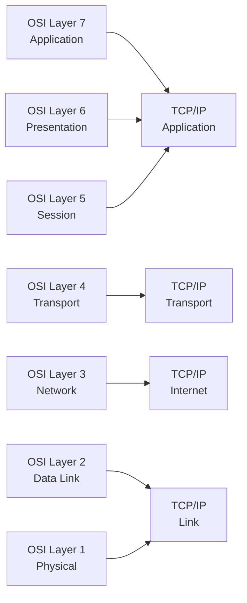
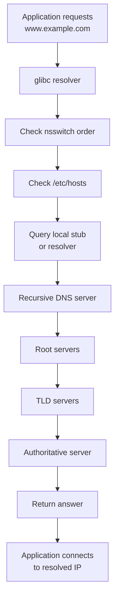
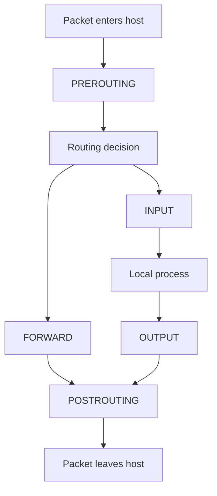
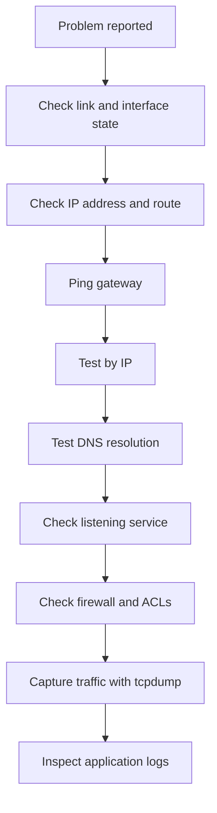
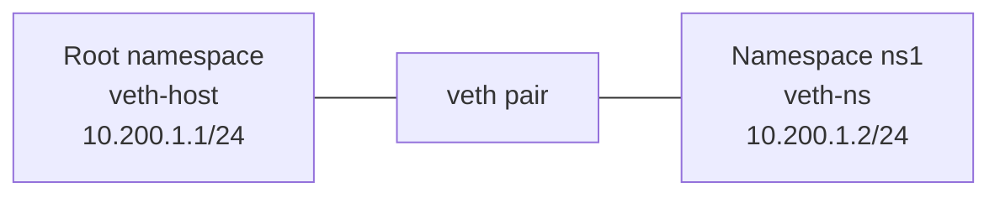

# Linux Networking Guide

> A production-quality reference from basic concepts to advanced Linux networking operations.
>
> Audience: administrators, DevOps engineers, SREs, platform engineers, students, and anyone building or troubleshooting Linux networks.

---

## Table of Contents

1. [Networking Fundamentals](#1-networking-fundamentals)
2. [Network Configuration](#2-network-configuration)
3. [DNS](#3-dns)
4. [Firewall](#4-firewall)
5. [SSH](#5-ssh)
6. [Network Troubleshooting](#6-network-troubleshooting)
7. [Network Services](#7-network-services)
8. [Network Bonding--vlans](#8-network-bonding--vlans)
9. [Advanced Networking](#9-advanced-networking)
10. [VPN](#10-vpn)
11. [Load Balancing](#11-load-balancing)
12. [Appendix A: Command Reference](#appendix-a-command-reference)
13. [Appendix B: Ports and Protocols](#appendix-b-ports-and-protocols)
14. [Appendix C: Example Lab Exercises](#appendix-c-example-lab-exercises)
15. [Appendix D: Security and Best Practices Checklist](#appendix-d-security-and-best-practices-checklist)

---

# 1. Networking Fundamentals

Linux networking becomes easier when you understand the layers, addressing model, and packet flow. This section covers the concepts that every administrator should know before changing live network settings.

## 1.1 What is a network?

A network is a collection of devices that exchange data across physical or virtual links.

Common examples:

- A laptop connected to a home router over Wi-Fi.
- A Linux VM communicating with a database server on a private subnet.
- Containers connected through a bridge on one host.
- Multiple data centers linked through VPN tunnels.

A network has several basic components:

- Endpoints
- Interfaces
- Media
- Addresses
- Protocols
- Routing
- Services
- Security controls

## 1.2 Key networking terms

| Term | Meaning |
|---|---|
| Host | Any device on a network |
| Interface | A network attachment point such as `eth0` or `ens33` |
| MAC address | Layer 2 hardware address |
| IP address | Layer 3 logical address |
| Port | Layer 4 endpoint identifier |
| Protocol | Rules governing communication |
| Gateway | Router used to reach other networks |
| Subnet | Logical IP network segment |
| CIDR | Classless Inter-Domain Routing notation |
| MTU | Maximum Transmission Unit |
| DNS | Domain Name System |
| NAT | Network Address Translation |
| VLAN | Virtual LAN |

## 1.3 OSI model

The OSI model is a conceptual framework with seven layers.

| OSI Layer | Name | Examples | Typical Linux Relevance |
|---|---|---|---|
| 7 | Application | HTTP, SSH, DNS, SMTP | `curl`, `ssh`, `dig`, web servers |
| 6 | Presentation | TLS, encoding | OpenSSL, certificate handling |
| 5 | Session | Sessions, RPC | SSH sessions, TLS sessions |
| 4 | Transport | TCP, UDP | Ports, sockets, `ss`, `netstat` |
| 3 | Network | IPv4, IPv6, ICMP | `ip route`, routing, ping |
| 2 | Data Link | Ethernet, ARP, VLAN | `ip link`, bridges, VLAN tags |
| 1 | Physical | Cables, NICs, radio | NIC speed, duplex, link state |

### 1.3.1 Why the OSI model matters

The OSI model helps isolate problems.

Examples:

- Link down issues are often Layer 1 or 2.
- Wrong IP or missing route is Layer 3.
- Blocked port is usually Layer 4.
- Application-level error is Layer 7.

## 1.4 TCP/IP model

The TCP/IP model is more practical and commonly used in real-world networking.

| TCP/IP Layer | Maps to OSI | Examples |
|---|---|---|
| Application | OSI 5-7 | HTTP, HTTPS, SSH, DNS |
| Transport | OSI 4 | TCP, UDP |
| Internet | OSI 3 | IP, ICMP |
| Link | OSI 1-2 | Ethernet, Wi-Fi, ARP |

## 1.5 OSI vs TCP/IP Mermaid diagram



## 1.6 Encapsulation

Data is wrapped with headers as it moves down the stack.

| Layer | Unit |
|---|---|
| Application | Data |
| Transport | Segment or datagram |
| Network | Packet |
| Data Link | Frame |
| Physical | Bits |

Packet journey:

1. Application generates data.
2. TCP or UDP adds a header.
3. IP adds source and destination IPs.
4. Ethernet adds source and destination MAC addresses.
5. Bits are transmitted.

## 1.7 Ethernet basics

Ethernet is the dominant Layer 2 technology in Linux server environments.

Important ideas:

- Frames contain source and destination MAC addresses.
- Switches forward frames using MAC tables.
- Broadcast frames go to all ports in the VLAN.
- ARP resolves IPv4 addresses to MAC addresses.
- Neighbor Discovery is used for IPv6.

## 1.8 IP addressing overview

Linux supports IPv4 and IPv6.

### 1.8.1 IPv4 basics

IPv4 addresses are 32 bits.

Examples:

- `192.168.1.10`
- `10.0.0.5`
- `172.16.100.20`

IPv4 ranges commonly used:

| Range | Purpose |
|---|---|
| `10.0.0.0/8` | Private |
| `172.16.0.0/12` | Private |
| `192.168.0.0/16` | Private |
| `127.0.0.0/8` | Loopback |
| `169.254.0.0/16` | Link-local |
| `224.0.0.0/4` | Multicast |

### 1.8.2 IPv6 basics

IPv6 addresses are 128 bits.

Examples:

- `2001:db8::10`
- `fe80::1`
- `fd00::1234`

Common IPv6 ranges:

| Range | Purpose |
|---|---|
| `::1/128` | Loopback |
| `fe80::/10` | Link-local |
| `fc00::/7` | Unique local |
| `2000::/3` | Global unicast |
| `ff00::/8` | Multicast |

## 1.9 Public vs private addressing

Private IPs are not routable on the public Internet without NAT or tunneling.

Use private addresses for:

- Internal app tiers
- Kubernetes nodes
- Database backends
- Management networks

Use public addresses for:

- Internet-facing load balancers
- Public APIs
- Bastion hosts

## 1.10 Subnetting concepts

Subnetting divides an IP network into smaller logical networks.

Why subnet?

- Security separation
- Better broadcast control
- Clearer routing
- Environment isolation
- Improved IP management

### 1.10.1 Network address and broadcast address

For an IPv4 subnet:

- Network address identifies the subnet.
- Broadcast address reaches all hosts in the subnet.
- Usable host addresses lie between them.

Example:

- CIDR: `192.168.10.0/24`
- Network: `192.168.10.0`
- Broadcast: `192.168.10.255`
- Usable range: `192.168.10.1` to `192.168.10.254`

## 1.11 CIDR notation

CIDR expresses the prefix length.

Examples:

| CIDR | Subnet Mask | Total Addresses | Usable Hosts |
|---|---|---:|---:|
| `/8` | `255.0.0.0` | 16,777,216 | 16,777,214 |
| `/16` | `255.255.0.0` | 65,536 | 65,534 |
| `/24` | `255.255.255.0` | 256 | 254 |
| `/25` | `255.255.255.128` | 128 | 126 |
| `/26` | `255.255.255.192` | 64 | 62 |
| `/27` | `255.255.255.224` | 32 | 30 |
| `/28` | `255.255.255.240` | 16 | 14 |
| `/29` | `255.255.255.248` | 8 | 6 |
| `/30` | `255.255.255.252` | 4 | 2 |
| `/31` | `255.255.255.254` | 2 | point-to-point |
| `/32` | `255.255.255.255` | 1 | host route |

## 1.12 Binary view of subnetting

Example IPv4 address:

```text
192.168.1.10 = 11000000.10101000.00000001.00001010
```

Example `/24` mask:

```text
255.255.255.0 = 11111111.11111111.11111111.00000000
```

The `1` bits represent the network portion.

## 1.13 Subnetting examples

### 1.13.1 Split a `/24` into two `/25` subnets

Original network:

- `192.168.1.0/24`

Resulting subnets:

- `192.168.1.0/25`
- `192.168.1.128/25`

### 1.13.2 Split a `/24` into four `/26` subnets

- `192.168.1.0/26`
- `192.168.1.64/26`
- `192.168.1.128/26`
- `192.168.1.192/26`

### 1.13.3 Quick reference for common subnet sizes

| Prefix | Hosts | Typical Use |
|---|---:|---|
| `/32` | 1 | Loopback, host route |
| `/31` | 2 | Point-to-point links |
| `/30` | 2 usable | Legacy point-to-point |
| `/29` | 6 usable | Small infrastructure block |
| `/28` | 14 usable | DMZ segment |
| `/27` | 30 usable | Small server subnet |
| `/26` | 62 usable | Department network |
| `/24` | 254 usable | Standard LAN |
| `/23` | 510 usable | Larger LAN |

## 1.14 Default gateway

A host uses a default gateway when the destination is outside its local subnet.

Example:

- Host: `192.168.1.10/24`
- Gateway: `192.168.1.1`

If the host sends traffic to `8.8.8.8`, it forwards it to the gateway.

## 1.15 Routing basics

Routers make forwarding decisions using routing tables.

Linux also maintains routing tables.

Common route types:

- Connected routes
- Static routes
- Dynamic routes
- Default routes
- Host routes

Example routing table logic:

1. Look for the most specific match.
2. Use longest prefix match.
3. Forward through the chosen interface and next hop.

## 1.16 ARP and Neighbor Discovery

### 1.16.1 ARP for IPv4

ARP maps IP addresses to MAC addresses.

Example workflow:

1. Host wants to reach `192.168.1.20`.
2. Host broadcasts an ARP request.
3. Target replies with its MAC address.
4. Host caches the result.

Useful commands:

```bash
ip neigh show
arp -n
```

### 1.16.2 Neighbor Discovery for IPv6

IPv6 uses ICMPv6 Neighbor Discovery instead of ARP.

Functions include:

- Neighbor solicitation
- Neighbor advertisement
- Router solicitation
- Router advertisement

## 1.17 TCP vs UDP

| Feature | TCP | UDP |
|---|---|---|
| Connection-oriented | Yes | No |
| Reliability | Yes | No built-in reliability |
| Ordering | Yes | No guaranteed ordering |
| Overhead | Higher | Lower |
| Typical Uses | SSH, HTTPS, SMTP | DNS, VoIP, streaming, DHCP |

### 1.17.1 TCP characteristics

TCP provides:

- Three-way handshake
- Sequencing
- Retransmission
- Flow control
- Congestion control

### 1.17.2 UDP characteristics

UDP provides:

- Low latency
- Low overhead
- No connection state
- Best-effort delivery

## 1.18 TCP three-way handshake

```text
Client -> SYN -> Server
Client <- SYN-ACK <- Server
Client -> ACK -> Server
```

Termination usually uses FIN and ACK packets.

## 1.19 Ports and sockets

A socket is an endpoint defined by IP + port + protocol.

Examples:

- `192.168.1.10:22/tcp`
- `0.0.0.0:443/tcp`
- `[::]:53/udp`

Port ranges:

| Range | Meaning |
|---|---|
| 0-1023 | Well-known |
| 1024-49151 | Registered |
| 49152-65535 | Ephemeral |

## 1.20 MTU and fragmentation

MTU defines the largest packet payload a link can carry without fragmentation.

Common MTUs:

| Medium | MTU |
|---|---:|
| Ethernet | 1500 |
| Jumbo Ethernet | 9000 |
| WireGuard default interface payload planning | varies |
| VPN overlays | often lower than 1500 |

Problems caused by wrong MTU:

- Slow connections
- Broken HTTPS
- Stalled SSH over VPN
- PMTU black holes

Useful command:

```bash
ip link show
```

## 1.21 ICMP basics

ICMP is used for control and diagnostic messages.

Examples:

- Echo request/reply used by `ping`
- Destination unreachable
- Time exceeded used by `traceroute`
- Redirect messages

Do not block all ICMP blindly. Many network features depend on it.

## 1.22 Unicast, broadcast, multicast, anycast

| Type | Description |
|---|---|
| Unicast | One sender to one receiver |
| Broadcast | One sender to all hosts in a broadcast domain |
| Multicast | One sender to a subscribed group |
| Anycast | One address served by multiple nodes, nearest one responds |

## 1.23 Half-duplex vs full-duplex

Modern Ethernet usually runs full-duplex.

Mismatch symptoms:

- Packet loss
- Late collisions
- Very poor throughput

## 1.24 DNS, DHCP, NAT at a glance

| Service | Purpose |
|---|---|
| DNS | Resolves names to addresses |
| DHCP | Automatically assigns network settings |
| NAT | Translates addresses between networks |

## 1.25 Linux interface naming

Common interface names on modern systems:

- `lo`
- `eth0`
- `ens160`
- `enp0s3`
- `wlan0`
- `bond0`
- `br0`
- `vlan10`
- `wg0`
- `tun0`

Predictable interface naming often uses forms like `ens33` or `enp1s0`.

## 1.26 Loopback interface

The loopback interface `lo` is used for local host communication.

Important addresses:

- IPv4: `127.0.0.1`
- IPv6: `::1`

Use cases:

- Local service binding
- Internal health checks
- Development environments

## 1.27 Linux networking philosophy

Linux treats networking objects as modular building blocks.

Examples:

- Interfaces
- Addresses
- Routes
- Rules
- Namespaces
- Bridges
- VLANs
- Tunnels
- Firewall chains

This makes Linux extremely flexible for:

- Servers
- Routers
- Firewalls
- VPN gateways
- Container hosts
- Virtualization platforms

## 1.28 Quick command map for fundamentals

| Goal | Command |
|---|---|
| Show IP addresses | `ip addr` |
| Show links | `ip link` |
| Show routes | `ip route` |
| Show neighbors | `ip neigh` |
| Show sockets | `ss -tulpen` |
| Test reachability | `ping` |
| Query DNS | `dig` |

## 1.29 Fundamental best practices

- Use `ip` over legacy tools when possible.
- Document subnet allocations.
- Avoid overlapping address spaces.
- Use consistent naming for VLANs and interfaces.
- Prefer key-based SSH authentication.
- Keep DNS and time sync healthy.
- Monitor drops, errors, and retransmits.

## 1.30 Summary

Networking fundamentals provide the language for every later section in this guide. If you understand addressing, routing, layers, and packet flow, most Linux networking tasks become systematic rather than mysterious.

---

# 2. Network Configuration

Linux provides several ways to configure network interfaces depending on the distribution and age of the system.

## 2.1 Core configuration tasks

Typical interface configuration includes:

- Setting link state
- Assigning IPv4 or IPv6 addresses
- Defining the default gateway
- Adding static routes
- Configuring DNS resolvers
- Enabling DHCP or static addressing

## 2.2 Modern `ip` command suite

The `ip` command from `iproute2` is the standard tool on modern Linux.

### 2.2.1 Show addresses

```bash
ip addr show
ip a
```

### 2.2.2 Show one interface

```bash
ip addr show dev eth0
```

### 2.2.3 Bring interface up or down

```bash
sudo ip link set dev eth0 up
sudo ip link set dev eth0 down
```

### 2.2.4 Add an IPv4 address

```bash
sudo ip addr add 192.168.10.20/24 dev eth0
```

### 2.2.5 Remove an IPv4 address

```bash
sudo ip addr del 192.168.10.20/24 dev eth0
```

### 2.2.6 Add a default route

```bash
sudo ip route add default via 192.168.10.1
```

### 2.2.7 Add a static route

```bash
sudo ip route add 10.20.30.0/24 via 192.168.10.1 dev eth0
```

### 2.2.8 Show routing table

```bash
ip route show
ip r
```

### 2.2.9 Show IPv6 routes

```bash
ip -6 route show
```

### 2.2.10 Show link details

```bash
ip -details link show
```

## 2.3 Understanding `ip addr` output

Example:

```text
2: eth0: <BROADCAST,MULTICAST,UP,LOWER_UP> mtu 1500 qdisc mq state UP group default qlen 1000
    link/ether 52:54:00:12:34:56 brd ff:ff:ff:ff:ff:ff
    inet 192.168.10.20/24 brd 192.168.10.255 scope global eth0
    inet6 fe80::5054:ff:fe12:3456/64 scope link
```

Meaning:

- `UP` means administratively up.
- `LOWER_UP` usually means link detected.
- `mtu 1500` is the interface MTU.
- `inet` is the IPv4 address.
- `inet6` is the IPv6 address.

## 2.4 `ip link`

Use `ip link` for Layer 2 interface operations.

Examples:

```bash
ip link show
sudo ip link set dev eth0 mtu 9000
sudo ip link set dev eth0 address 00:11:22:33:44:55
```

## 2.5 `ip route`

Routing commands are frequently used in troubleshooting and system bootstrap.

Examples:

```bash
ip route get 8.8.8.8
ip route add 172.16.0.0/16 via 192.168.10.1
ip route del 172.16.0.0/16 via 192.168.10.1
```

## 2.6 `ifconfig` and `route` legacy commands

Older systems may still have `ifconfig` and `route` via `net-tools`.

Examples:

```bash
ifconfig
ifconfig eth0 192.168.10.20 netmask 255.255.255.0 up
route -n
route add default gw 192.168.10.1
```

Why legacy tools are discouraged:

- Not actively developed like `iproute2`
- Limited support for modern features
- Inconsistent behavior across distros

## 2.7 Persistent configuration methods by distribution

Different Linux distributions persist network settings differently.

| Distribution Family | Common Method |
|---|---|
| Ubuntu Server (newer) | Netplan |
| Ubuntu/Debian (older) | `/etc/network/interfaces` |
| RHEL/CentOS 7+ | NetworkManager or legacy scripts |
| RHEL 8/9 | NetworkManager with `nmcli` |
| Desktop distros | NetworkManager |

## 2.8 NetworkManager overview

NetworkManager is a service that manages interfaces, connections, routing, and DNS integration.

Useful commands:

```bash
nmcli general status
nmcli device status
nmcli connection show
```

## 2.9 `nmcli` command examples

### 2.9.1 Show devices

```bash
nmcli device status
```

### 2.9.2 Show connections

```bash
nmcli connection show
```

### 2.9.3 Bring a connection up

```bash
sudo nmcli connection up "System eth0"
```

### 2.9.4 Bring a connection down

```bash
sudo nmcli connection down "System eth0"
```

### 2.9.5 Configure static IPv4

```bash
sudo nmcli connection modify eth0 \
  ipv4.addresses 192.168.10.20/24 \
  ipv4.gateway 192.168.10.1 \
  ipv4.dns "1.1.1.1 8.8.8.8" \
  ipv4.method manual
```

### 2.9.6 Enable DHCP

```bash
sudo nmcli connection modify eth0 ipv4.method auto
```

### 2.9.7 Apply changes

```bash
sudo nmcli connection down eth0
sudo nmcli connection up eth0
```

## 2.10 `nmtui`

`nmtui` is a text-based UI for NetworkManager.

Good use cases:

- Quick console configuration
- Virtual machines without a GUI
- Administrators who prefer menus over CLI syntax

Launch it with:

```bash
sudo nmtui
```

Menu options generally include:

- Edit a connection
- Activate a connection
- Set system hostname

## 2.11 Netplan overview

Netplan is common on Ubuntu Server.

YAML files are typically stored in:

```text
/etc/netplan/
```

Common file names:

- `00-installer-config.yaml`
- `50-cloud-init.yaml`
- `01-netcfg.yaml`

### 2.11.1 Apply configuration

```bash
sudo netplan generate
sudo netplan apply
```

### 2.11.2 Test configuration safely

```bash
sudo netplan try
```

`netplan try` is safer for remote servers because it can roll back if connectivity is lost.

## 2.12 Netplan DHCP example for Ubuntu

```yaml
network:
  version: 2
  ethernets:
    ens33:
      dhcp4: true
      dhcp6: false
```

## 2.13 Netplan static IP example for Ubuntu

```yaml
network:
  version: 2
  ethernets:
    ens33:
      dhcp4: false
      addresses:
        - 192.168.10.20/24
      routes:
        - to: default
          via: 192.168.10.1
      nameservers:
        addresses:
          - 1.1.1.1
          - 8.8.8.8
        search:
          - example.local
```

## 2.14 Netplan static IPv6 example

```yaml
network:
  version: 2
  ethernets:
    ens33:
      dhcp6: false
      addresses:
        - 2001:db8:100::20/64
      routes:
        - to: default
          via: 2001:db8:100::1
      nameservers:
        addresses:
          - 2606:4700:4700::1111
          - 2001:4860:4860::8888
```

## 2.15 `/etc/network/interfaces` overview

Older Debian and Ubuntu systems often use this file.

Typical path:

```text
/etc/network/interfaces
```

### 2.15.1 DHCP example

```ini
auto eth0
iface eth0 inet dhcp
```

### 2.15.2 Static IPv4 example

```ini
auto eth0
iface eth0 inet static
    address 192.168.10.20
    netmask 255.255.255.0
    gateway 192.168.10.1
    dns-nameservers 1.1.1.1 8.8.8.8
    dns-search example.local
```

### 2.15.3 Bring interface down and up

```bash
sudo ifdown eth0 && sudo ifup eth0
```

## 2.16 CentOS/RHEL legacy ifcfg scripts

Older RHEL/CentOS systems use files such as:

```text
/etc/sysconfig/network-scripts/ifcfg-eth0
```

### 2.16.1 Static example

```ini
TYPE=Ethernet
BOOTPROTO=none
NAME=eth0
DEVICE=eth0
ONBOOT=yes
IPADDR=192.168.10.20
PREFIX=24
GATEWAY=192.168.10.1
DNS1=1.1.1.1
DNS2=8.8.8.8
```

### 2.16.2 DHCP example

```ini
TYPE=Ethernet
BOOTPROTO=dhcp
NAME=eth0
DEVICE=eth0
ONBOOT=yes
```

Restart networking carefully:

```bash
sudo systemctl restart NetworkManager
```

or on older systems:

```bash
sudo systemctl restart network
```

## 2.17 Static vs DHCP

| Aspect | Static | DHCP |
|---|---|---|
| Address stability | Fixed | May change |
| Server use | Common | Sometimes used |
| Client use | Less common | Very common |
| Management | Manual | Centralized |
| Risk | Misconfiguration | Lease dependency |

Use static addressing for:

- Servers
- Gateways
- Load balancers
- Hypervisors
- DNS servers

Use DHCP for:

- User laptops
- Workstations
- Ephemeral test VMs
- Lab environments

## 2.18 Ubuntu examples: static and DHCP

### 2.18.1 Ubuntu static example with Netplan

```yaml
network:
  version: 2
  renderer: networkd
  ethernets:
    ens160:
      dhcp4: false
      addresses:
        - 10.10.20.15/24
      routes:
        - to: default
          via: 10.10.20.1
      nameservers:
        addresses:
          - 10.10.1.53
          - 1.1.1.1
        search:
          - corp.example.com
```

### 2.18.2 Ubuntu DHCP example with Netplan

```yaml
network:
  version: 2
  renderer: networkd
  ethernets:
    ens160:
      dhcp4: true
      dhcp-identifier: mac
```

## 2.19 CentOS/RHEL examples: static and DHCP

### 2.19.1 RHEL static with `nmcli`

```bash
sudo nmcli connection add type ethernet ifname ens160 con-name ens160 \
  ipv4.method manual \
  ipv4.addresses 10.10.20.15/24 \
  ipv4.gateway 10.10.20.1 \
  ipv4.dns "10.10.1.53 1.1.1.1" \
  autoconnect yes
```

### 2.19.2 RHEL DHCP with `nmcli`

```bash
sudo nmcli connection add type ethernet ifname ens160 con-name ens160 \
  ipv4.method auto \
  autoconnect yes
```

## 2.20 Configuring multiple IPs on one interface

```bash
sudo ip addr add 192.168.10.21/24 dev eth0
sudo ip addr add 192.168.10.22/24 dev eth0
```

Common uses:

- Virtual hosting
- Migration cutovers
- Testing
- Legacy app coexistence

## 2.21 Temporary vs persistent changes

Commands like `ip addr add` are temporary.

They usually disappear after reboot or service restart.

Persistent configuration should be set through:

- Netplan
- NetworkManager
- `/etc/network/interfaces`
- Distribution-specific configuration files

## 2.22 Hostname configuration

Show hostname:

```bash
hostnamectl status
```

Set hostname:

```bash
sudo hostnamectl set-hostname web01.example.com
```

Ensure DNS and reverse DNS align with hostname standards in production environments.

## 2.23 Interface statistics and errors

```bash
ip -s link show dev eth0
```

Look for:

- RX errors
- TX errors
- Dropped packets
- Overruns
- Carrier errors

## 2.24 MAC address changes

Example:

```bash
sudo ip link set dev eth0 down
sudo ip link set dev eth0 address 02:11:22:33:44:55
sudo ip link set dev eth0 up
```

Use carefully. Some networks enforce port security or DHCP reservations.

## 2.25 MTU changes

Temporary MTU change:

```bash
sudo ip link set dev eth0 mtu 9000
```

Persistent MTU should be configured using the distro’s network management system.

Example Netplan:

```yaml
network:
  version: 2
  ethernets:
    ens33:
      mtu: 9000
      dhcp4: true
```

## 2.26 Routing metrics

Metrics determine route preference when multiple routes exist.

Example:

```bash
sudo ip route add default via 192.168.10.1 metric 100
sudo ip route add default via 192.168.20.1 metric 200
```

The lower metric is preferred.

## 2.27 Policy routing overview

Advanced routing may use multiple routing tables and rules.

Examples:

- Source-based routing
- Multi-homed servers
- VPN split routing

Useful commands:

```bash
ip rule show
ip route show table main
ip route show table all
```

## 2.28 Static route examples

### 2.28.1 Temporary route

```bash
sudo ip route add 10.50.0.0/16 via 192.168.10.1 dev eth0
```

### 2.28.2 Host route

```bash
sudo ip route add 203.0.113.50/32 via 192.168.10.254
```

### 2.28.3 Blackhole route

```bash
sudo ip route add blackhole 198.51.100.0/24
```

## 2.29 DHCP client tools

Common tools:

- `dhclient`
- `systemd-networkd`
- NetworkManager internal DHCP handling

Examples:

```bash
sudo dhclient -v eth0
sudo dhclient -r eth0
```

## 2.30 Name resolution and networking services

When network settings change, verify these layers too:

- DNS resolver settings
- Routing table correctness
- Firewall rules
- Service bind address
- SELinux or AppArmor policy if relevant

## 2.31 Safe remote change workflow

When changing remote server networking:

1. Open a persistent SSH session.
2. Open a second backup SSH session.
3. Use `tmux` or `screen`.
4. Schedule rollback if possible.
5. Prefer `netplan try` or staged `nmcli` changes.
6. Validate before logging out.

## 2.32 Validation commands after configuration

```bash
ip addr show
ip route show
ping -c 3 <gateway>
ping -c 3 8.8.8.8
dig example.com
curl -I https://example.com
```

## 2.33 Common configuration mistakes

- Wrong prefix length
- Wrong gateway
- Duplicate IP
- Missing DNS
- Interface name mismatch
- MTU mismatch
- Route added to wrong interface
- Persistent config differs from runtime config

## 2.34 Quick comparison table

| Tool | Best For | Notes |
|---|---|---|
| `ip` | Runtime changes and inspection | Preferred modern tool |
| `ifconfig` | Legacy systems | Deprecated in many environments |
| `nmcli` | Persistent config on NM systems | Script-friendly |
| `nmtui` | Interactive text UI | Fast for console use |
| Netplan | Ubuntu Server | YAML-based |
| `/etc/network/interfaces` | Older Debian/Ubuntu | Legacy but still encountered |

## 2.35 Summary

Use `iproute2` for day-to-day inspection and temporary changes. Use the distribution-native persistence mechanism for durable configuration.

---

# 3. DNS

DNS is one of the most critical services in Linux networking. Many “network problems” are actually DNS problems.

## 3.1 What DNS does

DNS translates names into data such as:

- A records for IPv4
- AAAA records for IPv6
- CNAME aliases
- MX mail routing
- TXT metadata
- NS delegation
- PTR reverse lookup
- SRV service discovery

## 3.2 Name resolution components on Linux

Important files and services:

- `/etc/resolv.conf`
- `/etc/hosts`
- `/etc/nsswitch.conf`
- `systemd-resolved`
- Local caching resolvers
- Recursive resolvers
- Authoritative DNS servers

## 3.3 `/etc/resolv.conf`

This file defines resolver behavior for many programs.

Common entries:

```conf
nameserver 1.1.1.1
nameserver 8.8.8.8
search example.com corp.example.com
options timeout:2 attempts:3 rotate
```

### 3.3.1 Key directives

| Directive | Meaning |
|---|---|
| `nameserver` | DNS server to query |
| `search` | Suffixes appended to short names |
| `domain` | Default local domain |
| `options` | Resolver behavior tuning |

### 3.3.2 Common caveat

`/etc/resolv.conf` may be managed automatically by:

- NetworkManager
- `systemd-resolved`
- DHCP client scripts
- Cloud-init

Always verify ownership before editing.

## 3.4 `/etc/hosts`

This file provides static name-to-address mappings.

Example:

```conf
127.0.0.1   localhost
192.168.10.20   web01 web01.example.com
192.168.10.21   db01 db01.example.com
```

Use `/etc/hosts` for:

- Bootstrap during DNS outages
- Small lab environments
- Local testing

Avoid relying on it for large-scale dynamic infrastructure.

## 3.5 `/etc/nsswitch.conf`

This file controls lookup order.

Typical example:

```conf
hosts: files dns myhostname
```

Meaning:

1. Check `/etc/hosts`
2. Query DNS
3. Use local hostname plugin if applicable

## 3.6 DNS resolution flow Mermaid diagram



## 3.7 `dig`

`dig` is the preferred DNS query tool.

### 3.7.1 Query A record

```bash
dig example.com
```

### 3.7.2 Query specific server

```bash
dig @1.1.1.1 example.com
```

### 3.7.3 Query record type

```bash
dig example.com MX
dig example.com AAAA
dig -x 8.8.8.8
```

### 3.7.4 Short output

```bash
dig +short example.com
```

### 3.7.5 Trace delegation

```bash
dig +trace example.com
```

## 3.8 `nslookup`

Still widely used, though `dig` is usually more detailed.

Examples:

```bash
nslookup example.com
nslookup example.com 8.8.8.8
```

## 3.9 `host`

Simple and concise DNS lookup tool.

Examples:

```bash
host example.com
host 8.8.8.8
host -t MX example.com
```

## 3.10 Resolver testing workflow

Check in this order:

1. `/etc/nsswitch.conf`
2. `/etc/hosts`
3. `/etc/resolv.conf`
4. Stub resolver service status
5. DNS server reachability
6. Authoritative answer correctness

## 3.11 `systemd-resolved`

Many modern distributions use `systemd-resolved`.

Useful commands:

```bash
systemctl status systemd-resolved
resolvectl status
resolvectl query example.com
```

### 3.11.1 Stub resolver behavior

`/etc/resolv.conf` may point to:

```text
127.0.0.53
```

This is the local stub resolver provided by `systemd-resolved`.

### 3.11.2 Flush DNS cache

```bash
sudo resolvectl flush-caches
```

## 3.12 Common DNS record types

| Record | Purpose | Example |
|---|---|---|
| A | IPv4 address | `web.example.com -> 192.0.2.10` |
| AAAA | IPv6 address | `web.example.com -> 2001:db8::10` |
| CNAME | Alias | `www -> web` |
| MX | Mail exchange | `10 mail.example.com` |
| NS | Name server | `ns1.example.com` |
| PTR | Reverse mapping | `10.2.0.192.in-addr.arpa` |
| TXT | Arbitrary text | SPF, DKIM, verification |
| SRV | Service discovery | `_ldap._tcp.example.com` |

## 3.13 Forward vs reverse DNS

Forward DNS:

- Name to IP

Reverse DNS:

- IP to name

Reverse lookups are commonly important for:

- Mail servers
- Logs
- Monitoring
- Identity checks

## 3.14 Search domains and short names

If `search example.com` is configured, querying `web01` may expand to `web01.example.com`.

This can be convenient but can also cause confusing delays or misresolutions in multi-domain environments.

## 3.15 Split DNS

Split DNS returns different answers depending on client location or view.

Examples:

- Internal users get `10.0.0.10`
- External users get `203.0.113.10`

Useful for:

- Internal load balancers
- Hybrid cloud
- VPN users

## 3.16 Caching and TTL

TTL defines how long a response may be cached.

Short TTL:

- Easier failover
- Higher query load

Long TTL:

- Better cache efficiency
- Slower propagation of changes

## 3.17 Diagnosing DNS failures

Symptoms:

- `ping 8.8.8.8` works but `ping example.com` fails
- Package manager cannot resolve mirrors
- SSH by hostname fails but SSH by IP works

Commands:

```bash
getent hosts example.com
dig example.com
resolvectl query example.com
cat /etc/resolv.conf
cat /etc/nsswitch.conf
```

## 3.18 BIND overview

BIND is a common DNS server implementation.

Packages often include:

- `bind`
- `bind9`
- `named`
- `bind-utils`

## 3.19 BIND configuration files

Typical paths vary by distro.

Common files:

- `/etc/named.conf`
- `/etc/bind/named.conf`
- `/etc/bind/named.conf.options`
- `/etc/bind/named.conf.local`
- Zone files under `/var/named/` or `/etc/bind/`

## 3.20 Minimal BIND caching resolver example

Example excerpt:

```conf
options {
    directory "/var/named";
    recursion yes;
    allow-query { any; };
    listen-on port 53 { 127.0.0.1; 192.168.10.53; };
    forwarders {
        1.1.1.1;
        8.8.8.8;
    };
    dnssec-validation auto;
};
```

## 3.21 BIND authoritative zone example

Zone declaration:

```conf
zone "example.com" IN {
    type master;
    file "example.com.zone";
};
```

Zone file example:

```dns
$TTL 3600
@   IN  SOA ns1.example.com. admin.example.com. (
        2024010101
        3600
        900
        604800
        86400 )
    IN  NS  ns1.example.com.
ns1 IN  A   192.168.10.53
www IN  A   192.168.10.20
api IN  A   192.168.10.30
mail IN A   192.168.10.40
@   IN  MX  10 mail.example.com.
```

## 3.22 Validate BIND configuration

```bash
sudo named-checkconf
sudo named-checkzone example.com /var/named/example.com.zone
```

## 3.23 Start and enable BIND

```bash
sudo systemctl enable --now named
sudo systemctl status named
```

or on Debian/Ubuntu:

```bash
sudo systemctl enable --now bind9
sudo systemctl status bind9
```

## 3.24 DNS over UDP and TCP

DNS commonly uses UDP/53.

It can also use TCP/53 for:

- Zone transfers
- Large responses
- Fallback when truncation occurs

## 3.25 EDNS and larger responses

Modern DNS often relies on EDNS to handle larger payloads.

Watch for:

- Firewalls dropping fragmented DNS
- Misbehaving middleboxes
- MTU issues on VPNs

## 3.26 `/etc/hosts` vs DNS

| Feature | `/etc/hosts` | DNS |
|---|---|---|
| Scale | Very small | Large-scale |
| Central management | No | Yes |
| Dynamic updates | Manual | Possible |
| Reverse lookup | Manual and limited | Standardized |
| Good for bootstrap | Yes | Yes |

## 3.27 `getent` is your friend

`getent` respects NSS configuration.

Examples:

```bash
getent hosts example.com
getent ahosts example.com
getent passwd root
```

This is often better than assuming a program uses raw DNS directly.

## 3.28 DNS security basics

- Restrict recursion on public resolvers.
- Use DNSSEC validation where appropriate.
- Limit zone transfer access.
- Avoid open resolvers.
- Log query rates and anomalies.

## 3.29 Common DNS issues

- Stale cache
- Wrong search domain
- Missing PTR record
- Broken `resolv.conf` symlink
- Stub resolver failure
- Split DNS mismatch
- Firewall blocking port 53 UDP or TCP
- Incorrect zone serial

## 3.30 Summary

Good DNS hygiene is essential. Before blaming the network, verify resolver order, local files, and the actual authoritative answer.

---

# 4. Firewall

Linux firewalling can be managed with `iptables`, `nftables`, `firewalld`, or `ufw` depending on the distribution and preference.

## 4.1 Firewall concepts

A firewall filters traffic based on rules.

Common actions:

- Accept
- Drop
- Reject
- Log
- Masquerade
- DNAT
- SNAT

## 4.2 Packet filtering basics

A packet may be filtered based on:

- Source IP
- Destination IP
- Protocol
- Source port
- Destination port
- Interface
- Connection state
- Packet marks

## 4.3 Netfilter overview

The Linux kernel packet filtering framework is Netfilter.

User-space tools include:

- `iptables`
- `ip6tables`
- `nft`
- `firewalld`
- `ufw`

## 4.4 `iptables` tables

| Table | Purpose |
|---|---|
| `filter` | Packet filtering |
| `nat` | Address translation |
| `mangle` | Packet alteration |
| `raw` | Connection tracking exceptions |
| `security` | SELinux-related hooks |

## 4.5 `iptables` built-in chains

| Table | Common Chains |
|---|---|
| `filter` | `INPUT`, `FORWARD`, `OUTPUT` |
| `nat` | `PREROUTING`, `OUTPUT`, `POSTROUTING` |
| `mangle` | `PREROUTING`, `INPUT`, `FORWARD`, `OUTPUT`, `POSTROUTING` |

## 4.6 `iptables` packet flow Mermaid diagram



## 4.7 List current `iptables` rules

```bash
sudo iptables -L -n -v
sudo iptables -t nat -L -n -v
```

## 4.8 Basic `iptables` rule examples

### 4.8.1 Allow established traffic

```bash
sudo iptables -A INPUT -m conntrack --ctstate ESTABLISHED,RELATED -j ACCEPT
```

### 4.8.2 Allow loopback

```bash
sudo iptables -A INPUT -i lo -j ACCEPT
```

### 4.8.3 Allow SSH

```bash
sudo iptables -A INPUT -p tcp --dport 22 -j ACCEPT
```

### 4.8.4 Allow ICMP echo request

```bash
sudo iptables -A INPUT -p icmp --icmp-type echo-request -j ACCEPT
```

### 4.8.5 Default drop policy

```bash
sudo iptables -P INPUT DROP
sudo iptables -P FORWARD DROP
sudo iptables -P OUTPUT ACCEPT
```

## 4.9 Common `iptables` commands

| Task | Command |
|---|---|
| Append rule | `iptables -A` |
| Insert rule | `iptables -I` |
| Delete rule | `iptables -D` |
| List rules | `iptables -L -n -v` |
| Save rules | distro-specific |
| Flush rules | `iptables -F` |

## 4.10 Stateful firewalling

Connection tracking allows rules like:

```bash
sudo iptables -A INPUT -m conntrack --ctstate ESTABLISHED,RELATED -j ACCEPT
```

States commonly used:

- `NEW`
- `ESTABLISHED`
- `RELATED`
- `INVALID`

## 4.11 NAT with `iptables`

### 4.11.1 Masquerading outbound traffic

```bash
sudo iptables -t nat -A POSTROUTING -o eth0 -j MASQUERADE
```

### 4.11.2 Port forwarding example

```bash
sudo iptables -t nat -A PREROUTING -p tcp --dport 8443 -j DNAT --to-destination 192.168.10.20:443
sudo iptables -A FORWARD -p tcp -d 192.168.10.20 --dport 443 -j ACCEPT
```

## 4.12 Persisting `iptables`

Approaches vary:

- `iptables-save` and `iptables-restore`
- `iptables-persistent` on Debian/Ubuntu
- Distribution startup scripts
- Migration to `nftables`

Examples:

```bash
sudo iptables-save
sudo iptables-save > /etc/iptables/rules.v4
```

## 4.13 `nftables` overview

`nftables` is the modern replacement for `iptables` in many environments.

Advantages:

- Cleaner syntax
- Unified IPv4/IPv6 handling
- Better maintainability
- Improved sets and maps

## 4.14 `nftables` basic objects

- Tables
- Chains
- Rules
- Sets
- Maps
- State tracking

## 4.15 Minimal `nftables` example

```nft
flush ruleset

table inet filter {
  chain input {
    type filter hook input priority 0;
    policy drop;

    iif lo accept
    ct state established,related accept
    tcp dport 22 accept
    ip protocol icmp accept
    ip6 nexthdr icmpv6 accept
  }

  chain forward {
    type filter hook forward priority 0;
    policy drop;
  }

  chain output {
    type filter hook output priority 0;
    policy accept;
  }
}
```

Load rules:

```bash
sudo nft -f /etc/nftables.conf
sudo nft list ruleset
```

## 4.16 `firewalld` overview

`firewalld` is common on RHEL-family distributions.

Concepts:

- Zones
- Services
- Ports
- Rich rules
- Runtime vs permanent config

## 4.17 `firewalld` zones

Common zones:

| Zone | Typical Trust Level |
|---|---|
| `drop` | Very restrictive |
| `block` | Restrictive with rejection |
| `public` | Default public network |
| `external` | NAT gateway |
| `internal` | Trusted internal network |
| `dmz` | Limited access public servers |
| `trusted` | Highly trusted |

## 4.18 `firewalld` examples

### 4.18.1 Check state

```bash
sudo firewall-cmd --state
```

### 4.18.2 List active zones

```bash
sudo firewall-cmd --get-active-zones
```

### 4.18.3 Allow SSH service

```bash
sudo firewall-cmd --permanent --add-service=ssh
sudo firewall-cmd --reload
```

### 4.18.4 Allow HTTP and HTTPS

```bash
sudo firewall-cmd --permanent --add-service=http
sudo firewall-cmd --permanent --add-service=https
sudo firewall-cmd --reload
```

### 4.18.5 Open a custom port

```bash
sudo firewall-cmd --permanent --add-port=8443/tcp
sudo firewall-cmd --reload
```

### 4.18.6 Add source network to internal zone

```bash
sudo firewall-cmd --permanent --zone=internal --add-source=10.10.0.0/16
sudo firewall-cmd --reload
```

## 4.19 `firewalld` rich rules

Example:

```bash
sudo firewall-cmd --permanent --add-rich-rule='rule family="ipv4" source address="192.168.10.0/24" service name="ssh" accept'
sudo firewall-cmd --reload
```

## 4.20 `ufw` overview

`ufw` is common on Ubuntu systems and simplifies common firewall tasks.

### 4.20.1 Basic commands

```bash
sudo ufw status verbose
sudo ufw enable
sudo ufw disable
```

### 4.20.2 Allow SSH

```bash
sudo ufw allow ssh
```

### 4.20.3 Allow HTTP and HTTPS

```bash
sudo ufw allow 80/tcp
sudo ufw allow 443/tcp
```

### 4.20.4 Deny a port

```bash
sudo ufw deny 23/tcp
```

## 4.21 Common firewall rules table

| Use Case | iptables | nftables | firewalld | ufw |
|---|---|---|---|---|
| Allow SSH | `-A INPUT -p tcp --dport 22 -j ACCEPT` | `tcp dport 22 accept` | `--add-service=ssh` | `allow ssh` |
| Allow HTTP | `-A INPUT -p tcp --dport 80 -j ACCEPT` | `tcp dport 80 accept` | `--add-service=http` | `allow 80/tcp` |
| Allow HTTPS | `-A INPUT -p tcp --dport 443 -j ACCEPT` | `tcp dport 443 accept` | `--add-service=https` | `allow 443/tcp` |
| Masquerade | `-t nat -A POSTROUTING -j MASQUERADE` | `masquerade` | `--add-masquerade` | limited direct approach |
| Default deny | `-P INPUT DROP` | `policy drop` | zone policy model | default deny incoming |

## 4.22 Safe firewall workflow on remote systems

1. Confirm console or out-of-band access exists.
2. Allow established traffic first.
3. Allow SSH from your source before default drop.
4. Apply changes in a rollback-friendly way.
5. Test from a second session.

## 4.23 Logging firewall hits

### 4.23.1 `iptables` logging example

```bash
sudo iptables -A INPUT -p tcp --dport 23 -j LOG --log-prefix "TELNET_DROP "
sudo iptables -A INPUT -p tcp --dport 23 -j DROP
```

Be careful. Logging every packet can flood logs.

## 4.24 IPv6 firewalling

Do not forget IPv6.

Common mistake:

- Securing IPv4 only
- Leaving IPv6 wide open

Use:

- `ip6tables`
- `nftables` unified `inet` tables
- `firewalld`
- `ufw` with IPv6 enabled

## 4.25 Common firewall mistakes

- Dropping established traffic
- Locking out SSH
- Forgetting IPv6 rules
- DNAT without FORWARD allow
- No persistence after reboot
- Overly broad allow rules
- Blocking ICMP required for PMTU

## 4.26 SELinux and firewalls

Sometimes the network is fine but SELinux blocks the service.

Useful tools:

```bash
getenforce
sudo ausearch -m AVC
sudo semanage port -l | grep http
```

## 4.27 Example baseline server policy

Recommended baseline:

- Allow loopback
- Allow established and related
- Allow SSH from admin ranges only
- Allow specific app ports only
- Default drop inbound
- Log important denials selectively

## 4.28 Example `nftables` production starter file

```nft
flush ruleset

table inet filter {
  chain input {
    type filter hook input priority 0;
    policy drop;
    iif lo accept
    ct state invalid drop
    ct state established,related accept
    tcp dport { 22, 80, 443 } accept
    ip protocol icmp accept
    ip6 nexthdr ipv6-icmp accept
  }

  chain forward {
    type filter hook forward priority 0;
    policy drop;
  }

  chain output {
    type filter hook output priority 0;
    policy accept;
  }
}
```

## 4.29 Firewall validation commands

```bash
sudo iptables -L -n -v
sudo nft list ruleset
sudo firewall-cmd --list-all
sudo ufw status verbose
ss -tulpen
nmap -Pn <host>
```

## 4.30 Summary

Choose one firewall management approach for operational clarity. On modern systems, `nftables` or `firewalld` is typically preferred. Always test remotely with caution.

---

# 5. SSH

SSH is the standard secure remote administration protocol on Linux.

## 5.1 SSH components

| Component | Purpose |
|---|---|
| `ssh` | Client command |
| `sshd` | Server daemon |
| `sshd_config` | Server configuration |
| `ssh_config` | Client configuration |
| `ssh-keygen` | Key generation |
| `ssh-agent` | Key cache in memory |
| `scp` | Secure copy |
| `sftp` | Secure file transfer |
| `rsync` over SSH | Efficient sync over encrypted transport |

## 5.2 Basic SSH usage

```bash
ssh user@server
ssh -p 2222 user@server
ssh -i ~/.ssh/id_ed25519 user@192.168.10.20
```

## 5.3 SSH host key verification

When connecting the first time, the client stores the server host key in:

```text
~/.ssh/known_hosts
```

This protects against man-in-the-middle attacks.

## 5.4 `sshd_config` location

Common path:

```text
/etc/ssh/sshd_config
```

Some distributions also use:

```text
/etc/ssh/sshd_config.d/
```

## 5.5 Important `sshd_config` settings

| Setting | Purpose |
|---|---|
| `Port` | SSH listening port |
| `PermitRootLogin` | Root login policy |
| `PasswordAuthentication` | Password auth enable or disable |
| `PubkeyAuthentication` | Public key authentication |
| `AllowUsers` | Restrict allowed users |
| `AllowGroups` | Restrict groups |
| `ListenAddress` | Bind address |
| `PermitEmptyPasswords` | Usually `no` |
| `ClientAliveInterval` | Idle keepalive |
| `MaxAuthTries` | Failed auth threshold |

## 5.6 Recommended hardened `sshd_config` example

```conf
Port 22
Protocol 2
PermitRootLogin no
PasswordAuthentication no
PubkeyAuthentication yes
ChallengeResponseAuthentication no
UsePAM yes
X11Forwarding no
AllowUsers admin deploy
ClientAliveInterval 300
ClientAliveCountMax 2
LoginGraceTime 30
MaxAuthTries 3
```

Validate before restart:

```bash
sudo sshd -t
```

Restart service:

```bash
sudo systemctl restart sshd
```

or on Debian/Ubuntu:

```bash
sudo systemctl restart ssh
```

## 5.7 Generate SSH keys

### 5.7.1 Ed25519 key

```bash
ssh-keygen -t ed25519 -a 100 -C "admin@example.com"
```

### 5.7.2 RSA key

```bash
ssh-keygen -t rsa -b 4096 -C "admin@example.com"
```

Ed25519 is generally preferred for modern use.

## 5.8 Key files

Typical files:

- `~/.ssh/id_ed25519`
- `~/.ssh/id_ed25519.pub`
- `~/.ssh/authorized_keys`
- `~/.ssh/known_hosts`
- `~/.ssh/config`

## 5.9 Install public key on server

Easy method:

```bash
ssh-copy-id user@server
```

Manual method:

```bash
cat ~/.ssh/id_ed25519.pub | ssh user@server 'umask 077 && mkdir -p ~/.ssh && cat >> ~/.ssh/authorized_keys'
```

## 5.10 Permissions matter

Recommended permissions:

```bash
chmod 700 ~/.ssh
chmod 600 ~/.ssh/authorized_keys
chmod 600 ~/.ssh/id_ed25519
chmod 644 ~/.ssh/id_ed25519.pub
```

## 5.11 `ssh-agent`

Start agent and add key:

```bash
eval "$(ssh-agent -s)"
ssh-add ~/.ssh/id_ed25519
ssh-add -l
```

Useful when managing multiple servers without repeatedly typing passphrases.

## 5.12 SSH client config file

Path:

```text
~/.ssh/config
```

Example:

```conf
Host bastion
    HostName bastion.example.com
    User admin
    IdentityFile ~/.ssh/id_ed25519

Host web-*
    User deploy
    IdentityFile ~/.ssh/id_ed25519
    ProxyJump bastion
```

Benefits:

- Shorter commands
- Consistent options
- Easier use of bastions and identity files

## 5.13 SSH port forwarding overview

Types:

- Local forwarding `-L`
- Remote forwarding `-R`
- Dynamic forwarding `-D`

## 5.14 Local port forwarding

Syntax:

```bash
ssh -L 8080:127.0.0.1:80 user@server
```

Meaning:

- Local port `8080`
- Forwards to remote `127.0.0.1:80`

Use cases:

- Access internal web UI
- Reach database consoles securely
- Temporary admin access without exposing ports

## 5.15 Remote port forwarding

Syntax:

```bash
ssh -R 8443:127.0.0.1:443 user@server
```

Use case:

- Publish a local service to the remote side

## 5.16 Dynamic forwarding with SOCKS proxy

```bash
ssh -D 1080 user@bastion
```

This creates a SOCKS proxy for tunneling application traffic.

## 5.17 `ProxyJump`

`ProxyJump` simplifies bastion-based access.

Example command:

```bash
ssh -J admin@bastion.example.com app@10.10.20.15
```

Equivalent config example:

```conf
Host app01
    HostName 10.10.20.15
    User app
    ProxyJump admin@bastion.example.com
```

## 5.18 `ProxyCommand`

Legacy but sometimes useful for custom transports.

Example:

```conf
Host internal
    HostName 10.10.20.15
    ProxyCommand ssh -W %h:%p bastion.example.com
```

## 5.19 Copy files with `scp`

```bash
scp file.txt user@server:/tmp/
scp user@server:/var/log/app.log .
scp -r ./site/ user@server:/var/www/html/
```

## 5.20 Transfer files with `sftp`

```bash
sftp user@server
```

Useful commands inside `sftp`:

- `put`
- `get`
- `ls`
- `cd`
- `lcd`
- `mkdir`

## 5.21 `rsync` over SSH

```bash
rsync -avz -e ssh ./site/ user@server:/var/www/html/
rsync -avz -e "ssh -i ~/.ssh/id_ed25519" ./backup/ user@server:/srv/backup/
```

Why `rsync` is excellent:

- Transfers only differences
- Preserves metadata
- Efficient over slow links

## 5.22 Restrict SSH access

Techniques:

- Disable root login
- Disable password auth
- Allow only specific users or groups
- Bind to management interfaces only
- Use firewalls to restrict source IPs
- Use MFA or SSO when available

## 5.23 Testing SSH server config safely

```bash
sudo sshd -t
sudo systemctl reload sshd
```

Prefer reload over restart when safe.

Keep an existing session open while validating new config.

## 5.24 SSH keepalive settings

Client side example:

```conf
Host *
    ServerAliveInterval 60
    ServerAliveCountMax 3
```

Server side example:

```conf
ClientAliveInterval 300
ClientAliveCountMax 2
```

## 5.25 Common SSH troubleshooting

| Symptom | Likely Cause |
|---|---|
| Connection refused | `sshd` not listening or firewall blocked |
| Permission denied (publickey) | Wrong key or permissions |
| Host key verification failed | Changed server key or MITM concern |
| Connection timed out | Routing, firewall, security group, or host down |
| No matching host key type | Old client/server crypto mismatch |

## 5.26 Useful SSH debug options

```bash
ssh -v user@server
ssh -vv user@server
ssh -vvv user@server
```

Check server logs too:

```bash
sudo journalctl -u sshd
sudo tail -f /var/log/auth.log
```

## 5.27 Authorized key restrictions

In `authorized_keys`, you can restrict behavior.

Example:

```text
from="192.168.10.0/24",command="/usr/local/bin/backup.sh",no-port-forwarding ssh-ed25519 AAAA...
```

This is useful for automation keys.

## 5.28 Agent forwarding

Enable only when necessary.

Example:

```bash
ssh -A user@server
```

Risk:

- Remote host may use your forwarded agent if compromised.

Prefer `ProxyJump` over agent forwarding when possible.

## 5.29 SSH multiplexing

Client config example:

```conf
Host *
    ControlMaster auto
    ControlPath ~/.ssh/control-%r@%h:%p
    ControlPersist 10m
```

This speeds up repeated SSH and SCP commands.

## 5.30 SSH best practices

- Use Ed25519 keys.
- Use strong passphrases.
- Disable password authentication on servers.
- Restrict access by source IP.
- Monitor auth logs.
- Rotate keys when staff changes.
- Use bastions for privileged environments.

## 5.31 Summary

SSH is both a remote shell and a secure transport platform. Mastering authentication, configuration, and tunneling makes Linux administration safer and more efficient.

---

# 6. Network Troubleshooting

Troubleshooting becomes much easier when you move layer by layer.

## 6.1 Troubleshooting mindset

Always ask:

1. Is the interface up?
2. Does it have the expected IP?
3. Is the route correct?
4. Can it reach the gateway?
5. Is DNS working?
6. Is the service listening?
7. Is a firewall blocking traffic?
8. Is the application healthy?

## 6.2 Mermaid troubleshooting decision tree



## 6.3 `ping`

`ping` tests ICMP reachability.

Examples:

```bash
ping -c 4 8.8.8.8
ping -c 4 example.com
ping -I eth0 -c 4 192.168.10.1
ping -6 -c 4 2001:4860:4860::8888
```

Interpretation:

- Success means path and remote response are working.
- Failure can be routing, firewall, link, or policy.

## 6.4 `traceroute`

Shows hop-by-hop path.

Examples:

```bash
traceroute example.com
traceroute -n 8.8.8.8
traceroute -T -p 443 example.com
```

Useful for:

- Finding where packets stop
- Identifying asymmetric or unexpected paths

## 6.5 `mtr`

`mtr` combines `ping` and `traceroute` for continuous path analysis.

```bash
mtr -rwzc 20 example.com
```

Great for intermittent packet loss or latency.

## 6.6 `netstat`

Legacy tool for connections and listeners.

```bash
netstat -tulpen
netstat -rn
```

Prefer `ss` on modern systems, but `netstat` is still widely known.

## 6.7 `ss`

`ss` is the modern socket statistics tool.

### 6.7.1 Show listening TCP and UDP sockets

```bash
ss -tulpen
```

### 6.7.2 Show active TCP sessions

```bash
ss -tan
```

### 6.7.3 Filter by port

```bash
ss -tulpen | grep :443
```

### 6.7.4 Show process info

```bash
sudo ss -tulpn
```

## 6.8 `lsof -i`

Shows open files related to network sockets.

Examples:

```bash
sudo lsof -i
sudo lsof -i :443
sudo lsof -iTCP -sTCP:LISTEN -nP
```

Useful when you need to know which process owns a port.

## 6.9 `tcpdump`

One of the most important troubleshooting tools.

### 6.9.1 Capture on interface

```bash
sudo tcpdump -i eth0
```

### 6.9.2 Capture by host

```bash
sudo tcpdump -i eth0 host 192.168.10.20
```

### 6.9.3 Capture by port

```bash
sudo tcpdump -i eth0 port 443
```

### 6.9.4 Capture by protocol

```bash
sudo tcpdump -i eth0 icmp
sudo tcpdump -i eth0 udp port 53
```

### 6.9.5 Write capture to file

```bash
sudo tcpdump -i eth0 -w capture.pcap
```

### 6.9.6 Read a pcap file

```bash
tcpdump -r capture.pcap
```

## 6.10 `nmap`

Use `nmap` to discover open ports and services.

Examples:

```bash
nmap 192.168.10.20
nmap -Pn -p 22,80,443 192.168.10.20
nmap -sV 192.168.10.20
```

Be careful with production and security policies.

## 6.11 `curl`

Powerful application-layer testing tool.

Examples:

```bash
curl -I https://example.com
curl -v https://example.com
curl --resolve example.com:443:192.168.10.20 https://example.com/
curl -k https://192.168.10.20
```

Use `curl` to verify:

- DNS resolution
- TLS handshake
- HTTP status codes
- Redirects
- Headers
- Response timing

## 6.12 `wget`

Examples:

```bash
wget https://example.com/file.tar.gz
wget --server-response https://example.com/
```

## 6.13 `nc` or netcat

Netcat is extremely useful for TCP or UDP testing.

Examples:

```bash
nc -zv 192.168.10.20 22
nc -zv 192.168.10.20 80 443
nc -ul 9999
nc -l 8080
```

## 6.14 `telnet`

Legacy but still useful for quick TCP connection tests.

```bash
telnet 192.168.10.20 25
```

If it connects, the TCP port is open.

## 6.15 `ip addr`, `ip route`, and `ip neigh`

First-line inspection commands:

```bash
ip addr
ip route
ip neigh
```

## 6.16 `ethtool`

Inspect NIC link settings and offloads.

Examples:

```bash
sudo ethtool eth0
sudo ethtool -S eth0
```

Look for:

- Speed
- Duplex
- Link detected
- Driver issues
- Interface counters

## 6.17 `journalctl`

Check service and kernel logs.

Examples:

```bash
journalctl -xe
journalctl -u NetworkManager
journalctl -u systemd-resolved
journalctl -k
```

## 6.18 `dmesg`

Useful for driver or link state issues.

```bash
dmesg | grep -i eth
dmesg | grep -i link
```

## 6.19 Troubleshooting by symptom

### 6.19.1 No network connectivity at all

Check:

- Cable or virtual NIC state
- `ip link`
- IP address presence
- Default route
- Hypervisor or cloud network attachments

### 6.19.2 Can ping gateway but not Internet

Check:

- Default route
- Upstream firewall
- NAT
- DNS if only names fail

### 6.19.3 Can ping IP but not hostname

Check:

- `/etc/resolv.conf`
- Resolver service
- DNS server reachability
- `/etc/nsswitch.conf`

### 6.19.4 Service not reachable remotely

Check:

- Is the service listening?
- Is it bound to `127.0.0.1` only?
- Is host firewall allowing it?
- Is upstream load balancer or security group allowing it?
- Is SELinux blocking the port?

## 6.20 Check service bind address

Example:

```bash
ss -tulpn | grep :8080
```

If it listens only on `127.0.0.1:8080`, remote hosts cannot connect.

## 6.21 TCP handshake troubleshooting with `tcpdump`

Look for:

- SYN sent
- SYN-ACK returned
- ACK completes handshake

Patterns:

- SYN only: path or firewall issue
- SYN then RST: port closed or active reject
- Full handshake then app error: higher-layer issue

## 6.22 DNS troubleshooting checklist

- Does `dig @resolver name` work?
- Does `getent hosts name` work?
- Is `/etc/resolv.conf` correct?
- Is `systemd-resolved` active?
- Are search domains causing wrong results?

## 6.23 Routing troubleshooting

Useful commands:

```bash
ip route get 8.8.8.8
ip rule show
traceroute -n 8.8.8.8
```

Check for:

- Wrong default gateway
- Missing return route
- Source-based routing mismatch

## 6.24 MTU troubleshooting

Symptoms:

- Small pings work, large HTTPS stalls
- VPN connections flaky
- SSH hangs after login

Test with DF bit on IPv4:

```bash
ping -M do -s 1472 8.8.8.8
```

Reduce payload until it works.

## 6.25 Packet capture strategy

Capture on the right place:

- Client interface
- Server interface
- Firewall interface
- Tunnel interface
- Bridge or namespace interface

Ask:

- Did the packet leave?
- Did it arrive?
- Was there a reply?
- Was the reply dropped on the return path?

## 6.26 Analyze listening services

```bash
sudo ss -lntup
sudo systemctl status nginx
sudo systemctl status sshd
```

## 6.27 `arping`

Useful for Layer 2 address resolution tests.

```bash
sudo arping -I eth0 192.168.10.1
```

Good for:

- Duplicate IP checks
- Local subnet reachability
- ARP validation

## 6.28 `tracepath`

Often available by default on Linux.

```bash
tracepath example.com
```

It can help identify PMTU changes.

## 6.29 Common troubleshooting workflow example

Problem:

- Users cannot access `https://app.example.com`

Step-by-step:

1. `dig app.example.com`
2. `ping <resolved-ip>`
3. `traceroute <resolved-ip>`
4. `nc -zv <resolved-ip> 443`
5. `curl -vk https://app.example.com`
6. On server: `ss -tulpn | grep :443`
7. On server: `sudo firewall-cmd --list-all` or `sudo nft list ruleset`
8. On server: `sudo tcpdump -i eth0 port 443`
9. Check application logs

## 6.30 Useful one-liners

```bash
ip -br addr
ip -br link
ss -tulpn
curl -I https://example.com
nmap -Pn -p 80,443 example.com
```

## 6.31 When to suspect upstream issues

Suspect upstream devices when:

- Host config looks correct
- Local firewall permits traffic
- Packet leaves host but no reply returns
- Multiple hosts show same issue

Possible causes:

- Cloud security group
- External firewall
- Load balancer health checks
- Router ACL
- ISP issue

## 6.32 Documentation during incidents

Capture:

- Time of issue
- Affected hosts
- Commands run
- Key outputs
- Interface and route state
- Firewall state
- Packet capture summary

## 6.33 Summary

Troubleshooting is a process of narrowing scope. Start with the basics, move layer by layer, and validate assumptions using observable data.

---

# 7. Network Services

This section covers common Linux network services and the basics of configuring them.

## 7.1 HTTP and HTTPS overview

Common Linux web servers:

- Apache HTTP Server
- Nginx

## 7.2 Apache basics

Common package names:

- Debian/Ubuntu: `apache2`
- RHEL/CentOS: `httpd`

### 7.2.1 Start and enable Apache

```bash
sudo systemctl enable --now apache2
```

or on RHEL:

```bash
sudo systemctl enable --now httpd
```

### 7.2.2 Check listening ports

```bash
ss -tulpn | grep -E ':80|:443'
```

### 7.2.3 Common config locations

| Distro | Path |
|---|---|
| Debian/Ubuntu | `/etc/apache2/` |
| RHEL/CentOS | `/etc/httpd/` |

### 7.2.4 Basic virtual host example

```apache
<VirtualHost *:80>
    ServerName www.example.com
    DocumentRoot /var/www/example
    ErrorLog ${APACHE_LOG_DIR}/example-error.log
    CustomLog ${APACHE_LOG_DIR}/example-access.log combined
</VirtualHost>
```

## 7.3 Nginx basics

### 7.3.1 Start and enable Nginx

```bash
sudo systemctl enable --now nginx
```

### 7.3.2 Basic server block example

```nginx
server {
    listen 80;
    server_name www.example.com;
    root /var/www/example;
    index index.html;

    location / {
        try_files $uri $uri/ =404;
    }
}
```

### 7.3.3 Test config

```bash
sudo nginx -t
```

## 7.4 TLS basics for HTTPS

Key elements:

- Certificate
- Private key
- CA chain
- Cipher suites
- Protocol versions
- SNI

Example Nginx TLS snippet:

```nginx
server {
    listen 443 ssl http2;
    server_name www.example.com;

    ssl_certificate /etc/ssl/certs/www.example.com.crt;
    ssl_certificate_key /etc/ssl/private/www.example.com.key;

    location / {
        proxy_pass http://127.0.0.1:8080;
    }
}
```

## 7.5 FTP and vsftpd

FTP is legacy and often replaced by SFTP or HTTPS-based transfers.

If FTP is required, `vsftpd` is common.

### 7.5.1 Start and enable `vsftpd`

```bash
sudo systemctl enable --now vsftpd
```

### 7.5.2 Minimal config concepts

- Local user access
- Chroot jails
- Passive ports
- TLS for FTPS

### 7.5.3 Passive mode note

FTP passive mode requires a port range to be allowed in the firewall.

## 7.6 NFS overview

NFS is common for Linux-to-Linux file sharing.

Packages and services may include:

- `nfs-kernel-server`
- `nfs-utils`
- `rpcbind`

### 7.6.1 Export example

File:

```text
/etc/exports
```

Example:

```exports
/srv/nfs/share 10.10.20.0/24(rw,sync,no_subtree_check)
```

Apply exports:

```bash
sudo exportfs -rav
```

### 7.6.2 Mount example

```bash
sudo mount -t nfs server:/srv/nfs/share /mnt/share
```

### 7.6.3 Persistent mount via `/etc/fstab`

```fstab
server:/srv/nfs/share  /mnt/share  nfs  defaults,_netdev  0  0
```

## 7.7 Samba/CIFS overview

Samba provides SMB/CIFS file sharing for Windows and mixed environments.

### 7.7.1 Basic share example

File:

```text
/etc/samba/smb.conf
```

Example share:

```ini
[shared]
    path = /srv/samba/shared
    browseable = yes
    read only = no
    guest ok = no
```

### 7.7.2 Manage Samba users

```bash
sudo smbpasswd -a alice
```

### 7.7.3 Test config

```bash
testparm
```

## 7.8 DHCP server overview

Common Linux DHCP service:

- ISC DHCP server

### 7.8.1 Example DHCP scope

```conf
subnet 10.10.20.0 netmask 255.255.255.0 {
    range 10.10.20.100 10.10.20.200;
    option routers 10.10.20.1;
    option domain-name-servers 10.10.1.53, 1.1.1.1;
    option domain-name "example.com";
    default-lease-time 600;
    max-lease-time 7200;
}
```

### 7.8.2 Static reservation example

```conf
host web01 {
    hardware ethernet 52:54:00:12:34:56;
    fixed-address 10.10.20.15;
}
```

## 7.9 DNS server service overview

A DNS server may be:

- Recursive resolver
- Authoritative server
- Both, in smaller environments

Common implementations:

- BIND
- Unbound
- dnsmasq
- PowerDNS

## 7.10 `dnsmasq` for small environments

`dnsmasq` is lightweight and excellent for labs and edge systems.

Example config snippet:

```conf
interface=eth0
dhcp-range=10.10.20.100,10.10.20.200,12h
dhcp-option=option:router,10.10.20.1
dhcp-option=option:dns-server,10.10.20.1
address=/lab.local/10.10.20.10
```

## 7.11 Service binding and exposure

When deploying services, always check:

- Bind address
- Port
- Firewall rules
- SELinux contexts
- TLS configuration
- Reverse proxy behavior

## 7.12 Common service ports

| Service | Port | Protocol |
|---|---:|---|
| HTTP | 80 | TCP |
| HTTPS | 443 | TCP |
| FTP | 21 | TCP |
| SSH | 22 | TCP |
| DNS | 53 | UDP/TCP |
| DHCP server | 67 | UDP |
| DHCP client | 68 | UDP |
| NFS | 2049 | TCP/UDP |
| SMB | 445 | TCP |

## 7.13 Reverse proxy pattern

A common design is:

- Nginx or Apache on ports 80 and 443
- Application bound to localhost on 8080 or 3000
- Reverse proxy handles TLS and client connections

## 7.14 Health checks and monitoring

Monitor:

- Port availability
- HTTP status code
- TLS certificate expiry
- DNS response time
- NFS mount health
- Samba authentication failures

## 7.15 Logging locations

| Service | Common Logs |
|---|---|
| Apache | `/var/log/apache2/` or `/var/log/httpd/` |
| Nginx | `/var/log/nginx/` |
| SSH | `/var/log/auth.log` or journal |
| BIND | journal or named logs |
| Samba | `/var/log/samba/` |
| DHCP | journal or syslog |

## 7.16 SELinux notes for network services

Examples:

```bash
sudo semanage port -l | grep http
sudo setsebool -P httpd_can_network_connect 1
```

## 7.17 Quick deployment checklist

- Assign static IP or DHCP reservation
- Confirm DNS record
- Open firewall port
- Validate service config syntax
- Start and enable service
- Test locally and remotely
- Add monitoring

## 7.18 Summary

Linux can host nearly every common network service. Reliability depends on clean configuration, correct exposure, and good observability.

---

# 8. Network Bonding & VLANs

Bonding, teaming, VLAN tagging, and bridges are common in servers, hypervisors, and virtualization stacks.

## 8.1 Why bonding?

Bonding combines multiple physical NICs into one logical interface for:

- Redundancy
- Higher throughput in some scenarios
- Cleaner management

## 8.2 Bonding modes overview

| Mode | Name | Description |
|---|---|---|
| 0 | balance-rr | Round-robin |
| 1 | active-backup | One active, one standby |
| 2 | balance-xor | XOR policy |
| 3 | broadcast | Sends on all slaves |
| 4 | 802.3ad | LACP |
| 5 | balance-tlb | Adaptive transmit load balancing |
| 6 | balance-alb | Adaptive load balancing |

## 8.3 Choosing a bond mode

General guidance:

- Use `active-backup` for simple redundancy.
- Use `802.3ad` when switches support LACP.
- Use other modes only with clear design intent.

## 8.4 Inspect bonding status

```bash
cat /proc/net/bonding/bond0
```

## 8.5 `active-backup` conceptual behavior

- One NIC carries traffic.
- Another waits in standby.
- Failover occurs if the active link fails.

Good for:

- Simplicity
- High compatibility
- Minimal switch configuration

## 8.6 LACP and 802.3ad

LACP dynamically negotiates link aggregation between host and switch.

Requirements:

- Switch supports LACP
- Correct switch-side port-channel config
- Matching bond mode on Linux

Benefits:

- Redundancy
- Better aggregate throughput across multiple flows

Note:

A single TCP flow usually does not exceed one member’s bandwidth due to hashing.

## 8.7 NetworkManager bond example

Create bond:

```bash
sudo nmcli connection add type bond ifname bond0 mode active-backup con-name bond0
sudo nmcli connection add type ethernet ifname ens1 master bond0
sudo nmcli connection add type ethernet ifname ens2 master bond0
sudo nmcli connection modify bond0 ipv4.addresses 10.10.20.10/24 ipv4.gateway 10.10.20.1 ipv4.method manual
sudo nmcli connection up bond0
```

## 8.8 Netplan bond example

```yaml
network:
  version: 2
  bonds:
    bond0:
      interfaces:
        - ens1
        - ens2
      parameters:
        mode: active-backup
        primary: ens1
      addresses:
        - 10.10.20.10/24
      routes:
        - to: default
          via: 10.10.20.1
      nameservers:
        addresses:
          - 1.1.1.1
```

## 8.9 VLAN basics

A VLAN logically separates Layer 2 networks using 802.1Q tags.

Benefits:

- Isolation
- Better segmentation
- Reduced broadcast domain size
- Multi-tenant designs

## 8.10 Access vs trunk ports

| Port Type | Behavior |
|---|---|
| Access | Carries one untagged VLAN |
| Trunk | Carries multiple tagged VLANs |

Linux can tag frames on trunk-connected interfaces.

## 8.11 Create VLAN interface with `ip`

```bash
sudo ip link add link eth0 name eth0.10 type vlan id 10
sudo ip addr add 192.168.10.20/24 dev eth0.10
sudo ip link set dev eth0.10 up
```

## 8.12 Show VLANs

```bash
ip -d link show type vlan
```

## 8.13 NetworkManager VLAN example

```bash
sudo nmcli connection add type vlan con-name vlan10 dev eth0 id 10 ifname eth0.10 \
  ipv4.addresses 192.168.10.20/24 ipv4.gateway 192.168.10.1 ipv4.method manual
```

## 8.14 Netplan VLAN example

```yaml
network:
  version: 2
  ethernets:
    eth0: {}
  vlans:
    vlan10:
      id: 10
      link: eth0
      addresses:
        - 192.168.10.20/24
      routes:
        - to: default
          via: 192.168.10.1
```

## 8.15 Bridge interfaces

A bridge connects interfaces at Layer 2.

Common use cases:

- KVM virtualization
- Container networking
- Software switching

## 8.16 Create bridge with `ip`

```bash
sudo ip link add name br0 type bridge
sudo ip link set dev br0 up
sudo ip link set dev eth0 master br0
```

Assign IP to the bridge instead of the slave interface when using bridge-host routing.

## 8.17 Bridge example with NetworkManager

```bash
sudo nmcli connection add type bridge ifname br0 con-name br0
sudo nmcli connection add type bridge-slave ifname ens3 master br0
sudo nmcli connection modify br0 ipv4.addresses 10.10.20.50/24 ipv4.gateway 10.10.20.1 ipv4.method manual
sudo nmcli connection up br0
```

## 8.18 Bond plus VLAN designs

Common pattern:

- Physical NICs bonded into `bond0`
- VLAN subinterfaces on top of `bond0`
- Optionally bridged for VMs

Example objects:

- `bond0`
- `bond0.10`
- `bond0.20`
- `br-mgmt`

## 8.19 Bridge plus VLAN awareness

Modern Linux bridges can be VLAN-aware.

Useful in:

- Virtualization hosts
- Container platforms
- Multi-network VM environments

## 8.20 Typical hypervisor design

Example:

- `bond0` for physical redundancy
- `bond0.100` management network
- `bond0.200` storage network
- `bond0.300` tenant network trunk
- `br0` as VM bridge

## 8.21 Validate bonding and VLANs

Commands:

```bash
ip link
ip addr
cat /proc/net/bonding/bond0
bridge link
bridge vlan show
```

## 8.22 Common mistakes

- Switch not configured for LACP
- Wrong native VLAN
- IP assigned to slave instead of bridge
- VLAN tag mismatch
- MTU inconsistency across bonded or tagged path
- Using unsupported bond mode with switch config

## 8.23 Troubleshooting bond issues

Check:

- Member links up?
- Bond mode correct?
- Switch side configured?
- MAC flapping on switch?
- `cat /proc/net/bonding/bond0`

## 8.24 Troubleshooting VLAN issues

Check:

- VLAN exists on switch trunk?
- Correct VLAN ID?
- Interface up?
- Gateway in same VLAN?
- Firewall blocking?

## 8.25 Summary

Bonding and VLANs are foundational for resilient and segmented Linux infrastructure. Validate both host and switch-side settings together.

---

# 9. Advanced Networking

This section covers Linux features often used in container platforms, routers, lab environments, and high-control network designs.

## 9.1 Network namespaces overview

A network namespace provides an isolated network stack.

Each namespace can have its own:

- Interfaces
- Routes
- Firewall rules
- ARP table
- Listening sockets

Use cases:

- Containers
- Network labs
- Tenant isolation
- Advanced testing

## 9.2 Create a namespace

```bash
sudo ip netns add ns1
sudo ip netns list
```

## 9.3 Run a command in a namespace

```bash
sudo ip netns exec ns1 ip addr
sudo ip netns exec ns1 ping -c 2 127.0.0.1
```

## 9.4 `veth` pairs

A `veth` pair acts like a virtual cable.

Packets entering one end exit the other.

## 9.5 Create a `veth` pair and attach to namespace

```bash
sudo ip link add veth-host type veth peer name veth-ns
sudo ip link set veth-ns netns ns1
sudo ip addr add 10.200.1.1/24 dev veth-host
sudo ip link set veth-host up
sudo ip netns exec ns1 ip addr add 10.200.1.2/24 dev veth-ns
sudo ip netns exec ns1 ip link set veth-ns up
sudo ip netns exec ns1 ip link set lo up
```

## 9.6 Test namespace connectivity

```bash
ping -c 3 10.200.1.2
sudo ip netns exec ns1 ping -c 3 10.200.1.1
```

## 9.7 Mermaid namespace connectivity diagram



## 9.8 Add Internet access to namespace via NAT

Steps:

1. Enable IP forwarding.
2. Add default route in namespace.
3. Masquerade traffic on outbound interface.

Example:

```bash
sudo sysctl -w net.ipv4.ip_forward=1
sudo ip netns exec ns1 ip route add default via 10.200.1.1
sudo iptables -t nat -A POSTROUTING -s 10.200.1.0/24 -o eth0 -j MASQUERADE
sudo iptables -A FORWARD -i eth0 -o veth-host -m conntrack --ctstate ESTABLISHED,RELATED -j ACCEPT
sudo iptables -A FORWARD -i veth-host -o eth0 -j ACCEPT
```

## 9.9 Enable persistent IP forwarding

Temporary:

```bash
sudo sysctl -w net.ipv4.ip_forward=1
sudo sysctl -w net.ipv6.conf.all.forwarding=1
```

Persistent example:

```conf
net.ipv4.ip_forward = 1
net.ipv6.conf.all.forwarding = 1
```

Store in:

```text
/etc/sysctl.conf
```

or a file in:

```text
/etc/sysctl.d/
```

Apply:

```bash
sudo sysctl --system
```

## 9.10 NAT concepts

Types:

- SNAT
- DNAT
- Masquerade
- Port forwarding

Use cases:

- Internet access for private subnets
- Publishing internal services
- Lab connectivity

## 9.11 Masquerading example recap

```bash
sudo iptables -t nat -A POSTROUTING -o eth0 -j MASQUERADE
```

Masquerade is convenient when the outbound IP can change.

## 9.12 Static SNAT example

```bash
sudo iptables -t nat -A POSTROUTING -o eth0 -j SNAT --to-source 203.0.113.10
```

Use SNAT when the external IP is stable.

## 9.13 DNAT example

```bash
sudo iptables -t nat -A PREROUTING -p tcp -d 203.0.113.10 --dport 443 -j DNAT --to-destination 10.10.20.15:443
```

## 9.14 Linux router use case

A Linux host can act as:

- Edge router
- NAT gateway
- VPN gateway
- Lab router
- Container bridge host

Basic requirements:

- Multiple interfaces or overlay paths
- IP forwarding enabled
- Correct routes
- Firewall/NAT rules

## 9.15 Traffic shaping with `tc`

`tc` controls queueing, shaping, delay, and loss injection.

Common uses:

- Rate limiting
- Testing latency-sensitive apps
- Simulating bad networks
- Prioritizing traffic

## 9.16 Show `tc` qdisc settings

```bash
tc qdisc show dev eth0
```

## 9.17 Add simple traffic shaping

Limit egress to 10 Mbit:

```bash
sudo tc qdisc add dev eth0 root tbf rate 10mbit burst 32kbit latency 400ms
```

Delete qdisc:

```bash
sudo tc qdisc del dev eth0 root
```

## 9.18 Simulate delay and packet loss with `netem`

```bash
sudo tc qdisc add dev eth0 root netem delay 100ms loss 2%
```

Very useful for testing app behavior under non-ideal conditions.

## 9.19 Packet capture analysis workflow

1. Capture relevant traffic.
2. Check handshake behavior.
3. Check retransmissions.
4. Check resets.
5. Check DNS timing.
6. Check MSS and MTU-related signs.
7. Correlate with app logs.

## 9.20 Read TCP flags in packet traces

Common flags:

- SYN
- ACK
- FIN
- RST
- PSH

Interpretation examples:

- SYN retries: no reply path or firewall drop
- RST: closed port or reject behavior
- Repeated retransmissions: loss or congestion

## 9.21 Policy routing example

Suppose a host has two uplinks.

Use source-based routing:

```bash
echo '100 uplink1' | sudo tee -a /etc/iproute2/rt_tables
echo '200 uplink2' | sudo tee -a /etc/iproute2/rt_tables
sudo ip route add default via 192.168.10.1 table uplink1
sudo ip route add default via 192.168.20.1 table uplink2
sudo ip rule add from 192.168.10.10/32 table uplink1
sudo ip rule add from 192.168.20.10/32 table uplink2
```

## 9.22 Reverse path filtering

Kernel reverse path filtering may drop packets that appear to arrive through the wrong interface.

Check settings:

```bash
sysctl net.ipv4.conf.all.rp_filter
sysctl net.ipv4.conf.eth0.rp_filter
```

This is important in asymmetric or multi-homed setups.

## 9.23 Bridges in advanced networking

Linux bridges are central to:

- KVM networking
- LXC and Docker style connectivity
- Namespaces and veth topologies

Useful commands:

```bash
bridge link
bridge fdb show
bridge vlan show
```

## 9.24 TUN vs TAP

| Type | Layer | Use Case |
|---|---|---|
| TUN | Layer 3 | Routed VPNs |
| TAP | Layer 2 | Bridged VPNs, Ethernet emulation |

## 9.25 GRE and VXLAN overview

Advanced overlays include:

- GRE
- IPIP
- VXLAN
- GENEVE

Used in:

- Data center overlays
- Cloud networking
- SDN environments

## 9.26 VXLAN conceptual note

VXLAN extends Layer 2 over Layer 3 using VNI identifiers and UDP encapsulation.

Often used with:

- Hypervisors
- Kubernetes CNIs
- EVPN fabrics

## 9.27 Packet path analysis tips

When analyzing a packet path, identify:

- Original source and destination
- NAT translation points
- Routing decision points
- Firewall policy points
- Encapsulation and decapsulation boundaries

## 9.28 Performance tuning considerations

Watch:

- MTU
- Ring buffers
- Offloads
- CPU pinning for high packet rates
- IRQ balancing
- Queue count

Useful tools:

```bash
ethtool -k eth0
ethtool -g eth0
sar -n DEV 1 5
```

## 9.29 Namespace cleanup

```bash
sudo ip netns del ns1
sudo ip link del veth-host
```

Delete in the right order if objects remain attached.

## 9.30 Advanced networking best practices

- Make small, reversible changes.
- Document route tables and policy rules.
- Test from both sides of a path.
- Capture packets near the suspected failure point.
- Keep firewall and routing design aligned.

## 9.31 Summary

Advanced Linux networking is powerful because the kernel exposes composable building blocks. Namespaces, routes, bridges, NAT, and shaping can model almost any scenario.

---

# 10. VPN

VPNs securely connect remote users, sites, or workloads over untrusted networks.

## 10.1 Common VPN use cases

- Remote user access
- Site-to-site connectivity
- Cloud-to-datacenter links
- Admin access to private networks
- Secure overlay networks

## 10.2 OpenVPN overview

OpenVPN is mature, flexible, and widely deployed.

Characteristics:

- TLS-based
- TUN or TAP modes
- User-space implementation
- Good compatibility

## 10.3 WireGuard overview

WireGuard is modern, lean, and high performance.

Characteristics:

- Simple configuration
- Strong cryptography
- Kernel integration on many platforms
- Excellent site-to-site and remote access fit

## 10.4 OpenVPN basic concepts

Files often used:

- CA certificate
- Server certificate
- Server key
- Client certificate
- Client key
- `ta.key` or TLS auth material in some setups

## 10.5 Example OpenVPN server config

```conf
port 1194
proto udp
dev tun
server 10.8.0.0 255.255.255.0
push "redirect-gateway def1"
push "dhcp-option DNS 1.1.1.1"
keepalive 10 120
persist-key
persist-tun
user nobody
group nogroup
cipher AES-256-GCM
verb 3
```

## 10.6 Example OpenVPN client config

```conf
client
dev tun
proto udp
remote vpn.example.com 1194
nobind
persist-key
persist-tun
remote-cert-tls server
cipher AES-256-GCM
verb 3
```

## 10.7 Start OpenVPN service

Depending on distro packaging:

```bash
sudo systemctl enable --now openvpn-server@server
```

or:

```bash
sudo systemctl enable --now openvpn@server
```

## 10.8 OpenVPN firewall and forwarding

Typical requirements:

- Allow UDP 1194
- Enable IP forwarding
- NAT VPN client subnet to outbound interface if needed

Example:

```bash
sudo firewall-cmd --permanent --add-port=1194/udp
sudo firewall-cmd --permanent --add-masquerade
sudo firewall-cmd --reload
```

## 10.9 WireGuard basic concepts

WireGuard uses:

- Interface-based configuration
- Public/private key pairs
- Allowed IPs for routing
- UDP transport

## 10.10 Generate WireGuard keys

```bash
wg genkey | tee privatekey | wg pubkey > publickey
```

Protect the private key.

## 10.11 Example WireGuard server config

File:

```text
/etc/wireguard/wg0.conf
```

Example:

```ini
[Interface]
Address = 10.20.30.1/24
ListenPort = 51820
PrivateKey = SERVER_PRIVATE_KEY
PostUp = iptables -t nat -A POSTROUTING -s 10.20.30.0/24 -o eth0 -j MASQUERADE
PostUp = iptables -A FORWARD -i wg0 -j ACCEPT
PostUp = iptables -A FORWARD -o wg0 -m conntrack --ctstate ESTABLISHED,RELATED -j ACCEPT
PostDown = iptables -t nat -D POSTROUTING -s 10.20.30.0/24 -o eth0 -j MASQUERADE
PostDown = iptables -D FORWARD -i wg0 -j ACCEPT
PostDown = iptables -D FORWARD -o wg0 -m conntrack --ctstate ESTABLISHED,RELATED -j ACCEPT

[Peer]
PublicKey = CLIENT_PUBLIC_KEY
AllowedIPs = 10.20.30.2/32
```

## 10.12 Example WireGuard client config

```ini
[Interface]
Address = 10.20.30.2/24
PrivateKey = CLIENT_PRIVATE_KEY
DNS = 1.1.1.1

[Peer]
PublicKey = SERVER_PUBLIC_KEY
Endpoint = vpn.example.com:51820
AllowedIPs = 0.0.0.0/0, ::/0
PersistentKeepalive = 25
```

## 10.13 Start WireGuard

```bash
sudo systemctl enable --now wg-quick@wg0
sudo wg show
```

## 10.14 Split tunnel vs full tunnel

| Mode | Description |
|---|---|
| Split tunnel | Only selected networks go through VPN |
| Full tunnel | All traffic goes through VPN |

In WireGuard, `AllowedIPs` often controls routing behavior.

Examples:

- Split tunnel: `10.10.0.0/16, 10.20.0.0/16`
- Full tunnel: `0.0.0.0/0, ::/0`

## 10.15 Site-to-site VPN design

Typical considerations:

- Avoid overlapping subnets
- Define clear allowed networks
- Ensure return routes exist
- Permit forwarding and firewall rules
- Consider MTU and MSS clamping if needed

## 10.16 Verify VPN operation

Commands:

```bash
ip addr show wg0
ip route
wg show
ping -c 3 10.20.30.1
```

For OpenVPN:

```bash
ip addr show tun0
ss -lunp | grep 1194
```

## 10.17 Common VPN issues

- UDP port blocked
- Missing IP forwarding
- Missing NAT
- Wrong AllowedIPs
- MTU problems
- Clock skew affecting TLS-based VPNs
- DNS not pushed or configured correctly

## 10.18 Security best practices for VPNs

- Use modern crypto defaults
- Rotate keys or certificates
- Limit peer access
- Log connections responsibly
- Restrict management access to VPN endpoints
- Patch VPN software promptly

## 10.19 MTU and MSS tuning for VPNs

Encapsulation reduces effective MTU.

Symptoms:

- HTTPS stalls
- Intermittent app failure
- Large packets retransmit

Potential mitigation:

- Lower tunnel MTU
- Clamp TCP MSS at firewall or router

## 10.20 Summary

OpenVPN offers flexibility and broad compatibility. WireGuard offers simplicity and performance. Both require clean routing, forwarding, and firewall design.

---

# 11. Load Balancing

Load balancers distribute traffic across multiple backend servers and improve scalability and availability.

## 11.1 Load balancing concepts

Core capabilities:

- Traffic distribution
- Health checks
- TLS termination
- Session persistence
- Failover
- Reverse proxying

## 11.2 Common Linux load balancers

- HAProxy
- Nginx
- Keepalived for VIP failover

## 11.3 HAProxy overview

HAProxy is widely used for high-performance TCP and HTTP load balancing.

## 11.4 Basic HAProxy config structure

Files commonly live at:

```text
/etc/haproxy/haproxy.cfg
```

Sections include:

- `global`
- `defaults`
- `frontend`
- `backend`
- `listen`

## 11.5 Example HAProxy HTTP load balancer

```haproxy
global
    log /dev/log local0
    daemon
    maxconn 5000

defaults
    log global
    mode http
    timeout connect 5s
    timeout client 30s
    timeout server 30s

frontend http_in
    bind *:80
    default_backend web_pool

backend web_pool
    balance roundrobin
    option httpchk GET /health
    server web1 10.10.20.11:80 check
    server web2 10.10.20.12:80 check
```

## 11.6 Example HAProxy TCP load balancer

```haproxy
frontend db_in
    bind *:5432
    mode tcp
    default_backend pg_pool

backend pg_pool
    mode tcp
    balance leastconn
    server db1 10.10.30.11:5432 check
    server db2 10.10.30.12:5432 check backup
```

## 11.7 Validate HAProxy config

```bash
sudo haproxy -c -f /etc/haproxy/haproxy.cfg
```

## 11.8 Nginx as a load balancer

Nginx can proxy traffic to upstreams.

Example:

```nginx
upstream app_backend {
    server 10.10.20.11:8080;
    server 10.10.20.12:8080;
}

server {
    listen 80;
    server_name app.example.com;

    location / {
        proxy_pass http://app_backend;
        proxy_set_header Host $host;
        proxy_set_header X-Forwarded-For $proxy_add_x_forwarded_for;
        proxy_set_header X-Forwarded-Proto $scheme;
    }
}
```

## 11.9 Common balancing algorithms

| Algorithm | Description |
|---|---|
| Round robin | Rotate across backends |
| Least connections | Prefer least busy backend |
| Source hash | Sticky by client source |
| URI hash | Sticky by request URI |
| Random | Random distribution |

## 11.10 Health checks

Health checks determine if a backend should receive traffic.

Types:

- TCP connect
- HTTP status check
- SSL handshake
- Custom endpoint checks

## 11.11 Session persistence

Some applications need stickiness.

Methods:

- Cookie-based persistence
- Source-IP hashing
- App-layer session replication

Prefer stateless apps when possible.

## 11.12 TLS termination at the load balancer

Benefits:

- Centralized certificate management
- Offload crypto from app servers
- Add HTTP headers like `X-Forwarded-Proto`

Remember to secure LB-to-backend traffic if needed.

## 11.13 Keepalived overview

Keepalived provides VRRP-based failover for a virtual IP.

Common design:

- Two load balancers
- One active, one standby
- Shared VIP moves on failure

## 11.14 Example Keepalived config

```conf
vrrp_instance VI_1 {
    state MASTER
    interface eth0
    virtual_router_id 51
    priority 150
    advert_int 1
    authentication {
        auth_type PASS
        auth_pass StrongSecret
    }
    virtual_ipaddress {
        10.10.20.100/24
    }
}
```

## 11.15 Keepalived with health checks

Keepalived can track services and lower priority if HAProxy or Nginx fails.

This improves failover behavior.

## 11.16 Load balancer troubleshooting

Check:

- Frontend listener active?
- Backend health up?
- Firewall allows client and backend traffic?
- TLS cert valid?
- App trusts forwarded headers?

Useful commands:

```bash
ss -tulpn | grep -E ':80|:443|:5432'
curl -I http://127.0.0.1
curl -I http://10.10.20.11/health
journalctl -u haproxy
journalctl -u keepalived
```

## 11.17 High availability design notes

Combine:

- HAProxy or Nginx for balancing
- Keepalived for VIP failover
- Monitoring for proactive alerting
- Redundant upstream paths

## 11.18 Example architecture pattern

- VIP: `10.10.20.100`
- LB1: `10.10.20.21`
- LB2: `10.10.20.22`
- Backends: `10.10.20.11`, `10.10.20.12`

Flow:

1. Client sends request to VIP.
2. Keepalived ensures active node owns VIP.
3. HAProxy or Nginx selects healthy backend.
4. Backend responds through load balancer.

## 11.19 Security best practices for load balancers

- Restrict admin stats pages
- Enforce TLS best practices
- Limit source networks for management
- Validate health endpoints carefully
- Monitor backend failures and response times

## 11.20 Summary

Load balancing is not only about spreading traffic. It is also about health, failover, observability, and safe traffic mediation.

---

# Appendix A: Command Reference

This appendix gives a quick-reference catalog of useful Linux networking commands.

## A.1 Interface and address commands

```bash
ip addr
ip -br addr
ip link
ip -s link
nmcli device status
ifconfig
```

## A.2 Routing commands

```bash
ip route
ip route get 8.8.8.8
ip rule
route -n
traceroute example.com
```

## A.3 DNS commands

```bash
dig example.com
nslookup example.com
host example.com
getent hosts example.com
resolvectl status
```

## A.4 Socket and port commands

```bash
ss -tulpen
netstat -tulpen
lsof -i
nc -zv host 443
```

## A.5 Packet capture and scanning

```bash
tcpdump -i eth0 port 53
nmap -Pn -p 22,80,443 host
mtr -rwzc 10 host
```

## A.6 Firewall commands

```bash
iptables -L -n -v
nft list ruleset
firewall-cmd --list-all
ufw status verbose
```

## A.7 SSH and transfer commands

```bash
ssh user@host
scp file user@host:/path/
sftp user@host
rsync -avz -e ssh src/ user@host:/dst/
```

## A.8 Namespace and advanced commands

```bash
ip netns list
ip netns exec ns1 ip addr
bridge link
bridge vlan show
tc qdisc show dev eth0
wg show
```

---

# Appendix B: Ports and Protocols

## B.1 Common well-known ports

| Service | Port | Protocol |
|---|---:|---|
| FTP data | 20 | TCP |
| FTP control | 21 | TCP |
| SSH | 22 | TCP |
| Telnet | 23 | TCP |
| SMTP | 25 | TCP |
| DNS | 53 | UDP/TCP |
| DHCP server | 67 | UDP |
| DHCP client | 68 | UDP |
| HTTP | 80 | TCP |
| POP3 | 110 | TCP |
| NTP | 123 | UDP |
| IMAP | 143 | TCP |
| SNMP | 161 | UDP |
| HTTPS | 443 | TCP |
| SMB | 445 | TCP |
| LDAPS | 636 | TCP |
| NFS | 2049 | TCP/UDP |
| OpenVPN | 1194 | UDP by default |
| WireGuard | 51820 | UDP commonly |

## B.2 Protocol quick notes

- ICMP is crucial for diagnostics.
- TCP is reliable and connection-oriented.
- UDP is lightweight and connectionless.
- ARP is IPv4 local address resolution.
- ICMPv6 carries critical neighbor and router discovery.

---

# Appendix C: Example Lab Exercises

This appendix provides hands-on exercises.

## C.1 Exercise 1: Inspect interface state

Goal:

- Learn to inspect addresses, link state, and routes.

Commands:

```bash
ip -br addr
ip -br link
ip route
```

Questions:

- Which interface has the default route?
- Which interfaces are up?
- Which address is on the LAN?

## C.2 Exercise 2: Add a temporary static route

Commands:

```bash
sudo ip route add 10.50.0.0/16 via 192.168.10.1
ip route show
```

Then remove it:

```bash
sudo ip route del 10.50.0.0/16 via 192.168.10.1
```

## C.3 Exercise 3: Query DNS in multiple ways

Commands:

```bash
dig example.com
host example.com
nslookup example.com
getent hosts example.com
```

Compare differences.

## C.4 Exercise 4: Capture a DNS query with `tcpdump`

Terminal 1:

```bash
sudo tcpdump -i eth0 port 53
```

Terminal 2:

```bash
dig example.com
```

Observe UDP exchange.

## C.5 Exercise 5: Create a namespace pair

Commands:

```bash
sudo ip netns add ns1
sudo ip link add veth-host type veth peer name veth-ns
sudo ip link set veth-ns netns ns1
sudo ip addr add 10.200.1.1/24 dev veth-host
sudo ip link set veth-host up
sudo ip netns exec ns1 ip addr add 10.200.1.2/24 dev veth-ns
sudo ip netns exec ns1 ip link set veth-ns up
sudo ip netns exec ns1 ip link set lo up
```

Test:

```bash
ping -c 3 10.200.1.2
sudo ip netns exec ns1 ping -c 3 10.200.1.1
```

Cleanup:

```bash
sudo ip netns del ns1
sudo ip link del veth-host
```

## C.6 Exercise 6: Build a simple `nftables` input policy

Goal:

- Allow loopback
- Allow established traffic
- Allow SSH
- Default drop inbound

Validate with:

```bash
sudo nft list ruleset
```

## C.7 Exercise 7: Test service binding

Run a local listener:

```bash
nc -l 8080
```

From another terminal:

```bash
curl http://127.0.0.1:8080
```

Observe data flow.

## C.8 Exercise 8: Compare `ss`, `netstat`, and `lsof`

Commands:

```bash
ss -tulpen
netstat -tulpen
sudo lsof -iTCP -sTCP:LISTEN -nP
```

## C.9 Exercise 9: Validate VPN routing logic

Questions:

- Which routes appear when the VPN comes up?
- Which DNS settings change?
- Is traffic split or full tunnel?

## C.10 Exercise 10: Trace an HTTP request path

Steps:

1. Resolve hostname.
2. Ping server.
3. Check route.
4. Connect with `curl -v`.
5. Capture with `tcpdump`.

---

# Appendix D: Security and Best Practices Checklist

## D.1 General networking checklist

- [ ] Use predictable interface naming and documentation.
- [ ] Use private addressing plans consistently.
- [ ] Avoid overlapping subnets.
- [ ] Use static IPs for servers and infrastructure nodes.
- [ ] Keep DNS records accurate.
- [ ] Monitor link errors and drops.
- [ ] Validate MTU across overlays and VPNs.

## D.2 Firewall checklist

- [ ] Default deny inbound unless justified otherwise.
- [ ] Allow only required ports.
- [ ] Restrict admin ports by source IP.
- [ ] Apply IPv6 rules too.
- [ ] Persist rules properly.
- [ ] Log selectively.

## D.3 SSH checklist

- [ ] Disable root login.
- [ ] Disable password authentication where possible.
- [ ] Use key-based auth.
- [ ] Protect private keys with passphrases.
- [ ] Restrict users and groups.
- [ ] Monitor failed login attempts.

## D.4 DNS checklist

- [ ] Verify `/etc/resolv.conf` ownership.
- [ ] Confirm resolver order in `/etc/nsswitch.conf`.
- [ ] Restrict recursion on public-facing resolvers.
- [ ] Use sensible TTLs.
- [ ] Validate zone file serials.

## D.5 Service checklist

- [ ] Validate config syntax before restart.
- [ ] Confirm service binds to intended address only.
- [ ] Open firewall ports explicitly.
- [ ] Add monitoring and health checks.
- [ ] Check SELinux or AppArmor if service fails unexpectedly.

## D.6 Change management checklist

- [ ] Keep console access for remote changes.
- [ ] Use rollback-friendly methods.
- [ ] Make one networking change at a time.
- [ ] Document before-and-after state.
- [ ] Test locally and remotely.

---

# Extended Deep-Dive Notes

The following extended notes deliberately expand coverage from basic to advanced topics and provide extra examples, patterns, comparisons, and operational checklists. This section is intentionally verbose to serve as a field reference.

## E.1 Layer-by-layer troubleshooting prompts

### E.1.1 Layer 1 questions

- Is the cable connected?
- Is the NIC detected?
- Does `ethtool` show link?
- Is the SFP supported?
- Is the switch port enabled?

### E.1.2 Layer 2 questions

- Is the correct VLAN assigned?
- Are MAC addresses learning on the switch?
- Is ARP working?
- Is there a loop?
- Is STP blocking a path?

### E.1.3 Layer 3 questions

- Does the host have the right IP?
- Is the subnet mask correct?
- Is the gateway correct?
- Is routing symmetric?
- Is reverse path filtering interfering?

### E.1.4 Layer 4 questions

- Is the target port open?
- Is the listener bound to the right address?
- Is the firewall allowing the connection?
- Are there retransmissions or resets?

### E.1.5 Layer 7 questions

- Is the application healthy?
- Are credentials or TLS settings valid?
- Does the service expect a hostname or SNI?
- Are proxies rewriting headers incorrectly?

## E.2 Comparing common tools by task

| Task | Best Tool | Why |
|---|---|---|
| Show current IP config | `ip addr` | Accurate, modern |
| Show routing decision | `ip route get` | Shows chosen path |
| Test name resolution | `dig` | Detailed DNS output |
| Check open ports | `ss -tulpen` | Fast and modern |
| See packet path | `traceroute` or `mtr` | Hop visibility |
| Capture packets | `tcpdump` | Ground truth |
| Scan service exposure | `nmap` | External perspective |
| Test HTTP | `curl` | App-layer visibility |

## E.3 Production network design reminders

- Separate management, application, storage, and backup networks when justified.
- Keep routing simple unless policy routing is truly needed.
- Standardize on a firewall framework per environment.
- Avoid mixing many persistence methods on the same host.
- Keep diagrams, subnets, and DNS names synchronized.

## E.4 Linux network file locations quick list

| Purpose | Common Path |
|---|---|
| Resolver config | `/etc/resolv.conf` |
| Static host entries | `/etc/hosts` |
| NSS order | `/etc/nsswitch.conf` |
| SSH server config | `/etc/ssh/sshd_config` |
| SSH client config | `~/.ssh/config` |
| Netplan configs | `/etc/netplan/` |
| Debian legacy interface config | `/etc/network/interfaces` |
| RHEL legacy interface scripts | `/etc/sysconfig/network-scripts/` |
| nftables main config | `/etc/nftables.conf` |
| sysctl settings | `/etc/sysctl.conf` or `/etc/sysctl.d/` |
| WireGuard configs | `/etc/wireguard/` |
| HAProxy config | `/etc/haproxy/haproxy.cfg` |

## E.5 Useful service management commands

```bash
systemctl status NetworkManager
systemctl status systemd-networkd
systemctl status systemd-resolved
systemctl status sshd
systemctl status firewalld
systemctl status nftables
```

## E.6 NetworkManager troubleshooting tips

- Check if the connection profile exists.
- Confirm the right profile is active on the right interface.
- Verify whether DNS is managed by NetworkManager or another resolver layer.
- Inspect logs with `journalctl -u NetworkManager`.

## E.7 Netplan troubleshooting tips

- Validate YAML indentation carefully.
- Use `netplan try` when remote.
- Know whether renderer is `networkd` or `NetworkManager`.
- Confirm cloud-init is not overwriting files.

## E.8 DNS operational patterns

### E.8.1 Local stub plus enterprise resolver

Common on modern Linux:

- Apps query local stub
- Stub forwards to enterprise recursive resolver
- Enterprise resolver forwards or resolves recursively

### E.8.2 Resolver redundancy

Configure multiple resolvers, but remember:

- Failover behavior depends on resolver library and settings.
- Mixing internal and public resolvers may produce inconsistent answers in split-DNS environments.

## E.9 Firewall operational patterns

### E.9.1 Host firewall plus network firewall

A secure environment often uses both:

- Host firewall for local enforcement
- Perimeter or cloud firewall for broader segmentation

### E.9.2 Host firewall baseline template

Allow:

- Loopback
- Established and related
- Monitoring from trusted ranges
- Admin access from bastions
- Application ports only from intended sources

Drop everything else.

## E.10 SSH operational patterns

### E.10.1 Bastion model

Pattern:

- Public bastion host
- Private app and DB servers
- Operators connect through bastion using `ProxyJump`

Benefits:

- Reduced public exposure
- Centralized auth logging
- Simpler firewall rules

### E.10.2 Automation accounts

For automation:

- Use dedicated service accounts
- Restrict authorized keys with forced commands or source IPs if practical
- Rotate keys regularly

## E.11 Service exposure models

| Model | Description |
|---|---|
| Public direct | Service exposed directly on public IP |
| Reverse proxy | Frontend proxy terminates HTTP or TLS |
| Load balanced | Multiple backends behind VIP or LB |
| Private only | Service reachable only over VPN or internal network |

## E.12 IPv6 reminders

- Use `ping -6`, `traceroute -6`, `dig AAAA`, and `ip -6 route`.
- Do not assume disabling IPv4 firewall protects IPv6 traffic.
- Router advertisements may affect addressing and routes.
- Neighbor Discovery replaces ARP.

## E.13 Containers and Linux networking

Container runtimes commonly use:

- Bridges
- Veth pairs
- NAT
- Namespaces
- iptables or nftables rules

Useful commands when containers affect networking:

```bash
ip netns list
ip link
bridge link
iptables -t nat -L -n -v
nft list ruleset
```

## E.14 Virtualization and Linux networking

Hypervisors often use:

- Linux bridges
- Bonded NICs
- VLAN trunks
- Tap devices
- Virtual switches

Always distinguish:

- Host management traffic
- Guest traffic
- Storage traffic
- Migration traffic

## E.15 Security controls beyond firewalls

Consider:

- SELinux or AppArmor
- TCP wrappers in legacy environments
- Application allowlists
- Reverse proxy access controls
- Mutual TLS
- IDS or IPS systems

## E.16 Packet capture reading cheatsheet

| Observation | Interpretation |
|---|---|
| SYN repeated, no SYN-ACK | No response or filtered path |
| SYN then RST | Closed port or reject |
| TLS handshake alert | Cert or protocol issue |
| DNS query sent, no reply | Resolver path issue |
| ICMP frag needed | MTU problem |
| ARP request repeated, no reply | L2 reachability problem |

## E.17 Change safety checklist for remote servers

Before network changes:

- Save current config.
- Keep a second session open.
- Know console access method.
- Identify rollback command.
- Validate syntax first.
- Apply change during supportable window.

After network changes:

- Verify route table.
- Verify DNS.
- Verify app connectivity.
- Verify monitoring still reaches the host.

## E.18 Common “it works locally but not remotely” causes

- App listening only on `127.0.0.1`
- Host firewall block
- Cloud firewall block
- Reverse proxy misrouting
- Wrong advertised DNS name
- SELinux port labeling issue

## E.19 Common “it works by IP but not hostname” causes

- Bad DNS record
- Search domain confusion
- `/etc/hosts` mismatch
- Split DNS returning different answers
- TLS cert mismatch when using IP instead of name

## E.20 Common “it works from one subnet but not another” causes

- Missing return route
- Firewall source restrictions
- ACL on upstream router
- VRF or policy routing issue
- VLAN trunk missing allowed VLAN

## E.21 Performance troubleshooting prompts

- Is there packet loss?
- Is latency increasing at a particular hop?
- Are retransmissions visible?
- Is CPU saturation causing queue drops?
- Is NIC offload behavior affecting capture interpretation?
- Is the MTU optimal for the path?

## E.22 Linux networking interview-style quick questions

### E.22.1 What does `ip route get 8.8.8.8` show?

It shows how Linux would route traffic to that destination, including selected source IP, interface, and next hop.

### E.22.2 Why use `getent hosts` instead of just `dig`?

Because `getent` follows NSS resolution rules used by many applications, including `/etc/hosts` and DNS.

### E.22.3 Why can a service be healthy locally but unreachable remotely?

Because binding, firewall, route, reverse proxy, or upstream filters can prevent remote access even when the process is running.

### E.22.4 Why is ICMP important?

It supports diagnostics and path MTU discovery. Blocking all ICMP can break legitimate network functions.

## E.23 Example baseline validation script ideas

A simple operator checklist might include:

- `hostnamectl`
- `ip -br addr`
- `ip route`
- `resolvectl status`
- `ss -tulpen`
- firewall state command
- `curl` to health endpoint

## E.24 Safe command ordering for new firewall deployments

1. Allow loopback.
2. Allow established and related.
3. Allow SSH from admin source.
4. Allow required app ports.
5. Set default drop.
6. Save and verify.

## E.25 Basic hardening pattern for Internet-facing hosts

- Minimal open ports
- No password SSH
- Fail2ban or equivalent if needed
- TLS with modern settings
- DNS records correct
- Centralized logging
- Monitoring and alerting enabled

## E.26 Naming conventions for clarity

Good naming examples:

- `bond0`
- `bond0.100`
- `br-mgmt`
- `br-storage`
- `wg0`
- `tun0`
- `vlan10`

Consistent names reduce operational mistakes.

## E.27 Choosing the right persistence method

If a system uses NetworkManager, prefer NetworkManager.

If a system uses Netplan, prefer Netplan.

Avoid mixing:

- manual `ip` changes as long-term config
- hand edits to generated files
- multiple daemons competing for DNS or interface control

## E.28 Cloud networking caveats

In cloud environments, remember host config is only part of the story.

Also validate:

- Security groups
- Network ACLs
- Route tables
- Subnet attachments
- Public IP or NAT gateway presence
- Metadata service reachability if relevant

## E.29 Bare metal networking caveats

On physical servers, also validate:

- Switch port mode
- LLDP data if available
- Bond member cabling
- STP state
- Optics compatibility
- NIC firmware or driver

## E.30 Final guidance

The fastest way to become effective at Linux networking is to build a small lab and practice repeatedly:

- Configure addresses
- Add routes
- Query DNS
- Open and close firewall ports
- Capture packets
- Build a namespace lab
- Create a VPN tunnel
- Put HAProxy in front of two web servers

Hands-on practice turns commands into intuition.

---

# Massive Quick Reference Tables

## Q.1 Command to objective mapping

| Objective | Primary Command | Secondary Command |
|---|---|---|
| Show addresses | `ip addr` | `ip -br addr` |
| Show routes | `ip route` | `route -n` |
| Show sockets | `ss -tulpen` | `netstat -tulpen` |
| Resolve DNS | `dig` | `host` |
| Test app | `curl -v` | `wget --server-response` |
| Test TCP port | `nc -zv` | `telnet` |
| Trace path | `traceroute` | `mtr` |
| Capture traffic | `tcpdump` | Wireshark offline |
| Show firewall | `nft list ruleset` | `iptables -L -n -v` |
| Show neighbors | `ip neigh` | `arp -n` |

## Q.2 Problem to likely layer mapping

| Problem | Likely Layer |
|---|---|
| Link light off | 1 |
| ARP incomplete | 2 |
| No route to host | 3 |
| Connection timed out | 3 or 4 |
| Connection refused | 4 or 7 |
| TLS cert error | 7 |
| Hostname not found | DNS/Application |

## Q.3 Admin task to file mapping

| Admin Task | Common File |
|---|---|
| Set static DNS | `/etc/resolv.conf` or NetworkManager/Netplan source |
| Pin local name | `/etc/hosts` |
| Change resolver order | `/etc/nsswitch.conf` |
| Harden SSH | `/etc/ssh/sshd_config` |
| Configure WireGuard | `/etc/wireguard/wg0.conf` |
| Configure HAProxy | `/etc/haproxy/haproxy.cfg` |
| Set sysctl forwarding | `/etc/sysctl.conf` |

---

# Extended Examples Library

## X.1 Minimal web server exposure checklist

1. Install Nginx.
2. Confirm local listener.
3. Open port 80 or 443.
4. Confirm DNS points to host.
5. Test from local host.
6. Test from remote client.
7. Add TLS and redirect HTTP to HTTPS.

## X.2 Minimal internal DNS server checklist

1. Assign static IP.
2. Install BIND or dnsmasq.
3. Open port 53 UDP and TCP.
4. Create zone or forwarding config.
5. Validate syntax.
6. Query locally with `dig @127.0.0.1`.
7. Query remotely from a client.

## X.3 Minimal VPN gateway checklist

1. Assign reachable public IP.
2. Open VPN UDP or TCP port.
3. Enable forwarding.
4. Add NAT if clients need Internet access.
5. Push or define DNS settings.
6. Verify client route table.
7. Verify tunnel IP connectivity.

## X.4 Minimal load balancer checklist

1. Install HAProxy or Nginx.
2. Define backend pool.
3. Add health checks.
4. Bind frontend listener.
5. Open firewall port.
6. Test direct backend responses.
7. Test through load balancer.

---

# Final Summary

This guide covered Linux networking from the ground up:

- Network models and addressing
- Linux interface and route configuration
- DNS resolver behavior and server setup
- Firewall technologies and packet flow
- SSH usage and secure remote access
- Troubleshooting tools and structured workflows
- Common network services
- Bonding, VLANs, and bridging
- Namespaces, NAT, forwarding, and traffic shaping
- VPNs with OpenVPN and WireGuard
- Load balancing with HAProxy, Nginx, and Keepalived

Use it as both a learning guide and an operational reference.

---

# Additional Line-Oriented Study Notes

The following compact notes are included to make this guide extra practical and to ensure broad topic coverage. Each line is intended to be easy to scan during operations.

- Always verify interface names before applying changes.
- Always validate syntax before restarting a network service.
- Always keep a remote rollback plan.
- Prefer modern tools over deprecated ones.
- `ip` replaces most `ifconfig`, `route`, and `arp` use cases.
- `ss` replaces many `netstat` use cases.
- `nftables` is the strategic replacement for `iptables` in many environments.
- `dig +short` is useful for quick answers.
- `curl -vk` is useful for TLS troubleshooting.
- `tcpdump` shows what really happened on the wire.
- `ip route get` explains the chosen path better than reading routes alone.
- `getent hosts` reflects NSS resolution behavior.
- Use `journalctl` for service-centric logging.
- Use `ethtool` for physical NIC details.
- Use `bridge` for bridge and VLAN-aware bridge visibility.
- Use `wg show` for WireGuard tunnel state.
- Use `resolvectl` when `systemd-resolved` is involved.
- Avoid overlapping subnets across VPN-connected sites.
- Avoid editing generated resolver files blindly.
- Avoid exposing management services on public interfaces.
- Document static routes and policy rules.
- Document VLAN IDs and switch trunk expectations.
- Document bond modes and switch port-channel settings.
- Do not forget IPv6.
- Do not block all ICMP without understanding the impact.
- Prefer bastions over direct public SSH to every server.
- Prefer key-based auth over passwords.
- Prefer health-checked load balancers over blind round-robin DNS alone.
- Prefer split DNS only when operationally justified and documented.
- Prefer simple routing over policy routing unless required.
- Know where DNS is actually managed on your distro.
- Know whether NetworkManager, networkd, or legacy scripts own the interface.
- Know whether host firewall is runtime-only or persistent.
- Remember that NAT affects packet visibility and troubleshooting.
- Remember that UDP issues may be silent compared with TCP.
- Remember that VPN encapsulation changes effective MTU.
- Remember that cloud firewalls are separate from host firewalls.
- Remember that a service may listen but still be unreachable.
- Remember that binding to localhost prevents remote access.
- Remember that DNS issues often look like network issues.
- Remember that application issues often look like network issues.
- Practice namespace labs to understand isolated stacks.
- Practice building routes and deleting them.
- Practice reading packet traces until handshake patterns become familiar.
- Practice deploying a host firewall without locking yourself out.
- Practice recovering from bad DNS settings using IP-based access.
- Practice using `ProxyJump` and client configs for SSH efficiency.
- Practice testing with both hostname and raw IP.
- Practice comparing local and remote perspectives.
- Build repeatable troubleshooting checklists.
- Keep config backups before major changes.
- Test both runtime state and persistent configuration state.
- Verify service behavior after reboot if persistence matters.
- Verify dual-stack behavior if IPv6 is enabled.
- Verify reverse DNS where mail or identity systems depend on it.
- Verify TLS certificates after load balancer or DNS changes.
- Verify firewall counters when debugging packet drops.
- Verify namespace cleanup after lab exercises.
- Verify route symmetry in multi-homed designs.
- Verify health endpoints return success quickly and consistently.
- Verify DNS TTL matches operational needs.
- Verify internal-only services are not Internet exposed.
- Verify jump hosts are monitored and patched.
- Verify passive FTP ports if legacy clients must be supported.
- Verify NFS export permissions carefully.
- Verify Samba permissions and share paths.
- Verify DHCP scopes do not overlap static infrastructure ranges.
- Verify VPN peer AllowedIPs are correct and non-overlapping.
- Verify OpenVPN or WireGuard services start on boot if required.
- Verify HAProxy config with `haproxy -c` before reload.
- Verify Nginx config with `nginx -t` before reload.
- Verify SSH config with `sshd -t` before reload.
- Verify BIND config with `named-checkconf` before restart.
- Verify `nftables` ruleset after load and after reboot.
- Verify the path of return traffic, not only forward traffic.
- Verify source IP preservation requirements for applications.
- Verify logging rate limits if firewall logging is enabled.
- Verify DNS recursion restrictions on public-facing servers.
- Verify link speed and duplex on bare metal.
- Verify STP state if bridging physical networks.
- Verify LACP negotiation if using 802.3ad bonds.
- Verify jumbo frame support end to end before enabling MTU 9000.
- Verify PMTU behavior over tunnels.
- Verify policy routing tables are populated as expected.
- Verify `rp_filter` settings in asymmetric paths.
- Verify cloud route tables when VPN or transit gateways are used.
- Verify services listen on IPv6 if clients may prefer AAAA records.
- Verify AAAA records are correct before publishing them broadly.
- Verify local caching resolvers do not mask stale DNS assumptions.
- Verify app timeouts are sensible for the network path.
- Verify monitoring checks mimic real client behavior when possible.
- Keep packet captures focused with host and port filters.
- Keep changes minimal and observable.
- Keep operational runbooks updated.
- Keep secrets out of configs unless properly protected.
- Keep private keys readable only by intended owners.
- Keep configuration ownership clear across teams.
- Keep training environments available for safe practice.
- Keep the big picture in mind: link, path, policy, application.

---

# End of Guide
