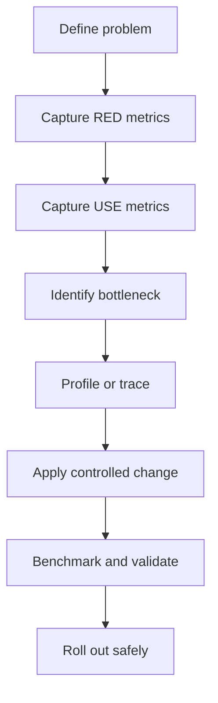
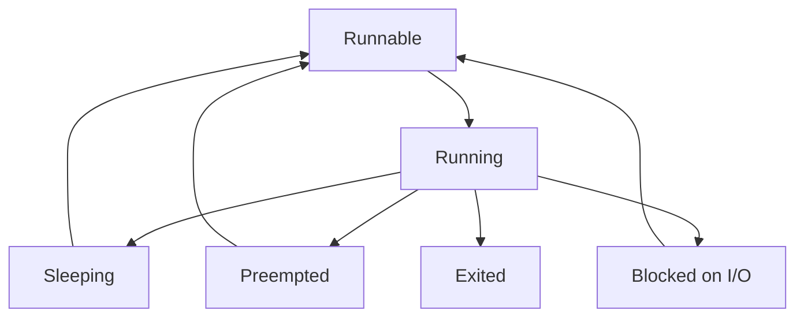
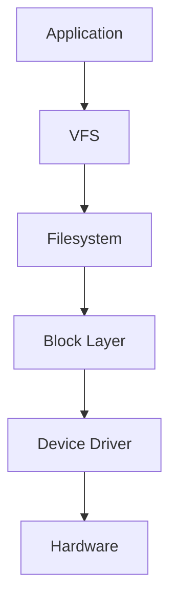
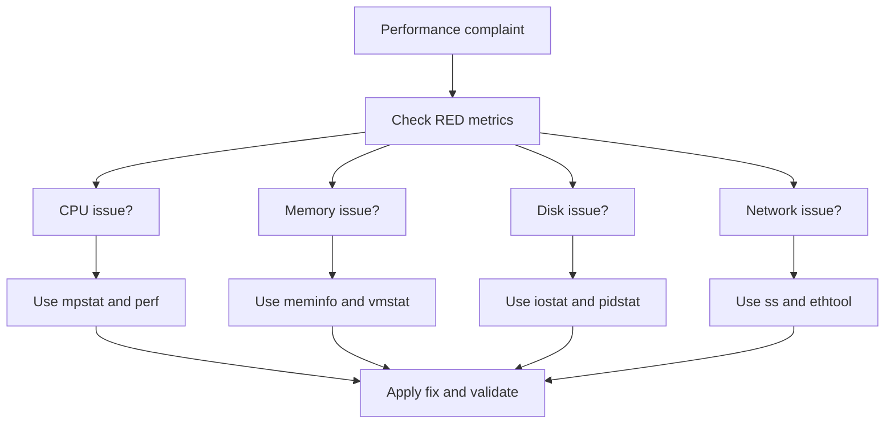

# Linux Performance Tuning Guide

A production-grade guide for Linux performance analysis and tuning.

This guide covers fundamentals through advanced topics.

It is designed for operators, SREs, platform engineers, and developers.

It emphasizes measurement before tuning.

It uses practical commands and production-safe habits.

---

## Table of Contents

1. [Introduction](#introduction)
2. [Performance Methodology](#1-performance-methodology)
3. [CPU Performance](#2-cpu-performance)
4. [Memory Performance](#3-memory-performance)
5. [Disk I/O Performance](#4-disk-io-performance)
6. [Network Performance](#5-network-performance)
7. [System Profiling](#6-system-profiling)
8. [Kernel Tuning](#7-kernel-tuning)
9. [Application Performance](#8-application-performance)
10. [Benchmarking](#9-benchmarking)
11. [Troubleshooting Scenarios](#10-troubleshooting-scenarios)
12. [Cheat Sheets](#cheat-sheets)
13. [Appendix](#appendix)

---

## Introduction

Linux performance tuning is the process of:

- measuring behavior
- finding bottlenecks
- tuning safely
- validating results

The most important rule is simple:

**Do not tune blindly.**

Always start with a question.

Examples:

- Why is p99 latency high?
- Why is throughput low?
- Why did CPU rise after a deploy?
- Why are we seeing packet drops?
- Why are processes being OOM killed?

Then gather evidence.

Then form a hypothesis.

Then change one thing at a time.

Then measure again.

### Performance dimensions

- throughput
- latency
- tail latency
- concurrency
- efficiency
- fairness
- stability
- predictability

### Common resources

- CPU
- memory
- disk
- network
- locks
- kernel paths
- application queues

### Common mistakes

- tuning without a baseline
- reading averages only
- ignoring p95 and p99
- changing many settings at once
- copying random sysctl snippets
- treating load average as CPU usage
- ignoring cgroups and NUMA
- benchmarking with unrealistic workloads

### Golden rules

1. Measure first.
2. Compare to a baseline.
3. Isolate the bottleneck.
4. Tune the bottleneck only.
5. Validate with realistic load.
6. Record the change and rollback plan.

---

# 1. Performance Methodology

Methodology prevents guesswork.

This section covers:

- USE method
- RED method
- Brendan Gregg style workflow
- baselining
- incident triage

## 1.1 USE Method

USE means:

- Utilization
- Saturation
- Errors

Apply USE to every resource.

Examples:

- CPUs
- disks
- NICs
- memory
- filesystems
- locks
- thread pools

### 1.1.1 Utilization

Utilization asks:

- How busy is the resource?
- Is it near full capacity?
- Is it spiky or sustained?

Examples:

- CPU busy percentage
- disk `%util`
- NIC link utilization
- memory bandwidth use

### 1.1.2 Saturation

Saturation asks:

- Is work waiting?
- Is there queue buildup?
- Are tasks blocked?

Examples:

- run queue length
- blocked tasks in D state
- disk queue depth
- socket backlog overflow
- lock wait time

### 1.1.3 Errors

Errors ask:

- Are operations failing?
- Are packets dropped?
- Are requests timing out?
- Are pages failing to allocate?

Examples:

- TCP retransmits
- NIC CRC errors
- I/O errors
- OOM kills
- 5xx responses

### 1.1.4 USE table

| Resource | Utilization | Saturation | Errors |
|---|---|---|---|
| CPU | `%usr`, `%sys` | run queue | throttling, machine checks |
| Memory | used, cache | reclaim pressure, swap | OOM, alloc failures |
| Disk | IOPS, throughput | queue depth, await | media errors |
| Network | bps, pps | backlog, drops | CRC, retransmits |
| App | worker use | queue wait | exceptions, timeouts |

## 1.2 RED Method

RED means:

- Rate
- Errors
- Duration

RED is ideal for services.

### 1.2.1 Rate

Examples:

- requests/sec
- queries/sec
- jobs/sec

### 1.2.2 Errors

Examples:

- HTTP 5xx rate
- timeout rate
- failed DB queries
- message processing failures

### 1.2.3 Duration

Examples:

- p50 latency
- p95 latency
- p99 latency
- max latency

### 1.2.4 USE plus RED

Use RED to see user impact.

Use USE to find resource stress.

Use both together.

Example:

- RED shows p99 API latency spike.
- USE shows disk saturation.
- Profiling shows synchronous fsync in request path.

## 1.3 Brendan Gregg style workflow

A practical flow:

1. define the complaint
2. identify whether it is current or historical
3. check recent changes
4. look at high-level service metrics
5. apply RED
6. apply USE
7. find the dominant bottleneck
8. profile and trace
9. test a hypothesis
10. validate improvement

## 1.4 Performance analysis workflow



## 1.5 Baselining

A baseline should include:

- kernel version
- distro version
- CPU model
- core count
- SMT status
- NUMA layout
- memory size
- storage type
- filesystem type
- NIC model and speed
- virtualization context
- container context
- load profile

### 1.5.1 Baseline metrics

- CPU mode percentages
- load average
- context switches/sec
- interrupts/sec
- memory available
- swap activity
- disk IOPS and latency
- queue depth
- network drops and retransmits
- service RPS
- service error rate
- service latency percentiles

## 1.6 First-response command set

```bash
uname -a
uptime
mpstat -P ALL 1 5
vmstat 1 5
iostat -xz 1 5
free -h
ss -s
ip -s link
cat /proc/pressure/cpu
cat /proc/pressure/memory
cat /proc/pressure/io
```

## 1.7 Quick interpretation matrix

| Symptom | Likely area | Start with |
|---|---|---|
| high p99 latency | queueing, storage, locks | RED, USE, profiling |
| high load average | CPU or blocked I/O | `vmstat`, `mpstat` |
| random kills | memory pressure | `dmesg`, `meminfo` |
| packet loss | NIC or network path | `ethtool`, `ip -s link` |
| poor throughput | CPU, network, storage | `perf`, `sar`, `iostat` |

## 1.8 Anti-patterns

- tuning a non-bottleneck
- forcing many sysctls at once
- using synthetic tests only
- reading a single point-in-time snapshot
- ignoring tail latency
- ignoring noisy neighbors in VMs
- ignoring cgroup throttling

## 1.9 Methodology summary

Use RED to describe impact.

Use USE to inspect resources.

Use profiling to explain cost.

Use benchmarking to validate fixes.

---

# 2. CPU Performance

CPU analysis must include:

- architecture
- scheduling
- hotspots
- interrupts
- affinity
- frequency scaling
- NUMA

## 2.1 CPU architecture basics

Key terms:

- socket
- core
- hardware thread
- cache
- NUMA node
- clock frequency
- turbo boost
- SMT

### 2.1.1 Socket

A physical CPU package.

### 2.1.2 Core

An execution engine inside the socket.

### 2.1.3 Hardware thread

A logical execution context.

### 2.1.4 Cache levels

- L1
- L2
- L3

### 2.1.5 NUMA

Local memory is faster than remote memory.

## 2.2 Scheduler overview

Linux mainly uses CFS for normal tasks.

Scheduler goals:

- fairness
- responsiveness
- load balancing
- efficient CPU use

### 2.2.1 Scheduling classes

- `SCHED_OTHER`
- `SCHED_BATCH`
- `SCHED_IDLE`
- `SCHED_FIFO`
- `SCHED_RR`
- `SCHED_DEADLINE`

### 2.2.2 CPU scheduling states



## 2.3 CPU topology inspection

### 2.3.1 `lscpu`

```bash
lscpu
```

Important fields:

- CPU(s)
- Thread(s) per core
- Core(s) per socket
- Socket(s)
- NUMA node(s)
- Model name
- CPU max MHz

### 2.3.2 `/proc/cpuinfo`

```bash
cat /proc/cpuinfo
```

Inspect:

- model name
- flags
- cache size
- siblings
- core id
- physical id

### 2.3.3 `numactl --hardware`

```bash
numactl --hardware
```

Use to view:

- nodes
- CPUs per node
- memory per node
- node distance

## 2.4 CPU metrics

Important metrics:

- `%usr`
- `%sys`
- `%nice`
- `%iowait`
- `%irq`
- `%soft`
- `%steal`
- `%idle`
- run queue length
- context switches
- interrupts

### 2.4.1 Meaning of CPU modes

| Metric | Meaning |
|---|---|
| `%usr` | user-space execution |
| `%sys` | kernel execution |
| `%iowait` | waiting on I/O |
| `%irq` | hard interrupt handling |
| `%soft` | softirq handling |
| `%steal` | time taken by hypervisor |
| `%idle` | CPU not busy |

## 2.5 Core CPU commands

### 2.5.1 `uptime`

```bash
uptime
```

Use for load averages.

### 2.5.2 `top`

```bash
top
```

Use for quick process view.

### 2.5.3 `htop`

```bash
htop
```

Use for per-core view and filtering.

### 2.5.4 `mpstat`

```bash
mpstat -P ALL 1 5
```

Use to spot:

- hot CPUs
- imbalance
- steal time
- softirq hotspots

### 2.5.5 `pidstat`

```bash
pidstat -u -t 1 5
```

Use for per-process and per-thread CPU.

## 2.6 Load average

Load average is not CPU usage.

It counts tasks in:

- runnable state
- uninterruptible sleep

Interpret carefully.

### 2.6.1 Examples

- high load + high `%usr` can mean CPU saturation
- high load + high `%iowait` can mean storage problems
- high load + low CPU can mean blocked tasks

## 2.7 Context switches

Check with:

```bash
vmstat 1 5
pidstat -w 1 5
sar -w 1 5
```

High context switching may indicate:

- too many threads
- lock contention
- frequent wakeups
- oversubscription

## 2.8 Interrupts and softirqs

Inspect:

```bash
cat /proc/interrupts
cat /proc/softirqs
```

Use to find:

- skewed IRQ placement
- NIC queue imbalance
- storage interrupt hotspots

## 2.9 `perf` basics

`perf` is essential.

### 2.9.1 `perf stat`

```bash
perf stat -d ./app
```

Useful counters:

- cycles
- instructions
- branches
- branch misses
- cache references
- cache misses
- page faults
- context switches

### 2.9.2 IPC

IPC means instructions per cycle.

Low IPC may indicate:

- memory stalls
- branch mispredicts
- poor locality
- synchronization overhead

### 2.9.3 `perf top`

```bash
perf top
```

Use for live hotspot triage.

### 2.9.4 `perf record`

```bash
perf record -F 99 -g -p <pid> -- sleep 30
```

### 2.9.5 `perf report`

```bash
perf report
```

Use for call-path analysis.

### 2.9.6 `perf sched`

```bash
perf sched record sleep 10
perf sched latency
```

Useful for scheduler delay analysis.

## 2.10 CPU affinity

CPU affinity controls where a task can run.

### 2.10.1 `taskset`

```bash
taskset -c 0-3 ./server
taskset -pc <pid>
```

Use cases:

- improve cache locality
- isolate workloads
- align CPU and memory locality
- pin interrupt threads

### 2.10.2 Risks of pinning

- overload on pinned CPUs
- less scheduler flexibility
- operational complexity

## 2.11 Frequency scaling

Inspect with:

```bash
cpupower frequency-info
```

Common governors:

- `performance`
- `powersave`
- `schedutil`
- `ondemand`

Set example:

```bash
cpupower frequency-set -g performance
```

Consider:

- latency sensitivity
- power budget
- thermal constraints
- workload burstiness

## 2.12 SMT / Hyper-Threading

SMT can improve throughput.

It can also add contention.

Benchmark with:

- SMT on
- SMT off

Especially for:

- low-latency workloads
- heavily cache-sensitive workloads
- noisy multitenant systems

## 2.13 NUMA and CPU

NUMA affects:

- memory latency
- cache behavior
- scaling across sockets

### 2.13.1 Useful commands

```bash
numactl --hardware
numastat
cat /proc/<pid>/numa_maps
```

### 2.13.2 NUMA symptoms

- poor scaling past one socket
- inconsistent latency
- high remote memory access
- migrations between nodes

### 2.13.3 `numactl`

```bash
numactl --cpunodebind=0 --membind=0 ./app
numactl --physcpubind=0-7 ./app
```

## 2.14 VM steal time

High `%steal` means CPU is being taken by the hypervisor.

Likely causes:

- oversubscribed host
- noisy neighbor
- burst credit exhaustion

## 2.15 CPU bottleneck patterns

### Pattern A

High `%usr`

Possible causes:

- hot code path
- compression
- crypto
- parsing
- busy loop

### Pattern B

High `%sys`

Possible causes:

- syscall-heavy design
- packet processing
- filesystem metadata work
- kernel lock contention

### Pattern C

High `%soft`

Possible causes:

- network packet rate
- poor IRQ distribution
- one hot RX queue

### Pattern D

High `%iowait`

Possible causes:

- slow storage
- blocked writes
- remote filesystem latency

## 2.16 CPU tuning practices

- size thread pools carefully
- avoid oversubscription
- profile before rewriting code
- use affinity only with evidence
- watch IRQ placement
- account for NUMA
- validate governor choices
- benchmark every change

## 2.17 CPU quick commands

```bash
lscpu
cat /proc/cpuinfo
mpstat -P ALL 1 5
pidstat -u -t 1 5
perf stat -d ./app
perf top
perf record -F 99 -g -p <pid> -- sleep 30
perf report
taskset -pc <pid>
numactl --hardware
numastat
cat /proc/interrupts
```

---

# 3. Memory Performance

Memory analysis is about:

- virtual memory
- page cache
- reclaim
- swapping
- OOM risk
- NUMA locality
- cgroup memory pressure

## 3.1 Memory hierarchy


## 3.2 Virtual memory basics

Important concepts:

- virtual addresses
- physical pages
- page tables
- TLB
- anonymous memory
- file-backed memory
- page faults
- copy-on-write

## 3.3 Page faults

Two common types:

- minor faults
- major faults

### 3.3.1 Minor fault

Usually no disk access.

### 3.3.2 Major fault

Usually requires disk access.

Check with:

```bash
pidstat -r 1 5
perf stat -e page-faults,minor-faults,major-faults ./app
```

## 3.4 `/proc/meminfo`

```bash
cat /proc/meminfo
```

Important fields:

- `MemTotal`
- `MemFree`
- `MemAvailable`
- `Buffers`
- `Cached`
- `SwapTotal`
- `SwapFree`
- `Dirty`
- `Writeback`
- `Slab`
- `PageTables`
- `AnonPages`
- `Mapped`
- `HugePages_Total`

### 3.4.1 `MemFree` vs `MemAvailable`

`MemFree` is often low on healthy systems.

`MemAvailable` is more useful.

## 3.5 `free`

```bash
free -h
```

Useful columns:

- total
- used
- free
- buff/cache
- available

Interpret carefully.

High cache is normal.

## 3.6 `vmstat`

```bash
vmstat 1 5
```

Important fields:

- `r`
- `b`
- `swpd`
- `free`
- `buff`
- `cache`
- `si`
- `so`
- `bi`
- `bo`
- `in`
- `cs`

### 3.6.1 Common patterns

| Pattern | Meaning |
|---|---|
| high `si` and `so` | swapping |
| high `b` | blocked tasks |
| low free but high cache | often healthy |
| sustained swap-out | memory pressure |

## 3.7 Slab memory

Kernel objects live in slab caches.

Use:

```bash
slabtop
cat /proc/slabinfo | head
```

Watch for:

- dentry growth
- inode growth
- socket-related slab growth
- unreclaimable slab growth

## 3.8 Page cache

Linux uses memory aggressively for page cache.

Benefits:

- fast reads
- fewer disk operations
- write coalescing

Do not confuse page cache growth with a memory leak.

## 3.9 Dirty pages and writeback

`Dirty` means modified pages not yet written.

`Writeback` means active flushing.

Related tunables:

- `vm.dirty_ratio`
- `vm.dirty_background_ratio`
- `vm.dirty_bytes`
- `vm.dirty_background_bytes`

## 3.10 Swap

Swap is not always bad.

But active working set swap is usually bad for latency.

### 3.10.1 Swappiness

Check:

```bash
sysctl vm.swappiness
```

Set temporarily:

```bash
sysctl -w vm.swappiness=10
```

### 3.10.2 Swap diagnostics

```bash
vmstat 1 5
sar -W 1 5
cat /proc/meminfo
```

## 3.11 OOM killer

When memory is exhausted, Linux may kill processes.

Useful commands:

```bash
dmesg | grep -i -E 'oom|killed process'
journalctl -k --no-pager | grep -i oom
cat /proc/<pid>/oom_score
cat /proc/<pid>/oom_score_adj
```

### 3.11.1 `oom_score_adj`

Range:

- `-1000`
- `1000`

Lower means less likely to be killed.

## 3.12 Huge pages

Types:

- Transparent Huge Pages
- explicit huge pages

### 3.12.1 THP checks

```bash
cat /sys/kernel/mm/transparent_hugepage/enabled
cat /sys/kernel/mm/transparent_hugepage/defrag
```

THP may help throughput.

THP may hurt latency.

Benchmark first.

### 3.12.2 Explicit huge pages

```bash
sysctl -w vm.nr_hugepages=1024
```

## 3.13 NUMA memory

Memory locality matters.

Check with:

```bash
numastat
cat /proc/<pid>/numa_maps
```

Symptoms of bad NUMA placement:

- remote access growth
- inconsistent latency
- poor scaling

## 3.14 Memory cgroups

Important cgroup v2 files:

- `memory.current`
- `memory.max`
- `memory.high`
- `memory.low`
- `memory.min`
- `memory.events`
- `memory.stat`

### 3.14.1 Meanings

- `memory.max` is a hard cap
- `memory.high` triggers pressure before hard cap
- `memory.low` protects memory from reclaim pressure
- `memory.min` is stronger protection

## 3.15 Pressure Stall Information

Check:

```bash
cat /proc/pressure/memory
```

PSI shows stalled time due to memory pressure.

## 3.16 Process memory inspection

Useful tools:

- `pmap -x <pid>`
- `/proc/<pid>/smaps`
- `/proc/<pid>/smaps_rollup`
- `smem`

## 3.17 Memory leak workflow

1. identify the process
2. check RSS and PSS growth
3. compare heap to mapped files
4. inspect cgroup events
5. check PSI
6. take application heap dump if appropriate
7. verify growth over time

## 3.18 Memory bottleneck patterns

### Pattern A

High swap and latency spikes.

Likely causes:

- memory pressure
- oversized working set
- insufficient limits

### Pattern B

High slab growth.

Likely causes:

- kernel object buildup
- filesystem cache behavior
- network structures

### Pattern C

OOM kills with free host memory.

Likely cause:

- cgroup limit too low

### Pattern D

High major faults.

Likely causes:

- cold working set
- insufficient RAM
- mmap-heavy page-in behavior

## 3.19 Memory tuning practices

- monitor `MemAvailable`
- monitor swap rates
- inspect PSI
- benchmark THP changes
- separate cache growth from leak growth
- use NUMA-aware placement
- prefer controlled cgroup protections

## 3.20 Memory quick commands

```bash
cat /proc/meminfo
free -h
vmstat 1 5
slabtop
pidstat -r 1 5
sar -B 1 5
sar -W 1 5
pmap -x <pid>
numastat
cat /proc/pressure/memory
```

---

# 4. Disk I/O Performance

Disk performance depends on:

- latency
- throughput
- IOPS
- queue depth
- access pattern
- filesystem behavior
- scheduler choice

## 4.1 Disk fundamentals

Important dimensions:

- random vs sequential
- read vs write
- sync vs async
- block size
- queue depth
- tail latency

### 4.1.1 Device types

| Device | Typical strength | Typical weakness |
|---|---|---|
| HDD | capacity | seek latency |
| SATA SSD | better latency | lower parallelism than NVMe |
| NVMe SSD | high IOPS | thermal throttling risk |
| network storage | flexibility | path latency |

## 4.2 I/O stack



## 4.3 Core disk metrics

- read IOPS
- write IOPS
- MB/sec
- await
- queue depth
- `%util`
- request size
- p99 latency

## 4.4 `iostat`

```bash
iostat -xz 1 5
```

Important fields:

- `r/s`
- `w/s`
- `rkB/s`
- `wkB/s`
- `await`
- `aqu-sz`
- `%util`

### 4.4.1 Reading `iostat`

| Pattern | Likely meaning |
|---|---|
| high `%util` + high `await` | saturation |
| high `aqu-sz` | queue buildup |
| small requests + low MB/s | random I/O |
| large requests + high MB/s | sequential I/O |

## 4.5 `iotop`

```bash
iotop -oPa
```

Use to find the top I/O processes.

## 4.6 `pidstat -d`

```bash
pidstat -d 1 5
```

Use for per-process reads, writes, and I/O delay.

## 4.7 `blktrace`

```bash
blktrace -d /dev/nvme0n1 -o - | blkparse -i -
```

Use for deep block-layer tracing.

## 4.8 eBPF storage tools

Useful tools include:

- `biolatency`
- `biosnoop`
- `bitesize`
- `filetop`
- `ext4slower`
- `xfsslower`

## 4.9 I/O schedulers

Common multiqueue schedulers:

- `mq-deadline`
- `bfq`
- `kyber`
- `none`

### 4.9.1 `mq-deadline`

Good general-purpose latency predictability.

### 4.9.2 `bfq`

Good fairness for interactive use cases.

### 4.9.3 `kyber`

Latency-oriented token-based approach.

### 4.9.4 `none`

Often suitable for modern NVMe.

### 4.9.5 Check scheduler

```bash
cat /sys/block/nvme0n1/queue/scheduler
```

### 4.9.6 Set scheduler

```bash
echo mq-deadline | sudo tee /sys/block/nvme0n1/queue/scheduler
```

## 4.10 Queue depth

Queue depth is the number of outstanding requests.

Too low:

- device underutilized

Too high:

- latency explodes

## 4.11 Read-ahead

Check:

```bash
blockdev --getra /dev/sda
```

Set example:

```bash
blockdev --setra 4096 /dev/sda
```

Good for sequential workloads.

Risky for random workloads.

## 4.12 Filesystem considerations

Common filesystems:

- ext4
- XFS
- btrfs
- ZFS

Tuning areas:

- mount options
- journaling mode
- atime behavior
- metadata overhead
- allocation strategy

### 4.12.1 Atime

Common options:

- `relatime`
- `noatime`
- `nodiratime`

## 4.13 Buffered vs direct I/O

Buffered I/O uses page cache.

Direct I/O bypasses page cache.

Both are useful.

Benchmark the one that matches the workload.

## 4.14 `fio`

`fio` is the standard benchmarking tool.

### 4.14.1 Sequential read example

```bash
fio --name=seqread --filename=testfile --size=4G --rw=read --bs=1M --iodepth=32 --direct=1 --runtime=60 --time_based
```

### 4.14.2 Random read example

```bash
fio --name=randread --filename=testfile --size=4G --rw=randread --bs=4k --iodepth=64 --direct=1 --numjobs=4 --runtime=60 --time_based
```

### 4.14.3 Mixed example

```bash
fio --name=mixed --filename=testfile --size=4G --rw=randrw --rwmixread=70 --bs=4k --iodepth=64 --direct=1 --numjobs=4 --runtime=60 --time_based
```

### 4.14.4 Important `fio` fields

- `rw`
- `bs`
- `iodepth`
- `numjobs`
- `direct`
- `runtime`
- `ioengine`
- `group_reporting`

## 4.15 Storage health

Examples:

```bash
smartctl -a /dev/sda
nvme smart-log /dev/nvme0
```

Watch for:

- media errors
- temperature
- spare capacity
- unsafe shutdowns
- controller errors

## 4.16 PSI for I/O

```bash
cat /proc/pressure/io
```

This shows stalled time due to I/O pressure.

## 4.17 Disk bottleneck patterns

### Pattern A

High await and high `%util`.

Likely cause:

- saturation

### Pattern B

High await and low `%util`.

Likely causes:

- backend latency
- network storage issues
- queueing above the block layer

### Pattern C

Periodic latency storms.

Likely causes:

- dirty page flush storms
- snapshot activity
- storage tier compaction

### Pattern D

Low throughput with many small writes.

Likely causes:

- sync writes
- metadata overhead
- journal pressure

## 4.18 Disk tuning practices

- benchmark with realistic blocks and queue depths
- watch p99 latency
- tune read-ahead only with evidence
- choose scheduler by workload and device
- keep firmware current
- validate mount options after reboot

## 4.19 Disk quick commands

```bash
iostat -xz 1 5
iotop -oPa
pidstat -d 1 5
lsblk -o NAME,SIZE,TYPE,MOUNTPOINT,SCHED
cat /sys/block/sda/queue/scheduler
blockdev --getra /dev/sda
cat /proc/pressure/io
smartctl -a /dev/sda
nvme smart-log /dev/nvme0
```

---

# 5. Network Performance

Network performance is about:

- bandwidth
- latency
- packet rate
- drops
- retransmits
- CPU overhead
- queueing

## 5.1 Bandwidth vs latency

Bandwidth is capacity.

Latency is delay.

A system may have excellent bandwidth but poor p99 latency.

## 5.2 Network metrics

- bits/sec
- packets/sec
- RTT
- retransmits
- drops
- errors
- backlog occupancy
- connection rate
- established connections

## 5.3 Core commands

### 5.3.1 `ip` and `ss`

```bash
ip -s link
ss -s
ss -ti
ss -lnt
```

### 5.3.2 `sar`

```bash
sar -n DEV 1 5
sar -n TCP,ETCP 1 5
```

### 5.3.3 `ethtool`

```bash
ethtool eth0
ethtool -k eth0
ethtool -S eth0
ethtool -g eth0
```

### 5.3.4 `nstat`

```bash
nstat -az
```

## 5.4 TCP essentials

Key concepts:

- congestion window
- receive window
- send buffer
- RTT
- slow start
- retransmission timeout
- SACK

## 5.5 Bandwidth-delay product

Formula:

`BDP = bandwidth * RTT`

If buffers are too small for BDP, throughput is capped.

## 5.6 Congestion control

Common algorithms:

- `cubic`
- `bbr`
- `reno`

Check:

```bash
sysctl net.ipv4.tcp_congestion_control
sysctl net.ipv4.tcp_available_congestion_control
```

Set example:

```bash
sysctl -w net.ipv4.tcp_congestion_control=bbr
```

## 5.7 Socket buffers

Relevant settings:

- `net.core.rmem_max`
- `net.core.wmem_max`
- `net.ipv4.tcp_rmem`
- `net.ipv4.tcp_wmem`
- `net.core.netdev_max_backlog`

Too small:

- poor throughput on high RTT paths

Too large:

- risk of bufferbloat

## 5.8 Listen backlogs

Relevant items:

- application backlog parameter
- `net.core.somaxconn`
- `net.ipv4.tcp_max_syn_backlog`

## 5.9 MTU tuning

Default often:

- 1500

Jumbo example:

- 9000

Check:

```bash
ip link show dev eth0
```

Set:

```bash
ip link set dev eth0 mtu 9000
```

Validate end to end.

## 5.10 NIC offloads

Examples:

- checksum offload
- TSO
- GSO
- GRO
- LRO

Check:

```bash
ethtool -k eth0
```

## 5.11 RSS, RPS, RFS, XPS

### 5.11.1 RSS

Hardware receive queue scaling.

### 5.11.2 RPS

Software receive packet steering.

### 5.11.3 RFS

Tries to steer packets toward CPUs running the consuming app.

### 5.11.4 XPS

Transmit queue steering.

These are important for multicore throughput and latency.

## 5.12 Interrupt coalescing

Trade-off:

- fewer interrupts
- more batching
- potentially more latency

Check and set:

```bash
ethtool -c eth0
ethtool -C eth0 rx-usecs 25
```

## 5.13 Ring buffers

Check:

```bash
ethtool -g eth0
```

Set example:

```bash
ethtool -G eth0 rx 4096 tx 4096
```

Larger rings may reduce drops.

They may also increase latency.

## 5.14 `iperf3`

Server:

```bash
iperf3 -s
```

Client:

```bash
iperf3 -c server.example.com -P 4 -t 30
```

Reverse:

```bash
iperf3 -c server.example.com -R -t 30
```

UDP:

```bash
iperf3 -c server.example.com -u -b 1G -t 30
```

## 5.15 Packet tools

Useful tools:

- `ping`
- `mtr`
- `traceroute`
- `tcpdump`
- `dropwatch`
- `bpftrace`

## 5.16 Retransmit diagnosis

Use:

```bash
ss -ti
sar -n TCP,ETCP 1 5
nstat -az | egrep 'Retrans|InErrs|OutSegs'
```

Possible causes:

- packet loss
- congestion
- overloaded receiver
- NIC issues
- path issues

## 5.17 Conntrack

Check:

```bash
sysctl net.netfilter.nf_conntrack_max
cat /proc/sys/net/netfilter/nf_conntrack_count
```

High conntrack pressure can hurt performance.

## 5.18 Container networking

Extra layers may include:

- bridge
- veth
- overlay network
- NAT
- sidecar proxy
- service mesh

Each layer adds work and queueing.

## 5.19 Network bottleneck patterns

### Pattern A

High bandwidth but one hot CPU.

Likely causes:

- small packets
- poor RSS balance
- disabled offloads

### Pattern B

High retransmits.

Likely causes:

- packet loss
- congestion
- receiver bottleneck

### Pattern C

Connection failures under burst.

Likely causes:

- backlog exhaustion
- FD exhaustion
- SYN queue saturation

### Pattern D

Good averages and bad p99.

Likely causes:

- burst queueing
- interrupt imbalance
- bufferbloat
- app pauses

## 5.20 Network tuning practices

- inspect pps as well as bps
- benchmark congestion-control changes
- verify MTU end to end
- tune RSS or RPS if one CPU is hot
- monitor drops and retransmits continuously
- validate ring-size and coalescing changes

## 5.21 Network quick commands

```bash
ip -s link
ss -s
ss -ti
sar -n DEV 1 5
sar -n TCP,ETCP 1 5
nstat -az
ethtool -S eth0
ethtool -k eth0
ethtool -g eth0
iperf3 -c server -P 4 -t 30
ping -c 10 server
mtr -rw server
```

---

# 6. System Profiling

Profiling shows where time and waits actually go.

This section covers:

- perf
- flame graphs
- strace
- ltrace
- bpftrace
- SystemTap

## 6.1 Monitoring vs profiling

Monitoring tells you:

- what happened
- when it started
- how bad it is

Profiling tells you:

- where time is spent
- which path is hot
- which syscall dominates
- which wait blocks progress

## 6.2 `perf`

`perf` supports:

- event counting
- sampling
- call graphs
- scheduler analysis
- hardware counters
- tracepoints

## 6.3 `perf stat`

```bash
perf stat -d -d -d ./app
```

Useful counters:

- cycles
- instructions
- cache misses
- branch misses
- task-clock
- context switches
- page faults

## 6.4 `perf top`

```bash
perf top
```

Use for live hotspots.

## 6.5 `perf record`

```bash
perf record -F 99 -g -p <pid> -- sleep 30
```

## 6.6 `perf report`

```bash
perf report
```

Inspect:

- inclusive cost
- exclusive cost
- user/kernel split
- call chains

## 6.7 `perf sched`

```bash
perf sched record sleep 10
perf sched timehist
```

Use for run queue and wakeup analysis.

## 6.8 Flame graphs

Flame graphs show aggregated stacks.

Interpretation:

- width = total samples
- height = stack depth

Example workflow:

```bash
perf record -F 99 -g -p <pid> -- sleep 30
perf script > out.perf
stackcollapse-perf.pl out.perf > out.folded
flamegraph.pl out.folded > flame.svg
```

## 6.9 `strace`

Use to trace syscalls.

### 6.9.1 Summary mode

```bash
strace -c -p <pid>
```

### 6.9.2 Follow forks

```bash
strace -ff -o trace.out ./app
```

### 6.9.3 Filter examples

```bash
strace -e trace=network,read,write -p <pid>
```

## 6.10 `ltrace`

Use to trace user-space library calls.

```bash
ltrace -c -p <pid>
```

## 6.11 `bpftrace`

`bpftrace` is powerful and flexible.

Example:

```bash
bpftrace -e 'tracepoint:syscalls:sys_enter_* { @[probe] = count(); }'
```

Example histogram:

```bash
bpftrace -e 'kprobe:do_sys_open { @start[tid] = nsecs; } kretprobe:do_sys_open /@start[tid]/ { @us = hist((nsecs-@start[tid])/1000); delete(@start[tid]); }'
```

## 6.12 SystemTap

SystemTap provides powerful tracing.

It is older than eBPF-based tooling.

Use it where your environment supports it and the operational cost is acceptable.

## 6.13 Off-CPU analysis

Slow applications are often waiting, not computing.

Common waits:

- disk I/O
- network I/O
- locks
- scheduler delay
- futex waits

## 6.14 Lock analysis

Useful tools:

- `perf lock`
- `perf sched`
- application profiler
- `bpftrace`

## 6.15 Profiling safety

- prefer sampling first
- keep captures short
- filter by PID or cgroup
- test profiler overhead in staging
- avoid broad tracing during severe incidents unless needed

## 6.16 Profiling workflow

1. scope the target
2. choose low-overhead method
3. capture representative interval
4. inspect hottest stacks or slowest waits
5. correlate with service metrics
6. test the fix
7. re-profile

## 6.17 Profiling quick commands

```bash
perf stat -d ./app
perf top
perf record -F 99 -g -p <pid> -- sleep 30
perf report
perf sched timehist
strace -c -p <pid>
ltrace -c -p <pid>
bpftrace -e 'profile:hz:99 { @[ustack] = count(); }'
```

---

# 7. Kernel Tuning

Kernel tuning should be:

- measured
- minimal
- documented
- reversible

## 7.1 `sysctl` basics

View:

```bash
sysctl -a
```

Read one value:

```bash
sysctl vm.swappiness
```

Set temporarily:

```bash
sysctl -w vm.swappiness=10
```

Apply persistent settings:

```bash
sysctl --system
```

## 7.2 `/proc/sys`

The same tunables are exposed in `/proc/sys`.

Example:

```bash
cat /proc/sys/vm/swappiness
echo 10 | sudo tee /proc/sys/vm/swappiness
```

## 7.3 Tuning categories

- virtual memory
- networking
- filesystem
- scheduler
- process limits
- NUMA

## 7.4 Essential sysctl table

| Parameter | Purpose | Common use |
|---|---|---|
| `vm.swappiness` | swap tendency | latency-sensitive hosts |
| `vm.dirty_ratio` | dirty page threshold | write-heavy systems |
| `vm.dirty_background_ratio` | flusher threshold | smooth writeback |
| `vm.max_map_count` | mmap area ceiling | mmap-heavy apps |
| `vm.overcommit_memory` | allocation policy | DBs and alloc-heavy apps |
| `vm.min_free_kbytes` | reserve memory | page allocation stability |
| `fs.file-max` | global FD cap | high-connection servers |
| `fs.nr_open` | per-process FD ceiling | very large FD counts |
| `net.core.somaxconn` | listen backlog cap | busy servers |
| `net.core.netdev_max_backlog` | ingress backlog | packet bursts |
| `net.ipv4.tcp_max_syn_backlog` | SYN queue | connection bursts |
| `net.ipv4.ip_local_port_range` | ephemeral ports | many outbound connections |
| `net.core.rmem_max` | max recv buffer | high-BDP paths |
| `net.core.wmem_max` | max send buffer | high-BDP paths |
| `kernel.pid_max` | max PID | high process churn |
| `kernel.threads-max` | max threads | thread-heavy apps |
| `kernel.numa_balancing` | auto NUMA balancing | NUMA-aware tuning |

## 7.5 Virtual memory tunables

### 7.5.1 `vm.swappiness`

Lower values usually reduce swap preference.

Test under pressure.

### 7.5.2 Dirty page settings

Relevant:

- `vm.dirty_ratio`
- `vm.dirty_background_ratio`
- `vm.dirty_bytes`
- `vm.dirty_background_bytes`

### 7.5.3 `vm.overcommit_memory`

Values:

- `0`
- `1`
- `2`

### 7.5.4 `vm.max_map_count`

Important for some mmap-heavy services.

## 7.6 Filesystem and FD tunables

### 7.6.1 `fs.file-max`

Global file descriptor limit.

Check:

```bash
sysctl fs.file-max
```

### 7.6.2 `fs.nr_open`

Upper bound for per-process open files.

## 7.7 Network tunables

### 7.7.1 `net.core.somaxconn`

Maximum listen backlog.

### 7.7.2 `net.core.netdev_max_backlog`

Ingress queue backlog.

### 7.7.3 `net.ipv4.tcp_max_syn_backlog`

Queue for pending SYNs.

### 7.7.4 `net.ipv4.ip_local_port_range`

Ephemeral source port range.

### 7.7.5 `net.ipv4.tcp_rmem`

TCP receive buffer autotuning range.

### 7.7.6 `net.ipv4.tcp_wmem`

TCP send buffer autotuning range.

## 7.8 NUMA tuning

`kernel.numa_balancing` can help or hurt depending on workload.

Benchmark before changing.

## 7.9 Safe rollout pattern

1. document current value
2. define success metric
3. change one parameter
4. test in staging
5. canary in production
6. monitor RED and USE
7. keep rollback ready

## 7.10 Example sysctl file

```conf
# /etc/sysctl.d/99-performance.conf
vm.swappiness = 10
vm.dirty_background_ratio = 5
vm.dirty_ratio = 20
fs.file-max = 2097152
net.core.somaxconn = 4096
net.core.netdev_max_backlog = 250000
net.ipv4.tcp_max_syn_backlog = 8192
net.ipv4.ip_local_port_range = 10240 65535
```

## 7.11 Kernel tuning anti-patterns

- copy-paste sysctl bundles
- tuning without baseline
- mixing unrelated changes
- raising limits with no capacity model
- ignoring kernel version differences

## 7.12 Kernel tuning practices

- prefer well-understood settings
- document reasons for every non-default value
- use configuration management
- benchmark every change
- validate after reboot and deploy

## 7.13 Kernel quick commands

```bash
sysctl -a
sysctl vm.swappiness
sysctl net.core.somaxconn
sysctl fs.file-max
cat /proc/sys/vm/swappiness
cat /proc/sys/net/core/somaxconn
sysctl --system
```

---

# 8. Application Performance

Application behavior often dominates system behavior.

This section covers:

- ulimits
- cgroups v1 vs v2
- nice and ionice
- OOM controls
- queueing and thread pools

## 8.1 `ulimit`

Check:

```bash
ulimit -a
```

Important limits:

- open files
- max user processes
- stack size
- locked memory
- core file size

### 8.1.1 Open files

Check:

```bash
ulimit -n
cat /proc/<pid>/limits
```

Low FD limits can cap scale.

## 8.2 `nice`

Adjust CPU priority for normal tasks.

Examples:

```bash
nice -n 10 batch_job
renice -n -5 -p <pid>
```

## 8.3 `ionice`

Adjust I/O priority.

Examples:

```bash
ionice -c2 -n0 -p <pid>
ionice -c3 -p <pid>
```

Useful for background jobs.

## 8.4 cgroups v1 vs v2

### 8.4.1 cgroups v1

Characteristics:

- multiple hierarchies
- inconsistent semantics
- older tooling model

### 8.4.2 cgroups v2

Characteristics:

- unified hierarchy
- cleaner semantics
- better protections and pressure reporting

## 8.5 CPU cgroup controls

Important files in v2:

- `cpu.max`
- `cpu.weight`
- `cpu.stat`
- `cpu.pressure`

### 8.5.1 `cpu.max`

Example:

```bash
echo "200000 100000" > cpu.max
```

## 8.6 Memory cgroup controls

Important files:

- `memory.current`
- `memory.max`
- `memory.high`
- `memory.low`
- `memory.events`

## 8.7 I/O cgroup controls

Important files:

- `io.max`
- `io.weight`
- `io.stat`
- `io.pressure`

## 8.8 pids controller

Important files:

- `pids.max`
- `pids.current`

Useful to prevent runaway forks.

## 8.9 OOM score adjustment

Check:

```bash
cat /proc/<pid>/oom_score
cat /proc/<pid>/oom_score_adj
```

Set example:

```bash
echo -500 > /proc/<pid>/oom_score_adj
```

Use sparingly.

## 8.10 Thread pools

Common mistakes:

- too many threads
- too few threads
- blocking work in CPU pools
- unbounded queues

Practical guidance:

- separate CPU-bound and I/O-bound pools
- measure queue wait time
- set bounds
- monitor task rejection and timeout rates

## 8.11 Connection pools

Connection pools should be:

- bounded
- instrumented
- sized to backend capacity

## 8.12 Allocators

Allocator choice can affect:

- RSS
- fragmentation
- latency
- CPU overhead

Examples:

- glibc malloc
- jemalloc
- tcmalloc

## 8.13 Startup and warmup

Performance may differ between:

- cold start
- warm cache
- post-failover
- autoscaled new instance

Benchmark all important phases.

## 8.14 Containers and orchestration

Consider:

- requests vs limits
- CPU throttling
- memory limits
- storage class latency
- sidecar overhead
- service mesh cost

## 8.15 Application tuning practices

- tune app and OS together
- track queue time
- keep limits version-controlled
- validate cgroup behavior under load
- protect critical services thoughtfully

## 8.16 Application quick commands

```bash
ulimit -a
cat /proc/<pid>/limits
nice -n 10 ./batch_job
renice -n -5 -p <pid>
ionice -c2 -n7 -p <pid>
cat /proc/<pid>/oom_score
cat /proc/<pid>/oom_score_adj
cat /sys/fs/cgroup/cpu.max
cat /sys/fs/cgroup/memory.current
cat /sys/fs/cgroup/io.stat
```

---

# 9. Benchmarking

Benchmarking proves whether tuning helped.

This section covers:

- benchmark design
- popular tools
- methodology best practices
- interpretation

## 9.1 Benchmarking principles

- define the goal
- define the metric
- match production-like load
- warm up first
- run long enough
- repeat runs
- capture variance
- collect system metrics in parallel

## 9.2 Record these for every benchmark

- hardware
- kernel
- distro
- governor
- NUMA layout
- storage type
- filesystem
- NIC type
- tool version
- command line
- duration
- warmup duration
- concurrency
- latency percentiles
- errors
- CPU usage

## 9.3 Common pitfalls

- short tests only
- cached reads mistaken for storage performance
- no warmup
- load generator saturation
- averages only
- different environments compared unfairly

## 9.4 `sysbench`

### 9.4.1 CPU example

```bash
sysbench cpu --cpu-max-prime=20000 run
```

### 9.4.2 Memory example

```bash
sysbench memory --memory-block-size=1M --memory-total-size=10G run
```

### 9.4.3 Threads example

```bash
sysbench threads --threads=64 --time=30 run
```

### 9.4.4 File I/O example

```bash
sysbench fileio --file-total-size=10G prepare
sysbench fileio --file-total-size=10G --file-test-mode=rndrw --time=60 --max-requests=0 run
sysbench fileio --file-total-size=10G cleanup
```

## 9.5 `fio`

Use for realistic storage tests.

Focus on:

- block size
- queue depth
- numjobs
- direct vs buffered I/O
- p95 and p99 latency

## 9.6 `iperf3`

Use for network bandwidth and UDP loss testing.

Test:

- both directions
- single stream
- parallel streams
- realistic duration

## 9.7 HTTP tools

Common tools:

- `ab`
- `wrk`
- `hey`

### 9.7.1 `ab`

```bash
ab -n 100000 -c 200 http://127.0.0.1:8080/
```

### 9.7.2 `wrk`

```bash
wrk -t8 -c400 -d60s http://127.0.0.1:8080/
```

### 9.7.3 `hey`

```bash
hey -n 100000 -c 200 http://127.0.0.1:8080/
```

## 9.8 `stress-ng`

Useful for:

- contention tests
- thermal tests
- alert validation
- reproducing resource pressure

Examples:

```bash
stress-ng --cpu 8 --timeout 60s
stress-ng --vm 4 --vm-bytes 80% --timeout 60s
stress-ng --hdd 4 --timeout 60s
```

## 9.9 `unixbench`

Useful as a broad synthetic suite.

Do not rely on it alone for production decisions.

## 9.10 Percentiles

Always collect:

- p50
- p90
- p95
- p99
- max if useful

## 9.11 Coordinated omission

Some load generators under-report latency during pauses.

Know your tool.

## 9.12 Benchmark interpretation

| Observation | Meaning |
|---|---|
| throughput rises with stable latency | headroom remains |
| throughput plateaus and latency rises | saturation |
| CPU low and latency high | non-CPU bottleneck |
| one core hot and others idle | poor parallelism |
| errors appear before saturation | stability limit reached |

## 9.13 Sample benchmark plan

1. define baseline
2. warm up for 10 minutes
3. run 5 trials
4. collect host metrics
5. collect service metrics
6. compare medians and percentiles
7. change one variable
8. repeat using same method

## 9.14 Benchmarking practices

- use realistic concurrency
- use representative payloads
- capture environment details
- benchmark after each change
- keep result logs and commands together

## 9.15 Benchmarking quick commands

```bash
sysbench cpu --cpu-max-prime=20000 run
sysbench memory --memory-block-size=1M --memory-total-size=10G run
fio --name=randread --filename=testfile --size=4G --rw=randread --bs=4k --iodepth=64 --direct=1 --runtime=60 --time_based
iperf3 -c server -P 4 -t 30
wrk -t8 -c400 -d60s http://127.0.0.1:8080/
hey -n 100000 -c 200 http://127.0.0.1:8080/
stress-ng --cpu 8 --timeout 60s
```

---

# 10. Troubleshooting Scenarios

This section gives step-by-step diagnosis patterns.

## 10.1 Troubleshooting decision tree



## 10.2 High CPU

### Symptoms

- high `%usr` or `%sys`
- rising load average
- high queue time
- latency increase

### Workflow

1. confirm user impact
2. run `mpstat -P ALL 1 5`
3. check `top -H -p <pid>`
4. run `pidstat -u -t 1 5`
5. run `perf top`
6. inspect interrupts
7. inspect cgroup CPU stats
8. inspect governor and throttling
9. test a fix
10. validate with same load

### Common causes

- hot loop
- serialization overhead
- heavy compression
- crypto cost
- packet processing overload
- too many threads
- CPU throttling

## 10.3 Memory leak or pressure

### Symptoms

- rising RSS
- swap growth
- OOM kills
- kswapd CPU
- latency spikes

### Workflow

1. check `free -h`
2. check `cat /proc/meminfo`
3. run `vmstat 1 5`
4. inspect PSI
5. identify top memory process
6. inspect `pmap -x <pid>`
7. inspect cgroup memory events
8. inspect OOM logs
9. confirm trend over time
10. fix leak or limit issue

### Common causes

- unbounded cache
- object retention
- fragmentation
- low container limit
- excessive writeback pressure

## 10.4 Disk bottleneck

### Symptoms

- high `%iowait`
- high `await`
- blocked tasks
- write latency spikes

### Workflow

1. run `iostat -xz 1 5`
2. run `pidstat -d 1 5`
3. run `iotop`
4. inspect filesystem mount options
5. inspect dirty and writeback fields
6. inspect scheduler
7. inspect device health
8. trace with `blktrace` or BPF if needed
9. reproduce safely with `fio`
10. validate the change

### Common causes

- sync writes
- shared storage saturation
- metadata-heavy workload
- poor scheduler choice
- read-ahead mismatch
- writeback storms

## 10.5 Network latency or drops

### Symptoms

- timeouts
- retransmits
- packet drops
- poor throughput
- p99 spikes

### Workflow

1. check service RED
2. run `ss -s`
3. run `sar -n DEV,TCP,ETCP 1 5`
4. inspect `ip -s link`
5. inspect `ethtool -S`
6. verify MTU
7. inspect RSS and IRQ balance
8. benchmark with `iperf3`
9. capture packets if needed
10. validate after tuning

### Common causes

- one hot queue
- packet loss in path
- backlog exhaustion
- conntrack pressure
- MTU mismatch
- disabled offloads

## 10.6 High load average with low CPU

Likely causes:

- blocked I/O
- D-state tasks
- network filesystem stalls
- kernel waits

Use:

```bash
vmstat 1 5
ps -eo pid,state,wchan,cmd | grep ' D '
iostat -xz 1 5
```

## 10.7 Container CPU throttling

Check:

```bash
cat /sys/fs/cgroup/cpu.stat
```

High throttling counters indicate quota pressure.

## 10.8 NUMA latency issue

Use:

```bash
numastat
numactl --hardware
cat /proc/<pid>/numa_maps
```

Fix by aligning CPU and memory placement.

## 10.9 Excessive context switching

Use:

```bash
vmstat 1 5
pidstat -w 1 5
```

Likely causes:

- too many threads
- lock contention
- wakeup storms

## 10.10 Softirq saturation

Use:

```bash
mpstat -P ALL 1 5
cat /proc/softirqs
cat /proc/interrupts
```

Fix by balancing queues and interrupts.

## 10.11 Troubleshooting practices

- compare against baseline
- capture evidence before restart
- validate against user-facing metrics
- document command outputs that mattered

---

# Cheat Sheets

## Quick triage

```bash
uptime
mpstat -P ALL 1 5
vmstat 1 5
iostat -xz 1 5
free -h
ss -s
ip -s link
cat /proc/pressure/cpu
cat /proc/pressure/memory
cat /proc/pressure/io
```

## CPU cheat sheet

- `lscpu`
- `mpstat -P ALL 1 5`
- `pidstat -u -t 1 5`
- `perf top`
- `perf record`
- `taskset`
- `numastat`
- `/proc/interrupts`

## Memory cheat sheet

- `/proc/meminfo`
- `free -h`
- `vmstat 1 5`
- `slabtop`
- `pmap -x <pid>`
- `/proc/pressure/memory`
- `numastat`

## Disk cheat sheet

- `iostat -xz 1 5`
- `pidstat -d 1 5`
- `iotop -oPa`
- `lsblk -o NAME,SIZE,TYPE,MOUNTPOINT,SCHED`
- `/sys/block/*/queue/scheduler`
- `fio`
- `/proc/pressure/io`

## Network cheat sheet

- `ip -s link`
- `ss -s`
- `sar -n DEV 1 5`
- `sar -n TCP,ETCP 1 5`
- `ethtool -S eth0`
- `ethtool -k eth0`
- `iperf3`
- `tcpdump`

## Kernel cheat sheet

- `sysctl -a`
- `sysctl vm.swappiness`
- `sysctl net.core.somaxconn`
- `sysctl fs.file-max`
- `/proc/sys/*`

## Application cheat sheet

- `ulimit -a`
- `/proc/<pid>/limits`
- `/proc/<pid>/oom_score`
- `/proc/<pid>/oom_score_adj`
- `/sys/fs/cgroup/cpu.max`
- `/sys/fs/cgroup/memory.current`
- `/sys/fs/cgroup/io.stat`

---

# Appendix

## Appendix A: Useful `/proc` files

| File | Purpose |
|---|---|
| `/proc/cpuinfo` | CPU details |
| `/proc/meminfo` | memory summary |
| `/proc/interrupts` | IRQ distribution |
| `/proc/softirqs` | softirq counters |
| `/proc/loadavg` | system load averages |
| `/proc/diskstats` | disk stats |
| `/proc/net/dev` | interface counters |
| `/proc/pressure/cpu` | CPU PSI |
| `/proc/pressure/memory` | memory PSI |
| `/proc/pressure/io` | I/O PSI |

## Appendix B: PSI overview

PSI tells you how much time tasks lose waiting on resources.

Useful commands:

```bash
cat /proc/pressure/cpu
cat /proc/pressure/memory
cat /proc/pressure/io
```

## Appendix C: Metrics to pair with host metrics

- request rate
- error rate
- timeout rate
- p50 latency
- p95 latency
- p99 latency
- queue depth
- connection pool usage
- worker utilization
- cache hit ratio

## Appendix D: Tuning change template

```text
Date:
Host or cluster:
Service:
Problem:
Baseline:
Change:
Reason:
Validation:
Result:
Rollback:
Owner:
```

## Appendix E: Review questions

1. What changed recently?
2. Which metric defines the problem?
3. Which resource is saturated?
4. What evidence proves the bottleneck?
5. What metric proves the improvement?
6. What trade-off does the tuning introduce?

---

# Extended Reference Notes

The following note blocks intentionally expand the guide into a field reference.

They provide concise reminders and operational heuristics.

## CPU Extended Notes

### CPU note 001

A single saturated core can bottleneck a whole service.

### CPU note 002

Per-core data matters more than averages.

### CPU note 003

High load average does not guarantee CPU saturation.

### CPU note 004

High `%sys` usually deserves profiling.

### CPU note 005

High `%soft` often points to network receive work.

### CPU note 006

High `%irq` may indicate a device interrupt storm.

### CPU note 007

Context-switch storms waste useful CPU time.

### CPU note 008

Too many runnable threads increase latency.

### CPU note 009

Low IPC often means memory stalls or branch misses.

### CPU note 010

Cache locality matters more than many teams expect.

### CPU note 011

CPU pinning is powerful and easy to misuse.

### CPU note 012

IRQ affinity changes should be benchmarked.

### CPU note 013

NUMA-unaware scheduling can flatten scaling.

### CPU note 014

Thermal throttling can mimic mystery regressions.

### CPU note 015

Governor changes can affect latency variance.

### CPU note 016

`perf top` is ideal for fast incident triage.

### CPU note 017

`perf record` is better for root-cause reports.

### CPU note 018

Hot functions are not always the correct fix target.

### CPU note 019

Inclusive cost often matters more than leaf cost.

### CPU note 020

One hot lock can create many “CPU issues.”

### CPU note 021

Busy loops often hide behind “healthy” system metrics.

### CPU note 022

High thread count is not the same as high parallelism.

### CPU note 023

SMT helps some workloads and hurts others.

### CPU note 024

Benchmark SMT changes under real latency goals.

### CPU note 025

Hypervisor steal time is outside guest control.

### CPU note 026

One noisy neighbor can distort VM benchmarks.

### CPU note 027

Packet-rate workloads can be CPU-bound far below line rate.

### CPU note 028

Scheduler delay can exist even when average CPU is moderate.

### CPU note 029

CPU migrations can destroy cache warmth.

### CPU note 030

Run queue length is a saturation signal, not a performance guarantee.

### CPU note 031

Check softirqs when NIC throughput rises suddenly.

### CPU note 032

Use thread-level views for multithreaded services.

### CPU note 033

High `%usr` often means application optimization opportunity.

### CPU note 034

High `%sys` often means syscall or kernel-path review.

### CPU note 035

Use `strace -c` when syscalls are suspected.

### CPU note 036

Small packet traffic stresses CPUs differently than large transfers.

### CPU note 037

More workers can increase throughput until queueing dominates.

### CPU note 038

Tail latency often rises before average CPU looks scary.

### CPU note 039

CPU isolation is advanced and workload-specific.

### CPU note 040

Measure the benefit of every affinity choice.

## Memory Extended Notes

### Memory note 001

Low free memory alone is not a problem.

### Memory note 002

`MemAvailable` is usually the better headline metric.

### Memory note 003

Page cache is productive memory use.

### Memory note 004

Swap use is not automatically bad.

### Memory note 005

Active swap-in during peak traffic is usually bad.

### Memory note 006

Major faults deserve attention.

### Memory note 007

Slab growth can be a clue to kernel-side accumulation.

### Memory note 008

THP is workload-dependent.

### Memory note 009

THP can help throughput and hurt latency.

### Memory note 010

Compaction overhead can appear as CPU cost.

### Memory note 011

Cgroup memory limits can trigger OOM on otherwise healthy hosts.

### Memory note 012

`memory.high` often gives gentler control than `memory.max`.

### Memory note 013

NUMA memory placement affects CPU efficiency too.

### Memory note 014

Allocator fragmentation can keep RSS high.

### Memory note 015

Unbounded caches are a classic leak pattern.

### Memory note 016

Managed runtimes need runtime-specific memory telemetry.

### Memory note 017

`kswapd` activity can reveal global pressure.

### Memory note 018

Direct reclaim hurts latency.

### Memory note 019

Dirty-page bursts can feel like memory issues and storage issues at once.

### Memory note 020

PSI is excellent for identifying chronic pressure.

### Memory note 021

Page tables matter on large-memory systems.

### Memory note 022

Mapped files can confuse leak investigations.

### Memory note 023

Measure RSS, PSS, and heap separately when possible.

### Memory note 024

OOM score adjustment should be used carefully.

### Memory note 025

Protecting one process makes others more killable.

### Memory note 026

THP defrag settings can influence latency behavior.

### Memory note 027

Huge pages can reduce TLB pressure.

### Memory note 028

Huge page reservation needs capacity planning.

### Memory note 029

Page cache growth after deploy may be normal warmup.

### Memory note 030

A memory graph without swap and PSI is incomplete.

### Memory note 031

Check `smaps_rollup` for fast process memory inspection.

### Memory note 032

Frequent OOMs are often configuration problems, not kernel problems.

### Memory note 033

Use historical trends, not only snapshots.

### Memory note 034

Memory leaks can surface first as latency regressions.

### Memory note 035

Leaks inside containers may look like random restarts.

### Memory note 036

Remote NUMA access increases effective memory latency.

### Memory note 037

Benchmark allocator changes under real fragmentation patterns.

### Memory note 038

Write-heavy workloads need VM and storage analysis together.

### Memory note 039

Low swappiness does not replace enough RAM.

### Memory note 040

Good memory tuning starts with understanding the working set.

## Disk Extended Notes

### Disk note 001

Average throughput hides latency pain.

### Disk note 002

p99 storage latency matters for databases.

### Disk note 003

Queue depth is both a tool and a risk.

### Disk note 004

Small synchronous writes are expensive.

### Disk note 005

Metadata-heavy workloads may saturate before raw media does.

### Disk note 006

Filesystem choice affects behavior under load.

### Disk note 007

Writeback storms can create periodic latency spikes.

### Disk note 008

Read-ahead helps only when access is sufficiently sequential.

### Disk note 009

Cloud storage often has hidden caps and burst models.

### Disk note 010

`fio` should mimic application access patterns.

### Disk note 011

`direct=1` is useful when measuring the device, not cache.

### Disk note 012

Buffered I/O may better represent some application behavior.

### Disk note 013

NVMe can still saturate and throttle thermally.

### Disk note 014

Shared storage requires end-to-end visibility.

### Disk note 015

A quiet host can still suffer from remote array latency.

### Disk note 016

Check firmware and health before blaming Linux.

### Disk note 017

Mount options should match durability requirements.

### Disk note 018

Dropping atime updates can reduce metadata writes.

### Disk note 019

IOPS alone is not enough; capture latency percentiles.

### Disk note 020

One busy log path can distort a whole service.

### Disk note 021

Separate data and log devices where it makes sense.

### Disk note 022

Flush behavior often matters more than peak read speed.

### Disk note 023

Storage benchmarks need warmup and steady state.

### Disk note 024

Background snapshots and backups can mimic device saturation.

### Disk note 025

Use PSI to see whether applications are actually stalled.

### Disk note 026

High `%util` is not a universal saturation law on all devices.

### Disk note 027

Interpret `iostat` in the context of device type.

### Disk note 028

Deep queues can flatter throughput while wrecking p99.

### Disk note 029

Tune scheduler choice per workload, not by folklore.

### Disk note 030

The best write is the one you avoid creating.

### Disk note 031

Compression can trade CPU for disk efficiency.

### Disk note 032

Filesystem journal behavior shapes latency under burst writes.

### Disk note 033

Use BPF tools for slow file-operation visibility.

### Disk note 034

File-level latency tools are often more actionable than raw block traces.

### Disk note 035

RAID rebuilds can invalidate normal benchmarks.

### Disk note 036

Controller cache policy changes should be documented and benchmarked.

### Disk note 037

Block size selection dominates measured results.

### Disk note 038

Request size histograms explain many surprises.

### Disk note 039

Never compare cached and direct results as equals.

### Disk note 040

Always validate with the real filesystem and mount options.

## Network Extended Notes

### Network note 001

Bandwidth and latency are different problems.

### Network note 002

Packets per second often drive CPU cost.

### Network note 003

TCP retransmits are symptoms, not root causes.

### Network note 004

Small packets can saturate one core quickly.

### Network note 005

Good average RTT can hide bad jitter.

### Network note 006

Jumbo frames require end-to-end support.

### Network note 007

Offloads change CPU cost profiles.

### Network note 008

Interrupt coalescing trades latency for efficiency.

### Network note 009

RSS balance matters for multicore scaling.

### Network note 010

RPS can help when hardware queues are limited.

### Network note 011

RFS can improve locality for socket consumers.

### Network note 012

XPS matters on high transmit workloads.

### Network note 013

Backlog settings need app and kernel alignment.

### Network note 014

One overloaded queue can distort the whole host.

### Network note 015

Ring sizes can reduce drops and increase latency.

### Network note 016

Bufferbloat can make throughput look good and UX look bad.

### Network note 017

Service meshes add measurable latency and CPU overhead.

### Network note 018

Conntrack pressure can become the hidden bottleneck.

### Network note 019

Measure both send and receive directions.

### Network note 020

`iperf3` results depend on stream count and path RTT.

### Network note 021

Benchmark congestion-control changes, do not assume them.

### Network note 022

Socket buffer limits can cap throughput silently.

### Network note 023

Receive-path CPU limits often appear as packet drops.

### Network note 024

Use `ethtool -S` before and after a tuning change.

### Network note 025

Packet capture filters are part of good operations.

### Network note 026

Retransmits from the sender can still mean receiver overload.

### Network note 027

Path MTU issues can produce strange intermittent slowness.

### Network note 028

QoS and queue discipline settings matter on shaped links.

### Network note 029

Latency-sensitive apps should care about jitter, not only mean RTT.

### Network note 030

NIC driver and firmware versions are performance variables.

### Network note 031

Cloud networking limits should be part of capacity planning.

### Network note 032

UDP apps must design for visibility into loss and backlog.

### Network note 033

A host can show low bandwidth yet be CPU-bound on packet processing.

### Network note 034

Many outbound connections can exhaust ephemeral ports.

### Network note 035

Burst traffic can break systems that pass steady-state tests.

### Network note 036

Tune queueing with both pps and latency data in hand.

### Network note 037

Use MTR for path behavior, not just a single ping.

### Network note 038

Cross-zone and cross-region paths need different tuning assumptions.

### Network note 039

Load balancers and proxies must be part of the performance model.

### Network note 040

The cheapest packet is the packet you never send.

## Profiling Extended Notes

### Profiling note 001

A profile should overlap the actual problem window.

### Profiling note 002

Short, targeted captures are often enough.

### Profiling note 003

Sampling is usually safer than tracing everything.

### Profiling note 004

Symbols matter for useful call graphs.

### Profiling note 005

User and kernel stacks together are often most valuable.

### Profiling note 006

Off-CPU analysis explains many latency mysteries.

### Profiling note 007

A hot syscall may reflect application design.

### Profiling note 008

Flame graphs are visual summaries, not explanations by themselves.

### Profiling note 009

Investigate wide frames first.

### Profiling note 010

Do not optimize a frame without understanding why it is hot.

### Profiling note 011

High sampling frequency increases detail and overhead.

### Profiling note 012

Tracepoints are often safer than raw probes.

### Profiling note 013

`strace -c` is excellent for syscall mix triage.

### Profiling note 014

`ltrace` is useful when library behavior matters.

### Profiling note 015

Use `perf sched` for wakeup and run queue issues.

### Profiling note 016

Lock contention often looks like poor scaling.

### Profiling note 017

Profiles after a fix are mandatory.

### Profiling note 018

Container profiling may require host-side visibility.

### Profiling note 019

Keep profiler overhead in mind for sensitive services.

### Profiling note 020

Profiling without workload context can mislead.

### Profiling note 021

Correlate stack evidence with RED and USE metrics.

### Profiling note 022

Small code changes can move hotspots rather than remove them.

### Profiling note 023

Exclusive cost and inclusive cost tell different stories.

### Profiling note 024

Request tagging plus profiling is powerful when available.

### Profiling note 025

System-wide captures help when the culprit process is unknown.

### Profiling note 026

Per-PID captures help reduce noise.

### Profiling note 027

Scheduler profiles help explain latency variance.

### Profiling note 028

Kernel-path hotspots often need both tracepoints and counters.

### Profiling note 029

Flame graphs do not show wall time directly.

### Profiling note 030

Measure first, then instrument deeper.

## Kernel Extended Notes

### Kernel note 001

Every sysctl change should answer a real need.

### Kernel note 002

Default settings are not random.

### Kernel note 003

Old tuning advice may be wrong on modern kernels.

### Kernel note 004

Tune one parameter at a time.

### Kernel note 005

Write down both default and tuned values.

### Kernel note 006

Use config management to avoid drift.

### Kernel note 007

Network tunables should match actual path RTT and throughput goals.

### Kernel note 008

Dirty-page tuning affects storage behavior strongly.

### Kernel note 009

Global FD limits need memory-awareness too.

### Kernel note 010

Raising limits without capacity planning is not tuning.

### Kernel note 011

NUMA balancing changes should be benchmarked.

### Kernel note 012

Reboot persistence must be verified.

### Kernel note 013

Document rationale inside sysctl files.

### Kernel note 014

A throughput gain may hide a latency regression.

### Kernel note 015

Avoid applying giant sysctl bundles from blogs.

### Kernel note 016

Kernel tuning cannot replace bad application queue design.

### Kernel note 017

Prefer well-known knobs with clear evidence.

### Kernel note 018

Use canaries for production rollout.

### Kernel note 019

Check interactions with container runtime defaults.

### Kernel note 020

Check interactions with cloud vendor recommendations.

### Kernel note 021

The best kernel tuning is often no tuning at all when no bottleneck exists.

### Kernel note 022

`vm.swappiness` is not a universal magic number.

### Kernel note 023

Backlog settings need application-level support to matter.

### Kernel note 024

`vm.overcommit_memory` changes app behavior and failure modes.

### Kernel note 025

Kernel versions may rename, deprecate, or rework behavior around tunables.

### Kernel note 026

Test rollback as seriously as rollout.

### Kernel note 027

Watch for side effects in unrelated services.

### Kernel note 028

Tune for workload class, not abstract “performance.”

### Kernel note 029

Latency-sensitive nodes and batch nodes often need different policies.

### Kernel note 030

A tuning catalog without evidence becomes operational debt.

## Application Extended Notes

### Application note 001

Unbounded internal queues are latency traps.

### Application note 002

Backpressure is a performance feature.

### Application note 003

File descriptors are a common hidden scale limit.

### Application note 004

Connection pools should match backend capacity.

### Application note 005

CPU quotas can create periodic throttling cliffs.

### Application note 006

Too many workers increase contention.

### Application note 007

Too few workers waste capacity.

### Application note 008

Queue wait time belongs in every latency budget.

### Application note 009

Request batching can reduce overhead dramatically.

### Application note 010

Logging cost should be measured under peak load.

### Application note 011

Tracing overhead should be benchmarked, not assumed.

### Application note 012

Metrics cardinality can become a performance issue.

### Application note 013

Allocator choice can change both RSS and latency.

### Application note 014

Warmup matters for autoscaled services.

### Application note 015

Bounded caches beat surprise memory explosions.

### Application note 016

Graceful degradation improves perceived performance under stress.

### Application note 017

Background jobs should often run with lower priority.

### Application note 018

CPU-bound and I/O-bound work should not share the same pool casually.

### Application note 019

Timeouts should reflect actual service-level goals.

### Application note 020

Retries amplify overload when backoff is poor.

### Application note 021

Containers change the meaning of host-level free capacity.

### Application note 022

Sidecars must be included in CPU and memory budgets.

### Application note 023

Health probes can become self-inflicted load.

### Application note 024

Large default stack sizes can waste memory at scale.

### Application note 025

Do not use OOM protection to hide memory leaks.

### Application note 026

Observe queue rejection and shed load deliberately.

### Application note 027

Use admission control when queues become dangerous.

### Application note 028

Connection churn can exhaust ports and FDs before CPU saturates.

### Application note 029

Each app runtime has its own tuning surface beyond Linux.

### Application note 030

App tuning and OS tuning should be tested together.

## Benchmarking Extended Notes

### Benchmarking note 001

Every benchmark needs a question.

### Benchmarking note 002

If you cannot reproduce the command, you cannot trust the result.

### Benchmarking note 003

Warm caches change results.

### Benchmarking note 004

JIT compilation changes results.

### Benchmarking note 005

Storage needs steady-state benchmarking.

### Benchmarking note 006

Multiple trials beat one lucky run.

### Benchmarking note 007

Keep the environment quiet between runs.

### Benchmarking note 008

Load generators can become the bottleneck.

### Benchmarking note 009

Capture latency percentiles every time.

### Benchmarking note 010

Averages hide queueing.

### Benchmarking note 011

Use the same environment for before/after tests.

### Benchmarking note 012

Document kernel and firmware versions.

### Benchmarking note 013

Thermal equilibrium matters.

### Benchmarking note 014

Cloud burst credits distort naive benchmarks.

### Benchmarking note 015

Payload size changes conclusions.

### Benchmarking note 016

Concurrency changes conclusions.

### Benchmarking note 017

Steady throughput with rising p99 means hidden pressure.

### Benchmarking note 018

Compare equal-load scenarios, not only peak numbers.

### Benchmarking note 019

Synthetic tests complement, not replace, end-to-end tests.

### Benchmarking note 020

Benchmark changes one variable at a time.

### Benchmarking note 021

Collect host metrics alongside benchmark output.

### Benchmarking note 022

Use medians across runs for stable comparison.

### Benchmarking note 023

Note whether caches were warmed or cleared.

### Benchmarking note 024

Coordinated omission can understate tail latency.

### Benchmarking note 025

Random benchmarks should reflect real block distributions.

### Benchmarking note 026

Throughput wins with worse error rate are not wins.

### Benchmarking note 027

A benchmark must reflect production bottlenecks to matter.

### Benchmarking note 028

Long enough runs reveal GC, checkpoint, and flush cycles.

### Benchmarking note 029

If results vary wildly, investigate before tuning further.

### Benchmarking note 030

Good benchmarking is controlled skepticism.

## Troubleshooting Extended Notes

### Troubleshooting note 001

Start with the user-visible complaint.

### Troubleshooting note 002

Capture the time window.

### Troubleshooting note 003

Look for recent changes first.

### Troubleshooting note 004

Use both service and host metrics.

### Troubleshooting note 005

One dominant bottleneck usually matters most.

### Troubleshooting note 006

High load average is a clue, not a diagnosis.

### Troubleshooting note 007

Low CPU does not mean the system is healthy.

### Troubleshooting note 008

Pressure metrics help where utilization misleads.

### Troubleshooting note 009

Avoid restarts before evidence capture when possible.

### Troubleshooting note 010

Use snapshots plus trends.

### Troubleshooting note 011

Compare with a healthy peer host if possible.

### Troubleshooting note 012

Store the decisive commands and outputs.

### Troubleshooting note 013

Validate the mitigation with the same metric that showed the problem.

### Troubleshooting note 014

A deploy can change resource shape without increasing total traffic.

### Troubleshooting note 015

Retries can amplify small failures into major incidents.

### Troubleshooting note 016

Background jobs often coincide with mysterious spikes.

### Troubleshooting note 017

Packet loss can produce CPU, network, and application symptoms simultaneously.

### Troubleshooting note 018

Memory pressure can first appear as I/O pressure.

### Troubleshooting note 019

Storage stalls can first appear as high load average.

### Troubleshooting note 020

Lock contention can first appear as poor CPU scaling.

### Troubleshooting note 021

Container limits change what “free capacity” means.

### Troubleshooting note 022

Cloud instance class limits should be part of triage.

### Troubleshooting note 023

Keep an incident template ready.

### Troubleshooting note 024

The shell is most useful when paired with historical dashboards.

### Troubleshooting note 025

Do not let averages hide tail pain.

### Troubleshooting note 026

Treat every tuning as a hypothesis test.

### Troubleshooting note 027

Fixes without evidence tend to return as recurring incidents.

### Troubleshooting note 028

Document whether the change improved throughput, latency, or stability.

### Troubleshooting note 029

Good postmortems preserve the reasoning chain.

### Troubleshooting note 030

Performance troubleshooting is a discipline, not a bag of tricks.

## Mini playbooks

### Playbook: slow API after deploy

- compare RED before and after deploy
- inspect CPU hotspots
- inspect memory growth
- inspect disk latency
- inspect connection counts
- profile the new code path
- roll back or fix based on evidence

### Playbook: database write latency spike

- inspect `iostat`
- inspect dirty memory
- inspect fsync behavior
- inspect storage health
- reproduce with `fio` in staging
- tune write path carefully

### Playbook: packet drops during burst traffic

- inspect `ip -s link`
- inspect `ethtool -S`
- inspect ring sizes
- inspect IRQ distribution
- inspect softirq CPU
- adjust RSS or backlog if evidence supports it

### Playbook: container restarts under load

- inspect OOM events
- inspect `cpu.stat`
- inspect memory events
- inspect probe timeouts
- inspect FD exhaustion
- fix limits or app behavior

---

# Closing Summary

Linux performance tuning works best when you:

- use RED for service symptoms
- use USE for resource bottlenecks
- use profiling for exact causes
- use benchmarking for proof
- change one thing at a time
- validate every improvement

The real skill is not memorizing knobs.

The real skill is building a chain of evidence from symptom to bottleneck to verified fix.
