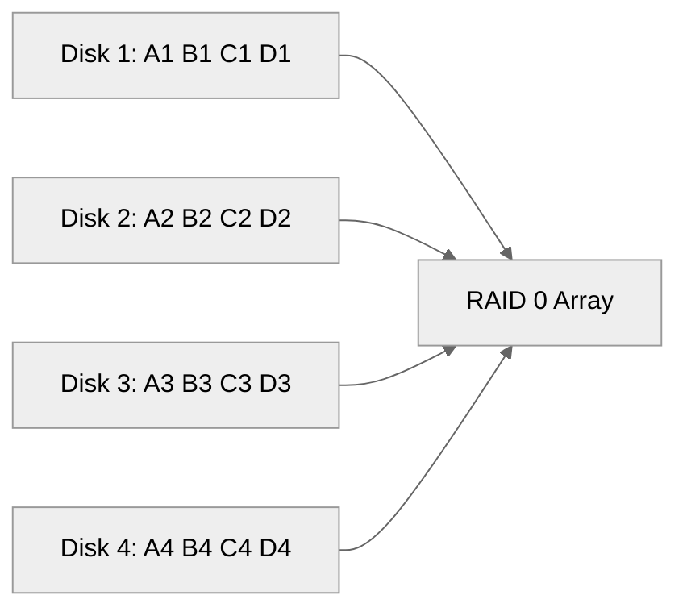
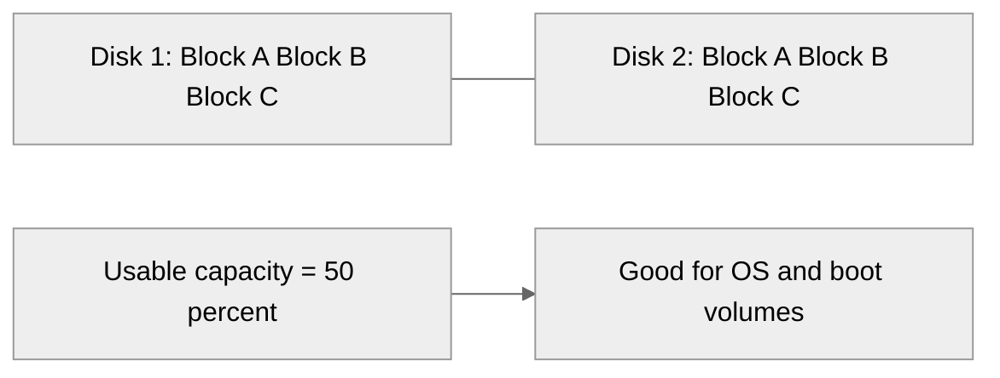
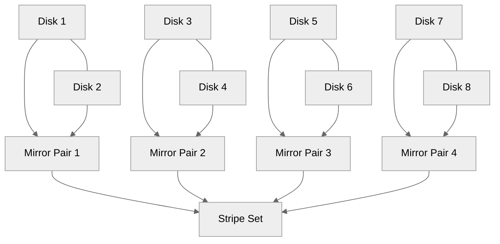
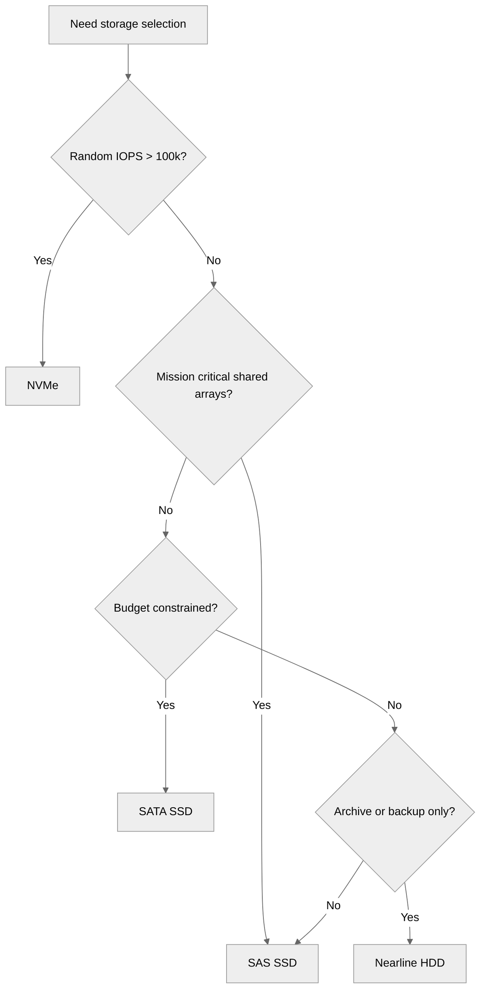
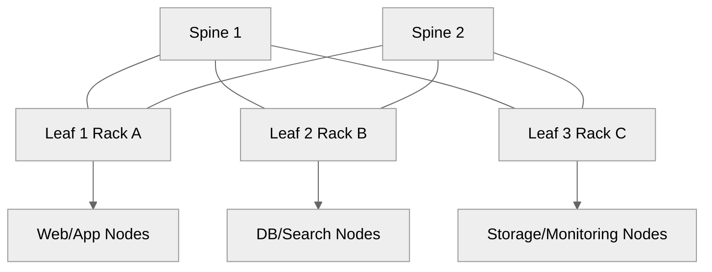

<pre>
╔════════════════════════════════════════════════════╗
║           Hardware Planning for E-Commerce        ║
╚════════════════════════════════════════════════════╝
</pre>

# 01 Hardware Planning

This document explains how to size and select physical infrastructure for ecommerce workloads.
Read [README.md](./README.md) first for the track overview.
After this file, continue with [02-os-installation-and-hardening.md](./02-os-installation-and-hardening.md) and [03-network-architecture.md](./03-network-architecture.md).

## Goals

- Map traffic levels to physical components.
- Estimate compute, memory, storage, and bandwidth.
- Plan rack space, power, and cooling.
- Select network interfaces and topologies that fit growth.
- Avoid under-sizing the database and storage subsystems.

## Workload categories in ecommerce

- Web traffic for home page, category, product, and checkout pages.
- Search traffic for products, filters, and autosuggest.
- Cart and session traffic with heavy read/write cache use.
- Order placement traffic with database writes and queue activity.
- Admin traffic for product imports, reports, and promotions.
- Background jobs for email, invoices, indexing, and stock sync.
- Static asset delivery for images, CSS, JavaScript, and video thumbnails.

## Server specification planning

### Planning assumptions

Use these before you buy hardware:

- Peak traffic matters more than average traffic.
- Checkout and login traffic are more write-heavy than browsing.
- Product search can create bursty CPU and memory demand.
- Images and backups can consume large amounts of network bandwidth.
- Database latency can decide whether the site feels fast or slow.
- Rebuild time for failed disks matters in addition to raw capacity.

### Capacity tiers

The table below provides a starting point.
Use it as a planning baseline, then load-test your app before production.

| Tier | Daily visitors | Typical orders/day | Web/App CPU | Web/App RAM | DB CPU | DB RAM | Storage baseline | Network |
|---|---:|---:|---|---|---|---|---|---|
| Basic | 100-1,000 | 5-50 | 4-8 cores | 16-32 GB | 4-8 cores | 32 GB | 2 x 960 GB SSD RAID1 | 1G |
| Medium | 10,000-100,000 | 300-5,000 | 8-16 cores/server | 32-64 GB | 16 cores | 64-128 GB | 4 x 1.92 TB SSD RAID10 | 10G |
| Large | 100,000-1,000,000 | 5,000-40,000 | 16-32 cores/server | 64-128 GB | 24-32 cores | 128-256 GB | 8 x 3.84 TB SSD RAID10 | 10G/25G |
| Enterprise | 1,000,000+ | 40,000+ | 24-48 cores/server | 128-256 GB | 32-64 cores | 256-512 GB | NVMe tiers + SAN/Ceph | 25G/40G |

### Startup profile: 100 users/day to 1,000 users/day

Recommended minimum design:

- 1 physical server for the application stack.
- 1 spare or cold standby host if downtime tolerance is low.
- CPU: 1 x 8-core modern x86 CPU or equivalent.
- RAM: 32 GB to allow MySQL, PHP-FPM, Redis, and OS cache.
- Storage: 2 x enterprise SSD in RAID1.
- NIC: dual 1G or dual 10G if affordable.
- PSU: dual hot-swap power supplies.

What usually breaks first at this tier:

- Small RAM causing swap activity.
- Cheap consumer SSDs wearing out early.
- Single PSU or single switch uplink as a hidden SPOF.
- No spare disks on-site.

### Growing store profile: 10,000 users/day to 100,000 users/day

Recommended design:

- 2 web nodes.
- 2 app nodes if the app layer is separate.
- 1 primary DB server.
- 1 replica DB server for reads and backup offload.
- 1 cache/queue node if resources allow.
- CPU: 2 x 8-core or 1 x 16-core per web/app node.
- RAM: 64 GB on web/app, 128 GB on DB.
- Storage: 4 to 8 enterprise SSDs, usually RAID10 on DB.
- Network: dual 10G with redundant switches.

Watch closely:

- Product images and search indexes growing faster than expected.
- Random write IOPS on order, inventory, and session tables.
- Backup windows becoming too long.

### Enterprise profile: 1M+ users/day

Recommended direction:

- Separate tiers for load balancer, web, app, cache, queue, DB, search, monitoring, logging, and storage.
- Multiple racks or multiple cages in a datacenter.
- At least one additional datacenter or DR site.
- 25G or higher network fabric.
- NVMe for high-write database or search workloads.
- Out-of-band management for every server.
- Capacity overhead of 30% to 50% for flash sales and failures.

### CPU planning

Evaluate CPUs based on:

- Single-thread performance for PHP, some DB queries, and control-plane tasks.
- Total core count for parallel workers.
- Cache size for database and search workloads.
- NUMA layout on dual-socket systems.
- Power draw and thermal design.

Rules of thumb:

- Web proxies like Nginx scale well across cores.
- Database concurrency improves with more cores, but memory and storage latency often dominate.
- Elasticsearch benefits from fast cores and ample RAM.
- Message queues like RabbitMQ typically care more about latency stability than extreme core count.

### RAM planning

Allocate RAM using the workload, not the sticker size.

Typical split for a DB-focused server:

- 60% to 70% for InnoDB buffer pool.
- 10% to 15% for OS page cache.
- 5% to 10% for connection overhead.
- Remaining headroom for backups, schema changes, and bursts.

Typical split for a web/app server:

- 20% to 35% for OS and filesystem cache.
- 20% to 40% for PHP-FPM, Node.js, or Python workers.
- 5% to 15% for Redis if colocated.
- Remaining headroom for deploys, logs, and spikes.

### Storage planning summary

Questions to answer:

- Is the storage mostly random I/O or sequential?
- What is the expected working set size?
- How quickly does data grow?
- How long can a rebuild take without risking a second failure?
- Are you storing large media files locally or on shared storage?

## Component recommendations by tier

| Component | Basic | Medium | Enterprise |
|---|---|---|---|
| Chassis | 2U tower/rack | 1U or 2U rack | 1U compute + 2U storage dense |
| CPU | 8 cores | 16-24 cores | 32-64 cores |
| RAM | 32 GB | 64-128 GB | 256-512 GB |
| OS disks | 2 x 480 GB SSD RAID1 | 2 x 960 GB SSD RAID1 | 2 x 960 GB SSD RAID1 |
| DB disks | shared with OS only for labs | 4 x 1.92 TB SSD RAID10 | 6-12 x NVMe or SSD RAID10 |
| NIC | 2 x 1G or 2 x 10G | 2 x 10G | 2 x 25G or more |
| PSU | dual | dual redundant | dual redundant + A/B feed |
| Remote mgmt | optional IPMI | required | required with dedicated mgmt network |
| Rails | fixed rails okay | sliding rails preferred | sliding rails + cable arms |
| Spare parts | 1 disk | disks, PSU, fan, NIC | disks, PSU, fan, DIMM, transceivers |

## Rack planning

### Choosing 1U, 2U, or 4U

#### 1U servers

Pros:

- High density.
- Good for stateless web and app tiers.
- Easier to scale horizontally.

Cons:

- Fewer drive bays.
- Less airflow margin.
- Louder fans.
- Less PCIe expansion.

Use 1U for:

- Nginx/HAProxy nodes.
- PHP-FPM or API servers.
- Redis replicas where local storage is not large.

#### 2U servers

Pros:

- Better airflow.
- More drive bays.
- More PCIe slots.
- Better fit for mixed-use hosts.

Cons:

- Lower rack density.
- Slightly higher cost.

Use 2U for:

- Database nodes.
- Search nodes.
- Storage-heavy app servers.

#### 4U servers

Pros:

- Maximum drive count and expansion.
- Easier maintenance in some models.
- Good for dense storage or GPU workloads.

Cons:

- Consumes rack space quickly.
- Usually overkill for web tiers.

Use 4U for:

- Backup targets.
- Storage servers.
- Ceph OSD-heavy nodes.

### Rack spacing and physical layout

Plan the rack before devices arrive.

- Put heavier storage units lower in the rack.
- Keep top-of-rack switches near the top.
- Reserve 1U for cable management where needed.
- Leave growth space if budget allows.
- Maintain front cold aisle intake and rear hot aisle exhaust orientation.

### PDU planning

Use intelligent PDUs when possible.

Plan for:

- A-feed and B-feed separation.
- Per-outlet metering.
- C13/C14 and C19/C20 compatibility.
- Enough outlets for current and future hosts.
- Locking power cords where supported.

### Cable management

Follow simple rules:

- Separate power and data paths.
- Label both ends of every cable.
- Use color coding by network type.
- Keep management cables distinct from production uplinks.
- Leave service loops, but not giant bundles.
- Record switch port, patch panel port, and server NIC mapping.

## Storage architecture

### RAID overview

RAID improves availability or performance, but not backup coverage.
Read [08-backup-and-disaster-recovery.md](./08-backup-and-disaster-recovery.md) for restore planning.

### RAID 0

- Striping only.
- Highest performance.
- No redundancy.
- Never use for ecommerce data.
- Acceptable only for disposable scratch areas.

### RAID 1

- Mirroring.
- Simple and reliable for OS disks.
- Good read performance.
- Capacity is half of raw total.

### RAID 5

- Single parity.
- Better capacity efficiency than RAID10.
- Poorer write performance.
- Riskier with large disks due to long rebuilds.
- Usually not preferred for busy ecommerce databases.

### RAID 6

- Dual parity.
- Better resilience than RAID5.
- Slower writes.
- Good for backup repositories or less write-heavy data.

### RAID 10

- Stripe of mirrors.
- Strong random I/O.
- Faster rebuilds than parity arrays.
- Common choice for transactional databases.
- Capacity equals 50% of raw total.

### RAID decision guide

Use this rule set:

- OS volume: RAID1.
- Database volume: RAID10 when budget permits.
- Backup repository: RAID6 or object storage.
- Search indexes: RAID10 or distributed replicas.
- Scratch/import workspace: RAID1 or RAID10.

### NVMe vs SAS vs SATA

#### NVMe

Choose NVMe when:

- You need very high IOPS.
- Latency sensitivity is extreme.
- Search and DB write rates are high.
- Budget supports enterprise-grade drives.

#### SAS SSD

Choose SAS SSD when:

- You want enterprise reliability and hot-swap flexibility.
- Your backplane and controller are SAS-first.
- You need strong performance but not maximum NVMe throughput.

#### SATA SSD

Choose SATA SSD when:

- Budget is constrained.
- Workload is moderate.
- You are building smaller web/app nodes.

#### HDD

Choose HDD only for:

- Cold backups.
- Archive data.
- Large low-cost repositories.

Avoid HDD for:

- Primary database storage.
- Search nodes.
- Session storage.

### Example MegaRAID/StorCLI checks

~~~bash
storcli /c0 show
storcli /c0 /vall show all
storcli /c0 /eall /sall show
~~~

### Example mdadm layout on Linux

~~~bash
apt-get update
apt-get install -y mdadm
mdadm --create /dev/md0 --level=1 --raid-devices=2 /dev/sda /dev/sdb
mdadm --detail /dev/md0
cat /proc/mdstat
~~~

### Filesystem choices

- XFS: common for large volumes and RHEL-family systems.
- ext4: simple and widely supported.
- ZFS: strong data integrity and snapshots, but operational overhead differs.
- Avoid unusual filesystems unless your team knows them deeply.

## Network hardware

### Switch design

#### Top-of-rack switches

Use ToR switches when:

- Each rack contains most nodes for a workload slice.
- You want short server-to-switch cables.
- Operational teams prefer rack-local patching.

#### Spine-leaf switches

Use spine-leaf when:

- You have multiple racks.
- East-west traffic is significant.
- You want predictable latency at scale.
- You plan 25G/100G uplink growth.

### NIC speeds

- 1G: acceptable for small labs and tiny stores.
- 10G: baseline for serious production.
- 25G: strong option for modern racks and storage-heavy traffic.
- 40G/100G: usually uplinks, storage backbones, or larger clusters.

### NIC bonding modes

Common Linux bonding choices:

- mode=1 active-backup for simple redundancy.
- mode=4 802.3ad for LACP with managed switches.
- mode=6 balance-alb in specific environments.

Recommended default:

- Use LACP for production data interfaces where switches support it.
- Use active-backup for management where simplicity matters more.

Example RHEL bond with nmcli:

~~~bash
nmcli con add type bond ifname bond0 mode 802.3ad
nmcli con add type ethernet ifname eno1 master bond0
nmcli con add type ethernet ifname eno2 master bond0
nmcli con mod bond0 ipv4.addresses 10.10.10.21/24 ipv4.gateway 10.10.10.1 ipv4.method manual
nmcli con up bond0
~~~

Example Ubuntu netplan bond:

~~~yaml
network:
  version: 2
  ethernets:
    eno1: {}
    eno2: {}
  bonds:
    bond0:
      interfaces: [eno1, eno2]
      parameters:
        mode: 802.3ad
        mii-monitor-interval: 100
        transmit-hash-policy: layer3+4
      addresses:
        - 10.10.10.22/24
      routes:
        - to: default
          via: 10.10.10.1
      nameservers:
        addresses: [10.10.50.10, 10.10.50.11]
~~~

## Power and cooling

### UPS sizing

Estimate UPS runtime using:

- Total watt draw of all devices.
- Desired runtime in minutes.
- Power factor and UPS efficiency.
- Growth headroom of at least 20%.

Quick formula:

- Watts = Sum(device_watts).
- VA = Watts / power_factor.
- Required UPS VA = VA x 1.2 headroom.

Example:

- 6 servers at 350W each = 2100W.
- 2 switches at 150W each = 300W.
- PDU and firewall overhead = 100W.
- Total = 2500W.
- At PF 0.9, VA = 2778 VA.
- With 20% headroom, choose at least 3334 VA.

### N+1 redundancy

Design examples:

- 2 power feeds for each rack.
- Dual PSU servers connected across A and B PDUs.
- Cooling with one extra unit beyond minimum requirement.
- Spare switch or supervisor for critical management.

### Hot aisle and cold aisle

Best practice:

- Cold air enters front of servers.
- Hot exhaust exits rear of servers.
- Keep blanking panels installed.
- Avoid side-to-side airflow mixing equipment unless planned.
- Use temperature sensors at top, middle, and bottom of racks.

## Capacity planning formulas

### Storage growth

Use this formula:

- Storage_needed = (daily_data_growth x retention_days) + baseline_data + snapshot_overhead + 30% free space.

Example:

- Baseline DB + media = 2 TB.
- Daily growth = 20 GB.
- Retention = 365 days.
- Snapshot overhead = 500 GB.
- Growth = 20 x 365 = 7300 GB.
- Total before free space = 2 TB + 7.3 TB + 0.5 TB = 9.8 TB.
- With 30% free space = 12.74 TB usable target.

### IOPS estimation

Simple model:

- Read_IOPS = read_ops_per_sec.
- Write_IOPS = write_ops_per_sec x RAID_penalty.
- RAID5 penalty = 4.
- RAID6 penalty = 6.
- RAID10 penalty = 2.

Example:

- 4,000 read IOPS.
- 2,000 write IOPS.
- RAID10 write cost = 2,000 x 2 = 4,000.
- Total backend IOPS requirement = 8,000.
- Add 30% headroom = 10,400 IOPS minimum.

### Bandwidth estimation

Formula:

- Peak_bandwidth_Mbps = concurrent_users x average_payload_MB x 8 / average_response_time_seconds.

Example:

- 2,000 concurrent users.
- 1.2 MB average response including assets.
- 2 seconds average fetch window.
- Peak = 2000 x 1.2 x 8 / 2 = 9600 Mbps.
- That suggests multiple 10G paths or strong CDN offload.

### CPU estimation

Formula starter:

- Required_cores = peak_requests_per_second x average_cpu_ms_per_request / 1000.

Example:

- 500 requests/sec.
- 40 ms CPU time per request.
- Required cores = 500 x 40 / 1000 = 20 cores.
- Add 30% headroom = 26 cores.

## Example rack layout for a 3-tier ecommerce setup

```mermaid
%%{init: {'theme': 'neutral'}}%%
flowchart TD
    U42[U42 Cable Manager]
    U41[U41 ToR Switch A]
    U40[U40 ToR Switch B]
    U39[U39 Patch Panel]
    U38[U38 Load Balancer 1]
    U37[U37 Load Balancer 2]
    U36[U36 Web 1]
    U35[U35 Web 2]
    U34[U34 App 1]
    U33[U33 App 2]
    U32[U32 Redis Queue]
    U31[U31 DB Primary 2U]
    U29[U29 DB Replica 2U]
    U27[U27 Backup Storage 4U]
    U23[U23 Monitoring Logging]
    U22[U22 KVM IPMI Shelf]
    U21[U21 Cable Manager]
    U20[U20 UPS A]
    U18[U18 UPS B]
    U16[U16 Free Space Growth]
```

## Procurement checklist

- Confirm rail kits match rack depth.
- Confirm PSUs match datacenter voltage.
- Confirm transceiver type: SR, LR, DAC, or AOC.
- Confirm firmware support lifecycle.
- Confirm drive endurance rating: DWPD or TBW.
- Confirm remote management licensing needs.
- Confirm spare fans and disks are orderable.
- Confirm vendor BIOS defaults for power profile.

## Common pitfalls

- Buying CPU-heavy servers but slow storage.
- Forgetting remote management networking.
- Using RAID5 for a busy OLTP database.
- No A/B power design.
- No spare switch ports for growth.
- No label standard.
- Mixing production and management traffic.
- Sizing by average load only.
- Ignoring backup storage growth.

## Example acceptance tests when hardware arrives

~~~bash
lscpu
lsblk -o NAME,SIZE,TYPE,MODEL
free -h
ip -br addr
ethtool eno1
ipmitool lan print
smartctl -a /dev/sda
smartctl -a /dev/nvme0
fio --name=randrw --rw=randrw --bs=16k --iodepth=32 --numjobs=4 --size=2G --runtime=60 --time_based --filename=/data/fio.test
~~~

## Hand-off notes to the OS build phase

Before moving to [02-os-installation-and-hardening.md](./02-os-installation-and-hardening.md), record:

- Asset tag and serial number.
- Rack and U position.
- Switch and port mapping.
- RAID layout.
- Disk serial numbers.
- BIOS and firmware versions.
- Planned hostnames and VLAN assignments.
- Management IPs and credentials in a vault.

## Summary

Good ecommerce hardware planning is mostly about avoiding predictable pain.
Buy for latency stability, spare capacity, maintainability, and recovery speed.
Plan the rack, the network, and the power path before you install the OS.

← Back to Physical Setup
