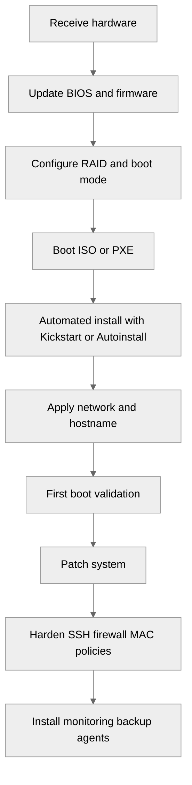
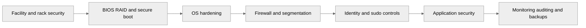

<pre>
╔════════════════════════════════════════════════════╗
║        OS Installation and Hardening Guide        ║
╚════════════════════════════════════════════════════╝
</pre>

# 02 OS Installation and Hardening

This document covers operating system choice, installation automation, partitioning, baseline security hardening, and user controls for ecommerce servers.
Read [01-hardware-planning.md](./01-hardware-planning.md) before this file.
Review [03-network-architecture.md](./03-network-architecture.md) after finishing the host baseline.

## Objectives

- Standardize OS selection for bare-metal ecommerce hosts.
- Automate installations for repeatability.
- Build sane partitioning for logs, apps, temp data, and databases.
- Apply basic host hardening before the application is exposed.
- Prepare hosts for later monitoring and backup controls.

## OS selection

Choose an OS family that matches your support model, package ecosystem, and team familiarity.

| Feature | RHEL | Rocky Linux | Ubuntu Server LTS |
|---|---|---|---|
| Commercial support | Strong vendor support | Community with enterprise compatibility | Commercial support available via Canonical |
| Package style | `dnf`/RPM | `dnf`/RPM | `apt`/DEB |
| SELinux | Enforcing by default | Enforcing by default | AppArmor by default |
| Release model | Stable enterprise lifecycle | RHEL-compatible lifecycle | LTS every 2 years |
| Common use case | Regulated enterprise | Cost-conscious enterprise | Broad community and cloud/on-prem mix |
| Automation | Kickstart, Satellite, Ansible | Kickstart, Foreman, Ansible | Preseed, autoinstall, cloud-init, Ansible |
| Good fit | PCI-sensitive and standardized fleets | RHEL-like environments without subscription | Mixed environments and fast-moving app stacks |

### Selection guidance

Choose RHEL when:

- You need vendor support and lifecycle guarantees.
- Security/compliance teams prefer commercial subscriptions.
- You rely on vendor-certified agents or tools.

Choose Rocky Linux when:

- You want RHEL-like behavior without subscription cost.
- Your automation already targets the RHEL family.

Choose Ubuntu Server LTS when:

- Your team uses Ubuntu across app, CI, and admin tools.
- Vendor packages are easier to obtain in DEB form.
- You want strong documentation and broad community examples.

## Installation workflow

## Defense in depth overview

## BIOS and firmware prerequisites

Before installing Linux:

- Update BIOS, RAID controller, NIC, and BMC firmware.
- Set BIOS clock to UTC.
- Enable virtualization only if required.
- Enable NUMA awareness on larger systems.
- Select performance or balanced power profile based on workload.
- Set boot mode to UEFI unless you have a strict legacy requirement.
- Enable secure boot only after validating your OS and driver chain.

## Automated installation

Automated install files make rebuilds safer and faster.
Use the same baseline across web, app, DB, and utility hosts.

### Kickstart example for Rocky/RHEL

Store this on your PXE server or pass it via virtual media.

~~~kickstart
#version=RHEL9
text
cdrom
lang en_US.UTF-8
keyboard us
timezone UTC --utc
network --bootproto=static --device=link --ip=10.10.40.21 --netmask=255.255.255.0 --gateway=10.10.40.1 --nameserver=10.10.50.10,10.10.50.11 --hostname=web01.example.com --activate
rootpw --iscrypted $6$rounds=4096$3dummydemo$replace.this.hash
firewall --enabled --service=ssh
selinux --enforcing
services --enabled=sshd,chronyd
bootloader --location=mbr --append="audit=1 crashkernel=auto"
zerombr
clearpart --all --initlabel
part /boot/efi --fstype=efi --size=600
part /boot --fstype=xfs --size=1024
part pv.01 --grow --size=1
volgroup vg_sys pv.01
logvol / --vgname=vg_sys --size=20480 --name=lv_root --fstype=xfs
logvol /var --vgname=vg_sys --size=20480 --name=lv_var --fstype=xfs
logvol /var/log --vgname=vg_sys --size=10240 --name=lv_var_log --fstype=xfs
logvol /tmp --vgname=vg_sys --size=8192 --name=lv_tmp --fstype=xfs
logvol /opt --vgname=vg_sys --size=20480 --name=lv_opt --fstype=xfs
logvol /home --vgname=vg_sys --size=8192 --name=lv_home --fstype=xfs
logvol swap --vgname=vg_sys --size=8192 --name=lv_swap --fstype=swap
reboot
%packages
@^minimal-environment
chrony
vim-enhanced
curl
wget
rsync
bash-completion
policycoreutils-python-utils
firewalld
dnf-automatic
%end
%post --log=/root/ks-post.log
useradd -m -G wheel deploy
mkdir -p /home/deploy/.ssh
chmod 700 /home/deploy/.ssh
echo 'ssh-ed25519 AAAAC3NzaC1lZDI1NTE5AAAAIDReplaceMe deploy@example' > /home/deploy/.ssh/authorized_keys
chmod 600 /home/deploy/.ssh/authorized_keys
chown -R deploy:deploy /home/deploy/.ssh
echo '%wheel ALL=(ALL) ALL' > /etc/sudoers.d/10-wheel
chmod 440 /etc/sudoers.d/10-wheel
dnf -y update
%end
~~~

### Ubuntu Server autoinstall snippet

~~~yaml
#cloud-config
autoinstall:
  version: 1
  locale: en_US.UTF-8
  keyboard:
    layout: us
  identity:
    hostname: app01
    username: deploy
    password: "$6$rounds=4096$replace$replace"
  ssh:
    install-server: true
    allow-pw: false
    authorized-keys:
      - ssh-ed25519 AAAAC3NzaC1lZDI1NTE5AAAAIDReplaceMe deploy@example
  packages:
    - chrony
    - rsync
    - curl
    - vim
  storage:
    layout:
      name: lvm
~~~

## Disk partitioning

For ecommerce systems, separate fast-growing and security-sensitive paths.
This reduces blast radius when logs, uploads, or temp files grow unexpectedly.

### Recommended LVM layout

| Mount point | Suggested size | Notes |
|---|---:|---|
| `/boot/efi` | 600 MB | UEFI boot partition |
| `/boot` | 1 GB | Kernel and initramfs |
| `/` | 20-40 GB | Base OS |
| `/var` | 20-40 GB | Package cache, spools, app data |
| `/var/log` | 10-20 GB | Logs separated from app and root |
| `/tmp` | 8-16 GB | Can be mounted with `nodev,nosuid,noexec` |
| `/opt` | 20-80 GB | Third-party apps and custom binaries |
| `/home` | 8-20 GB | Keep small on servers |
| `swap` | 4-16 GB | Size based on workload and RAM |

### Why these mount points matter

- `/var/log` separation prevents noisy logs from filling root.
- `/tmp` separation helps apply safer mount options.
- `/opt` keeps app binaries and vendor packages away from root.
- `/var` contains mail queues, package data, and many service writes.
- Databases often deserve a separate dedicated volume outside the OS VG.

### Example partition creation on an existing host

~~~bash
pvcreate /dev/md0
vgcreate vg_sys /dev/md0
lvcreate -L 30G -n lv_root vg_sys
lvcreate -L 30G -n lv_var vg_sys
lvcreate -L 12G -n lv_var_log vg_sys
lvcreate -L 8G -n lv_tmp vg_sys
lvcreate -L 30G -n lv_opt vg_sys
lvcreate -L 8G -n lv_home vg_sys
lvcreate -L 8G -n lv_swap vg_sys
mkfs.xfs /dev/vg_sys/lv_root
mkfs.xfs /dev/vg_sys/lv_var
mkfs.xfs /dev/vg_sys/lv_var_log
mkfs.xfs /dev/vg_sys/lv_tmp
mkfs.xfs /dev/vg_sys/lv_opt
mkfs.xfs /dev/vg_sys/lv_home
mkswap /dev/vg_sys/lv_swap
~~~

### Example `/etc/fstab`

~~~fstab
UUID=AAAA-BBBB  /boot/efi  vfat  umask=0077,shortname=winnt  0  2
UUID=1111-2222  /boot      xfs   defaults                    0  0
/dev/mapper/vg_sys-lv_root     /         xfs  defaults                         0 0
/dev/mapper/vg_sys-lv_var      /var      xfs  defaults                         0 0
/dev/mapper/vg_sys-lv_var_log  /var/log  xfs  defaults                         0 0
/dev/mapper/vg_sys-lv_tmp      /tmp      xfs  defaults,nodev,nosuid,noexec    0 0
/dev/mapper/vg_sys-lv_opt      /opt      xfs  defaults                         0 0
/dev/mapper/vg_sys-lv_home     /home     xfs  defaults,nodev                  0 0
/dev/mapper/vg_sys-lv_swap     none      swap defaults                         0 0
~~~

## First boot validation

Run these commands immediately after install:

~~~bash
hostnamectl
cat /etc/os-release
ip -br addr
ip route
timedatectl
lsblk -f
systemctl --failed
dnf check-update || true
apt-get update || true
~~~

## Patch baseline

RHEL-family:

~~~bash
dnf -y update
systemctl enable --now dnf-automatic.timer
~~~

Ubuntu:

~~~bash
apt-get update
apt-get -y full-upgrade
apt-get install -y unattended-upgrades
systemctl enable --now unattended-upgrades
~~~

## SSH hardening

SSH is usually the first external path attackers see.
Disable weak patterns before the host goes live.

### `/etc/ssh/sshd_config` example

~~~conf
Port 22
Protocol 2
AddressFamily any
ListenAddress 0.0.0.0
PermitRootLogin no
PasswordAuthentication no
KbdInteractiveAuthentication no
ChallengeResponseAuthentication no
PubkeyAuthentication yes
UsePAM yes
PermitEmptyPasswords no
MaxAuthTries 3
LoginGraceTime 30
MaxSessions 10
ClientAliveInterval 300
ClientAliveCountMax 2
AllowUsers deploy opsadmin
X11Forwarding no
AllowTcpForwarding no
AllowAgentForwarding no
PermitTunnel no
Banner /etc/issue.net
Subsystem sftp /usr/libexec/openssh/sftp-server
~~~

Apply and validate:

~~~bash
sshd -t
systemctl restart sshd || systemctl restart ssh
ss -tulpn | grep ':22'
~~~

### Additional SSH tips

- Use separate admin accounts rather than shared logins.
- Use hardware-backed MFA or SSH CA if available.
- Restrict SSH to management VLANs from [03-network-architecture.md](./03-network-architecture.md).
- Log all sudo and auth events centrally.

## Firewall setup

Expose only the ports required for the server role.

### Common ecommerce ports

- 22/tcp for SSH from management network only.
- 80/tcp and 443/tcp for web or load balancer nodes.
- 3306/tcp for MySQL only between app and DB tiers.
- 6379/tcp for Redis only on trusted networks.
- 5672/tcp and 15672/tcp for RabbitMQ internal/admin use.
- 9100/tcp for node_exporter if monitoring allows it.

### firewalld example for web server

~~~bash
systemctl enable --now firewalld
firewall-cmd --permanent --new-zone=ecommerce-mgmt
firewall-cmd --permanent --zone=ecommerce-mgmt --add-source=10.10.99.0/24
firewall-cmd --permanent --zone=ecommerce-mgmt --add-service=ssh
firewall-cmd --permanent --add-service=http
firewall-cmd --permanent --add-service=https
firewall-cmd --reload
firewall-cmd --list-all
~~~

### nftables/iptables style example for app server

~~~bash
iptables -P INPUT DROP
iptables -P FORWARD DROP
iptables -P OUTPUT ACCEPT
iptables -A INPUT -i lo -j ACCEPT
iptables -A INPUT -m conntrack --ctstate ESTABLISHED,RELATED -j ACCEPT
iptables -A INPUT -p tcp -s 10.10.99.0/24 --dport 22 -j ACCEPT
iptables -A INPUT -p tcp -s 10.10.20.0/24 --dport 9000 -j ACCEPT
iptables -A INPUT -p tcp -s 10.10.20.0/24 --dport 9100 -j ACCEPT
iptables -A INPUT -j LOG --log-prefix "iptables-drop: " --log-level 4
~~~

Persisting on Ubuntu can be done with `iptables-persistent`.
Persisting on RHEL-family is better handled by `nftables` or `firewalld`.

## SELinux and AppArmor

### SELinux guidance

Preferred mode for RHEL-family ecommerce servers:

- `enforcing` in production.
- `permissive` only during troubleshooting.
- Never leave it disabled unless you fully accept the risk.

Check status:

~~~bash
getenforce
sestatus
~~~

Useful commands:

~~~bash
ausearch -m avc -ts recent
semanage port -a -t http_port_t -p tcp 8443
restorecon -Rv /var/www
chcon -R -t httpd_sys_rw_content_t /var/www/html/media
~~~

### AppArmor guidance

Ubuntu commonly uses AppArmor.
Check profiles with:

~~~bash
aa-status
~~~

If you install custom services, add or adjust profiles rather than disabling AppArmor broadly.

## Kernel tuning

Tune conservatively and test before broad rollout.
These settings are a sane starting point for high-traffic web or app nodes.

### `/etc/sysctl.d/99-ecommerce.conf`

~~~conf
net.core.somaxconn = 65535
net.core.netdev_max_backlog = 16384
net.ipv4.tcp_max_syn_backlog = 8192
net.ipv4.ip_local_port_range = 10240 65535
net.ipv4.tcp_fin_timeout = 15
net.ipv4.tcp_tw_reuse = 1
net.ipv4.tcp_keepalive_time = 600
net.ipv4.tcp_keepalive_intvl = 60
net.ipv4.tcp_keepalive_probes = 5
fs.file-max = 2097152
vm.swappiness = 10
vm.dirty_ratio = 15
vm.dirty_background_ratio = 5
kernel.pid_max = 4194304
~~~

Apply:

~~~bash
sysctl --system
sysctl net.core.somaxconn
~~~

### Limits for web/app processes

~~~conf
# /etc/security/limits.d/99-ecommerce.conf
nginx soft nofile 200000
nginx hard nofile 200000
mysql soft nofile 200000
mysql hard nofile 200000
www-data soft nofile 200000
www-data hard nofile 200000
~~~

## Disable unnecessary services

List enabled services:

~~~bash
systemctl list-unit-files --type=service --state=enabled
~~~

Common candidates to disable if unused:

- `cups`
- `avahi-daemon`
- `bluetooth`
- `postfix` on nodes that do not send mail directly
- `rpcbind` if not using NFS

Example:

~~~bash
systemctl disable --now cups.service || true
systemctl disable --now avahi-daemon.service || true
systemctl disable --now bluetooth.service || true
~~~

## CIS Benchmark overview

A CIS benchmark is not a magic switch.
Use it as a hardened baseline, then evaluate app compatibility.

Focus areas:

- Separate partitions.
- Mount options like `nodev`, `nosuid`, `noexec`.
- Audit configuration.
- Password policy.
- SSH restrictions.
- Firewall and kernel parameter checks.
- Disabled unused services and filesystems.

### Basic audit commands

~~~bash
findmnt -no OPTIONS /tmp
systemctl is-enabled firewalld || systemctl is-enabled nftables
grep -E '^(PermitRootLogin|PasswordAuthentication|MaxAuthTries)' /etc/ssh/sshd_config
sysctl net.ipv4.ip_forward
auditctl -s
rpm -q aide || dpkg -l aide
~~~

## User management

### Account design

Use separate account types:

- Named admin accounts for humans.
- Service accounts for applications.
- Break-glass account with vaulted credentials.
- No shared `root` or `deploy` password usage.

### Create a service account

~~~bash
useradd --system --shell /sbin/nologin --home /opt/shop shopapp
id shopapp
~~~

### sudo configuration

Create role-based sudo policy:

~~~conf
# /etc/sudoers.d/20-opsadmin
User_Alias OPSADMINS = alice, bob
Cmnd_Alias WEBOPS = /bin/systemctl restart nginx, /bin/systemctl status nginx, /usr/bin/journalctl -u nginx
OPSADMINS ALL=(root) WEBOPS
Defaults logfile="/var/log/sudo.log"
~~~

Validate:

~~~bash
visudo -cf /etc/sudoers.d/20-opsadmin
~~~

### PAM basics

Set basic password quality and account lockout.

RHEL-family with `authselect` and `pwquality`:

~~~bash
authselect current
grep -E 'minlen|ucredit|lcredit|dcredit|ocredit' /etc/security/pwquality.conf
~~~

Ubuntu and Debian:

~~~bash
grep pam_faillock /etc/pam.d/common-auth || true
grep pam_pwquality /etc/pam.d/common-password || true
~~~

### Example password quality policy

~~~conf
# /etc/security/pwquality.conf
minlen = 14
dcredit = -1
ucredit = -1
lcredit = -1
ocredit = -1
maxrepeat = 3
retry = 3
~~~

## Time synchronization

TLS, logging, distributed tracing, and replication all depend on accurate time.

Chrony example:

~~~bash
systemctl enable --now chronyd || systemctl enable --now chrony
chronyc sources -v
chronyc tracking
~~~

## Audit logging basics

Enable and verify the audit subsystem.

~~~bash
systemctl enable --now auditd || true
auditctl -l
ausearch -m USER_LOGIN -ts today
~~~

## File integrity monitoring

AIDE remains useful for baseline integrity checks.

~~~bash
dnf install -y aide || apt-get install -y aide
/usr/sbin/aide --init
mv /var/lib/aide/aide.db.new.gz /var/lib/aide/aide.db.gz
/usr/sbin/aide --check
~~~

## Baseline package set for ecommerce hosts

Install only what the role needs.
Common baseline packages:

- `chrony`
- `rsync`
- `curl`
- `vim`
- `lsof`
- `tcpdump`
- `policycoreutils-python-utils` on SELinux systems
- `net-tools` only if legacy scripts require it
- `bash-completion`

## Validation checklist before role-specific setup

- Hostname and FQDN are correct.
- Management IP is reachable.
- Time sync works.
- Patch level is current.
- SSH root login is disabled.
- Password auth is disabled if key-based access is ready.
- Firewall policy is active.
- SELinux/AppArmor is enforcing.
- Required partitions are mounted with correct options.
- Monitoring agent prerequisites are installed.

## Common pitfalls

- Disabling SELinux instead of fixing contexts.
- Putting logs and app data on root.
- Allowing SSH from the entire internet.
- Forgetting time sync.
- Using one shared admin account.
- Setting sysctl values without testing backlog and file limits.
- Installing GUI packages on servers without need.

## Next steps

After host hardening, design the network in [03-network-architecture.md](./03-network-architecture.md).
Then apply service-specific steps in [04-basic-single-server-setup.md](./04-basic-single-server-setup.md) or [05-intermediate-multi-tier-setup.md](./05-intermediate-multi-tier-setup.md).

## Summary

A secure ecommerce host starts with repeatability.
Automate the install, separate the filesystems, patch early, lock down SSH, enforce host firewall policy, and keep MAC controls enabled.
Hardening does not end here, but this baseline prevents many avoidable mistakes.

← Back to Physical Setup
