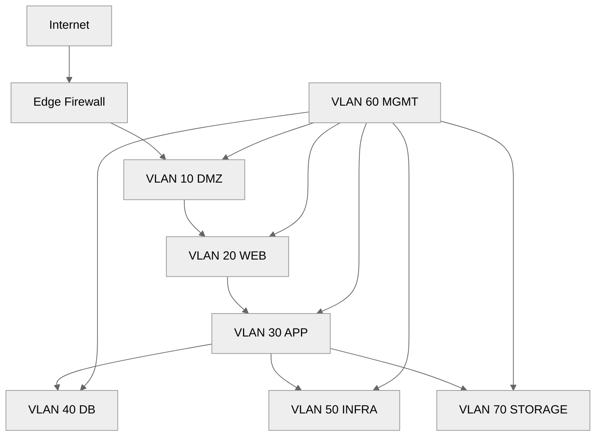
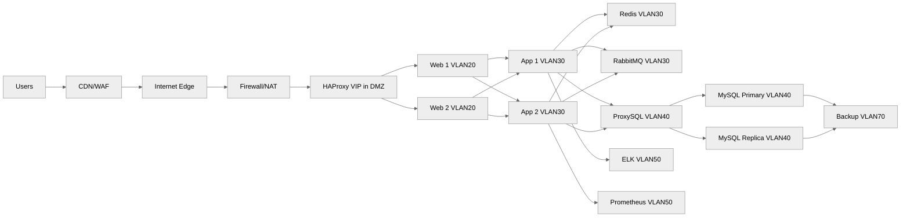
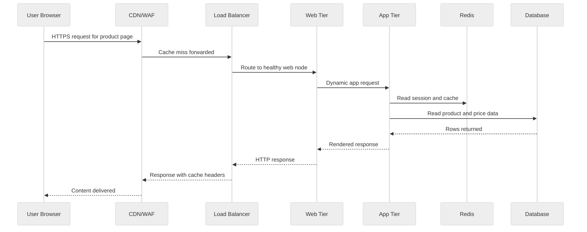

<pre>
╔════════════════════════════════════════════════════╗
║            Network Architecture for E-Commerce    ║
╚════════════════════════════════════════════════════╝
</pre>

# 03 Network Architecture

This document covers physical network design, VLAN segmentation, IP planning, internal DNS, load balancers, firewall policy, TLS placement, and CDN integration for a bare-metal ecommerce platform.
Read [02-os-installation-and-hardening.md](./02-os-installation-and-hardening.md) before exposing hosts to any network.
Use [04-basic-single-server-setup.md](./04-basic-single-server-setup.md), [05-intermediate-multi-tier-setup.md](./05-intermediate-multi-tier-setup.md), and [06-advanced-production-setup.md](./06-advanced-production-setup.md) as deployment follow-ups.

## Objectives

- Segment customer, application, database, management, and storage traffic.
- Build predictable IP and DNS plans.
- Choose the right load balancing layer.
- Enforce least-privilege network policy between tiers.
- Place TLS termination deliberately.

## Design principles

- Keep management traffic off production VLANs.
- Make DMZ rules explicit and minimal.
- Prefer static addressing for servers and infra appliances.
- Document all subnets, gateways, VIPs, and firewall rules.
- Avoid L2 sprawl across racks unless a real requirement exists.
- Use redundant uplinks for critical devices.

## Reference VLAN plan

| VLAN ID | Name | Purpose | Example subnet | Notes |
|---|---|---|---|---|
| 10 | DMZ | Public-facing load balancers and reverse proxies | 10.10.10.0/24 | Internet-exposed via firewall/NAT |
| 20 | WEB | Internal web tier to app tier traffic | 10.10.20.0/24 | Usually no direct internet access |
| 30 | APP | App tier to DB/cache/queue traffic | 10.10.30.0/24 | East-west traffic heavy |
| 40 | DB | Databases and DB proxies | 10.10.40.0/24 | Strictly limited ingress |
| 50 | INFRA | DNS, monitoring, logging, CI, backups | 10.10.50.0/24 | Shared services |
| 60 | MGMT | IPMI, SSH jump hosts, admin access | 10.10.60.0/24 | No user traffic |
| 70 | STORAGE | NFS, Ceph, backup replication | 10.10.70.0/24 | Jumbo frames only if tested |

## VLAN topology

## Full 3-tier network architecture

## Physical network design

### Access and distribution

In small racks:

- Two ToR switches are usually enough.
- Run dual uplinks from each critical server.
- Use LACP where supported and operationally justified.

In larger rows:

- Use leaf switches per rack.
- Uplink each leaf to two spines.
- Keep ECMP consistent if your network team supports it.

### Cabling approach

- Use DACs for short in-rack 10G/25G links.
- Use fiber for longer runs or higher bandwidth uplinks.
- Label cables by rack, switch, port, and destination host.
- Keep IPMI and management cables clearly separated.

## IP planning

### CIDR planning strategy

Pick blocks that leave room for growth.
A common approach is one `/24` per function for small and medium environments.
Larger environments may use `/23` or `/22` for busy VLANs.

Example site allocation:

- 10.10.0.0/16 for primary datacenter.
- 10.20.0.0/16 for DR datacenter.
- Reserve `/24` ranges by function.
- Reserve top and bottom address ranges for gateways, VIPs, and network devices.

### Example host assignment plan

| Role | Hostname | VLAN | IP |
|---|---|---|---|
| Load balancer 1 | lb01 | DMZ | 10.10.10.11 |
| Load balancer 2 | lb02 | DMZ | 10.10.10.12 |
| LB VIP | shop-vip | DMZ | 10.10.10.10 |
| Web 1 | web01 | WEB | 10.10.20.11 |
| Web 2 | web02 | WEB | 10.10.20.12 |
| App 1 | app01 | APP | 10.10.30.11 |
| App 2 | app02 | APP | 10.10.30.12 |
| Redis | redis01 | APP | 10.10.30.21 |
| RabbitMQ | mq01 | APP | 10.10.30.31 |
| ProxySQL | dbproxy01 | DB | 10.10.40.11 |
| MySQL Primary | db01 | DB | 10.10.40.21 |
| MySQL Replica | db02 | DB | 10.10.40.22 |
| Prometheus | mon01 | INFRA | 10.10.50.21 |
| Elasticsearch | log01 | INFRA | 10.10.50.31 |
| IPMI network | *.bmc | MGMT | 10.10.60.0/24 |

### DHCP vs static addressing

Use static IPs for:

- Load balancers.
- Web, app, DB, cache, queue servers.
- Monitoring and logging infrastructure.
- DNS and NTP servers.
- Switches, firewalls, PDUs, and BMC interfaces.

Use DHCP only for:

- Temporary test hosts.
- PXE boot stage before reservation or final static assignment.
- Workstations or admin laptops on dedicated management access networks.

### Linux static addressing examples

RHEL-family with `nmcli`:

~~~bash
nmcli con mod bond0 ipv4.method manual ipv4.addresses 10.10.20.11/24 ipv4.gateway 10.10.20.1 ipv4.dns "10.10.50.10 10.10.50.11"
nmcli con up bond0
~~~

Ubuntu netplan:

~~~yaml
network:
  version: 2
  ethernets:
    eno1: {}
    eno2: {}
  bonds:
    bond0:
      interfaces: [eno1, eno2]
      parameters:
        mode: active-backup
        mii-monitor-interval: 100
      addresses: [10.10.30.11/24]
      routes:
        - to: default
          via: 10.10.30.1
      nameservers:
        addresses: [10.10.50.10, 10.10.50.11]
~~~

## DNS setup

Internal DNS matters for service discovery, replication, certificates, and admin sanity.
Avoid relying on `/etc/hosts` except as a short emergency measure.

### Split-horizon DNS

Use different answers for internal and external clients:

- External: `shop.example.com` resolves to public CDN or public VIP.
- Internal: `db01.internal.example.com` resolves only inside the trusted network.
- Admin-only records are never published publicly.

### BIND internal zone example

~~~conf
options {
    directory "/var/named";
    recursion yes;
    allow-query { 10.10.0.0/16; 10.20.0.0/16; };
    allow-recursion { 10.10.0.0/16; 10.20.0.0/16; };
    forwarders { 1.1.1.1; 8.8.8.8; };
    dnssec-validation auto;
};

zone "internal.example.com" IN {
    type master;
    file "internal.example.com.zone";
};
~~~

~~~dns
$TTL 300
@   IN SOA ns1.internal.example.com. dnsadmin.example.com. (
        2025010101 ; serial
        3600       ; refresh
        600        ; retry
        1209600    ; expire
        300 )      ; minimum
@       IN NS   ns1.internal.example.com.
ns1     IN A    10.10.50.10
lb01    IN A    10.10.10.11
lb02    IN A    10.10.10.12
shop-vip IN A   10.10.10.10
web01   IN A    10.10.20.11
web02   IN A    10.10.20.12
app01   IN A    10.10.30.11
app02   IN A    10.10.30.12
db01    IN A    10.10.40.21
db02    IN A    10.10.40.22
~~~

### dnsmasq for a small lab

~~~conf
port=53
domain-needed
bogus-priv
listen-address=10.10.50.10
domain=internal.example.com
address=/shop.internal.example.com/10.10.10.10
address=/db01.internal.example.com/10.10.40.21
address=/db02.internal.example.com/10.10.40.22
~~~

### DNS validation commands

~~~bash
dig @10.10.50.10 shop-vip.internal.example.com
host db01.internal.example.com 10.10.50.10
rndc reload
named-checkconf
named-checkzone internal.example.com /var/named/internal.example.com.zone
~~~

## Load balancer setup

Load balancers should be small, boring, and highly visible.
Use them to remove complexity from web and app nodes.

## L4 vs L7 decision

Choose L4 when:

- You need very low overhead.
- TLS is passed through to backends.
- Routing decisions are only IP and port based.

Choose L7 when:

- You need host- or path-based routing.
- You want TLS termination.
- You need sticky sessions with cookies.
- You need WAF integration, redirects, or header manipulation.

### HAProxy full example

~~~cfg
global
    log /dev/log local0
    log /dev/log local1 notice
    chroot /var/lib/haproxy
    user haproxy
    group haproxy
    daemon
    maxconn 20000
    stats socket /run/haproxy/admin.sock mode 660 level admin

defaults
    mode http
    log global
    option httplog
    option dontlognull
    option forwardfor
    timeout connect 5s
    timeout client  60s
    timeout server  60s
    retries 3

frontend fe_http
    bind *:80
    http-request redirect scheme https code 301 unless { ssl_fc }

frontend fe_https
    bind *:443 ssl crt /etc/haproxy/certs/shop.example.com.pem alpn h2,http/1.1
    http-response set-header Strict-Transport-Security max-age=31536000\;includeSubDomains
    http-response set-header X-Frame-Options SAMEORIGIN
    http-response set-header X-Content-Type-Options nosniff
    acl host_shop hdr(host) -i shop.example.com www.shop.example.com
    use_backend bk_shop if host_shop
    default_backend bk_shop

backend bk_shop
    balance roundrobin
    cookie SRV insert indirect nocache secure httponly
    option httpchk GET /healthz HTTP/1.1\r\nHost:\ shop.example.com
    http-check expect status 200
    server web01 10.10.20.11:443 ssl verify none check cookie w1
    server web02 10.10.20.12:443 ssl verify none check cookie w2

listen stats
    bind *:8404
    mode http
    stats enable
    stats uri /stats
    stats refresh 10s
    stats auth admin:ChangeThisNow
~~~

Enable on RHEL-family:

~~~bash
dnf install -y haproxy
systemctl enable haproxy
haproxy -c -f /etc/haproxy/haproxy.cfg
systemctl restart haproxy
~~~

### Nginx as load balancer

~~~conf
upstream ecommerce_app {
    least_conn;
    server 10.10.20.11:443 max_fails=3 fail_timeout=10s;
    server 10.10.20.12:443 max_fails=3 fail_timeout=10s;
    keepalive 64;
}

server {
    listen 80;
    server_name shop.example.com;
    return 301 https://$host$request_uri;
}

server {
    listen 443 ssl http2;
    server_name shop.example.com;

    ssl_certificate /etc/letsencrypt/live/shop.example.com/fullchain.pem;
    ssl_certificate_key /etc/letsencrypt/live/shop.example.com/privkey.pem;

    location / {
        proxy_pass https://ecommerce_app;
        proxy_set_header Host $host;
        proxy_set_header X-Forwarded-For $proxy_add_x_forwarded_for;
        proxy_set_header X-Forwarded-Proto https;
        proxy_http_version 1.1;
        proxy_set_header Connection "";
    }
}
~~~

### Hardware load balancer considerations

When evaluating F5 or Citrix ADC:

- Confirm throughput under TLS and HTTP/2.
- Confirm certificate automation workflows.
- Confirm persistence options.
- Confirm health-check flexibility.
- Confirm HA licensing and failover behavior.
- Confirm logging export to SIEM.

## Firewall architecture

### DMZ pattern

The DMZ should only contain hosts that must directly serve internet traffic.
Typically that means load balancers, reverse proxies, or WAF appliances.
Do not place databases or admin jump hosts in the DMZ.

### Example iptables rules for DMZ load balancer

~~~bash
iptables -P INPUT DROP
iptables -P FORWARD DROP
iptables -P OUTPUT ACCEPT
iptables -A INPUT -i lo -j ACCEPT
iptables -A INPUT -m conntrack --ctstate ESTABLISHED,RELATED -j ACCEPT
iptables -A INPUT -p tcp --dport 80 -j ACCEPT
iptables -A INPUT -p tcp --dport 443 -j ACCEPT
iptables -A INPUT -p tcp -s 10.10.60.0/24 --dport 22 -j ACCEPT
iptables -A INPUT -p tcp -s 10.10.50.0/24 --dport 8404 -j ACCEPT
iptables -A INPUT -j LOG --log-prefix "dmz-drop: " --log-level 4
~~~

### Example inter-VLAN ACL intent

| Source VLAN | Destination VLAN | Port | Reason |
|---|---|---:|---|
| DMZ | WEB | 443 | Reverse proxy to web nodes |
| WEB | APP | 9000 | PHP-FPM or app service |
| APP | DB | 3306 | Database traffic |
| APP | APP | 6379 | Redis sessions/cache |
| APP | APP | 5672 | RabbitMQ messaging |
| MGMT | All | 22 | Admin SSH from jump hosts only |
| INFRA | All | 9100 | Prometheus scrape if approved |
| STORAGE | DB | 2049 | NFS only if required |

### Network ACL checklist

- Deny by default.
- Allow only source subnet to destination subnet on required ports.
- Document owner and purpose of every rule.
- Review quarterly.
- Remove temporary migration rules.

## SSL/TLS design

### Certificate management options

Use Let's Encrypt when:

- Public DNS is available.
- Public services are internet-reachable.
- Automation is desired.

Use an internal CA when:

- Services are internal only.
- Mutual TLS or private trust chains are required.
- Datacenter or compliance policy requires private issuance.

### TLS termination choices

Terminate at the load balancer when:

- You want simpler backend configs.
- You need centralized cert renewal.
- You want header-based L7 routing.

Use end-to-end TLS when:

- Internal network trust is low.
- Compliance requires encryption between every tier.
- Backends handle certificates and SNI cleanly.

### HAProxy SSL offload example

- Public client connects to HAProxy on 443.
- HAProxy decrypts traffic.
- HAProxy re-encrypts to web backends or forwards plain HTTP on a trusted internal segment.
- Preserve `X-Forwarded-Proto` so the app knows the original scheme.

### OpenSSL validation commands

~~~bash
openssl s_client -connect shop.example.com:443 -servername shop.example.com -showcerts
curl -Ik https://shop.example.com/
sslyze --regular shop.example.com || true
~~~

## CDN integration

CDNs reduce origin bandwidth and improve latency for static assets.
They also help absorb spikes during promotions.

### Good CDN candidates

- Cloudflare for broad features and easy onboarding.
- Akamai for large enterprise presence and deep edge services.
- Fastly for developer-centric workflows.

### What to cache at the CDN

- Product images.
- CSS and JS bundles.
- Font files.
- Public downloads.
- Public catalog pages only if your application logic supports it safely.

### What not to cache blindly

- Cart pages.
- Checkout pages.
- Account pages.
- Admin interfaces.
- Personalized recommendation responses unless explicitly designed.

### Example Nginx static asset headers for CDN friendliness

~~~conf
location ~* \.(css|js|jpg|jpeg|png|gif|svg|webp|woff2)$ {
    expires 30d;
    add_header Cache-Control "public, max-age=2592000, immutable";
    access_log off;
}
~~~

## Request flow

## Validation commands

~~~bash
ip -br addr
bridge vlan show || true
ss -tulpn
curl -Ik https://shop.example.com
traceroute 10.10.40.21 || true
tcpdump -ni bond0 host 10.10.40.21 and port 3306
~~~

## Practical tips

- Keep VIPs documented outside the DNS zone file comments.
- Do not share database VLAN with backup traffic if avoidable.
- Use separate internal and external load balancer certs when trust domains differ.
- Keep management DNS separate from public DNS operations.
- Prefer jump hosts instead of broad SSH exposure.
- Test failover of both network path and service health logic.

## Common pitfalls

- Flat L2 design with no segmentation.
- Static routes added ad hoc with no source of truth.
- Internal services depending on public DNS paths.
- TLS terminated in too many places with poor certificate ownership.
- Load balancer health checks that only test TCP, not application readiness.
- Database port open to every app subnet without restriction.

## Next steps

For a tiny store, continue with [04-basic-single-server-setup.md](./04-basic-single-server-setup.md).
For a growing store, continue with [05-intermediate-multi-tier-setup.md](./05-intermediate-multi-tier-setup.md).
For enterprise HA and multi-datacenter design, continue with [06-advanced-production-setup.md](./06-advanced-production-setup.md).

## Summary

A strong ecommerce network uses segmentation, predictable addressing, deliberate DNS, simple load balancing, and strict ACLs.
Design the path from customer to database on paper before any cable is plugged in.

← Back to Physical Setup
