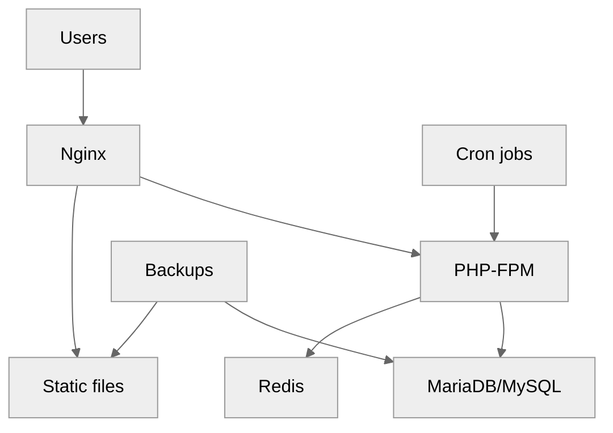
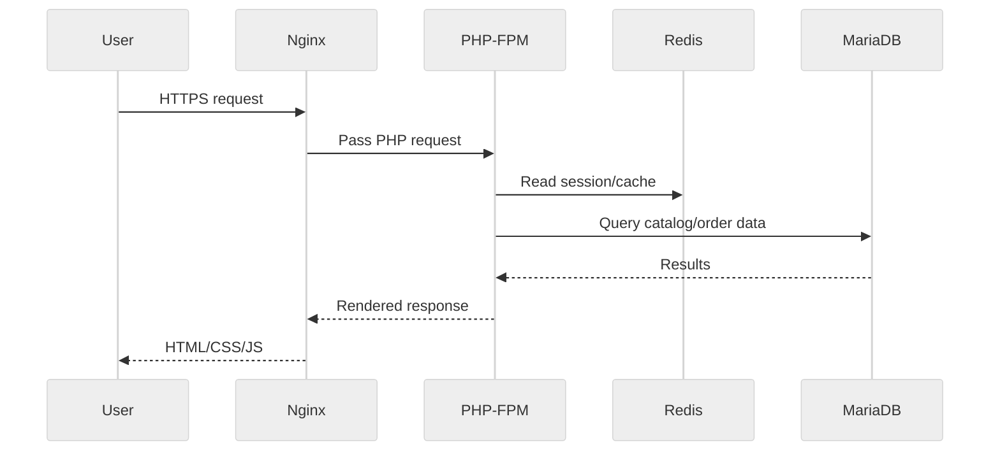

<pre>
╔════════════════════════════════════════════════════╗
║          Basic Single Server Setup Guide          ║
╚════════════════════════════════════════════════════╝
</pre>

# 04 Basic Single Server Setup

This guide targets a small ecommerce store running on a single physical server and serving fewer than 1,000 visitors per day.
It assumes you already completed [02-os-installation-and-hardening.md](./02-os-installation-and-hardening.md) and understand the networking basics from [03-network-architecture.md](./03-network-architecture.md).
For larger environments, move next to [05-intermediate-multi-tier-setup.md](./05-intermediate-multi-tier-setup.md).

## Scenario

Use this layout when:

- The catalog is small to medium.
- Orders per day are modest.
- Downtime tolerance is acceptable or a cold standby exists.
- Budget is tight.
- Operational simplicity matters more than horizontal scale.

## Architecture

## Request flow

## Example host profile

- CPU: 8 cores.
- RAM: 32 GB.
- Storage: 2 x SSD in RAID1.
- OS: Ubuntu Server LTS or Rocky Linux.
- Network: 1G or 10G.
- Services: Nginx, PHP-FPM, MariaDB, Redis, Monit, Certbot.

## Package installation

### Ubuntu example

~~~bash
apt-get update
apt-get install -y nginx mariadb-server redis-server php-fpm php-mysql php-cli php-curl php-gd php-intl php-mbstring php-xml php-zip php-bcmath certbot python3-certbot-nginx monit rsync logrotate unzip curl
~~~

### Rocky/RHEL example

~~~bash
dnf install -y epel-release
rpm -Uvh https://rpms.remirepo.net/enterprise/remi-release-9.rpm
dnf module reset -y php
dnf module enable -y php:remi-8.2
dnf install -y nginx mariadb-server redis php-fpm php-mysqlnd php-cli php-curl php-gd php-intl php-mbstring php-xml php-zip php-bcmath certbot python3-certbot-nginx monit rsync unzip curl
~~~

Enable services:

~~~bash
systemctl enable --now nginx
systemctl enable --now mariadb
systemctl enable --now redis
systemctl enable --now php8.2-fpm || systemctl enable --now php-fpm
systemctl enable --now monit
~~~

## Directory layout

Use a predictable application layout:

- `/var/www/shop/current` for current release.
- `/var/www/shop/shared` for uploads, cache, and persistent writable data.
- `/var/backups/shop` for local backup staging.
- `/etc/nginx/sites-available/shop.conf` for vhost config.
- `/etc/php/8.2/fpm/pool.d/shop.conf` or equivalent for pool tuning.

Create directories:

~~~bash
mkdir -p /var/www/shop/current
mkdir -p /var/www/shop/shared/{media,var,logs}
mkdir -p /var/backups/shop/{db,files,logs}
useradd --system --home /var/www/shop --shell /sbin/nologin shop || true
chown -R shop:www-data /var/www/shop || chown -R shop:nginx /var/www/shop
~~~

## Nginx installation and configuration

### Main Nginx tuning

Add worker and HTTP tuning in `/etc/nginx/nginx.conf`.

~~~conf
user www-data;
worker_processes auto;
pid /run/nginx.pid;
worker_rlimit_nofile 200000;

events {
    worker_connections 4096;
    multi_accept on;
}

http {
    sendfile on;
    tcp_nopush on;
    tcp_nodelay on;
    keepalive_timeout 30;
    types_hash_max_size 4096;
    server_tokens off;
    client_max_body_size 32m;
    include /etc/nginx/mime.types;
    default_type application/octet-stream;

    log_format main '$remote_addr - $remote_user [$time_local] "$request" '
                    '$status $body_bytes_sent "$http_referer" '
                    '"$http_user_agent" "$request_time"';

    access_log /var/log/nginx/access.log main;
    error_log /var/log/nginx/error.log warn;

    gzip on;
    gzip_comp_level 5;
    gzip_min_length 1024;
    gzip_types text/plain text/css application/json application/javascript application/xml image/svg+xml;

    open_file_cache max=10000 inactive=30s;
    open_file_cache_valid 60s;
    open_file_cache_min_uses 2;
    open_file_cache_errors on;

    include /etc/nginx/conf.d/*.conf;
    include /etc/nginx/sites-enabled/*;
}
~~~

### Ecommerce virtual host example

~~~conf
server {
    listen 80;
    server_name shop.example.com www.shop.example.com;
    return 301 https://$host$request_uri;
}

server {
    listen 443 ssl http2;
    server_name shop.example.com www.shop.example.com;

    root /var/www/shop/current/public;
    index index.php index.html;

    ssl_certificate /etc/letsencrypt/live/shop.example.com/fullchain.pem;
    ssl_certificate_key /etc/letsencrypt/live/shop.example.com/privkey.pem;
    ssl_protocols TLSv1.2 TLSv1.3;
    ssl_ciphers HIGH:!aNULL:!MD5;
    ssl_prefer_server_ciphers off;
    ssl_session_cache shared:SSL:20m;
    ssl_session_timeout 1d;

    add_header X-Frame-Options SAMEORIGIN always;
    add_header X-Content-Type-Options nosniff always;
    add_header Referrer-Policy strict-origin-when-cross-origin always;
    add_header Permissions-Policy "geolocation=(), microphone=(), camera=()" always;
    add_header Content-Security-Policy "default-src 'self' https: data: 'unsafe-inline' 'unsafe-eval'" always;

    location /healthz {
        access_log off;
        return 200 'ok';
    }

    location ~* \.(css|js|jpg|jpeg|png|gif|svg|webp|woff2)$ {
        expires 30d;
        add_header Cache-Control "public, max-age=2592000, immutable";
        access_log off;
        try_files $uri =404;
    }

    location / {
        try_files $uri $uri/ /index.php?$query_string;
    }

    location ~ \.php$ {
        include snippets/fastcgi-php.conf;
        fastcgi_pass unix:/run/php/php8.2-fpm.sock;
        fastcgi_param SCRIPT_FILENAME $document_root$fastcgi_script_name;
        fastcgi_buffers 16 16k;
        fastcgi_buffer_size 32k;
        fastcgi_read_timeout 120s;
    }

    location ~ /\.(?!well-known) {
        deny all;
    }
}
~~~

Enable and test:

~~~bash
ln -s /etc/nginx/sites-available/shop.conf /etc/nginx/sites-enabled/shop.conf
nginx -t
systemctl reload nginx
~~~

## MariaDB/MySQL installation and secure setup

Initialize and secure the database service:

~~~bash
systemctl enable --now mariadb
mysql_secure_installation
~~~

### Example database settings for a small server

`/etc/mysql/mariadb.conf.d/60-ecommerce.cnf` or `/etc/my.cnf.d/ecommerce.cnf`:

~~~cnf
[mysqld]
bind-address = 127.0.0.1
max_connections = 200
innodb_buffer_pool_size = 8G
innodb_log_file_size = 512M
innodb_flush_log_at_trx_commit = 1
innodb_flush_method = O_DIRECT
character-set-server = utf8mb4
collation-server = utf8mb4_unicode_ci
slow_query_log = 1
slow_query_log_file = /var/log/mysql/slow.log
long_query_time = 1
max_allowed_packet = 64M
~~~

Restart and verify:

~~~bash
systemctl restart mariadb
mysqladmin ping
~~~

### Create ecommerce database and user

~~~sql
CREATE DATABASE ecommerce CHARACTER SET utf8mb4 COLLATE utf8mb4_unicode_ci;
CREATE USER 'shopuser'@'localhost' IDENTIFIED BY 'ReplaceWithStrongPassword';
GRANT ALL PRIVILEGES ON ecommerce.* TO 'shopuser'@'localhost';
FLUSH PRIVILEGES;
~~~

Apply:

~~~bash
mysql -uroot -p < /root/create-ecommerce-db.sql
~~~

## PHP-FPM installation and tuning

### Pool configuration

`/etc/php/8.2/fpm/pool.d/shop.conf` example:

~~~conf
[shop]
user = shop
group = www-data
listen = /run/php/php8.2-fpm-shop.sock
listen.owner = www-data
listen.group = www-data
pm = dynamic
pm.max_children = 40
pm.start_servers = 6
pm.min_spare_servers = 4
pm.max_spare_servers = 12
pm.max_requests = 500
request_terminate_timeout = 120s
php_admin_value[memory_limit] = 512M
php_admin_value[upload_max_filesize] = 32M
php_admin_value[post_max_size] = 32M
php_admin_value[session.save_handler] = redis
php_admin_value[session.save_path] = "tcp://127.0.0.1:6379?database=1"
~~~

### OPcache tuning

`/etc/php/8.2/fpm/conf.d/10-opcache.ini` example:

~~~ini
opcache.enable=1
opcache.enable_cli=1
opcache.memory_consumption=256
opcache.interned_strings_buffer=16
opcache.max_accelerated_files=20000
opcache.revalidate_freq=2
opcache.validate_timestamps=1
opcache.fast_shutdown=1
~~~

Restart PHP-FPM:

~~~bash
php-fpm8.2 -t || php-fpm -t
systemctl restart php8.2-fpm || systemctl restart php-fpm
~~~

Update Nginx socket if you use the custom pool socket.

## Redis for sessions and cache

Basic Redis config in `/etc/redis/redis.conf` or `/etc/redis.conf`:

~~~conf
bind 127.0.0.1
port 6379
timeout 0
tcp-keepalive 300
databases 16
maxmemory 512mb
maxmemory-policy allkeys-lru
appendonly yes
appendfsync everysec
~~~

Restart and test:

~~~bash
systemctl restart redis
redis-cli ping
redis-cli set health ok
redis-cli get health
~~~

## Application deployment

This example uses a generic PHP ecommerce app layout.
The same structure works for Magento-like or custom PHP applications with minor path changes.

### Deploy a sample release

~~~bash
cd /var/www/shop
mkdir -p releases/2025-01-01_120000
cd releases/2025-01-01_120000
curl -L -o app.zip https://github.com/magento/magento2/archive/refs/tags/2.4.7.zip
unzip app.zip
rsync -a magento2-2.4.7/ /var/www/shop/current/
chown -R shop:www-data /var/www/shop/current || chown -R shop:nginx /var/www/shop/current
find /var/www/shop/current -type d -exec chmod 2755 {} \;
find /var/www/shop/current -type f -exec chmod 0644 {} \;
~~~

If you deploy a custom app from Git:

~~~bash
apt-get install -y git || dnf install -y git
git clone https://github.com/example/ecommerce-app.git /var/www/shop/current
~~~

### Environment file example

~~~dotenv
APP_ENV=production
APP_DEBUG=false
APP_URL=https://shop.example.com
DB_HOST=127.0.0.1
DB_PORT=3306
DB_DATABASE=ecommerce
DB_USERNAME=shopuser
DB_PASSWORD=ReplaceWithStrongPassword
REDIS_HOST=127.0.0.1
REDIS_PORT=6379
~~~

### Document root and permissions

Rules:

- PHP code should be owned by a deploy or application user.
- The web server should not have broad write access to the whole app tree.
- Writable paths should be limited to upload, cache, session, and generated directories.

Example:

~~~bash
mkdir -p /var/www/shop/shared/{cache,sessions,uploads}
chown -R shop:www-data /var/www/shop/shared
chmod -R 2775 /var/www/shop/shared
~~~

## Cron jobs

Ecommerce sites often need background jobs for:

- Order status updates.
- Inventory synchronization.
- Email sending.
- Search indexing.
- Cleanup of abandoned carts.

Example crontab for `shop` user:

~~~cron
*/5 * * * * /usr/bin/php /var/www/shop/current/artisan queue:work --stop-when-empty >> /var/www/shop/shared/logs/queue.log 2>&1
*/10 * * * * /usr/bin/php /var/www/shop/current/bin/sync-inventory.php >> /var/www/shop/shared/logs/inventory.log 2>&1
0 * * * * /usr/bin/php /var/www/shop/current/bin/process-orders.php >> /var/www/shop/shared/logs/orders.log 2>&1
15 2 * * * /usr/bin/php /var/www/shop/current/bin/cleanup-carts.php >> /var/www/shop/shared/logs/cleanup.log 2>&1
~~~

Install:

~~~bash
crontab -u shop /root/shop.cron
~~~

## SSL setup with Certbot

### Obtain certificate

~~~bash
certbot --nginx -d shop.example.com -d www.shop.example.com --redirect --agree-tos -m admin@example.com --non-interactive
~~~

### Test renewal

~~~bash
certbot renew --dry-run
systemctl list-timers | grep certbot || true
~~~

## Basic monitoring with Monit

### Monit config example

~~~conf
set daemon 60
set logfile /var/log/monit.log
set mailserver localhost
set httpd port 2812 and
    use address 127.0.0.1
    allow 127.0.0.1

check process nginx with pidfile /run/nginx.pid
    start program = "/usr/bin/systemctl start nginx"
    stop program  = "/usr/bin/systemctl stop nginx"
    if failed host 127.0.0.1 port 443 protocol https then restart

check process mariadb with pidfile /run/mysqld/mysqld.pid
    start program = "/usr/bin/systemctl start mariadb"
    stop program  = "/usr/bin/systemctl stop mariadb"
    if failed host 127.0.0.1 port 3306 protocol mysql then restart

check process redis with pidfile /run/redis/redis-server.pid
    start program = "/usr/bin/systemctl start redis"
    stop program  = "/usr/bin/systemctl stop redis"
    if failed host 127.0.0.1 port 6379 protocol redis then restart
~~~

Reload:

~~~bash
monit -t
systemctl restart monit
monit summary
~~~

## logrotate configuration

`/etc/logrotate.d/shop`:

~~~conf
/var/www/shop/shared/logs/*.log {
    daily
    rotate 14
    compress
    delaycompress
    missingok
    notifempty
    create 0640 shop www-data
    sharedscripts
    postrotate
        systemctl reload nginx > /dev/null 2>&1 || true
    endscript
}
~~~

## Simple health check script

`/usr/local/bin/shop-healthcheck.sh`:

~~~bash
#!/usr/bin/env bash
set -euo pipefail
curl -fsS http://127.0.0.1/healthz >/dev/null
mysqladmin --defaults-extra-file=/root/.my.cnf ping >/dev/null
redis-cli ping | grep -q PONG
systemctl is-active nginx >/dev/null
systemctl is-active mariadb >/dev/null
systemctl is-active redis >/dev/null
echo "all checks passed"
~~~

Install and test:

~~~bash
chmod 750 /usr/local/bin/shop-healthcheck.sh
/usr/local/bin/shop-healthcheck.sh
~~~

## Backup strategy

Read [08-backup-and-disaster-recovery.md](./08-backup-and-disaster-recovery.md) for a full DR design.
This section gives a simple local + remote baseline.

### mysqldump backup script

`/usr/local/bin/backup-shop-db.sh`:

~~~bash
#!/usr/bin/env bash
set -euo pipefail
STAMP=$(date +%F_%H%M%S)
DEST=/var/backups/shop/db/ecommerce_${STAMP}.sql.gz
mysqldump --single-transaction --routines --triggers ecommerce | gzip > "$DEST"
find /var/backups/shop/db -type f -name '*.sql.gz' -mtime +7 -delete
~~~

### rsync file backup script

`/usr/local/bin/backup-shop-files.sh`:

~~~bash
#!/usr/bin/env bash
set -euo pipefail
REMOTE=backup@10.10.50.50:/srv/backups/shop-files/
rsync -aHAX --delete /var/www/shop/shared/ "$REMOTE"
~~~

### Backup verification script

`/usr/local/bin/verify-shop-backups.sh`:

~~~bash
#!/usr/bin/env bash
set -euo pipefail
LATEST_DB=$(ls -1t /var/backups/shop/db/*.sql.gz | head -n1)
test -n "$LATEST_DB"
gzip -t "$LATEST_DB"
stat "$LATEST_DB"
rsync --dry-run -a /var/www/shop/shared/ backup@10.10.50.50:/srv/backups/shop-files/ >/dev/null
echo "backup verification passed"
~~~

### Cron for backups

~~~cron
0 2 * * * /usr/local/bin/backup-shop-db.sh >> /var/backups/shop/logs/db-backup.log 2>&1
30 2 * * * /usr/local/bin/backup-shop-files.sh >> /var/backups/shop/logs/files-backup.log 2>&1
0 3 * * * /usr/local/bin/verify-shop-backups.sh >> /var/backups/shop/logs/verify-backup.log 2>&1
~~~

## Validation commands

~~~bash
nginx -t
php -v
php -m | grep -E 'redis|pdo_mysql|opcache'
mysql -e 'SHOW DATABASES;'
redis-cli info memory
curl -Ik https://shop.example.com
monit summary
~~~

## Common pitfalls

- Running database, app, and backup jobs on the same slow disk.
- Giving the web server write access to the full code tree.
- Using default MariaDB settings on a 32 GB server.
- Forgetting OPcache.
- Not testing Certbot renewal.
- No restore test for mysqldump output.
- Storing backups only on the same server.

## When to outgrow this design

Move to [05-intermediate-multi-tier-setup.md](./05-intermediate-multi-tier-setup.md) when:

- CPU is regularly above 70% during normal traffic.
- Database and web compete for RAM.
- Maintenance windows are unacceptable.
- SSL, backups, imports, and cron jobs create visible user impact.
- You need HA or rolling updates.

## Summary

A single-server ecommerce stack can be reliable if it is well tuned, well monitored, and well backed up.
Keep it simple, lock down permissions, tune PHP and MariaDB sensibly, and make restore testing part of routine operations.

← Back to Physical Setup
