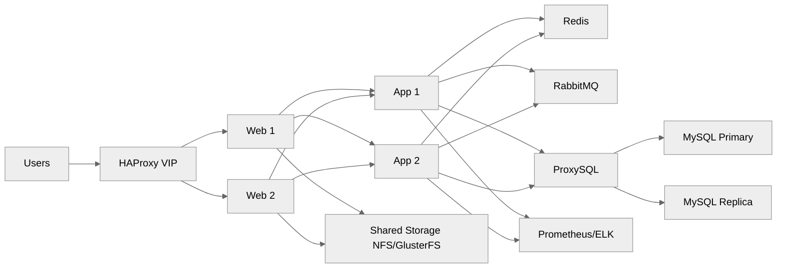
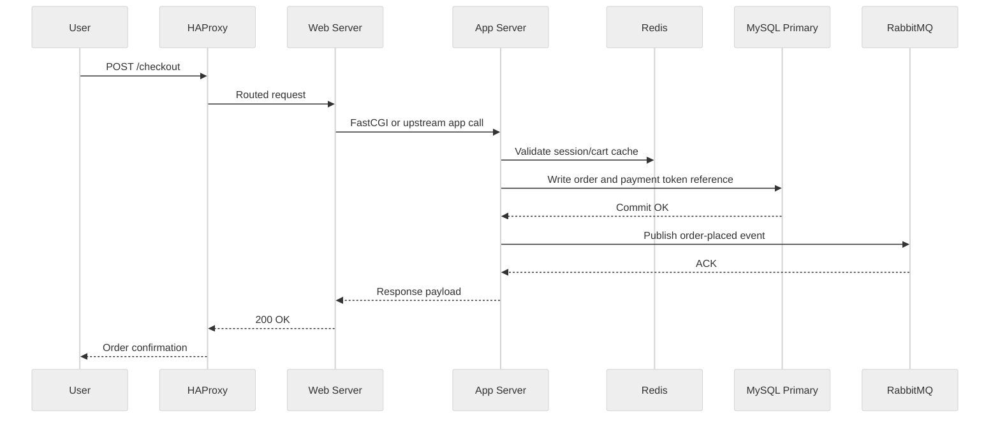
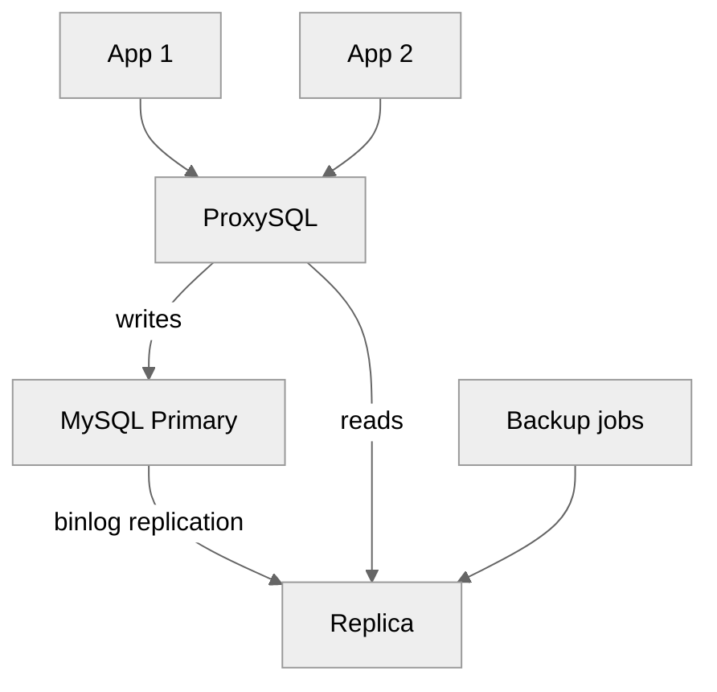

<pre>
╔════════════════════════════════════════════════════╗
║        Intermediate Multi-Tier Setup Guide        ║
╚════════════════════════════════════════════════════╝
</pre>

# 05 Intermediate Multi-Tier Setup

This guide targets a growing ecommerce platform serving roughly 10,000 to 100,000 visitors per day on 3 to 5 physical servers.
It assumes the baseline hardening from [02-os-installation-and-hardening.md](./02-os-installation-and-hardening.md) and the segmentation model from [03-network-architecture.md](./03-network-architecture.md).
Use [06-advanced-production-setup.md](./06-advanced-production-setup.md) when you need multi-datacenter HA or clustering.

## Scenario

Typical target layout:

- 2 web servers.
- 2 application servers.
- 1 primary database server.
- Optional database replica.
- Redis for sessions and cache.
- RabbitMQ for async work.
- HAProxy in front, optionally paired with Keepalived.

## Architecture

## Order placement data flow

## Replication topology

## Recommended host map

| Role | Count | Example spec |
|---|---:|---|
| HAProxy | 1-2 | 4 cores, 8-16 GB RAM, SSD RAID1 |
| Web | 2 | 8 cores, 32 GB RAM, SSD RAID1 |
| App | 2 | 8-16 cores, 32-64 GB RAM, SSD RAID1 |
| Redis/RabbitMQ | 1 | 8 cores, 32 GB RAM, SSD RAID1 |
| DB Primary | 1 | 16-24 cores, 128 GB RAM, SSD RAID10 |
| DB Replica | 0-1 | same as primary or smaller depending on read load |
| Monitoring | optional | 8 cores, 32 GB RAM, SSD or shared storage |

## Web tier

### Responsibilities

- TLS termination if not done on HAProxy.
- Static file serving.
- Reverse proxying to app tier.
- Rate limiting and basic request normalization.
- Health endpoints for load balancers.

### Nginx reverse proxy config for web tier

~~~conf
upstream app_backend {
    least_conn;
    server 10.10.30.11:9000 max_fails=3 fail_timeout=10s;
    server 10.10.30.12:9000 max_fails=3 fail_timeout=10s;
    keepalive 64;
}

server {
    listen 443 ssl http2;
    server_name shop.example.com;

    ssl_certificate /etc/letsencrypt/live/shop.example.com/fullchain.pem;
    ssl_certificate_key /etc/letsencrypt/live/shop.example.com/privkey.pem;

    root /srv/www/shared/current/public;
    index index.php index.html;

    location /healthz {
        return 200 'ok';
    }

    location /media/ {
        alias /srv/www/shared/uploads/;
        expires 7d;
        add_header Cache-Control "public, max-age=604800";
    }

    location / {
        try_files $uri $uri/ @app;
    }

    location @app {
        proxy_pass http://app_backend;
        proxy_http_version 1.1;
        proxy_set_header Host $host;
        proxy_set_header X-Forwarded-For $proxy_add_x_forwarded_for;
        proxy_set_header X-Forwarded-Proto https;
        proxy_set_header Connection "";
    }
}
~~~

### Session stickiness on the web tier

If the application cannot yet share session state cleanly:

- Prefer fixing sessions in Redis first.
- Use load balancer stickiness only as a short-term bridge.
- Avoid sticky behavior for long-lived failure scenarios.

HAProxy cookie stickiness example:

~~~cfg
backend bk_shop
    balance roundrobin
    cookie SRV insert indirect nocache secure httponly
    server web01 10.10.20.11:443 ssl verify none check cookie w1
    server web02 10.10.20.12:443 ssl verify none check cookie w2
~~~

### Shared storage for uploads

Use shared storage for user-generated files like product images and invoices.
Choices:

- NFS for simplicity.
- GlusterFS for scale-out but with more operational work.
- CephFS or object storage in more advanced environments.

### NFS server export example

~~~conf
/srv/www/shared 10.10.20.0/24(rw,sync,no_subtree_check) 10.10.30.0/24(rw,sync,no_subtree_check)
~~~

Enable on server:

~~~bash
apt-get install -y nfs-kernel-server || dnf install -y nfs-utils
mkdir -p /srv/www/shared/uploads
chown -R www-data:www-data /srv/www/shared
exportfs -ra
systemctl enable --now nfs-server || systemctl enable --now nfs-kernel-server
~~~

Mount on web nodes:

~~~bash
apt-get install -y nfs-common || dnf install -y nfs-utils
mkdir -p /srv/www/shared
mount -t nfs 10.10.70.20:/srv/www/shared /srv/www/shared
~~~

`/etc/fstab` example:

~~~fstab
10.10.70.20:/srv/www/shared /srv/www/shared nfs defaults,_netdev,hard,timeo=600,retrans=2 0 0
~~~

## Application tier

### Responsibilities

- Business logic.
- API requests.
- Template rendering or framework execution.
- Queue consumers.
- Internal cache usage.

### PHP-FPM app tier example

~~~conf
[shop]
user = shop
group = www-data
listen = 10.10.30.11:9000
pm = dynamic
pm.max_children = 80
pm.start_servers = 12
pm.min_spare_servers = 8
pm.max_spare_servers = 20
pm.max_requests = 1000
request_terminate_timeout = 180s
php_admin_value[memory_limit] = 768M
php_admin_value[session.save_handler] = redis
php_admin_value[session.save_path] = "tcp://10.10.30.21:6379?database=1"
~~~

### Node.js app tier example with systemd

~~~ini
[Unit]
Description=Shop API
After=network.target

[Service]
User=shop
WorkingDirectory=/opt/shop-api/current
Environment=NODE_ENV=production
Environment=PORT=3000
ExecStart=/usr/bin/node server.js
Restart=always
RestartSec=5
LimitNOFILE=200000

[Install]
WantedBy=multi-user.target
~~~

### Python Gunicorn example with systemd

~~~ini
[Unit]
Description=Shop Python App
After=network.target

[Service]
User=shop
Group=shop
WorkingDirectory=/opt/shop/current
Environment="PATH=/opt/shop/venv/bin"
ExecStart=/opt/shop/venv/bin/gunicorn --workers 8 --bind 10.10.30.12:8000 shop.wsgi:application
Restart=always
LimitNOFILE=200000

[Install]
WantedBy=multi-user.target
~~~

## Caching layer

### Redis for sessions and cache

Single Redis host is acceptable at this stage if you have backups and restart tolerance.
If checkout cannot tolerate cache loss, move sooner to Redis Sentinel as described in [06-advanced-production-setup.md](./06-advanced-production-setup.md).

Redis config:

~~~conf
bind 10.10.30.21
protected-mode yes
port 6379
tcp-backlog 511
timeout 0
tcp-keepalive 300
maxmemory 8gb
maxmemory-policy allkeys-lru
appendonly yes
appendfsync everysec
~~~

### Memcached alternative

Use Memcached when:

- You only need simple volatile object caching.
- Persistence is not important.
- Session storage is elsewhere.

Install example:

~~~bash
apt-get install -y memcached libmemcached-tools || dnf install -y memcached
systemctl enable --now memcached
~~~

## Message queue for async order processing

RabbitMQ helps decouple user-facing checkout from slower background tasks.
Common queue jobs:

- Send email confirmation.
- Reserve inventory.
- Trigger invoice generation.
- Sync ERP or warehouse systems.
- Rebuild recommendations.

### RabbitMQ install

~~~bash
apt-get install -y rabbitmq-server || dnf install -y rabbitmq-server
systemctl enable --now rabbitmq-server
rabbitmq-plugins enable rabbitmq_management
~~~

### Create vhost and users

~~~bash
rabbitmqctl add_vhost /shop
rabbitmqctl add_user shopmq ReplaceWithStrongPassword
rabbitmqctl set_permissions -p /shop shopmq ".*" ".*" ".*"
rabbitmqctl add_user monitor ChangeThisMonitoringPassword
rabbitmqctl set_user_tags monitor monitoring
~~~

### Queue design tips

- Keep payment processing idempotent.
- Include correlation IDs in messages.
- Set dead-letter queues for failed jobs.
- Use retry backoff instead of immediate infinite loops.

## Database tier

### MySQL primary-replica replication step by step

This example uses GTID-based replication.
Replace server IDs and passwords.

#### Step 1: primary configuration

`/etc/mysql/mysql.conf.d/mysqld.cnf` or `/etc/my.cnf.d/server.cnf` on DB1:

~~~cnf
[mysqld]
server-id = 101
log_bin = mysql-bin
binlog_format = ROW
gtid_mode = ON
enforce_gtid_consistency = ON
log_slave_updates = ON
read_only = OFF
innodb_buffer_pool_size = 64G
innodb_flush_log_at_trx_commit = 1
sync_binlog = 1
~~~

Restart:

~~~bash
systemctl restart mariadb || systemctl restart mysql
~~~

Create replication user:

~~~sql
CREATE USER 'repl'@'10.10.40.%' IDENTIFIED BY 'ReplaceWithReplicationPassword';
GRANT REPLICATION SLAVE, REPLICATION CLIENT ON *.* TO 'repl'@'10.10.40.%';
FLUSH PRIVILEGES;
~~~

#### Step 2: prepare replica

`/etc/mysql/mysql.conf.d/mysqld.cnf` on DB2:

~~~cnf
[mysqld]
server-id = 102
log_bin = mysql-bin
gtid_mode = ON
enforce_gtid_consistency = ON
log_slave_updates = ON
read_only = ON
super_read_only = ON
relay_log = relay-bin
~~~

#### Step 3: seed data

Using `mysqldump` for moderate databases:

~~~bash
mysqldump --single-transaction --master-data=2 --routines --triggers --all-databases | gzip > /root/full.sql.gz
scp /root/full.sql.gz db02:/root/
ssh db02 'gunzip -c /root/full.sql.gz | mysql'
~~~

#### Step 4: start replication on replica

~~~sql
CHANGE REPLICATION SOURCE TO
  SOURCE_HOST='10.10.40.21',
  SOURCE_USER='repl',
  SOURCE_PASSWORD='ReplaceWithReplicationPassword',
  SOURCE_AUTO_POSITION=1;
START REPLICA;
SHOW REPLICA STATUS\G
~~~

### ProxySQL read/write splitting

Install:

~~~bash
apt-get install -y proxysql || dnf install -y proxysql
systemctl enable --now proxysql
~~~

Basic `proxysql` setup example:

~~~sql
INSERT INTO mysql_servers(hostgroup_id,hostname,port) VALUES (10,'10.10.40.21',3306);
INSERT INTO mysql_servers(hostgroup_id,hostname,port) VALUES (20,'10.10.40.22',3306);
INSERT INTO mysql_users(username,password,default_hostgroup,transaction_persistent) VALUES ('shopuser','ReplaceWithStrongPassword',10,1);
INSERT INTO mysql_replication_hostgroups(writer_hostgroup,reader_hostgroup,check_type,comment) VALUES (10,20,'read_only','shop cluster');
LOAD MYSQL SERVERS TO RUNTIME;
SAVE MYSQL SERVERS TO DISK;
LOAD MYSQL USERS TO RUNTIME;
SAVE MYSQL USERS TO DISK;
~~~

### Connection pooling guidance

- Keep application pool sizes modest.
- Avoid 500 idle DB connections from each app host.
- Measure real concurrency before raising limits.
- Use ProxySQL or app-native pooling.

## Load balancing

### HAProxy with health checks

~~~cfg
global
    log /dev/log local0
    maxconn 50000
    user haproxy
    group haproxy
    daemon

defaults
    mode http
    log global
    option httplog
    option forwardfor
    timeout connect 5s
    timeout client 60s
    timeout server 60s

frontend fe_https
    bind 10.10.10.10:443 ssl crt /etc/haproxy/certs/shop.example.com.pem
    default_backend bk_web

backend bk_web
    balance leastconn
    option httpchk GET /healthz HTTP/1.1\r\nHost:\ shop.example.com
    http-check expect status 200
    cookie SRV insert indirect nocache
    server web01 10.10.20.11:443 ssl verify none check cookie w1
    server web02 10.10.20.12:443 ssl verify none check cookie w2
~~~

### Keepalived for HAProxy high availability

Install:

~~~bash
apt-get install -y keepalived || dnf install -y keepalived
~~~

`/etc/keepalived/keepalived.conf` on primary:

~~~conf
vrrp_script chk_haproxy {
    script "/usr/bin/pgrep haproxy"
    interval 2
    weight 10
}

vrrp_instance VI_1 {
    state MASTER
    interface bond0
    virtual_router_id 51
    priority 150
    advert_int 1
    authentication {
        auth_type PASS
        auth_pass ChangeThisVRRPSecret
    }
    virtual_ipaddress {
        10.10.10.10/24
    }
    track_script {
        chk_haproxy
    }
}
~~~

Secondary uses lower priority, for example `100`.

## Shared session management

Point application sessions to Redis.
This removes web-node affinity requirements.

PHP example:

~~~ini
session.save_handler = redis
session.save_path = "tcp://10.10.30.21:6379?database=1"
~~~

Node.js example concept:

- Use `connect-redis` or equivalent.
- Store only session identifiers in cookies.
- Keep cart state server-side.

## Centralized logging

### rsyslog shipping

On each node:

~~~conf
*.* action(type="omfwd" protocol="tcp" target="10.10.50.31" port="514" Template="RSYSLOG_SyslogProtocol23Format")
~~~

Restart:

~~~bash
systemctl restart rsyslog
~~~

### ELK stack outline

- Elasticsearch for storage and search.
- Logstash or Filebeat for ingestion.
- Kibana for visualization.

Basic Filebeat install example:

~~~bash
apt-get install -y filebeat || dnf install -y filebeat
~~~

`/etc/filebeat/filebeat.yml` minimal example:

~~~yaml
filebeat.inputs:
  - type: filestream
    id: nginx-access
    enabled: true
    paths:
      - /var/log/nginx/access.log
  - type: filestream
    id: app-logs
    enabled: true
    paths:
      - /var/www/shop/shared/logs/*.log
output.logstash:
  hosts: ["10.10.50.31:5044"]
~~~

## Monitoring

### node_exporter

Install on every server:

~~~bash
useradd --system --shell /usr/sbin/nologin node_exporter || true
curl -L -o /root/node_exporter.tar.gz https://github.com/prometheus/node_exporter/releases/download/v1.8.2/node_exporter-1.8.2.linux-amd64.tar.gz
tar -xzf /root/node_exporter.tar.gz -C /root
install -m 0755 /root/node_exporter-1.8.2.linux-amd64/node_exporter /usr/local/bin/node_exporter
~~~

Systemd unit:

~~~ini
[Unit]
Description=Prometheus Node Exporter
After=network.target

[Service]
User=node_exporter
ExecStart=/usr/local/bin/node_exporter
Restart=always

[Install]
WantedBy=multi-user.target
~~~

### Prometheus scrape example

~~~yaml
global:
  scrape_interval: 15s
scrape_configs:
  - job_name: 'node'
    static_configs:
      - targets:
          - 10.10.20.11:9100
          - 10.10.20.12:9100
          - 10.10.30.11:9100
          - 10.10.30.12:9100
          - 10.10.40.21:9100
          - 10.10.40.22:9100
  - job_name: 'haproxy'
    static_configs:
      - targets: ['10.10.10.11:8404']
~~~

### Grafana dashboard ideas

- Requests per second.
- 95th percentile response time.
- Error rate by endpoint.
- Queue depth.
- DB replication lag.
- Redis memory usage.
- Disk latency on DB nodes.

## Deployment workflow

A safe release flow at this stage:

1. Put app server 1 into maintenance drain.
2. Deploy code to app server 1.
3. Run migrations if backward compatible.
4. Validate health checks.
5. Return app server 1 to service.
6. Repeat for app server 2.
7. Clear only safe caches.

## Validation commands

~~~bash
curl -Ik https://shop.example.com/healthz
redis-cli -h 10.10.30.21 info replication
rabbitmqctl list_queues name messages consumers
mysql -e 'SHOW REPLICA STATUS\G' -h 10.10.40.22 -u root -p
mysql -h 10.10.40.11 -u admin -p -e 'SELECT 1'
showmount -e 10.10.70.20
~~~

## Common pitfalls

- Putting uploads on local disks and expecting both web nodes to see the same files.
- Load balancing without application health checks.
- Queue consumers with no retry and dead-letter design.
- Replication configured but never monitored for lag.
- Large DB connection pools overwhelming the primary.
- One shared Redis instance with no memory limit.

## When to move beyond this stage

Move to [06-advanced-production-setup.md](./06-advanced-production-setup.md) when:

- You need active-active across sites.
- Replica lag or failover complexity becomes a business risk.
- Single Redis or single RabbitMQ restarts cause visible incidents.
- Search and cache tiers need their own clusters.
- Compliance requirements force deeper segmentation and auditing.

## Summary

The multi-tier stage separates concerns, reduces noisy-neighbor problems, and makes scaling possible.
Focus on clean load balancing, shared session state, replication health, and centralized visibility before adding more servers.

← Back to Physical Setup
