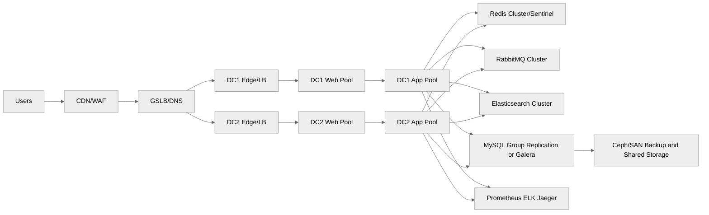
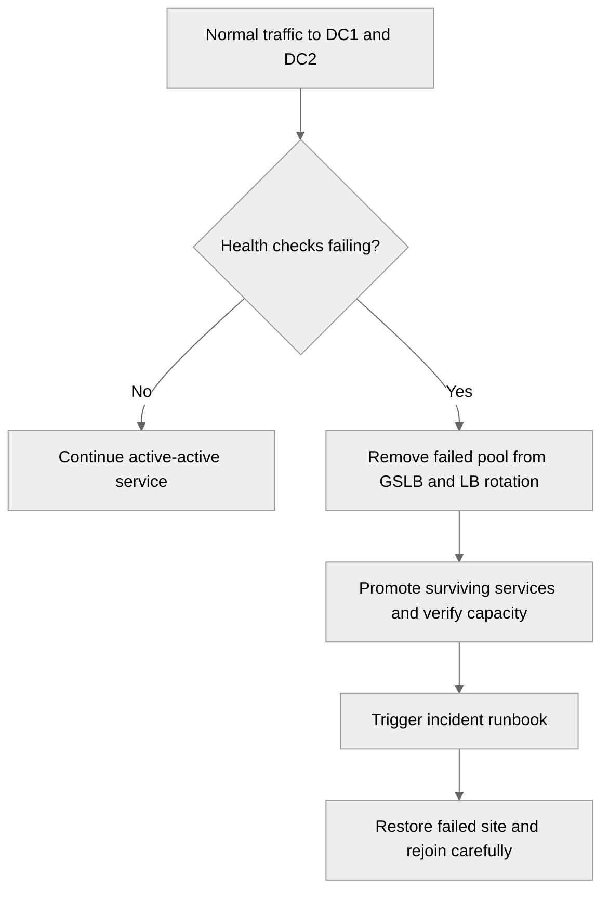
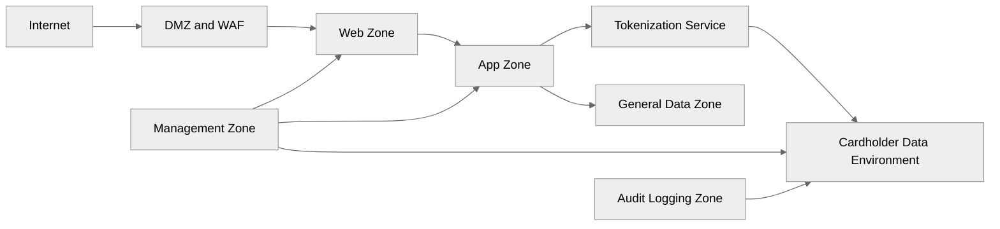

<pre>
╔════════════════════════════════════════════════════╗
║         Advanced Production Setup for Scale       ║
╚════════════════════════════════════════════════════╝
</pre>

# 06 Advanced Production Setup

This guide describes an enterprise ecommerce design for 1M+ visitors per day across 15 to 30 or more physical servers.
It extends the patterns introduced in [05-intermediate-multi-tier-setup.md](./05-intermediate-multi-tier-setup.md) and depends on the controls from [03-network-architecture.md](./03-network-architecture.md) and [07-monitoring-and-observability.md](./07-monitoring-and-observability.md).
Use [08-backup-and-disaster-recovery.md](./08-backup-and-disaster-recovery.md) together with this document for recovery planning.

## Enterprise scenario

Common characteristics:

- Multiple availability zones or data centers.
- Large product catalog and search volume.
- Heavy marketing spikes and seasonal peaks.
- Strict uptime requirements for cart and checkout.
- Compliance boundaries around payments and PII.
- Dedicated teams for network, systems, database, security, and application operations.

## Full production architecture

## Failover flow

## PCI-DSS network zones

## High availability architecture

### Active-active web tier across two data centers

Design goals:

- Both sites serve traffic during normal operation.
- Each site can absorb critical traffic when the other site is down.
- Session state is externalized.
- Static assets are edge-cached.
- Routing changes are controlled centrally.

Requirements:

- Global DNS or GSLB with health checking.
- Consistent app versions across both sites.
- Shared or replicated asset strategy.
- Database design that tolerates multi-site requirements or uses site-aware writes.

### Capacity rule for active-active

Never run both sites at 90% under normal load.
A common target is N+1 site capacity:

- If both sites are active, each runs around 40% to 50% of peak planned traffic.
- If one site fails, the remaining site can absorb the load with degraded but acceptable headroom.

## Database clustering

Choose carefully because database topology affects every other layer.

### Galera Cluster overview

Use Galera when:

- You want multi-primary semantics.
- Your workload can tolerate certification conflicts.
- Latency between nodes is controlled and low.

### MySQL Group Replication overview

Use Group Replication when:

- You want native MySQL high availability.
- You prefer single-primary mode for safer write ordering.
- Your team wants closer alignment to modern MySQL tooling.

### Example Galera setup steps

#### Step 1: install packages

~~~bash
apt-get install -y mariadb-server galera-4 || dnf install -y mariadb-server galera
~~~

#### Step 2: configure each node

`/etc/mysql/mariadb.conf.d/60-galera.cnf`:

~~~cnf
[mysqld]
bind-address = 0.0.0.0
binlog_format = ROW
default_storage_engine = InnoDB
innodb_autoinc_lock_mode = 2
wsrep_on = ON
wsrep_provider = /usr/lib/galera/libgalera_smm.so
wsrep_cluster_name = shop_galera
wsrep_cluster_address = gcomm://10.10.40.21,10.10.40.22,10.20.40.21
wsrep_node_address = 10.10.40.21
wsrep_node_name = db01
wsrep_sst_method = mariabackup
wsrep_sst_auth = sstuser:ReplaceWithSSTPassword
~~~

#### Step 3: create SST user on bootstrap node

~~~sql
CREATE USER 'sstuser'@'%' IDENTIFIED BY 'ReplaceWithSSTPassword';
GRANT RELOAD, LOCK TABLES, PROCESS, REPLICATION CLIENT ON *.* TO 'sstuser'@'%';
~~~

#### Step 4: bootstrap first node

~~~bash
galera_new_cluster
systemctl status mariadb
~~~

#### Step 5: start remaining nodes

~~~bash
systemctl start mariadb
mysql -e "SHOW STATUS LIKE 'wsrep_cluster_size';"
~~~

### Example MySQL Group Replication notes

Core settings usually include:

- `gtid_mode=ON`
- `enforce_gtid_consistency=ON`
- `master_info_repository=TABLE`
- `relay_log_info_repository=TABLE`
- `plugin_load_add=group_replication.so`
- `group_replication_group_seeds` with all member addresses
- `group_replication_single_primary_mode=ON`

## Redis high availability

### Redis Sentinel pattern

Use Redis Sentinel when:

- You need failover for a primary/replica set.
- Your app already supports Sentinel discovery.
- Simplicity is more important than shard scale.

Sentinel config example:

~~~conf
port 26379
sentinel monitor shopredis 10.10.30.21 6379 2
sentinel auth-pass shopredis ReplaceWithRedisPassword
sentinel down-after-milliseconds shopredis 5000
sentinel failover-timeout shopredis 60000
sentinel parallel-syncs shopredis 1
~~~

### Redis Cluster pattern

Use Redis Cluster when:

- Dataset size or throughput exceeds one primary.
- Your application supports cluster-aware clients.
- You can design around hash slot limitations.

Cluster creation example:

~~~bash
redis-cli --cluster create 10.10.30.21:6379 10.10.30.22:6379 10.10.30.23:6379 10.10.30.24:6379 10.10.30.25:6379 10.10.30.26:6379 --cluster-replicas 1
~~~

## RabbitMQ cluster with mirrored or quorum queues

Modern RabbitMQ favors quorum queues for many critical workloads.
Keep queues and publishers idempotent.

Cluster example:

~~~bash
rabbitmqctl stop_app
rabbitmqctl reset
rabbitmqctl join_cluster rabbit@mq01
rabbitmqctl start_app
rabbitmqctl cluster_status
~~~

Quorum queue example:

~~~bash
rabbitmqadmin declare queue name=order_events durable=true arguments='{"x-queue-type":"quorum"}'
~~~

## Storage strategy

### Ceph distributed storage brief

Ceph is useful when:

- You need distributed object or block storage.
- You want failure-domain aware replication.
- Your team can support the operational complexity.

Very short bootstrap example:

~~~bash
cephadm bootstrap --mon-ip 10.10.70.11
ceph orch host add ceph02 10.10.70.12
ceph orch host add ceph03 10.10.70.13
ceph orch apply osd --all-available-devices
ceph -s
~~~

### SAN/NAS usage

Use SAN/NAS when:

- You need enterprise vendor-backed shared storage.
- You want mature snapshots and replication.
- Existing datacenter standards already support it.

Do not assume SAN solves application consistency.
Backups and database transaction correctness still matter.

## CDN and edge caching

### Varnish in front of web servers

Varnish can accelerate cacheable catalog pages while bypassing dynamic checkout paths.
Place it behind the CDN or directly behind the edge LB depending on your architecture.

### Example VCL

~~~vcl
vcl 4.1;

backend default {
    .host = "10.10.20.11";
    .port = "80";
}

sub vcl_recv {
    if (req.url ~ "^/(cart|checkout|account)") {
        return (pass);
    }
    if (req.http.Cookie ~ "session|cart") {
        return (pass);
    }
}

sub vcl_backend_response {
    if (bereq.url ~ "\.(css|js|png|jpg|jpeg|svg|webp)$") {
        set beresp.ttl = 1h;
    }
}
~~~

## Search tier

### Elasticsearch 3-node cluster

Install steps vary by OS, but the cluster design is consistent.
Use three master-eligible nodes at minimum for quorum.

`/etc/elasticsearch/elasticsearch.yml` example for node 1:

~~~yaml
cluster.name: shop-search
node.name: es01
node.roles: [ master, data, ingest ]
network.host: 10.10.50.41
http.port: 9200
discovery.seed_hosts: ["10.10.50.41", "10.10.50.42", "10.10.50.43"]
cluster.initial_master_nodes: ["es01", "es02", "es03"]
xpack.security.enabled: true
~~~

### Product index mapping example

~~~json
PUT /products
{
  "settings": {
    "number_of_shards": 3,
    "number_of_replicas": 1
  },
  "mappings": {
    "properties": {
      "sku": { "type": "keyword" },
      "name": { "type": "text", "fields": { "keyword": { "type": "keyword" } } },
      "category": { "type": "keyword" },
      "brand": { "type": "keyword" },
      "price": { "type": "scaled_float", "scaling_factor": 100 },
      "stock": { "type": "integer" },
      "description": { "type": "text" },
      "created_at": { "type": "date" }
    }
  }
}
~~~

### Index management tips

- Use aliases for zero-downtime reindexing.
- Keep shard counts realistic.
- Monitor JVM heap and merge pressure.
- Use ILM for logs, not product indexes unless there is a time-based reason.

## Payment and PCI-DSS considerations

### Cardholder Data Environment isolation

A typical principle:

- Web tier may receive user requests.
- Tokenization service or payment gateway integration isolates real card handling.
- Only the smallest necessary segment becomes the CDE.
- Non-payment services stay out of CDE where possible.

### Tokenization architecture

Practical model:

1. Customer submits payment details over TLS.
2. Front-end posts directly to payment provider or tokenization service where possible.
3. Application receives a token, not raw PAN.
4. Order service stores token reference only.
5. Audit logs capture transaction events, not card numbers.

### Audit logging requirements

Collect and protect logs for:

- Authentication events.
- Privileged access.
- Firewall policy changes.
- Payment workflow exceptions.
- Database admin changes.
- System clock changes.

## Performance tuning

### Kernel tuning for C10K-style pressure

`/etc/sysctl.d/99-prod-ecommerce.conf`:

~~~conf
net.core.somaxconn = 65535
net.core.netdev_max_backlog = 32768
net.ipv4.tcp_max_syn_backlog = 16384
net.ipv4.ip_local_port_range = 10000 65000
net.ipv4.tcp_fin_timeout = 15
net.ipv4.tcp_tw_reuse = 1
fs.file-max = 4000000
vm.swappiness = 5
vm.max_map_count = 262144
~~~

### Nginx tuning

~~~conf
worker_processes auto;
worker_rlimit_nofile 500000;

events {
    worker_connections 16384;
    multi_accept on;
}

http {
    keepalive_timeout 15;
    keepalive_requests 1000;
    sendfile on;
    tcp_nopush on;
    tcp_nodelay on;
}
~~~

### MySQL tuning starter

~~~cnf
[mysqld]
innodb_buffer_pool_size = 128G
innodb_buffer_pool_instances = 8
innodb_log_file_size = 4G
innodb_flush_log_at_trx_commit = 1
sync_binlog = 1
max_connections = 800
table_open_cache = 8000
thread_cache_size = 200
slow_query_log = 1
long_query_time = 0.5
~~~

### PHP OPcache tuning

~~~ini
opcache.enable=1
opcache.memory_consumption=512
opcache.interned_strings_buffer=32
opcache.max_accelerated_files=50000
opcache.validate_timestamps=0
opcache.revalidate_freq=0
~~~

## Disaster recovery concepts

### RPO and RTO

For ecommerce, define per service:

- Checkout database: RPO near zero, RTO minutes to low hours.
- Catalog search: RPO hours, RTO low hours.
- Static media: RPO hours, RTO hours.
- Monitoring: RPO low importance, but enough to reconstruct incidents.

### Cross-datacenter replication

Use a mix of:

- Database replication.
- Storage replication.
- Config management.
- CI/CD deployment parity.
- DNS or GSLB health checks.

### Failover runbook outline

1. Confirm incident scope.
2. Freeze risky changes.
3. Remove unhealthy site from rotation.
4. Verify surviving site capacity.
5. Promote or reconfigure dependent services if required.
6. Validate checkout, search, login, and order processing.
7. Communicate customer impact.
8. Rebuild failed site only after root cause is known.

### DR drill checklist

- Test GSLB failover.
- Test DB node loss.
- Test Redis primary loss.
- Test RabbitMQ node loss.
- Test search node loss.
- Test restore of one app server from bare metal.
- Time every step and compare to RTO.

## Blue-green deployment on physical servers

Pattern:

- Blue pool serves current production.
- Green pool receives new release.
- Database schema changes must be backward compatible.
- Load balancer switches traffic after validation.
- Rollback means returning traffic to blue.

HAProxy switching concept:

~~~cfg
backend bk_blue
    server webb1 10.10.20.11:443 ssl verify none check
    server webb2 10.10.20.12:443 ssl verify none check

backend bk_green
    server webg1 10.10.20.31:443 ssl verify none check
    server webg2 10.10.20.32:443 ssl verify none check
~~~

## Operational validation commands

~~~bash
mysql -e "SHOW STATUS LIKE 'wsrep_cluster_size';"
mysql -e "SELECT MEMBER_HOST,MEMBER_STATE FROM performance_schema.replication_group_members;" || true
redis-cli -h 10.10.30.21 info replication
rabbitmqctl cluster_status
curl -s http://10.10.50.41:9200/_cluster/health?pretty
ceph -s || true
~~~

## Common pitfalls

- Trying multi-primary writes without understanding conflict behavior.
- Running cross-site synchronous traffic over unstable latency.
- Treating PCI boundaries as documentation only instead of real ACLs and logging.
- Oversharding Elasticsearch.
- Using Varnish without clear cache bypass rules for carts and checkout.
- Assuming SAN replication alone equals application-level DR.

## Summary

Enterprise ecommerce on bare metal requires disciplined separation, redundancy, and tested failover.
Scale is not just more servers; it is more coordination across networking, storage, application state, payments, observability, and recovery.

← Back to Physical Setup
