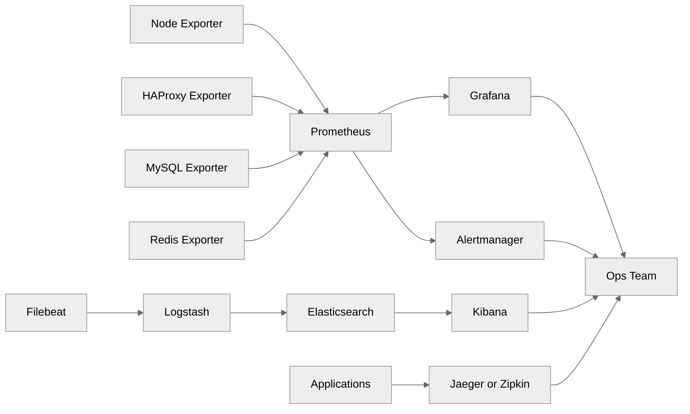
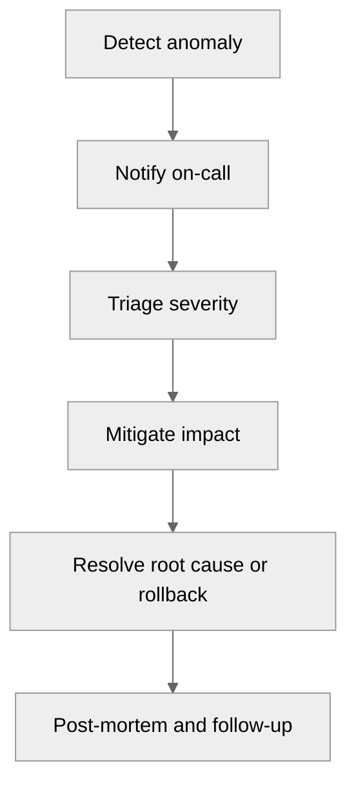

<pre>
╔════════════════════════════════════════════════════╗
║        Monitoring and Observability Guide         ║
╚════════════════════════════════════════════════════╝
</pre>

# 07 Monitoring and Observability

This document describes a practical observability stack for physical ecommerce infrastructure.
It complements [05-intermediate-multi-tier-setup.md](./05-intermediate-multi-tier-setup.md) and [06-advanced-production-setup.md](./06-advanced-production-setup.md).
Use [08-backup-and-disaster-recovery.md](./08-backup-and-disaster-recovery.md) together with this guide so alerting and recovery procedures line up.

## Goals

- Collect host, service, and business metrics.
- Centralize logs from every server role.
- Add tracing for distributed request visibility.
- Detect incidents before customers report them.
- Build actionable on-call workflows.

## Monitoring architecture

## Alert flow

## Prometheus installation

### Install Prometheus

~~~bash
useradd --system --no-create-home --shell /usr/sbin/nologin prometheus || true
mkdir -p /etc/prometheus /var/lib/prometheus
curl -L -o /root/prometheus.tar.gz https://github.com/prometheus/prometheus/releases/download/v2.54.1/prometheus-2.54.1.linux-amd64.tar.gz
tar -xzf /root/prometheus.tar.gz -C /root
install -m 0755 /root/prometheus-2.54.1.linux-amd64/prometheus /usr/local/bin/prometheus
install -m 0755 /root/prometheus-2.54.1.linux-amd64/promtool /usr/local/bin/promtool
cp -r /root/prometheus-2.54.1.linux-amd64/consoles /etc/prometheus/
cp -r /root/prometheus-2.54.1.linux-amd64/console_libraries /etc/prometheus/
chown -R prometheus:prometheus /etc/prometheus /var/lib/prometheus
~~~

### Prometheus config

`/etc/prometheus/prometheus.yml`:

~~~yaml
global:
  scrape_interval: 15s
  evaluation_interval: 15s

alerting:
  alertmanagers:
    - static_configs:
        - targets: ['10.10.50.22:9093']

scrape_configs:
  - job_name: 'node'
    static_configs:
      - targets:
          - '10.10.20.11:9100'
          - '10.10.20.12:9100'
          - '10.10.30.11:9100'
          - '10.10.30.12:9100'
          - '10.10.40.21:9100'
          - '10.10.50.31:9100'

  - job_name: 'haproxy'
    static_configs:
      - targets: ['10.10.10.11:8404']

  - job_name: 'mysql'
    static_configs:
      - targets: ['10.10.40.21:9104']

  - job_name: 'redis'
    static_configs:
      - targets: ['10.10.30.21:9121']
~~~

### Systemd unit

~~~ini
[Unit]
Description=Prometheus
After=network.target

[Service]
User=prometheus
Group=prometheus
ExecStart=/usr/local/bin/prometheus --config.file=/etc/prometheus/prometheus.yml --storage.tsdb.path=/var/lib/prometheus --web.listen-address=0.0.0.0:9090
Restart=always

[Install]
WantedBy=multi-user.target
~~~

## Exporters

### node_exporter

Install on every host as shown in [05-intermediate-multi-tier-setup.md](./05-intermediate-multi-tier-setup.md).
Track:

- CPU load.
- Memory pressure.
- Disk IOPS and latency.
- NIC throughput and errors.
- Filesystem usage.
- Systemd service state via side exporters or integration.

### mysqld_exporter

~~~bash
useradd --system --no-create-home --shell /usr/sbin/nologin mysqld_exporter || true
curl -L -o /root/mysqld_exporter.tar.gz https://github.com/prometheus/mysqld_exporter/releases/download/v0.15.1/mysqld_exporter-0.15.1.linux-amd64.tar.gz
tar -xzf /root/mysqld_exporter.tar.gz -C /root
install -m 0755 /root/mysqld_exporter-0.15.1.linux-amd64/mysqld_exporter /usr/local/bin/mysqld_exporter
~~~

Credentials file:

~~~ini
[client]
user=exporter
password=ReplaceWithStrongPassword
~~~

### redis_exporter

~~~bash
curl -L -o /usr/local/bin/redis_exporter https://github.com/oliver006/redis_exporter/releases/download/v1.63.0/redis_exporter-v1.63.0.linux-amd64
chmod 755 /usr/local/bin/redis_exporter
~~~

## Grafana

### Install Grafana

~~~bash
apt-get install -y grafana || dnf install -y grafana
systemctl enable --now grafana-server
~~~

### Dashboard panels for ecommerce

Create dashboards for:

- Orders per minute.
- Cart abandonment ratio.
- Checkout success rate.
- P95 and P99 response time.
- Payment gateway latency.
- Search response time.
- Queue backlog.
- Replication lag.
- Redis eviction rate.
- Disk latency on DB hosts.

### Example PromQL ideas

Orders per minute from an app metric:

~~~promql
sum(rate(shop_orders_total[1m])) * 60
~~~

Cart abandonment rate:

~~~promql
(sum(rate(shop_cart_abandoned_total[5m])) / sum(rate(shop_checkout_started_total[5m]))) * 100
~~~

P95 latency:

~~~promql
histogram_quantile(0.95, sum(rate(http_request_duration_seconds_bucket[5m])) by (le))
~~~

## Alertmanager

### Alertmanager config

`/etc/alertmanager/alertmanager.yml`:

~~~yaml
global:
  resolve_timeout: 5m

route:
  receiver: default-email
  group_by: ['alertname', 'instance']
  group_wait: 30s
  group_interval: 5m
  repeat_interval: 2h
  routes:
    - matchers:
        - severity="critical"
      receiver: pagerduty

receivers:
  - name: default-email
    email_configs:
      - to: ops@example.com
        from: alertmanager@example.com
        smarthost: mail.example.com:25
  - name: pagerduty
    pagerduty_configs:
      - routing_key: ReplaceWithPagerDutyKey
~~~

### Example alert rules

`/etc/prometheus/rules/ecommerce.yml`:

~~~yaml
groups:
  - name: ecommerce
    rules:
      - alert: InstanceDown
        expr: up == 0
        for: 2m
        labels:
          severity: critical
        annotations:
          summary: "Instance down: {{ $labels.instance }}"

      - alert: HighCPU
        expr: 100 - (avg by(instance)(irate(node_cpu_seconds_total{mode="idle"}[5m])) * 100) > 85
        for: 10m
        labels:
          severity: warning
        annotations:
          summary: "High CPU on {{ $labels.instance }}"

      - alert: DiskAlmostFull
        expr: (node_filesystem_avail_bytes{fstype!~"tmpfs|overlay"} / node_filesystem_size_bytes{fstype!~"tmpfs|overlay"}) < 0.15
        for: 15m
        labels:
          severity: critical
        annotations:
          summary: "Disk usage critical on {{ $labels.instance }}"

      - alert: OrderProcessingLag
        expr: shop_order_queue_lag_seconds > 120
        for: 5m
        labels:
          severity: critical
        annotations:
          summary: "Order processing lag exceeds 2 minutes"
~~~

## Logging with ELK

### Stack roles

- Elasticsearch stores and indexes logs.
- Logstash transforms and parses logs.
- Kibana provides search and dashboards.
- Filebeat tails logs on each host.

### Logstash input/output example

~~~conf
input {
  beats {
    port => 5044
  }
}

filter {
  if [log][file][path] =~ "nginx/access.log" {
    grok {
      match => { "message" => "%{COMBINEDAPACHELOG}" }
    }
  }
}

output {
  elasticsearch {
    hosts => ["http://10.10.50.31:9200"]
    index => "logs-%{+YYYY.MM.dd}"
  }
}
~~~

### Filebeat example

~~~yaml
filebeat.inputs:
  - type: filestream
    id: nginx
    paths:
      - /var/log/nginx/access.log
      - /var/log/nginx/error.log
  - type: filestream
    id: app
    paths:
      - /var/www/shop/shared/logs/*.log
  - type: filestream
    id: mysql-slow
    paths:
      - /var/log/mysql/slow.log
output.logstash:
  hosts: ["10.10.50.31:5044"]
~~~

### Structured logging best practices

- Emit JSON from applications where possible.
- Include request ID, user ID hash, session ID hash, order ID, and service name.
- Never log card data or secrets.
- Log payment gateway result codes without sensitive payloads.
- Use UTC timestamps everywhere.

## APM and tracing

### Why tracing matters

Metrics show that something is slow.
Tracing shows where the time went.
This is especially useful across LB, web, app, Redis, queue, and DB hops.

### Jaeger all-in-one lab example

~~~bash
docker run -d --name jaeger \
  -e COLLECTOR_ZIPKIN_HOST_PORT=:9411 \
  -p 5775:5775/udp -p 6831:6831/udp -p 6832:6832/udp \
  -p 5778:5778 -p 16686:16686 -p 14268:14268 -p 9411:9411 \
  jaegertracing/all-in-one:1.58
~~~

### Tracing fields to capture

- Request ID.
- Customer journey stage.
- DB query count.
- External API latency.
- Queue publish and consume timing.
- Cache hit or miss tags.

## Uptime monitoring

### External checks

Use external probes from outside the datacenter.
Check:

- Home page.
- Product page.
- Search API.
- Checkout start page.
- TLS certificate expiry.

### Synthetic checkout monitoring

A synthetic flow should:

1. Open home page.
2. Search a product.
3. Add an item to cart.
4. Start checkout.
5. Stop before placing a real payment or use a test gateway.

## Capacity dashboards

Create panels for:

- IOPS per database volume.
- Network throughput per uplink.
- PHP-FPM active workers.
- DB connection pool usage.
- Redis hit ratio.
- RabbitMQ queue depth.
- Elasticsearch JVM heap.
- Backup duration trend.

## Incident response

### On-call rotation basics

- Primary engineer for the week.
- Secondary backup engineer.
- Escalation to DB, network, or security owner.
- Clear handover notes between shifts.

### Severity levels for ecommerce

| Severity | Description | Example |
|---|---|---|
| P1 | Revenue or checkout severely impacted | Checkout down, all orders failing |
| P2 | Major feature degraded | Search broken, login failing intermittently |
| P3 | Non-critical degradation | Slow admin reports, minor cache issue |
| P4 | Informational | Single replica warning, no customer impact |

### First 15 minutes checklist

- Confirm user impact.
- Identify blast radius.
- Freeze unrelated deployments.
- Assign incident lead.
- Start incident timeline.
- Mitigate quickly before deep optimization.

### Post-mortem template

- Incident title.
- Start and end time.
- Impact summary.
- Detection source.
- Timeline.
- Root cause.
- Contributing factors.
- What worked well.
- What failed.
- Action items with owners and due dates.

## Validation commands

~~~bash
promtool check config /etc/prometheus/prometheus.yml
curl -s http://10.10.50.21:9090/-/healthy
curl -s http://10.10.50.22:9093/-/healthy
curl -s http://10.10.50.31:9200/_cluster/health?pretty
filebeat test output
~~~

## Common pitfalls

- Too many noisy alerts with no routing logic.
- Metrics without business context.
- Logging secrets or PII.
- No correlation ID passed between services.
- Dashboards full of host metrics but missing order and checkout metrics.
- Synthetic checks that never test the real customer path.

## Summary

Observability for ecommerce must connect infrastructure, application behavior, and revenue signals.
Measure the systems, the queues, the database, and the business journey together.

← Back to Physical Setup
