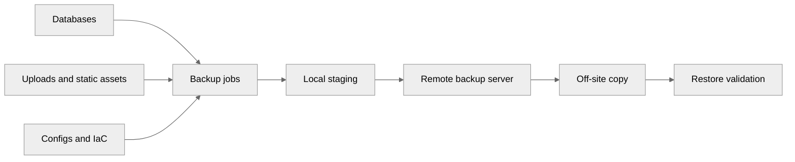
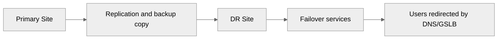
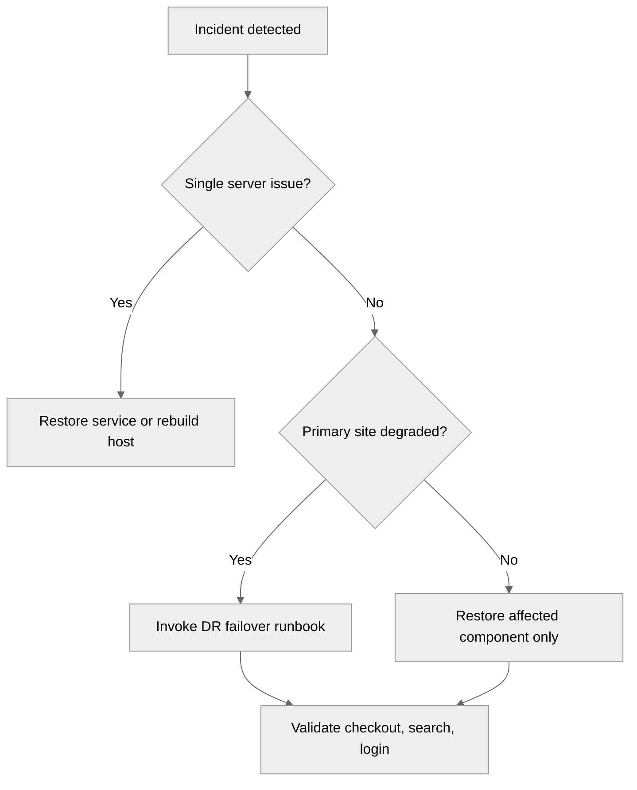

<pre>
╔════════════════════════════════════════════════════╗
║        Backup and Disaster Recovery Guide         ║
╚════════════════════════════════════════════════════╝
</pre>

# 08 Backup and Disaster Recovery

This document covers backup strategy, database and file backups, configuration protection, DR planning, and validation drills for physical ecommerce infrastructure.
Read [04-basic-single-server-setup.md](./04-basic-single-server-setup.md), [05-intermediate-multi-tier-setup.md](./05-intermediate-multi-tier-setup.md), and [06-advanced-production-setup.md](./06-advanced-production-setup.md) for the environments these procedures protect.
Observability and alerting should also be aligned with [07-monitoring-and-observability.md](./07-monitoring-and-observability.md).

## Principles

- Backups exist to support restores.
- Recovery objectives must be explicit.
- One verified off-site copy is the minimum, not the goal.
- Database consistency matters more than raw file copies.
- DR plans must be timed and practiced.

## Backup flow

## DR architecture

## Recovery decision tree

## Backup strategy

### 3-2-1 rule

For ecommerce data:

- Keep at least 3 copies.
- Store copies on at least 2 media types or failure domains.
- Keep at least 1 copy off-site or logically isolated.

Practical example:

- Production DB and file storage.
- Local backup appliance or backup server.
- Off-site replicated backup repository.

### Full vs incremental vs differential

- Full: every file or data block copied each run.
- Incremental: only changes since the last backup.
- Differential: changes since the last full backup.

Use cases:

- Small database: nightly full may be acceptable.
- Large database: hot backup plus binary logs.
- Files: daily incremental plus weekly synthetic full.
- Configs: on every change using version control.

## Backup schedule matrix

| Data set | Method | Frequency | Retention |
|---|---|---|---|
| MySQL small DB | `mysqldump` | every 4h | 7-30 days |
| MySQL large DB | Percona XtraBackup | nightly | 14-30 days |
| Binary logs | streaming/copy | every 5-15 min | 7-14 days |
| PostgreSQL logical | `pg_dump` | daily | 7-30 days |
| PostgreSQL physical | `pg_basebackup` | nightly | 7-14 days |
| Uploaded files | `rsync` or Borg | daily | 30-90 days |
| Configs | etckeeper + Git | on change | long-term |
| Full system image | monthly or before risky change | monthly | 2-6 copies |

## Database backups

### mysqldump for small databases

Advantages:

- Simple.
- Portable.
- Human-readable SQL.
- Works well for smaller datasets.

Command example:

~~~bash
mysqldump --single-transaction --routines --triggers --events --hex-blob ecommerce | gzip > /srv/backups/mysql/ecommerce_$(date +%F_%H%M%S).sql.gz
~~~

Restore example:

~~~bash
gunzip -c /srv/backups/mysql/ecommerce_2025-01-01_020000.sql.gz | mysql ecommerce
~~~

### Percona XtraBackup for hot backups

Use XtraBackup when:

- Databases are too large for long logical dumps.
- You need online physical backups.
- You need faster restore times.

Install example:

~~~bash
apt-get install -y percona-xtrabackup-80 || dnf install -y percona-xtrabackup-80
~~~

#### Step-by-step hot backup

1. Create backup directory.
2. Run `xtrabackup --backup`.
3. Prepare the backup.
4. Copy to remote storage.
5. Test restore on a non-production host.

Commands:

~~~bash
mkdir -p /srv/backups/xtrabackup/2025-01-01_020000
xtrabackup --backup --target-dir=/srv/backups/xtrabackup/2025-01-01_020000 --user=backup --password='ReplaceWithBackupPassword'
xtrabackup --prepare --target-dir=/srv/backups/xtrabackup/2025-01-01_020000
~~~

Restore outline:

~~~bash
systemctl stop mysql || systemctl stop mariadb
rsync -aHAX --delete /srv/backups/xtrabackup/2025-01-01_020000/ /var/lib/mysql/
chown -R mysql:mysql /var/lib/mysql
systemctl start mysql || systemctl start mariadb
~~~

### Point-in-time recovery with binary logs

Enable on MySQL:

~~~cnf
[mysqld]
log_bin = mysql-bin
server-id = 101
binlog_format = ROW
expire_logs_days = 7
~~~

Workflow:

1. Restore full backup.
2. Identify target timestamp before corruption.
3. Replay binary logs up to that point.

Command example:

~~~bash
mysqlbinlog --stop-datetime="2025-01-01 13:59:59" /var/log/mysql/mysql-bin.000123 | mysql -u root -p
~~~

### PostgreSQL backups

Logical dump:

~~~bash
pg_dump -Fc -d ecommerce > /srv/backups/postgres/ecommerce_$(date +%F_%H%M%S).dump
~~~

Restore logical dump:

~~~bash
pg_restore -d ecommerce /srv/backups/postgres/ecommerce_2025-01-01_020000.dump
~~~

Physical base backup:

~~~bash
pg_basebackup -h 10.10.40.31 -D /srv/backups/postgres/base_$(date +%F_%H%M%S) -U replicator -P -X stream
~~~

## File backup

### rsync + SSH

Basic remote copy example:

~~~bash
rsync -aHAX --delete /srv/www/shared/ backup@10.10.50.50:/srv/backups/shop-files/
~~~

Tips:

- Use SSH keys dedicated to backup jobs.
- Restrict backup user commands if possible.
- Log rsync output.
- Validate permissions after restore.

### BorgBackup for deduplication

Initialize repo:

~~~bash
borg init --encryption=repokey backup@10.10.50.50:/srv/borg/shop
~~~

Create backup:

~~~bash
borg create --stats backup@10.10.50.50:/srv/borg/shop::'{hostname}-{now:%Y-%m-%d_%H:%M:%S}' /srv/www/shared /etc /var/www
~~~

Prune old backups:

~~~bash
borg prune -v --list backup@10.10.50.50:/srv/borg/shop --keep-daily=7 --keep-weekly=4 --keep-monthly=6
~~~

### Bacula or Bareos for enterprise backup

Use these when:

- You need centralized enterprise scheduling.
- Multiple backup policies exist per team.
- Tape or large catalog management is involved.
- Compliance requires tighter reporting and retention control.

## Configuration backup

### etckeeper

Track `/etc` changes in Git.

~~~bash
apt-get install -y etckeeper || dnf install -y etckeeper
etckeeper init
etckeeper commit "Initial /etc baseline"
~~~

### Ansible as living backup

Infrastructure-as-code provides reproducibility.
Backups should include:

- Inventory.
- Group variables.
- Service templates.
- Firewall rules.
- TLS automation.
- Monitoring configs.

Example playbook structure:

~~~text
ansible/
├── inventories/
├── group_vars/
├── roles/
│   ├── nginx/
│   ├── mysql/
│   ├── redis/
│   └── monitoring/
└── site.yml
~~~

## Disaster recovery plan

### DR tiers

#### Cold site

- Minimal hardware.
- Slowest activation.
- Lowest cost.
- Best for non-critical or budget-limited environments.

#### Warm site

- Some systems ready.
- Data replicated periodically.
- Moderate failover time.
- Common for serious mid-size ecommerce.

#### Hot site

- Systems already running.
- Near-real-time replication.
- Fastest failover.
- Highest cost and operational complexity.

### Example RTO/RPO targets

| Component | RPO | RTO |
|---|---|---|
| Checkout DB | 0-5 min | 15-60 min |
| Product catalog DB | 15 min | 1-2 h |
| Search cluster | 30-60 min | 1-4 h |
| Media files | 1 h | 2-4 h |
| Monitoring | 4 h | 4-8 h |

### Failover procedure runbook

1. Declare disaster or major outage.
2. Confirm primary site status and blast radius.
3. Freeze deployments and schema changes.
4. Ensure latest backups and replication status are known.
5. Activate DR load balancers or DNS records.
6. Promote DR database or validate cluster leadership.
7. Repoint applications to DR dependencies.
8. Validate login, search, product pages, cart, and checkout.
9. Notify stakeholders and support teams.
10. Track business metrics until stable.

### Data center failover with DNS or GSLB

DNS-based example:

- Lower TTL before planned maintenance.
- Switch `shop.example.com` to DR VIP.
- Monitor recursive resolver propagation delay.
- Keep old site isolated from writes until reconciliation is safe.

## Testing and drills

### DR drill schedule

Recommended cadence:

- Monthly restore test of one database backup.
- Monthly restore test of one file backup.
- Quarterly application failover walkthrough.
- Semiannual full site DR simulation.

### Chaos concepts for bare metal

Examples:

- Power off a web server during peak-like load.
- Disable one database replica network link.
- Fill a log partition in staging.
- Pull one switch uplink in a maintenance window.

### Recovery time validation

For every drill, capture:

- Start time of incident.
- Detection time.
- Decision time.
- Recovery start time.
- Service restored time.
- Residual errors after recovery.

## Verification scripts

### Backup verification script example

~~~bash
#!/usr/bin/env bash
set -euo pipefail
LATEST_SQL=$(ls -1t /srv/backups/mysql/*.sql.gz | head -n1)
gzip -t "$LATEST_SQL"
LATEST_BORG=$(borg list backup@10.10.50.50:/srv/borg/shop | tail -n1 | awk '{print $1}')
test -n "$LATEST_BORG"
echo "backup verification passed"
~~~

### Restore test checklist

- Provision clean host or VM.
- Restore database backup.
- Restore uploads/configs.
- Point staging app to restored data.
- Log in to admin panel.
- Browse catalog.
- Place a test order.
- Confirm expected media files exist.

## Security considerations

- Encrypt backup transport.
- Encrypt backup repositories at rest.
- Restrict backup credentials.
- Store backup keys separately from backup data.
- Audit restore access.
- Keep immutable or append-only backups for ransomware resilience where possible.

## Common pitfalls

- Backups stored only on the production site.
- Never testing restore speed.
- No binary logs for MySQL PITR.
- No asset backup for uploaded images.
- No versioning for `/etc` and service configs.
- DR plan that exists only as a document nobody rehearses.

## Summary

Strong backup and DR discipline turns an infrastructure failure into an operational event instead of a business-ending outage.
Back up often, copy off-site, test restores, define RPO/RTO clearly, and drill the runbooks until they feel routine.

← Back to Physical Setup
