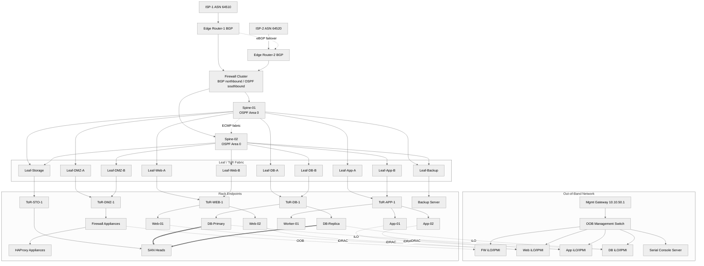
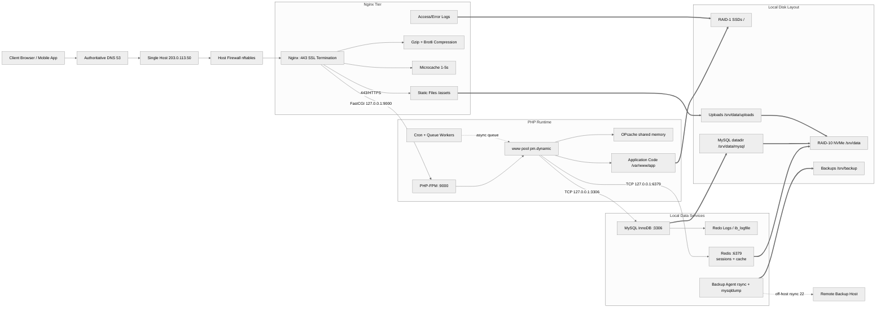
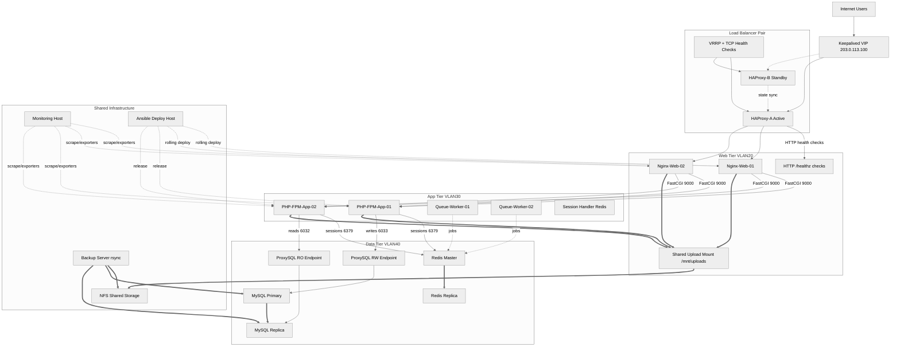
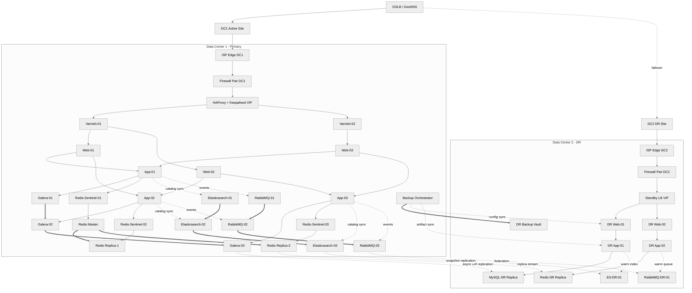
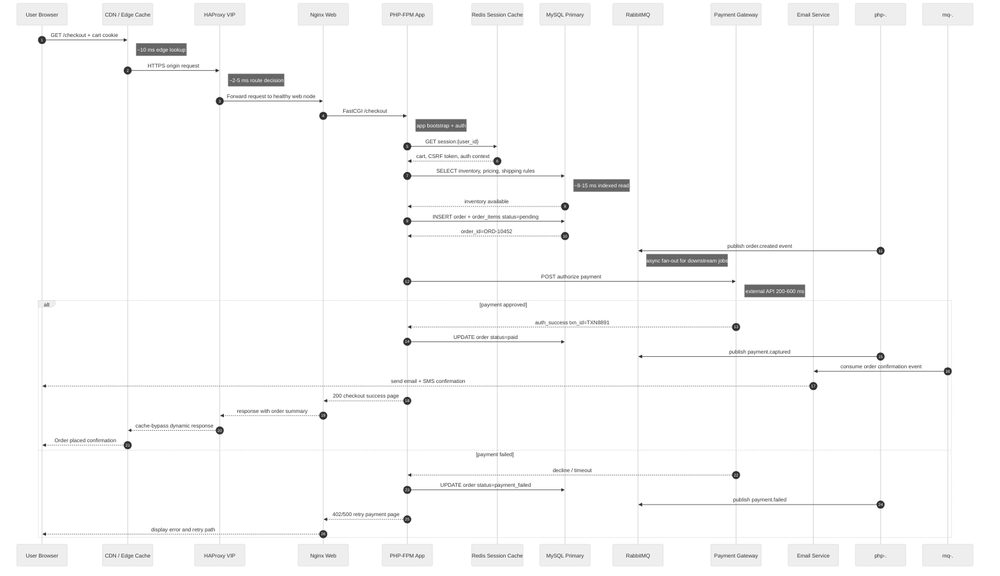
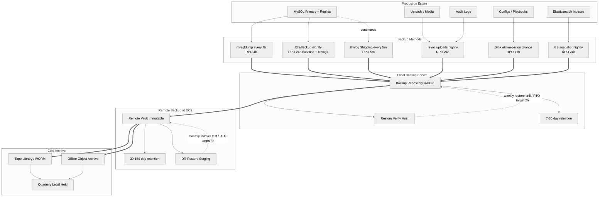
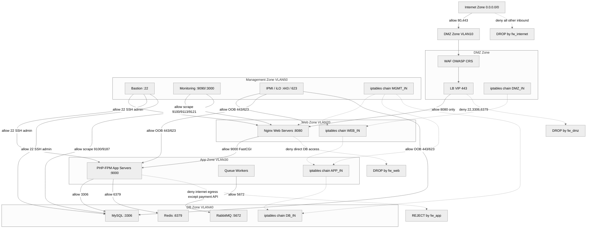
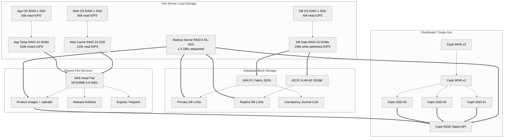

# 09 Architecture Diagrams

Complete Visual Architecture Reference for Physical Ecommerce Setup

This guide is diagram-first by design. It complements the physical setup documents with detailed visual references for topology, request flow, monitoring, security, and recovery.
Each Mermaid diagram is intentionally large so teams can use it during planning, reviews, implementations, and operations runbooks without needing to redraw the system from scratch.

---

## Diagram 1 — Complete Physical Data Center Layout

This diagram shows a rack-aware physical ecommerce deployment with clear separation between the DMZ, web, application, database, storage, and management planes.
It maps VLANs, IP ranges, switch uplinks, and out-of-band access so operators can understand both service traffic and operational traffic in one view.

**When to use:** Use this for a production-ready bare-metal deployment that needs strong tier isolation, dual-homed switching, and explicit management network planning.

```mermaid
%%{init:{"theme":"neutral"}}%%
graph TB
    internet_clients[Internet Users] --> isp_edge_a[ISP Edge A 203.0.113.2/30]
    internet_clients --> isp_edge_b[ISP Edge B 198.51.100.2/30]
    isp_edge_a --> fw_pair[Perimeter Firewall Pair<br/>203.0.113.10 / 198.51.100.10]
    isp_edge_b --> fw_pair
    fw_pair --> core_pair[Core Switch Stack<br/>L3 Gateway 10.10.0.1]
    core_pair --> mgmt_switch[Mgmt Switch VLAN50 10.10.50.0/24]
    core_pair --> san_switch[Storage Fabric FC/iSCSI]

    subgraph dmz_zone[DMZ Rack - VLAN10 10.10.10.0/24]
        waf_a[WAF-A 10.10.10.11]
        waf_b[WAF-B 10.10.10.12]
        lb_a[LB-A HAProxy 10.10.10.21]
        lb_b[LB-B HAProxy 10.10.10.22]
        dmz_sw_a[Leaf-DMZ-A]
        dmz_sw_b[Leaf-DMZ-B]
    end

    subgraph web_zone[Web Rack - VLAN20 10.10.20.0/24]
        web_01[Web-01 Nginx 10.10.20.11]
        web_02[Web-02 Nginx 10.10.20.12]
        web_03[Web-03 Static/Canary 10.10.20.13]
        web_sw_a[Leaf-Web-A]
        web_sw_b[Leaf-Web-B]
    end

    subgraph app_zone[Application Rack - VLAN30 10.10.30.0/24]
        app_01[App-01 PHP-FPM 10.10.30.11]
        app_02[App-02 PHP-FPM 10.10.30.12]
        app_03[Worker-01 Queue 10.10.30.21]
        app_04[Worker-02 Queue 10.10.30.22]
        app_sw_a[Leaf-App-A]
        app_sw_b[Leaf-App-B]
    end

    subgraph db_zone[Database Rack - VLAN40 10.10.40.0/24]
        db_primary[MySQL Primary 10.10.40.11]
        db_replica[MySQL Replica 10.10.40.12]
        redis_cache[Redis Cache 10.10.40.21]
        proxysql_db[ProxySQL 10.10.40.31]
        db_sw_a[Leaf-DB-A]
        db_sw_b[Leaf-DB-B]
    end

    subgraph storage_zone[Storage Rack]
        nas_share[NAS Shared Uploads 10.10.60.20]
        san_array[SAN Array DB LUNs 10.10.60.30]
        backup_target[Backup Appliance 10.10.60.40]
        storage_sw_a[Leaf-Storage-A]
        storage_sw_b[Leaf-Storage-B]
    end

    subgraph mgmt_zone[Management VLAN50 10.10.50.0/24]
        bastion[Bastion Host 10.10.50.10]
        monitor[Prometheus/Grafana 10.10.50.20]
        ansible[Config Server 10.10.50.30]
        idrac_web01[iLO Web-01 10.10.50.111]
        idrac_web02[iLO Web-02 10.10.50.112]
        idrac_app01[iLO App-01 10.10.50.121]
        idrac_app02[iLO App-02 10.10.50.122]
        idrac_db01[iLO DB-01 10.10.50.131]
        idrac_db02[iLO DB-02 10.10.50.132]
    end

    core_pair --> dmz_sw_a
    core_pair --> dmz_sw_b
    core_pair --> web_sw_a
    core_pair --> web_sw_b
    core_pair --> app_sw_a
    core_pair --> app_sw_b
    core_pair --> db_sw_a
    core_pair --> db_sw_b
    core_pair --> storage_sw_a
    core_pair --> storage_sw_b

    fw_pair --> waf_a
    fw_pair --> waf_b
    waf_a --> lb_a
    waf_b --> lb_b
    lb_a --> web_01
    lb_a --> web_02
    lb_b --> web_02
    lb_b --> web_03
    web_01 --> app_01
    web_01 --> app_02
    web_02 --> app_01
    web_02 --> app_02
    web_03 --> app_02
    app_01 --> proxysql_db
    app_02 --> proxysql_db
    app_03 -.->|async jobs| redis_cache
    app_04 -.->|async jobs| redis_cache
    proxysql_db --> db_primary
    proxysql_db --> db_replica
    db_primary ==> san_array
    db_replica ==> san_array
    web_01 ==> nas_share
    web_02 ==> nas_share
    app_01 ==> nas_share
    app_02 ==> nas_share
    backup_target ==> nas_share
    backup_target ==> san_array
    mgmt_switch --> bastion
    mgmt_switch --> monitor
    mgmt_switch --> ansible
    mgmt_switch --> idrac_web01
    mgmt_switch --> idrac_web02
    mgmt_switch --> idrac_app01
    mgmt_switch --> idrac_app02
    mgmt_switch --> idrac_db01
    mgmt_switch --> idrac_db02
```

**Key takeaways**
- Traffic and operations are cleanly separated by VLANs so troubleshooting does not disrupt production data paths.
- Every critical tier is dual-homed to switching and has at least two compute nodes except for optional auxiliary services.
- The management network is isolated from customer traffic and terminates through bastion plus iLO/IPMI access.

## Diagram 2 — Network Architecture (Spine-Leaf)

This view focuses on switching, routing, and out-of-band control for a medium-sized ecommerce data center using a spine-leaf fabric.
It highlights redundant uplinks, ISP diversity, firewall insertion points, and the difference between in-band production traffic and OOB management traffic.

**When to use:** Use this when the infrastructure is beyond a single rack and you need predictable east-west performance, rapid failure domains, and simpler scale-out networking.

**Key takeaways**
- BGP is used at the ISP edge while OSPF or ECMP inside the fabric keeps internal routing deterministic.
- Each rack tier has redundant uplinks to both spines, eliminating single-switch dependency for east-west traffic.
- The OOB network remains separate so failed production switching does not block recovery operations.

## Diagram 3 — Single Server Architecture (Basic)

This is the smallest realistic ecommerce footprint: one physical server running the full stack with local redundancy where possible.
It shows the request path, local service boundaries, port usage, and how storage is carved for OS, application data, and backups.

**When to use:** Use this for labs, pilots, or very small stores where budget matters more than horizontal scale and planned downtime is acceptable.

**Key takeaways**
- Nginx terminates TLS, serves static assets, and forwards only dynamic traffic to PHP-FPM on port 9000.
- MySQL and Redis remain local, so latency is low but maintenance or host failure impacts the entire platform.
- RAID-1 protects the OS while RAID-10 is reserved for transactional data and uploads.

## Diagram 4 — Multi-Tier Architecture (Intermediate)

This diagram represents the common intermediate step where load balancing, web, application, database, cache, and storage roles are separated across hosts.
It shows active/standby ingress, health checks, shared file storage, read/write database routing, and centralized backups.

**When to use:** Use this when a single host is no longer enough but the environment is still small enough to manage with simple failover instead of full multi-site clustering.

**Key takeaways**
- Keepalived provides a stable VIP while HAProxy actively checks web node health before routing traffic.
- Redis centralizes sessions so users can move between web and app nodes without sticky-session dependence.
- ProxySQL splits read and write paths, keeping replicas useful without changing application connection logic.

## Diagram 5 — Enterprise Production Architecture (Advanced)

This is a full production reference for a larger ecommerce platform spanning two data centers with global steering and disaster recovery pathways.
The primary site contains clustered caching, search, queueing, and database layers, while the secondary site receives asynchronous replicas and backup streams.

**When to use:** Use this when downtime costs are high, search and queue workloads are material, and the business needs both local high availability and remote DR coverage.

**Key takeaways**
- The primary site uses local clustering for availability, while DC2 stays warm with asynchronous copies to avoid cross-site write latency.
- Search, cache, and messaging are first-class tiers because enterprise ecommerce traffic is rarely database-only.
- Global load balancing keeps customer entry simple while enabling DR redirection when site health drops.

## Diagram 6 — Request Flow: User Places an Order

This sequence follows a shopper from the first HTTPS request through order creation, payment authorization, event emission, and customer confirmation.
It makes the synchronous path and the asynchronous side effects visible, which is useful for latency budgeting and troubleshooting checkout defects.

**When to use:** Use this when teams need a transaction-by-transaction view of checkout behavior, especially during performance tuning or failure analysis.

**Key takeaways**
- Redis removes repeated session reconstruction from the critical path, while MySQL remains the system of record for inventory and order state.
- RabbitMQ decouples notifications and side effects so the customer does not wait on non-critical post-checkout processing.
- Payment handling dominates checkout latency, so upstream stack tuning helps less than external gateway reliability and timeouts.

## Diagram 7 — Backup and Disaster Recovery Architecture

This backup map shows which data types use logical dumps, hot backups, or file-level syncs and how they move from production to local and remote retention tiers.
RPO and RTO goals are attached to the backup chain so infrastructure choices stay tied to recovery outcomes rather than copy mechanics alone.

**When to use:** Use this when building restore runbooks, proving compliance, or validating whether the backup design actually supports the business recovery objectives.

**Key takeaways**
- Hot database backups and binlog shipping are what shorten RPO; nightly file copies alone do not support tight recovery targets.
- Restore verification hosts are mandatory because backup success without restore success is not meaningful protection.
- Cold archive tiers protect against ransomware, operator error, and long-tail compliance retrieval needs.

## Diagram 8 — Monitoring Stack

This observability diagram ties infrastructure metrics, application metrics, centralized logging, and alert routing into one operating picture.
It also shows which exporters and collectors sit close to workloads versus which systems aggregate data for dashboards and incidents.

**When to use:** Use this for any environment where operations need fast correlation between node health, application latency, queue depth, logs, and business alerts.

```mermaid
%%{init:{"theme":"neutral"}}%%
graph TB
    subgraph estate[Observed Systems]
        web_nodes[Web Servers]
        app_nodes[App Servers]
        db_nodes[MySQL Nodes]
        cache_nodes[Redis Nodes]
        mq_nodes[RabbitMQ Nodes]
        search_nodes[Elasticsearch Nodes]
        fw_nodes_obs[Firewall / LB Appliances]
    end

    subgraph metrics[Metrics Collection]
        node_exporter[node_exporter CPU RAM disk NIC]
        mysql_exporter[mysqld_exporter queries lag locks]
        redis_exporter[redis_exporter hits memory evictions]
        rabbit_exporter[rabbitmq_exporter queue depth consumers]
        nginx_exporter[nginx exporter requests latency]
        blackbox_exporter[blackbox_exporter HTTPS /login /checkout]
        prometheus[Prometheus]
        grafana[Grafana Dashboards]
    end

    subgraph logging[Log Pipeline]
        filebeat[Filebeat on servers]
        logstash[Logstash parse + enrich]
        elastic[Elasticsearch logging cluster]
        kibana[Kibana]
    end

    subgraph alerting[Alerting]
        alertmanager[Alertmanager]
        pagerduty[PagerDuty]
        slack[Slack]
        email_ops[Email Ops Inbox]
        sms_oncall[SMS Gateway]
    end

    web_nodes --> node_exporter
    web_nodes --> nginx_exporter
    app_nodes --> node_exporter
    db_nodes --> node_exporter
    db_nodes --> mysql_exporter
    cache_nodes --> redis_exporter
    mq_nodes --> rabbit_exporter
    search_nodes --> node_exporter
    fw_nodes_obs --> blackbox_exporter
    node_exporter --> prometheus
    mysql_exporter --> prometheus
    redis_exporter --> prometheus
    rabbit_exporter --> prometheus
    nginx_exporter --> prometheus
    blackbox_exporter --> prometheus
    prometheus --> grafana
    prometheus --> alertmanager
    alertmanager --> pagerduty
    alertmanager --> slack
    alertmanager --> email_ops
    alertmanager --> sms_oncall
    web_nodes --> filebeat
    app_nodes --> filebeat
    db_nodes --> filebeat
    cache_nodes --> filebeat
    mq_nodes --> filebeat
    search_nodes --> filebeat
    fw_nodes_obs --> filebeat
    filebeat --> logstash
    logstash --> elastic
    elastic --> kibana
```

**Key takeaways**
- Metrics, logs, and synthetic checks cover different failure modes and must be reviewed together during incidents.
- Prometheus and Alertmanager handle thresholding, while ELK answers the detailed why behind those thresholds.
- Exporter choice should match the tier so alerts carry real operational context such as replication lag or queue backlog.

## Diagram 9 — Security Zones and Firewall Rules

This security model divides the platform into explicit trust zones and annotates the only traffic paths that should exist between them.
It is useful for turning architecture intent into concrete firewall objects, iptables chains, and audit conversations.

**When to use:** Use this when you need defendable segmentation boundaries, especially for PCI-sensitive checkout traffic and restricted management access.

**Key takeaways**
- Only the DMZ should face the internet, and each deeper tier should expose fewer protocols than the one before it.
- Bastion-based administration plus explicit monitoring paths reduces the temptation to leave broad SSH access open.
- Firewall chains should mirror architectural zones so audits and rule reviews remain understandable.

## Diagram 10 — Storage Architecture

This storage view shows how ecommerce workloads map different durability and performance needs onto local RAID, NAS, SAN, and distributed storage platforms.
It also annotates rough IOPS and throughput expectations so storage design aligns with application behavior rather than generic capacity planning.

**When to use:** Use this when sizing disks for transactional databases, shared media, backups, and future distributed storage expansion.

**Key takeaways**
- Operating system volumes should prioritize simple redundancy, while database and cache volumes should prioritize low latency and write durability.
- NAS suits shared file workloads, SAN suits transactional block storage, and Ceph suits scale-out object or future cloud-like patterns.
- Storage throughput and IOPS assumptions should be written into the architecture so application growth has an explicit capacity baseline.
