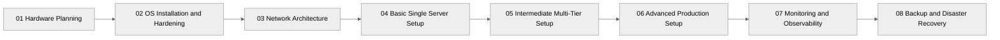
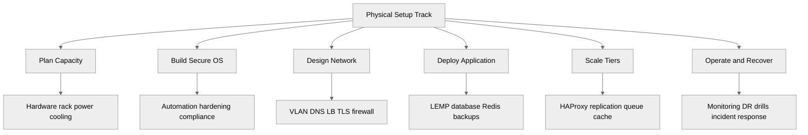

<pre>
╔══════════════════════════════════════════════╗
║      Physical Server Setup — E-Commerce     ║
╚══════════════════════════════════════════════╝
</pre>

# Physical Server Setup — E-Commerce

This track documents how to design, build, harden, operate, and recover a physical-server ecommerce platform.
It is written for labs, small businesses, growing stores, and production-grade teams running workloads on bare metal.
The content starts with one server and ends with multi-datacenter, highly available, compliance-aware deployments.

## What this track covers

- Hardware sizing for storefront, search, checkout, cache, and database workloads.
- Linux installation and hardening for internet-facing ecommerce systems.
- Network design with VLANs, DMZs, internal DNS, load balancers, and TLS.
- Single-server deployments for low-traffic stores.
- Multi-tier production patterns for growing traffic.
- Enterprise HA, storage, monitoring, backups, and disaster recovery.

## Who should use this

- Linux learners building a realistic infrastructure lab.
- Sysadmins moving from VMs or cloud to physical servers.
- DevOps engineers planning on-prem or colo ecommerce stacks.
- Students studying infrastructure architecture end to end.

## Learning path

## Track map

## Recommended reading order

1. Start with [01-hardware-planning.md](./01-hardware-planning.md).
2. Continue with [02-os-installation-and-hardening.md](./02-os-installation-and-hardening.md).
3. Build the network from [03-network-architecture.md](./03-network-architecture.md).
4. Deploy a starter store with [04-basic-single-server-setup.md](./04-basic-single-server-setup.md).
5. Scale out with [05-intermediate-multi-tier-setup.md](./05-intermediate-multi-tier-setup.md).
6. Move to enterprise patterns in [06-advanced-production-setup.md](./06-advanced-production-setup.md).
7. Add visibility from [07-monitoring-and-observability.md](./07-monitoring-and-observability.md).
8. Finish with [08-backup-and-disaster-recovery.md](./08-backup-and-disaster-recovery.md).

## Table of contents

- [01 Hardware Planning](./01-hardware-planning.md)
  - Server specification planning
  - Rack planning
  - Storage architecture
  - Network hardware
  - Power and cooling
  - Capacity planning formulas
- [02 OS Installation and Hardening](./02-os-installation-and-hardening.md)
  - OS selection
  - Automated installation
  - LVM partitioning
  - SSH, firewall, SELinux/AppArmor, sysctl
  - User and PAM controls
- [03 Network Architecture](./03-network-architecture.md)
  - VLANs and subnets
  - DNS and split-horizon design
  - HAProxy and Nginx load balancing
  - Firewall architecture and TLS
  - CDN integration
- [04 Basic Single Server Setup](./04-basic-single-server-setup.md)
  - LEMP stack install
  - Application deployment
  - SSL, monitoring, backups
- [05 Intermediate Multi-Tier Setup](./05-intermediate-multi-tier-setup.md)
  - Web, app, DB tier separation
  - HAProxy, Keepalived, Redis, RabbitMQ
  - Replication, centralized logging, metrics
- [06 Advanced Production Setup](./06-advanced-production-setup.md)
  - Multi-datacenter HA
  - DB clustering
  - Ceph, SAN/NAS, Varnish, Elasticsearch
  - PCI-DSS segmentation and DR
- [07 Monitoring and Observability](./07-monitoring-and-observability.md)
  - Prometheus, Grafana, ELK, tracing, incident response
- [08 Backup and Disaster Recovery](./08-backup-and-disaster-recovery.md)
  - Backup strategy
  - PITR and hot backup
  - DR runbooks and testing
- [09 Architecture Diagrams](./09-architecture-diagrams.md)
  - Physical topology and rack layout
  - Network zones and traffic flows
  - Application, storage, and DR architecture maps

## Prerequisites

### Hardware access

- At least one physical server, mini PC, or rack server for labs.
- Console access through iDRAC, iLO, IPMI, serial, or a crash cart.
- Switch access for VLAN testing.
- A UPS or lab-safe power setup for realistic shutdown testing.
- Enough spare disks to test RAID rebuild and replacement procedures.

### Linux fundamentals

You should be comfortable with:

- Installing Linux from ISO or PXE.
- Editing configs with `vim`, `nano`, or `sed`.
- Managing services with `systemctl`.
- Checking network state with `ip`, `ss`, `ethtool`, and `tcpdump`.
- Managing users, groups, permissions, and SSH keys.
- Reading logs with `journalctl`, `tail`, and `grep`.

### Suggested lab baseline

- CPU: 4 to 8 cores.
- RAM: 16 to 32 GB.
- Storage: 2 SSDs or 2 NVMe drives.
- Network: 1G minimum, 10G preferred for multi-tier labs.
- OS choices: Ubuntu Server LTS, Rocky Linux, RHEL.

## How to use these guides

- Read the planning chapters before ordering hardware.
- Copy examples, but replace IPs, domains, and passwords.
- Test each layer separately before combining them.
- Record your hardware serial numbers, cable labels, and switch ports.
- Keep a rollback plan for BIOS, RAID, network, and OS changes.

## Practical notes

- Physical infrastructure fails differently than cloud resources.
- RAID does not replace backups.
- Separate customer-facing traffic from management traffic.
- Keep payment systems isolated from broader app and admin networks.
- Treat monitoring and backups as day-one requirements, not add-ons.

## File map by maturity level

### Basic

- [01-hardware-planning.md](./01-hardware-planning.md)
- [02-os-installation-and-hardening.md](./02-os-installation-and-hardening.md)
- [03-network-architecture.md](./03-network-architecture.md)
- [04-basic-single-server-setup.md](./04-basic-single-server-setup.md)

### Intermediate

- [05-intermediate-multi-tier-setup.md](./05-intermediate-multi-tier-setup.md)
- [07-monitoring-and-observability.md](./07-monitoring-and-observability.md)
- [08-backup-and-disaster-recovery.md](./08-backup-and-disaster-recovery.md)

### Advanced

- [06-advanced-production-setup.md](./06-advanced-production-setup.md)
- [07-monitoring-and-observability.md](./07-monitoring-and-observability.md)
- [08-backup-and-disaster-recovery.md](./08-backup-and-disaster-recovery.md)

## What success looks like

By the end of this track, you should be able to:

- Size bare-metal infrastructure for an ecommerce workload.
- Install a hardened Linux base image repeatedly.
- Design a secure network with traffic segmentation.
- Deploy a working store on one server.
- Scale into separate web, app, cache, queue, and DB tiers.
- Run monitoring, backup, and DR processes with confidence.

## Cross-reference guide

- Planning storage? Read [01-hardware-planning.md](./01-hardware-planning.md).
- Hardening a host? Read [02-os-installation-and-hardening.md](./02-os-installation-and-hardening.md).
- Designing VLANs and load balancers? Read [03-network-architecture.md](./03-network-architecture.md).
- Building a starter store? Read [04-basic-single-server-setup.md](./04-basic-single-server-setup.md).
- Scaling services horizontally? Read [05-intermediate-multi-tier-setup.md](./05-intermediate-multi-tier-setup.md).
- Preparing for enterprise traffic? Read [06-advanced-production-setup.md](./06-advanced-production-setup.md).
- Adding dashboards and alerts? Read [07-monitoring-and-observability.md](./07-monitoring-and-observability.md).
- Validating restore procedures? Read [08-backup-and-disaster-recovery.md](./08-backup-and-disaster-recovery.md).

## Conventions used in the track

- Commands assume root or `sudo` where required.
- Example private IP ranges use RFC1918 space.
- Domain examples use `example.com`, `shop.example.com`, and `internal.example.com`.
- Service names use Nginx, HAProxy, MySQL, Redis, RabbitMQ, and Elasticsearch as common reference implementations.

## Final advice

Build slowly.
Verify each layer.
Document every cable, IP, password vault entry, BIOS setting, and restore test.
Bare metal rewards preparation.

← Back to Physical Setup
