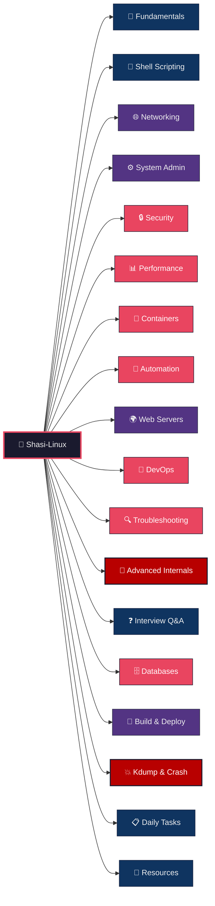
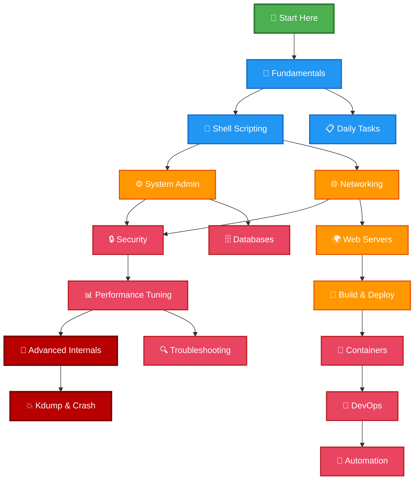

<div align="center">

<pre>
┌──────────────────────────────────────────────────────────────────────┐
│                                                                      │
│   ____  _               _       _     _                              │
│  / ___|| |__   __ _ ___(_)     | |   (_)_ __  _   ___  __           │
│  \___ \| '_ \ / _` / __| |____| |   | | '_ \| | | \ \/ /           │
│   ___) | | | | (_| \__ \ |____| |___| | | | | |_| |>  <            │
│  |____/|_| |_|\__,_|___/_|    |_____|_|_| |_|\__,_/_/\_\           │
│                                                                      │
│            Comprehensive Linux Guide  —  Basic to Advanced           │
│                                                                      │
├──────────────────────────────────────────────────────────────────────┤
│                                                                      │
│   Kernel  : 6.x LTS                  Arch    : x86_64 / ARM64       │
│   Distros : RHEL / Ubuntu / Debian   Shell   : bash 5.x             │
│   Guides  : 18 modules, 235 files   Lines   : 103,000+              │
│                                                                      │
│   Last login: Tue Jun 3 09:23:58 2025 from github.com/ShasidharReddy│
│                                                                      │
├──────────────────────────────────────────────────────────────────────┤
│                                                                      │
│   root@shasi-linux:~$ cat /etc/motd                                  │
│                                                                      │
│   Welcome to Shasi-Linux!                                            │
│   Your complete Linux learning environment.                          │
│                                                                      │
│   Fundamentals > Shell Scripting > Networking > SysAdmin             │
│   Security > Containers > DevOps > Kernel Internals                  │
│                                                                      │
│   Type 'ls' to explore modules. Happy learning!                      │
│                                                                      │
└──────────────────────────────────────────────────────────────────────┘
</pre>

</div>

# 🐧 Shasi-Linux — Comprehensive Guide (Basic → Advanced)

> Complete Linux documentation covering fundamentals to kernel internals — with Mermaid diagrams, animated workflows, practical commands, real-world scripts, and 103,000+ lines of content.

---

## 🎬 System Overview — Animated Module Map



---

## 📁 Directory Structure

| Directory | Level | Description |
|-----------|-------|-------------|
| [`01-Fundamentals/`](./01-Fundamentals/) | 🟢 Basic | Linux overview, FHS, boot process, file types, commands, permissions, users, I/O redirection, text processing |
| [`02-ShellScripting/`](./02-ShellScripting/) | 🟢🟡 Basic–Intermediate | Variables, arrays, conditionals, loops, functions, regex, error handling, real-world scripts |
| [`03-Networking/`](./03-Networking/) | 🟡 Intermediate | TCP/IP, DNS, firewalls, SSH, VPN, network troubleshooting, bonding, VLANs, namespaces |
| [`04-SystemAdministration/`](./04-SystemAdministration/) | 🟡 Intermediate | Package management, systemd, process management, LVM, RAID, filesystems, cron, backups, kernel |
| [`05-Security/`](./05-Security/) | 🟡🔴 Intermediate–Advanced | SELinux, AppArmor, encryption (LUKS/GPG), auditing, IDS, hardening, container security, incident response |
| [`06-WebServers/`](./06-WebServers/) | 🟡 Intermediate | Apache, Nginx, SSL/TLS, reverse proxy, load balancing, databases, DNS, HA clusters |
| [`07-Databases/`](./07-Databases/) | 🟡🔴 Intermediate–Advanced | MySQL, PostgreSQL, MongoDB, Redis, Elasticsearch, SQLite — admin, replication, tuning, backups |
| [`08-Containers/`](./08-Containers/) | 🟡🔴 Intermediate–Advanced | Docker, Dockerfile, Compose, container runtimes, security, networking, orchestration |
| [`09-BuildAndDeploy/`](./09-BuildAndDeploy/) | 🟡 Intermediate | Java, Python, Node.js, Go, .NET — build systems, deployment, CI/CD, process management |
| [`10-Automation/`](./10-Automation/) | 🟡🔴 Intermediate–Advanced | Ansible, Terraform, Puppet, Chef, SaltStack, cloud-init, Packer, CI/CD, GitOps |
| [`11-DevOps/`](./11-DevOps/) | 🟡🔴 Intermediate–Advanced | Git, CI/CD, Kubernetes, monitoring, log aggregation, secrets management, SRE practices |
| [`12-PerformanceTuning/`](./12-PerformanceTuning/) | 🔴 Advanced | CPU/memory/disk/network performance, perf, flamegraphs, sysctl tuning, benchmarking |
| [`13-Troubleshooting/`](./13-Troubleshooting/) | 🟡🔴 Intermediate–Advanced | Boot, disk, memory, CPU, network, service, permission issues — 20+ real-world scenarios |
| [`14-AdvancedInternals/`](./14-AdvancedInternals/) | 🔴 Advanced | Kernel architecture, process internals, memory management, VFS, eBPF, syscalls, IPC, device drivers |
| [`15-KdumpAndCrashAnalysis/`](./15-KdumpAndCrashAnalysis/) | 🔴 Advanced | kdump, crash utility, core dumps, SysRq, kernel debugging, ftrace, SystemTap, memory debugging |
| [`16-DailyTasks/`](./16-DailyTasks/) | 🟢🟡 Basic–Intermediate | Health checks, user management, backups, deployments, cron jobs, Docker/K8s daily ops, DR scenarios |
| [`17-Resources/`](./17-Resources/) | 📚 Reference | 100+ curated bookmarks — RFCs, tools (cidr.xyz, uptime.is, crontab.guru), cheat sheets, learning platforms |
| [`18-InterviewQuestions/`](./18-InterviewQuestions/) | 🟢🟡🔴 All Levels | 200+ questions with answers — basic, intermediate, advanced, scenario-based, DevOps/SRE |

---

## 🗺️ Learning Path — Animated Progression



### 🎯 Difficulty Legend

```
🟢 Basic          → Start here, no prerequisites
🟡 Intermediate   → Requires fundamentals knowledge
🔴 Advanced       → Requires intermediate experience
⚫ Expert          → Deep kernel/system internals
```

---

## 📊 Content Stats

| Metric | Value |
|--------|-------|
| Total Guides | 18 (235 files) |
| Total Lines | 103,000+ |
| Mermaid Diagrams | 100+ |
| Code Examples | 500+ |
| Interview Questions | 200+ |
| Bookmarked Resources | 100+ |

---

## 🔗 Quick Links

| Tool | URL | Purpose |
|------|-----|---------|
| cidr.xyz | https://cidr.xyz | Visual CIDR/subnet calculator |
| uptime.is | https://uptime.is | SLA uptime calculator |
| crontab.guru | https://crontab.guru | Cron expression editor |
| explainshell.com | https://explainshell.com | Command explanation |
| shellcheck.net | https://www.shellcheck.net | Shell script linter |
| regex101.com | https://regex101.com | Regex tester |
| cheat.sh | https://cheat.sh | CLI cheat sheets |

---

## 🤝 Contributing

Contributions are welcome! Please open an issue or submit a pull request.

## 📄 License

This project is for educational purposes.
