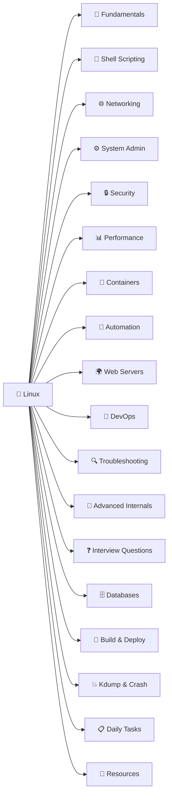
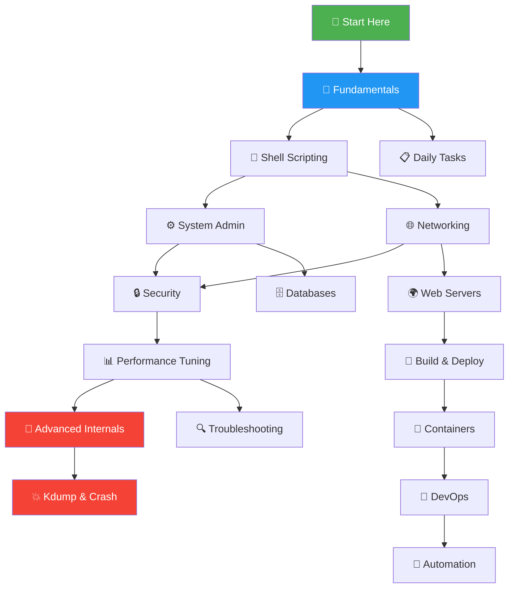

# 🐧 Linux — Comprehensive Guide (Basic → Advanced)

> Complete Linux documentation covering fundamentals to kernel internals — with Mermaid diagrams, practical commands, real-world scripts, and 103,000+ lines of content.

---

## 📁 Directory Structure

| Directory | Level | Description |
|-----------|-------|-------------|
| [`Fundamentals/`](./Fundamentals/) | 🟢 Basic | Linux overview, FHS, boot process, file types, commands, permissions, users, I/O redirection, text processing |
| [`ShellScripting/`](./ShellScripting/) | 🟢🟡 Basic–Intermediate | Variables, arrays, conditionals, loops, functions, regex, error handling, real-world scripts |
| [`Networking/`](./Networking/) | 🟡 Intermediate | TCP/IP, DNS, firewalls, SSH, VPN, network troubleshooting, bonding, VLANs, namespaces |
| [`SystemAdministration/`](./SystemAdministration/) | 🟡 Intermediate | Package management, systemd, process management, LVM, RAID, filesystems, cron, backups, kernel |
| [`Security/`](./Security/) | 🟡🔴 Intermediate–Advanced | SELinux, AppArmor, encryption (LUKS/GPG), auditing, IDS, hardening, container security, incident response |
| [`PerformanceTuning/`](./PerformanceTuning/) | 🔴 Advanced | CPU/memory/disk/network performance, perf, flamegraphs, sysctl tuning, benchmarking |
| [`Containers/`](./Containers/) | 🟡🔴 Intermediate–Advanced | Docker, Dockerfile, Compose, container runtimes, security, networking, orchestration |
| [`Automation/`](./Automation/) | 🟡🔴 Intermediate–Advanced | Ansible, Terraform, Puppet, Chef, SaltStack, cloud-init, Packer, CI/CD, GitOps |
| [`WebServers/`](./WebServers/) | 🟡 Intermediate | Apache, Nginx, SSL/TLS, reverse proxy, load balancing, databases, DNS, HA clusters |
| [`DevOps/`](./DevOps/) | 🟡🔴 Intermediate–Advanced | Git, CI/CD, Kubernetes, monitoring, log aggregation, secrets management, SRE practices |
| [`Troubleshooting/`](./Troubleshooting/) | 🟡🔴 Intermediate–Advanced | Boot, disk, memory, CPU, network, service, permission issues — 20+ real-world scenarios |
| [`AdvancedInternals/`](./AdvancedInternals/) | 🔴 Advanced | Kernel architecture, process internals, memory management, VFS, eBPF, syscalls, IPC, device drivers |
| [`InterviewQuestions/`](./InterviewQuestions/) | 🟢🟡🔴 All Levels | 200+ questions with answers — basic, intermediate, advanced, scenario-based, DevOps/SRE |
| [`Databases/`](./Databases/) | 🟡🔴 Intermediate–Advanced | MySQL, PostgreSQL, MongoDB, Redis, Elasticsearch, SQLite — admin, replication, tuning, backups |
| [`BuildAndDeploy/`](./BuildAndDeploy/) | 🟡 Intermediate | Java, Python, Node.js, Go, .NET — build systems, deployment, CI/CD, process management |
| [`KdumpAndCrashAnalysis/`](./KdumpAndCrashAnalysis/) | 🔴 Advanced | kdump, crash utility, core dumps, SysRq, kernel debugging, ftrace, SystemTap, memory debugging |
| [`DailyTasks/`](./DailyTasks/) | 🟢🟡 Basic–Intermediate | Health checks, user management, backups, deployments, cron jobs, Docker/K8s daily ops, DR scenarios |
| [`Resources/`](./Resources/) | 📚 Reference | 100+ curated bookmarks — RFCs, tools (cidr.xyz, uptime.is, crontab.guru), cheat sheets, learning platforms |

---

## 🗺️ Learning Path

---

## 📊 Content Stats

| Metric | Value |
|--------|-------|
| Total Guides | 18 (235 files) |
| Total Lines | 103,000+ |
| Mermaid Diagrams | 100+ |
| Code Examples | 500+ |
| Interview Questions | 200+ |
| Bookmarked Resources | 100+ |

---

## 🔗 Quick Links

| Tool | URL | Purpose |
|------|-----|---------|
| cidr.xyz | https://cidr.xyz | Visual CIDR/subnet calculator |
| uptime.is | https://uptime.is | SLA uptime calculator |
| crontab.guru | https://crontab.guru | Cron expression editor |
| explainshell.com | https://explainshell.com | Command explanation |
| shellcheck.net | https://www.shellcheck.net | Shell script linter |
| regex101.com | https://regex101.com | Regex tester |
| cheat.sh | https://cheat.sh | CLI cheat sheets |

---

## 🤝 Contributing

Contributions are welcome! Please open an issue or submit a pull request.

## 📄 License

This project is for educational purposes.
