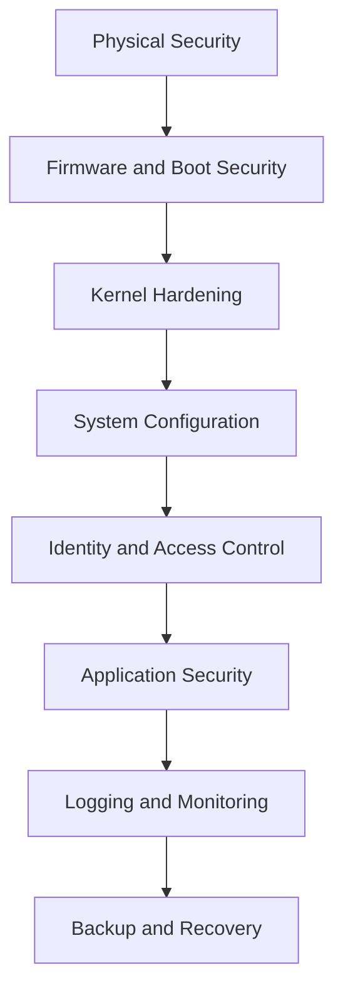
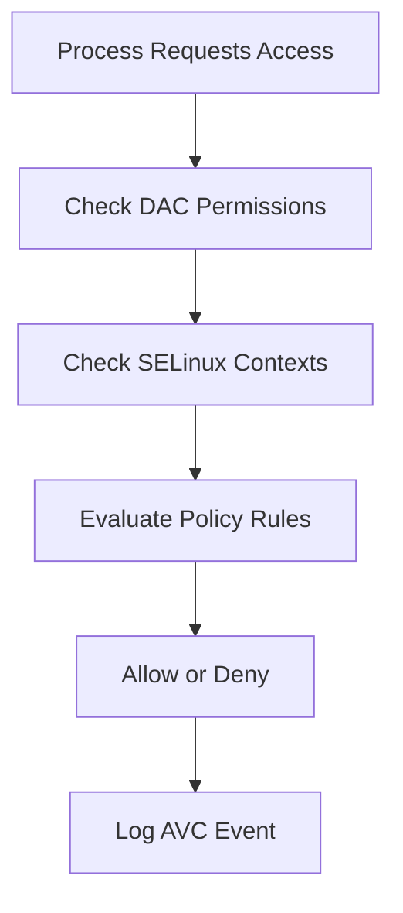
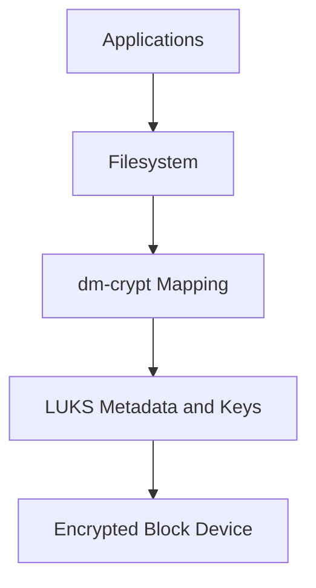
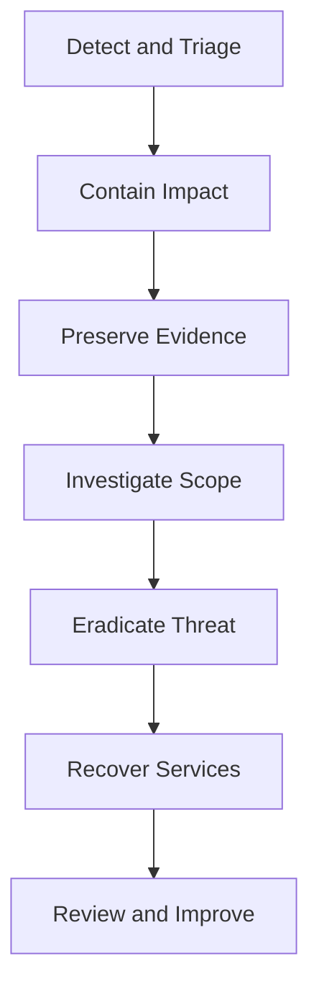

# Linux Security Guide

A production-focused Linux security guide covering foundational controls, hardening, auditing, incident response, and advanced defensive techniques.

> Audience: Linux administrators, DevOps engineers, security engineers, SREs, students, and operators who need practical hardening guidance from basic to advanced.

> Scope: This guide is distribution-aware but intentionally generic. Validate package names, service names, and paths on your platform before rollout.

---

## Table of Contents

1. [Security Fundamentals](#1-security-fundamentals)
2. [User Security](#2-user-security)
3. [File System Security](#3-file-system-security)
4. [SELinux](#4-selinux)
5. [AppArmor](#5-apparmor)
6. [Firewall Security](#6-firewall-security)
7. [SSH Hardening](#7-ssh-hardening)
8. [Encryption](#8-encryption)
9. [Auditing & Compliance](#9-auditing--compliance)
10. [Intrusion Detection](#10-intrusion-detection)
11. [Network Security](#11-network-security)
12. [Container Security](#12-container-security)
13. [Incident Response](#13-incident-response)
14. [Appendix A: Hardening Checklists](#appendix-a-hardening-checklists)
15. [Appendix B: Command Reference](#appendix-b-command-reference)
16. [Appendix C: Review Questions](#appendix-c-review-questions)

---

## 1. Security Fundamentals

Linux security is the practice of reducing the probability and impact of compromise while preserving system availability for legitimate users and workloads.

Security is not a single feature.

It is a layered operating model built from policy, configuration, monitoring, patching, access control, and recovery planning.

### 1.1 Core Principles

#### Defense in depth

Defense in depth means deploying multiple overlapping safeguards.

If one control fails, another control reduces blast radius.

Examples:

- A firewall blocks unsolicited inbound access.
- SSH keys reduce password attack exposure.
- sudo limits admin rights to approved commands.
- SELinux or AppArmor confines processes after compromise.
- AIDE detects unauthorized file changes.
- Backups enable recovery after destructive events.

#### Least privilege

Least privilege means users, services, and applications receive only the permissions needed to perform approved work.

Key applications:

- Avoid shared admin accounts.
- Avoid running services as root unless technically required.
- Prefer narrow sudo rules instead of full root shells.
- Limit listening ports and exposed APIs.
- Use read-only mounts where writes are unnecessary.
- Remove unused packages and disable unused services.

#### Separation of duties

High-risk tasks should not depend on one person or one account.

Examples:

- One team approves firewall policy.
- Another team deploys application code.
- Security teams review privileged access and audit logs.

#### Fail secure

When a control fails, the default state should be restrictive.

Examples:

- Deny firewall traffic by default.
- Disable rather than ignore broken access controls.
- Reject unsigned or untrusted artifacts.

#### Keep it simple

Complexity creates blind spots.

A smaller, well-understood attack surface is easier to secure than a sprawling platform with undocumented exceptions.

### 1.2 CIA Triad

The CIA triad anchors most security decisions.

| Principle | Goal | Linux Examples | Common Threats |
| --- | --- | --- | --- |
| Confidentiality | Prevent unauthorized disclosure | File permissions, encryption, VPN, access controls | Data theft, eavesdropping, credential leaks |
| Integrity | Prevent unauthorized change | Checksums, AIDE, signed packages, immutable flags | Tampering, ransomware, malicious admin actions |
| Availability | Keep systems and services usable | Redundancy, rate limiting, monitoring, backups | DDoS, disk exhaustion, kernel panic, service crashes |

Balancing the triad matters.

A control that improves confidentiality but destroys availability may be unacceptable for production.

A control that increases availability but permits uncontrolled administrative access is also unacceptable.

### 1.3 Security Layers



Interpret the diagram from bottom impact and top dependency together.

If physical or boot security is weak, strong user policy alone is not enough.

If logging is absent, you may never know earlier layers failed.

### 1.4 Threat Modeling Basics

Before hardening a host, ask:

- What data lives on this system?
- What services does it expose?
- Who administers it?
- Who consumes it?
- What happens if it is offline for one hour?
- What happens if it is offline for one day?
- What happens if credentials are stolen?
- What happens if the root filesystem is modified?

Typical Linux threats include:

- Weak passwords or reused credentials.
- Publicly exposed services with poor configuration.
- Kernel or package vulnerabilities.
- Misconfigured sudo permissions.
- Insecure file permissions and world-writable paths.
- Lateral movement over SSH.
- Data exfiltration through scripts or backups.
- Log tampering after compromise.

### 1.5 Hardening Strategy

A practical hardening workflow often looks like this:

1. Inventory the system.
2. Remove unnecessary software.
3. Patch the OS and packages.
4. Lock down accounts and privileged access.
5. Harden network exposure.
6. Apply mandatory access control.
7. Centralize logs and alerts.
8. Baseline files and configuration.
9. Test backup and recovery.
10. Review regularly.

### 1.6 Baseline Discovery Commands

```bash
uname -a
cat /etc/os-release
ss -tulpn
systemctl list-unit-files --type=service --state=enabled
findmnt -D
sudo -l
getent passwd
getent group
rpm -qa | sort    # RHEL-like
# or
dpkg -l | cat     # Debian-like
```

What you are looking for:

- Unexpected listening ports.
- Unnecessary enabled services.
- Legacy packages.
- Shared accounts.
- Weak mount options.
- Overly broad sudo access.

### 1.7 Secure Configuration Lifecycle

| Phase | Objective | Example Activities |
| --- | --- | --- |
| Build | Start secure | Minimal install, secure partitioning, package selection |
| Deploy | Apply standards | SSH hardening, firewall rules, sudo policy |
| Operate | Detect drift | Audit rules, file integrity checks, patch cadence |
| Recover | Restore safely | Verified backups, incident playbooks, rekeying |
| Retire | Remove exposure | Wipe storage, revoke accounts, archive evidence |

### 1.8 Common Mistakes

- Treating security as a one-time checklist.
- Hardening only internet-facing systems.
- Ignoring internal lateral movement risks.
- Granting full sudo because narrow rules are inconvenient.
- Disabling SELinux instead of learning it.
- Leaving default passwords in lab or vendor software.
- Skipping restore tests for backups.
- Monitoring only CPU and memory but not auth and audit logs.

### 1.9 Secure Defaults Checklist

- Use supported Linux releases.
- Apply security updates quickly.
- Enforce strong authentication.
- Disable direct root SSH access.
- Restrict inbound network access.
- Use centralized logging.
- Use file integrity monitoring.
- Use MAC controls such as SELinux or AppArmor.
- Encrypt sensitive data at rest and in transit.
- Document exceptions and review them.

### 1.10 Quick Wins

If you only have one hour on a newly deployed host, do these first:

- Patch packages.
- Disable unused services.
- Configure the host firewall.
- Disable password SSH authentication if possible.
- Review sudo rules.
- Enable audit logging.
- Confirm backup enrollment.
- Verify time synchronization.

### 1.11 Security Mindset

Every change should answer three questions:

- What risk does this reduce?
- What operational cost does this introduce?
- How will we know if it stops working?

That mindset separates real hardening from checkbox hardening.

### 1.12 Control Categories

Most Linux controls fall into one or more categories.

#### Preventive controls

- firewall rules
- password policy
- SELinux or AppArmor policy
- LUKS encryption
- package allow lists

#### Detective controls

- auditd
- AIDE
- IDS alerts
- centralized logging
- certificate expiration monitoring

#### Corrective controls

- backups
- rebuild procedures
- credential rotation
- policy rollback
- incident runbooks

#### Deterrent controls

- user awareness
- monitoring banners where appropriate
- access approval workflows
- visible auditability

#### Compensating controls

- bastion hosts when direct hardening is limited
- network segmentation when an app cannot be patched immediately
- file monitoring when legacy software requires broad permissions temporarily

### 1.13 Risk Ranking Example

Use a simple method to prioritize hardening work.

| Issue | Likelihood | Impact | Priority |
| --- | --- | --- | --- |
| Public SSH with passwords | High | High | Critical |
| Missing audit rules on lab host | Medium | Medium | Moderate |
| Unused legacy package | Medium | Low | Moderate |
| No file integrity checks on payment app | Medium | High | High |
| Disabled SELinux on internet-facing host | High | High | Critical |

### 1.14 Change Management Considerations

Security changes should be introduced safely.

Good practice:

- record current state before change
- document expected impact
- define rollback steps
- test with a second session where remote access is involved
- monitor immediately after rollout

### 1.15 Summary

Security fundamentals are not abstract theory.

They shape every decision in the rest of this guide.

If you understand layered defense, least privilege, and the CIA triad, you can make better tradeoffs when configuring Linux under production pressure.

---

## 2. User Security

User and authentication controls are among the most important Linux security boundaries.

Most breaches eventually involve identity abuse.

A well-hardened authentication stack reduces unauthorized access, slows lateral movement, and improves accountability.

### 2.1 Account Inventory

Start by identifying who can log in and who has privilege.

```bash
getent passwd
awk -F: '$3 >= 1000 {print $1, $7}' /etc/passwd
getent shadow | cut -d: -f1,2
sudo getent group sudo
sudo getent group wheel
lastlog
faillog -a
```

Review for:

- Dormant accounts.
- Shared accounts.
- Service accounts with interactive shells.
- Accounts without password aging.
- Unexpected members of sudo or wheel.

### 2.2 Password Policy Basics

Password policy must balance resistance to guessing with usability and MFA adoption.

Recommended baseline:

| Control | Recommendation |
| --- | --- |
| Minimum length | 14+ characters for humans |
| Complexity | Prefer passphrases over forced symbols alone |
| Reuse | Remember at least 5 to 10 previous passwords |
| Rotation | Rotate on suspicion, role change, or policy requirement |
| Lockout | Temporary lock after repeated failures |
| MFA | Require for remote access and privileged access |

Modern guidance favors length and uniqueness over outdated complexity-only rules.

Bad examples:

- Summer2024!
- CompanyName1!
- Admin@123

Better examples:

- mango-lantern-coast-window
- BrickRiverPaperTrainNorth
- violet-orbit-anchor-museum

### 2.3 PAM Overview

PAM stands for Pluggable Authentication Modules.

PAM centralizes authentication, account checks, password policy, and session rules.

Common PAM module types:

| Type | Purpose |
| --- | --- |
| auth | Verify identity |
| account | Check whether access is allowed |
| password | Handle password changes and quality checks |
| session | Perform tasks at login and logout |

Common PAM files:

| Distribution Style | Common Files |
| --- | --- |
| Debian-like | /etc/pam.d/common-auth, common-account, common-password, common-session |
| RHEL-like | /etc/pam.d/system-auth, password-auth, sshd, su, sudo |

Common PAM modules:

- pam_unix.so
- pam_pwquality.so
- pam_faillock.so
- pam_tally2.so on older systems
- pam_limits.so
- pam_access.so
- pam_google_authenticator.so
- pam_lastlog.so
- pam_mkhomedir.so

PAM control flags matter:

| Control Flag | Meaning |
| --- | --- |
| required | Must succeed, but processing continues |
| requisite | Must succeed or fail immediately |
| sufficient | Success can satisfy the stack if no required failures exist |
| optional | Usually non-critical |

### 2.4 Password Quality with PAM

Example RHEL-like configuration using pam_pwquality:

```bash
sudo grep -n 'pwquality\|faillock' /etc/pam.d/system-auth /etc/pam.d/password-auth
sudo grep -n '^minlen\|^minclass\|^dcredit\|^ucredit\|^lcredit\|^ocredit' /etc/security/pwquality.conf
```

Example settings in `/etc/security/pwquality.conf`:

```ini
minlen = 14
difok = 4
minclass = 4
maxrepeat = 3
maxclassrepeat = 4
gecoscheck = 1
enforcing = 1
dictcheck = 1
```

Notes:

- `minlen` controls minimum length.
- `difok` requires difference from the previous password.
- `maxrepeat` reduces repeated-character abuse.
- `dictcheck` helps block dictionary-based passwords.

### 2.5 /etc/login.defs

`/etc/login.defs` influences account creation and password aging behavior.

Key settings often reviewed:

| Setting | Purpose | Example |
| --- | --- | --- |
| PASS_MAX_DAYS | Maximum password age | 90 |
| PASS_MIN_DAYS | Minimum days before change | 1 |
| PASS_WARN_AGE | Warning before expiry | 14 |
| UMASK | Default permission mask | 027 |
| UID_MIN | Start of regular user IDs | 1000 |
| ENCRYPT_METHOD | Hash method | yescrypt or SHA512 |

Example inspection:

```bash
grep -E '^(PASS_MAX_DAYS|PASS_MIN_DAYS|PASS_WARN_AGE|UMASK|ENCRYPT_METHOD)' /etc/login.defs
```

Recommended direction:

- Use a restrictive `UMASK` such as `027` or `077` where appropriate.
- Ensure password aging aligns with policy.
- Use modern password hashing supported by the distribution.

### 2.6 Password Aging and Expiration

Use `chage` to inspect and enforce password aging.

```bash
sudo chage -l alice
sudo chage -M 90 -m 1 -W 14 alice
sudo chage -E 2025-12-31 contractor1
```

Useful fields:

- Last password change.
- Password expires.
- Password inactive.
- Account expires.
- Minimum days between changes.
- Maximum days between changes.
- Warning period.

When to use expiration:

- Temporary contractors.
- Emergency vendor accounts.
- Project-based access.

### 2.7 Account Locking

Account lockout reduces brute-force success.

Modern RHEL-like systems commonly use `pam_faillock`.

Example concept:

```ini
auth        required      pam_faillock.so preauth silent deny=5 unlock_time=900
auth        [default=die] pam_faillock.so authfail deny=5 unlock_time=900
account     required      pam_faillock.so
```

Example operations:

```bash
sudo faillock --user alice
sudo faillock --user alice --reset
```

Guidance:

- Use temporary lockouts rather than permanent lockouts.
- Combine with MFA for remote access.
- Monitor lockouts centrally to detect brute-force attempts.

### 2.8 Disabling Unused Accounts

To lock an account without deleting it:

```bash
sudo usermod -L username
sudo passwd -l username
sudo chage -E 0 username
```

To restore access:

```bash
sudo usermod -U username
sudo chage -E -1 username
```

To prevent interactive login for service accounts:

```bash
sudo usermod -s /usr/sbin/nologin serviceuser
# or
sudo usermod -s /sbin/nologin serviceuser
```

### 2.9 Restricting Login Sources

PAM can restrict access by source, service, or user group.

Examples:

- `pam_access.so` can allow or deny users from specific origins.
- `/etc/security/access.conf` defines access rules.
- SSH can further restrict login with `AllowUsers`, `AllowGroups`, `Match`, and source-based conditions.

Example `access.conf` concept:

```ini
+:root:LOCAL
+:@sysadmins:10.0.0.0/24
-:ALL:ALL
```

### 2.10 Environment and Resource Limits

Use `/etc/security/limits.conf` and `pam_limits.so` to restrict user resource consumption.

Examples:

```ini
*               hard    core            0
*               hard    nproc           4096
@developers     soft    nofile          8192
@developers     hard    nofile          16384
```

Why this matters:

- Prevent fork bombs from consuming all processes.
- Constrain accidental or malicious file descriptor exhaustion.
- Reduce data leakage through core dumps.

### 2.11 sudo Best Practices

`sudo` is safer than direct root login when implemented correctly.

Core rules:

- Do not share root credentials.
- Give users named accounts.
- Grant only required commands.
- Require re-authentication where appropriate.
- Log sudo usage.
- Use `visudo` for edits.
- Prefer group-based assignment for manageability.

Inspect current privileges:

```bash
sudo -l
sudo grep -RIn 'NOPASSWD\|ALL=(ALL) ALL\|ALL=(ALL:ALL) ALL' /etc/sudoers /etc/sudoers.d
```

Examples of good sudo patterns:

```sudoers
%webadmins ALL=(root) /bin/systemctl restart nginx, /bin/systemctl status nginx
%dbops ALL=(postgres) /usr/bin/psql
Cmnd_Alias LOGS = /usr/bin/journalctl -u nginx, /usr/bin/journalctl -u sshd
%auditors ALL=(root) LOGS
```

Examples of risky patterns:

```sudoers
alice ALL=(ALL) NOPASSWD: ALL
%dev ALL=(ALL) ALL
bob ALL=(root) /bin/bash
```

Risk explanation:

- `NOPASSWD: ALL` removes a strong control and accountability barrier.
- Full `ALL` access often exceeds role requirements.
- Shell access as root usually enables unrestricted privilege escalation.

### 2.12 su and root Shell Hygiene

Prefer `sudo -i` or tightly scoped `sudo` commands instead of `su -`.

If `su` is required:

- Restrict membership in the relevant admin group.
- Log all attempts.
- Use MFA where feasible.

On many systems, PAM for `su` can limit usage to wheel or sudo members.

### 2.13 Session Logging and Accountability

You cannot secure what you cannot attribute.

Recommended practices:

- Unique user accounts only.
- Centralized auth logs.
- Sudo logging.
- TTY or session recording for high-risk environments.
- Time synchronization with NTP or chrony.

Commands:

```bash
last
lastb
journalctl -u sshd
journalctl _COMM=sudo
who
w
```

### 2.14 Password Storage and Hashes

Modern password hashes are stored in `/etc/shadow`.

Inspect hash types carefully.

Examples:

- `$6$` commonly indicates SHA-512.
- `yescrypt` may appear on newer systems.
- Empty or locked fields deserve review.

Never:

- Copy `/etc/shadow` casually.
- Store password backups in tickets or wiki pages.
- Use weak local scripts for password rotation.

### 2.15 MFA for Linux Logins

MFA is strongly recommended for:

- SSH access from untrusted networks.
- Privileged administrative access.
- VPN-connected jump hosts.

Common approaches:

- TOTP through `pam_google_authenticator.so`.
- Enterprise identity via SSSD with MFA-backed IdP.
- Hardware-backed SSH keys with FIDO2.

### 2.16 User Security Checklist

- Review users and groups monthly.
- Remove dormant accounts quickly.
- Lock service accounts to non-interactive shells.
- Enforce password quality.
- Enforce password aging where policy requires it.
- Enable lockouts for repeated failures.
- Restrict sudo to role-specific commands.
- Log authentication and privilege use.
- Prefer MFA for remote administration.
- Avoid shared credentials.

### 2.17 Example New Admin Workflow

1. Create named user account.
2. Add user to a limited admin group.
3. Provision SSH key.
4. Enroll MFA.
5. Set password aging policy.
6. Confirm `sudo -l` shows only intended commands.
7. Record approval and ticket linkage.
8. Review access at the next recertification cycle.

### 2.18 Summary

Linux user security depends on disciplined account lifecycle management, a correctly configured PAM stack, strong password handling, tight sudo policy, and clear auditability.

When identity is strong, many later controls become far more effective.

---

## 3. File System Security

File system security defines who can read, write, execute, or modify data and binaries.

It is one of the oldest Linux security domains, yet many compromises still begin with poor ownership, unsafe permissions, or integrity blind spots.

### 3.1 Review Permissions Basics

Standard permissions include read, write, and execute for:

- user
- group
- others

Inspect permissions with:

```bash
ls -l
namei -om /path/to/file
stat /path/to/file
find /etc -maxdepth 1 -type f -printf '%m %u %g %p\n'
```

Common notation:

| Octal | Meaning |
| --- | --- |
| 644 | Owner read/write, group read, others read |
| 640 | Owner read/write, group read, others none |
| 600 | Owner read/write only |
| 755 | Owner full, group read/execute, others read/execute |
| 700 | Owner full only |

Secure default guidance:

- Configuration files should rarely be world-writable.
- Private keys should usually be `600`.
- Home directories should usually be `700` or `750`.
- Sensitive application configs should not be readable by all users.

### 3.2 Ownership Review

Ownership problems can silently create privilege boundaries that do not behave as expected.

Review for:

- Files owned by deleted users.
- Root-owned files inside user-controlled directories.
- Application directories writable by generic groups.
- Unexpected ownership changes after deployments.

Commands:

```bash
find / -xdev -nouser -o -nogroup
find /var/www -type f -printf '%u:%g %m %p\n' | sort
sudo rpm -Va    # RHEL-like integrity signals
sudo debsums -s # Debian-like where available
```

### 3.3 World-Writable Files and Directories

World-writable paths are dangerous because any local user may tamper with content, plant files, or manipulate execution flow.

Find them carefully:

```bash
find / -xdev -type d -perm -0002 -print
find / -xdev -type f -perm -0002 -print
```

Review each result.

Questions to ask:

- Is the path expected to be writable by everyone?
- Does the directory also have the sticky bit?
- Can files placed here influence privileged processes?

### 3.4 SUID and SGID

SUID means an executable runs with the effective user ID of its owner.

SGID means an executable runs with the effective group ID of its owner.

These bits are useful but high risk.

Examples of legitimate binaries may include:

- `passwd`
- `sudo`
- `mount` on some systems
- `su`

Find SUID and SGID files:

```bash
find / -xdev -perm -4000 -type f -print
find / -xdev -perm -2000 -type f -print
```

Risks:

- Vulnerable SUID binaries can become privilege escalation paths.
- Misowned or custom SUID tools are major red flags.
- SGID on data directories can unintentionally widen access.

Operational guidance:

- Keep the SUID/SGID inventory small.
- Investigate any custom or third-party SUID binaries.
- Remove SUID where not required.
- Monitor changes to these files.

### 3.5 Sticky Bit

The sticky bit on a directory means users can create files there but typically cannot delete files owned by others.

This is why `/tmp` is usually `1777`.

Example:

```bash
stat -c '%a %n' /tmp
chmod 1777 /shared/dropbox
```

Do not confuse sticky bit protection with strong confidentiality.

A sticky directory prevents some deletion abuse, not arbitrary reading.

### 3.6 umask

`umask` determines default permissions for newly created files and directories.

Inspect current shell setting:

```bash
umask
umask -S
```

Common values:

| umask | Effect |
| --- | --- |
| 022 | Files commonly 644, directories 755 |
| 027 | Files commonly 640, directories 750 |
| 077 | Files commonly 600, directories 700 |

Use stricter masks for:

- administrators
- security tooling
- private key generation
- sensitive data processing jobs

### 3.7 Immutable and Append-Only Attributes

Linux extended attributes can add extra protection on supported filesystems.

Useful flags with `chattr`:

| Flag | Meaning |
| --- | --- |
| +i | Immutable |
| +a | Append-only |

Examples:

```bash
sudo chattr +i /etc/passwd
sudo chattr +i /etc/shadow
sudo chattr +a /var/log/secure
lsattr /etc/passwd /etc/shadow /var/log/secure
```

Warnings:

- Immutable files cannot be modified, renamed, or deleted until the flag is removed.
- Package updates may fail if critical files are immutable.
- Attackers with full root may remove the flag unless additional controls exist.

Good use cases:

- Protecting selected configuration files from accidental change.
- Adding friction to log tampering.
- Guarding emergency break-glass artifacts during incident response.

### 3.8 ACLs Deep Dive

Access Control Lists extend beyond the traditional owner-group-other model.

ACLs are useful when several teams require different rights on shared paths without creating awkward group sprawl.

Core commands:

```bash
getfacl /srv/shared
setfacl -m u:alice:rwx /srv/shared
setfacl -m g:analysts:rx /srv/reports
setfacl -R -m d:g:developers:rwx /srv/devdrop
```

ACL concepts:

| Item | Meaning |
| --- | --- |
| access ACL | Permissions on the object itself |
| default ACL | Permissions inherited by new children in a directory |
| mask | Maximum effective ACL permission for named users and groups |

Example workflow:

```bash
mkdir -p /srv/project
chown root:project /srv/project
chmod 2770 /srv/project
setfacl -m g:auditors:rx /srv/project
setfacl -m d:g:project:rwx /srv/project
getfacl /srv/project
```

ACL cautions:

- ACLs can confuse troubleshooting when engineers only inspect `ls -l`.
- Backup and restore tools must preserve ACLs.
- Complex ACLs can become invisible privilege creep.

### 3.9 Mount Options

Mount options can substantially reduce local abuse opportunities.

Especially review:

- `nodev`
- `nosuid`
- `noexec`
- `ro`

Example `/etc/fstab` ideas:

```fstab
UUID=xxxx /tmp      ext4 defaults,nodev,nosuid,noexec 0 0
UUID=yyyy /var/tmp  ext4 defaults,nodev,nosuid,noexec 0 0
UUID=zzzz /home     ext4 defaults,nodev               0 0
```

Benefits:

- `nodev` blocks device file interpretation.
- `nosuid` disables SUID/SGID semantics on the mount.
- `noexec` reduces direct binary execution from that mount.
- `ro` protects static partitions from change.

Operational caveat:

Some applications break under aggressive `noexec` or `ro` policies.

Test carefully.

### 3.10 Temporary Directories and Race Conditions

Temporary files are a common source of insecure behavior.

Good practice:

- Use secure file creation APIs.
- Avoid predictable names.
- Avoid running privileged scripts that trust user-controlled temp paths.
- Review cron jobs and deployment scripts for unsafe symlink handling.

### 3.11 File Integrity Monitoring

File integrity monitoring detects unauthorized changes to system files, binaries, configs, and selected data.

Two well-known tools:

- AIDE
- Tripwire

#### AIDE

AIDE creates a baseline database of file metadata and cryptographic hashes.

Typical flow:

```bash
sudo aide --init
sudo mv /var/lib/aide/aide.db.new.gz /var/lib/aide/aide.db.gz
sudo aide --check
```

What AIDE can watch:

- file permissions
- ownership
- inode changes
- timestamps
- hashes
- ACLs on supported setups

Recommended targets:

- `/bin`
- `/sbin`
- `/usr/bin`
- `/usr/sbin`
- `/etc`
- bootloader and kernel paths
- security tooling configs

Best practices:

- Store the baseline securely.
- Rebuild the baseline only after approved changes.
- Alert on deviations.
- Review reports with context from package updates.

#### Tripwire

Tripwire provides similar integrity checking with policy-based monitoring.

Considerations:

- Strong policy tuning is essential.
- Unreviewed noise leads to alert fatigue.
- Signing and secure policy management matter.

### 3.12 Detecting Dangerous Permission Patterns

Look for:

```bash
find /etc -type f -perm -002 -ls
find /usr/local/bin -type f -perm -4000 -ls
find / -xdev -type d \( -perm -0002 -a ! -perm -1000 \) -ls
```

Interpretation:

- World-writable files in `/etc` are usually severe findings.
- Custom SUID files in `/usr/local/bin` require strong justification.
- World-writable directories without sticky bit invite abuse.

### 3.13 Backup Security

Backups can bypass file-system protections if they are readable to the wrong users.

Protect backups by:

- Encrypting backup archives.
- Restricting backup operator permissions.
- Limiting restore rights.
- Testing integrity and access controls on restored files.

### 3.14 Sensitive Files to Review

| Path | Why It Matters |
| --- | --- |
| /etc/passwd | Account definitions |
| /etc/shadow | Password hashes |
| /etc/sudoers | Privilege policy |
| /root/.ssh | Root remote access material |
| /home/*/.ssh | User key material |
| /etc/ssh/sshd_config | Remote access policy |
| /boot | Boot security and kernel artifacts |
| /var/log | Security and incident evidence |
| /etc/fstab | Mount security posture |

### 3.15 Practical Review Routine

A weekly permissions review might include:

1. Export SUID and SGID inventory.
2. Compare it with the known-good baseline.
3. Search for new world-writable paths.
4. Review ownership changes in application directories.
5. Confirm AIDE or Tripwire status.
6. Verify log directories remain protected.

### 3.16 Summary

File system security is not just about `chmod`.

It includes permissions, ownership, mount semantics, ACL discipline, integrity monitoring, and safe handling of sensitive paths.

Done well, it reduces both accidental exposure and attacker privilege escalation.

---

## 4. SELinux

SELinux is a mandatory access control system that enforces security policy even when traditional Unix permissions would otherwise allow access.

It is one of the most powerful Linux security technologies and one of the most commonly disabled by frustrated administrators.

That is usually a mistake.

Learn it instead.

### 4.1 Why SELinux Matters

Traditional permissions answer questions like:

- Is the file readable by this user or group?
- Is the process running as root?

SELinux answers additional questions like:

- Is this specific domain allowed to read that file type?
- Is this daemon allowed to bind that port?
- Is this process allowed to initiate network connections?
- Is this action allowed by policy regardless of DAC permissions?

This reduces damage from:

- application compromise
- local privilege abuse
- accidental misconfiguration
- service breakout from intended boundaries

### 4.2 SELinux Modes

| Mode | Behavior |
| --- | --- |
| Enforcing | Policy violations are blocked and logged |
| Permissive | Violations are allowed but logged |
| Disabled | SELinux is off |

Check status:

```bash
getenforce
sestatus
```

Temporarily change mode:

```bash
sudo setenforce 0
sudo setenforce 1
```

Persistent configuration is usually in `/etc/selinux/config`.

Guidance:

- Use `Enforcing` in production whenever possible.
- Use `Permissive` for short troubleshooting windows.
- Avoid `Disabled` unless you have a compelling reason and compensating controls.

### 4.3 Core Concepts

SELinux uses labels.

A label often includes:

- user
- role
- type
- level

Example context:

```text
system_u:object_r:httpd_sys_content_t:s0
```

In practice, the type component is often the most operationally important.

Examples:

- `httpd_t` for the web server process domain.
- `httpd_sys_content_t` for web-readable content.
- `httpd_sys_rw_content_t` for web-writable content.
- `ssh_port_t` for SSH-associated ports.

### 4.4 Context Inspection

Inspect contexts with:

```bash
ls -Z
ps -eZ | head
id -Z
semanage port -l | head
```

Examples:

```bash
ls -Zd /var/www/html
ps -eZ | grep httpd
```

Common troubleshooting pattern:

A file has normal Unix permissions.

The service still cannot read it.

Often the SELinux type is wrong.

### 4.5 SELinux Decision Flow



This means successful traditional permission checks do not guarantee access.

SELinux remains authoritative when enabled.

### 4.6 File Label Management

Use `restorecon` to reset files to expected policy labels.

Examples:

```bash
sudo restorecon -Rv /var/www/html
sudo restorecon -Rv /etc/ssh
```

Why `restorecon` matters:

- Manual copies can preserve bad labels.
- Custom deployment tools may write files with unexpected contexts.
- Mislabels are one of the most common SELinux issues.

Persistent custom labeling is typically done with `semanage fcontext`.

Examples:

```bash
sudo semanage fcontext -a -t httpd_sys_content_t '/srv/myapp/public(/.*)?'
sudo restorecon -Rv /srv/myapp/public

sudo semanage fcontext -a -t httpd_sys_rw_content_t '/srv/myapp/storage(/.*)?'
sudo restorecon -Rv /srv/myapp/storage
```

### 4.7 Port Label Management

Services may fail to bind non-standard ports unless the port type is permitted.

Inspect relevant ports:

```bash
sudo semanage port -l | grep ssh
sudo semanage port -l | grep http
```

Add a custom SSH port label example:

```bash
sudo semanage port -a -t ssh_port_t -p tcp 2222
```

Modify an existing mapping:

```bash
sudo semanage port -m -t http_port_t -p tcp 8080
```

### 4.8 Booleans

SELinux booleans toggle optional policy behavior without writing new policy.

List booleans:

```bash
getsebool -a | head
```

Inspect specific examples:

```bash
getsebool httpd_can_network_connect
getsebool nis_enabled
```

Set a boolean persistently:

```bash
sudo setsebool -P httpd_can_network_connect on
```

Important habit:

Prefer enabling a documented boolean over creating a custom allow rule if the boolean cleanly matches the requirement.

### 4.9 Policy Types and Modules

Most administrators interact with:

- targeted policy
- custom policy modules

Targeted policy confines selected services and roles.

Custom modules extend behavior for local requirements.

Policy module basics:

```bash
sudo semodule -l | head
sudo semodule -r mymodule
```

### 4.10 AVC Troubleshooting

SELinux denial messages often appear as AVC events.

Useful tools:

- `ausearch`
- `audit2why`
- `audit2allow`
- `journalctl`

Examples:

```bash
sudo ausearch -m avc -ts recent
sudo ausearch -m avc -ts today | audit2why
sudo ausearch -m avc -ts today | audit2allow -w
```

What `audit2why` helps answer:

- Why did SELinux deny this action?
- Was the issue a label mismatch, missing boolean, or policy restriction?

What `audit2allow` helps generate:

- Candidate allow rules based on observed denials.

Critical warning:

Never blindly install whatever `audit2allow` suggests.

Review each rule for least privilege.

### 4.11 Building a Local Policy Module

Example workflow:

```bash
sudo ausearch -m avc -ts today | audit2allow -M localfix
sudo semodule -i localfix.pp
```

Safer process:

1. Confirm the denial is legitimate.
2. Check file labels and booleans first.
3. Confirm the application design really requires the access.
4. Generate a candidate rule.
5. Review the `.te` policy source.
6. Install only approved minimal policy.

### 4.12 Typical Web Server Issues

Common cases:

- Web content copied from home directories inherits `user_home_t`.
- Upload directories need `httpd_sys_rw_content_t`.
- Reverse proxies need `httpd_can_network_connect` for backend connections.
- Custom listen ports need appropriate port types.

Quick example:

```bash
sudo semanage fcontext -a -t httpd_sys_content_t '/srv/site(/.*)?'
sudo restorecon -Rv /srv/site
sudo setsebool -P httpd_can_network_connect on
```

### 4.13 Typical Database and Application Issues

Common problems:

- App processes reading secrets from mislabeled directories.
- Queue workers attempting outbound connections without the correct policy.
- Databases binding to unexpected ports.
- Backup jobs denied reading application data.

Approach:

- inspect process domain
- inspect file contexts
- inspect port labels
- inspect booleans
- inspect AVC records

### 4.14 SELinux and Containers

SELinux also matters for containers.

Concepts include:

- MCS labeling
- container-specific types
- volume relabeling such as `:z` and `:Z` in some runtimes

Security value:

- A compromised container has reduced ability to access host files outside its allowed label boundaries.

### 4.15 Useful Commands Reference

```bash
getenforce
sestatus
ls -Z /path
ps -eZ
id -Z
restorecon -Rv /path
semanage fcontext -l | less
semanage port -l | less
getsebool -a | less
ausearch -m avc -ts recent
audit2why
audit2allow -w
audit2allow -M module_name
semodule -l
```

### 4.16 Operational Best Practices

- Keep SELinux in enforcing mode.
- Learn common labels for your services.
- Use `restorecon` before writing policy.
- Prefer `semanage` for persistent changes.
- Prefer booleans when they match the use case.
- Review AVCs rather than disabling enforcement.
- Version-control custom policy decisions.

### 4.17 Common Anti-Patterns

- Setting SELinux to disabled during application rollout and never restoring it.
- Running `chcon` manually without making the change persistent.
- Installing overbroad local allow modules.
- Ignoring AVC logs during deployments.
- Treating SELinux as optional rather than strategic.

### 4.18 Summary

SELinux enforces intent beyond traditional permissions.

When you understand contexts, booleans, ports, and AVC troubleshooting, it becomes a major defensive advantage rather than an obstacle.

---

## 5. AppArmor

AppArmor is another Linux mandatory access control framework.

It is especially common on Ubuntu and SUSE-based environments.

Unlike SELinux, which heavily uses labels and types, AppArmor focuses on path-based profiles that define what applications can access.

### 5.1 AppArmor Concepts

Key components:

- profiles
- complain mode
- enforce mode
- abstractions
- hats and subprofiles in advanced use cases

Modes:

| Mode | Meaning |
| --- | --- |
| enforce | Violations are blocked |
| complain | Violations are allowed but logged |
| disable | Profile is not applied |

Useful commands:

```bash
sudo aa-status
sudo apparmor_status
```

### 5.2 Why AppArmor Matters

AppArmor can significantly limit damage if a service is compromised.

Examples:

- Restrict a web service to specific files.
- Prevent unexpected shell execution.
- Limit network, mount, or capability usage.
- Reduce data exposure from daemon compromise.

### 5.3 Profile Discovery

Profiles are commonly stored in:

- `/etc/apparmor.d/`

Inspect loaded profiles:

```bash
sudo aa-status
ls -1 /etc/apparmor.d/
```

You may see profiles for:

- `sshd`
- `ntpd`
- `tcpdump`
- browsers
- container runtimes
- custom local services

### 5.4 Profile Structure

A typical profile defines allowed file access, capabilities, network usage, signals, and includes.

Example simplified idea:

```text
/usr/sbin/nginx {
  #include <abstractions/base>
  /usr/sbin/nginx mr,
  /etc/nginx/** r,
  /var/log/nginx/** rw,
  /var/www/** r,
  capability net_bind_service,
  network inet stream,
}
```

Interpretation:

- `r` means read.
- `w` means write.
- `m` often relates to memory map execute/read behavior.
- Rules can apply recursively using globs.

### 5.5 Managing Modes

Switch a profile to complain mode:

```bash
sudo aa-complain /etc/apparmor.d/usr.sbin.nginx
```

Switch back to enforce mode:

```bash
sudo aa-enforce /etc/apparmor.d/usr.sbin.nginx
```

Disable a profile:

```bash
sudo aa-disable /etc/apparmor.d/usr.sbin.nginx
```

Re-enable and load:

```bash
sudo aa-enforce /etc/apparmor.d/usr.sbin.nginx
sudo systemctl reload apparmor
```

### 5.6 aa-genprof

`aa-genprof` helps create or refine profiles interactively.

Typical workflow:

1. Start `aa-genprof` for a target binary.
2. Exercise the application normally.
3. Review logged events.
4. Accept or refine the proposed rules.

Example:

```bash
sudo aa-genprof /usr/local/bin/myapp
```

Best use case:

- New in-house services without a mature profile.

### 5.7 aa-logprof

`aa-logprof` reads AppArmor logs and suggests profile updates.

Example:

```bash
sudo aa-logprof
```

Best practices:

- Reproduce real application behavior before accepting rules.
- Reject overly broad paths.
- Prefer explicit access over recursive write access when possible.

### 5.8 Creating a Custom Profile

Example process:

1. Identify the executable path.
2. Start with a minimal profile.
3. Include standard abstractions.
4. Allow only required config, runtime, data, and log paths.
5. Allow only required capabilities.
6. Test in complain mode.
7. Move to enforce mode.

Simple custom profile example:

```text
#include <tunables/global>

/usr/local/bin/backup-sync {
  #include <abstractions/base>
  #include <abstractions/nameservice>

  /usr/local/bin/backup-sync mr,
  /etc/backup-sync.conf r,
  /var/log/backup-sync.log rw,
  /srv/backup-source/** r,
  /srv/backup-target/** rw,

  capability dac_read_search,
  network inet stream,
}
```

### 5.9 Reading Logs

AppArmor denials may appear in:

- `journalctl`
- kernel logs
- audit logs on some systems

Examples:

```bash
journalctl -k | grep -i apparmor
journalctl -xe | grep DENIED
```

When analyzing denials, ask:

- Is the app trying to access an intended path?
- Is the path too broad?
- Would allowing it violate least privilege?
- Is the application design itself problematic?

### 5.10 Common AppArmor Rule Types

| Rule Type | Example Purpose |
| --- | --- |
| File path access | Allow config reads or log writes |
| Capability rules | Permit specific kernel capabilities |
| Network rules | Allow socket use by family and type |
| Signal rules | Control process signaling |
| Mount rules | Restrict mount operations |
| ptrace rules | Control debugging and inspection |

### 5.11 Abstractions and Reuse

AppArmor ships with abstractions to reduce repetitive rule writing.

Examples may include:

- `abstractions/base`
- `abstractions/nameservice`
- `abstractions/ssl_certs`
- `abstractions/user-tmp`

Benefits:

- faster profile creation
- more maintainable policies
- fewer missed common access needs

Caution:

Over-including abstractions can widen access more than necessary.

### 5.12 AppArmor vs SELinux

| Area | AppArmor | SELinux |
| --- | --- | --- |
| Model | Path-based | Label-based |
| Operational feel | Often simpler initially | Often more powerful and granular |
| Common environments | Ubuntu, SUSE | RHEL, Fedora, many enterprise systems |
| Persistence model | Profile file driven | Policy and labeling driven |

Neither should be casually disabled.

Use the security framework that fits your distribution and operating model.

### 5.13 AppArmor Hardening Workflow

1. Confirm AppArmor is active.
2. Inventory loaded profiles.
3. Identify unconfined network-facing services.
4. Apply vendor profiles where available.
5. Build custom profiles for local apps.
6. Test in complain mode.
7. Enforce in production.
8. Review logs after deployments.

### 5.14 Common Pitfalls

- Leaving important custom services unconfined.
- Accepting all suggested rules from `aa-logprof`.
- Using recursive write rules where read-only rules would work.
- Forgetting to reload profiles after changes.
- Treating complain mode as a permanent state.

### 5.15 Example Service Review Questions

- Which executable should the profile attach to?
- Which directories must be readable?
- Which files must be writable?
- Does the service need network access?
- Does it need shell execution or child processes?
- Does it need special capabilities?
- Can logs reveal unexpected attempted access?

### 5.16 Summary

AppArmor provides practical process confinement through profiles.

When profiles are minimal, tested, and enforced, AppArmor becomes a strong control against service compromise and lateral access.

---

## 6. Firewall Security

Firewalling is central to Linux host and network defense.

A hardened host should expose only the minimum inbound services and tightly control outbound traffic where business requirements permit.

### 6.1 Host Firewall Philosophy

A host firewall is valuable even when a network firewall already exists.

Why:

- It protects the system if network controls fail.
- It reduces lateral movement inside trusted networks.
- It documents intended exposure close to the workload.
- It helps enforce environment-specific rules during cloud or hybrid operations.

### 6.2 iptables and nftables

Linux historically used `iptables`.

Modern distributions increasingly use `nftables` directly or through compatibility layers.

High-level comparison:

| Tool | Notes |
| --- | --- |
| iptables | Mature, widely documented, legacy syntax on many systems |
| nftables | Newer framework, improved set handling, cleaner rule model |
| firewalld | Higher-level management layer that may use nftables backend |

Check active tooling carefully.

### 6.3 Baseline Inspection

Commands:

```bash
sudo iptables -L -n -v
sudo iptables -S
sudo nft list ruleset
sudo firewall-cmd --state
sudo firewall-cmd --list-all
ss -tulpn
```

Questions:

- Which ports are listening?
- Which rules explicitly allow them?
- Is default policy restrictive?
- Are rules consistent with current services?

### 6.4 iptables Deep Dive

Important chains:

- INPUT
- OUTPUT
- FORWARD

Common policy strategy:

- default drop inbound
- allow loopback
- allow established and related traffic
- allow required service ports
- log limited denied traffic

Example concept:

```bash
sudo iptables -P INPUT DROP
sudo iptables -P FORWARD DROP
sudo iptables -P OUTPUT ACCEPT
sudo iptables -A INPUT -i lo -j ACCEPT
sudo iptables -A INPUT -m conntrack --ctstate ESTABLISHED,RELATED -j ACCEPT
sudo iptables -A INPUT -p tcp --dport 22 -s 10.0.0.0/24 -j ACCEPT
sudo iptables -A INPUT -p tcp --dport 443 -j ACCEPT
sudo iptables -A INPUT -m limit --limit 5/min -j LOG --log-prefix 'iptables-deny: '
```

Concepts to know:

- order matters
- first matching rule usually wins in practice for chain traversal logic
- broad allow rules early can defeat later restrictions
- logging without rate limits can flood disks

### 6.5 nftables Deep Dive

`nftables` uses tables, chains, sets, and expressions.

Example minimal concept:

```nft
table inet filter {
  chain input {
    type filter hook input priority 0;
    policy drop;
    iif lo accept
    ct state established,related accept
    tcp dport 22 ip saddr 10.0.0.0/24 accept
    tcp dport 443 accept
  }
}
```

Why nftables is powerful:

- one syntax for IPv4 and IPv6 with `inet`
- efficient sets and maps
- cleaner atomic ruleset replacement
- easier large policy management in many cases

### 6.6 Connection Tracking

Connection tracking helps firewalls understand session state.

Common states:

- NEW
- ESTABLISHED
- RELATED
- INVALID

Typical policy:

- Allow `ESTABLISHED,RELATED`.
- Scrutinize or drop `INVALID`.
- Allow only intended `NEW` inbound connections.

Example:

```bash
sudo iptables -A INPUT -m conntrack --ctstate INVALID -j DROP
sudo iptables -A INPUT -m conntrack --ctstate ESTABLISHED,RELATED -j ACCEPT
```

### 6.7 firewalld Zones

`firewalld` provides higher-level policy management using zones and services.

Common zones include:

- drop
- block
- public
- external
- internal
- trusted

Inspect configuration:

```bash
sudo firewall-cmd --get-active-zones
sudo firewall-cmd --zone=public --list-all
```

Example operations:

```bash
sudo firewall-cmd --permanent --zone=public --add-service=https
sudo firewall-cmd --permanent --zone=public --add-rich-rule='rule family="ipv4" source address="10.0.0.0/24" service name="ssh" accept'
sudo firewall-cmd --reload
```

Guidance:

- Use the most restrictive zone that fits the interface.
- Avoid marking interfaces as `trusted` unless there is a strong reason.
- Review zone-to-interface mapping after network changes.

### 6.8 Rate Limiting

Rate limiting reduces brute-force and resource abuse impact.

Examples:

```bash
sudo iptables -A INPUT -p tcp --dport 22 -m conntrack --ctstate NEW -m recent --set
sudo iptables -A INPUT -p tcp --dport 22 -m conntrack --ctstate NEW -m recent --update --seconds 60 --hitcount 6 -j DROP
```

Possible use cases:

- SSH brute-force reduction.
- Basic protection for public APIs.
- Log flood reduction.

Limitations:

- Not a full DDoS solution.
- Needs careful tuning for NAT-heavy clients.

### 6.9 Port Knocking

Port knocking hides service exposure until a client performs a specific sequence of connection attempts.

Benefits:

- obscurity layer for sensitive administrative services

Risks:

- operational complexity
- brittle troubleshooting
- false confidence if used without strong auth and MFA

Use port knocking only as a supplemental control.

Never as the main security boundary.

### 6.10 Logging Strategy

Firewall logs are useful for:

- attack detection
- troubleshooting exposure
- validating denied traffic
- incident investigation

Best practices:

- rate limit logs
- use clear prefixes
- ship logs centrally
- distinguish noisy scans from targeted probes

### 6.11 IPv6 Considerations

Security teams sometimes harden IPv4 and forget IPv6.

That is a serious gap.

Ensure equivalent policy exists for:

- inbound filtering
- outbound filtering if enforced
- management access
- service exposure

### 6.12 Outbound Filtering

Most environments focus on inbound traffic, but outbound control matters too.

Benefits:

- limits malware callouts
- reduces data exfiltration paths
- enforces approved service dependencies

Examples:

- Only app servers can reach database ports.
- Only update infrastructure can reach package mirrors.
- Build systems can access artifact repositories but not arbitrary internet destinations.

### 6.13 Hardening Patterns by Host Type

| Host Type | Typical Exposure Pattern |
| --- | --- |
| Public web server | 80 or 443 inbound, restricted admin SSH, controlled egress |
| Database server | No public inbound, app-tier-only access, limited admin sources |
| Bastion host | SSH inbound from approved ranges, strong MFA, heavy logging |
| CI runner | Restricted outbound to artifact sources, minimal inbound |

### 6.14 Testing Firewall Rules Safely

Before making persistent changes:

- maintain an out-of-band console path
- test from a second session
- stage rules in a rollback-friendly manner
- document current working rules

Useful commands:

```bash
nc -zv host 22
curl -I https://host
nmap -Pn host
```

### 6.15 Common Firewall Mistakes

- Accepting `0.0.0.0/0` for SSH.
- Allowing any-any traffic during troubleshooting and forgetting to remove it.
- Logging every dropped packet without limits.
- Ignoring outbound policy.
- Forgetting IPv6.
- Failing to save or persist rules.

### 6.16 Summary

A Linux firewall should be explicit, minimal, state-aware, and observable.

Whether you use iptables, nftables, or firewalld, the goal is the same: allow only what is required and make the rest fail closed.

---

## 7. SSH Hardening

SSH is one of the most critical Linux administration services.

It is also one of the most attacked.

Hardening SSH is mandatory for nearly every production Linux system.

### 7.1 Basic SSH Hardening Goals

- reduce exposed attack surface
- remove password guessing opportunities
- restrict who can log in
- strengthen logging and monitoring
- add layered controls such as MFA and intrusion prevention

### 7.2 Review Current Configuration

Main server config is typically:

- `/etc/ssh/sshd_config`
- additional drop-ins under `/etc/ssh/sshd_config.d/`

Inspect effectively:

```bash
sudo sshd -T
sudo grep -RIn 'PermitRootLogin\|PasswordAuthentication\|PubkeyAuthentication\|AllowUsers\|AllowGroups\|Port\|AuthenticationMethods' /etc/ssh/sshd_config /etc/ssh/sshd_config.d 2>/dev/null
```

### 7.3 Disable Root Login

Direct root SSH login is high risk.

Recommended setting:

```text
PermitRootLogin no
```

Alternative break-glass option:

```text
PermitRootLogin prohibit-password
```

Why disable it:

- forces named-account accountability
- improves audit trails
- reduces direct high-value brute-force target access

### 7.4 Use Key-Only Authentication

Disable password authentication where feasible.

Recommended server settings:

```text
PubkeyAuthentication yes
PasswordAuthentication no
ChallengeResponseAuthentication no
KbdInteractiveAuthentication no
UsePAM yes
```

Key benefits:

- better resistance to guessing and credential stuffing
- support for hardware-backed keys
- improved automation safety when managed correctly

Client key generation examples:

```bash
ssh-keygen -t ed25519 -a 100 -C 'admin@example'
ssh-keygen -t ecdsa-sk -C 'fido2-key'
```

### 7.5 Restrict Who Can Log In

Use allow lists instead of broad access.

Examples:

```text
AllowUsers alice bob
AllowGroups sshadmins
DenyUsers test oldadmin
```

You can also use `Match` blocks for source-based or role-based control.

Example:

```text
Match Address 10.0.0.0/24
    PasswordAuthentication no
```

### 7.6 Change the Port

Changing SSH from port 22 to another port can reduce noise from automated scanners.

Example:

```text
Port 2222
```

Important note:

This is not a substitute for strong authentication.

It reduces opportunistic noise, not targeted attacks.

Remember to:

- update firewall rules
- update SELinux port labels if enforcing
- update documentation and automation

### 7.7 Additional sshd Settings

Common hardening options:

```text
Protocol 2
MaxAuthTries 3
LoginGraceTime 30
PermitEmptyPasswords no
X11Forwarding no
AllowTcpForwarding no
PermitTunnel no
ClientAliveInterval 300
ClientAliveCountMax 2
MaxSessions 4
```

Use case notes:

- Disable forwarding if the system does not need it.
- Lower `MaxAuthTries` to reduce brute-force attempts.
- Use keepalive settings to close abandoned sessions.

### 7.8 File Permissions for SSH

Client and server keys require strict permissions.

Examples:

```bash
chmod 700 ~/.ssh
chmod 600 ~/.ssh/authorized_keys
chmod 600 ~/.ssh/id_ed25519
sudo chmod 600 /etc/ssh/ssh_host_*_key
```

Bad permissions can cause both security risk and authentication failure.

### 7.9 fail2ban

`fail2ban` monitors logs and temporarily bans abusive sources.

It is useful for SSH brute-force reduction.

High-level workflow:

- read auth logs
- detect repeated failures
- add temporary firewall bans

Example conceptual jail settings:

```ini
[sshd]
enabled = true
port = ssh
logpath = /var/log/auth.log
maxretry = 5
findtime = 10m
bantime = 1h
```

Operational guidance:

- tune ban times to environment risk
- ensure logs are accurate and timely
- avoid depending on fail2ban as the only control

### 7.10 Two-Factor Authentication with Google Authenticator

A common PAM-based approach uses `pam_google_authenticator.so`.

High-level steps:

1. Install the PAM module package.
2. Enroll each user with `google-authenticator`.
3. Update PAM for SSH.
4. Update `sshd_config` to require the desired methods.
5. Test with a second session before rollout.

Conceptual config snippets vary by distribution, but the design usually involves:

- enabling keyboard-interactive or KbdInteractive support where required
- adding `auth required pam_google_authenticator.so`
- defining `AuthenticationMethods publickey,keyboard-interactive`

Security notes:

- secure recovery codes
- enforce time sync
- document break-glass procedures
- test automation accounts separately

### 7.11 SSH Certificate Authentication

At scale, SSH certificates can be safer and easier to manage than large static authorized_keys sprawl.

Benefits:

- short-lived access
- centralized trust through a CA
- easier revocation strategy in many environments

### 7.12 Bastion Host Model

Instead of exposing SSH everywhere:

- expose a hardened bastion
- require MFA
- log heavily
- restrict downstream access through policy
- separate production from non-production paths

### 7.13 Agent Forwarding and Tunneling Risks

Be careful with:

- agent forwarding
- local port forwarding
- remote port forwarding
- dynamic SOCKS forwarding

These features can be extremely useful but may create lateral movement opportunities.

Disable them where not required.

### 7.14 Example Hardened sshd_config Snippet

```text
Port 2222
Protocol 2
PermitRootLogin no
PubkeyAuthentication yes
PasswordAuthentication no
KbdInteractiveAuthentication yes
AuthenticationMethods publickey,keyboard-interactive
AllowGroups sshadmins
MaxAuthTries 3
LoginGraceTime 30
X11Forwarding no
AllowTcpForwarding no
PermitTunnel no
ClientAliveInterval 300
ClientAliveCountMax 2
```

### 7.15 Testing SSH Changes Safely

Use this rollout pattern:

1. Keep one existing session open.
2. Validate syntax.
3. Reload the service.
4. Test from a fresh client.
5. Confirm MFA and key-only behavior.
6. Confirm root login is blocked.
7. Confirm expected users can still log in.

Helpful commands:

```bash
sudo sshd -t
sudo systemctl reload sshd
ssh -p 2222 alice@host
```

### 7.16 Monitoring SSH

Watch for:

- repeated failures
- successful logins from new geographies or networks
- off-hours admin access
- new keys added to `authorized_keys`
- service restarts or config drift

Sources:

- `journalctl -u sshd`
- `/var/log/auth.log`
- centralized SIEM dashboards

### 7.17 SSH Hardening Checklist

- Disable root login.
- Prefer key-only auth.
- Add MFA for admins.
- Limit users and groups.
- Restrict source networks.
- Consider port change to reduce noise.
- Tune auth attempt and timeout settings.
- Monitor and alert on login anomalies.
- Protect SSH keys and configs with correct permissions.

### 7.18 Summary

SSH hardening combines strong authentication, narrow authorization, network restriction, careful configuration, and active monitoring.

Treat SSH as a privileged control plane, not just a convenience service.

---

## 8. Encryption

Encryption protects data confidentiality and, in some cases, integrity.

On Linux, encryption typically appears in three major places:

- data at rest
- data in transit
- selected files or messages

### 8.1 Encryption Overview

| Use Case | Technology |
| --- | --- |
| Full disk or partition encryption | LUKS, dm-crypt |
| File-level encryption | GPG |
| Network transport encryption | TLS, SSH, VPN |
| Secret storage and wrapping | GPG, hardware-backed key stores, vault systems |

### 8.2 LUKS Basics

LUKS stands for Linux Unified Key Setup.

It is the standard for block-device encryption on Linux.

Common use cases:

- laptop encryption
- encrypted data partitions
- encrypted swap
- protecting removable media

Benefits:

- strong encryption at rest
- support for multiple key slots
- better operational manageability than ad hoc dm-crypt usage alone

### 8.3 LUKS Encryption Layers



This layered view matters operationally.

Applications generally interact with a normal filesystem.

Encryption happens below that layer.

### 8.4 LUKS Workflow

Example high-level flow for a new disk:

```bash
sudo cryptsetup luksFormat /dev/sdb
sudo cryptsetup open /dev/sdb securedata
sudo mkfs.ext4 /dev/mapper/securedata
sudo mkdir -p /securedata
sudo mount /dev/mapper/securedata /securedata
```

Operational notes:

- verify the target device carefully before formatting
- record recovery procedures
- back up headers where appropriate
- protect key material separately from the data

### 8.5 Key Slots and Passphrases

LUKS supports multiple key slots.

That means:

- one passphrase can be for operations staff
- another can be a recovery key
- another can integrate with automated unlock systems in controlled environments

Example management commands:

```bash
sudo cryptsetup luksDump /dev/sdb
sudo cryptsetup luksAddKey /dev/sdb
sudo cryptsetup luksRemoveKey /dev/sdb
```

### 8.6 LUKS Header Backup

A damaged LUKS header can make data inaccessible.

Protect header backups carefully.

Example:

```bash
sudo cryptsetup luksHeaderBackup /dev/sdb --header-backup-file luks-header-backup.img
```

Security warning:

A header backup is sensitive.

Store it securely and separately.

### 8.7 dm-crypt

`dm-crypt` is the kernel subsystem enabling transparent block encryption.

LUKS sits on top of it and standardizes metadata and key management.

Why it matters:

- dm-crypt is the underlying mechanism
- LUKS is the operationally friendly format and tooling layer

### 8.8 Encrypting Swap

Unencrypted swap can leak sensitive memory content to disk.

Good options:

- use encrypted swap
- avoid swap where operationally acceptable and memory sizing supports it

### 8.9 GPG for File Encryption

GPG is useful for encrypting files, archives, secrets, and data exchanged between users or systems.

Common modes:

- symmetric encryption with a passphrase
- asymmetric encryption with public/private keys
- signing for integrity and authenticity

Examples:

```bash
gpg --symmetric secrets.txt
gpg --encrypt --recipient alice@example.com report.txt
gpg --decrypt report.txt.gpg
gpg --sign artifact.tar.gz
```

Operational guidance:

- protect private keys with strong passphrases
- back up keys securely
- verify fingerprints before trusting public keys
- document revocation procedures

### 8.10 GPG Key Hygiene

Best practices:

- generate keys with current algorithms and sizes appropriate to policy
- use subkeys where applicable
- protect secret keys offline when feasible
- publish or share fingerprints through trusted channels
- revoke lost or compromised keys promptly

### 8.11 TLS Certificates with OpenSSL

TLS secures web traffic, APIs, and many application protocols.

Useful `openssl` commands:

```bash
openssl req -new -newkey rsa:4096 -nodes -keyout server.key -out server.csr
openssl x509 -in cert.pem -text -noout
openssl s_client -connect example.com:443 -servername example.com
openssl verify -CAfile ca-chain.pem cert.pem
```

What to review in certificates:

- subject and subject alternative names
- validity dates
- issuing CA
- key usage and extended key usage
- chain completeness

### 8.12 Let's Encrypt and certbot

Let's Encrypt provides automated certificate issuance.

`certbot` simplifies certificate management for many common services.

Typical advantages:

- shorter-lived certs
- automated renewal
- reduced manual error

Operational checklist:

- test renewal before expiration windows
- monitor renewal failures
- protect private key permissions
- reload services after renewal when required

### 8.13 TLS Hardening Principles

- disable obsolete protocols where policy requires
- prefer strong ciphers and forward secrecy
- use proper certificate chains
- enable HSTS for web services where appropriate
- rotate keys when compromise is suspected
- avoid self-signed certificates in production except in tightly controlled internal PKI contexts

### 8.14 Protecting Private Keys

Private keys should be:

- owned by the correct service account or root as appropriate
- readable only by required identities
- backed up securely if necessary
- rotated through controlled procedures

Example permissions:

```bash
chmod 600 /etc/pki/tls/private/server.key
chown root:root /etc/pki/tls/private/server.key
```

### 8.15 Data-in-Transit Encryption Beyond HTTPS

Also secure:

- SSH sessions
- database connections
- message queues
- internal service-to-service APIs
- VPN tunnels
- backup replication traffic

Do not assume internal networks are trusted.

### 8.16 Secrets and Configuration Files

Encryption is not useful if secrets are left in plain text around the encrypted system.

Common mistakes:

- hardcoding passwords in shell scripts
- storing API tokens in world-readable config files
- copying decrypted secrets into logs
- emailing private keys

### 8.17 Certificate Lifecycle Management

Track:

- who requested the cert
- where the private key lives
- which services use the cert
- when it expires
- how it is rotated

Without lifecycle management, encryption becomes fragile and failure-prone.

### 8.18 Example Encryption Decision Table

| Requirement | Recommended Approach |
| --- | --- |
| Protect laptop data if stolen | Full-disk LUKS |
| Send a sensitive file to one user | GPG asymmetric encryption |
| Secure a web application | TLS with valid certificates |
| Protect secrets in swap | Encrypted swap |
| Protect a removable backup disk | LUKS on the removable device |

### 8.19 Summary

Linux encryption strategy should combine at-rest protection with LUKS and dm-crypt, selective file encryption with GPG, and strong transport encryption using TLS and SSH.

Encryption is strongest when paired with good key management, access control, and operational discipline.

---

## 9. Auditing & Compliance

Auditing and compliance provide visibility and evidence.

Hardening without auditability leaves you blind to drift, misuse, and control failure.

### 9.1 auditd Overview

`auditd` records security-relevant events from the Linux Audit Framework.

It is useful for:

- command execution tracking
- file access monitoring
- privilege use
- identity changes
- policy verification

Check service state:

```bash
sudo systemctl status auditd
sudo auditctl -s
```

### 9.2 Key auditd Components

| Component | Purpose |
| --- | --- |
| auditd | Daemon collecting audit events |
| auditctl | Manage runtime rules |
| augenrules | Load persistent rule files |
| ausearch | Search audit logs |
| aureport | Generate summary reports |

### 9.3 Example Audit Rules

Common rule targets:

- `/etc/passwd`
- `/etc/shadow`
- `/etc/sudoers`
- `/etc/ssh/sshd_config`
- privileged command execution
- module loading
- time changes

Example ideas:

```bash
-w /etc/passwd -p wa -k identity
-w /etc/shadow -p wa -k identity
-w /etc/sudoers -p wa -k scope
-w /etc/ssh/sshd_config -p wa -k sshd_config
-a always,exit -F arch=b64 -S execve -k exec
-a always,exit -F arch=b64 -S sethostname -S adjtimex -k time-change
```

Be selective.

Too many noisy rules can overwhelm storage and analysis.

### 9.4 ausearch

`ausearch` helps query audit logs efficiently.

Examples:

```bash
sudo ausearch -k identity
sudo ausearch -m USER_LOGIN -ts today
sudo ausearch -m avc -ts recent
sudo ausearch -ua 1001 -ts yesterday
```

Questions it can answer:

- Who modified a sensitive file?
- Which user logged in recently?
- Which command executed at a given time?
- Which SELinux denials occurred?

### 9.5 aureport

`aureport` summarizes audit activity.

Examples:

```bash
sudo aureport -au
sudo aureport -x
sudo aureport -l
sudo aureport -f
```

Use cases:

- summarize authentication results
- list executed commands
- review file access reports
- detect spikes or anomalies

### 9.6 Protecting Audit Logs

Audit data is valuable evidence.

Recommendations:

- forward logs centrally
- restrict local access
- protect storage from tampering
- monitor audit daemon failures
- ensure clocks are synchronized

### 9.7 CIS Benchmarks

CIS Benchmarks provide prescriptive configuration guidance for operating systems and applications.

Benefits:

- standardized baseline
- useful for audit preparation
- good starting point for policy discussions

Cautions:

- not every recommendation fits every workload
- some settings trade usability for control
- exceptions should be documented and approved

### 9.8 OpenSCAP

OpenSCAP can evaluate systems against security content such as SCAP benchmarks.

It is often used for:

- baseline assessment
- compliance reporting
- remediation guidance

High-level workflow:

1. select the correct content for the OS version
2. run an evaluation
3. review failed rules
4. remediate carefully
5. re-scan

### 9.9 Lynis

Lynis is a widely used security auditing tool for Unix-like systems.

It checks:

- system hardening state
- services
- auth settings
- file permissions
- kernel settings
- networking posture

Operational use:

- baseline new hosts
- compare results over time
- use findings to prioritize hardening work

### 9.10 Compliance Is Not Security

Compliance can help structure control implementation.

It does not guarantee actual safety.

Examples:

- A compliant server with stale exceptions may still be exploitable.
- A passing benchmark can hide insecure custom applications.
- Audit evidence without operational review has limited value.

### 9.11 Recommended Audit Topics

- authentication and login events
- sudo usage
- user and group changes
- kernel module operations
- system time changes
- firewall rule changes
- SSH configuration changes
- integrity tool results

### 9.12 Example Weekly Audit Review

1. Review failed and successful privileged logins.
2. Review sudo execution summaries.
3. Review identity file changes.
4. Review SELinux or AppArmor denials.
5. Review new listening ports.
6. Review benchmark drift or scan findings.

### 9.13 Summary

Auditing and compliance controls make hardening measurable.

Use `auditd`, `ausearch`, `aureport`, benchmark frameworks, and targeted reviews to turn configuration into verifiable security posture.

---

## 10. Intrusion Detection

Intrusion detection helps identify malicious activity, policy violations, and attacker persistence.

No single tool is sufficient.

Use host-based and network-based detection together.

### 10.1 Host-Based Intrusion Detection

Host-based tools observe events on the server itself.

Examples:

- OSSEC or Wazuh
- AIDE
- rkhunter
- chkrootkit
- auditd-based detections

### 10.2 OSSEC and Wazuh

OSSEC is a host-based intrusion detection system.

Wazuh extends the OSSEC ecosystem with broader analytics and management features.

Capabilities typically include:

- log analysis
- file integrity monitoring
- rootkit detection
- policy monitoring
- active response

Good deployment patterns:

- enroll critical servers first
- centralize alerting
- tune noisy rules
- correlate with vulnerability and patch data

### 10.3 Network Intrusion Detection

Network IDS monitors packets or flows crossing the network.

Common tools:

- Snort
- Suricata

Use cases:

- detect exploit attempts
- detect suspicious C2 traffic
- detect protocol abuse
- analyze east-west traffic in segmented environments

### 10.4 Snort and Suricata

Both tools support signature-based detection.

Suricata also provides strong multi-threaded performance and rich protocol analysis in many deployments.

Operational tips:

- place sensors where traffic visibility is meaningful
- keep rules updated
- tune out expected internal noise
- integrate alerts with central log or SIEM workflows

### 10.5 rkhunter

`rkhunter` checks for known rootkit indicators and suspicious system states.

It can inspect:

- file hashes
- hidden files
- unusual strings
- suspicious kernel module indicators

Use it as one signal among many.

A clean report does not prove the system is clean.

### 10.6 chkrootkit

`chkrootkit` also looks for signs of rootkits and anomalies.

Guidance:

- run from trusted administration paths
- interpret results cautiously
- correlate with package validation and incident evidence

### 10.7 Log Analysis for Attacks

Important logs include:

- auth logs
- sudo logs
- audit logs
- web access and error logs
- firewall logs
- DNS logs
- application-specific logs

Look for patterns such as:

- repeated auth failures
- successful logins after repeated failures
- new user creation
- unexpected `curl` or `wget` downloads
- shell spawn events from web services
- privilege escalation attempts
- traffic to rare external destinations

### 10.8 Behavioral Indicators

Indicators of compromise may include:

- unexplained CPU spikes
- unusual outbound connections
- new scheduled tasks
- unauthorized SSH keys
- replaced binaries
- disabled logging
- changed firewall rules
- processes listening on unusual ports

### 10.9 Baselines Matter

Detection is more effective when you know what normal looks like.

Baseline:

- normal service list
- normal listening ports
- normal cron jobs
- expected package set
- normal outbound destinations
- standard admin login windows

### 10.10 Detection Engineering Tips

- prioritize high-signal detections
- suppress known-good noise carefully
- preserve context in alerts
- test detections with realistic scenarios
- review missed incidents to improve rules

### 10.11 Example Investigation Commands

```bash
ss -tulpn
ps auxf
lsof -nP -i
last -a
journalctl -xe
sudo ausearch -ts recent
sudo find /etc/cron* -type f -print -exec cat {} \;
```

### 10.12 Summary

Intrusion detection depends on visibility, baselines, and correlation.

Use host-based tools such as OSSEC or Wazuh, network sensors such as Snort or Suricata, rootkit checks, and strong log analysis to improve detection maturity.

---

## 11. Network Security

Network security on Linux extends beyond simple firewall rules.

It includes exposure management, service trust boundaries, VPN architecture, anti-scan posture, and safe protocol usage.

### 11.1 Service Exposure Review

Start with the basics:

```bash
ss -tulpn
sudo nmap -sV -Pn localhost
ip addr
ip route
```

Questions:

- Which interfaces are public?
- Which services bind to all addresses?
- Which services should bind only to loopback or a private subnet?

### 11.2 TCP Wrappers

TCP wrappers are legacy but may still appear on older systems and services.

They historically used:

- `/etc/hosts.allow`
- `/etc/hosts.deny`

Example concept:

```text
sshd: 10.0.0.0/255.255.255.0
ALL: ALL
```

Important note:

Many modern services do not rely on TCP wrappers.

Use firewalls and service-native access controls as primary defenses.

### 11.3 Port Scanning Defense

You cannot always stop scanning, but you can reduce useful information leakage.

Methods:

- close unused ports
- use stateful firewalls
- rate limit responses where appropriate
- avoid unnecessary service banners
- monitor scan patterns

### 11.4 Banner Reduction

Information disclosure from banners helps attackers fingerprint systems.

Examples:

- hide exact software versions where possible
- reduce verbose error pages
- avoid disclosing internal hostnames in public responses

### 11.5 DDoS Mitigation Concepts

Host-level controls are limited against large DDoS events.

Still, Linux hosts can help with:

- connection limits
- rate limiting
- SYN flood protections
- upstream proxy or load balancer integration
- tight service timeouts

Kernel/network tuning examples may include:

- SYN cookies
- backlog sizing
- connection timeout review

Always coordinate DDoS strategy with upstream network providers or cloud controls.

### 11.6 VPN Security

VPNs secure remote connectivity and can segment administration traffic away from public networks.

Common VPN options:

- WireGuard
- OpenVPN
- IPsec

Security goals:

- encrypt admin traffic
- reduce public exposure of sensitive services
- require stronger identity verification
- simplify source-based firewalling

### 11.7 Certificate Pinning

Certificate pinning attempts to restrict trust to expected certificates or keys.

It can reduce some CA misuse risks but introduces operational complexity.

Considerations:

- key rotation planning is critical
- stale pins can cause outages
- modern web ecosystems often prefer alternatives such as strong PKI management and certificate transparency monitoring

### 11.8 DNS Security Considerations

Review:

- trusted resolvers
- DNS over TLS or DNS over HTTPS policy where relevant
- split-horizon DNS exposure
- cache poisoning risks
- restrictive zone transfers for authoritative servers

### 11.9 Reverse Proxy Security

For internet-facing services:

- terminate TLS safely
- enforce secure headers where relevant
- limit methods and request sizes
- log client IPs correctly
- patch proxy software promptly

### 11.10 Segmentation

Strong network security uses segmentation.

Examples:

- web tier can talk to app tier only on required ports
- app tier can talk to database tier only on required ports
- admin access originates from bastion or VPN only
- backup traffic uses dedicated paths where possible

### 11.11 Outbound Network Review

Outbound traffic often reveals compromise.

Review for:

- rare destinations
- newly observed geographies
- connections from services that normally do not initiate outbound sessions
- cleartext transfers of sensitive data

### 11.12 Network Security Checklist

- minimize listening services
- bind services to the right interfaces
- filter inbound and outbound traffic
- use VPN for administration
- suppress unnecessary banners
- monitor scanning and anomalies
- coordinate DDoS protections with upstream controls
- segment workloads by role

### 11.13 Summary

Linux network security is strongest when exposure is minimal, trust boundaries are explicit, and traffic behavior is monitored continuously.

---

## 12. Container Security

Containers change packaging and deployment, but they do not eliminate Linux security fundamentals.

Container security depends heavily on kernel isolation features, runtime configuration, image hygiene, and least privilege.

### 12.1 Core Isolation Primitives

Linux container isolation typically uses:

- namespaces
- cgroups
- capabilities
- seccomp
- LSMs such as SELinux or AppArmor

### 12.2 Namespaces

Namespaces isolate views of system resources.

Common namespace types:

| Namespace | Purpose |
| --- | --- |
| pid | Isolate process IDs |
| net | Isolate network stack |
| mnt | Isolate mount points |
| uts | Isolate hostname and domain name |
| ipc | Isolate IPC resources |
| user | Isolate users and groups |
| cgroup | Isolate cgroup view |

Security benefit:

A process inside a container sees a constrained environment rather than the full host perspective.

### 12.3 cgroups

Control groups limit and account for resources.

They are important for:

- CPU limits
- memory limits
- I/O control
- process limits

Security relevance:

- reduce noisy-neighbor damage
- constrain resource exhaustion
- support safer multi-tenant workloads

### 12.4 Linux Capabilities

Capabilities break root privileges into smaller units.

Examples:

- `CAP_NET_BIND_SERVICE`
- `CAP_SYS_ADMIN`
- `CAP_SYS_PTRACE`
- `CAP_CHOWN`

Guidance:

- drop all unnecessary capabilities
- treat `CAP_SYS_ADMIN` as especially dangerous
- review runtime defaults rather than assuming they are safe enough

### 12.5 seccomp

`seccomp` filters system calls available to a process.

Security value:

- reduce kernel attack surface
- block dangerous syscalls not needed by the workload

Best practice:

- use the default runtime seccomp profile as a starting point
- customize carefully for sensitive services
- avoid privileged containers that effectively bypass seccomp value

### 12.6 Rootless Containers

Rootless containers reduce risk by avoiding a root-equivalent daemon or container process path on the host.

Benefits:

- lower host compromise impact in some scenarios
- better fit for developer and CI environments
- fewer direct root-level assumptions

Limitations:

- some networking and storage features may behave differently
- operational tuning may be required

### 12.7 Image Security

Secure images should be:

- minimal
- regularly rebuilt
- scanned for vulnerabilities
- free of embedded secrets
- based on trusted sources

Common guidance:

- prefer distroless or minimal base images where suitable
- remove package managers from runtime images if not needed
- pin and verify dependencies
- sign images when supply-chain tooling supports it

### 12.8 Read-Only Filesystems and Volumes

Many containers do not need write access to the root filesystem.

Helpful controls:

- read-only root filesystem
- dedicated writable volumes for required paths
- `noexec` or other mount restrictions where feasible

### 12.9 Runtime Hardening Checklist

- run as non-root user
- drop unnecessary capabilities
- enable seccomp
- use AppArmor or SELinux confinement
- avoid `--privileged`
- avoid host PID and host network unless required
- mount secrets carefully
- use read-only rootfs where possible

### 12.10 Kubernetes and Orchestrated Environments

Even if this guide is Linux-centric, remember that orchestrators add more layers.

Review:

- pod security settings
- admission controls
- RBAC
- network policies
- secret management
- node hardening

### 12.11 Container Escape Risk

Container escape is less likely when:

- the kernel is patched
- runtime isolation is enabled
- capabilities are minimized
- privileged mode is avoided
- host mounts are limited
- SELinux or AppArmor policy is active

### 12.12 Summary

Container security is Linux security with additional abstraction layers.

Understand namespaces, cgroups, capabilities, seccomp, image hygiene, and rootless operation to keep containers from becoming a false sense of isolation.

---

## 13. Incident Response

Incident response is the disciplined process of detecting, containing, investigating, eradicating, and recovering from security events.

Linux responders need both technical skill and operational discipline.

### 13.1 Response Priorities

In most cases, prioritize:

1. safety and business impact
2. containment
3. evidence preservation
4. scope determination
5. eradication and recovery
6. lessons learned

### 13.2 Incident Response Process



### 13.3 Initial Triage Questions

- What happened?
- When did it start?
- Which systems are affected?
- Is the threat still active?
- What data or services are at risk?
- Are credentials suspected to be compromised?
- What containment options exist without destroying evidence?

### 13.4 Volatile Data Collection

Volatile data can disappear quickly.

Collect as early as practical.

Examples:

- current network connections
- running processes
- logged-in users
- memory-related indicators where tooling and policy allow
- ARP and routing information
- mounted filesystems
- kernel modules

Useful commands:

```bash
date -u
hostname
who
w
ps auxf
ss -tulpn
lsof -nP -i
ip addr
ip route
mount
lsmod
journalctl -n 200
```

### 13.5 Forensic Tools

Common Linux forensic and response tools may include:

- `dd`
- `dcfldd`
- `rsync` for controlled evidence copy workflows
- `tar` with metadata preservation where appropriate
- `sha256sum`
- Sleuth Kit tools
- Volatility for memory analysis in appropriate scenarios
- `ausearch` and `journalctl`

Guidance:

- use trusted tools from trusted media when possible
- hash collected evidence
- document chain of custody
- avoid unnecessary writes to the compromised system

### 13.6 Timeline Analysis

Timeline analysis helps reconstruct attacker behavior.

Useful evidence sources:

- file timestamps
- auth logs
- audit logs
- shell history
- cron changes
- package installation history
- web server logs
- EDR or SIEM data

Questions:

- When was initial access achieved?
- What privilege escalation occurred?
- What persistence was added?
- What data was touched or exfiltrated?
- When did defenders first have a signal?

### 13.7 Containment Strategies

Containment options depend on severity and business criticality.

Examples:

- isolate the host from the network
- revoke credentials
- block malicious destinations
- stop compromised services
- snapshot systems if supported and approved

Caution:

Do not immediately reboot a system unless necessary for safety or containment.

You may lose valuable volatile evidence.

### 13.8 Persistence Checks

Review common persistence locations:

- systemd unit files
- cron jobs
- `/etc/rc.local` where present
- user shell profiles
- SSH authorized keys
- kernel modules
- startup scripts
- timers

Examples:

```bash
systemctl list-unit-files --state=enabled
systemctl list-timers --all
find /etc/cron* -type f -maxdepth 2 -print
find /root/.ssh /home -name authorized_keys -print -exec cat {} \;
```

### 13.9 Credential Response

If compromise is suspected:

- rotate affected passwords
- revoke or replace SSH keys where needed
- rotate API tokens
- review sudo and service credentials
- invalidate sessions or certificates if required

### 13.10 Recovery Procedures

Recovery should be deliberate.

Preferred process:

1. understand root cause
2. remove persistence
3. patch the vulnerability
4. rebuild from trusted sources when risk is high
5. restore only clean data
6. monitor closely after return to service

Often, reimaging or rebuilding is safer than attempting to trust a deeply compromised host.

### 13.11 Post-Incident Review

A strong review covers:

- root cause
- detection gaps
- timeline accuracy
- response speed
- control failures
- what should change in architecture, monitoring, and process

### 13.12 Communication Discipline

During incidents:

- keep a timestamped action log
- separate facts from assumptions
- identify decision owners
- protect sensitive evidence
- coordinate legal and compliance reporting when required

### 13.13 Evidence Handling Checklist

- record system time and timezone
- record who collected what
- hash acquired files
- preserve original data
- store evidence securely
- limit access to investigators

### 13.14 Summary

Effective Linux incident response depends on calm triage, fast containment, disciplined evidence handling, careful timeline analysis, and trustworthy recovery.

Preparation before the incident is what makes good response possible during the incident.

---

## Appendix A: Hardening Checklists

Appendix A provides concise operational checklists you can adapt for build reviews, quarterly hardening audits, and pre-production approvals.

### A.1 New Server Build Checklist

- Confirm OS version is supported.
- Apply all security updates.
- Remove unnecessary packages.
- Confirm time synchronization works.
- Set a restrictive default firewall policy.
- Disable unused services.
- Confirm SSH root login is disabled.
- Enforce key-based SSH authentication.
- Configure sudo for named users only.
- Review local account inventory.
- Set password policy and PAM quality controls.
- Set password aging and lockout settings.
- Confirm `umask` and `login.defs` are aligned to policy.
- Review partitioning and mount options.
- Encrypt sensitive disks or partitions.
- Enable SELinux or AppArmor in enforcing mode.
- Configure centralized logging.
- Configure auditd rules.
- Configure file integrity monitoring.
- Confirm backup enrollment.
- Record owner, purpose, and support contacts.

### A.2 User Security Checklist

- Remove or lock dormant accounts.
- Set service accounts to non-interactive shells.
- Review sudo and admin group membership.
- Confirm MFA for remote admins.
- Review password aging exceptions.
- Review failed login patterns.
- Review shared service credentials.
- Confirm SSH keys are rotated according to policy.
- Confirm emergency accounts are documented and controlled.
- Confirm vendor accounts have expiration dates.

### A.3 File System Security Checklist

- Review world-writable directories.
- Confirm sticky bit on shared temp directories.
- Review SUID and SGID inventory.
- Review ownership drift in application paths.
- Review ACL usage and necessity.
- Confirm sensitive files are not overly readable.
- Review mount options for `/tmp` and other risky paths.
- Review immutable or append-only flags where used.
- Review AIDE or Tripwire status.
- Confirm backup archives are access-controlled.

### A.4 SELinux Checklist

- Confirm SELinux is enabled.
- Confirm mode is enforcing in production.
- Review recent AVC denials.
- Run `restorecon` on key application paths after deployment.
- Use `semanage fcontext` for persistent labeling.
- Review custom port labels.
- Review required booleans.
- Review custom policy modules.
- Remove obsolete local modules.
- Document all exceptions.

### A.5 AppArmor Checklist

- Confirm AppArmor is active.
- Inventory loaded profiles.
- Identify unconfined network-facing services.
- Move test profiles from complain to enforce mode.
- Review denial logs after application updates.
- Remove broad path rules.
- Reload changed profiles.
- Version-control custom profiles.
- Review capability usage in profiles.
- Confirm abstractions are not overused.

### A.6 Firewall Checklist

- Confirm default deny or equivalent restrictive inbound posture.
- Review rules against current listening ports.
- Review outbound filtering requirements.
- Review IPv6 policy parity.
- Review management source restrictions.
- Review logging rate limits.
- Review temporary troubleshooting rules.
- Review zone assignments in firewalld.
- Confirm persistence after reboot.
- Test from an external validation host.

### A.7 SSH Checklist

- Disable root login.
- Disable password auth where possible.
- Enforce MFA for admins.
- Restrict users and groups.
- Restrict source ranges.
- Review `MaxAuthTries` and timeouts.
- Review host key permissions.
- Review user `authorized_keys` drift.
- Confirm fail2ban or equivalent is active if required.
- Validate `sshd -T` output after changes.

### A.8 Encryption Checklist

- Confirm LUKS on systems requiring at-rest protection.
- Back up LUKS headers securely where policy allows.
- Review key slot ownership and recovery process.
- Encrypt swap where needed.
- Review GPG key management for file transfer workflows.
- Review TLS certificate validity and chain health.
- Confirm automated certificate renewal.
- Review private key permissions.
- Confirm secrets are not stored unencrypted in config files.
- Review transport encryption for internal services.

### A.9 Auditing Checklist

- Confirm auditd is active.
- Review audit rule coverage.
- Review audit disk space settings.
- Review `ausearch` reports for identity changes.
- Review `aureport` command summaries.
- Forward logs centrally.
- Review benchmark findings.
- Review compliance exceptions.
- Confirm clocks are synchronized.
- Protect audit logs from tampering.

### A.10 Intrusion Detection Checklist

- Confirm host IDS enrollment.
- Confirm network IDS coverage where applicable.
- Update rules and signatures.
- Review high-severity alerts.
- Review rootkit tool findings.
- Compare against patch and vulnerability context.
- Tune false positives.
- Document detection gaps.
- Test alert routing.
- Validate evidence retention.

### A.11 Network Security Checklist

- Review listening ports.
- Review service bind addresses.
- Review segmentation rules.
- Review VPN access scope.
- Review exposed service banners.
- Review DDoS protections with upstream providers.
- Review DNS trust and resolver settings.
- Review reverse proxy hardening.
- Review outbound anomaly monitoring.
- Review scanning telemetry.

### A.12 Container Security Checklist

- Run containers as non-root where possible.
- Drop unnecessary capabilities.
- Use seccomp profiles.
- Use SELinux or AppArmor confinement.
- Avoid privileged mode.
- Avoid host namespace sharing unless required.
- Use minimal images.
- Scan images regularly.
- Use read-only root filesystems where possible.
- Manage secrets outside image layers.

### A.13 Incident Response Preparation Checklist

- Maintain current incident contacts.
- Keep evidence collection procedures documented.
- Centralize logs.
- Test backups and restores.
- Keep forensics tooling available from trusted sources.
- Define host isolation procedures.
- Define credential rotation playbooks.
- Define communication and escalation paths.
- Train responders on Linux evidence sources.
- Conduct tabletop exercises.

### A.14 Quick Monthly Review Checklist

- Review critical patches.
- Review privileged access.
- Review internet-exposed services.
- Review firewall exceptions.
- Review auth failures and anomalies.
- Review file integrity alerts.
- Review IDS alerts.
- Review certificate expiration windows.
- Review backup restore readiness.
- Review unresolved risk exceptions.

---

## Appendix B: Command Reference

Use this command reference as a quick lookup during hardening reviews and incident response.

### B.1 Identity and Account Commands

```bash
getent passwd
getent group
last
lastb
lastlog
faillog -a
passwd -S username
chage -l username
id username
who
w
sudo -l
```

### B.2 PAM and Password Policy Commands

```bash
grep -RIn 'pam_' /etc/pam.d
cat /etc/security/pwquality.conf
grep -E '^(PASS_MAX_DAYS|PASS_MIN_DAYS|PASS_WARN_AGE|UMASK|ENCRYPT_METHOD)' /etc/login.defs
faillock --user username
faillock --user username --reset
```

### B.3 File Permission Commands

```bash
ls -l /path
stat /path
namei -om /path/to/file
find / -xdev -perm -4000 -type f -print
find / -xdev -perm -2000 -type f -print
find / -xdev -type d -perm -0002 -print
find / -xdev -type f -perm -0002 -print
umask
getfacl /path
setfacl -m u:alice:rwx /path
lsattr /path
chattr +i /path
```

### B.4 SELinux Commands

```bash
getenforce
sestatus
ls -Z /path
ps -eZ
id -Z
restorecon -Rv /path
semanage fcontext -l
semanage port -l
getsebool -a
setsebool -P httpd_can_network_connect on
ausearch -m avc -ts recent
audit2why
audit2allow -w
audit2allow -M localfix
semodule -l
```

### B.5 AppArmor Commands

```bash
aa-status
apparmor_status
aa-complain /etc/apparmor.d/profile
aa-enforce /etc/apparmor.d/profile
aa-disable /etc/apparmor.d/profile
aa-genprof /usr/local/bin/myapp
aa-logprof
systemctl reload apparmor
```

### B.6 Firewall Commands

```bash
iptables -L -n -v
iptables -S
nft list ruleset
firewall-cmd --state
firewall-cmd --get-active-zones
firewall-cmd --list-all
ss -tulpn
nc -zv host 22
nmap -Pn host
```

### B.7 SSH Commands

```bash
sshd -T
sshd -t
systemctl reload sshd
ssh-keygen -t ed25519 -a 100
ssh -v user@host
journalctl -u sshd
```

### B.8 Encryption Commands

```bash
cryptsetup luksFormat /dev/sdb
cryptsetup open /dev/sdb securedata
cryptsetup luksDump /dev/sdb
cryptsetup luksAddKey /dev/sdb
cryptsetup luksHeaderBackup /dev/sdb --header-backup-file luks-header-backup.img
gpg --symmetric file.txt
gpg --encrypt --recipient user@example.com file.txt
openssl req -new -newkey rsa:4096 -nodes -keyout server.key -out server.csr
openssl s_client -connect example.com:443 -servername example.com
openssl verify -CAfile ca-chain.pem cert.pem
```

### B.9 Auditing Commands

```bash
systemctl status auditd
auditctl -s
ausearch -k identity
ausearch -m USER_LOGIN -ts today
aureport -au
aureport -x
aureport -f
```

### B.10 Intrusion Detection and Investigation Commands

```bash
ps auxf
ss -tulpn
lsof -nP -i
journalctl -xe
find /etc/cron* -type f -print -exec cat {} \;
rpm -Va
debsums -s
```

### B.11 Network Commands

```bash
ip addr
ip route
resolvectl status
ss -s
curl -I https://example.com
openssl s_client -connect example.com:443 -servername example.com
```

### B.12 Container Security Commands

```bash
podman ps
docker ps
docker inspect container_id
podman inspect container_id
cat /proc/1/status | grep Cap
```

### B.13 Incident Response Commands

```bash
date -u
hostname
who
w
ps auxf
ss -tulpn
lsof -nP -i
mount
lsmod
journalctl -n 200
sha256sum evidence.tar
```

### B.14 Useful Files and Paths

| Path | Purpose |
| --- | --- |
| /etc/passwd | User database |
| /etc/shadow | Password hashes |
| /etc/group | Group database |
| /etc/sudoers | sudo policy |
| /etc/login.defs | Account defaults and aging |
| /etc/security/pwquality.conf | Password quality settings |
| /etc/pam.d/ | PAM configuration |
| /etc/ssh/sshd_config | SSH server configuration |
| /etc/fstab | Mount policy |
| /var/log/ | Log storage |
| /etc/selinux/ | SELinux configuration |
| /etc/apparmor.d/ | AppArmor profiles |
| /etc/audit/ | Audit rules and settings |

### B.15 Operational Note

Always test commands in a safe manner.

Some commands are read-only and investigative.

Others change system state and should be executed only through approved change control in production.

---

## Appendix C: Review Questions

Use these questions for self-study, team training, or internal review sessions.

### C.1 Fundamentals

1. What is defense in depth?
2. Why is least privilege important?
3. How do confidentiality, integrity, and availability compete in real systems?
4. Why are secure defaults valuable?
5. Why is hardening not a one-time task?
6. What is an attack surface?
7. Why does documentation matter in security?
8. What is a compensating control?
9. Why should exceptions be reviewed regularly?
10. Why do backups belong in a security conversation?

### C.2 User Security

11. What is PAM?
12. What are the four common PAM module types?
13. What does `required` mean in a PAM stack?
14. What does `sufficient` mean in a PAM stack?
15. Why is `pam_faillock` useful?
16. What settings in `/etc/login.defs` are commonly reviewed?
17. Why is password length more important than simplistic complexity rules?
18. When should an account expiration date be used?
19. Why should service accounts usually have non-interactive shells?
20. Why are shared admin accounts dangerous?
21. Why is `visudo` preferred for sudoers changes?
22. What makes `NOPASSWD: ALL` risky?
23. Why is MFA strongly recommended for remote administration?
24. Why should root SSH login be disabled?
25. Why should you review dormant accounts regularly?

### C.3 File System Security

26. What does the sticky bit do on a directory?
27. Why are world-writable directories risky?
28. Why are SUID binaries dangerous?
29. What is the difference between DAC and ACLs?
30. Why can ACLs become hard to troubleshoot?
31. What does `chattr +i` do?
32. What does `chattr +a` do?
33. Why are mount options like `nosuid` and `nodev` important?
34. What does `noexec` protect against, and what does it not prevent?
35. Why is file integrity monitoring valuable?
36. Why should backup permissions be reviewed?
37. Why are orphaned file owners a concern?
38. Why should private keys usually be mode `600`?
39. What is the purpose of `umask`?
40. Why are temporary files often security-sensitive?

### C.4 SELinux

41. What problem does SELinux solve beyond standard file permissions?
42. What are the three SELinux modes?
43. Why is permissive mode useful?
44. Why is disabled mode usually a bad long-term choice?
45. What is a context type?
46. What does `restorecon` do?
47. What is the purpose of `semanage fcontext`?
48. Why might a service fail to bind a non-standard port under SELinux?
49. What is a boolean in SELinux?
50. Why should you check booleans before writing policy?
51. What is an AVC denial?
52. What does `audit2why` help explain?
53. Why is blindly using `audit2allow` dangerous?
54. Why are file labels often the root cause of SELinux issues?
55. Why should custom policy be narrowly scoped?

### C.5 AppArmor

56. How is AppArmor different from SELinux at a high level?
57. What is complain mode?
58. What is enforce mode?
59. Why is path-based confinement operationally attractive?
60. What does `aa-genprof` help with?
61. What does `aa-logprof` do?
62. Why can broad recursive write rules be dangerous?
63. Why should unconfined services be reviewed?
64. Why must profiles be reloaded after change?
65. Why should complain mode not be permanent for sensitive services?

### C.6 Firewalls

66. Why is a host firewall still useful when there is a network firewall?
67. What is the role of connection tracking?
68. What do `ESTABLISHED` and `RELATED` mean conceptually?
69. Why is default deny a common best practice?
70. What risk comes from broad allow rules early in a chain?
71. Why must IPv6 policy be reviewed separately?
72. Why are firewall logs useful?
73. Why should firewall logs be rate-limited?
74. What is port knocking?
75. Why should port knocking only be a supplemental control?
76. Why might outbound filtering help contain compromise?
77. Why should bastion hosts have narrower rules than general servers?
78. Why must rule persistence be tested?
79. Why is safe rollback important during firewall changes?
80. Why should listening ports and firewall rules be reviewed together?

### C.7 SSH

81. Why is SSH such a common attack target?
82. Why are hardware-backed keys valuable?
83. Why is changing the SSH port only a noise-reduction control?
84. Why should `AllowUsers` or `AllowGroups` be considered?
85. Why is `PasswordAuthentication no` often desirable?
86. What does fail2ban add to SSH defense?
87. Why is it important to keep one working SSH session open during changes?
88. Why should agent forwarding be restricted?
89. Why should SSH key file permissions be strict?
90. Why should admin access preferably come from VPN or bastion paths?

### C.8 Encryption

91. What does LUKS protect against?
92. What does LUKS not protect against when a system is already unlocked?
93. Why are LUKS header backups sensitive?
94. How does dm-crypt relate to LUKS?
95. When is GPG better than disk encryption alone?
96. Why should private TLS keys be tightly protected?
97. Why is certificate renewal monitoring important?
98. Why should internal service traffic be encrypted too?
99. Why are hardcoded secrets still a problem on encrypted systems?
100. Why is key lifecycle management critical?

### C.9 Auditing and Compliance

101. What does auditd record?
102. Why should audit rules focus on high-value events?
103. What is the difference between `ausearch` and `aureport`?
104. Why should audit logs be forwarded centrally?
105. What is the value of CIS Benchmarks?
106. Why is compliance not the same as security?
107. What does OpenSCAP help with?
108. Why are benchmark exceptions inevitable in some environments?
109. Why must compliance findings be reviewed in operational context?
110. Why do synchronized clocks matter in audit analysis?

### C.10 Intrusion Detection

111. What is the difference between host-based and network-based IDS?
112. When would Suricata be useful?
113. When would OSSEC or Wazuh be useful?
114. Why are rootkit tools only one signal among many?
115. Why is baseline knowledge essential for detection?
116. What are examples of suspicious outbound activity?
117. Why should detection rules be tuned over time?
118. What is alert fatigue?
119. Why is process and network enumeration valuable during triage?
120. Why should detection logic be tested with realistic scenarios?

### C.11 Network Security

121. Why should services bind only to required interfaces?
122. What are TCP wrappers, and why are they mostly legacy?
123. Why does reducing service banners matter?
124. Why is DDoS defense often an upstream responsibility as well as a host responsibility?
125. Why are VPNs useful for admin access?
126. What problem does segmentation solve?
127. Why is outbound anomaly monitoring valuable?
128. Why should DNS settings be reviewed in security assessments?
129. What is certificate pinning, and what operational risk does it create?
130. Why should reverse proxies be hardened like any other exposed service?

### C.12 Container Security

131. What are namespaces used for in containers?
132. What are cgroups used for?
133. Why should capabilities be minimized?
134. Why is `CAP_SYS_ADMIN` considered dangerous?
135. What does seccomp do?
136. Why is `--privileged` risky?
137. Why do rootless containers reduce some risks?
138. Why should images be minimal?
139. Why should secrets not be baked into images?
140. Why should host namespace sharing be rare?

### C.13 Incident Response

141. Why is volatile data collection time-sensitive?
142. Why can rebooting too early hurt an investigation?
143. Why is chain of custody important?
144. What is timeline analysis used for?
145. Why is rebuilding often safer than cleaning a deeply compromised host?
146. Why should credential rotation be part of response?
147. Why should responders keep a timestamped action log?
148. Why is communication discipline important during incidents?
149. Why should persistence mechanisms be checked systematically?
150. Why does good response depend on preparation before the incident?

### C.14 Practice Exercise Ideas

- Compare two hosts and identify which one has weaker SSH controls.
- Review a PAM stack and explain the role of each module.
- Create a list of files that should be monitored by AIDE.
- Explain how to troubleshoot a web app denied by SELinux.
- Draft a minimal AppArmor profile for a simple backup tool.
- Design a host firewall for a bastion server.
- Write an SSH hardening standard for admins.
- Map where LUKS is required in your environment.
- Build an auditd rule set for identity and sudo changes.
- Create a short incident response checklist for suspicious SSH activity.

### C.15 Final Reminder

Good Linux security is operational.

It depends on regular review, layered controls, and a willingness to validate assumptions repeatedly.
