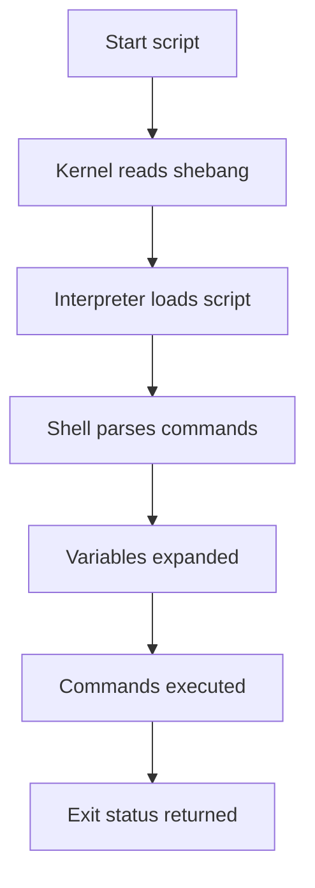
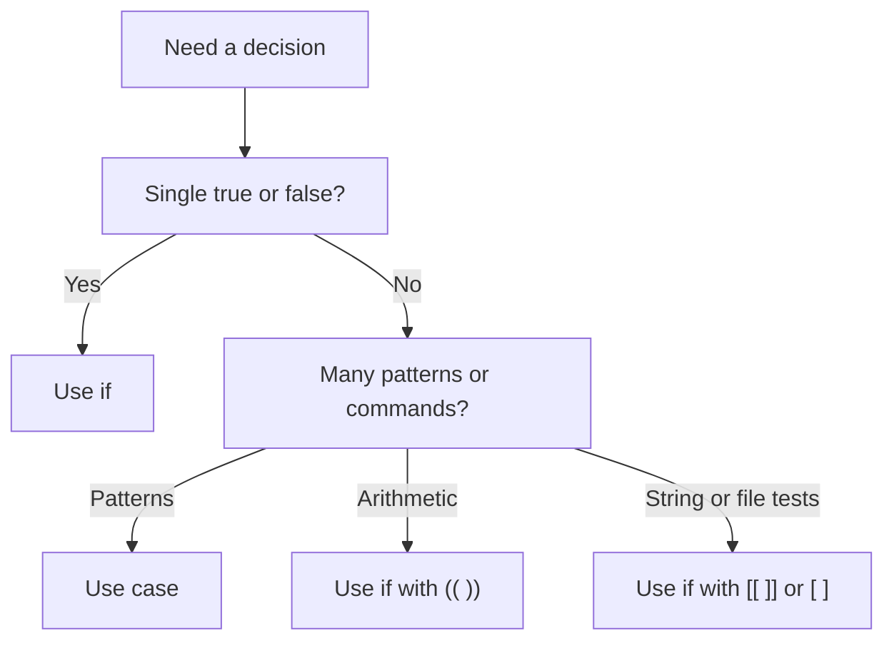
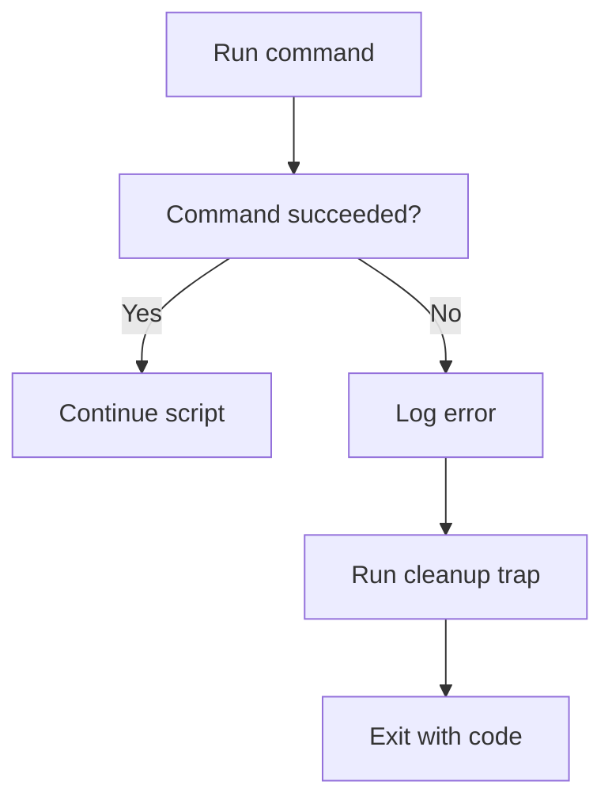
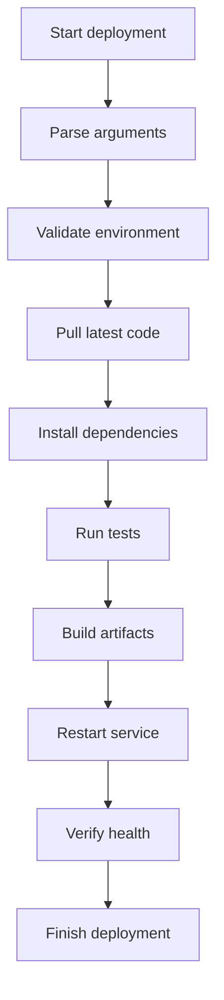

# Shell Scripting Guide

## Table of Contents

1. [Introduction to Shell](#1-introduction-to-shell)
2. [Variables](#2-variables)
3. [Data Types & Strings](#3-data-types--strings)
4. [Arrays](#4-arrays)
5. [Operators](#5-operators)
6. [Conditional Statements](#6-conditional-statements)
7. [Loops](#7-loops)
8. [Functions](#8-functions)
9. [Input/Output](#9-inputoutput)
10. [Error Handling](#10-error-handling)
11. [Regular Expressions](#11-regular-expressions)
12. [Process Management in Scripts](#12-process-management-in-scripts)
13. [Advanced Techniques](#13-advanced-techniques)
14. [Best Practices](#14-best-practices)
15. [Real-World Scripts](#15-real-world-scripts)
16. [Appendix](#16-appendix)

---

## 1. Introduction to Shell

### 1.1 What Is a Shell?

A shell is a command-line interpreter that provides a user interface for interacting with an operating system.

It reads commands.

It interprets them.

It executes programs.

It can also run scripts.

A shell script is a text file containing commands that the shell can execute.

Shell scripting is used for:

- Automation
- System administration
- DevOps workflows
- Deployment pipelines
- Log analysis
- Backups
- Monitoring
- File processing
- Text transformation
- Scheduled jobs

### 1.2 Why Learn Shell Scripting?

Shell scripting is useful because:

- It is available on most Unix-like systems.
- It glues system tools together effectively.
- It is ideal for automation tasks.
- It integrates with utilities like `grep`, `awk`, `sed`, `find`, and `xargs`.
- It can be used in CI/CD pipelines.
- It is lightweight and fast to start.

### 1.3 Types of Shells

Different shells provide different features.

| Shell | Description | Common Use Case | Notes |
| --- | --- | --- | --- |
| `sh` | Original Bourne shell interface or POSIX shell link | Portable scripts | Often linked to another shell |
| `bash` | Bourne Again Shell | General scripting and interactive use | Very common on Linux |
| `zsh` | Extended Bourne-style shell | Interactive users and scripting | Powerful completion and customization |
| `fish` | Friendly Interactive Shell | User-friendly interactive shell | Not POSIX-compatible |
| `dash` | Debian Almquist shell | Fast POSIX shell scripts | Lightweight and fast |

#### 1.3.1 `sh`

- Focuses on portability.
- Best for scripts that must run across many systems.
- Avoids shell-specific extensions.

#### 1.3.2 `bash`

- Most popular scripting shell on Linux.
- Supports arrays, associative arrays, `[[ ]]`, arithmetic expansion, process substitution, and more.
- Great for both beginners and advanced users.

#### 1.3.3 `zsh`

- Strong interactive shell.
- Powerful globbing.
- Supports advanced completion.
- Many `bash` scripts work with small adjustments.

#### 1.3.4 `fish`

- Designed for usability.
- Syntax differs from POSIX shells.
- Good for interactive work.
- Less common for portable production scripts.

#### 1.3.5 `dash`

- Very fast startup.
- Often used for system scripts requiring POSIX compliance.
- Lacks Bash-only features like arrays and `[[ ]]`.

### 1.4 Choosing the Right Shell

Use this quick guidance:

| Need | Recommended Shell |
| --- | --- |
| Maximum portability | `sh` / POSIX-compliant shell |
| Feature-rich scripting | `bash` |
| Interactive productivity | `zsh` |
| Beginner-friendly interactive use | `fish` |
| Fast minimal scripts | `dash` |

### 1.5 Shebang Line

The shebang tells the system which interpreter should run the script.

Basic example:

```bash
#!/bin/bash
```

Portable environment lookup:

```bash
#!/usr/bin/env bash
```

POSIX shell example:

```sh
#!/bin/sh
```

#### When to use `/usr/bin/env`

Use it when:

- The interpreter location may vary.
- You want to respect the current environment.
- You are working on systems where Bash is not always in `/bin/bash`.

#### When to use an absolute path

Use it when:

- You need predictable interpreter location.
- Your environment is controlled.
- You want clarity in production systems.

### 1.6 Making Scripts Executable

Create a script:

```bash
cat > hello.sh <<'EOF'
#!/usr/bin/env bash
echo "Hello, world!"
EOF
```

Make it executable:

```bash
chmod +x hello.sh
```

Run it:

```bash
./hello.sh
```

You can also run it explicitly with a shell:

```bash
bash hello.sh
```

### 1.7 How Script Execution Works



### 1.8 Script File Basics

Recommended conventions:

- Use `.sh` for readability.
- Include a shebang.
- Keep scripts in version control.
- Add comments for non-obvious logic.
- Use Unix line endings.

### 1.9 First Example Script

```bash
#!/usr/bin/env bash

name="Shell"
echo "Hello, $name scripting!"
```

### 1.10 Running with Debugging

```bash
bash -x script.sh
```

Or inside the script:

```bash
set -x
```

### 1.11 Interactive vs Non-Interactive Shells

| Type | Meaning |
| --- | --- |
| Interactive shell | User types commands directly |
| Non-interactive shell | Shell runs commands from a script |

Interactive shells often load startup files such as:

- `.bashrc`
- `.zshrc`
- `.profile`

Scripts should not rely on interactive shell configuration unless explicitly sourced.

### 1.12 Login vs Non-Login Shells

| Type | Common Startup Files |
| --- | --- |
| Login shell | `.profile`, `.bash_profile`, `.zprofile` |
| Non-login shell | `.bashrc`, `.zshrc` |

### 1.13 Common Script Use Cases

- Rename files in bulk
- Check disk usage
- Parse logs
- Backup directories
- Deploy applications
- Rotate logs
- Start background services
- Monitor processes

### 1.14 Comments in Shell Scripts

Single-line comment:

```bash
# This is a comment
```

Inline comment:

```bash
echo "done"  # status output
```

### 1.15 Script Header Template

```bash
#!/usr/bin/env bash
set -euo pipefail

# Description: Example script header
# Usage: ./script.sh [args]
# Author: Your Name
```

### 1.16 Common Mistakes in Beginner Scripts

- Missing shebang
- Not quoting variables
- Assuming Bash features in `sh`
- Ignoring exit codes
- Parsing command output unsafely
- Using spaces around `=` in assignments

Incorrect:

```bash
name = value
```

Correct:

```bash
name=value
```

### 1.17 Bash Version Check

```bash
echo "$BASH_VERSION"
```

### 1.18 Detect Current Shell

```bash
echo "$SHELL"
ps -p $$
```

### 1.19 Minimal Portable Script

```sh
#!/bin/sh
printf '%s\n' 'Portable shell script'
```

### 1.20 Section Summary

At this point you should understand:

- What a shell is
- Major shell types
- How shebang lines work
- How to make a script executable
- Basic script execution flow

---

## 2. Variables

### 2.1 Variable Basics

Variables store values.

Shell variables are usually untyped strings.

Example:

```bash
name="Alice"
age=30
city="New York"
```

Access them with `$`:

```bash
echo "$name"
echo "$age"
```

### 2.2 Assignment Rules

- No spaces around `=`
- Variable names usually contain letters, digits, and underscores
- Names should not start with a digit

Valid:

```bash
user_name="john"
count=5
```

Invalid:

```bash
2name="bad"
my var="bad"
```

### 2.3 Quoted vs Unquoted Assignment

```bash
message="hello world"
path=/var/log
```

Quotes are recommended when the value may contain spaces or special characters.

### 2.4 Local Variables

Inside functions, use `local` in Bash:

```bash
my_func() {
  local temp="inside"
  echo "$temp"
}
```

`local` helps avoid overwriting global variables.

### 2.5 Global Variables

Variables defined outside functions are usually global to the script.

```bash
app_name="demo"

show_name() {
  echo "$app_name"
}
```

### 2.6 Environment Variables

Environment variables are exported so child processes can use them.

```bash
export APP_ENV="production"
export PATH="$PATH:/custom/bin"
```

Difference:

| Type | Visible in current shell | Visible in child processes |
| --- | --- | --- |
| Regular variable | Yes | No |
| Exported variable | Yes | Yes |

### 2.7 Exporting Variables

```bash
name="Alice"
export name
```

Or in one line:

```bash
export name="Alice"
```

### 2.8 Readonly Variables

Use `readonly` to prevent reassignment.

```bash
readonly VERSION="1.0.0"
```

Attempting to change it causes an error.

### 2.9 Unsetting Variables

Remove a variable with `unset`:

```bash
foo="bar"
unset foo
```

### 2.10 Variable Scope and Subshells

A subshell gets a copy of variables.

```bash
name="parent"
(
  name="child"
  echo "$name"
)
echo "$name"
```

Output:

```text
child
parent
```

### 2.11 Command Substitution

Store command output in a variable:

```bash
current_date=$(date +%F)
```

Older syntax:

```bash
current_date=`date +%F`
```

Prefer `$(...)` because it is easier to read and nest.

### 2.12 Arithmetic Assignment

```bash
count=5
count=$((count + 1))
```

### 2.13 Using Braces Around Variables

Braces clarify variable boundaries.

```bash
file="report"
echo "${file}.txt"
```

### 2.14 Default Values with Parameter Expansion

Use a default if unset or null:

```bash
echo "${name:-Guest}"
```

Assign default if unset:

```bash
name=${name:-Guest}
```

Or:

```bash
: "${name:=Guest}"
```

### 2.15 Required Variables

Stop if a variable is missing:

```bash
: "${API_KEY:?API_KEY is required}"
```

### 2.16 Alternate Value if Set

```bash
echo "${name:+value exists}"
```

### 2.17 String Length via Variable Expansion

```bash
name="Shell"
echo "${#name}"
```

### 2.18 Positional Parameters

Scripts receive arguments as positional parameters.

| Variable | Meaning |
| --- | --- |
| `$0` | Script name |
| `$1` | First argument |
| `$2` | Second argument |
| `$#` | Number of arguments |
| `$@` | All arguments as separate words |
| `$*` | All arguments as one word when quoted |
| `$?` | Exit status of last command |
| `$$` | Current process ID |
| `$!` | PID of last background process |

Example:

```bash
#!/usr/bin/env bash

echo "Script: $0"
echo "First arg: $1"
echo "Arg count: $#"
```

### 2.19 Difference Between `$@` and `$*`

Quoted `$@` preserves individual arguments.

```bash
for arg in "$@"; do
  printf '[%s]\n' "$arg"
done
```

Quoted `$*` joins all arguments into one string.

```bash
printf '%s\n' "$*"
```

### 2.20 Exit Status Variable `$?`

```bash
grep "root" /etc/passwd
status=$?
echo "$status"
```

Convention:

- `0` means success
- non-zero means failure

### 2.21 Process ID Variables

```bash
echo "Current PID: $$"
sleep 10 &
echo "Background PID: $!"
```

### 2.22 Indirect Expansion

```bash
var_name="HOME"
echo "${!var_name}"
```

Bash-specific and useful in advanced scripts.

### 2.23 Listing Environment Variables

```bash
env
printenv
```

### 2.24 Common Environment Variables

| Variable | Meaning |
| --- | --- |
| `HOME` | User home directory |
| `PATH` | Command search path |
| `USER` | Current user |
| `PWD` | Current directory |
| `SHELL` | Login shell |
| `LANG` | Locale |
| `EDITOR` | Preferred editor |

### 2.25 Best Naming Practices

- Use lowercase for local script variables
- Use uppercase for exported or constant-like variables
- Choose descriptive names
- Avoid overriding special names like `PATH` accidentally

### 2.26 Example Variable-Heavy Script

```bash
#!/usr/bin/env bash
set -euo pipefail

readonly SCRIPT_NAME=$(basename "$0")
readonly DEFAULT_ENV="dev"
env_name="${1:-$DEFAULT_ENV}"
export APP_ENV="$env_name"

echo "Script: $SCRIPT_NAME"
echo "Environment: $APP_ENV"
echo "PID: $$"
```

### 2.27 Variable Pitfalls

Unquoted variable:

```bash
file="my file.txt"
rm $file
```

Safer:

```bash
rm -- "$file"
```

### 2.28 Section Summary

You learned:

- Variable declaration
- Local and global scope
- Exporting variables
- Readonly and unset
- Special variables and positional parameters

---

## 3. Data Types & Strings

### 3.1 Data Types in Shell

Shell scripting does not have strict data types like many languages.

Most values are treated as strings.

Arithmetic contexts interpret values numerically.

Conceptually you work with:

- Strings
- Integers
- Arrays
- Command output
- Exit statuses
- File paths

### 3.2 String Declaration

```bash
first_name="Ada"
last_name="Lovelace"
```

### 3.3 String Concatenation

Concatenate by placing values next to each other.

```bash
full_name="$first_name $last_name"
echo "$full_name"
```

No special operator is required.

### 3.4 String Length

```bash
text="shell"
echo "${#text}"
```

### 3.5 Substring Extraction

Bash substring syntax:

```bash
text="shellscripting"
echo "${text:0:5}"
echo "${text:5}"
```

### 3.6 Remove Prefix Pattern

```bash
path="/var/log/syslog"
echo "${path#/var/}"
```

Longest prefix removal:

```bash
echo "${path##*/}"
```

### 3.7 Remove Suffix Pattern

```bash
file="archive.tar.gz"
echo "${file%.gz}"
echo "${file%%.*}"
```

### 3.8 String Replacement

Replace first match:

```bash
msg="hello world"
echo "${msg/world/universe}"
```

Replace all matches:

```bash
echo "${msg//o/0}"
```

### 3.9 Case Conversion

Bash supports case modification.

```bash
word="shell"
echo "${word^^}"
echo "${word,,}"
```

Capitalize first character:

```bash
echo "${word^}"
```

### 3.10 Check Prefix and Suffix

Using pattern matching in `[[ ]]`:

```bash
file="report.csv"
[[ $file == report* ]]
[[ $file == *.csv ]]
```

### 3.11 Pattern Matching

```bash
name="script.sh"
if [[ $name == *.sh ]]; then
  echo "Shell script"
fi
```

### 3.12 String Comparison

```bash
[[ "$a" == "$b" ]]
[[ "$a" != "$b" ]]
[[ -z "$a" ]]
[[ -n "$a" ]]
```

### 3.13 Empty vs Unset

Empty string:

```bash
var=""
```

Unset variable:

```bash
unset var
```

Check carefully when using `set -u`.

### 3.14 Splitting Strings

Use `IFS` and `read`.

```bash
record="alice,30,admin"
IFS=',' read -r name age role <<< "$record"
```

### 3.15 Joining Strings

```bash
parts=(one two three)
joined=$(IFS=','; echo "${parts[*]}")
```

### 3.16 Escaping Special Characters

Common characters needing attention:

- `$`
- `"`
- `'`
- `\`
- `` ` ``
- `*`
- `?`
- `[` and `]`

### 3.17 Single Quotes vs Double Quotes

Single quotes preserve literal text:

```bash
echo 'Value: $HOME'
```

Double quotes allow expansion:

```bash
echo "Value: $HOME"
```

### 3.18 ANSI-C Quoting

```bash
printf '%s\n' $'line1\nline2'
```

Useful for embedded escapes.

### 3.19 Multi-Line Strings

```bash
text="line1
line2
line3"
printf '%s\n' "$text"
```

### 3.20 Trimming Whitespace

Use external tools when needed.

```bash
trimmed=$(echo "$input" | sed 's/^ *//;s/ *$//')
```

### 3.21 Search Inside a String

```bash
if [[ $text == *error* ]]; then
  echo "Contains error"
fi
```

### 3.22 Convert Delimited Data to Array

```bash
IFS=':' read -r -a path_parts <<< "$PATH"
```

### 3.23 String Formatting with `printf`

```bash
name="Ana"
score=95
printf 'User: %-10s Score: %03d\n' "$name" "$score"
```

### 3.24 Numeric Strings

Even numeric-looking values are still strings until used in arithmetic.

```bash
x="42"
echo $((x + 8))
```

### 3.25 Common String Pitfalls

#### Word splitting

```bash
value="a b c"
printf '%s\n' $value
```

This splits into multiple words.

Safer:

```bash
printf '%s\n' "$value"
```

#### Globbing side effects

If a variable contains `*`, unquoted expansion may match filenames.

### 3.26 Section Summary

Key points:

- Strings are central to shell scripting
- Parameter expansion is powerful
- Quote strings safely
- Use `[[ ]]` for cleaner pattern matching in Bash

---

## 4. Arrays

### 4.1 Overview

Arrays are Bash features.

POSIX `sh` does not support arrays the same way.

There are two main Bash array types:

- Indexed arrays
- Associative arrays

### 4.2 Indexed Arrays

```bash
fruits=(apple banana cherry)
```

Access an item:

```bash
echo "${fruits[0]}"
```

### 4.3 Explicit Index Assignment

```bash
fruits[0]="apple"
fruits[1]="banana"
fruits[2]="cherry"
```

### 4.4 All Elements

```bash
echo "${fruits[@]}"
```

### 4.5 Array Length

Number of elements:

```bash
echo "${#fruits[@]}"
```

Length of a single element:

```bash
echo "${#fruits[0]}"
```

### 4.6 Append to Array

```bash
fruits+=(orange)
```

### 4.7 Iterate Over Array

```bash
for fruit in "${fruits[@]}"; do
  echo "$fruit"
done
```

### 4.8 Iterate Over Indexes

```bash
for i in "${!fruits[@]}"; do
  echo "$i -> ${fruits[i]}"
done
```

### 4.9 Delete an Element

```bash
unset 'fruits[1]'
```

Note that this leaves a gap in indexes.

### 4.10 Rebuild Dense Array

```bash
fruits=("${fruits[@]}")
```

### 4.11 Slice an Array

```bash
numbers=(10 20 30 40 50)
echo "${numbers[@]:1:3}"
```

### 4.12 Read Command Output into Array

Preferred with `mapfile` or `readarray`:

```bash
mapfile -t lines < file.txt
```

Or from command output:

```bash
mapfile -t services < <(systemctl list-units --type=service --no-legend | awk '{print $1}')
```

### 4.13 Associative Arrays

Declare first:

```bash
declare -A ages
```

Assign values:

```bash
ages[alice]=30
ages[bob]=28
```

Access:

```bash
echo "${ages[alice]}"
```

### 4.14 Iterate Associative Array Keys

```bash
for key in "${!ages[@]}"; do
  echo "$key -> ${ages[$key]}"
done
```

### 4.15 Test If Key Exists

```bash
if [[ -v 'ages[alice]' ]]; then
  echo "Key exists"
fi
```

### 4.16 Array from Positional Parameters

```bash
args=("$@")
```

### 4.17 Difference Between `${array[*]}` and `${array[@]}`

Quoted:

- `"${array[@]}"` preserves elements separately
- `"${array[*]}"` joins elements into one string using `IFS`

### 4.18 Array Example Script

```bash
#!/usr/bin/env bash
set -euo pipefail

servers=(web1 web2 db1)
for server in "${servers[@]}"; do
  printf 'Checking %s\n' "$server"
done
```

### 4.19 Common Array Operations Table

| Operation | Example |
| --- | --- |
| Create indexed array | `items=(a b c)` |
| Append element | `items+=(d)` |
| Access element | `${items[1]}` |
| Array length | `${#items[@]}` |
| Indexes | `${!items[@]}` |
| Remove element | `unset 'items[2]'` |
| Declare associative | `declare -A map` |
| Access map value | `${map[key]}` |

### 4.20 Reading File into Array Safely

```bash
mapfile -t users < users.txt
for user in "${users[@]}"; do
  printf 'User: %s\n' "$user"
done
```

### 4.21 Pitfalls

- Arrays are Bash-specific
- Unquoted array expansions can split unexpectedly
- Sparse indexes may surprise you

### 4.22 Section Summary

Arrays help manage grouped data cleanly in Bash.

---

## 5. Operators

### 5.1 Overview

Shell scripts use operators for:

- Arithmetic
- Comparison
- String tests
- File tests
- Logical evaluation

### 5.2 Arithmetic Operators

| Operator | Meaning | Example |
| --- | --- | --- |
| `+` | Addition | `$((a + b))` |
| `-` | Subtraction | `$((a - b))` |
| `*` | Multiplication | `$((a * b))` |
| `/` | Division | `$((a / b))` |
| `%` | Modulus | `$((a % b))` |
| `++` | Increment | `((a++))` |
| `--` | Decrement | `((a--))` |

Example:

```bash
a=10
b=3
echo $((a + b))
echo $((a % b))
```

### 5.3 Numeric Comparison Operators

Used with `test`, `[ ]`, or `[[ ]]`.

| Operator | Meaning |
| --- | --- |
| `-eq` | Equal |
| `-ne` | Not equal |
| `-gt` | Greater than |
| `-lt` | Less than |
| `-ge` | Greater than or equal |
| `-le` | Less than or equal |

Example:

```bash
if [ "$a" -gt "$b" ]; then
  echo "a is larger"
fi
```

### 5.4 String Comparison Operators

| Operator | Meaning |
| --- | --- |
| `=` or `==` | Equal |
| `!=` | Not equal |
| `-z` | String is empty |
| `-n` | String is not empty |

Example:

```bash
if [[ $name == "admin" ]]; then
  echo "Welcome"
fi
```

### 5.5 File Test Operators

| Operator | Meaning |
| --- | --- |
| `-f` | Regular file exists |
| `-d` | Directory exists |
| `-e` | Path exists |
| `-r` | Readable |
| `-w` | Writable |
| `-x` | Executable |
| `-s` | Non-empty file |
| `-L` | Symbolic link |

Examples:

```bash
[[ -f /etc/passwd ]]
[[ -d /var/log ]]
[[ -x ./deploy.sh ]]
```

### 5.6 Additional File Tests

| Operator | Meaning |
| --- | --- |
| `-b` | Block device |
| `-c` | Character device |
| `-p` | Named pipe |
| `-S` | Socket |
| `-O` | Owned by current user |
| `-G` | Owned by current group |
| `-N` | Modified since last read |
| `file1 -nt file2` | Newer than |
| `file1 -ot file2` | Older than |

### 5.7 Logical Operators

In Bash `[[ ]]`:

```bash
[[ $a -gt 0 && $b -gt 0 ]]
[[ $a -gt 0 || $b -gt 0 ]]
[[ ! -f missing.txt ]]
```

### 5.8 Arithmetic Evaluation with `(( ))`

```bash
count=5
if (( count > 3 )); then
  echo "Greater than 3"
fi
```

### 5.9 Operator Precedence

Use parentheses to make logic clear.

```bash
if [[ ($role == admin || $role == ops) && $enabled == yes ]]; then
  echo "Allowed"
fi
```

### 5.10 Common Comparison Examples

#### Number comparison

```bash
if (( disk_usage > 80 )); then
  echo "Warning"
fi
```

#### String empty check

```bash
if [[ -z ${input:-} ]]; then
  echo "No input"
fi
```

#### File exists check

```bash
if [[ -e $config_file ]]; then
  echo "Config found"
fi
```

### 5.11 Old `expr` Tool

Historically used for arithmetic:

```bash
expr 5 + 2
```

Modern Bash prefers:

```bash
echo $((5 + 2))
```

### 5.12 Section Summary

Use:

- `(( ))` for arithmetic
- `[[ ]]` for modern Bash tests
- `[ ]` for portable tests
- file test operators for filesystem conditions

---

## 6. Conditional Statements

### 6.1 `if` Statement

Basic form:

```bash
if condition; then
  commands
fi
```

Example:

```bash
if [[ -f /etc/passwd ]]; then
  echo "passwd exists"
fi
```

### 6.2 `if/else`

```bash
if [[ -d logs ]]; then
  echo "logs exists"
else
  echo "logs missing"
fi
```

### 6.3 `if/elif/else`

```bash
score=82

if (( score >= 90 )); then
  echo "A"
elif (( score >= 75 )); then
  echo "B"
else
  echo "C"
fi
```

### 6.4 `test`, `[ ]`, and `[[ ]]`

| Form | Notes |
| --- | --- |
| `test expr` | Old style |
| `[ expr ]` | Widely used |
| `[[ expr ]]` | Bash/Ksh/Zsh enhanced syntax |

Prefer `[[ ]]` in Bash because it:

- Handles pattern matching well
- Avoids some word-splitting issues
- Supports `&&`, `||`, and regex `=~`

### 6.5 `case` Statement

Use `case` for multiple pattern-based branches.

```bash
case "$1" in
  start)
    echo "Starting"
    ;;
  stop)
    echo "Stopping"
    ;;
  restart)
    echo "Restarting"
    ;;
  *)
    echo "Usage: $0 {start|stop|restart}"
    ;;
esac
```

### 6.6 Pattern Matching in `case`

```bash
case "$file" in
  *.log)
    echo "Log file"
    ;;
  *.csv)
    echo "CSV file"
    ;;
  *)
    echo "Unknown type"
    ;;
esac
```

### 6.7 Nested Conditions

```bash
if [[ -n ${user:-} ]]; then
  if [[ $user == admin ]]; then
    echo "Admin access"
  fi
fi
```

### 6.8 One-Line Conditions

```bash
[[ -f config.yml ]] && echo "Found"
[[ -f config.yml ]] || echo "Missing"
```

Be careful when chaining commands that may fail for reasons other than condition logic.

### 6.9 Arithmetic Conditions

```bash
if (( retries < max_retries )); then
  ((retries++))
fi
```

### 6.10 File-Based Decision Example

```bash
if [[ -s app.log ]]; then
  echo "Log has data"
else
  echo "Log empty or missing"
fi
```

### 6.11 Choosing Between `if` and `case`

| Situation | Better Choice |
| --- | --- |
| One simple true/false decision | `if` |
| Numeric comparison | `if` with `(( ))` |
| Many fixed options | `case` |
| Pattern-based branching | `case` |

### 6.12 Decision Tree for Shell Constructs



### 6.13 Common Mistakes

Incorrect spacing:

```bash
if[ "$x" = 1 ]; then
  echo bad
fi
```

Correct:

```bash
if [ "$x" = 1 ]; then
  echo good
fi
```

### 6.14 Comparing Strings Safely

```bash
if [[ ${role:-} == "admin" ]]; then
  echo "Privileged"
fi
```

### 6.15 Matching Multiple Patterns in `case`

```bash
case "$env" in
  dev|test)
    echo "Non-production"
    ;;
  prod)
    echo "Production"
    ;;
esac
```

### 6.16 Fallthrough Behavior in Bash `case`

Bash supports `;&` and `;;&` in advanced cases.

```bash
case "$value" in
  a)
    echo "A"
    ;&
  b)
    echo "B"
    ;;
esac
```

### 6.17 Section Summary

Conditional constructs let scripts react to:

- input
- file state
- numeric thresholds
- string patterns

---

## 7. Loops

### 7.1 `for` Loop

Loop over a list:

```bash
for item in one two three; do
  echo "$item"
done
```

### 7.2 `for` Loop Over Files

```bash
for file in *.log; do
  [[ -e $file ]] || continue
  echo "Processing $file"
done
```

### 7.3 C-Style `for` Loop

```bash
for ((i=0; i<5; i++)); do
  echo "$i"
done
```

### 7.4 `while` Loop

```bash
count=1
while (( count <= 3 )); do
  echo "$count"
  ((count++))
done
```

### 7.5 `until` Loop

`until` runs until the condition becomes true.

```bash
count=1
until (( count > 3 )); do
  echo "$count"
  ((count++))
done
```

### 7.6 `select` Loop

Useful for menus.

```bash
select option in start stop quit; do
  case "$option" in
    start) echo "Starting" ;;
    stop) echo "Stopping" ;;
    quit) break ;;
    *) echo "Invalid" ;;
  esac
done
```

### 7.7 `break`

Exit a loop early.

```bash
for n in 1 2 3 4 5; do
  [[ $n -eq 3 ]] && break
  echo "$n"
done
```

### 7.8 `continue`

Skip current iteration.

```bash
for n in 1 2 3 4 5; do
  [[ $n -eq 3 ]] && continue
  echo "$n"
done
```

### 7.9 Loop Over Script Arguments

```bash
for arg in "$@"; do
  echo "Arg: $arg"
done
```

### 7.10 Reading File Line by Line

```bash
while IFS= read -r line; do
  printf 'Line: %s\n' "$line"
done < file.txt
```

Why this is good:

- `IFS=` preserves leading/trailing spaces
- `-r` prevents backslash escaping

### 7.11 Reading Command Output with Process Substitution

```bash
while IFS= read -r user; do
  echo "User: $user"
done < <(cut -d: -f1 /etc/passwd)
```

### 7.12 Loop Over Array

```bash
servers=(web1 web2 db1)
for server in "${servers[@]}"; do
  echo "$server"
done
```

### 7.13 Infinite Loop

```bash
while true; do
  date
  sleep 5
done
```

Alternative:

```bash
for ((;;)); do
  date
  sleep 5
done
```

### 7.14 Loop Control with Multiple Levels

```bash
for i in 1 2 3; do
  for j in a b c; do
    [[ $j == b ]] && break 2
    echo "$i $j"
  done
done
```

### 7.15 Looping Safely Over Filenames

Avoid this:

```bash
for f in $(ls); do
  echo "$f"
done
```

Prefer globbing or `find`.

```bash
for f in ./*; do
  printf '%s\n' "$f"
done
```

### 7.16 `find` with `while read`

```bash
find . -type f -name '*.log' -print0 |
while IFS= read -r -d '' file; do
  printf 'Found: %s\n' "$file"
done
```

### 7.17 Retry Loop Example

```bash
attempt=1
max_attempts=5

until curl -fsS https://example.com/health; do
  if (( attempt >= max_attempts )); then
    echo "Service unavailable"
    exit 1
  fi
  echo "Retry $attempt/$max_attempts"
  ((attempt++))
  sleep 2
done
```

### 7.18 Section Summary

Loops help automate repetition over:

- lists
- files
- lines
- arguments
- retry operations

---

## 8. Functions

### 8.1 Why Functions Matter

Functions let you:

- Reuse code
- Organize logic
- Improve readability
- Reduce duplication
- Build script libraries

### 8.2 Function Declaration Styles

Portable style:

```bash
say_hello() {
  echo "Hello"
}
```

Bash also accepts:

```bash
function say_hello {
  echo "Hello"
}
```

Prefer the first style for portability.

### 8.3 Calling a Function

```bash
say_hello
```

### 8.4 Function Arguments

Functions use positional parameters too.

```bash
greet() {
  echo "Hello, $1"
}

greet "Alice"
```

### 8.5 Multiple Arguments

```bash
sum_two() {
  local a=$1
  local b=$2
  echo $((a + b))
}
```

### 8.6 Returning Values

Shell functions return an exit status, not arbitrary data.

```bash
is_even() {
  local n=$1
  (( n % 2 == 0 ))
}

if is_even 4; then
  echo "Even"
fi
```

To return data, print it and capture output.

```bash
get_date() {
  date +%F
}

today=$(get_date)
```

### 8.7 Local Variables in Functions

```bash
build_path() {
  local base=$1
  local name=$2
  echo "$base/$name"
}
```

### 8.8 Exit Status from Functions

```bash
check_file() {
  [[ -f $1 ]]
}

check_file /etc/passwd
status=$?
```

### 8.9 Guard Functions

```bash
require_file() {
  local file=$1
  [[ -f $file ]] || {
    echo "Missing file: $file" >&2
    return 1
  }
}
```

### 8.10 Logging Functions

```bash
log_info() {
  printf '[INFO] %s\n' "$*"
}

log_error() {
  printf '[ERROR] %s\n' "$*" >&2
}
```

### 8.11 Error Handling Function Pattern

```bash
die() {
  printf 'ERROR: %s\n' "$*" >&2
  exit 1
}
```

### 8.12 Function Libraries with `source`

Create a reusable library.

`lib.sh`:

```bash
log() {
  printf '[LOG] %s\n' "$*"
}
```

`main.sh`:

```bash
#!/usr/bin/env bash
source ./lib.sh
log "Started"
```

Portable alternative:

```sh
. ./lib.sh
```

### 8.13 Recursion

Bash supports recursion, but use it carefully.

```bash
factorial() {
  local n=$1
  if (( n <= 1 )); then
    echo 1
  else
    local prev
    prev=$(factorial $((n - 1)))
    echo $((n * prev))
  fi
}
```

### 8.14 Function Naming Tips

- Use lowercase with underscores
- Prefix library functions when needed
- Keep names descriptive

Examples:

- `parse_args`
- `load_config`
- `backup_directory`
- `log_info`

### 8.15 Using `return`

`return` sets a numeric exit status between 0 and 255.

```bash
check_port() {
  local port=$1
  (( port > 0 && port < 65536 ))
  return $?
}
```

### 8.16 Passing Arrays to Functions

Usually pass values or use namerefs in modern Bash.

Simple approach:

```bash
print_items() {
  local item
  for item in "$@"; do
    echo "$item"
  done
}

print_items "${fruits[@]}"
```

### 8.17 Using Namerefs

Bash 4.3+ supports `local -n`.

```bash
print_array() {
  local -n arr_ref=$1
  local item
  for item in "${arr_ref[@]}"; do
    echo "$item"
  done
}
```

### 8.18 Section Summary

Functions are the foundation of maintainable shell scripts.

---

## 9. Input/Output

### 9.1 `echo`

```bash
echo "Hello"
```

Be aware that `echo` behavior can vary between shells.

### 9.2 `printf`

Prefer `printf` for predictable formatting.

```bash
printf 'Name: %s\n' "$name"
```

### 9.3 Common `printf` Specifiers

| Specifier | Meaning |
| --- | --- |
| `%s` | String |
| `%d` | Integer |
| `%f` | Floating point |
| `%q` | Shell-escaped string in Bash |

### 9.4 Reading User Input with `read`

```bash
read -r name
printf 'Hello, %s\n' "$name"
```

### 9.5 Prompting Inline

```bash
read -r -p "Enter your name: " name
```

### 9.6 Reading Silent Input

```bash
read -r -s -p "Password: " password
echo
```

### 9.7 Reading Multiple Fields

```bash
read -r first last <<< "Ada Lovelace"
echo "$first"
echo "$last"
```

### 9.8 Here Documents

A here document feeds multiple lines to a command.

```bash
cat <<EOF
Line 1
Line 2
EOF
```

### 9.9 Quoted Here Documents

Quoted delimiter disables expansion.

```bash
cat <<'EOF'
Literal $HOME
Literal $(date)
EOF
```

### 9.10 Here Strings

A here string passes a single string.

```bash
grep "root" <<< "root:x:0:0"
```

### 9.11 Redirecting Output

| Syntax | Meaning |
| --- | --- |
| `>` | Redirect stdout |
| `>>` | Append stdout |
| `2>` | Redirect stderr |
| `2>>` | Append stderr |
| `&>` | Redirect stdout and stderr in Bash |
| `>/dev/null` | Discard stdout |

### 9.12 Standard Streams

| FD | Name |
| --- | --- |
| `0` | stdin |
| `1` | stdout |
| `2` | stderr |

### 9.13 Redirect stderr Separately

```bash
command >output.log 2>error.log
```

### 9.14 Redirect Both Streams

Portable style:

```bash
command >all.log 2>&1
```

### 9.15 Read from File Descriptor

```bash
exec 3< input.txt
read -r line <&3
echo "$line"
exec 3<&-
```

### 9.16 Write to Custom File Descriptor

```bash
exec 3> output.txt
printf 'hello\n' >&3
exec 3>&-
```

### 9.17 Piping Commands

```bash
ps aux | grep nginx
```

### 9.18 Safer Pipeline with `pipefail`

```bash
set -o pipefail
```

### 9.19 Capture stdout in Variable

```bash
hostname=$(hostname)
```

### 9.20 Capture Both stdout and stderr

```bash
output=$(command 2>&1)
```

### 9.21 Reading File into Variables

```bash
while IFS='=' read -r key value; do
  printf '%s -> %s\n' "$key" "$value"
done < config.env
```

### 9.22 Colored Output

```bash
red='\033[31m'
green='\033[32m'
reset='\033[0m'
printf '%bSuccess%b\n' "$green" "$reset"
```

### 9.23 Section Summary

For production scripts:

- prefer `printf`
- use `read -r`
- understand redirection
- use quoted here documents when needed

---

## 10. Error Handling

### 10.1 Why Error Handling Matters

Good scripts fail clearly and safely.

Without error handling, scripts may:

- continue after failures
- corrupt data
- produce partial results
- hide real problems

### 10.2 `set -e`

Exit on command failure.

```bash
set -e
```

Be aware that `set -e` has exceptions in conditionals, pipelines, and command lists.

### 10.3 `set -u`

Treat unset variables as errors.

```bash
set -u
```

### 10.4 `set -o pipefail`

Fail a pipeline if any command fails.

```bash
set -o pipefail
```

### 10.5 Common Safe Header

```bash
set -euo pipefail
```

### 10.6 `trap`

Use `trap` to run cleanup code.

```bash
cleanup() {
  echo "Cleaning up"
}

trap cleanup EXIT
```

### 10.7 Trap Specific Signals

```bash
trap 'echo "Interrupted"; exit 130' INT
trap 'echo "Terminated"; exit 143' TERM
```

### 10.8 Exit Codes

Convention:

| Code | Meaning |
| --- | --- |
| `0` | Success |
| `1` | General error |
| `2` | Misuse of shell builtins |
| `126` | Command found but not executable |
| `127` | Command not found |
| `130` | Script terminated by Ctrl+C |

### 10.9 Explicit Exit

```bash
exit 1
```

### 10.10 Error Function

```bash
die() {
  printf 'ERROR: %s\n' "$*" >&2
  exit 1
}
```

### 10.11 Warning Function

```bash
warn() {
  printf 'WARN: %s\n' "$*" >&2
}
```

### 10.12 Cleanup Function Pattern

```bash
cleanup() {
  [[ -n ${temp_file:-} && -e ${temp_file:-} ]] && rm -f -- "$temp_file"
}
trap cleanup EXIT
```

### 10.13 Check Command Status Directly

```bash
if ! cp source.txt dest.txt; then
  echo "Copy failed" >&2
  exit 1
fi
```

### 10.14 Error Handling Flow



### 10.15 Trap ERR in Bash

```bash
set -E
trap 'echo "Error on line $LINENO"' ERR
```

Useful for debugging and centralized error reporting.

### 10.16 Ignore Certain Errors Deliberately

```bash
rm -f missing.file || true
```

Use carefully.

### 10.17 Grouped Error Context

```bash
if ! {
  step_one
  step_two
  step_three
}; then
  die "Workflow failed"
fi
```

### 10.18 Safer Temporary Resource Cleanup

Use a trap for files, directories, background jobs, or locks.

```bash
cleanup() {
  [[ -n ${pid:-} ]] && kill "$pid" 2>/dev/null || true
}
trap cleanup EXIT
```

### 10.19 Logging Failed Commands

```bash
trap 'printf "Failed command: %s\n" "$BASH_COMMAND" >&2' ERR
```

### 10.20 Retrying Failures

```bash
retry() {
  local attempts=$1
  shift
  local n=1
  until "$@"; do
    if (( n >= attempts )); then
      return 1
    fi
    ((n++))
    sleep 1
  done
}
```

### 10.21 Section Summary

Robust scripts combine:

- strict mode
- explicit checks
- traps
- useful exit codes
- cleanup handlers

---

## 11. Regular Expressions

### 11.1 Why Regex Matters

Regular expressions help match text patterns.

Useful in shell scripts for:

- validation
- parsing logs
- filtering lines
- extracting values

### 11.2 Basic vs Extended Regex

| Type | Tool Examples | Notes |
| --- | --- | --- |
| Basic Regular Expressions | `grep`, `sed` | Some metacharacters require escaping |
| Extended Regular Expressions | `grep -E`, `awk`, Bash `=~` | More expressive |

### 11.3 Common Regex Tokens

| Token | Meaning |
| --- | --- |
| `.` | Any single character |
| `*` | Zero or more |
| `+` | One or more |
| `?` | Zero or one |
| `^` | Start of line |
| `$` | End of line |
| `[abc]` | Character class |
| `[^abc]` | Negated class |
| `[0-9]` | Range |
| `(a|b)` | Alternation |

### 11.4 Using Bash `=~`

```bash
email="user@example.com"
if [[ $email =~ ^[A-Za-z0-9._%+-]+@[A-Za-z0-9.-]+\.[A-Za-z]{2,}$ ]]; then
  echo "Valid email"
fi
```

### 11.5 Capturing Groups in Bash

Matches go into `BASH_REMATCH`.

```bash
text="version=1.2.3"
if [[ $text =~ ^version=([0-9]+)\.([0-9]+)\.([0-9]+)$ ]]; then
  echo "Major: ${BASH_REMATCH[1]}"
  echo "Minor: ${BASH_REMATCH[2]}"
  echo "Patch: ${BASH_REMATCH[3]}"
fi
```

### 11.6 `grep -E`

```bash
grep -E 'error|warning' app.log
```

### 11.7 Validate Numbers

```bash
if [[ $value =~ ^[0-9]+$ ]]; then
  echo "Integer"
fi
```

### 11.8 Validate IPv4 Format

```bash
if [[ $ip =~ ^([0-9]{1,3}\.){3}[0-9]{1,3}$ ]]; then
  echo "Looks like IPv4"
fi
```

Note: format validity is not the same as numeric range validity.

### 11.9 Extract Date from Log Line

```bash
line='2025-01-15 INFO started'
if [[ $line =~ ^([0-9]{4}-[0-9]{2}-[0-9]{2})[[:space:]] ]]; then
  echo "Date: ${BASH_REMATCH[1]}"
fi
```

### 11.10 Whitespace Classes

Use POSIX character classes:

- `[[:space:]]`
- `[[:digit:]]`
- `[[:alpha:]]`
- `[[:alnum:]]`
- `[[:lower:]]`
- `[[:upper:]]`

### 11.11 Regex with `sed`

```bash
echo 'user=alice' | sed -E 's/^user=(.*)$/\1/'
```

### 11.12 Regex with `awk`

```bash
awk '/ERROR|WARN/ {print $0}' app.log
```

### 11.13 Quoting Rules with `=~`

Do not quote the regex on the right side in Bash if you want regex behavior.

Good:

```bash
[[ $value =~ ^[0-9]+$ ]]
```

Quoted pattern may behave differently.

### 11.14 Common Patterns Table

| Purpose | Pattern |
| --- | --- |
| Integer | `^[0-9]+$` |
| Identifier | `^[A-Za-z_][A-Za-z0-9_]*$` |
| Date `YYYY-MM-DD` | `^[0-9]{4}-[0-9]{2}-[0-9]{2}$` |
| Time `HH:MM:SS` | `^[0-9]{2}:[0-9]{2}:[0-9]{2}$` |
| Log level | `^(INFO|WARN|ERROR|DEBUG)$` |

### 11.15 Section Summary

Regex is powerful, but readability matters.

Keep patterns documented and tested.

---

## 12. Process Management in Scripts

### 12.1 Background Processes

Run a command in the background with `&`.

```bash
sleep 30 &
pid=$!
echo "PID: $pid"
```

### 12.2 `wait`

Wait for a background job.

```bash
sleep 2 &
pid=$!
wait "$pid"
echo "Done"
```

### 12.3 Capture Exit Status from `wait`

```bash
some_command &
pid=$!
if wait "$pid"; then
  echo "Success"
else
  echo "Failed"
fi
```

### 12.4 Multiple Background Jobs

```bash
pids=()
for host in host1 host2 host3; do
  ping -c 1 "$host" >/dev/null 2>&1 &
  pids+=("$!")
done

for pid in "${pids[@]}"; do
  wait "$pid"
done
```

### 12.5 `jobs`

Lists current jobs in an interactive shell.

```bash
jobs
```

Note that job control is mostly relevant for interactive shells.

### 12.6 `fg` and `bg`

These are job-control builtins used interactively.

- `fg` moves a job to foreground
- `bg` resumes in background

### 12.7 Subshells

Commands in parentheses run in a subshell.

```bash
(
  cd /var/log || exit 1
  ls
)
```

Changes do not affect the parent shell.

### 12.8 Group Commands Without Subshell

Use braces:

```bash
{
  echo "one"
  echo "two"
} > output.txt
```

### 12.9 Process Substitution

Useful for comparing command output.

```bash
diff <(sort file1.txt) <(sort file2.txt)
```

### 12.10 Named Pipes vs Process Substitution

Process substitution often uses FIFOs or `/dev/fd` internally depending on the platform.

It is convenient for commands that expect filenames.

### 12.11 Disowning Jobs

Interactive shell feature:

```bash
long_running_command &
disown
```

### 12.12 Monitoring Child Processes

```bash
run_worker() {
  sleep 3
}

run_worker &
worker_pid=$!

if wait "$worker_pid"; then
  echo "Worker finished"
fi
```

### 12.13 Parallel Execution Pattern

```bash
pids=()
for file in *.log; do
  [[ -e $file ]] || continue
  gzip "$file" &
  pids+=("$!")
done

for pid in "${pids[@]}"; do
  wait "$pid"
done
```

### 12.14 Beware of Race Conditions

When multiple processes write to the same file or resource, you may get corruption or unexpected order.

Use locks when necessary.

### 12.15 Section Summary

Process management enables:

- concurrency
- waiting for work
- subshell isolation
- feeding commands with process substitution

---

## 13. Advanced Techniques

### 13.1 Argument Parsing with `getopts`

Use `getopts` for short options.

```bash
#!/usr/bin/env bash
set -euo pipefail

verbose=false
output=""

while getopts ":vo:" opt; do
  case "$opt" in
    v) verbose=true ;;
    o) output=$OPTARG ;;
    :) echo "Option -$OPTARG requires an argument" >&2; exit 1 ;;
    \?) echo "Invalid option: -$OPTARG" >&2; exit 1 ;;
  esac
done
shift $((OPTIND - 1))
```

### 13.2 Long Options Pattern

`getopts` does not support long options directly.

A common manual pattern:

```bash
while [[ $# -gt 0 ]]; do
  case "$1" in
    --help)
      echo "Help"
      exit 0
      ;;
    --env)
      env_name=$2
      shift 2
      ;;
    *)
      echo "Unknown option: $1" >&2
      exit 1
      ;;
  esac
done
```

### 13.3 Signal Handling

```bash
handle_int() {
  echo "Caught SIGINT"
  exit 130
}

trap handle_int INT
```

### 13.4 Temporary Files with `mktemp`

```bash
temp_file=$(mktemp)
trap 'rm -f -- "$temp_file"' EXIT
```

For temporary directories:

```bash
temp_dir=$(mktemp -d)
trap 'rm -rf -- "$temp_dir"' EXIT
```

### 13.5 Lock Files with `flock`

Prevent concurrent runs.

```bash
exec 9>/var/lock/my_script.lock
flock -n 9 || {
  echo "Another instance is running" >&2
  exit 1
}
```

### 13.6 Debugging with `set -x`

```bash
set -x
```

Disable later:

```bash
set +x
```

### 13.7 Customize Debug Output with `PS4`

```bash
export PS4='+ ${BASH_SOURCE}:${LINENO}:${FUNCNAME[0]}: '
set -x
```

### 13.8 Logging to File and Console

```bash
log_file="app.log"
log() {
  printf '%s %s\n' "$(date '+%F %T')" "$*" | tee -a "$log_file"
}
```

### 13.9 Structured Logging Levels

```bash
log_msg() {
  local level=$1
  shift
  printf '%s [%s] %s\n' "$(date '+%F %T')" "$level" "$*"
}
```

### 13.10 Command-Line Usage Function

```bash
usage() {
  cat <<'EOF'
Usage: script.sh [-v] [-o file]
  -v        Verbose mode
  -o FILE   Output file
EOF
}
```

### 13.11 Config File Loading

Example `.env`-style loading:

```bash
set -a
source .env
set +a
```

Only do this for trusted files.

### 13.12 Safe Directory Changes

```bash
script_dir=$(cd -- "$(dirname -- "${BASH_SOURCE[0]}")" && pwd)
cd "$script_dir"
```

### 13.13 Detect OS

```bash
case "$(uname -s)" in
  Linux) echo "Linux" ;;
  Darwin) echo "macOS" ;;
  *) echo "Other" ;;
esac
```

### 13.14 Timeout Pattern

```bash
if ! timeout 5s curl -fsS https://example.com; then
  echo "Timed out or failed" >&2
fi
```

### 13.15 Reading Script Directory Reliably

```bash
SCRIPT_DIR=$(cd -- "$(dirname -- "${BASH_SOURCE[0]}")" && pwd)
```

### 13.16 Advanced Redirection with `exec`

Redirect all output:

```bash
exec >script.out 2>script.err
```

Or both together:

```bash
exec > >(tee -a script.log) 2>&1
```

### 13.17 Coprocesses

Bash supports `coproc` for advanced two-way communication.

```bash
coproc MYCOPROC { tr '[:lower:]' '[:upper:]'; }
printf 'hello\n' >&"${MYCOPROC[1]}"
read -r line <&"${MYCOPROC[0]}"
echo "$line"
```

### 13.18 Null-Delimited Safety

Use null delimiters for filenames.

```bash
find . -type f -print0 |
while IFS= read -r -d '' file; do
  printf '%s\n' "$file"
done
```

### 13.19 Rate Limiting Loops

```bash
for item in "${items[@]}"; do
  process "$item"
  sleep 0.2
done
```

### 13.20 Retry Helper with Backoff

```bash
retry_backoff() {
  local max_attempts=$1
  shift
  local delay=1
  local attempt=1

  until "$@"; do
    if (( attempt >= max_attempts )); then
      return 1
    fi
    sleep "$delay"
    delay=$((delay * 2))
    ((attempt++))
  done
}
```

### 13.21 Section Summary

Advanced techniques improve:

- robustness
- observability
- safety
- concurrency control
- maintainability

---

## 14. Best Practices

### 14.1 Use ShellCheck

ShellCheck is a static analysis tool for shell scripts.

```bash
shellcheck script.sh
```

Benefits:

- catches quoting issues
- finds unused variables
- flags portability problems
- suggests safer patterns

### 14.2 Quote Variables

Bad:

```bash
cp $src $dst
```

Good:

```bash
cp -- "$src" "$dst"
```

### 14.3 Use `set -euo pipefail` When Appropriate

This improves safety, but understand the behavior before applying it everywhere.

### 14.4 Prefer `printf` over `echo`

`printf` is more predictable across environments.

### 14.5 Avoid Parsing `ls`

Bad:

```bash
for f in $(ls *.txt); do
  echo "$f"
done
```

Better:

```bash
for f in ./*.txt; do
  [[ -e $f ]] || continue
  echo "$f"
done
```

### 14.6 Use `[[ ]]` in Bash Scripts

It is safer and more expressive than `[ ]` for many Bash-specific scripts.

### 14.7 Prefer Functions Over Repeated Blocks

Refactor repeated logic into reusable functions.

### 14.8 Separate stdout and stderr

Normal results should go to stdout.

Errors and diagnostics should go to stderr.

### 14.9 Validate Inputs Early

Examples:

- required arguments
- file existence
- numeric ranges
- command availability
- permissions

### 14.10 Check Dependencies

```bash
require_cmd() {
  command -v "$1" >/dev/null 2>&1 || {
    printf 'Missing required command: %s\n' "$1" >&2
    exit 1
  }
}
```

### 14.11 Use Portable Syntax When Needed

If targeting `/bin/sh`, avoid Bash-only features such as:

- arrays
- `[[ ]]`
- associative arrays
- process substitution
- `mapfile`

### 14.12 Security: Avoid `eval`

Bad:

```bash
eval "$user_input"
```

This can lead to command injection.

### 14.13 Security: Quote User Input

```bash
grep -- "$pattern" "$file"
```

### 14.14 Security: Use `--` for End of Options

```bash
rm -- "$file"
```

Helps when filenames begin with `-`.

### 14.15 Security: Restrict `IFS` Changes

If you change `IFS`, do it locally and carefully.

### 14.16 Security: Avoid World-Writable Temporary Paths

Use secure temp creation patterns.

### 14.17 Use Meaningful Exit Codes

- `0` for success
- `1` for general failure
- custom non-zero codes for domain-specific problems

### 14.18 Document Usage

Every production script should have:

- help text
- argument summary
- examples
- exit code notes when useful

### 14.19 Keep Scripts Small or Modular

Split large codebases into library files.

### 14.20 Test with Different Inputs

Test:

- empty input
- spaces in filenames
- missing files
- invalid flags
- large input sets
- concurrent runs

### 14.21 Portability Checklist

| Check | Why |
| --- | --- |
| Shebang matches syntax used | Prevent runtime failures |
| Avoid Bash-only features in `sh` scripts | Improve compatibility |
| Use `command -v` | Portable command detection |
| Prefer POSIX options when possible | Broader support |

### 14.22 Readability Guidelines

- indent consistently
- keep functions short
- name variables clearly
- comment intent, not obvious syntax
- group related logic

### 14.23 Security Checklist

- validate inputs
- avoid `eval`
- quote expansions
- use absolute paths for sensitive operations
- limit privileges
- use locks for critical sections
- avoid sourcing untrusted files

### 14.24 Section Summary

Best practices make scripts safer, clearer, and easier to maintain.

---

## 15. Real-World Scripts

This section provides practical examples you can adapt for production use.

### 15.1 Log Rotation Script

```bash
#!/usr/bin/env bash
set -euo pipefail

log_dir="${1:-./logs}"
archive_dir="$log_dir/archive"
mkdir -p "$archive_dir"

timestamp=$(date +%Y%m%d_%H%M%S)

for file in "$log_dir"/*.log; do
  [[ -e $file ]] || continue
  base=$(basename "$file")
  mv -- "$file" "$archive_dir/${base%.log}_$timestamp.log"
  gzip "$archive_dir/${base%.log}_$timestamp.log"
done

echo "Log rotation complete"
```

How it works:

- finds `.log` files
- moves them into an archive directory
- adds a timestamp
- compresses archived logs

### 15.2 Backup Script

```bash
#!/usr/bin/env bash
set -euo pipefail

src=${1:?Source directory required}
dest=${2:?Destination directory required}

timestamp=$(date +%Y%m%d_%H%M%S)
backup_name="backup_$timestamp.tar.gz"

mkdir -p "$dest"
tar -czf "$dest/$backup_name" -C "$src" .

echo "Created backup: $dest/$backup_name"
```

Possible improvements:

- checksum verification
- retention cleanup
- remote sync
- exclude patterns

### 15.3 Monitoring Script

```bash
#!/usr/bin/env bash
set -euo pipefail

threshold=${1:-80}
usage=$(df / | awk 'NR==2 {gsub(/%/, "", $5); print $5}')

if (( usage >= threshold )); then
  printf 'ALERT: disk usage is %s%%\n' "$usage"
else
  printf 'OK: disk usage is %s%%\n' "$usage"
fi
```

### 15.4 Deployment Script

```bash
#!/usr/bin/env bash
set -euo pipefail

app_dir=${1:?Application directory required}
branch=${2:-main}

cd "$app_dir"

git fetch origin
git checkout "$branch"
git pull --ff-only origin "$branch"

if [[ -f package.json ]]; then
  npm install
  npm run build
fi

echo "Deployment completed for branch $branch"
```

### 15.5 CSV Parser Script

```bash
#!/usr/bin/env bash
set -euo pipefail

csv_file=${1:?CSV file required}

while IFS=',' read -r id name email; do
  printf 'ID=%s NAME=%s EMAIL=%s\n' "$id" "$name" "$email"
done < "$csv_file"
```

Note:

This simple parser works for basic CSV.

It does not fully support quoted commas or embedded newlines.

For complex CSV, use dedicated tools such as Python's CSV module.

### 15.6 More Robust Backup Script with Logging

```bash
#!/usr/bin/env bash
set -euo pipefail

log() {
  printf '%s [INFO] %s\n' "$(date '+%F %T')" "$*"
}

die() {
  printf '%s [ERROR] %s\n' "$(date '+%F %T')" "$*" >&2
  exit 1
}

src=${1:-}
dest=${2:-}
[[ -n $src ]] || die "Source required"
[[ -d $src ]] || die "Source directory not found: $src"
[[ -n $dest ]] || die "Destination required"
mkdir -p "$dest"

timestamp=$(date +%Y%m%d_%H%M%S)
archive="$dest/backup_$timestamp.tar.gz"

log "Creating backup $archive"
tar -czf "$archive" -C "$src" .
log "Backup complete"
```

### 15.7 Health Check Script

```bash
#!/usr/bin/env bash
set -euo pipefail

url=${1:?URL required}
if curl -fsS "$url" >/dev/null; then
  echo "Healthy"
else
  echo "Unhealthy" >&2
  exit 1
fi
```

### 15.8 File Cleanup Script

```bash
#!/usr/bin/env bash
set -euo pipefail

dir=${1:?Directory required}
days=${2:-7}

find "$dir" -type f -mtime "+$days" -print -delete
```

### 15.9 Batch Rename Script

```bash
#!/usr/bin/env bash
set -euo pipefail

prefix=${1:-img}
count=1

for file in ./*.jpg; do
  [[ -e $file ]] || continue
  new_name=$(printf '%s_%03d.jpg' "$prefix" "$count")
  mv -- "$file" "$new_name"
  ((count++))
done
```

### 15.10 Config-Driven Script Pattern

```bash
#!/usr/bin/env bash
set -euo pipefail

config_file=${1:-config.env}
[[ -f $config_file ]] || {
  echo "Missing config: $config_file" >&2
  exit 1
}

set -a
source "$config_file"
set +a

echo "Running for env: ${APP_ENV:-unknown}"
```

### 15.11 Parallel Ping Script

```bash
#!/usr/bin/env bash
set -euo pipefail

hosts=("$@")
pids=()

check_host() {
  local host=$1
  if ping -c 1 "$host" >/dev/null 2>&1; then
    echo "$host OK"
  else
    echo "$host FAIL"
  fi
}

for host in "${hosts[@]}"; do
  check_host "$host" &
  pids+=("$!")
done

for pid in "${pids[@]}"; do
  wait "$pid"
done
```

### 15.12 Deployment Flow Diagram



### 15.13 Real-World Patterns to Reuse

- `die` function for failures
- `log` function with timestamps
- `cleanup` trap
- `getopts` for CLI flags
- lock files for singleton execution
- retry wrappers around network operations

### 15.14 Production Readiness Checklist

| Area | Questions |
| --- | --- |
| Input validation | Are all arguments validated? |
| Error handling | Are failures explicit? |
| Logging | Are actions logged clearly? |
| Concurrency | Could parallel runs conflict? |
| Cleanup | Are temporary resources removed? |
| Security | Are inputs quoted and trusted? |
| Portability | Does syntax match the shebang? |

### 15.15 Section Summary

Real-world scripts should balance:

- readability
- safety
- observability
- portability
- maintainability

---

## 16. Appendix

### 16.1 Quick Reference: Safe Script Template

```bash
#!/usr/bin/env bash
set -euo pipefail

log() {
  printf '%s [INFO] %s\n' "$(date '+%F %T')" "$*"
}

die() {
  printf '%s [ERROR] %s\n' "$(date '+%F %T')" "$*" >&2
  exit 1
}

cleanup() {
  :
}
trap cleanup EXIT

usage() {
  cat <<'EOF'
Usage: script.sh [options]
EOF
}

main() {
  log "Starting"
}

main "$@"
```

### 16.2 Quick Reference: Special Variables

| Variable | Meaning |
| --- | --- |
| `$0` | Script name |
| `$1`...`$9` | Positional parameters |
| `$#` | Number of arguments |
| `$@` | All arguments separately |
| `$*` | All arguments as one string when quoted |
| `$?` | Last exit status |
| `$$` | Current PID |
| `$!` | Last background PID |

### 16.3 Quick Reference: File Tests

| Test | Meaning |
| --- | --- |
| `-e` | Exists |
| `-f` | Regular file |
| `-d` | Directory |
| `-r` | Readable |
| `-w` | Writable |
| `-x` | Executable |
| `-s` | Non-empty |
| `-L` | Symbolic link |

### 16.4 Quick Reference: String Tests

| Test | Meaning |
| --- | --- |
| `-z "$x"` | Empty |
| `-n "$x"` | Not empty |
| `"$a" = "$b"` | Equal |
| `"$a" != "$b"` | Not equal |

### 16.5 Quick Reference: Numeric Tests

| Test | Meaning |
| --- | --- |
| `-eq` | Equal |
| `-ne` | Not equal |
| `-gt` | Greater than |
| `-lt` | Less than |
| `-ge` | Greater or equal |
| `-le` | Less or equal |

### 16.6 Quick Reference: Redirections

| Syntax | Meaning |
| --- | --- |
| `>` | Write stdout |
| `>>` | Append stdout |
| `2>` | Write stderr |
| `2>>` | Append stderr |
| `2>&1` | Redirect stderr to stdout |
| `<` | Read stdin |
| `<<EOF` | Here document |
| `<<<` | Here string |

### 16.7 Quick Reference: Useful Builtins

| Builtin | Purpose |
| --- | --- |
| `cd` | Change directory |
| `echo` | Print text |
| `printf` | Formatted output |
| `read` | Read input |
| `test` / `[` / `[[` | Conditions |
| `trap` | Signal handling |
| `exec` | Replace shell or manage file descriptors |
| `set` | Shell options |
| `shift` | Shift positional parameters |
| `source` / `.` | Load another file |

### 16.8 Troubleshooting Tips

- Run `bash -n script.sh` for syntax checking.
- Run `bash -x script.sh` for execution tracing.
- Use `shellcheck` for linting.
- Add `printf` statements to inspect values.
- Reproduce bugs with minimal inputs.

### 16.9 Common Anti-Patterns

- using `for x in $(command)` for arbitrary data
- leaving variables unquoted
- mixing `sh` shebang with Bash features
- ignoring return codes
- using `eval` on untrusted input
- assuming GNU tool behavior on all systems

### 16.10 Final Notes

Shell scripting is one of the most practical automation skills.

Start simple.

Write clear scripts.

Quote carefully.

Handle errors explicitly.

Prefer maintainable patterns.

Use shell where it fits best.

When complexity grows too large, consider pairing shell with languages like Python, Go, or Ruby for heavy parsing or application logic.

---

## 17. Extended Practice Notes

This final section intentionally provides additional compact practice material, reminders, and examples so the guide can serve as a long-form reference and workbook.

### 17.1 Practice Checklist

- Write a script that greets a user.
- Add argument parsing.
- Validate input.
- Log actions.
- Add error handling.
- Add cleanup with `trap`.
- Run ShellCheck.

### 17.2 Mini Exercise: Positional Parameters

```bash
#!/usr/bin/env bash
printf 'Script: %s\n' "$0"
printf 'Arg count: %s\n' "$#"
printf 'All args: %s\n' "$*"
```

### 17.3 Mini Exercise: File Check

```bash
#!/usr/bin/env bash
file=${1:-}
if [[ -z $file ]]; then
  echo "Provide a file" >&2
  exit 1
fi
[[ -f $file ]] && echo "Regular file"
```

### 17.4 Mini Exercise: Count Lines

```bash
#!/usr/bin/env bash
count=0
while IFS= read -r _; do
  ((count++))
done < "$1"
echo "$count"
```

### 17.5 Mini Exercise: Function Reuse

```bash
#!/usr/bin/env bash
log() {
  printf '[LOG] %s\n' "$*"
}
log "hello"
```

### 17.6 Mini Exercise: Regex Validation

```bash
#!/usr/bin/env bash
value=${1:-}
[[ $value =~ ^[A-Za-z_][A-Za-z0-9_]*$ ]] && echo ok || echo bad
```

### 17.7 Mini Exercise: Array Iteration

```bash
#!/usr/bin/env bash
items=(alpha beta gamma)
for item in "${items[@]}"; do
  echo "$item"
done
```

### 17.8 Mini Exercise: Menu with `select`

```bash
#!/usr/bin/env bash
select env in dev test prod quit; do
  echo "$env"
  [[ $env == quit ]] && break
done
```

### 17.9 Mini Exercise: `getopts`

```bash
#!/usr/bin/env bash
while getopts ":f:" opt; do
  case "$opt" in
    f) echo "file=$OPTARG" ;;
  esac
done
```

### 17.10 Mini Exercise: Error Trap

```bash
#!/usr/bin/env bash
set -Eeuo pipefail
trap 'echo "failed at line $LINENO"' ERR
false
```

### 17.11 Interview-Style Questions

1. What is the difference between `"$@"` and `"$*"`?
2. Why is `read -r` preferred?
3. When should you use `[[ ]]` instead of `[ ]`?
4. What does `set -o pipefail` solve?
5. Why is `eval` risky?
6. What does `trap cleanup EXIT` do?
7. Why avoid `for f in $(ls)`?
8. What is process substitution?
9. How do you parse options in Bash?
10. Why use `printf` over `echo`?

### 17.12 Study Table: Choose the Right Tool

| Problem | Shell Feature | Example |
| --- | --- | --- |
| One-time value store | Variable | `name=value` |
| Repeated action | Loop | `for` / `while` |
| Branching logic | Conditional | `if` / `case` |
| Reusable logic | Function | `log_info()` |
| Text validation | Regex | `[[ x =~ re ]]` |
| Multiple related values | Array | `items=(a b)` |
| Cleanup on exit | Trap | `trap cleanup EXIT` |
| Background execution | `&` and `wait` | `cmd & wait` |

### 17.13 Study Table: `[` vs `[[` vs `(( ))`

| Form | Best For | Notes |
| --- | --- | --- |
| `[ ]` | Portable conditions | POSIX-friendly |
| `[[ ]]` | Bash string/file/regex tests | Safer syntax |
| `(( ))` | Arithmetic evaluation | Numeric expressions |

### 17.14 Study Table: Common Expansion Forms

| Syntax | Purpose |
| --- | --- |
| `${var}` | Variable expansion |
| `${#var}` | Length |
| `${var:-default}` | Default if unset or null |
| `${var:=default}` | Assign default |
| `${var:?message}` | Error if missing |
| `${var:+alt}` | Alternate if set |
| `${var/pat/repl}` | Replace first match |
| `${var//pat/repl}` | Replace all matches |

### 17.15 Practice Notes on Quoting

Always ask:

- Could this contain spaces?
- Could this contain glob characters?
- Could this be empty?
- Could this begin with a dash?

If yes, quote it and often add `--` before path arguments.

### 17.16 Practice Notes on Portability

If a script starts with `#!/bin/sh`, verify every feature is POSIX.

If you need arrays, `[[ ]]`, or associative maps, switch to Bash explicitly.

### 17.17 Practice Notes on Maintainability

Large shell scripts become hard to test.

When scripts exceed comfortable complexity:

- extract functions
- move helpers into sourced files
- reduce global state
- document assumptions
- consider another language for complex data parsing

### 17.18 Practice Notes on Security

Security habits for shell authors:

- distrust input
- quote parameters
- use `command -v` to validate tools
- avoid `eval`
- prefer exact paths in privileged scripts
- do not source untrusted files
- use least privilege

### 17.19 Practice Notes on Debugging

When debugging a script:

1. Run `bash -n script.sh`
2. Run `shellcheck script.sh`
3. Run `bash -x script.sh`
4. Add `printf '%q\n' "$var"` to inspect tricky values
5. Reproduce with minimal inputs

### 17.20 Practice Notes on Logging

A production script should answer:

- What started?
- When did it start?
- What input was used?
- What succeeded?
- What failed?
- What exit code was returned?

### 17.21 Practice Notes on Exit Codes

Reserve different codes when useful.

Example:

- `1` general failure
- `2` bad arguments
- `3` missing dependency
- `4` permission denied
- `5` remote service unavailable

### 17.22 Practice Notes on Common Commands Used with Shell

Common helper tools:

- `grep`
- `sed`
- `awk`
- `cut`
- `sort`
- `uniq`
- `find`
- `xargs`
- `tar`
- `gzip`
- `curl`
- `jq`

### 17.23 Practice Notes on When Not to Use Shell

Shell is excellent for orchestration.

It is less ideal for:

- complex data structures
- large-scale JSON transformations without `jq`
- advanced CSV parsing
- long-running application logic
- multi-threaded computation

### 17.24 Practice Notes on CI/CD Usage

Shell scripts are common in:

- build pipelines
- deployment steps
- container entrypoints
- release packaging
- environment validation

In CI, always assume a clean environment and validate dependencies explicitly.

### 17.25 Practice Notes on Idempotency

An idempotent script can be run repeatedly without causing unintended side effects.

Examples:

- `mkdir -p`
- checking before creating users or directories
- using `ln -sfn` for symlink updates
- using declarative package managers when possible

### 17.26 Practice Notes on Defensive Patterns

Useful patterns:

```bash
: "${REQUIRED_VAR:?must be set}"
command -v jq >/dev/null 2>&1 || exit 1
[[ -d $dir ]] || mkdir -p "$dir"
```

### 17.27 Practice Notes on Safer Reads

```bash
while IFS= read -r line; do
  printf '%s\n' "$line"
done < input.txt
```

This avoids losing backslashes and preserves spacing better than a plain `read` loop.

### 17.28 Practice Notes on Safer File Discovery

```bash
find . -type f -name '*.txt' -print0 |
while IFS= read -r -d '' file; do
  printf '%s\n' "$file"
done
```

Use this pattern when filenames can contain spaces, tabs, or newlines.

### 17.29 Practice Notes on Shell Options

Common options:

- `set -e`
- `set -u`
- `set -x`
- `set -o pipefail`
- `set -f`

`set -f` disables globbing and can be useful in rare defensive cases.

### 17.30 Practice Notes on Testing Scripts

Testing ideas:

- run with no arguments
- run with valid arguments
- run with invalid arguments
- simulate missing commands
- simulate read-only destination
- simulate network failure

### 17.31 Practice Notes on Documentation

Document these clearly:

- purpose
- required tools
- arguments
- environment variables
- outputs
- exit codes
- examples

### 17.32 Practice Notes on Sourcing vs Executing

Executing:

```bash
./script.sh
```

Sourcing:

```bash
source script.sh
```

Sourcing runs commands in the current shell.

That means variables and directory changes affect the current session.

### 17.33 Practice Notes on `main`

A clean script layout often looks like:

1. strict mode
2. constants
3. helper functions
4. `usage`
5. `parse_args`
6. `main`
7. `main "$@"`

### 17.34 Practice Notes on Large Code Blocks

Prefer short focused functions over one huge block.

This makes scripts easier to:

- read
- debug
- test
- reuse

### 17.35 Practice Notes on External Commands

Every external command has cost.

Optimize by:

- using shell builtins when practical
- avoiding unnecessary subshells
- reducing repeated parsing
- batching operations

### 17.36 Practice Notes on Performance

Shell startup is cheap, but repeated external command calls can be slow.

For heavy loops over large data:

- prefer one `awk` over thousands of `grep` calls
- prefer one `find` pipeline over nested command substitutions
- measure before optimizing

### 17.37 Practice Notes on Readonly Constants

```bash
readonly APP_NAME="backup-tool"
readonly DEFAULT_PORT=8080
```

Use constants for values that should never change.

### 17.38 Practice Notes on Associative Arrays

Associative arrays are excellent for:

- lookup tables
- config maps
- command dispatch
- counters by key

Remember they are Bash-specific.

### 17.39 Practice Notes on `case` Dispatch

`case` is often cleaner than many `if/elif` blocks for command dispatch.

```bash
case "$action" in
  start) start_service ;;
  stop) stop_service ;;
  status) show_status ;;
  *) usage; exit 1 ;;
esac
```

### 17.40 Practice Notes on Input Trust Levels

Consider whether input comes from:

- a trusted operator
- a config file
- a CI variable
- an API response
- user-entered text
- filenames on disk

Less trust means more validation.

### 17.41 Practice Notes on Log Rotation Example Extensions

Possible enhancements:

- keep only N archives
- upload archives to remote storage
- skip active files currently in use
- compress with configurable level
- write a summary report

### 17.42 Practice Notes on Backup Example Extensions

Possible enhancements:

- incremental backups
- remote copy with `rsync`
- checksum manifest
- restore command
- exclusion file
- encryption

### 17.43 Practice Notes on Monitoring Example Extensions

Possible enhancements:

- email or Slack alerting
- multi-metric checks
- repeated polling
- JSON output
- status page integration

### 17.44 Practice Notes on Deployment Example Extensions

Possible enhancements:

- blue/green deployment
- health check rollback
- artifact version tagging
- maintenance window locks
- notification hooks

### 17.45 Practice Notes on CSV Parsing Limitations

CSV gets tricky when fields contain:

- commas
- quotes
- embedded newlines
- escaped characters

Use a dedicated CSV parser for full correctness.

### 17.46 Practice Notes on Regex Limits

Keep regex maintainable.

When patterns become hard to read:

- split validation into smaller checks
- add comments
- use helper functions
- test against examples

### 17.47 Practice Notes on Linters and Formatters

Useful tools around shell scripting:

- `shellcheck`
- `shfmt`
- `bats`

`shfmt` formats shell scripts consistently.

`bats` can be used for tests.

### 17.48 Practice Notes on Common Builtin Commands

More useful builtins:

- `type`
- `alias`
- `unalias`
- `export`
- `readonly`
- `umask`
- `times`
- `wait`

### 17.49 Practice Notes on Exit Trap Guarantees

`trap cleanup EXIT` is powerful, but be aware:

- abrupt termination like `kill -9` skips traps
- some failures in child processes may not trigger parent cleanup as expected
- test your cleanup flow under interruption scenarios

### 17.50 Closing Summary

You now have a broad reference spanning:

- fundamentals
- variables
- strings
- arrays
- operators
- conditions
- loops
- functions
- I/O
- error handling
- regex
- processes
- advanced patterns
- best practices
- real-world scripts

Use this guide as both a learning path and a production reference.
