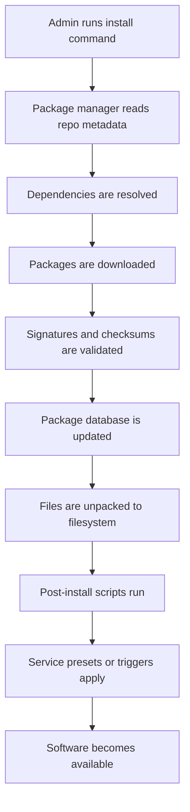
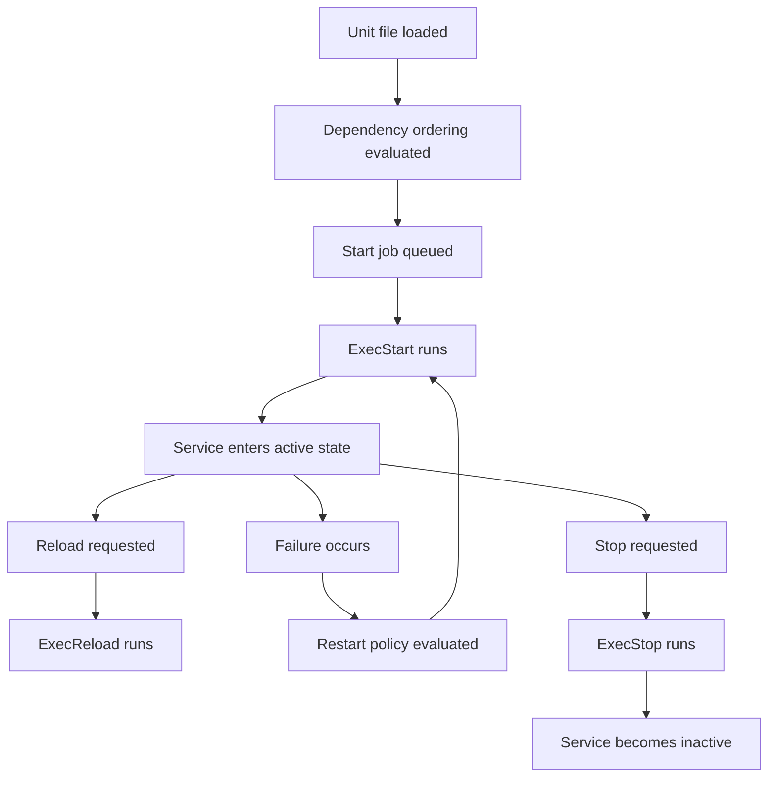
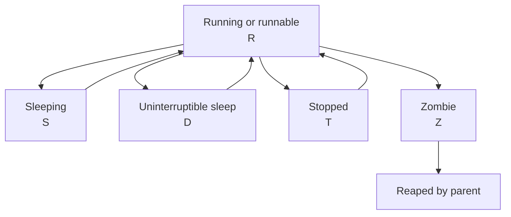
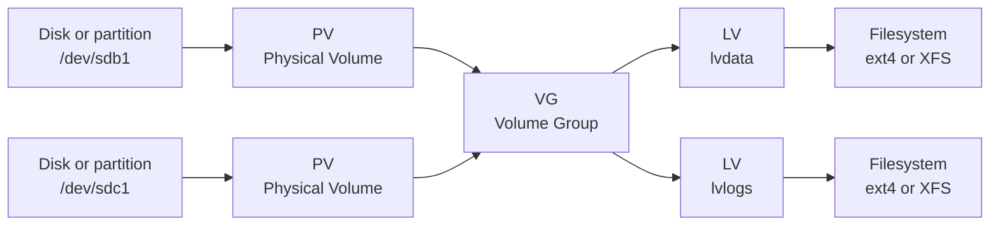
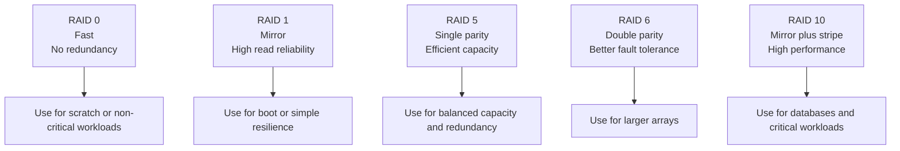
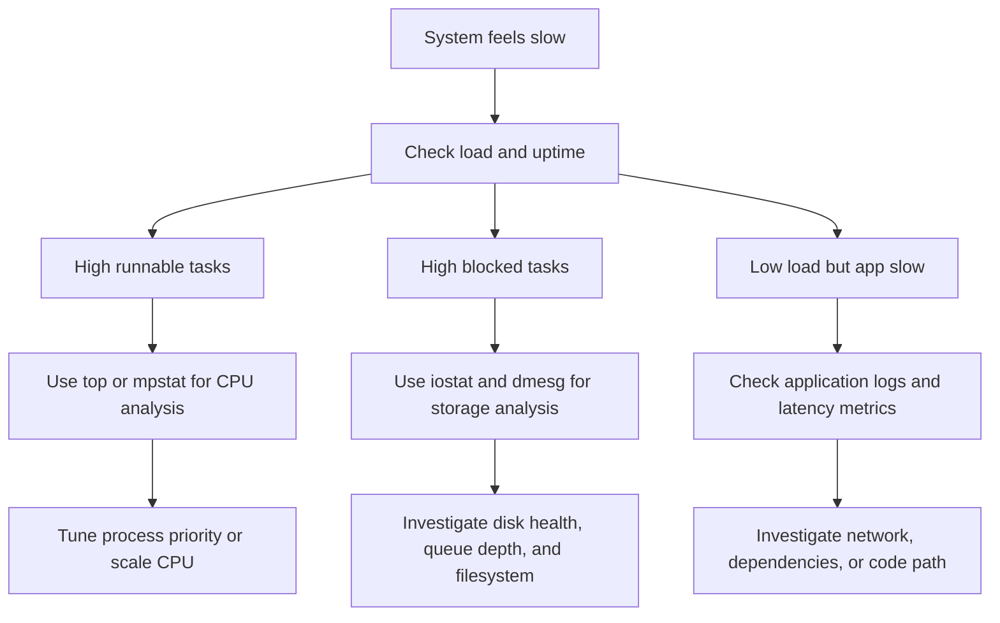

# Linux System Administration Guide

A production-oriented reference that moves from basic Linux administration tasks to advanced operational topics.

This guide is designed for:
- New Linux administrators building foundational skills.
- Developers who need reliable day-to-day operational knowledge.
- Senior administrators who want a compact but broad field reference.
- Engineers preparing for on-call, interviews, or platform responsibilities.

Assumptions:
- You are comfortable with the shell.
- You have `sudo` access when required.
- Commands are shown for common distributions, but package names may vary.
- Always test changes in a non-production environment before rolling them out broadly.

---

## Table of Contents

1. [Package Management](#1-package-management)
2. [Service Management with systemd](#2-service-management-with-systemd)
3. [Process Management](#3-process-management)
4. [Disk and Storage Management](#4-disk-and-storage-management)
5. [File Systems](#5-file-systems)
6. [Log Management](#6-log-management)
7. [Scheduled Tasks](#7-scheduled-tasks)
8. [System Monitoring](#8-system-monitoring)
9. [Backup and Recovery](#9-backup-and-recovery)
10. [Kernel Management](#10-kernel-management)
11. [System Hardening](#11-system-hardening)
12. [Operational Checklists](#12-operational-checklists)
13. [Appendix: Common Commands Reference](#13-appendix-common-commands-reference)

---

# 1. Package Management

Package management is the process of installing, updating, verifying, and removing software in a controlled and reproducible way.

A good administrator understands:
- Which package manager is native to the distribution.
- The difference between high-level and low-level package tools.
- How dependencies are resolved.
- How to verify package integrity.
- How to query package ownership for files.
- How to work with repositories safely.

## 1.1 Package manager families

The Linux ecosystem commonly uses these package management stacks:
- Debian and Ubuntu: `apt` and `dpkg`.
- RHEL, Rocky, AlmaLinux, Fedora, CentOS Stream: `dnf` or `yum` with `rpm`.
- Arch Linux: `pacman`.
- openSUSE and SUSE Linux Enterprise: `zypper`.
- Universal or cross-distribution formats: `snap`, `flatpak`, and AppImage.

## 1.2 Comparison table

| Distribution family | High-level tool | Low-level tool | Package format | Dependency resolution | Typical repo config |
|---|---|---|---|---|---|
| Debian / Ubuntu | `apt` | `dpkg` | `.deb` | Yes | `/etc/apt/sources.list`, `/etc/apt/sources.list.d/` |
| RHEL / Fedora | `dnf` or `yum` | `rpm` | `.rpm` | Yes | `/etc/yum.repos.d/` |
| Arch | `pacman` | `pacman` | `.pkg.tar.zst` | Yes | `/etc/pacman.conf` |
| SUSE | `zypper` | `rpm` | `.rpm` | Yes | `/etc/zypp/repos.d/` |
| Snap | `snap` | managed internally | `.snap` | Yes | Snap store or brand store |
| Flatpak | `flatpak` | managed internally | Flatpak bundle/runtime | Yes | Remotes like Flathub |
| AppImage | direct execution | none | `.AppImage` | Bundled by app | No central repo required |

## 1.3 Package installation flow



## 1.4 Debian and Ubuntu: apt and dpkg

### 1.4.1 apt basics

`apt` is the high-level package management interface for Debian-derived systems.

Common commands:

```bash
sudo apt update
sudo apt install nginx
sudo apt remove nginx
sudo apt purge nginx
sudo apt autoremove
sudo apt full-upgrade
sudo apt search rsync
apt show openssh-server
```

Key ideas:
- `apt update` refreshes repository metadata.
- `apt install` installs packages and required dependencies.
- `apt remove` removes the package but usually keeps config files.
- `apt purge` removes package files and package-managed configuration files.
- `apt autoremove` cleans unused dependencies.
- `apt full-upgrade` can add or remove packages as needed to complete a full upgrade.

Practical workflow:

```bash
sudo apt update && sudo apt full-upgrade -y
sudo apt install -y curl vim git htop
```

Useful query examples:

```bash
apt list --installed
apt list --upgradable
apt-cache policy openssl
apt-cache depends docker.io
apt-cache rdepends systemd
```

### 1.4.2 dpkg basics

`dpkg` works at the local package level and does not resolve dependencies automatically.

Useful commands:

```bash
sudo dpkg -i package.deb
sudo dpkg -r package-name
sudo dpkg -P package-name
dpkg -l
dpkg -L bash
dpkg -S /bin/ls
dpkg -s openssh-client
```

When to use `dpkg`:
- Installing a local `.deb` file.
- Querying which package owns a file.
- Listing files installed by a package.
- Inspecting package metadata.

Dependency fix after manual install:

```bash
sudo dpkg -i custom-package.deb || sudo apt -f install
```

### 1.4.3 APT repository management

Repository definitions are typically stored in:
- `/etc/apt/sources.list`
- `/etc/apt/sources.list.d/*.list`
- `/etc/apt/sources.list.d/*.sources`

Best practices:
- Prefer vendor-provided repositories.
- Avoid mixing incompatible releases.
- Use signed repositories only.
- Document any non-default repository added to production systems.

Example source entry:

```text
deb http://archive.ubuntu.com/ubuntu jammy main universe multiverse restricted
```

Repository maintenance commands:

```bash
sudo add-apt-repository ppa:some/ppa
sudo apt update
```

GPG trust matters.
Do not blindly import keys from untrusted sources.

### 1.4.4 Package troubleshooting on Debian-based systems

Common fixes:

```bash
sudo apt --fix-broken install
sudo dpkg --configure -a
sudo apt clean
sudo apt autoclean
sudo apt update --fix-missing
```

Check lock issues carefully.
Another package manager process may already be running.

Verify package contents:

```bash
debsums -s
```

Verify service impact after upgrades:

```bash
sudo needrestart
```

## 1.5 RHEL, Fedora, Rocky, AlmaLinux: dnf, yum, rpm

### 1.5.1 dnf basics

`dnf` is the modern package manager for Fedora and current RHEL-family systems.
Older systems may still use `yum` commands, many of which map to `dnf`.

Common commands:

```bash
sudo dnf check-update
sudo dnf install nginx
sudo dnf remove nginx
sudo dnf upgrade
sudo dnf search rsync
dnf info openssh-server
sudo dnf group list
sudo dnf groupinstall "Development Tools"
```

Useful admin tasks:

```bash
sudo dnf repolist
sudo dnf module list
sudo dnf module enable nodejs:18
sudo dnf module install nodejs:18/common
```

Important concepts:
- Repositories are defined under `/etc/yum.repos.d/`.
- Metadata can be cached locally.
- Modular content may affect what versions are installable.

### 1.5.2 yum compatibility

On older enterprise Linux systems you may still see:

```bash
sudo yum install httpd
sudo yum update
sudo yum remove httpd
```

When working in legacy estates:
- Confirm the OS release.
- Confirm whether `yum` is a wrapper to `dnf`.
- Be mindful of subscription and repository entitlements.

### 1.5.3 rpm basics

`rpm` is the low-level package tool used by RPM-based systems.
It can query and install local packages, but dependency resolution is limited compared with `dnf`.

Common commands:

```bash
sudo rpm -ivh package.rpm
sudo rpm -Uvh package.rpm
sudo rpm -e package-name
rpm -qa
rpm -qi bash
rpm -ql bash
rpm -qf /usr/bin/ssh
rpm -V bash
```

Meaning of selected flags:
- `-i` installs a package.
- `-U` upgrades or installs.
- `-v` is verbose output.
- `-h` shows progress hashes.
- `-V` verifies installed files against RPM database metadata.

### 1.5.4 Repository management on RPM systems

Repository files are commonly stored in `/etc/yum.repos.d/`.

Example repo file snippet:

```ini
[example-repo]
name=Example Repository
baseurl=https://repo.example.com/rpm/$releasever/$basearch
enabled=1
gpgcheck=1
gpgkey=https://repo.example.com/RPM-GPG-KEY-example
```

Repository inspection:

```bash
dnf repolist all
dnf config-manager --set-enabled crb
dnf clean all
```

### 1.5.5 Troubleshooting RPM-based package issues

Useful commands:

```bash
sudo dnf clean all
sudo dnf makecache
sudo rpm --rebuilddb
sudo dnf distro-sync
```

If a package version mismatch occurs:
- Check enabled repositories.
- Check module streams.
- Check exclusions in config files.
- Check subscription status on enterprise systems.

## 1.6 Arch Linux: pacman

`pacman` is both the package manager and the package database interface for Arch Linux.

Common commands:

```bash
sudo pacman -Syu
sudo pacman -S nginx
sudo pacman -R nginx
sudo pacman -Rns nginx
pacman -Ss rsync
pacman -Qi bash
pacman -Ql bash
pacman -Qo /usr/bin/ls
```

Important flags:
- `-S` sync and install.
- `-Sy` refresh databases.
- `-Syu` refresh and fully upgrade.
- `-R` remove.
- `-Rns` remove package, dependencies, and config-like leftovers when applicable.
- `-Q` query installed packages.

Cache management:

```bash
sudo pacman -Sc
sudo pacman -Scc
```

Package files can be installed locally:

```bash
sudo pacman -U some-package.pkg.tar.zst
```

Notes for production-like use:
- Arch is fast-moving.
- Read upgrade notices before large updates.
- Avoid partial upgrades.
- Keep backup and rollback plans for critical systems.

## 1.7 SUSE and openSUSE: zypper

`zypper` is the package manager for SUSE family systems.

Common commands:

```bash
sudo zypper refresh
sudo zypper update
sudo zypper install nginx
sudo zypper remove nginx
zypper search rsync
zypper info openssh
zypper repos
```

Repository management:

```bash
sudo zypper ar https://download.example.com/repo example-repo
sudo zypper rr example-repo
sudo zypper mr -e example-repo
```

Patch management:

```bash
sudo zypper patch
sudo zypper list-patches
```

`zypper` is strong in enterprise maintenance workflows and clear repository handling.

## 1.8 Snap

Snap packages are self-contained and managed by the `snapd` service.

Commands:

```bash
snap list
sudo snap install hello-world
sudo snap refresh
sudo snap remove hello-world
snap info code
```

Characteristics:
- Sandboxed by design.
- Automatic updates by default.
- Good for desktop apps and some server tools.
- Can feel slower at startup in some cases.
- Uses mounted squashfs packages under `/snap`.

Operational considerations:
- Confirm whether your environment allows automatic updates.
- Understand confinement mode.
- Monitor disk use from multiple revisions.

## 1.9 Flatpak

Flatpak is common on desktops and developer workstations.

Commands:

```bash
flatpak remotes
flatpak search org.gimp.GIMP
flatpak install flathub org.gimp.GIMP
flatpak run org.gimp.GIMP
flatpak update
flatpak uninstall org.gimp.GIMP
```

Characteristics:
- Uses runtimes shared across applications.
- Better suited to desktop software than classic servers.
- Strong isolation model.

Admin notes:
- Per-user vs system-wide installations matter.
- Remote trust and policy should be documented.

## 1.10 AppImage

AppImage is not a package manager.
It is a portable executable application image.

Usage:

```bash
chmod +x SomeApp.AppImage
./SomeApp.AppImage
```

Operational trade-offs:
- Easy to distribute.
- No dependency resolution in the OS package database.
- Harder to inventory centrally.
- Harder to patch at scale.

Use AppImage when portability matters more than centralized management.

## 1.11 Package verification and file ownership

Find which package owns a file:

Debian-based:

```bash
dpkg -S /usr/bin/ssh
```

RPM-based:

```bash
rpm -qf /usr/bin/ssh
```

Arch:

```bash
pacman -Qo /usr/bin/ssh
```

List package files:

Debian-based:

```bash
dpkg -L openssh-client
```

RPM-based:

```bash
rpm -ql openssh-clients
```

Arch:

```bash
pacman -Ql openssh
```

## 1.12 Package management best practices

- Always refresh metadata before major installs.
- Prefer OS-native packages for core services.
- Avoid manually compiling into `/usr` when a package exists.
- Pin or hold packages only with documented justification.
- Mirror or cache repositories in controlled environments.
- Verify signatures.
- Record repository changes in configuration management.
- Test updates before applying to all nodes.
- Monitor post-upgrade service health.
- Keep package inventories for audits.

## 1.13 Safe package maintenance workflow

1. Identify the system distribution and version.
2. Refresh metadata.
3. Review pending updates.
4. Check changelogs for critical packages.
5. Snapshot or back up if the system is important.
6. Apply updates in a maintenance window if required.
7. Restart services only when needed and understood.
8. Validate the application.
9. Document the change.

## 1.14 Example package manager decision guide

Use native repositories when:
- You need predictable patching.
- You need compliance and inventory.
- You want integration with OS dependency management.

Use Snap or Flatpak when:
- Desktop app isolation matters.
- The application is not available in native repos.
- Independent app delivery cadence is beneficial.

Use AppImage when:
- You need single-file portability.
- You accept weaker central management.

---

# 2. Service Management with systemd

`systemd` is the standard init and service manager on most modern Linux distributions.
It is responsible for:
- Boot sequencing.
- Service supervision.
- Logging integration through `journald`.
- Timers.
- Sockets.
- Targets.
- Resource control and dependency ordering.

## 2.1 Core concepts

Important unit types:
- `service`
- `socket`
- `target`
- `mount`
- `automount`
- `timer`
- `path`
- `device`
- `slice`
- `scope`

A unit is a systemd object represented by a configuration file.

Common locations:
- `/usr/lib/systemd/system/`
- `/lib/systemd/system/`
- `/etc/systemd/system/`
- `/run/systemd/system/`

Precedence matters.
Administrator overrides under `/etc/systemd/system/` take priority over vendor defaults.

## 2.2 systemctl essentials

View service state:

```bash
systemctl status sshd
systemctl status nginx
```

Start and stop services:

```bash
sudo systemctl start nginx
sudo systemctl stop nginx
sudo systemctl restart nginx
sudo systemctl reload nginx
```

Enable or disable services at boot:

```bash
sudo systemctl enable nginx
sudo systemctl disable nginx
sudo systemctl is-enabled nginx
```

Mask or unmask services:

```bash
sudo systemctl mask telnet.socket
sudo systemctl unmask telnet.socket
```

List units:

```bash
systemctl list-units --type=service
systemctl list-unit-files --type=service
```

Check failures:

```bash
systemctl --failed
```

## 2.3 systemd unit lifecycle



## 2.4 Understanding service states

Common states:
- `active (running)` means the service is running.
- `active (exited)` often means a one-shot task completed successfully.
- `inactive` means not running.
- `failed` means startup or runtime failure tracked by systemd.
- `activating` means startup is in progress.
- `deactivating` means shutdown is in progress.

Useful checks:

```bash
systemctl is-active nginx
systemctl is-failed nginx
```

## 2.5 journalctl basics

`journalctl` queries the systemd journal.

Common usage:

```bash
journalctl
journalctl -u nginx
journalctl -u sshd -b
journalctl -xe
journalctl --since "2024-01-01 10:00:00"
journalctl --since yesterday
journalctl -p err..alert
journalctl -f
```

Helpful flags:
- `-u` filters by unit.
- `-b` limits to the current boot.
- `-p` filters by priority.
- `-f` follows live logs.
- `-xe` shows explanatory context.

Persistent journals may require configuration.
Check `/etc/systemd/journald.conf`.

## 2.6 Targets

Targets replace many historical runlevel use cases.

Examples:
- `multi-user.target`
- `graphical.target`
- `rescue.target`
- `emergency.target`
- `network-online.target`

Inspect default target:

```bash
systemctl get-default
```

Set default target:

```bash
sudo systemctl set-default multi-user.target
```

Switch targets immediately:

```bash
sudo systemctl isolate rescue.target
```

Use caution with `isolate` on remote systems.
You can lock yourself out.

## 2.7 Custom service unit file creation

A common sysadmin task is deploying a custom service.

Example Python web service unit:

```ini
[Unit]
Description=Example Python API
After=network.target
Wants=network-online.target

[Service]
Type=simple
User=appuser
Group=appuser
WorkingDirectory=/opt/example-api
Environment=PORT=8080
ExecStart=/usr/bin/python3 /opt/example-api/app.py
Restart=on-failure
RestartSec=5
NoNewPrivileges=yes
PrivateTmp=yes
ProtectSystem=full
ProtectHome=yes

[Install]
WantedBy=multi-user.target
```

Save as:

```text
/etc/systemd/system/example-api.service
```

Then run:

```bash
sudo systemctl daemon-reload
sudo systemctl enable --now example-api.service
systemctl status example-api.service
journalctl -u example-api.service -f
```

Key directives explained:
- `Description` documents the unit.
- `After` controls ordering.
- `Wants` expresses a weaker dependency.
- `User` and `Group` avoid running as root unnecessarily.
- `WorkingDirectory` sets the service working path.
- `Environment` injects environment variables.
- `ExecStart` defines the main process.
- `Restart` specifies recovery behavior.
- `NoNewPrivileges`, `PrivateTmp`, `ProtectSystem`, and `ProtectHome` add hardening.
- `WantedBy` determines how enabling creates symlinks.

## 2.8 Unit file inspection and overrides

Show vendor unit content:

```bash
systemctl cat sshd.service
```

Show full property list:

```bash
systemctl show nginx
```

Create an override without editing vendor files directly:

```bash
sudo systemctl edit nginx
```

Example override:

```ini
[Service]
LimitNOFILE=65535
Environment=APP_ENV=production
```

This creates a drop-in under:

```text
/etc/systemd/system/nginx.service.d/override.conf
```

Best practice:
- Never edit packaged unit files in `/usr/lib/systemd/system/` unless you fully manage the consequence.
- Use drop-ins for upgrades to remain clean.

## 2.9 Timers

Systemd timers are a modern alternative to cron for many recurring tasks.

Example timer pair.

Service file:

```ini
[Unit]
Description=Run backup script

[Service]
Type=oneshot
ExecStart=/usr/local/bin/backup.sh
```

Timer file:

```ini
[Unit]
Description=Daily backup timer

[Timer]
OnCalendar=daily
Persistent=true
RandomizedDelaySec=300

[Install]
WantedBy=timers.target
```

Commands:

```bash
sudo systemctl daemon-reload
sudo systemctl enable --now backup.timer
systemctl list-timers
```

Why timers can be better than cron:
- Strong integration with logs.
- Native dependency handling.
- Missed runs can be caught up with `Persistent=true`.
- Clear status via `systemctl`.

## 2.10 Socket activation

Socket activation means systemd listens on a socket and starts the service when traffic arrives.

Benefits:
- Faster boot.
- Delayed resource usage.
- Better service startup orchestration.

Common examples:
- `sshd.socket` on some systems.
- On-demand internal daemons.

Check socket units:

```bash
systemctl list-units --type=socket
```

## 2.11 systemd-analyze

`systemd-analyze` helps diagnose boot performance and unit timing.

Useful commands:

```bash
systemd-analyze
systemd-analyze blame
systemd-analyze critical-chain
systemd-analyze verify /etc/systemd/system/example-api.service
```

Use cases:
- Finding slow boot services.
- Validating unit file syntax.
- Understanding dependency impact.

## 2.12 Troubleshooting systemd services

Checklist:
- Check `systemctl status <unit>`.
- Check `journalctl -u <unit>`.
- Verify executable path exists.
- Verify permissions.
- Verify environment variables.
- Verify port conflicts.
- Verify the service works manually outside systemd.
- Verify SELinux or AppArmor policy if enforced.
- Check restart loops.

Common problems:
- Wrong `ExecStart` path.
- Running as wrong user.
- Missing working directory.
- PID file mismatch for legacy forking daemons.
- Timeout waiting for a daemonized process.
- Dependencies ordered incorrectly.

## 2.13 Service management best practices

- Use least privilege.
- Prefer one process per service unit unless intentionally supervised otherwise.
- Use `Restart=on-failure` for resilient stateless services.
- Use environment files for configurable values.
- Keep vendor units untouched.
- Log to stdout and stderr where possible.
- Add hardening directives for custom services.
- Monitor failed units.
- Test service behavior after upgrades.
- Version control unit files if you manage them as code.

---

# 3. Process Management

A process is an executing instance of a program.
Good process management helps you understand performance, stability, and safety on a Linux host.

## 3.1 Process identifiers and hierarchy

Every process has:
- PID: process ID.
- PPID: parent process ID.
- UID and GID context.
- Scheduling priority.
- State.
- Open files and memory mappings.

The kernel maintains a process tree.
View it with:

```bash
ps -ef --forest
pstree -p
```

## 3.2 ps usage

`ps` is the standard process listing tool.

Common patterns:

```bash
ps aux
ps -ef
ps -eo pid,ppid,user,%cpu,%mem,stat,cmd --sort=-%cpu | head
ps -C nginx -o pid,cmd
```

Field meanings:
- `%CPU` is CPU usage.
- `%MEM` is memory usage percentage.
- `STAT` is process state and flags.
- `CMD` is the full command.

Useful filters:

```bash
ps -u www-data
ps -p 1234 -o pid,ppid,stat,etime,cmd
```

## 3.3 top and htop

`top` shows dynamic process activity.

Launch:

```bash
top
```

Common `top` keys:
- `P` sort by CPU.
- `M` sort by memory.
- `k` kill a process.
- `r` renice a process.
- `1` show per-CPU view.
- `H` show threads.

`htop` provides a friendlier UI.

```bash
htop
```

Advantages of `htop`:
- Better navigation.
- Easier filtering.
- Tree display.
- Colorized metrics.

## 3.4 Signals and termination

Processes are controlled using signals.

Common commands:

```bash
kill -TERM 1234
kill -KILL 1234
kill -HUP 1234
pkill nginx
pkill -f gunicorn
killall ssh-agent
```

Common signals:
- `SIGTERM` asks a process to stop gracefully.
- `SIGKILL` forcibly terminates the process.
- `SIGHUP` often reloads configuration.
- `SIGINT` interrupts the process.
- `SIGSTOP` pauses execution.
- `SIGCONT` resumes execution.

Best practice:
- Try `SIGTERM` first.
- Use `SIGKILL` only when the process is hung or cannot be terminated gracefully.

## 3.5 pkill and killall caveats

`pkill` and `killall` are convenient but can be dangerous.

Safer patterns:

```bash
pgrep -a nginx
pkill -TERM -x nginx
pgrep -f myscript.py
pkill -TERM -f "/opt/app/bin/server"
```

Always preview the target when possible.
Name matching can catch more processes than you expect.

## 3.6 Background and job control

In an interactive shell you can manage jobs with:
- `&`
- `jobs`
- `bg`
- `fg`
- `nohup`

Examples:

```bash
long-running-command &
jobs
fg %1
bg %1
nohup ./backup.sh > backup.log 2>&1 &
```

Use job control only for short-lived admin work.
For persistent services, use systemd.

## 3.7 nice and renice

Scheduling niceness affects CPU priority for normal processes.

Start with a lower priority:

```bash
nice -n 10 tar -czf backup.tar.gz /srv/data
```

Change an existing process priority:

```bash
sudo renice 5 -p 1234
```

Interpretation:
- Lower nice value means higher priority.
- Higher nice value means lower priority.
- Range is typically `-20` to `19`.

Real-time scheduling is different and more advanced.
Use carefully.

## 3.8 /proc filesystem overview

`/proc` exposes kernel and process information.
It is a virtual filesystem.

Useful paths:
- `/proc/cpuinfo`
- `/proc/meminfo`
- `/proc/loadavg`
- `/proc/uptime`
- `/proc/partitions`
- `/proc/<PID>/status`
- `/proc/<PID>/cmdline`
- `/proc/<PID>/environ`
- `/proc/<PID>/fd/`
- `/proc/<PID>/maps`

Examples:

```bash
cat /proc/meminfo
cat /proc/loadavg
cat /proc/1234/status
ls -l /proc/1234/fd
tr '\0' ' ' < /proc/1234/cmdline
```

## 3.9 Process states



Common state letters in `ps`:
- `R` running or runnable.
- `S` interruptible sleep.
- `D` uninterruptible sleep, often I/O wait.
- `T` stopped or traced.
- `Z` zombie.
- `I` idle kernel thread on some systems.

A zombie is already dead but not yet reaped by its parent.
The fix is usually at the parent process level.

## 3.10 Finding resource-heavy processes

Top CPU processes:

```bash
ps -eo pid,user,%cpu,%mem,cmd --sort=-%cpu | head -20
```

Top memory processes:

```bash
ps -eo pid,user,%mem,rss,cmd --sort=-%mem | head -20
```

Open files by process:

```bash
lsof -p 1234
```

Processes listening on ports:

```bash
ss -tulpn
lsof -i :80
```

## 3.11 cgroups and process resource control

On systemd-based systems, services are typically placed into cgroups automatically.
This allows grouping and accounting of resources.

Useful commands:

```bash
systemd-cgls
systemd-cgtop
```

Benefits:
- Better service-level resource visibility.
- CPU, memory, and I/O limits.
- Stronger isolation.

## 3.12 Troubleshooting stuck processes

If a process does not respond:
1. Check state with `ps`.
2. Check what it is waiting on.
3. Check open files and sockets.
4. Check related logs.
5. Send `SIGTERM` first.
6. Use `SIGKILL` only if necessary.

Helpful tools:

```bash
strace -p 1234
lsof -p 1234
cat /proc/1234/stack
```

A process stuck in `D` state often indicates deeper I/O or kernel issues.
Killing it may not work until the kernel wait condition clears.

## 3.13 Practical examples

Restart a runaway process managed by systemd:

```bash
systemctl status myapp
journalctl -u myapp --since -10m
sudo systemctl restart myapp
```

Reduce CPU impact of a batch job:

```bash
nice -n 15 ionice -c2 -n7 rsync -a /data/ /backup/
```

Inspect a suspected memory leak:

```bash
ps -p 4321 -o pid,%mem,rss,vsz,etime,cmd
cat /proc/4321/status
lsof -p 4321 | wc -l
```

## 3.14 Process management best practices

- Prefer service supervisors over ad hoc background processes.
- Capture logs in a predictable place.
- Understand the signal model of major daemons.
- Audit processes listening on ports.
- Avoid force-killing unless justified.
- Monitor for zombies and repeated crashes.
- Use resource priorities on backup and batch workloads.
- Learn `/proc` and `lsof` for quick diagnostics.

---

# 4. Disk and Storage Management

Disk administration includes partitioning, identifying block devices, mounting file systems, managing logical volumes, and handling RAID.

## 4.1 Storage stack overview

Common layers:
- Physical disk or virtual disk.
- Partition table.
- Partition.
- RAID or encryption layer if used.
- LVM physical volume.
- Volume group.
- Logical volume.
- File system.
- Mount point.

Understanding the stack is critical before resizing or recovering storage.

## 4.2 Device discovery tools

Useful commands:

```bash
lsblk
lsblk -f
blkid
fdisk -l
parted -l
cat /proc/partitions
```

What they show:
- `lsblk` shows block device hierarchy.
- `lsblk -f` shows file system and UUID data.
- `blkid` prints UUIDs and labels.
- `fdisk -l` lists partition tables.
- `parted -l` lists disks and labels.

Identify devices carefully.
On modern systems names may be:
- `/dev/sda`
- `/dev/vda`
- `/dev/nvme0n1`
- `/dev/mapper/vg-lv`

## 4.3 Partitioning tools

### 4.3.1 fdisk

Use `fdisk` for MBR and basic GPT tasks.

Example:

```bash
sudo fdisk /dev/sdb
```

Interactive actions commonly used:
- `p` print partition table.
- `n` new partition.
- `d` delete partition.
- `t` change partition type.
- `w` write changes.
- `q` quit without saving.

### 4.3.2 gdisk

Use `gdisk` for GPT-focused management.

```bash
sudo gdisk /dev/sdb
```

Useful on large disks and UEFI-oriented systems.

### 4.3.3 parted

`parted` is convenient for scripting and large disk work.

Example:

```bash
sudo parted /dev/sdb --script mklabel gpt
sudo parted /dev/sdb --script mkpart primary ext4 1MiB 100%
```

Best practices:
- Align partitions properly.
- Document partition purpose.
- Re-read partition table after changes when needed.

## 4.4 Mounting and unmounting

Mount a file system:

```bash
sudo mount /dev/sdb1 /mnt/data
```

Unmount a file system:

```bash
sudo umount /mnt/data
sudo umount /dev/sdb1
```

Check mounts:

```bash
mount
findmnt
findmnt /mnt/data
```

Common causes of unmount failure:
- Open files.
- Current directory inside mount point.
- Active process using the filesystem.

Find blockers:

```bash
lsof +f -- /mnt/data
fuser -vm /mnt/data
```

## 4.5 /etc/fstab

`/etc/fstab` defines persistent mounts.

Example:

```fstab
UUID=1234-ABCD /data ext4 defaults,noatime 0 2
UUID=5678-EFGH /boot/efi vfat umask=0077 0 1
/dev/mapper/vgdata-lvbackup /backup xfs defaults 0 0
```

Field meanings:
1. Device, UUID, LABEL, or path.
2. Mount point.
3. File system type.
4. Mount options.
5. Dump field.
6. fsck order.

Test before reboot:

```bash
sudo mount -a
```

Use UUIDs rather than raw device names when possible.

## 4.6 Disk usage tools

Check free space:

```bash
df -h
df -i
```

Check directory usage:

```bash
du -sh /var/log
du -xh --max-depth=1 / | sort -h
```

Interpretation:
- `df` shows filesystem-level usage.
- `du` shows file and directory-level usage.
- `df -i` shows inode exhaustion, which can fill a filesystem even if bytes remain.

## 4.7 LVM concepts

LVM stands for Logical Volume Manager.
It abstracts storage into flexible layers.

Layers:
- PV: physical volume.
- VG: volume group.
- LV: logical volume.

Benefits:
- Easier resizing.
- Snapshots.
- Flexible allocation across disks.
- Better storage abstraction.

## 4.8 LVM architecture



## 4.9 Creating LVM storage

Create physical volumes:

```bash
sudo pvcreate /dev/sdb1 /dev/sdc1
```

Create a volume group:

```bash
sudo vgcreate vgdata /dev/sdb1 /dev/sdc1
```

Create a logical volume:

```bash
sudo lvcreate -L 100G -n lvdata vgdata
```

Create a filesystem:

```bash
sudo mkfs.xfs /dev/vgdata/lvdata
```

Mount it:

```bash
sudo mkdir -p /data
sudo mount /dev/vgdata/lvdata /data
```

Persist it using `/etc/fstab`.

## 4.10 LVM inspection commands

```bash
pvs
vgs
lvs
pvdisplay
vgdisplay
lvdisplay
lsblk
```

These commands show size, free extents, attributes, and layout details.

## 4.11 Extending LVM volumes

Extend the logical volume:

```bash
sudo lvextend -L +50G /dev/vgdata/lvdata
```

For ext4, grow filesystem:

```bash
sudo resize2fs /dev/vgdata/lvdata
```

For XFS, grow while mounted:

```bash
sudo xfs_growfs /data
```

One-step example with ext4:

```bash
sudo lvextend -r -L +50G /dev/vgdata/lvdata
```

`-r` attempts to resize the filesystem automatically.

## 4.12 Reducing LVM volumes

Reducing storage is riskier than extending it.

Rules:
- Back up first.
- Shrink the filesystem first if supported.
- XFS cannot be shrunk.
- Confirm current usage before reducing.

Example for ext4 only:

```bash
sudo umount /data
sudo e2fsck -f /dev/vgdata/lvdata
sudo resize2fs /dev/vgdata/lvdata 80G
sudo lvreduce -L 80G /dev/vgdata/lvdata
sudo mount /data
```

Never reduce XFS.
Migrate data instead.

## 4.13 LVM snapshots

Snapshots capture a point-in-time state for backup or maintenance.

Example:

```bash
sudo lvcreate -L 10G -s -n lvdata_snap /dev/vgdata/lvdata
```

Mount snapshot read-only for backup:

```bash
sudo mount -o ro /dev/vgdata/lvdata_snap /mnt/snap
```

Remove snapshot when done:

```bash
sudo umount /mnt/snap
sudo lvremove /dev/vgdata/lvdata_snap
```

Monitor snapshot space.
If it fills, the snapshot becomes invalid.

## 4.14 RAID basics with mdadm

Software RAID can be managed using `mdadm`.

Common RAID levels:
- RAID 0: striping, no redundancy.
- RAID 1: mirroring.
- RAID 5: striping with single parity.
- RAID 6: striping with double parity.
- RAID 10: mirrored stripes.

## 4.15 RAID levels comparison



### 4.15.1 Create a RAID 1 array

Example:

```bash
sudo mdadm --create /dev/md0 --level=1 --raid-devices=2 /dev/sdb1 /dev/sdc1
```

Create filesystem:

```bash
sudo mkfs.ext4 /dev/md0
```

Watch sync status:

```bash
cat /proc/mdstat
```

Array detail:

```bash
sudo mdadm --detail /dev/md0
```

Persist mdadm config on supported distributions:

```bash
sudo mdadm --detail --scan | sudo tee -a /etc/mdadm/mdadm.conf
```

## 4.16 Swap management

Check swap:

```bash
swapon --show
free -h
```

Create a swap file:

```bash
sudo fallocate -l 4G /swapfile
sudo chmod 600 /swapfile
sudo mkswap /swapfile
sudo swapon /swapfile
```

Persist in `/etc/fstab`:

```fstab
/swapfile none swap sw 0 0
```

Adjust swappiness temporarily:

```bash
sudo sysctl vm.swappiness=10
```

## 4.17 Storage troubleshooting

Common problems:
- Filesystem full.
- Inodes exhausted.
- Wrong UUID in `fstab`.
- Array degraded.
- Snapshot full.
- Rescan needed after hypervisor disk growth.
- Multipath or SAN issues.

Useful commands:

```bash
lsblk -f
blkid
df -h
df -i
pvs
vgs
lvs
cat /proc/mdstat
journalctl -b | grep -i -E "mount|xfs|ext4|md|lvm"
```

## 4.18 Safe storage change workflow

1. Identify the exact device.
2. Confirm backups or snapshots exist.
3. Confirm the current mount and filesystem.
4. Confirm application impact.
5. Apply the change.
6. Validate with `lsblk`, `df`, and test I/O.
7. Persist in `fstab` or array config if needed.
8. Document it.

---

# 5. File Systems

Choosing the right filesystem matters for reliability, performance, scalability, and feature set.

## 5.1 Common filesystem options

This guide focuses on:
- ext4
- XFS
- Btrfs
- ZFS
- tmpfs
- swap

## 5.2 ext4

`ext4` is a mature, general-purpose Linux filesystem.

Strengths:
- Stable and widely supported.
- Good for root filesystems and general workloads.
- Supports resizing.
- Familiar recovery tools.

Common use cases:
- Small to medium servers.
- General-purpose VMs.
- Boot partitions.
- Conservative production setups.

Create ext4 filesystem:

```bash
sudo mkfs.ext4 /dev/sdb1
```

Label it:

```bash
sudo e2label /dev/sdb1 DATA
```

Check filesystem:

```bash
sudo fsck.ext4 -f /dev/sdb1
```

Tune ext4:

```bash
sudo tune2fs -l /dev/sdb1
sudo tune2fs -m 1 /dev/sdb1
sudo tune2fs -c 30 /dev/sdb1
```

Notes:
- Reserved blocks can be useful on system volumes.
- `tune2fs` is powerful and should be used carefully.

## 5.3 XFS

`XFS` is a high-performance filesystem widely used in enterprise Linux.

Strengths:
- Excellent for large files and large filesystems.
- Strong metadata handling.
- Default on many RHEL-family installations.
- Online growth supported.

Limitations:
- Cannot shrink.
- Plan capacity carefully.

Create XFS:

```bash
sudo mkfs.xfs /dev/sdb1
```

Grow XFS:

```bash
sudo xfs_growfs /mountpoint
```

Repair XFS:

```bash
sudo xfs_repair /dev/sdb1
```

Common use cases:
- Database logs.
- Media or analytics data.
- Large LVM-backed volumes.
- Enterprise servers with predictable growth only in the upward direction.

## 5.4 Btrfs

`Btrfs` is a modern copy-on-write filesystem with advanced features.

Features:
- Snapshots.
- Subvolumes.
- Checksums.
- Compression.
- Send and receive replication.
- Integrated multi-device capabilities.

Create Btrfs:

```bash
sudo mkfs.btrfs /dev/sdb1
```

Basic commands:

```bash
sudo btrfs filesystem show
sudo btrfs subvolume list /mnt
sudo btrfs subvolume create /mnt/@data
sudo btrfs filesystem df /mnt
```

When to use:
- Snapshot-heavy systems.
- Workstations.
- Some server environments with admin familiarity.

When to be cautious:
- If your team lacks operational experience.
- If vendor support policy limits filesystem choice.

## 5.5 ZFS

ZFS combines a filesystem and volume manager.
It is feature-rich and highly respected for integrity-focused storage.

Key features:
- End-to-end checksumming.
- Snapshots and clones.
- Compression.
- Copy-on-write design.
- Integrated RAID-like capabilities.
- Scrubbing and strong data integrity features.

Common commands:

```bash
zpool status
zpool list
zfs list
zfs snapshot pool1/data@daily-2024-01-01
zfs rollback pool1/data@daily-2024-01-01
```

When to use:
- Storage servers.
- Backup systems.
- Environments where integrity features are a major advantage.

When to be cautious:
- RAM requirements.
- Operational complexity.
- Distribution support expectations.

## 5.6 tmpfs

`tmpfs` is a memory-backed filesystem.
It can also use swap.

Use cases:
- Temporary files.
- Build caches.
- Runtime directories.
- Shared memory-style workloads.

Mount example:

```bash
sudo mount -t tmpfs -o size=1G tmpfs /mnt/ramdisk
```

`fstab` example:

```fstab
tmpfs /run/mycache tmpfs defaults,size=512M 0 0
```

Be careful not to over-allocate memory-backed mounts.

## 5.7 swap as virtual memory backing

Swap is not a regular filesystem for user data.
It is used by the kernel for memory management.

Use cases:
- Buffer for memory pressure.
- Hibernation on some systems.
- Preventing immediate OOM on transient spikes.

Do not rely on swap to fix undersized systems.
It is a safety margin, not a substitute for RAM.

## 5.8 When to use which filesystem

| Filesystem | Best for | Key strengths | Key cautions |
|---|---|---|---|
| ext4 | General-purpose servers | Stable, mature, easy recovery | Fewer modern features than Btrfs or ZFS |
| XFS | Large filesystems and enterprise workloads | Performance, scale, online growth | Cannot shrink |
| Btrfs | Snapshot and subvolume workflows | Snapshots, compression, send/receive | Requires familiarity |
| ZFS | Integrity-focused storage | Checksums, snapshots, advanced storage features | Operational overhead and support considerations |
| tmpfs | Temporary memory-backed data | Very fast | Consumes RAM and swap |
| swap | Virtual memory | Helps with spikes | Slow compared to RAM |

## 5.9 mkfs overview

Common filesystem creation commands:

```bash
sudo mkfs.ext4 /dev/sdb1
sudo mkfs.xfs /dev/sdb1
sudo mkfs.btrfs /dev/sdb1
sudo mkswap /dev/sdb2
```

Warning:
These commands destroy existing filesystem data on the target.
Always verify the device first.

## 5.10 fsck basics

`fsck` checks and repairs filesystems, usually while unmounted.

Examples:

```bash
sudo fsck -f /dev/sdb1
sudo fsck.ext4 -y /dev/sdb1
```

Notes:
- Do not run generic `fsck` blindly on mounted filesystems unless the specific filesystem and scenario support it.
- XFS uses `xfs_repair` rather than classic `fsck` repair logic.

## 5.11 Tune and maintenance utilities

For ext-family:

```bash
sudo tune2fs -l /dev/sdb1
sudo dumpe2fs -h /dev/sdb1
```

For XFS:

```bash
sudo xfs_info /mountpoint
```

For Btrfs:

```bash
sudo btrfs scrub start /mnt
sudo btrfs filesystem usage /mnt
```

For ZFS:

```bash
sudo zpool scrub pool1
sudo zpool status
```

## 5.12 Mount options matter

Common mount options:
- `defaults`
- `noatime`
- `relatime`
- `nodev`
- `nosuid`
- `noexec`
- `ro`
- `rw`

Examples:

```fstab
UUID=1111-2222 /data ext4 defaults,noatime 0 2
UUID=3333-4444 /tmp ext4 defaults,nodev,nosuid,noexec 0 2
```

Security and performance both depend on mount options.

## 5.13 Filesystem troubleshooting

Symptoms:
- Slow I/O.
- Mount failures.
- Read-only remounts.
- Corruption warnings.
- Full filesystem.
- Metadata errors.

Commands to start with:

```bash
dmesg | tail -50
journalctl -b | tail -100
mount | column -t
findmnt
lsblk -f
df -h
```

If the filesystem remounts read-only:
- Stop writes.
- Collect logs.
- Back up what you can.
- Schedule a proper repair.

## 5.14 Filesystem best practices

- Use ext4 or XFS for predictable server defaults.
- Use UUIDs in `fstab`.
- Keep recovery tools available.
- Understand shrink and grow limitations.
- Separate data, logs, and temp spaces when appropriate.
- Monitor inode use.
- Test snapshot and restore workflows.
- Do not experiment on production without rehearsal.

---

# 6. Log Management

Logs are the primary evidence trail for operations, failures, access, and system behavior.

## 6.1 Why logs matter

Logs help you:
- Diagnose incidents.
- Investigate security events.
- Audit changes and access.
- Understand performance trends.
- Satisfy compliance requirements.

## 6.2 Common log locations under /var/log

Examples:
- `/var/log/messages`
- `/var/log/syslog`
- `/var/log/auth.log`
- `/var/log/secure`
- `/var/log/kern.log`
- `/var/log/dmesg`
- `/var/log/cron`
- `/var/log/nginx/`
- `/var/log/httpd/`
- `/var/log/audit/`
- `/var/log/journal/`

Exact files vary by distribution.

## 6.3 journald

`journald` stores structured logs for systemd-managed systems.

Useful commands:

```bash
journalctl -b
journalctl -u sshd
journalctl -p warning
journalctl --disk-usage
journalctl --vacuum-time=7d
journalctl --vacuum-size=1G
```

Configuration file:

```text
/etc/systemd/journald.conf
```

Important settings:
- `Storage=`
- `SystemMaxUse=`
- `RuntimeMaxUse=`
- `Compress=`
- `ForwardToSyslog=`

Persistent logging is typically enabled by storing journals under `/var/log/journal/`.

## 6.4 syslog and rsyslog

Traditional syslog-based logging is still common.
`rsyslog` is a widely used implementation.

Service names often include:
- `rsyslog.service`
- `syslog-ng.service`

Typical config locations:
- `/etc/rsyslog.conf`
- `/etc/rsyslog.d/*.conf`

Example rule sending auth logs to a dedicated file:

```conf
authpriv.*    /var/log/auth-custom.log
```

Reload after changes:

```bash
sudo systemctl restart rsyslog
```

## 6.5 Classic log viewing tools

Use these tools constantly:

```bash
tail -f /var/log/syslog
tail -100 /var/log/messages
less /var/log/auth.log
grep -i error /var/log/nginx/error.log
awk '/Failed password/ {print}' /var/log/auth.log
```

Use compression-aware tools for rotated logs:

```bash
zgrep -i panic /var/log/messages.*.gz
zless /var/log/syslog.2.gz
```

## 6.6 logrotate

`logrotate` manages log rotation, compression, retention, and post-rotate actions.

Main config locations:
- `/etc/logrotate.conf`
- `/etc/logrotate.d/`

Example configuration:

```conf
/var/log/myapp/*.log {
    daily
    rotate 14
    compress
    missingok
    notifempty
    create 0640 myapp adm
    postrotate
        systemctl reload myapp >/dev/null 2>&1 || true
    endscript
}
```

Test a config:

```bash
sudo logrotate -d /etc/logrotate.conf
sudo logrotate -f /etc/logrotate.conf
```

## 6.7 Centralized logging

Centralized logging is strongly recommended for production.

Benefits:
- Long-term retention.
- Faster incident triage.
- Cross-host correlation.
- Better security monitoring.
- Reduced risk when a host is lost.

Common stacks:
- rsyslog to central syslog server.
- ELK or Elastic Stack.
- Graylog.
- Loki and Grafana.
- Splunk.
- Cloud-native logging platforms.

## 6.8 Logging design principles

- Log in structured formats where possible.
- Synchronize time with NTP.
- Protect logs from unauthorized modification.
- Retain logs based on policy.
- Avoid logging secrets.
- Separate application, access, and audit logs.
- Ensure central forwarding on critical systems.

## 6.9 Common log analysis patterns

Authentication failures:

```bash
grep "Failed password" /var/log/auth.log
journalctl -u sshd | grep "Failed password"
```

Kernel disk errors:

```bash
dmesg | grep -i -E "error|fail|xfs|ext4|nvme|sda"
```

Service crash loops:

```bash
journalctl -u myapp --since -1h
systemctl status myapp
```

OOM kills:

```bash
journalctl -k | grep -i oom
dmesg | grep -i "killed process"
```

## 6.10 Disk usage and retention control

Check journal disk use:

```bash
journalctl --disk-usage
```

Vacuum journal size:

```bash
sudo journalctl --vacuum-size=500M
```

Find large logs:

```bash
find /var/log -type f -exec du -h {} + | sort -h | tail -20
```

## 6.11 Security-sensitive logs

Pay special attention to:
- SSH authentication logs.
- sudo usage.
- auditd logs.
- kernel security events.
- firewall logs.
- SELinux or AppArmor denials.

Typical paths:
- `/var/log/auth.log`
- `/var/log/secure`
- `/var/log/audit/audit.log`

## 6.12 Log management best practices

- Enable persistent journaling where useful.
- Rotate logs before disks fill.
- Forward critical logs centrally.
- Use retention policies.
- Monitor logs for failed auth and service crashes.
- Restrict permissions on sensitive logs.
- Time sync all hosts.
- Test post-rotate hooks.

---

# 7. Scheduled Tasks

Task scheduling on Linux can be handled by cron, anacron, at, and systemd timers.

## 7.1 cron basics

Cron runs commands on a schedule.

System-wide files:
- `/etc/crontab`
- `/etc/cron.d/`
- `/etc/cron.hourly/`
- `/etc/cron.daily/`
- `/etc/cron.weekly/`
- `/etc/cron.monthly/`

Per-user crontab:

```bash
crontab -e
crontab -l
crontab -r
```

## 7.2 Cron expression format

Standard five fields:

```text
* * * * * command
- - - - -
| | | | |
| | | | +--- day of week
| | | +----- month
| | +------- day of month
| +--------- hour
+----------- minute
```

## 7.3 Cron expression cheat sheet

| Expression | Meaning |
|---|---|
| `* * * * *` | Every minute |
| `*/5 * * * *` | Every 5 minutes |
| `0 * * * *` | Hourly at minute 0 |
| `0 0 * * *` | Daily at midnight |
| `30 2 * * *` | Daily at 02:30 |
| `0 3 * * 0` | Weekly on Sunday at 03:00 |
| `0 4 1 * *` | Monthly on day 1 at 04:00 |
| `15 1 1 1 *` | Every January 1st at 01:15 |
| `0 9 * * 1-5` | Weekdays at 09:00 |
| `0 0 1,15 * *` | On day 1 and 15 each month |

## 7.4 Cron examples

Daily backup:

```cron
0 2 * * * /usr/local/bin/backup.sh
```

Cleanup every 10 minutes:

```cron
*/10 * * * * /usr/local/bin/cleanup-temp.sh
```

Write output to a log:

```cron
15 1 * * * /usr/local/bin/report.sh >> /var/log/report.log 2>&1
```

Best practice:
Use full paths in cron jobs.
Cron runs with a limited environment.

## 7.5 Environment in cron

Cron does not run with your interactive shell environment.
Set what you need explicitly.

Example:

```cron
SHELL=/bin/bash
PATH=/usr/local/sbin:/usr/local/bin:/usr/sbin:/usr/bin:/sbin:/bin
MAILTO=ops@example.com

0 1 * * * /usr/local/bin/job.sh
```

## 7.6 anacron

`anacron` is useful for systems that may not be powered on continuously.
It ensures periodic jobs are eventually run.

Common on laptops and some non-24x7 systems.

Config file:

```text
/etc/anacrontab
```

Example line:

```text
1   5   cron.daily   run-parts /etc/cron.daily
```

Meaning:
- Period in days.
- Delay in minutes.
- Job identifier.
- Command.

## 7.7 at and batch

Use `at` for one-time future execution.

Examples:

```bash
echo "/usr/local/bin/restart-app.sh" | at 23:30
atq
atrm 2
```

Use `batch` to run when system load is lower.

```bash
echo "/usr/local/bin/report.sh" | batch
```

## 7.8 systemd timers as an alternative

Timers are often preferred on systemd systems.
They offer:
- Better logging.
- Better dependency management.
- Better status visibility.
- Catch-up behavior.

Example timer schedule expressions:
- `OnCalendar=daily`
- `OnCalendar=Mon *-*-* 02:00:00`
- `OnBootSec=15min`
- `OnUnitActiveSec=1h`

## 7.9 Example systemd timer setup

Service file:

```ini
[Unit]
Description=Rotate application cache

[Service]
Type=oneshot
ExecStart=/usr/local/bin/cache-rotate.sh
```

Timer file:

```ini
[Unit]
Description=Run cache rotation every hour

[Timer]
OnCalendar=hourly
Persistent=true

[Install]
WantedBy=timers.target
```

Commands:

```bash
sudo systemctl daemon-reload
sudo systemctl enable --now cache-rotate.timer
systemctl list-timers --all
```

## 7.10 Troubleshooting scheduled jobs

Cron troubleshooting checklist:
- Check service status for cron daemon.
- Check syntax.
- Check executable permissions.
- Check path issues.
- Check environment variables.
- Check log redirection.
- Check mail output if configured.
- Check whether the host was powered off at run time.

Helpful checks:

```bash
systemctl status cron
systemctl status crond
grep CRON /var/log/syslog
journalctl -u cron
journalctl -u crond
```

## 7.11 Scheduled task best practices

- Use absolute paths.
- Redirect output intentionally.
- Make scripts idempotent.
- Add locking to prevent overlap.
- Monitor failures.
- Prefer timers for modern systemd environments.
- Avoid hidden dependencies on shell startup files.
- Document schedules and purpose.

---

# 8. System Monitoring

Monitoring helps you answer four essential questions:
- Is the host healthy?
- What resource is saturated?
- When did the issue begin?
- Is the problem isolated or systemic?

## 8.1 First-look commands

Start with these:

```bash
uptime
free -h
vmstat 1 5
iostat -xz 1 5
mpstat -P ALL 1 5
sar -u 1 5
dmesg | tail -50
```

## 8.2 Load average and uptime

`uptime` shows current time, system uptime, users, and load average.

Example:

```bash
uptime
```

Load average represents runnable and uninterruptible tasks over time windows.
Interpret it relative to CPU count.

Rule of thumb:
- Load below CPU count may be normal.
- Load far above CPU count suggests contention or blocked tasks.

## 8.3 Memory monitoring with free

```bash
free -h
free -m
```

Important fields:
- `used`
- `free`
- `buff/cache`
- `available`
- swap usage

Use `available` rather than raw `free` as the more useful quick indicator.
Linux uses memory for caching aggressively.

## 8.4 vmstat

`vmstat` summarizes process, memory, paging, block I/O, traps, and CPU activity.

Example:

```bash
vmstat 1 10
```

Key columns:
- `r` runnable processes.
- `b` blocked processes.
- `si` swap in.
- `so` swap out.
- `bi` blocks in.
- `bo` blocks out.
- `wa` I/O wait.
- `st` stolen CPU in VMs.

Interpretation examples:
- High `r` may mean CPU contention.
- High `b` may mean I/O or blocked kernel activity.
- Non-zero continuous `si` and `so` suggests memory pressure.
- High `wa` suggests storage wait.

## 8.5 iostat

`iostat` from the `sysstat` package helps diagnose storage behavior.

Example:

```bash
iostat -xz 1 5
```

Useful fields:
- `r/s`
- `w/s`
- `rkB/s`
- `wkB/s`
- `%util`
- `await`
- `svctm` on older versions

Interpretation:
- High `%util` can mean saturation.
- High `await` means requests are waiting too long.
- Compare throughput and latency together.

## 8.6 sar

`sar` provides historical performance data if enabled.

Examples:

```bash
sar -u 1 5
sar -r 1 5
sar -d 1 5
sar -n DEV 1 5
sar -q 1 5
```

Historical view examples:

```bash
sar -u -f /var/log/sa/sa15
sar -r -f /var/log/sa/sa15
```

`sar` is valuable when the issue already happened and you need history.

## 8.7 mpstat

`mpstat` shows per-CPU metrics.

```bash
mpstat -P ALL 1 5
```

Use it when:
- One CPU core may be saturated.
- Interrupt load is uneven.
- NUMA or affinity issues are suspected.

## 8.8 dmesg

`dmesg` reads the kernel ring buffer.

Examples:

```bash
dmesg | tail -100
dmesg -T | grep -i error
dmesg -T | grep -i -E "oom|fail|ext4|xfs|nvme|eth"
```

Common findings:
- Disk I/O errors.
- Driver issues.
- OOM kills.
- Filesystem problems.
- Hardware initialization messages.

## 8.9 /proc exploration

Quick checks:

```bash
cat /proc/loadavg
cat /proc/meminfo
cat /proc/cpuinfo | grep "model name" | head -1
cat /proc/interrupts
cat /proc/net/dev
cat /proc/vmstat | head
```

Use `/proc` when you want raw kernel-provided counters.

## 8.10 /sys exploration

`/sys` exposes kernel device and subsystem data.

Useful paths:
- `/sys/block/`
- `/sys/class/net/`
- `/sys/devices/system/cpu/`
- `/sys/fs/cgroup/`

Examples:

```bash
ls /sys/class/net
cat /sys/block/sda/queue/scheduler
cat /sys/devices/system/cpu/online
```

## 8.11 Monitoring decision tree



## 8.12 Network-adjacent monitoring quick notes

Although this guide is not a full networking manual, basic checks matter.

Useful commands:

```bash
ss -s
ss -tulpn
ip -br addr
ip route
ping -c 4 8.8.8.8
```

These checks help determine whether the problem is compute, storage, or network related.

## 8.13 Capacity indicators to track

Track these over time:
- CPU usage and run queue.
- Memory available and swap activity.
- Disk space and inode usage.
- Disk latency and utilization.
- Filesystem errors.
- Network throughput and errors.
- Service restart counts.
- Log growth rates.

## 8.14 Practical monitoring workflows

Suspected memory pressure:

```bash
free -h
vmstat 1 5
journalctl -k | grep -i oom
ps -eo pid,%mem,rss,cmd --sort=-%mem | head
```

Suspected disk bottleneck:

```bash
iostat -xz 1 5
vmstat 1 5
dmesg -T | tail -50
lsblk -f
df -h
```

Suspected CPU saturation:

```bash
uptime
mpstat -P ALL 1 5
ps -eo pid,%cpu,cmd --sort=-%cpu | head -20
```

## 8.15 Monitoring best practices

- Combine metrics with logs.
- Keep historical data.
- Alert on symptoms and causes.
- Baseline normal behavior.
- Separate host and application monitoring.
- Correlate events with deployments and changes.
- Avoid drawing conclusions from one command alone.

---

# 9. Backup and Recovery

Backups are only useful if they can be restored reliably.
Recovery planning matters as much as backup creation.

## 9.1 Core backup goals

A sound backup plan addresses:
- Recovery point objective.
- Recovery time objective.
- Data scope.
- Retention.
- Storage location.
- Security and encryption.
- Restore testing.

## 9.2 Backup strategy types

### 9.2.1 Full backup

A full backup copies everything in scope.

Pros:
- Simple restore.
- Clear recovery chain.

Cons:
- Largest time and storage cost.

### 9.2.2 Incremental backup

An incremental backup copies data changed since the last backup of any type.

Pros:
- Efficient storage.
- Fast daily backup windows.

Cons:
- Restore may require full plus many increments.

### 9.2.3 Differential backup

A differential backup copies data changed since the last full backup.

Pros:
- Easier restore than long incremental chains.

Cons:
- Grows larger over time until next full backup.

## 9.3 The 3-2-1 principle

A classic backup rule:
- Keep at least 3 copies of data.
- Store them on at least 2 different media types or systems.
- Keep at least 1 copy offsite or logically isolated.

## 9.4 rsync

`rsync` is one of the most useful Linux backup and synchronization tools.

Basic example:

```bash
rsync -avh /srv/data/ /backup/data/
```

Delete extraneous files at destination to mirror source:

```bash
rsync -avh --delete /srv/data/ /backup/data/
```

Remote transfer:

```bash
rsync -avh /srv/data/ backup@example.com:/backup/data/
```

Important flags:
- `-a` archive mode.
- `-v` verbose.
- `-h` human-readable.
- `--delete` remove files at destination that no longer exist at source.
- `-z` compress during transfer.
- `--numeric-ids` preserve numeric ownership across systems.

Dry run first:

```bash
rsync -avhn --delete /srv/data/ /backup/data/
```

## 9.5 tar

`tar` archives files and can compress them.

Create archive:

```bash
tar -cvf backup.tar /etc /var/www
```

Create gzip archive:

```bash
tar -czvf backup.tar.gz /etc /var/www
```

Extract archive:

```bash
tar -xzvf backup.tar.gz -C /restore
```

List contents:

```bash
tar -tvf backup.tar.gz
```

Use `tar` when you need a portable archive bundle.

## 9.6 dd

`dd` copies raw data block by block.
It is powerful and dangerous.

Clone a disk:

```bash
sudo dd if=/dev/sda of=/dev/sdb bs=64K status=progress conv=noerror,sync
```

Create an image file:

```bash
sudo dd if=/dev/sda of=disk-image.img bs=64K status=progress
```

Warnings:
- Reversing `if` and `of` can destroy data.
- Verify source and destination carefully.
- Prefer safer high-level tools when possible.

## 9.7 dump and restore

On some ext-family systems, `dump` and `restore` may still be used.

Example:

```bash
sudo dump -0u -f /backup/root.dump /
sudo restore -t -f /backup/root.dump
```

Availability and relevance vary by distribution and filesystem choice.
Check support before standardizing on it.

## 9.8 LVM snapshots for backup support

LVM snapshots can freeze a consistent point-in-time view.

Typical workflow:
1. Create snapshot.
2. Mount snapshot read-only.
3. Run `rsync` or `tar` from snapshot.
4. Remove snapshot.

Example:

```bash
sudo lvcreate -L 5G -s -n rootsnap /dev/vg0/root
sudo mount -o ro /dev/vg0/rootsnap /mnt/snap
rsync -avh /mnt/snap/ /backup/root/
sudo umount /mnt/snap
sudo lvremove /dev/vg0/rootsnap
```

## 9.9 Btrfs and ZFS snapshots

Btrfs and ZFS include native snapshot capabilities.

Btrfs example:

```bash
sudo btrfs subvolume snapshot -r /data /data-snapshots/data-2024-01-01
```

ZFS example:

```bash
sudo zfs snapshot pool1/data@daily-2024-01-01
```

Snapshot benefits:
- Fast creation.
- Efficient point-in-time capture.
- Support for rollback or replication workflows.

## 9.10 What to back up

Common backup scope includes:
- `/etc`
- Application data under `/srv`, `/var/lib`, or custom paths
- Databases using database-aware backup tools
- Home directories when relevant
- SSL certificates and secrets handled securely
- Infrastructure scripts and config management data

Often not worth backing up directly:
- Reinstallable package caches
- Temporary files
- Ephemeral container layers unless specially required
- Reconstructable build artifacts

## 9.11 Restore testing

A backup without restore testing is only a hope.

Test these regularly:
- Single file restore.
- Full directory restore.
- Bare-metal or VM restore procedure.
- Database restore consistency.
- Application startup after restore.

Document:
- Exact restore commands.
- Credentials and key access process.
- Expected recovery time.
- Validation steps.

## 9.12 Backup verification

Verification methods:
- Compare checksums.
- Run `rsync --checksum` when appropriate.
- Validate archive listing.
- Mount restored snapshot or image.
- Start application with restored data in a test environment.

Examples:

```bash
sha256sum backup.tar.gz
rsync -avhn --checksum /source/ /backup-copy/
tar -tvf backup.tar.gz | head
```

## 9.13 Common backup mistakes

- No restore test.
- Backups stored on same host only.
- Credentials not backed up or recoverable.
- Database files copied without consistency guarantees.
- Silent backup failures not monitored.
- Retention too short.
- `rsync --delete` used without care.
- Snapshots created but never removed.

## 9.14 Practical backup patterns

Config backup:

```bash
rsync -avh /etc/ /backup/etc/
```

Web content backup:

```bash
rsync -avh --delete /var/www/ backup@example.com:/backup/web/
```

Compressed archive of app directory:

```bash
tar -czvf /backup/app-$(date +%F).tar.gz /opt/myapp
```

## 9.15 Recovery planning checklist

- Define critical systems.
- Define acceptable data loss.
- Define acceptable downtime.
- Protect backup credentials.
- Keep at least one isolated copy.
- Test restore quarterly or more often.
- Automate reports and alerting.
- Review capacity and retention.

---

# 10. Kernel Management

The Linux kernel manages hardware, scheduling, memory, drivers, filesystems, and system calls.
Administrators must know how to inspect the running kernel, manage modules, tune parameters, and handle upgrades.

## 10.1 Kernel version checks

Useful commands:

```bash
uname -a
uname -r
hostnamectl
cat /proc/version
```

Use these when:
- Verifying compatibility.
- Checking if a reboot applied the intended kernel.
- Confirming architecture and build info.

## 10.2 Kernel modules

Modules are loadable pieces of kernel functionality.
They commonly provide:
- Hardware drivers.
- Filesystem support.
- Network features.

Key commands:

```bash
lsmod
modinfo xfs
sudo modprobe br_netfilter
sudo modprobe -r br_netfilter
```

What they do:
- `lsmod` lists loaded modules.
- `modinfo` shows module metadata.
- `modprobe` loads modules with dependency handling.
- `modprobe -r` removes modules where safe.

## 10.3 Module configuration

Persistent module options often go in:
- `/etc/modprobe.d/*.conf`

Example:

```conf
options nf_conntrack hashsize=262144
blacklist firewire_ohci
```

After changes, consider whether an initramfs rebuild is needed on your distribution.

## 10.4 sysctl and kernel parameters

`sysctl` manages many runtime kernel parameters.

View a value:

```bash
sysctl net.ipv4.ip_forward
```

Set temporarily:

```bash
sudo sysctl -w net.ipv4.ip_forward=1
```

Set persistently using:
- `/etc/sysctl.conf`
- `/etc/sysctl.d/*.conf`

Example file:

```conf
net.ipv4.ip_forward = 1
vm.swappiness = 10
kernel.pid_max = 4194304
fs.file-max = 2097152
```

Apply settings:

```bash
sudo sysctl --system
```

## 10.5 Common sysctl examples

Networking:

```conf
net.ipv4.ip_forward = 1
net.ipv4.conf.all.rp_filter = 1
net.ipv4.tcp_syncookies = 1
```

Memory and VM:

```conf
vm.swappiness = 10
vm.dirty_ratio = 15
vm.dirty_background_ratio = 5
```

File handles:

```conf
fs.file-max = 2097152
```

Choose kernel tuning based on evidence, not folklore.

## 10.6 Kernel package management basics

Kernel updates are usually delivered by the OS package manager.

Examples:

Debian-based:

```bash
sudo apt update
sudo apt install linux-image-generic
```

RHEL-family:

```bash
sudo dnf update kernel
```

Arch:

```bash
sudo pacman -Syu linux
```

After a kernel upgrade:
- Check bootloader entries.
- Plan reboot.
- Verify the new kernel after reboot.

## 10.7 Initramfs and early boot images

Many systems boot with an initramfs image.
This contains drivers and tools needed early in boot.

Commands vary by distribution.
Examples include:
- `update-initramfs`
- `dracut`
- `mkinitcpio`

Examples:

```bash
sudo update-initramfs -u
sudo dracut -f
sudo mkinitcpio -P
```

## 10.8 GRUB basics for kernel admins

Common tasks:
- Review boot entries.
- Set default kernel.
- Regenerate config after changes.

Commands differ by distribution.
Examples:

```bash
sudo update-grub
sudo grub2-mkconfig -o /boot/grub2/grub.cfg
```

Be careful editing bootloader settings remotely.
A mistake can leave a system unbootable.

## 10.9 Kernel logs and diagnostics

Useful commands:

```bash
dmesg -T | tail -100
journalctl -k -b
journalctl -k -b -1
```

Look here for:
- Driver probe failures.
- Storage errors.
- Filesystem issues.
- OOM events.
- Module load failures.

## 10.10 Kernel compilation basics

Most administrators do not compile custom kernels daily, but understanding the basics is useful.

High-level steps:
1. Obtain kernel source.
2. Start from a known config.
3. Configure options.
4. Build kernel and modules.
5. Install modules.
6. Install kernel image.
7. Update bootloader.
8. Reboot and validate.

Typical command flow:

```bash
make menuconfig
make -j$(nproc)
sudo make modules_install
sudo make install
```

Reasons to compile a custom kernel:
- Hardware enablement.
- Specialized performance tuning.
- Feature experimentation.
- Vendor or appliance requirements.

Risks:
- Operational complexity.
- Supportability issues.
- Boot failure if configuration is wrong.

## 10.11 Kernel panic and crash basics

A kernel panic is a fatal kernel error.

Actions:
- Capture console output or remote management screenshots.
- Check previous boot logs.
- Review recent changes.
- Review hardware health.
- Consider kdump for crash capture.

Useful areas:
- `journalctl -k -b -1`
- serial console logs
- crash dumps if configured

## 10.12 Kernel management best practices

- Use vendor-supported kernels in production unless you have a strong reason not to.
- Keep old known-good kernels available for rollback.
- Tune sysctl values deliberately.
- Document module blacklists and parameter changes.
- Validate kernel upgrades on staging first.
- Reboot intentionally and verify after change windows.

---

# 11. System Hardening

System hardening reduces attack surface and improves resilience.
The right controls depend on workload, compliance requirements, and operational maturity.

## 11.1 Hardening principles

- Minimize exposed services.
- Use least privilege.
- Keep systems patched.
- Log and audit important actions.
- Encrypt sensitive data.
- Restrict remote access.
- Standardize configuration.
- Review regularly.

## 11.2 Disable unnecessary services

List services:

```bash
systemctl list-unit-files --type=service
systemctl list-units --type=service
```

Disable unused services:

```bash
sudo systemctl disable --now avahi-daemon
sudo systemctl disable --now cups
```

Mask if you want to prevent accidental activation:

```bash
sudo systemctl mask telnet.socket
```

Before disabling anything, confirm business need and dependency impact.

## 11.3 SSH hardening

The SSH daemon is a primary admin entry point.
Treat it carefully.

Config file:

```text
/etc/ssh/sshd_config
```

Typical hardening settings:

```conf
PermitRootLogin no
PasswordAuthentication no
PubkeyAuthentication yes
ChallengeResponseAuthentication no
UsePAM yes
X11Forwarding no
MaxAuthTries 3
LoginGraceTime 30
AllowUsers adminuser opsuser
```

After changes:

```bash
sudo sshd -t
sudo systemctl reload sshd
```

Recommended practices:
- Use SSH keys.
- Disable direct root login.
- Restrict user access.
- Use MFA where possible.
- Consider moving SSH to a management network or bastion.

## 11.4 Firewall basics

Firewalls enforce network exposure policy.

Common tools:
- `nftables`
- `iptables`
- `firewalld`
- `ufw`

### 11.4.1 firewalld examples

```bash
sudo firewall-cmd --get-active-zones
sudo firewall-cmd --list-all
sudo firewall-cmd --permanent --add-service=ssh
sudo firewall-cmd --permanent --add-service=https
sudo firewall-cmd --reload
```

### 11.4.2 ufw examples

```bash
sudo ufw status verbose
sudo ufw allow OpenSSH
sudo ufw allow 443/tcp
sudo ufw enable
```

### 11.4.3 nftables note

Modern Linux distributions increasingly prefer `nftables` as the underlying firewall framework.
Understand whether your host uses direct `nft` rules or a higher-level frontend.

## 11.5 SELinux

SELinux is a mandatory access control framework used heavily on RHEL-family systems.

Check status:

```bash
getenforce
sestatus
```

Modes:
- `Enforcing`
- `Permissive`
- `Disabled`

Temporary change:

```bash
sudo setenforce 0
sudo setenforce 1
```

Permanent config file:

```text
/etc/selinux/config
```

View denials:

```bash
ausearch -m avc -ts recent
journalctl | grep AVC
```

Best practice:
- Do not disable SELinux casually.
- Diagnose and apply proper labels or policy changes.

Useful commands:

```bash
ls -Z /var/www/html
restorecon -Rv /var/www/html
semanage port -l | grep http
```

## 11.6 AppArmor

AppArmor is another Linux security module used widely on Ubuntu and SUSE systems.

Check status:

```bash
sudo aa-status
```

Modes include:
- enforce
- complain
- disable

Profile management examples:

```bash
sudo aa-enforce /etc/apparmor.d/usr.sbin.nginx
sudo aa-complain /etc/apparmor.d/usr.sbin.nginx
```

Operational practice:
- Use profiles to constrain high-risk services.
- Investigate denials rather than disabling protection broadly.

## 11.7 auditd

`auditd` provides security auditing of system events.

Common service commands:

```bash
sudo systemctl enable --now auditd
systemctl status auditd
```

Useful tools:

```bash
sudo auditctl -l
sudo ausearch -k passwd_changes
sudo aureport -au
```

Example rule monitoring `/etc/passwd`:

```bash
sudo auditctl -w /etc/passwd -p wa -k passwd_changes
```

Persist rules according to your distribution's audit framework files.

## 11.8 fail2ban

`fail2ban` can ban hosts showing repeated malicious behavior, often from logs.

Common use case:
- Repeated SSH login failures.

Basic flow:
- Install fail2ban.
- Enable the `sshd` jail.
- Tune bantime and retry policy.

Typical local config file:

```text
/etc/fail2ban/jail.local
```

Example snippet:

```ini
[sshd]
enabled = true
port = ssh
logpath = /var/log/auth.log
maxretry = 5
bantime = 1h
findtime = 10m
```

Check status:

```bash
sudo fail2ban-client status
sudo fail2ban-client status sshd
```

## 11.9 Password policies

Strong password policy matters even with SSH keys because local accounts, sudo, and some services may still use passwords.

Areas to review:
- Password complexity.
- Password aging.
- Account lockout.
- MFA where possible.

On many systems, policy is influenced by:
- `/etc/login.defs`
- PAM configuration under `/etc/pam.d/`
- tools like `chage`

Examples:

```bash
sudo chage -l username
sudo chage -M 90 -W 14 -I 7 username
```

## 11.10 PAM

PAM stands for Pluggable Authentication Modules.
It controls authentication, account policy, session policy, and password handling.

Common PAM files:
- `/etc/pam.d/sshd`
- `/etc/pam.d/system-auth`
- `/etc/pam.d/common-auth`
- `/etc/pam.d/sudo`

PAM module categories:
- `auth`
- `account`
- `password`
- `session`

Use caution.
Bad PAM changes can lock out administrators.

## 11.11 Sudo hardening

Use `sudo` instead of direct root usage where practical.

Inspect permissions safely with:

```bash
sudo visudo
sudo visudo -f /etc/sudoers.d/admins
```

Best practices:
- Use least privilege rules.
- Prefer group-based sudo where practical.
- Log sudo usage.
- Require MFA if your environment supports it.
- Avoid overly broad `NOPASSWD` rules.

## 11.12 File permissions and ownership

Essential commands:

```bash
chmod 640 file
chmod 750 dir
chown root:root file
chown -R appuser:appgroup /opt/myapp
umask
```

Security concepts:
- Least privilege on files and directories.
- Protect private keys with strict permissions.
- Use group ownership intentionally.
- Review world-writable paths.

Check for world-writable directories:

```bash
find / -xdev -type d -perm -0002 2>/dev/null
```

Check for SUID binaries:

```bash
find / -xdev -perm -4000 -type f 2>/dev/null
```

## 11.13 Package and patch hygiene

Hardening includes staying current.

Routine:
- Apply security updates promptly.
- Remove unused packages.
- Review installed services and listening ports.
- Monitor end-of-life operating systems.

Inventory listening ports:

```bash
ss -tulpn
```

## 11.14 Kernel and network hardening quick wins

Examples:
- Enable SYN cookies where appropriate.
- Disable IP forwarding unless needed.
- Restrict core dumps if policy requires.
- Disable uncommon protocols or modules if not needed.

Potential sysctl examples:

```conf
net.ipv4.tcp_syncookies = 1
net.ipv4.conf.all.accept_redirects = 0
net.ipv4.conf.all.send_redirects = 0
kernel.kptr_restrict = 2
fs.suid_dumpable = 0
```

Tune based on environment and application needs.

## 11.15 Security monitoring essentials

At minimum, monitor:
- Failed SSH logins.
- sudo activity.
- new listening ports.
- service failures.
- audit events for critical files.
- firewall drops on sensitive hosts.
- SELinux or AppArmor denials.

## 11.16 Hardening workflow

1. Build from a minimal OS image.
2. Patch fully.
3. Remove unnecessary packages and services.
4. Harden SSH.
5. Configure firewall policy.
6. Enable logging and auditing.
7. Enable MAC controls like SELinux or AppArmor.
8. Enforce authentication and password policy.
9. Validate application functionality.
10. Scan and review regularly.

## 11.17 Hardening best practices

- Use configuration management for consistency.
- Avoid one-off manual changes without records.
- Test hardening baselines on staging.
- Keep emergency access procedures documented.
- Harden but do not blind yourself operationally.
- Prefer measured policy over copy-paste checklists.

---

# 12. Operational Checklists

This section provides compact runbooks for routine administrative work.

## 12.1 New server checklist

- Confirm OS version and support window.
- Update packages.
- Configure hostname and time sync.
- Create admin accounts.
- Install SSH keys.
- Disable root SSH login.
- Configure sudo access.
- Configure firewall.
- Configure logging and central forwarding.
- Install monitoring agent if used.
- Verify disk layout and mount points.
- Confirm backups are in scope.
- Document the host role.

## 12.2 Service deployment checklist

- Confirm package source or binary provenance.
- Create service user.
- Create directories with correct ownership.
- Deploy config.
- Add systemd unit.
- Reload systemd.
- Start service.
- Check status and logs.
- Enable at boot.
- Open firewall only if needed.
- Validate health endpoint or functional test.

## 12.3 Disk expansion checklist

- Confirm backup or snapshot exists.
- Confirm hypervisor or cloud disk is enlarged.
- Rescan device if needed.
- Verify new size in `lsblk`.
- Expand partition if needed.
- Expand PV if LVM is used.
- Extend LV.
- Grow filesystem.
- Validate with `df -h`.
- Document the change.

## 12.4 Incident triage checklist

- Identify scope.
- Check uptime and load.
- Check CPU, memory, disk, and network basics.
- Check logs for the affected service.
- Check recent changes.
- Check dependencies.
- Mitigate safely.
- Capture evidence.
- Communicate status.
- Follow up with root cause review.

## 12.5 Patch window checklist

- Confirm maintenance window.
- Confirm backups.
- Review pending updates.
- Review reboot requirement.
- Notify stakeholders.
- Apply updates.
- Reboot if required.
- Validate services.
- Check logs and alerts.
- Record outcome.

---

# 13. Appendix: Common Commands Reference

This appendix is intentionally extensive and line-oriented so it can be used as a quick lookup sheet.

## 13.1 Package commands reference

### Debian and Ubuntu
- `apt update`
- `apt upgrade`
- `apt full-upgrade`
- `apt install <pkg>`
- `apt remove <pkg>`
- `apt purge <pkg>`
- `apt autoremove`
- `apt search <term>`
- `apt show <pkg>`
- `apt list --installed`
- `apt list --upgradable`
- `apt-cache policy <pkg>`
- `apt-cache depends <pkg>`
- `apt-cache rdepends <pkg>`
- `dpkg -i file.deb`
- `dpkg -r <pkg>`
- `dpkg -P <pkg>`
- `dpkg -l`
- `dpkg -L <pkg>`
- `dpkg -S /path/to/file`
- `dpkg -s <pkg>`
- `apt --fix-broken install`
- `dpkg --configure -a`
- `apt clean`
- `apt autoclean`

### RHEL, Fedora, Rocky, AlmaLinux
- `dnf check-update`
- `dnf install <pkg>`
- `dnf remove <pkg>`
- `dnf upgrade`
- `dnf search <term>`
- `dnf info <pkg>`
- `dnf repolist`
- `dnf module list`
- `dnf module enable <module:stream>`
- `dnf module install <module:stream/profile>`
- `dnf distro-sync`
- `dnf clean all`
- `dnf makecache`
- `rpm -qa`
- `rpm -qi <pkg>`
- `rpm -ql <pkg>`
- `rpm -qf /path/to/file`
- `rpm -V <pkg>`
- `rpm -ivh file.rpm`
- `rpm -Uvh file.rpm`
- `rpm -e <pkg>`
- `rpm --rebuilddb`

### Arch Linux
- `pacman -Syu`
- `pacman -S <pkg>`
- `pacman -R <pkg>`
- `pacman -Rns <pkg>`
- `pacman -Ss <term>`
- `pacman -Qi <pkg>`
- `pacman -Ql <pkg>`
- `pacman -Qo /path/to/file`
- `pacman -Sc`
- `pacman -Scc`
- `pacman -U file.pkg.tar.zst`

### SUSE and openSUSE
- `zypper refresh`
- `zypper update`
- `zypper install <pkg>`
- `zypper remove <pkg>`
- `zypper search <term>`
- `zypper info <pkg>`
- `zypper repos`
- `zypper ar <url> <alias>`
- `zypper rr <alias>`
- `zypper mr -e <alias>`
- `zypper patch`
- `zypper list-patches`

### Universal formats
- `snap list`
- `snap info <pkg>`
- `snap install <pkg>`
- `snap refresh`
- `snap remove <pkg>`
- `flatpak remotes`
- `flatpak search <term>`
- `flatpak install <remote> <app>`
- `flatpak run <app>`
- `flatpak update`
- `flatpak uninstall <app>`
- `chmod +x file.AppImage`
- `./file.AppImage`

## 13.2 systemd commands reference

- `systemctl status <unit>`
- `systemctl start <unit>`
- `systemctl stop <unit>`
- `systemctl restart <unit>`
- `systemctl reload <unit>`
- `systemctl enable <unit>`
- `systemctl disable <unit>`
- `systemctl mask <unit>`
- `systemctl unmask <unit>`
- `systemctl is-active <unit>`
- `systemctl is-enabled <unit>`
- `systemctl --failed`
- `systemctl list-units --type=service`
- `systemctl list-unit-files --type=service`
- `systemctl cat <unit>`
- `systemctl show <unit>`
- `systemctl edit <unit>`
- `systemctl daemon-reload`
- `systemctl get-default`
- `systemctl set-default <target>`
- `systemctl isolate <target>`
- `systemctl list-timers --all`
- `journalctl -u <unit>`
- `journalctl -b`
- `journalctl -k`
- `journalctl -xe`
- `journalctl -f`
- `journalctl -p err..alert`
- `systemd-analyze`
- `systemd-analyze blame`
- `systemd-analyze critical-chain`
- `systemd-analyze verify <unitfile>`
- `systemd-cgls`
- `systemd-cgtop`

## 13.3 Process commands reference

- `ps aux`
- `ps -ef`
- `ps -eo pid,ppid,user,%cpu,%mem,stat,cmd`
- `pstree -p`
- `top`
- `htop`
- `pgrep <name>`
- `pgrep -a <name>`
- `pkill <name>`
- `kill -TERM <pid>`
- `kill -KILL <pid>`
- `kill -HUP <pid>`
- `killall <name>`
- `nice -n 10 <cmd>`
- `renice 5 -p <pid>`
- `nohup <cmd> &`
- `jobs`
- `bg %1`
- `fg %1`
- `lsof -p <pid>`
- `ss -tulpn`
- `cat /proc/<pid>/status`
- `ls -l /proc/<pid>/fd`
- `tr '\0' ' ' < /proc/<pid>/cmdline`
- `strace -p <pid>`

## 13.4 Storage commands reference

- `lsblk`
- `lsblk -f`
- `blkid`
- `fdisk -l`
- `parted -l`
- `mount`
- `findmnt`
- `mount /dev/sdb1 /mnt/data`
- `umount /mnt/data`
- `df -h`
- `df -i`
- `du -sh /path`
- `du -xh --max-depth=1 /path`
- `fuser -vm /mountpoint`
- `lsof +f -- /mountpoint`
- `pvs`
- `vgs`
- `lvs`
- `pvcreate /dev/sdb1`
- `vgcreate vgdata /dev/sdb1`
- `lvcreate -L 50G -n lvdata vgdata`
- `lvextend -L +10G /dev/vgdata/lvdata`
- `lvextend -r -L +10G /dev/vgdata/lvdata`
- `resize2fs /dev/vgdata/lvdata`
- `xfs_growfs /mountpoint`
- `mdadm --detail /dev/md0`
- `cat /proc/mdstat`
- `swapon --show`
- `free -h`

## 13.5 Filesystem commands reference

- `mkfs.ext4 /dev/sdb1`
- `mkfs.xfs /dev/sdb1`
- `mkfs.btrfs /dev/sdb1`
- `mkswap /dev/sdb2`
- `fsck -f /dev/sdb1`
- `fsck.ext4 -f /dev/sdb1`
- `xfs_repair /dev/sdb1`
- `tune2fs -l /dev/sdb1`
- `tune2fs -m 1 /dev/sdb1`
- `e2label /dev/sdb1 DATA`
- `xfs_info /mountpoint`
- `btrfs filesystem show`
- `btrfs filesystem usage /mnt`
- `btrfs subvolume list /mnt`
- `zpool status`
- `zfs list`
- `mount -t tmpfs -o size=1G tmpfs /mnt/ramdisk`

## 13.6 Logging commands reference

- `journalctl`
- `journalctl -b`
- `journalctl -k`
- `journalctl -u sshd`
- `journalctl -p warning`
- `journalctl -f`
- `journalctl --disk-usage`
- `journalctl --vacuum-time=7d`
- `tail -f /var/log/syslog`
- `tail -100 /var/log/messages`
- `grep -i error /var/log/nginx/error.log`
- `zgrep -i panic /var/log/messages.*.gz`
- `logrotate -d /etc/logrotate.conf`
- `logrotate -f /etc/logrotate.conf`
- `ausearch -m avc -ts recent`
- `aureport -au`

## 13.7 Scheduling commands reference

- `crontab -e`
- `crontab -l`
- `crontab -r`
- `systemctl status cron`
- `systemctl status crond`
- `journalctl -u cron`
- `journalctl -u crond`
- `atq`
- `atrm <jobid>`
- `echo "/usr/local/bin/task.sh" | at 22:00`
- `systemctl enable --now myjob.timer`
- `systemctl list-timers --all`

## 13.8 Monitoring commands reference

- `uptime`
- `free -h`
- `vmstat 1 5`
- `iostat -xz 1 5`
- `sar -u 1 5`
- `sar -r 1 5`
- `sar -d 1 5`
- `sar -n DEV 1 5`
- `mpstat -P ALL 1 5`
- `dmesg -T | tail -100`
- `cat /proc/loadavg`
- `cat /proc/meminfo`
- `cat /proc/interrupts`
- `cat /proc/net/dev`
- `ss -s`
- `ip -br addr`
- `ip route`

## 13.9 Backup commands reference

- `rsync -avh /src/ /dst/`
- `rsync -avhn --delete /src/ /dst/`
- `tar -cvf backup.tar /path`
- `tar -czvf backup.tar.gz /path`
- `tar -xzvf backup.tar.gz -C /restore`
- `tar -tvf backup.tar.gz`
- `dd if=/dev/sda of=/dev/sdb bs=64K status=progress`
- `dump -0u -f /backup/root.dump /`
- `restore -t -f /backup/root.dump`
- `lvcreate -L 5G -s -n snap /dev/vg0/root`
- `btrfs subvolume snapshot -r /data /snapshots/data-1`
- `zfs snapshot pool/data@daily-1`
- `sha256sum backup.tar.gz`

## 13.10 Kernel commands reference

- `uname -a`
- `uname -r`
- `hostnamectl`
- `cat /proc/version`
- `lsmod`
- `modinfo <module>`
- `modprobe <module>`
- `modprobe -r <module>`
- `sysctl -a`
- `sysctl <key>`
- `sysctl -w key=value`
- `sysctl --system`
- `update-initramfs -u`
- `dracut -f`
- `mkinitcpio -P`
- `update-grub`
- `grub2-mkconfig -o /boot/grub2/grub.cfg`
- `journalctl -k -b`
- `journalctl -k -b -1`
- `dmesg -T | grep -i error`

## 13.11 Hardening commands reference

- `systemctl list-unit-files --type=service`
- `systemctl disable --now <service>`
- `sshd -t`
- `systemctl reload sshd`
- `firewall-cmd --list-all`
- `firewall-cmd --reload`
- `ufw status verbose`
- `ufw allow OpenSSH`
- `getenforce`
- `sestatus`
- `setenforce 0`
- `restorecon -Rv /path`
- `aa-status`
- `aa-enforce <profile>`
- `auditctl -l`
- `auditctl -w /etc/passwd -p wa -k passwd_changes`
- `ausearch -k passwd_changes`
- `fail2ban-client status`
- `chage -l <user>`
- `visudo`
- `find / -xdev -type d -perm -0002 2>/dev/null`
- `find / -xdev -perm -4000 -type f 2>/dev/null`
- `ss -tulpn`

## 13.12 One-line troubleshooting cookbook

- Service fails to start: `systemctl status <svc> && journalctl -u <svc> -b`
- Disk full: `df -h && du -xh --max-depth=1 / | sort -h | tail`
- Memory pressure: `free -h && vmstat 1 5 && journalctl -k | grep -i oom`
- CPU spike: `uptime && mpstat -P ALL 1 5 && ps -eo pid,%cpu,cmd --sort=-%cpu | head`
- Port conflict: `ss -tulpn | grep :80`
- Filesystem issue: `dmesg -T | tail -100 && lsblk -f && mount`
- RAID degraded: `cat /proc/mdstat && mdadm --detail /dev/md0`
- LVM state: `pvs && vgs && lvs`
- SSH failures: `journalctl -u sshd --since -1h | grep -i failed`
- SELinux issue: `ausearch -m avc -ts recent`

## 13.13 Production habits summary

- Prefer package-managed software.
- Prefer systemd services over manual background jobs.
- Prefer UUIDs in `fstab`.
- Prefer central logs.
- Prefer documented timers over mysterious cron entries.
- Prefer backups that are restore-tested.
- Prefer vendor-supported kernels and security controls.
- Prefer least privilege everywhere.
- Prefer evidence-driven troubleshooting.
- Prefer automation for repeatability.

## 13.14 Final advice

Linux system administration is a craft built on repetition, caution, and disciplined observation.
The best administrators are not the ones who memorize the most commands.
They are the ones who:
- verify before changing,
- automate after understanding,
- log before guessing,
- back up before risking,
- and document after succeeding.

Keep this guide as a practical reference.
Practice each section in a lab.
Then carry the habits into production carefully and consistently.

---

# Appendix B: Extended Practical Reference

The following extended notes intentionally provide extra depth and line count so this guide remains broad enough for both study and daily reference.

## B.1 Package management quick reminders
- Always identify the distribution before running package commands.
- Never mix random third-party repositories on production without review.
- Review change windows for kernel, libc, OpenSSL, and database package updates.
- Prefer `apt full-upgrade` only when you understand package removals.
- Prefer `dnf distro-sync` when aligning system state to enabled repositories.
- Avoid partial upgrades on rolling distributions.
- Track package holds and pins in version control.
- Verify repository GPG keys through trusted channels.
- Clean stale caches when troubleshooting metadata problems.
- Confirm service restarts after major package updates.
- Use package queries to locate ownership of suspicious files.
- Remove orphaned dependencies periodically.
- Mirror repositories for controlled environments when feasible.
- Audit installed packages on hardened systems.
- Record exceptions to standard package sources.

## B.2 systemd quick reminders
- `daemon-reload` is required after unit file changes.
- `enable --now` both enables and starts a unit.
- A failed service may be repeatedly restarted depending on policy.
- `journalctl -u unit -b` is the fastest way to inspect recent startup logs.
- Use drop-in overrides instead of editing vendor units.
- Use `systemd-analyze verify` for custom unit syntax checks.
- Prefer `Type=simple` unless a service truly forks or notifies.
- Use `EnvironmentFile=` for large environment sets.
- Use `ProtectSystem`, `PrivateTmp`, and `NoNewPrivileges` on custom services.
- Use timers for recurring jobs that need visibility.
- Be careful with `isolate` on remote systems.
- Remember that masked units cannot be started normally.
- Check dependencies when a unit seems to start in the wrong order.
- Use `systemctl reset-failed` after resolving some failure cases.
- Review `RestartSec` to avoid rapid crash loops.

## B.3 Process quick reminders
- Check `STAT` before killing a process.
- A `D` state process often indicates I/O wait and deeper system issues.
- Zombies are not fixed by killing the zombie itself.
- Use `pgrep -a` before using `pkill`.
- Prefer graceful termination first.
- Use `nohup` only for temporary work, not production services.
- Use `nice` and `ionice` for backup workloads.
- Check open files for deleted-but-still-open disk usage leaks.
- Use `/proc/<pid>/status` for fast process inspection.
- Use `ss -tulpn` to map services to ports.
- Use `lsof` when a filesystem refuses to unmount.
- Use `top` interactively during incidents.
- Use `pstree` to understand parent-child behavior.
- Validate signal behavior per application.
- Restart supervised services through the supervisor, not by killing the process alone.

## B.4 Storage quick reminders
- Verify the exact disk before partitioning or formatting.
- Prefer UUIDs in mount configuration.
- Use `findmnt` to confirm active mount relationships.
- Test `mount -a` after editing `fstab`.
- Keep separate filesystems for fast-growing logs or data where sensible.
- Use `df -i` when users report full disks but bytes remain.
- Grow storage carefully and reduce it only with complete understanding.
- Never attempt to shrink XFS.
- Monitor LVM snapshot space closely.
- Watch `/proc/mdstat` during RAID rebuilds.
- Replace failed RAID members with the correct workflow.
- Document device naming changes on cloud and virtual platforms.
- Verify hypervisor disk expansion before guest-side changes.
- Keep rescue media or remote console access for storage work.
- Treat `dd` as a last-resort precision tool.

## B.5 Filesystem quick reminders
- ext4 is a safe default.
- XFS is common for large enterprise volumes.
- Btrfs and ZFS reward familiarity with powerful features.
- tmpfs is fast but consumes memory resources.
- Always know whether a filesystem can grow or shrink.
- Repair tools differ by filesystem type.
- Do not run the wrong repair tool against the wrong filesystem.
- Use labels and UUIDs to make mounts clearer.
- Review mount options for security-sensitive paths.
- Separate temporary and executable paths when policy requires.
- Monitor both space and inode consumption.
- Investigate read-only remounts immediately.
- Save relevant `dmesg` output when corruption is suspected.
- Practice snapshot restore, not only snapshot creation.
- Verify backups before risky filesystem work.

## B.6 Logging quick reminders
- Centralize logs for important hosts.
- Enable persistent journals where needed.
- Rotate logs before the disk fills.
- Keep time synchronized.
- Separate noisy debug logs from security-relevant logs.
- Avoid logging secrets and tokens.
- Limit permissions on audit and auth logs.
- Use `journalctl --since` to narrow incident windows.
- Search rotated logs with `zgrep`.
- Test `logrotate` changes with debug mode.
- Verify application reload behavior after rotation.
- Use structured logging where possible.
- Preserve logs during incident response.
- Document retention policies.
- Monitor for repeated authentication failures.

## B.7 Scheduling quick reminders
- Use absolute paths in cron.
- Cron does not source your shell profile by default.
- Redirect output intentionally.
- Add locking to avoid overlapping jobs.
- Prefer timers when you want better visibility and missed-run handling.
- Use `at` for one-time tasks instead of hacky sleep loops.
- Review root crontab entries on inherited systems.
- Keep job definitions in version control where possible.
- Make scheduled scripts idempotent.
- Capture failure exit codes in logs or monitoring.
- Test jobs manually before scheduling them.
- Check local time zone assumptions.
- Consider daylight saving impacts on clock-based schedules.
- Prefer event-driven automation when appropriate.
- Remove obsolete tasks when systems change.

## B.8 Monitoring quick reminders
- Start simple with `uptime`, `free`, `vmstat`, `iostat`, and logs.
- Compare symptoms across CPU, memory, disk, and network.
- A high load average is not automatically a CPU problem.
- Use `vmstat` to separate runnable vs blocked work.
- Use `iostat` to confirm storage latency.
- Use `sar` when you need historical evidence.
- Use `dmesg` for hardware and kernel clues.
- Monitor swap usage trends, not just momentary values.
- Watch for inode exhaustion on mail or cache-heavy systems.
- Correlate alerts with recent deployments.
- Alert fatigue reduces effectiveness.
- Baselines matter more than isolated numbers.
- Monitor restart loops and OOMs.
- Verify monitoring agent health itself.
- Keep dashboards tied to operational actions.

## B.9 Backup quick reminders
- A backup not tested is not trustworthy.
- Protect backup credentials separately.
- Maintain at least one offline or isolated copy where possible.
- Use application-aware backups for databases.
- Use dry-run mode with destructive `rsync` patterns.
- Keep restore instructions near the backup policy.
- Verify retention and pruning behavior.
- Audit backup success daily for critical systems.
- Use snapshots to reduce inconsistency during live backups.
- Store checksums for critical archives.
- Encrypt sensitive backups.
- Test single-file restores frequently.
- Test full environment restore periodically.
- Document RPO and RTO clearly.
- Ensure ownership and permission restoration are validated.

## B.10 Kernel quick reminders
- Know which kernel is currently running.
- Keep a fallback kernel installed.
- Review module and driver implications before upgrading.
- Tune with `sysctl` only when you understand workload impact.
- Persist changes in proper config files.
- Validate bootloader updates.
- Use previous boot logs to troubleshoot crashes.
- Rebuild initramfs when required after low-level changes.
- Avoid unsupported custom kernels in standard enterprise estates.
- Capture panic evidence quickly.
- Document module blacklists.
- Review kernel command line arguments if behavior changes.
- Confirm container and virtualization requirements before tuning.
- Reboot only when operationally planned.
- Validate after reboot, not just before.

## B.11 Hardening quick reminders
- Remove what you do not need.
- Restrict who can log in.
- Prefer keys over passwords for SSH.
- Keep a firewall enabled with explicit policy.
- Use SELinux or AppArmor rather than disabling them casually.
- Audit privileged actions.
- Review sudo scope regularly.
- Harden permissions on secrets and keys.
- Scan for unexpected listening ports.
- Patch regularly.
- Use MFA where possible.
- Monitor failed logins and privilege escalation.
- Standardize secure defaults across hosts.
- Test hardening controls with applications.
- Document break-glass procedures.

## B.12 Additional command examples

### Package inspection examples
```bash
apt-cache policy openssh-server
dnf repoquery --requires nginx
rpm -q --changelog openssl | head
pacman -Qi systemd
zypper se -s nginx
```

### Service inspection examples
```bash
systemctl show nginx -p FragmentPath -p MainPID -p ActiveState
journalctl -u nginx --since -30m
systemctl list-dependencies multi-user.target
systemctl cat sshd.service
```

### Process inspection examples
```bash
ps -eo pid,ppid,lstart,etime,stat,cmd | head -20
pgrep -af java
lsof -iTCP -sTCP:LISTEN -P -n
cat /proc/1/cgroup
```

### Storage inspection examples
```bash
lsblk -o NAME,SIZE,FSTYPE,MOUNTPOINT,UUID
blkid -o full
findmnt -o TARGET,SOURCE,FSTYPE,OPTIONS
pvs -o +pv_used
vgs -o +vg_free
lvs -a -o +devices
```

### Filesystem inspection examples
```bash
tune2fs -l /dev/sda1 | head -40
xfs_info /
btrfs filesystem usage /
zpool status -v
```

### Logging inspection examples
```bash
journalctl --list-boots
journalctl -u sshd -S today
awk '{print $1,$2,$3,$11}' /var/log/nginx/access.log | head
find /var/log -type f -size +100M -ls
```

### Scheduling inspection examples
```bash
crontab -l
ls -l /etc/cron.d
systemctl list-timers --all
atq
```

### Monitoring inspection examples
```bash
sar -q 1 5
sar -B 1 5
mpstat -P ALL 1 3
iostat -xz 1 3
vmstat -Sm 1 3
```

### Backup inspection examples
```bash
rsync -avhn --delete /srv/app/ backup:/srv/backup/app/
tar -tvf /backup/app.tar.gz | head
sha256sum /backup/app.tar.gz
```

### Kernel inspection examples
```bash
sysctl kernel.hostname
sysctl net.core.somaxconn
modinfo overlay
lsmod | head
```

### Hardening inspection examples
```bash
ss -tulpn
find /etc/sudoers.d -type f -maxdepth 1 -print -exec cat {} \;
getenforce
sudo aa-status
sudo fail2ban-client status sshd
```

## B.13 Command outcome interpretation guide
- If `df -h` shows 100 percent usage, confirm whether logs, backups, or deleted-open files are the cause.
- If `df -i` shows 100 percent inode usage, investigate directories with many small files.
- If `systemctl status` shows exit code failures, correlate with journal messages and recent config edits.
- If `vmstat` shows steady swap activity, investigate memory pressure before performance collapses.
- If `iostat` shows high `await`, investigate storage latency, queueing, or failing hardware.
- If `journalctl -k` shows I/O errors, prioritize data safety before routine performance tuning.
- If `ausearch` shows repeated denials, adjust policy carefully instead of disabling security globally.
- If `ss -tulpn` shows unexpected listeners, verify ownership and exposure immediately.
- If `sar` history shows regression after a deployment, compare packages, configs, and workload changes.
- If `mdadm` shows a degraded array, replace or re-add devices promptly and monitor rebuild.

## B.14 Role-based learning path

### Beginner sysadmin focus
- Learn package updates.
- Learn `systemctl` and `journalctl`.
- Learn `ps`, `top`, and signals.
- Learn `df`, `du`, `mount`, and `fstab`.
- Learn basic cron usage.
- Learn backup basics with `rsync` and `tar`.

### Intermediate sysadmin focus
- Learn LVM thoroughly.
- Learn `vmstat`, `iostat`, `sar`, and `mpstat`.
- Learn journald and logrotate deeply.
- Learn custom systemd units and timers.
- Learn sysctl tuning and module management.
- Learn SSH and firewall hardening.

### Advanced sysadmin focus
- Learn RAID recovery workflows.
- Learn snapshot-based backup strategies.
- Learn SELinux or AppArmor in depth.
- Learn auditd tuning and evidence collection.
- Learn kernel boot troubleshooting and crash handling.
- Learn standardization through automation and policy.

## B.15 Production anti-patterns to avoid
- Editing critical config files without backups.
- Running destructive commands against unverified devices.
- Using `chmod 777` as a fix.
- Disabling SELinux or AppArmor as a first response.
- Leaving cron jobs undocumented.
- Relying on local logs only.
- Ignoring inode exhaustion.
- Using `kill -9` reflexively.
- Treating snapshots as backups forever.
- Updating production blindly without review.
- Mixing package sources casually.
- Running services as root unnecessarily.
- Leaving old unused packages and daemons installed.
- Trusting backups that have never been restored.
- Making emergency changes without later cleanup or documentation.

## B.16 Mini runbook: service down
1. Confirm whether the service process exists.
2. Check `systemctl status`.
3. Check recent logs with `journalctl -u`.
4. Confirm config syntax if applicable.
5. Confirm port availability.
6. Confirm dependency health.
7. Restart only after understanding likely cause.
8. Validate functionality after recovery.
9. Review restart policy and monitoring.
10. Document findings.

## B.17 Mini runbook: disk full
1. Confirm filesystem and mountpoint with `df -h`.
2. Check inode usage with `df -i`.
3. Identify largest directories with `du`.
4. Check logs and caches.
5. Check deleted-open files with `lsof | grep deleted`.
6. Clean safely.
7. Expand storage if needed.
8. Add monitoring or retention fixes.
9. Validate application recovery.
10. Document the root contributor.

## B.18 Mini runbook: slow server
1. Check `uptime` and load.
2. Check `free -h`.
3. Check `vmstat 1 5`.
4. Check `iostat -xz 1 5`.
5. Check top CPU and memory consumers.
6. Check logs for errors or OOM events.
7. Check recent changes and deploys.
8. Mitigate with priority, scaling, or rollback if justified.
9. Capture evidence.
10. Prevent recurrence.

## B.19 Mini runbook: failed SSH access
1. Confirm network reachability.
2. Confirm sshd service status.
3. Confirm firewall policy.
4. Review auth logs.
5. Check user account lock or shell.
6. Check permissions on home and `.ssh`.
7. Check SELinux or AppArmor denials.
8. Validate `sshd_config` syntax.
9. Reload or restart carefully.
10. Confirm restored access before ending maintenance.

## B.20 Mini runbook: backup verification
1. Pick recent backup set.
2. Verify metadata and checksums.
3. Restore a sample file.
4. Restore a sample directory.
5. If applicable, restore a database to test.
6. Validate permissions and ownership.
7. Validate application readability of restored data.
8. Record restore time.
9. Record issues found.
10. Fix backup process if needed.

## B.21 Final condensed command clusters

### Health cluster
- `uptime`
- `free -h`
- `vmstat 1 5`
- `iostat -xz 1 5`
- `df -h`
- `journalctl -p err..alert -b`

### Storage cluster
- `lsblk -f`
- `blkid`
- `findmnt`
- `pvs`
- `vgs`
- `lvs`
- `cat /proc/mdstat`

### Service cluster
- `systemctl --failed`
- `systemctl status <svc>`
- `journalctl -u <svc> -b`
- `systemctl list-timers --all`

### Security cluster
- `ss -tulpn`
- `getenforce`
- `aa-status`
- `fail2ban-client status`
- `ausearch -m avc -ts recent`
- `journalctl -u sshd --since -1h`

### Backup cluster
- `rsync -avhn --delete /src/ /dst/`
- `tar -tvf backup.tar.gz`
- `sha256sum backup.tar.gz`
- `zfs list`
- `btrfs subvolume list /mnt`

## B.22 Closing note
This guide intentionally spans from entry-level administration to advanced operational practice.
Use it actively.
Rehearse commands in a lab.
Turn repeated tasks into documented runbooks.
Then turn stable runbooks into automation.
That progression is how Linux administration becomes reliable at scale.

## B.23 Extended distro-specific examples
- Ubuntu security updates can be reviewed with `unattended-upgrades --dry-run --debug` when the package is installed.
- Debian administrators often separate `main`, `contrib`, and `non-free` repository decisions by policy.
- Fedora administrators should be aware of modular streams and fast package cadence.
- RHEL-family administrators should understand AppStream and BaseOS repository separation.
- Arch administrators should review news items before full upgrades.
- SUSE administrators should track repository priorities and patch channels.
- Cross-platform fleet administrators should document command equivalents for every standard workflow.
- Package naming differences matter, especially for Python, PHP, and database packages.
- Default service names may differ across distributions even when functionality is equivalent.
- Log file paths and SSH unit names can differ by platform.
- Firewall tool defaults differ between Ubuntu, RHEL-family, and SUSE-based systems.
- SELinux is commonly central on RHEL-family systems, while AppArmor is more common on Ubuntu.
- Initramfs tooling differs and should be validated before low-level changes.
- Bootloader file locations differ and can surprise mixed-environment teams.
- Build internal standards that abstract those differences without hiding them completely.

## B.24 More package management examples
```bash
apt-mark hold kubelet kubeadm kubectl
apt-mark unhold kubelet kubeadm kubectl
dnf versionlock list
pacman -Qdt
zypper ps
flatpak list
snap changes
```
- Use package hold mechanisms sparingly and document why they exist.
- Review held packages during every maintenance cycle.
- A package lock can protect a business-critical version during vendor certification windows.
- A forgotten hold can also silently prevent security updates.
- Package post-install scripts may create users, directories, systemd units, and temporary files.
- Always review service exposure after a new package install.
- Query changelogs before major upgrades where practical.
- Treat repository drift as configuration drift.
- Keep a known-good baseline for critical servers.
- Prefer immutable image patterns for large fleets when operationally possible.

## B.25 More systemd examples
```bash
systemctl list-dependencies sshd.service
systemctl show sshd.service -p After -p Wants -p Requires
systemctl show-environment
loginctl list-sessions
loginctl terminate-session <id>
```
- `loginctl` helps manage user sessions on systemd systems.
- Dependencies matter as much as the service definition itself.
- Ordering does not always imply requirement.
- Requirement does not always imply ordering.
- Use `Wants` for softer relationships and `Requires` for hard ones.
- Use `After` and `Before` for ordering.
- Use `ConditionPathExists=` when a service depends on a file or path presence.
- Use `ExecStartPre=` and `ExecStartPost=` for carefully bounded helper steps.
- Keep unit files readable and explicit.
- Test service startup on a clean reboot path, not only manual restarts.

## B.26 More process examples
```bash
ps -eo pid,ni,pri,psr,stat,comm --sort=-pri | head
chrt -p 1234
cat /proc/1234/limits
cat /proc/1234/io
```
- Real-time scheduling should be used only with deep understanding.
- CPU affinity and processor assignment can affect performance debugging.
- File descriptor limits can cause application failures before CPU or memory do.
- `/proc/<pid>/io` is helpful when investigating a process generating heavy disk traffic.
- `/proc/<pid>/limits` reveals process-level resource ceilings.
- Some applications trap `SIGHUP` for reload, but others do not.
- Always know how your service handles reload versus restart.
- Parent-child relationships can reveal process supervisors, wrappers, and crash loops.
- Thread-heavy applications may require thread-aware tools.
- Combine process evidence with service manager evidence.

## B.27 More storage examples
```bash
partprobe /dev/sdb
udevadm settle
pvresize /dev/sdb2
lvresize -l +100%FREE /dev/vgdata/lvdata
mdadm --examine /dev/sdb1
```
- `partprobe` helps the kernel notice partition table changes.
- `udevadm settle` can help after device events.
- `pvresize` is needed after enlarging an LVM-backed partition or disk.
- `+100%FREE` can consume all free extents in a volume group.
- RAID metadata examination helps identify members during recovery.
- Always verify whether your array uses partition members or whole disks.
- Name storage consistently so emergency work is easier.
- Prefer labels and documentation for critical arrays and LVM groups.
- Watch rebuild time and performance impact during RAID recovery.
- Keep spare capacity planning realistic, not theoretical.

## B.28 More filesystem examples
```bash
findmnt -no OPTIONS /
mount | grep tmpfs
swapon --show --bytes
btrfs scrub status /mnt
zpool get all pool1 | head -40
```
- Filesystem mount options directly affect security posture and performance profile.
- Compression settings matter on Btrfs and ZFS datasets.
- tmpfs sizing should be reviewed after application memory growth.
- Swap usage should be analyzed with overall memory pressure, not in isolation.
- Filesystem choice should align with support model and team familiarity.
- Large directory counts can affect operational tasks even when storage is available.
- Snapshot sprawl can become a management problem if retention is not enforced.
- Fragmentation characteristics differ by filesystem and workload.
- Some filesystems excel at large sequential I/O, while others shine in feature depth.
- Measure before assuming performance behavior.

## B.29 More logging examples
```bash
journalctl --since "1 hour ago" --until now
journalctl -u nginx -g error
grep -R "CRON" /var/log 2>/dev/null | tail
find /var/log -type f -mtime -7 -ls | head
```
- Search by time window first when investigating incidents.
- Narrow by unit, priority, or keyword to reduce noise.
- Establish log retention to satisfy operational and compliance needs.
- Separate application verbosity controls from platform log retention.
- Excessive debug logging can create its own outage through disk pressure.
- Structured fields make centralized search much easier.
- Ensure time zones are consistent across log pipelines.
- Preserve security logs long enough for investigations.
- Verify forwarded logs actually arrive at the destination.
- Periodically test log pipeline failure scenarios.

## B.30 More scheduling examples
```bash
flock -n /var/lock/myjob.lock /usr/local/bin/myjob.sh
systemd-run --on-calendar="tomorrow 03:00" /usr/local/bin/oneoff.sh
systemctl cat backup.timer
```
- `flock` helps prevent overlapping runs.
- `systemd-run` is useful for transient scheduled or ad hoc jobs.
- Review timers and services together because they work as a pair.
- Cron jobs should usually log somewhere intentional.
- Scheduled jobs should be idempotent and safe to retry.
- Detect long-running jobs before they stack up.
- Use random delay on distributed fleets to avoid thundering herd behavior.
- Keep time synchronization healthy across all nodes.
- Prefer clear names for timer and cron tasks.
- Remove old schedule definitions after service decommissioning.

## B.31 More monitoring examples
```bash
pidstat 1 5
sar -W 1 5
sar -n TCP,ETCP 1 5
watch -n 2 'df -h && free -h'
```
- `pidstat` is helpful for per-process trends where available.
- Paging metrics help distinguish cache churn from true memory pressure.
- TCP statistics can reveal retransmits and socket stress.
- Repeated watch-based checks are useful for short incidents.
- Monitoring should answer what changed, not just what is broken now.
- Keep alerts actionable and tied to response playbooks.
- Distinguish saturation from backlog from outright failure.
- Capacity planning depends on trends, not snapshots.
- Correlate host metrics with application-level latency.
- Always note the observation time window.

## B.32 More backup examples
```bash
rsync -aHAX --numeric-ids / /backup/root/
ssh backup@example.com 'df -h /backup'
restorecon -Rv /restored/path
```
- Extended attributes and ACLs may matter for correct restores.
- SELinux contexts may need to be restored after data recovery.
- Remote backup capacity should be checked before large jobs begin.
- Bandwidth constraints may require compression or scheduling windows.
- Do not forget to back up custom service units and application config.
- Verify backup exclusions so you do not miss critical state.
- Document encryption key recovery procedures.
- Rotate media or snapshots according to retention policy.
- Keep at least one restore workflow simple enough to run under pressure.
- Practice recovery with the same team that will operate during incidents.

## B.33 More kernel examples
```bash
cat /proc/cmdline
sysctl vm.max_map_count
modprobe configs
zcat /proc/config.gz | head
```
- `/proc/cmdline` shows boot arguments that may explain runtime behavior.
- Some application stacks require kernel parameter adjustments such as map counts.
- Kernel config inspection can help confirm feature availability.
- Not all systems expose `/proc/config.gz`.
- Boot arguments for storage, console, or security settings can be decisive during incidents.
- Revisit temporary tuning changes and decide whether they should be made persistent.
- Avoid collecting folklore kernel tweaks without measurable outcomes.
- Keep reboot dependencies aligned with maintenance planning.
- Check virtualization guest recommendations before changing low-level settings.
- Validate module load state after reboot, not only before.

## B.34 More hardening examples
```bash
passwd -S username
faillock --user username
chage -M 90 -W 7 username
nft list ruleset
```
- Account lockout tooling differs across distributions.
- Password aging should align with organization policy.
- Firewall policy should be explicit, minimal, and reviewed.
- New services should not assume public exposure.
- Bastion models often reduce direct admin surface area.
- MFA and centralized identity improve account control.
- Review dormant accounts regularly.
- Ensure security controls are logged and monitored.
- Validate that hardening does not break backup, monitoring, or automation.
- Security posture is a process, not a one-time checklist.

## B.35 Extended glossary
- Artifact: a build output or package ready for deployment.
- AVC: access vector cache message from SELinux denials.
- Cgroup: kernel mechanism for grouping and controlling resources.
- Daemon: background service process.
- Filesystem UUID: unique identifier for a filesystem instance.
- Initramfs: early boot image used before the real root filesystem is mounted.
- Inode: metadata structure representing a file.
- Journal: structured log storage used by systemd.
- LUN: logical unit presented from shared storage.
- Mountpoint: directory where a filesystem is attached.
- OOM: out of memory event.
- PV: physical volume in LVM.
- VG: volume group in LVM.
- LV: logical volume in LVM.
- Run queue: tasks ready to run on CPU.
- SELinux context: label used for mandatory access control decisions.
- Snapshot: point-in-time copy using storage or filesystem mechanisms.
- Socket activation: service starts when traffic arrives on a systemd-managed socket.
- Swappiness: kernel tendency to move memory pages toward swap.
- Unit: a systemd configuration object such as a service or timer.
- Zombie: terminated process not yet reaped by its parent.
