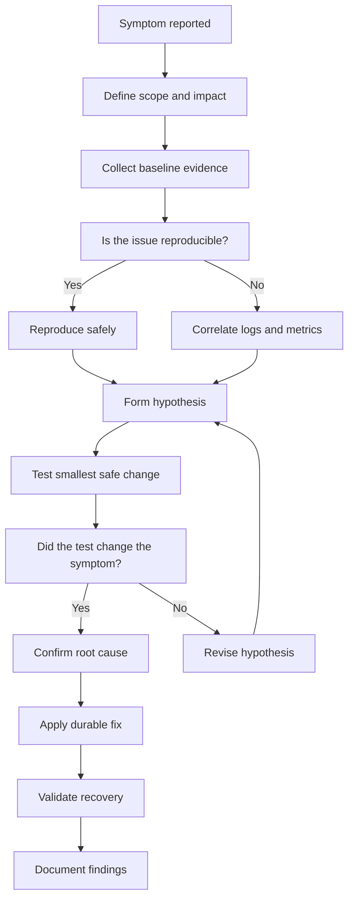
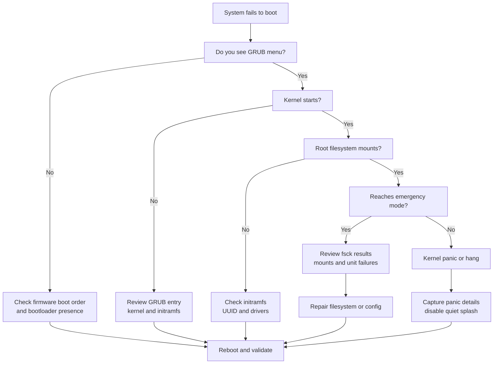
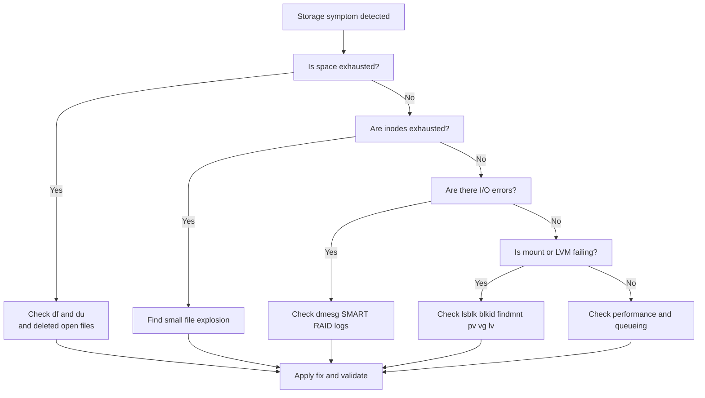
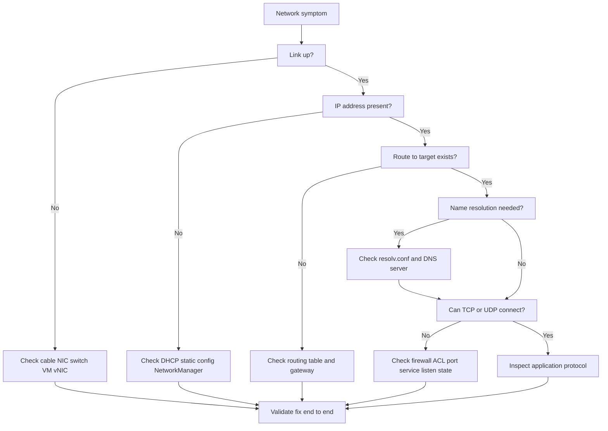
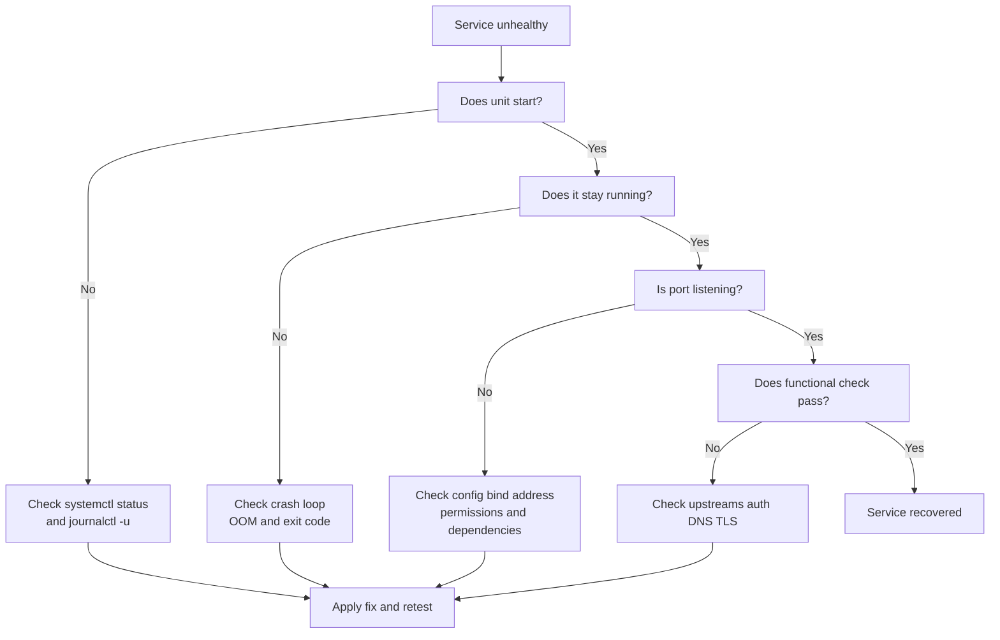

# Linux Troubleshooting Guide

A production-focused guide for diagnosing Linux issues from first principles.

This document is intentionally long and structured for real incidents.

It covers basic checks, advanced diagnostics, recovery workflows, and common scenarios.

Use it as both a runbook and a teaching reference.

---

## Table of Contents

1. [Troubleshooting Methodology](#1-troubleshooting-methodology)
2. [Boot Issues](#2-boot-issues)
3. [Disk & Storage Issues](#3-disk--storage-issues)
4. [Memory Issues](#4-memory-issues)
5. [CPU Issues](#5-cpu-issues)
6. [Network Issues](#6-network-issues)
7. [Service Issues](#7-service-issues)
8. [Permission Issues](#8-permission-issues)
9. [Package Issues](#9-package-issues)
10. [Log Analysis](#10-log-analysis)
11. [Performance Degradation](#11-performance-degradation)
12. [Recovery Procedures](#12-recovery-procedures)
13. [Real-World Scenarios](#13-real-world-scenarios)

---

## 1. Troubleshooting Methodology

### 1.1 Core principles

- Stay calm.
- Preserve evidence.
- Change one variable at a time.
- Prefer observation before intervention.
- Reproduce the symptom if safe.
- Record exact commands and outputs.
- Distinguish symptom from root cause.
- Build a hypothesis.
- Test the hypothesis.
- Update the hypothesis when facts change.
- Avoid cargo-cult fixes.
- Do not reboot blindly on production systems.
- Time matters during outages.
- Scope matters during outages.
- Blast radius matters during outages.
- Always ask: what changed?
- Always ask: who is affected?
- Always ask: when did it start?
- Always ask: can it wait?
- Always ask: what is the rollback?

### 1.2 Scientific troubleshooting loop

1. Define the problem clearly.
2. Establish what normal looks like.
3. Collect evidence.
4. Form one or more hypotheses.
5. Test the simplest high-probability hypothesis first.
6. Observe results.
7. Narrow the search space.
8. Fix the root cause.
9. Validate service recovery.
10. Document lessons learned.

### 1.3 General troubleshooting flow



### 1.4 Divide and conquer

- Split the system into layers.
- Test one boundary at a time.
- Determine the highest layer that still works.
- Determine the lowest layer that fails.
- Focus on the boundary between good and bad states.

Examples:

- App error or database error?
- DNS problem or routing problem?
- Kernel issue or filesystem issue?
- Service issue or reverse proxy issue?
- Local host issue or external dependency issue?

### 1.5 Binary search debugging

Use binary search when a long chain exists.

Examples:

- Network path through multiple hops.
- Service dependency chain.
- Boot sequence steps.
- Deployment history.
- Package dependency tree.

Approach:

1. Pick the midpoint.
2. Test whether the midpoint behaves normally.
3. Discard half the search space.
4. Repeat until the failing boundary is obvious.

### 1.6 Start with context

Capture these before making changes:

```bash
date
hostnamectl
uname -a
cat /etc/os-release
who -a
uptime
last -x | head
systemctl --failed
journalctl -b -p err..alert --no-pager | tail -100
```

### 1.7 High-value baseline commands

| Goal | Command |
|---|---|
| OS and kernel | `uname -a` |
| Distribution | `cat /etc/os-release` |
| Uptime and load | `uptime` |
| CPU overview | `mpstat -P ALL 1 3` |
| Memory overview | `free -h` |
| Swap overview | `swapon --show` |
| Disk usage | `df -hT` |
| Inodes | `df -i` |
| Block devices | `lsblk -f` |
| Mounts | `findmnt -A` |
| Failed services | `systemctl --failed` |
| Recent errors | `journalctl -p err..alert -b --no-pager` |
| Sockets | `ss -tulpn` |
| Routes | `ip route` |
| Interfaces | `ip -br addr` |
| DNS test | `resolvectl query example.com` |
| Process tree | `pstree -ap` |

### 1.8 Ask timeline questions

- What changed before the issue began?
- Was there a deploy?
- Was there a reboot?
- Was there a kernel update?
- Was storage nearly full?
- Was a firewall rule added?
- Was a certificate rotated?
- Was DNS changed?
- Did a backup or batch job start?
- Did traffic spike?

### 1.9 Change correlation sources

Check:

- Deployment pipelines.
- Configuration management runs.
- Package update logs.
- Cron activity.
- Cloud events.
- Hardware alerts.
- Monitoring annotations.
- User reports.
- Ticket timeline.

### 1.10 Golden questions

- Is it all users or some users?
- Is it all hosts or one host?
- Is it all traffic or one endpoint?
- Is it persistent or intermittent?
- Is it recent or longstanding?
- Is it reproducible on demand?
- Is there data loss risk?
- Is there security risk?

### 1.11 Evidence categories

- Symptoms.
- Logs.
- Metrics.
- Configuration.
- Recent changes.
- Dependencies.
- Resource state.
- Security controls.
- Kernel state.
- Hardware state.

### 1.12 Common anti-patterns

- Restarting everything immediately.
- Deleting logs to free disk before reviewing them.
- Running `chmod -R 777`.
- Disabling SELinux without proving it is the cause.
- Rebuilding a server before collecting evidence.
- Running fsck on a mounted read-write filesystem unless specifically supported.
- Killing unknown processes in shared environments.
- Assuming free memory must be high.

### 1.13 Safe first-response checklist

- Confirm impact.
- Start a timeline.
- Open the monitoring dashboard.
- Check for recent changes.
- Capture system state.
- Avoid destructive actions.
- Communicate status.
- Decide whether to mitigate or investigate first.

### 1.14 Mitigation vs root cause

Mitigation examples:

- Fail over traffic.
- Restart a crashed service.
- Increase disk space.
- Roll back a bad deploy.
- Drain a broken node.

Root cause actions:

- Fix a memory leak.
- Correct a firewall rule.
- Replace failing hardware.
- Repair filesystem corruption.
- Remove runaway log generation.

### 1.15 Documentation template

Use a simple incident note:

```text
Issue:
Impact:
Start time:
Detection method:
Systems affected:
Recent changes:
Observed symptoms:
Commands run:
Key evidence:
Hypotheses tested:
Mitigation:
Root cause:
Permanent fix:
Follow-up actions:
```

### 1.16 Quick decision table

| Situation | First action |
|---|---|
| System unreachable | Verify network path and power state |
| High load | Check CPU, D-state tasks, I/O wait, run queue |
| Disk full | Identify largest paths and open deleted files |
| Service down | Check `systemctl status` and `journalctl -u` |
| Boot failure | Identify GRUB, initramfs, fs, or kernel stage |
| Slow app | Compare app latency to CPU, disk, and network metrics |
| Permission denied | Check ownership, mode, ACL, SELinux, capabilities |

### 1.17 Minimal incident command pack

```bash
set -o pipefail
uptime
free -h
df -hT
df -i
ip -br addr
ip route
ss -tulpn | head -50
ps -eo pid,ppid,user,stat,%cpu,%mem,comm --sort=-%cpu | head -20
journalctl -b -p warning..alert --no-pager | tail -200
```

### 1.18 Know your layers

- Hardware.
- Firmware.
- Bootloader.
- Kernel.
- Init system.
- Filesystems.
- Network stack.
- Service manager.
- Application runtime.
- Application logic.
- External dependencies.

### 1.19 When to escalate

Escalate when:

- You suspect hardware failure.
- Filesystem corruption is severe.
- Production data is at risk.
- Security compromise is possible.
- A vendor-supported component is failing.
- Recovery requires privileged offline operations.

### 1.20 Exit criteria

A troubleshooting task is not done until:

- Symptoms are gone.
- Monitoring is green.
- Root cause is known or bounded.
- Data integrity is verified.
- Temporary changes are tracked.
- Permanent fixes are planned.

---

## 2. Boot Issues

### 2.1 Boot stages

1. Firmware initializes hardware.
2. Bootloader loads kernel and initramfs.
3. Kernel initializes drivers.
4. Initramfs discovers root filesystem.
5. Real root filesystem mounts.
6. `systemd` or init launches userspace.
7. Targets and services start.

### 2.2 Boot failure decision tree



### 2.3 Initial questions for boot issues

- Did this start after an update?
- Was the kernel upgraded?
- Was `/etc/fstab` changed?
- Was disk layout changed?
- Is the root disk visible in firmware?
- Is encryption involved?
- Is this bare metal, VM, or cloud?

### 2.4 GRUB rescue basics

Symptoms:

- `grub rescue>` prompt.
- Missing normal module.
- Incorrect root prefix.
- Boot disk UUID changed.

Useful commands inside GRUB:

```text
ls
ls (hd0,gpt1)/
set
set root=(hd0,gpt1)
set prefix=(hd0,gpt1)/boot/grub
insmod normal
normal
```

### 2.5 Reinstall GRUB from rescue environment

BIOS systems:

```bash
mount /dev/sdXn /mnt
mount --bind /dev /mnt/dev
mount --bind /proc /mnt/proc
mount --bind /sys /mnt/sys
chroot /mnt
grub-install /dev/sdX
grub-mkconfig -o /boot/grub/grub.cfg
exit
```

UEFI systems:

```bash
mount /dev/sdXn /mnt
mount /dev/sdYn /mnt/boot/efi
mount --bind /dev /mnt/dev
mount --bind /proc /mnt/proc
mount --bind /sys /mnt/sys
chroot /mnt
grub-install --target=x86_64-efi --efi-directory=/boot/efi --bootloader-id=GRUB
grub-mkconfig -o /boot/grub/grub.cfg
exit
```

### 2.6 Initramfs problems

Symptoms:

- Dropped to initramfs shell.
- Root device not found.
- Missing LVM or RAID modules.
- Missing disk controller driver.

Check from initramfs shell:

```bash
cat /proc/cmdline
blkid
ls /dev
lvm pvscan
mdadm --assemble --scan
```

Common causes:

- Wrong root UUID in kernel command line.
- Stale initramfs after disk or driver changes.
- Missing dm-crypt, LVM, or RAID tooling.
- Corrupt initramfs image.

Rebuild initramfs after chroot:

Debian or Ubuntu:

```bash
update-initramfs -u -k all
```

RHEL or Rocky or AlmaLinux:

```bash
dracut -f --regenerate-all
```

### 2.7 Kernel panic basics

Common panic causes:

- Missing root filesystem.
- Unsupported storage controller.
- Corrupted kernel module.
- Severe memory errors.
- Filesystem corruption.
- Incompatible kernel parameters.

Collect better panic details:

- Remove `quiet` and `rhgb` or `splash` from GRUB.
- Add `systemd.log_level=debug` when needed.
- Use serial console in VMs or servers.
- Capture screenshots if console logging is unavailable.

### 2.8 Emergency mode and rescue mode

Inspect failed units:

```bash
systemctl --failed
journalctl -xb --no-pager
```

Common causes:

- Bad `/etc/fstab` entry.
- Missing network filesystem at boot.
- Filesystem needs fsck.
- Root mounted read-only.

### 2.9 Fixing `/etc/fstab`

Checklist:

- Confirm UUIDs with `blkid`.
- Ensure mount points exist.
- Verify filesystem type.
- Add `nofail` for noncritical mounts.
- Add `_netdev` for network mounts.
- Test with `mount -a`.

Example validation:

```bash
blkid
findmnt -A
mount -a
```

### 2.10 Single-user or rescue boot

From GRUB kernel line:

- Append `single`.
- Or append `systemd.unit=rescue.target`.
- For deeper minimal boot use `systemd.unit=emergency.target`.

Use single-user mode when:

- You need password reset.
- A broken service blocks multi-user boot.
- You need to fix auth or mount issues.

### 2.11 Root filesystem read-only

Symptoms:

- Remount failures.
- Services fail with write errors.
- Boot reaches emergency mode.

Check:

```bash
mount | grep ' / '
dmesg | tail -100
journalctl -k -b --no-pager | tail -200
```

If corruption is suspected:

- Boot from rescue media if possible.
- Unmount the filesystem.
- Run the appropriate fsck tool.

### 2.12 fsck guidance

Filesystem | Tool
---|---
ext2 or ext3 or ext4 | `fsck.ext4`
XFS | `xfs_repair` on unmounted fs
Btrfs | `btrfs check` with caution
VFAT | `fsck.vfat`

Important notes:

- Do not run destructive repair without backups if avoidable.
- XFS uses `xfs_repair`, not generic `fsck` in the usual sense.
- On LVM or RAID, verify the correct logical device.

Example ext4 repair:

```bash
umount /dev/mapper/vg-root
fsck.ext4 -f /dev/mapper/vg-root
```

Example XFS repair:

```bash
umount /dev/mapper/vg-root
xfs_repair /dev/mapper/vg-root
```

### 2.13 Boot log analysis

Commands:

```bash
journalctl -b -0 --no-pager
journalctl -b -1 --no-pager
journalctl -k -b --no-pager
systemd-analyze critical-chain
systemd-analyze blame | head -30
```

Use `-b -1` to compare the previous failed boot with the current boot.

### 2.14 Slow boot troubleshooting

Check:

- Failing network mounts.
- Long DNS timeouts.
- Misconfigured services waiting on dependencies.
- Hardware device probe delays.
- `cloud-init` stalls.
- `fsck` duration.

Useful commands:

```bash
systemd-analyze
systemd-analyze blame | head -50
systemd-analyze critical-chain
```

### 2.15 Encrypted root troubleshooting

Check:

- Is the LUKS header intact?
- Is the key slot valid?
- Is the keyboard layout causing passphrase mismatch?
- Is `crypttab` correct?
- Is initramfs built with crypt support?

Commands:

```bash
cryptsetup luksDump /dev/sdXn
cat /etc/crypttab
lsinitramfs /boot/initrd.img-$(uname -r) | grep crypt
```

### 2.16 Bootloader and kernel package mismatch

Symptoms:

- Kernel entry exists but files missing.
- New kernel installed but old initramfs referenced.
- Broken symlink under `/boot`.

Check:

```bash
ls -lh /boot
grep menuentry -n /boot/grub/grub.cfg
rpm -qa | grep kernel
apt list --installed 2>/dev/null | grep linux-image
```

### 2.17 Cloud or VM specific checks

- Verify attached root disk.
- Verify hypervisor disk order.
- Check console screenshot.
- Check serial console output.
- Ensure initramfs includes paravirtual drivers.
- Confirm correct boot mode: BIOS vs UEFI.

### 2.18 Secure Boot concerns

Symptoms:

- Unsigned kernel modules fail.
- Third-party drivers do not load.
- Boot halts after custom kernel changes.

Check:

```bash
mokutil --sb-state
journalctl -k | grep -i -E 'secure boot|lockdown|module verification'
```

### 2.19 Practical boot triage checklist

- Capture exact stage of failure.
- Check previous change records.
- Verify root disk presence.
- Verify `/boot` and EFI partitions.
- Verify kernel and initramfs matching versions.
- Verify `fstab` UUIDs.
- Review boot logs.
- Repair filesystem only after confirming need.
- Reboot only after documenting changes.

### 2.20 Common boot commands summary

```bash
lsblk -f
blkid
findmnt -A
cat /etc/fstab
journalctl -xb --no-pager
journalctl -k -b --no-pager
systemctl --failed
grub2-mkconfig -o /boot/grub2/grub.cfg
update-grub
update-initramfs -u
dracut -f
```

---

## 3. Disk & Storage Issues

### 3.1 Common storage symptoms

- `No space left on device`.
- `Input/output error`.
- `Read-only filesystem`.
- Mount failure.
- Missing device.
- Degraded RAID.
- LVM volume inactive.
- High disk latency.
- Many blocked tasks in D state.

### 3.2 Disk troubleshooting flow



### 3.3 First commands for storage issues

```bash
df -hT
df -i
lsblk -f
findmnt -A
mount | column -t | head -50
dmesg -T | tail -200
journalctl -k --no-pager | tail -200
```

### 3.4 Disk full vs inode full

Disk blocks full:

- `df -h` shows 100% use.
- Large files or directories are the likely cause.

Inodes full:

- `df -i` shows 100% inode use.
- Usually millions of tiny files.

Check top space users:

```bash
du -xhd1 / | sort -h
du -xhd1 /var | sort -h
du -xhd1 /home | sort -h
```

Check tiny file explosion:

```bash
find /var -xdev -type f | awk -F/ '{print "/"$2"/"$3}' | sort | uniq -c | sort -nr | head
```

### 3.5 Open deleted files consuming space

Symptoms:

- `df -h` full.
- `du` totals do not match.
- Log rotation happened but space did not return.

Check:

```bash
lsof +L1
```

Fix:

- Restart or reload the process holding the deleted file.
- Avoid truncating unknown descriptors blindly.

### 3.6 Large file discovery

```bash
find / -xdev -type f -size +500M -printf '%s %p\n' 2>/dev/null | sort -n | tail -50
```

### 3.7 When `/var` fills unexpectedly

Common causes:

- Log storms.
- Package cache growth.
- Docker overlay layers.
- Core dumps.
- Stuck application temp files.
- Backup staging.
- Journald retention misconfiguration.

Useful checks:

```bash
journalctl --disk-usage
du -sh /var/log/* 2>/dev/null | sort -h
du -sh /var/cache/* 2>/dev/null | sort -h
du -sh /var/lib/docker 2>/dev/null
coredumpctl list | tail
```

### 3.8 Safe space recovery options

- Remove obsolete package caches.
- Vacuum journal logs.
- Rotate oversized app logs.
- Remove stale temp files after verification.
- Delete old backups from known locations.
- Expand the filesystem if appropriate.

Examples:

```bash
journalctl --vacuum-time=7d
apt clean
yum clean all
dnf clean all
```

### 3.9 I/O errors

Symptoms:

- `Input/output error`.
- Filesystem remounted read-only.
- Kernel logs show SATA or NVMe resets.
- Tasks stuck in D state.

Check kernel logs:

```bash
journalctl -k --no-pager | grep -i -E 'error|I/O|reset|nvme|ata|scsi|blk_update_request|buffer i/o'
```

Hardware checks:

```bash
smartctl -a /dev/sdX
smartctl -a /dev/nvme0
```

Interpret carefully:

- Reallocated sectors rising is bad.
- Pending sectors are bad.
- Media errors on NVMe are bad.
- Repeated controller resets suggest path or device instability.

### 3.10 Mount failures

Common causes:

- Wrong UUID.
- Unsupported filesystem type.
- Corrupted superblock.
- Missing mount point.
- Dirty filesystem.
- Bad options in `fstab`.

Check:

```bash
blkid
lsblk -f
cat /etc/fstab
mount -av
```

### 3.11 ext4 superblock recovery hint

Find backup superblocks:

```bash
mke2fs -n /dev/sdXn
```

Repair with a backup superblock:

```bash
fsck.ext4 -b 32768 /dev/sdXn
```

Use only after confirming the filesystem type and backup strategy.

### 3.12 XFS specifics

- XFS repair requires unmounted filesystem.
- Do not use `fsck.ext4` on XFS.
- Review kernel logs for metadata corruption.

Useful commands:

```bash
xfs_info /mountpoint
xfs_repair -n /dev/mapper/vg-data
```

### 3.13 LVM essentials

Inspect physical, volume, and logical layers:

```bash
pvs
vgs
lvs -a -o +devices
pvscan
vgscan
lvscan
```

Activate VGs:

```bash
vgchange -ay
```

If metadata is damaged, check backups in:

- `/etc/lvm/archive/`
- `/etc/lvm/backup/`

Restore metadata cautiously:

```bash
vgcfgrestore -f /etc/lvm/archive/<file> <vgname>
```

### 3.14 Extending a logical volume

Typical sequence for ext4:

```bash
pvcreate /dev/sdX
vgextend vgdata /dev/sdX
lvextend -r -L +100G /dev/vgdata/lvdata
```

Typical sequence for XFS:

```bash
lvextend -L +100G /dev/vgdata/lvdata
xfs_growfs /mountpoint
```

### 3.15 Shrinking warning

- XFS cannot be shrunk online or in the normal way.
- ext4 shrinking requires unmount and careful sequencing.
- Shrinking is riskier than extending.

### 3.16 RAID degraded arrays

Software RAID status:

```bash
cat /proc/mdstat
mdadm --detail /dev/md0
```

Key questions:

- Is the array degraded or failed?
- Which member is missing?
- Is the replacement device identical or larger?
- Is the problem the disk, cable, controller, or slot?

Add replacement device example:

```bash
mdadm /dev/md0 --add /dev/sdX1
```

### 3.17 Hardware RAID considerations

- Use vendor tooling for controller state.
- Check battery-backed cache status.
- Check patrol read or rebuild events.
- Check predictive failure alerts.

### 3.18 Multipath issues

Symptoms:

- Duplicate devices.
- Flapping paths.
- Slow I/O.
- Device mapper path failures.

Check:

```bash
multipath -ll
lsblk
```

### 3.19 D-state tasks and storage stalls

Check blocked tasks:

```bash
ps -eo pid,stat,wchan:32,comm | awk '$2 ~ /D/' | head -50
```

If many processes are in `D` state:

- Suspect storage latency or hangs.
- Inspect kernel messages.
- Inspect SAN or cloud volume status.

### 3.20 Filesystem usage hotspots

Find recent file growth:

```bash
find /var -xdev -type f -mtime -1 -printf '%TY-%Tm-%Td %TT %s %p\n' | sort | tail -100
```

### 3.21 Thin provisioning issues

Symptoms:

- Thin pool metadata full.
- New writes fail.
- Snapshots break.

Check:

```bash
lvs -a -o +seg_monitor,lv_size,data_percent,metadata_percent
```

### 3.22 Container storage problems

Common locations:

- `/var/lib/docker`
- `/var/lib/containerd`
- `/var/lib/containers`

Useful commands:

```bash
docker system df
docker ps -a
du -sh /var/lib/docker/* 2>/dev/null | sort -h
```

### 3.23 Network filesystem issues

For NFS and CIFS:

- Confirm server reachability.
- Confirm DNS resolution.
- Confirm firewall ports.
- Confirm credentials and export settings.
- Use `_netdev` in `fstab`.

Check:

```bash
showmount -e nfs-server
mount -v -t nfs nfs-server:/export /mnt
```

### 3.24 Swap storage concerns

If swap resides on a failing disk:

- Page-ins will stall.
- System may appear frozen.

Check swap devices:

```bash
swapon --show --output=NAME,TYPE,SIZE,USED,PRIO
```

### 3.25 Storage incident checklist

- Verify symptoms: full, slow, or corrupt.
- Check `df -h` and `df -i`.
- Check `du` against `df`.
- Check `lsof +L1`.
- Review kernel logs.
- Check SMART or RAID state.
- Verify mounts, UUIDs, LVM, RAID.
- Repair only after backups and scope validation.

---

## 4. Memory Issues

### 4.1 Understand Linux memory reporting

Key concepts:

- Free memory alone is not enough.
- Linux uses memory for caches aggressively.
- `available` memory is more useful than `free`.
- Swap use is not always a problem.
- Sudden growth patterns matter more than absolute numbers.

### 4.2 First commands

```bash
free -h
vmstat 1 5
cat /proc/meminfo
ps -eo pid,user,comm,%mem,rss,vsz --sort=-rss | head -20
smem -tk 2>/dev/null | head -20
```

### 4.3 Key `/proc/meminfo` fields

| Field | Meaning |
|---|---|
| `MemTotal` | Total RAM |
| `MemFree` | Completely unused RAM |
| `MemAvailable` | Estimated allocatable RAM without major swapping |
| `Buffers` | Metadata buffers |
| `Cached` | Page cache |
| `SReclaimable` | Reclaimable slab |
| `SwapTotal` | Total swap |
| `SwapFree` | Free swap |
| `Dirty` | Dirty pages awaiting writeback |
| `Writeback` | Pages being written |
| `Slab` | Kernel object caches |

### 4.4 OOM killer basics

Symptoms:

- Processes are killed unexpectedly.
- Kernel logs mention OOM.
- Service restarts without app-level crash logs.

Check:

```bash
journalctl -k --no-pager | grep -i 'out of memory\|oom-killer\|killed process'
```

Questions:

- Which process was killed?
- What was its RSS?
- Was cgroup memory limit involved?
- Was the host under global pressure or only one container?

### 4.5 Container vs host OOM

For cgroup-limited workloads:

```bash
systemd-cgls
cat /sys/fs/cgroup/memory.max 2>/dev/null
cat /sys/fs/cgroup/memory.current 2>/dev/null
```

Container tools:

```bash
docker stats --no-stream
kubectl top pod -A
```

### 4.6 Memory leaks

Signs:

- Resident set grows steadily.
- Restarts temporarily fix the issue.
- Garbage-collected runtimes show heap growth after normal load.

Approach:

- Establish baseline growth rate.
- Compare memory over time.
- Capture heap dumps when supported.
- Correlate growth with traffic or jobs.
- Identify cache misuse or object retention.

### 4.7 Swap thrashing

Symptoms:

- System is very slow.
- `si` and `so` in `vmstat` are high.
- Load average is high with low CPU progress.

Check:

```bash
vmstat 1 10
sar -W 1 5
```

High swap-in or swap-out indicates memory pressure.

### 4.8 Page cache vs application memory

Do not drop caches reflexively.

Consider:

- Is page cache actually the problem?
- Is reclaimable memory available?
- Is slab unusually large?
- Are anonymous pages dominating?

### 4.9 Kernel memory pressure

Check slab usage:

```bash
slabtop -o
cat /proc/slabinfo | head
```

Use cases:

- Network conntrack growth.
- Dentry or inode cache explosion.
- Kernel memory leaks.

### 4.10 `top` and `htop` interpretation

Focus on:

- RES.
- SHR.
- total threads.
- `%MEM`.
- zombie count.
- swap usage.

### 4.11 Overcommit behavior

Relevant sysctls:

```bash
sysctl vm.overcommit_memory
sysctl vm.overcommit_ratio
```

Use with care.

Changing overcommit policy can reduce allocation failures but may worsen OOM outcomes.

### 4.12 Huge pages and THP

Check:

```bash
cat /sys/kernel/mm/transparent_hugepage/enabled
grep -i huge /proc/meminfo
```

Transparent Huge Pages can help some workloads and hurt others.

### 4.13 NUMA effects

On NUMA hosts:

```bash
numactl --hardware
numastat
```

Symptoms:

- Free memory exists on one node but not another.
- Latency-sensitive workloads behave inconsistently.

### 4.14 Memory incident checklist

- Check OOM logs.
- Check `MemAvailable`.
- Check swap activity.
- Identify top RSS processes.
- Determine host vs container scope.
- Review recent deploys.
- Review leak patterns over time.
- Apply limits or fix the leak.

---

## 5. CPU Issues

### 5.1 High CPU categories

- High user CPU.
- High system CPU.
- High iowait.
- High steal time in VMs.
- High interrupt or softirq load.
- High context switch overhead.

### 5.2 First commands

```bash
uptime
top -H
ps -eo pid,ppid,user,ni,pri,stat,%cpu,comm --sort=-%cpu | head -20
mpstat -P ALL 1 5
pidstat -u -r -d -h 1 5
```

### 5.3 User vs system CPU

- High user CPU usually means application work.
- High system CPU suggests kernel work.
- Common system CPU causes include networking, filesystem, syscall-heavy loops, or interrupt load.

### 5.4 Runaway processes

Check:

```bash
top -H -p <pid>
ps -Lp <pid> -o pid,tid,psr,pcpu,stat,comm --sort=-pcpu | head -20
strace -p <pid>
```

Look for:

- Busy loops.
- Retry storms.
- Excessive logging.
- Stuck lock contention.

### 5.5 CPU steal time

In VMs, check `st` in `top` or `mpstat`.

If steal time is high:

- The hypervisor is oversubscribed.
- The guest is not receiving scheduled CPU time.
- Moving the VM or resizing may be required.

### 5.6 Interrupt storms

Check interrupt rates:

```bash
watch -n1 'cat /proc/interrupts'
```

Common causes:

- Faulty NIC behavior.
- High packet rates.
- Storage interrupt bursts.
- Misbehaving drivers.

### 5.7 Softirq overload

Check:

```bash
cat /proc/softirqs
mpstat -P ALL 1 5
```

Network-heavy systems may show high softirq CPU.

### 5.8 Context switch overhead

Check:

```bash
vmstat 1 5
pidstat -w 1 5
```

High `cs` values may indicate:

- Too many threads.
- Lock contention.
- Scheduler churn.
- Excessive short-lived processes.

### 5.9 CPU frequency and throttling

Check:

```bash
lscpu
cpupower frequency-info 2>/dev/null
journalctl -k | grep -i -E 'throttle|thermal|mce|machine check'
```

### 5.10 Load average vs CPU usage

High load does not always mean high CPU.

Load includes:

- runnable tasks.
- uninterruptible sleep tasks.

If load is high and CPU is low:

- suspect I/O wait.
- suspect stuck NFS.
- suspect blocked tasks.

### 5.11 CPU issue checklist

- Measure user, system, iowait, steal.
- Identify top processes and threads.
- Check interrupts and softirqs.
- Check context switches.
- Check throttling or thermal events.
- Correlate with deploys and traffic.

---

## 6. Network Issues

### 6.1 Troubleshooting model

Work from lower layers upward:

- Link.
- IP addressing.
- Routing.
- Firewall.
- DNS.
- Transport.
- Application protocol.

### 6.2 Network troubleshooting layers



### 6.3 First commands

```bash
ip -br addr
ip route
ip rule
ss -tulpn
ping -c 3 8.8.8.8
ping -c 3 gateway-ip
tracepath target
resolvectl status
journalctl -u NetworkManager --no-pager | tail -100
```

### 6.4 No connectivity

Checklist:

- Is the interface up?
- Is it carrier up?
- Does it have the correct IP?
- Is default route present?
- Can it ping the gateway?
- Can it reach a public IP?
- Can it resolve DNS names?

Commands:

```bash
ip link
ip -br addr
ip route
arp -n
```

### 6.5 Interface state

Inspect:

```bash
ip -details link show dev eth0
ethtool eth0
```

Look for:

- `LOWER_UP`.
- duplex mismatch.
- speed mismatch.
- excessive drops.
- CRC errors.

### 6.6 DHCP problems

Check:

- Lease present.
- DHCP server reachable.
- Client logs.
- Duplicate IP conflicts.

Commands:

```bash
journalctl -u NetworkManager --no-pager | grep -i dhcp
journalctl -u systemd-networkd --no-pager | grep -i dhcp
```

### 6.7 Routing issues

Common symptoms:

- Can reach local subnet only.
- Wrong default gateway.
- Asymmetric path.
- Policy routing mismatch.

Check route selection:

```bash
ip route get 1.1.1.1
ip route get target-ip
ip rule
```

### 6.8 DNS failures

Check resolver configuration:

```bash
cat /etc/resolv.conf
resolvectl status
resolvectl query example.com
getent hosts example.com
host example.com
nslookup example.com
```

Common causes:

- Bad nameserver IP.
- Search domain confusion.
- Resolver timeout due to firewall.
- Broken split DNS.
- Stale local cache.

### 6.9 Slow DNS

Symptoms:

- App is slow at connect time.
- `curl` by IP is fast but hostname is slow.
- SSH delays before banner.

Measure:

```bash
time getent hosts example.com
dig +stats example.com
```

### 6.10 Packet loss

Check with:

```bash
ping -c 20 target
mtr -rwzbc 100 target
```

Interpret carefully:

- ICMP rate limiting can mislead.
- Loss only on one hop may be harmless if downstream is fine.
- End-to-end loss matters most.

### 6.11 Firewall blocks

Common frameworks:

- `iptables`
- `nftables`
- `firewalld`
- cloud security groups
- external ACLs

Check:

```bash
nft list ruleset
iptables -S
iptables -L -n -v
firewall-cmd --list-all
```

### 6.12 Port conflicts and listen state

Check listening processes:

```bash
ss -tulpn
ss -ltnp '( sport = :80 )'
```

### 6.13 Connection refused vs timeout

- `Connection refused` usually means reachable host, no listener, or active reject.
- `Timeout` often means packet drop, routing issue, firewall, or host unreachable.

### 6.14 MTU issues

Symptoms:

- Small traffic works.
- Large transfers fail or stall.
- VPN traffic behaves strangely.
- HTTPS or SSH hangs after connect.

Check path MTU:

```bash
tracepath target
ping -M do -s 1472 target
```

Reduce MTU for testing if needed.

### 6.15 Network drops and errors

Check counters:

```bash
ip -s link
ethtool -S eth0 | head -100
```

Look for:

- RX drops.
- TX drops.
- frame errors.
- FIFO errors.
- overruns.

### 6.16 TCP diagnostics

Useful tools:

```bash
ss -s
ss -tan state syn-sent
ss -tan state established
sar -n TCP,ETCP 1 5
```

Possible issues:

- SYN backlog overflow.
- Retransmits.
- Reset storms.
- Too many `TIME_WAIT` sockets.

### 6.17 Capture packets when needed

Use `tcpdump` carefully:

```bash
tcpdump -ni eth0 host target-ip and port 443
```

Questions to answer:

- Are packets leaving?
- Are replies coming back?
- Is there ARP resolution?
- Is there TCP handshake completion?

### 6.18 Reverse path filtering

Check rp_filter settings on multi-homed systems:

```bash
sysctl net.ipv4.conf.all.rp_filter
sysctl net.ipv4.conf.eth0.rp_filter
```

### 6.19 Conntrack exhaustion

Symptoms:

- Random connection failures.
- Firewalling host under heavy connection churn.

Check:

```bash
sysctl net.netfilter.nf_conntrack_count
sysctl net.netfilter.nf_conntrack_max
```

### 6.20 Ephemeral port exhaustion

Symptoms:

- Clients fail to create new outbound connections.
- Many sockets in `TIME_WAIT`.

Check:

```bash
cat /proc/sys/net/ipv4/ip_local_port_range
ss -tan | awk '{print $1}' | sort | uniq -c
```

### 6.21 Bonding and teaming

Check:

```bash
cat /proc/net/bonding/bond0
nmcli connection show
```

Verify:

- active slave.
- LACP state.
- switch configuration alignment.

### 6.22 VLAN issues

Check subinterfaces:

```bash
ip -d link show
bridge vlan show 2>/dev/null
```

### 6.23 Network namespace and container issues

Check:

```bash
ip netns list
docker inspect <container>
podman inspect <container>
```

### 6.24 Proxy confusion

Check environment variables:

```bash
env | grep -i proxy
```

### 6.25 TLS is not basic connectivity

A host can be reachable while TLS fails.

Check certificate and handshake:

```bash
openssl s_client -connect host:443 -servername host
curl -vk https://host/
```

### 6.26 Network issue checklist

- Verify link.
- Verify IP.
- Verify route.
- Verify DNS.
- Verify firewall.
- Verify listener.
- Verify MTU.
- Verify packet flow.
- Verify application protocol.

---

## 7. Service Issues

### 7.1 First commands

```bash
systemctl status myservice --no-pager
journalctl -u myservice -b --no-pager | tail -200
systemctl list-dependencies myservice
ss -tulpn
```

### 7.2 Service failure diagnosis flow



### 7.3 Read `systemctl status` carefully

Important fields:

- `Loaded`.
- `Active`.
- `Main PID`.
- recent log lines.
- exit status.
- restart counter.

### 7.4 Common failure classes

- Bad configuration.
- Missing dependency.
- Port already in use.
- Permission denied.
- Missing file or directory.
- User account missing.
- SELinux denial.
- Environment variable issue.
- Secret or certificate missing.
- OOM crash.

### 7.5 Validate service unit files

Check the unit:

```bash
systemctl cat myservice
systemd-analyze verify /etc/systemd/system/myservice.service
```

### 7.6 Dependency failures

Check dependencies:

```bash
systemctl list-dependencies myservice
systemctl show -p After,Wants,Requires myservice
```

If a database or network mount must exist first, ensure the unit ordering is correct.

### 7.7 Restart loops

Check:

```bash
systemctl show myservice -p Restart,RestartSec,NRestarts
journalctl -u myservice --no-pager | tail -200
```

Possible causes:

- App crashes instantly.
- Readiness probe fails.
- Environment missing.
- Health check is too aggressive.

### 7.8 Exit codes matter

Typical meanings:

- `1` general failure.
- `126` command invoked cannot execute.
- `127` command not found.
- `137` SIGKILL or OOM.
- `139` segmentation fault.
- `143` SIGTERM.

### 7.9 Port already in use

Check:

```bash
ss -ltnp '( sport = :8080 )'
```

Fix options:

- Stop conflicting service.
- Change bind port.
- Fix duplicate startup.

### 7.10 Permission denied in services

Check:

- service user exists.
- file ownership.
- directory execute bits.
- SELinux context.
- capabilities for low ports or raw sockets.

### 7.11 SELinux denials

Inspect:

```bash
aausearch -m AVC,USER_AVC -ts recent 2>/dev/null
journalctl -t setroubleshoot --no-pager | tail -50
getenforce
```

### 7.12 Environment file issues

Check:

```bash
systemctl show myservice -p Environment,EnvironmentFiles
systemctl cat myservice
```

Common issues:

- file missing.
- wrong quoting.
- file permissions.
- variable not exported where expected.

### 7.13 Working directory issues

- Relative paths break under systemd.
- Use absolute paths.
- Ensure `WorkingDirectory=` exists.

### 7.14 Socket activation confusion

Some services are started by sockets.

Check:

```bash
systemctl list-sockets | grep myservice
systemctl status myservice.socket --no-pager
```

### 7.15 Resource limits

Check unit limits:

```bash
systemctl show myservice -p LimitNOFILE,LimitNPROC,MemoryMax,TasksMax
```

### 7.16 Manual foreground start

Starting the binary manually can reveal clear errors.

Example pattern:

```bash
sudo -u serviceuser /usr/bin/myservice --config /etc/myservice.conf
```

Do this only when safe and when the service manager is not already controlling the process.

### 7.17 Health check failures

A service can be running but unhealthy.

Check:

- local port responds.
- readiness endpoint returns expected status.
- downstream dependencies are reachable.
- credentials are valid.

### 7.18 Service issue checklist

- Read unit status.
- Read recent journal.
- Verify config syntax.
- Verify dependencies.
- Verify ports.
- Verify permissions and SELinux.
- Verify resource limits.
- Verify functional health.

---

## 8. Permission Issues

### 8.1 Permission denied categories

- UNIX mode bits.
- Ownership mismatch.
- Parent directory execute bit missing.
- ACL override.
- SELinux or AppArmor block.
- Capability missing.
- Read-only mount.
- NFS root squash.

### 8.2 Basic checks

```bash
namei -l /path/to/file
ls -ld /path /path/to /path/to/file
id
getfacl /path/to/file 2>/dev/null
mount | grep ' /path '
```

### 8.3 Remember directory execute bit

To access a file by name inside a directory, the process needs execute permission on the directory.

### 8.4 `namei` is extremely useful

Example:

```bash
namei -l /var/www/html/index.html
```

This reveals ownership and modes for every path component.

### 8.5 Ownership mismatch

Common symptoms:

- Service can read config but cannot write PID or socket file.
- App deploy user created files a runtime user cannot access.

Fix carefully with `chown` on the right path only.

### 8.6 ACL conflicts

ACLs can override assumptions based on mode bits.

Check:

```bash
getfacl /path/to/file
```

### 8.7 SELinux basics

Modes:

- Enforcing.
- Permissive.
- Disabled.

Check context:

```bash
ls -Z /path/to/file
ps -eZ | head
getenforce
```

Restore default contexts:

```bash
restorecon -Rv /var/www/html
```

### 8.8 AppArmor basics

Check status:

```bash
aa-status 2>/dev/null
journalctl -k | grep -i apparmor
```

### 8.9 Capabilities

Use capabilities instead of root when possible.

Check file capabilities:

```bash
getcap -r /usr/bin /usr/sbin 2>/dev/null | head -50
```

Common example:

- Binding to ports below 1024 without root using `cap_net_bind_service`.

Set example:

```bash
setcap 'cap_net_bind_service=+ep' /usr/local/bin/myapp
```

### 8.10 Read-only filesystems

A permission-looking issue may really be mount state.

Check:

```bash
mount | grep ' / '
dmesg | tail -100
```

### 8.11 NFS root squash

On NFS, root may be mapped to nobody.

Symptoms:

- Root cannot write.
- Ownership behaves unexpectedly.

Review export options on the server.

### 8.12 Sudo and path confusion

Check:

- Effective user.
- `sudo -u` behavior.
- environment sanitization.
- home directory assumptions.

### 8.13 Sticky bit issues

Example location:

- `/tmp`

The sticky bit allows only file owner or root to delete entries.

### 8.14 Permission issue checklist

- Check user and groups.
- Check path component permissions.
- Check ownership.
- Check ACLs.
- Check SELinux or AppArmor.
- Check capabilities.
- Check mount state.
- Check remote filesystem semantics.

---

## 9. Package Issues

### 9.1 Common package problems

- Broken dependencies.
- Repository metadata errors.
- GPG signature failures.
- Held packages.
- Version conflicts.
- Interrupted package transaction.
- File conflicts between packages.

### 9.2 First commands

Debian or Ubuntu:

```bash
apt update
apt install -f
apt-cache policy pkgname
dpkg --audit
```

RHEL family:

```bash
dnf repolist
dnf check
rpm -Va
```

### 9.3 Repository issues

Common causes:

- DNS failure.
- TLS or certificate issue.
- Proxy misconfiguration.
- Mirror unavailable.
- Incorrect repository URL.
- Subscription or entitlement issue.

### 9.4 GPG key failures

Symptoms:

- Repository metadata not trusted.
- Package signatures rejected.

Check:

- correct key installed.
- repo metadata signed by expected key.
- system time accurate.

### 9.5 Broken dependency chains

Debian tools:

```bash
apt --fix-broken install
dpkg --configure -a
```

RHEL tools:

```bash
dnf repoquery --unsatisfied
rpm -q --whatrequires pkgname
```

### 9.6 Held packages and pinning

Debian:

```bash
apt-mark showhold
apt-cache policy pkgname
```

Version pinning can cause confusing partial upgrades.

### 9.7 File conflicts

RPM example checks:

```bash
rpm -qf /path/to/file
rpm -Va
```

### 9.8 Interrupted updates

Symptoms:

- Lock files remain.
- package database inconsistent.
- postinstall scripts incomplete.

Debian recovery:

```bash
dpkg --configure -a
apt install -f
```

RHEL recovery:

```bash
rpm --rebuilddb
dnf check
```

### 9.9 Kernel package caution

- Keep at least one known-good kernel.
- Verify `/boot` has space before updates.
- Regenerate bootloader config if needed.

### 9.10 Verify package ownership

Debian:

```bash
dpkg -S /path/to/file
```

RHEL:

```bash
rpm -qf /path/to/file
```

### 9.11 Package issue checklist

- Verify repo reachability.
- Verify GPG trust.
- Verify time sync.
- Check held packages.
- Repair broken dependencies.
- Audit package DB integrity.
- Confirm enough disk space in `/` and `/boot`.

---

## 10. Log Analysis

### 10.1 Common log locations

| Path | Typical content |
|---|---|
| `/var/log/messages` | General system messages on many distros |
| `/var/log/syslog` | General syslog on Debian family |
| `/var/log/auth.log` | Authentication events |
| `/var/log/secure` | Auth events on RHEL family |
| `/var/log/kern.log` | Kernel messages on some systems |
| `/var/log/dmesg` | Boot kernel ring buffer snapshot |
| `/var/log/nginx/` | NGINX access and error logs |
| `/var/log/httpd/` | Apache logs |
| `/var/log/mysql/` | MySQL or MariaDB logs |
| `/var/log/audit/` | SELinux and audit data |

### 10.2 `journalctl` essentials

Examples:

```bash
journalctl -b --no-pager
journalctl -b -1 --no-pager
journalctl -u sshd --since '1 hour ago' --no-pager
journalctl -p err..alert --since today --no-pager
journalctl -k --no-pager
journalctl -f
```

### 10.3 High-value journal filters

- by boot: `-b`
- by service: `-u name`
- by priority: `-p err..alert`
- by time: `--since`, `--until`
- by kernel only: `-k`
- by executable or PID with `SYSTEMD_UNIT` or `_PID` fields

### 10.4 Correlation mindset

Correlate logs by:

- timestamp.
- hostname.
- request ID.
- transaction ID.
- PID or unit.
- user session.
- source IP.

### 10.5 grep examples

```bash
grep -i 'error' /var/log/syslog | tail -50
grep -Rni 'permission denied' /var/log
```

### 10.6 awk examples

Count repeated messages:

```bash
awk '{print $5}' /var/log/nginx/access.log | sort | uniq -c | sort -nr | head
```

Summarize status codes:

```bash
awk '{print $9}' /var/log/nginx/access.log | sort | uniq -c | sort -nr
```

### 10.7 Common log patterns

Pattern | Interpretation
---|---
`Out of memory` | Memory pressure or limit hit
`segfault` | Application crash or bad library
`permission denied` | Access control failure
`No space left on device` | Blocks or inodes exhausted
`Connection refused` | No listener or active reject
`timed out` | Slow dependency or dropped packets
`I/O error` | Device, path, or filesystem issue
`AVC denied` | SELinux blocked operation

### 10.8 Kernel logs matter

Always inspect kernel messages when symptoms are low-level.

Examples:

```bash
journalctl -k --since '2 hours ago' --no-pager
dmesg -T | tail -200
```

### 10.9 Time alignment

Beware:

- UTC vs local time.
- clock drift.
- daylight saving changes.
- rotated logs.

### 10.10 Access log plus error log pairing

For web systems:

- Use access logs to find failed requests.
- Use timestamps to align error logs.
- Match upstream latency and status codes.

### 10.11 Audit logs

For security or SELinux:

```bash
ausearch -m AVC -ts recent
aureport -au
```

### 10.12 Structured logs

If JSON logs exist, prefer `jq`.

Example:

```bash
jq -r '.level + " " + .message' app.log | head
```

### 10.13 Log rotation pitfalls

Check:

- file keeps growing after rotation due to open fd.
- rotation frequency too low.
- compression delayed.
- service lacks `USR1` or reopen signal.

### 10.14 Journal disk usage

Check:

```bash
journalctl --disk-usage
```

Vacuum examples:

```bash
journalctl --vacuum-time=14d
journalctl --vacuum-size=500M
```

### 10.15 Practical log workflow

1. Define time window.
2. Identify affected service.
3. Pull error logs.
4. Pull kernel logs.
5. Correlate with metrics.
6. Correlate with changes.
7. Confirm the first bad event.

---

## 11. Performance Degradation

### 11.1 Use the USE method

USE stands for:

- Utilization.
- Saturation.
- Errors.

Apply it to each resource:

- CPU.
- Memory.
- Disk.
- Network.

### 11.2 Performance triage commands

```bash
uptime
vmstat 1 5
iostat -xz 1 5
mpstat -P ALL 1 5
free -h
sar -n DEV 1 5
pidstat -dur 1 5
```

### 11.3 CPU bottleneck indicators

- High run queue.
- High user or system CPU.
- Low idle.
- Throttling.
- High steal.

### 11.4 Memory bottleneck indicators

- OOM events.
- Swap activity.
- Low `MemAvailable`.
- Reclaim storms.

### 11.5 Disk bottleneck indicators

- High `await`.
- High `%util`.
- Large queue depth.
- D-state tasks.

### 11.6 Network bottleneck indicators

- Drops.
- retransmits.
- low throughput.
- high latency.
- conntrack saturation.

### 11.7 Distinguish cause from victim

A slow database can cause web workers to pile up.

Those web workers may consume memory and threads.

The database may be the cause.

The web tier may be the victim.

### 11.8 Compare to baseline

Always ask:

- What is normal for this host?
- What changed compared to yesterday?
- Is the issue absolute or relative to historical baseline?

### 11.9 Workload awareness

Some hosts are bursty by design.

Some workloads are batch oriented.

Do not confuse expected peaks with regressions.

### 11.10 Performance checklist

- Check CPU.
- Check memory.
- Check disk latency.
- Check network errors.
- Check application dependency latency.
- Compare before and after change.
- Measure after each mitigation.

---

## 12. Recovery Procedures

### 12.1 Recovery priorities

1. Protect data.
2. Restore service safely.
3. Preserve evidence.
4. Reduce time pressure.
5. Implement durable repair.

### 12.2 Live USB or ISO rescue workflow

1. Boot rescue media.
2. Confirm disks are visible.
3. Identify root, boot, EFI, LVM, and RAID devices.
4. Assemble storage layers.
5. Mount the installed system.
6. Bind mount `dev`, `proc`, and `sys`.
7. `chroot` into the system.
8. Repair bootloader, initramfs, config, or packages.
9. Exit and cleanly unmount.
10. Reboot and validate.

### 12.3 Discover storage layout

```bash
lsblk -f
blkid
pvs
vgs
lvs
cat /proc/mdstat
```

### 12.4 Mount and chroot example

```bash
mount /dev/mapper/vg-root /mnt
mount /dev/sdX1 /mnt/boot
mount /dev/sdY1 /mnt/boot/efi
mount --bind /dev /mnt/dev
mount --bind /proc /mnt/proc
mount --bind /sys /mnt/sys
chroot /mnt /bin/bash
```

### 12.5 Password reset

Method 1 using rescue shell:

```bash
passwd username
```

Method 2 from GRUB on some systems:

- Edit kernel line.
- Append `rd.break` or `init=/bin/bash` depending on distro and policy.
- Remount root read-write if needed.
- Reset password.
- Restore SELinux contexts if required.

SELinux relabel hint:

```bash
touch /.autorelabel
```

### 12.6 Filesystem repair workflow

- Identify filesystem type.
- Ensure it is unmounted.
- Capture current error messages.
- Run non-destructive checks first if possible.
- Repair.
- Mount read-only for validation if prudent.

### 12.7 Package repair from rescue

Inside chroot:

```bash
apt update && apt install -f
apt reinstall grub-common linux-image-amd64
```

Or:

```bash
dnf reinstall kernel grub2
dracut -f
```

### 12.8 Restoring from backup

Checklist:

- Verify backup age.
- Verify backup completeness.
- Verify target host compatibility.
- Restore to alternate path first if possible.
- Verify ownership, ACLs, and contexts.
- Test before cutover.

### 12.9 Recovering deleted but open files

If a deleted file is still open:

- Prefer service restart or reopen signal.
- In rare cases inspect `/proc/<pid>/fd/`.

### 12.10 Rebuild initramfs and GRUB after recovery

```bash
update-initramfs -u -k all && update-grub
```

Or:

```bash
dracut -f --regenerate-all
grub2-mkconfig -o /boot/grub2/grub.cfg
```

### 12.11 Validate after recovery

- Boot succeeds.
- Filesystems mount read-write as expected.
- Critical services start.
- Logs are clean enough.
- Monitoring is green.
- Backups still run.

### 12.12 Recovery checklist

- Protect data.
- Assemble storage layers.
- Mount the system.
- Chroot.
- Repair the minimum required.
- Validate.
- Document exact actions.

---

## 13. Real-World Scenarios

### Scenario 1: Web server returning 502 Bad Gateway

#### Symptoms

- NGINX returns 502.
- Users reach the load balancer but requests fail.
- Error logs mention upstream connection failure.

#### Likely causes

- Upstream app is down.
- Wrong upstream port.
- Socket permission issue.
- App is timing out or crashing.
- SELinux blocks UNIX socket access.

#### Step-by-step

1. Confirm the frontend status code.
2. Check local web server health.
3. Check upstream process status.
4. Check upstream port or socket.
5. Review error logs on both tiers.
6. Test backend locally with `curl`.
7. Check SELinux or permission issues.
8. Check resource pressure and OOM.
9. Fix root cause.
10. Retest end to end.

#### Commands

```bash
systemctl status nginx --no-pager
journalctl -u nginx -b --no-pager | tail -100
curl -vk http://127.0.0.1:8080/health
ss -ltnp | grep 8080
journalctl -u myapp -b --no-pager | tail -100
ls -lZ /run/myapp.sock
```

#### Resolution pattern

- If upstream is down, restore the app.
- If socket permissions are wrong, fix ownership or SELinux context.
- If upstream is overloaded, scale or tune timeouts.

---

### Scenario 2: SSH connection refused

#### Symptoms

- `ssh: connect to host ... port 22: Connection refused`

#### Likely causes

- `sshd` is not running.
- SSH listens on a different port.
- Firewall actively rejects traffic.

#### Step-by-step

1. Confirm host reachability.
2. Check if TCP 22 is listening.
3. Check `sshd` service status.
4. Review `sshd` configuration.
5. Confirm firewall and security group rules.
6. Test locally from the host itself.

#### Commands

```bash
ping -c 3 host
ss -ltnp | grep sshd
systemctl status sshd --no-pager
sshd -t
journalctl -u sshd -b --no-pager | tail -100
firewall-cmd --list-all
```

#### Resolution pattern

- Start or fix `sshd`.
- Correct the configured port.
- Open the firewall path.

---

### Scenario 3: Disk 100% full

#### Symptoms

- Writes fail.
- Services crash or become read-only.
- Package updates fail.

#### Likely causes

- Log growth.
- Backup accumulation.
- Open deleted file.
- Container storage growth.

#### Step-by-step

1. Check `df -h` and `df -i`.
2. Identify the full filesystem.
3. Use `du` to find largest directories.
4. Compare `du` and `df`.
5. Check `lsof +L1`.
6. Clear safe caches or rotate logs.
7. Restore service.
8. Prevent recurrence.

#### Commands

```bash
df -hT
df -i
du -xhd1 /var | sort -h
lsof +L1
journalctl --disk-usage
```

#### Resolution pattern

- Recover enough space safely.
- Restart process holding deleted files if needed.
- Add log retention or monitoring.

---

### Scenario 4: Cannot resolve DNS

#### Symptoms

- `ping` to IP works.
- `ping hostname` fails.
- Applications time out on hostnames.

#### Likely causes

- Bad `/etc/resolv.conf`.
- DNS server unreachable.
- Firewall blocking UDP or TCP 53.
- Search domain confusion.

#### Step-by-step

1. Test by IP and hostname.
2. Inspect resolver state.
3. Query nameservers directly.
4. Check routing to DNS server.
5. Check firewall and local cache.
6. Validate search domains.

#### Commands

```bash
getent hosts example.com
cat /etc/resolv.conf
resolvectl status
resolvectl query example.com
dig @8.8.8.8 example.com
ip route get 8.8.8.8
```

#### Resolution pattern

- Correct nameserver entries.
- Restore network reachability.
- Fix resolver service.

---

### Scenario 5: Cron job not running

#### Symptoms

- Scheduled task did not execute.
- No expected output files or emails.

#### Likely causes

- Crond not running.
- Wrong crontab syntax.
- PATH issue.
- Script not executable.
- Wrong user context.
- Timezone confusion.

#### Step-by-step

1. Verify cron service status.
2. Check system and user crontabs.
3. Check cron logs.
4. Run the job manually as the target user.
5. Use absolute paths in commands.
6. Confirm environment assumptions.

#### Commands

```bash
systemctl status cron --no-pager || systemctl status crond --no-pager
crontab -l
ls -l /etc/cron.*
journalctl -u cron -b --no-pager | tail -100
sudo -u targetuser /bin/bash -lc '/path/to/script'
```

#### Resolution pattern

- Fix syntax or paths.
- Ensure cron daemon is running.
- Redirect output for debugging.

---

### Scenario 6: Docker container keeps restarting

#### Symptoms

- Container in restart loop.
- Service unavailable intermittently.

#### Likely causes

- Process exits immediately.
- Health check fails.
- OOM kill.
- Missing environment variable.
- Dependency unavailable.

#### Step-by-step

1. Inspect restart policy.
2. Read container logs.
3. Inspect exit code.
4. Check memory limits and OOM messages.
5. Run image interactively if safe.
6. Confirm mounts and secrets exist.

#### Commands

```bash
docker ps -a
docker logs --tail 200 container
docker inspect container --format '{{.State.ExitCode}} {{.State.OOMKilled}} {{.HostConfig.RestartPolicy.Name}}'
docker stats --no-stream
journalctl -k --no-pager | grep -i oom
```

#### Resolution pattern

- Fix app startup failure.
- Adjust health checks or resources.
- Provide missing configuration.

---

### Scenario 7: High load average with low CPU

#### Symptoms

- `uptime` shows high load.
- CPU usage is not very high.
- System feels stuck.

#### Likely causes

- Disk I/O stalls.
- NFS hang.
- Blocked tasks in D state.
- Swap thrashing.

#### Step-by-step

1. Check `vmstat`.
2. Check for D-state tasks.
3. Check disk latency with `iostat`.
4. Check kernel logs.
5. Check remote mounts.

#### Commands

```bash
uptime
vmstat 1 5
iostat -xz 1 5
ps -eo pid,stat,wchan:32,comm | awk '$2 ~ /D/'
mount | egrep 'nfs|cifs'
journalctl -k --no-pager | tail -100
```

#### Resolution pattern

- Restore storage path.
- Unblock hung mount.
- Fix I/O bottleneck.

---

### Scenario 8: Service fails with permission denied

#### Symptoms

- Unit exits immediately.
- Logs show `permission denied`.

#### Likely causes

- File mode issue.
- Parent directory execute bit missing.
- SELinux denial.
- Capability missing.

#### Step-by-step

1. Identify exact path.
2. Check with `namei -l`.
3. Check service user and groups.
4. Check ACLs.
5. Check SELinux or AppArmor.
6. Fix least privilege path.

#### Commands

```bash
systemctl status myservice --no-pager
journalctl -u myservice -b --no-pager | tail -100
namei -l /path/to/file
id serviceuser
getfacl /path/to/file
ls -Z /path/to/file
ausearch -m AVC -ts recent 2>/dev/null
```

#### Resolution pattern

- Correct ownership or mode.
- Restore proper SELinux context.
- Add required capability if appropriate.

---

### Scenario 9: Application cannot bind to port 80

#### Symptoms

- App starts fine on 8080 but not 80.

#### Likely causes

- Port already in use.
- Missing privileges or capability.
- SELinux policy.

#### Step-by-step

1. Check whether port 80 is occupied.
2. Check whether the app runs as non-root.
3. Use file capability if desired.
4. Check firewall and SELinux.

#### Commands

```bash
ss -ltnp '( sport = :80 )'
getcap /usr/local/bin/myapp
setcap 'cap_net_bind_service=+ep' /usr/local/bin/myapp
journalctl -u myapp -b --no-pager | tail -100
```

#### Resolution pattern

- Free the port.
- Grant `cap_net_bind_service`.
- Update policy if SELinux blocks.

---

### Scenario 10: System boots to emergency mode after fstab change

#### Symptoms

- Boot stops in emergency mode.
- Logs mention mount failure.

#### Likely causes

- Bad UUID.
- Missing mount point.
- Network mount without `_netdev`.
- Invalid mount options.

#### Step-by-step

1. Enter rescue shell.
2. Review `journalctl -xb`.
3. Compare `fstab` with `blkid`.
4. Comment out suspect entry.
5. Test with `mount -a`.
6. Reboot after validation.

#### Commands

```bash
journalctl -xb --no-pager
blkid
cat /etc/fstab
mount -a
```

#### Resolution pattern

- Correct `fstab`.
- Add `nofail` or `_netdev` where appropriate.

---

### Scenario 11: OOM killer terminates database process

#### Symptoms

- Database restarts.
- Kernel log shows `Killed process`.

#### Likely causes

- Mis-sized memory settings.
- Host overcommitted.
- Another workload consumed memory.
- Cgroup memory cap too low.

#### Step-by-step

1. Confirm OOM in kernel logs.
2. Identify victim and memory footprint.
3. Review database memory config.
4. Check co-located workloads.
5. Reduce pressure or increase limits.
6. Add monitoring for memory headroom.

#### Commands

```bash
journalctl -k --no-pager | grep -i 'killed process\|out of memory'
free -h
ps -eo pid,user,comm,rss,%mem --sort=-rss | head -20
systemctl show dbservice -p MemoryMax
```

#### Resolution pattern

- Tune DB buffers.
- Isolate noisy neighbors.
- Adjust memory limits.

---

### Scenario 12: Filesystem remounts read-only

#### Symptoms

- Apps fail with write errors.
- Root filesystem becomes read-only.

#### Likely causes

- Filesystem corruption.
- Underlying I/O errors.
- Storage path instability.

#### Step-by-step

1. Confirm mount state.
2. Review kernel logs.
3. Determine if hardware is failing.
4. Schedule offline repair.
5. Boot rescue environment if needed.

#### Commands

```bash
mount | grep ' / '
journalctl -k --no-pager | tail -200
smartctl -a /dev/sdX
```

#### Resolution pattern

- Repair filesystem offline.
- Replace failing storage if necessary.

---

### Scenario 13: Package update fails with GPG key error

#### Symptoms

- `apt update` or `dnf makecache` fails.

#### Likely causes

- Missing repository key.
- Wrong key.
- Expired metadata.
- Incorrect system time.

#### Step-by-step

1. Verify system clock.
2. Confirm repository URL.
3. Install correct key from trusted source.
4. Refresh metadata.
5. Retry update.

#### Commands

```bash
date
chronyc tracking 2>/dev/null || timedatectl
apt update
rpm -qa gpg-pubkey
dnf clean all
```

#### Resolution pattern

- Correct time.
- Install trusted key.
- Fix repository configuration.

---

### Scenario 14: Kernel upgrade leaves system unbootable

#### Symptoms

- New kernel fails.
- Old kernel may still work.

#### Likely causes

- Broken initramfs.
- Driver mismatch.
- `/boot` space issue.
- Bad kernel parameters.

#### Step-by-step

1. Boot previous kernel from GRUB.
2. Verify current system state.
3. Rebuild initramfs for failing kernel.
4. Check `/boot` free space.
5. Review last kernel install logs.

#### Commands

```bash
df -h /boot
ls -lh /boot
journalctl -b -1 --no-pager
update-initramfs -u -k all || dracut -f --regenerate-all
```

#### Resolution pattern

- Keep known-good kernel.
- Rebuild initramfs.
- Remove broken parameters.

---

### Scenario 15: NFS mount hangs processes

#### Symptoms

- Commands touching mount path hang.
- Load average rises.
- Tasks enter D state.

#### Likely causes

- NFS server unreachable.
- Network path issue.
- Hard-mounted share not responding.

#### Step-by-step

1. Identify affected mount.
2. Check server reachability.
3. Check mount options.
4. Review network and NFS client logs.
5. Consider lazy unmount or recovery based on impact.

#### Commands

```bash
mount | grep nfs
showmount -e nfs-server
ping -c 3 nfs-server
journalctl -k --no-pager | grep -i nfs
ps -eo pid,stat,wchan:32,comm | awk '$2 ~ /D/'
```

#### Resolution pattern

- Restore path to server.
- Revisit mount options.
- Prevent boot hangs with `_netdev` and appropriate automounting.

---

### Scenario 16: DNS works locally but app still cannot connect

#### Symptoms

- `dig` succeeds.
- App times out on outbound HTTPS.

#### Likely causes

- Proxy misconfiguration.
- Firewall blocks egress.
- MTU or TLS issue.
- IPv6 preference problem.

#### Step-by-step

1. Test with `curl -v`.
2. Check proxy environment variables.
3. Test by IPv4 explicitly.
4. Inspect firewall rules.
5. Check path MTU.
6. Inspect TLS handshake.

#### Commands

```bash
env | grep -i proxy
curl -4vk https://api.example.com/
openssl s_client -connect api.example.com:443 -servername api.example.com
tracepath api.example.com
nft list ruleset
```

#### Resolution pattern

- Fix proxy settings.
- Open egress path.
- Adjust MTU or TLS trust.

---

### Scenario 17: High system CPU caused by interrupt storm

#### Symptoms

- `%sy` high.
- One CPU core heavily loaded.
- Network performance unstable.

#### Likely causes

- NIC interrupt storm.
- Driver issue.
- RX/TX imbalance.

#### Step-by-step

1. Check `mpstat` per CPU.
2. Watch `/proc/interrupts`.
3. Check NIC counters.
4. Review driver and firmware logs.
5. Rebalance IRQs or investigate hardware.

#### Commands

```bash
mpstat -P ALL 1 5
watch -n1 'cat /proc/interrupts'
ethtool -S eth0 | head -100
journalctl -k --no-pager | grep -i -E 'eth0|ixgbe|mlx|irq|interrupt'
```

#### Resolution pattern

- Update driver or firmware.
- Correct affinity or RSS settings.
- Replace failing hardware.

---

### Scenario 18: Login fails after password reset on SELinux system

#### Symptoms

- Password was changed.
- Login still fails.

#### Likely causes

- SELinux contexts on auth files are wrong.
- Root reset done from rescue without relabel.

#### Step-by-step

1. Review auth logs.
2. Check SELinux mode.
3. Restore contexts or trigger relabel.
4. Reboot if full relabel is required.

#### Commands

```bash
journalctl -b --no-pager | grep -i -E 'selinux|pam|authentication'
ls -Z /etc/shadow /etc/passwd
touch /.autorelabel
```

#### Resolution pattern

- Restore proper labels.
- Reboot and test login.

---

### Scenario 19: RAID array degraded after disk replacement

#### Symptoms

- RAID marked degraded.
- Replacement disk visible.
- Rebuild not started.

#### Likely causes

- Partition table not copied.
- Wrong member size.
- Disk not added back to array.

#### Step-by-step

1. Inspect array detail.
2. Compare old and new partition layout.
3. Partition replacement disk correctly.
4. Add device back to array.
5. Monitor rebuild.

#### Commands

```bash
cat /proc/mdstat
mdadm --detail /dev/md0
lsblk -f
mdadm /dev/md0 --add /dev/sdX1
watch -n5 cat /proc/mdstat
```

#### Resolution pattern

- Recreate matching partition layout.
- Add member and monitor rebuild.

---

### Scenario 20: Server reachable but website very slow

#### Symptoms

- Ping is fine.
- TCP connect works.
- Page generation is slow.

#### Likely causes

- Slow database.
- Disk latency.
- App thread pool exhaustion.
- DNS or upstream timeout.
- Swap thrashing.

#### Step-by-step

1. Measure frontend and backend latency separately.
2. Check app logs for slow requests.
3. Check DB response time.
4. Check CPU, memory, disk, and network metrics.
5. Identify bottleneck with USE method.
6. Apply mitigation and verify improvement.

#### Commands

```bash
curl -w 'connect=%{time_connect} starttransfer=%{time_starttransfer} total=%{time_total}\n' -o /dev/null -s https://site
pidstat -dur 1 5
iostat -xz 1 5
vmstat 1 5
journalctl -u app -b --no-pager | tail -100
```

#### Resolution pattern

- Fix the actual bottleneck.
- Do not assume high load means CPU.

---

## Appendices

### Appendix A: Fast incident command bundle

```bash
date
hostnamectl
uname -a
uptime
free -h
df -hT
df -i
lsblk -f
findmnt -A
ip -br addr
ip route
ss -tulpn | head -50
systemctl --failed
journalctl -b -p err..alert --no-pager | tail -200
ps -eo pid,ppid,user,stat,%cpu,%mem,comm --sort=-%cpu | head -20
ps -eo pid,ppid,user,stat,%cpu,%mem,comm --sort=-%mem | head -20
```

### Appendix B: Quick symptom-to-command map

| Symptom | First commands |
|---|---|
| Boot failure | `journalctl -xb`, `blkid`, `cat /etc/fstab` |
| Disk full | `df -hT`, `df -i`, `du -xhd1 /var`, `lsof +L1` |
| I/O errors | `journalctl -k`, `smartctl -a`, `iostat -xz 1 5` |
| OOM | `journalctl -k | grep -i oom`, `free -h`, `ps --sort=-rss` |
| High CPU | `top -H`, `mpstat -P ALL 1 5`, `pidstat -u 1 5` |
| No network | `ip -br addr`, `ip route`, `ping`, `resolvectl status` |
| Service down | `systemctl status`, `journalctl -u`, `ss -tulpn` |
| Permission denied | `namei -l`, `id`, `getfacl`, `ls -Z` |
| Package failure | `apt update` or `dnf check`, `dpkg --audit`, `rpm -Va` |

### Appendix C: Common files to inspect

- `/etc/fstab`
- `/etc/default/grub`
- `/boot/grub/grub.cfg`
- `/etc/crypttab`
- `/etc/resolv.conf`
- `/etc/hosts`
- `/etc/ssh/sshd_config`
- `/etc/systemd/system/*.service`
- `/var/log/syslog`
- `/var/log/messages`
- `/var/log/auth.log`
- `/var/log/secure`
- `/var/log/audit/audit.log`

### Appendix D: Useful one-liners

Find top memory users:

```bash
ps -eo pid,user,comm,rss,%mem --sort=-rss | head -20
```

Find top CPU users:

```bash
ps -eo pid,user,comm,%cpu --sort=-%cpu | head -20
```

Find deleted open files:

```bash
lsof +L1
```

Find failed services:

```bash
systemctl --failed
```

Find boot errors:

```bash
journalctl -b -p err..alert --no-pager
```

Find D-state tasks:

```bash
ps -eo pid,stat,wchan:32,comm | awk '$2 ~ /D/'
```

### Appendix E: Troubleshooting mindset reminders

- Facts before fixes.
- Scope before action.
- Safety before speed when data is at risk.
- Mitigate first when impact is severe.
- Document every change.
- Prefer reversible actions.
- Validate after every change.
- Leave the system more observable than before.

### Appendix F: Expanded command reference

#### System identity

```bash
hostnamectl
uname -r
cat /etc/os-release
```

#### Process state

```bash
ps auxf
pstree -ap
top -H
```

#### Memory

```bash
free -h
vmstat 1 5
cat /proc/meminfo
```

#### Disk

```bash
df -hT
df -i
lsblk -f
iostat -xz 1 5
```

#### Network

```bash
ip -br addr
ip route
ss -s
ss -tulpn
```

#### Logs

```bash
journalctl -b --no-pager
journalctl -k --no-pager
journalctl -u service --since '1 hour ago' --no-pager
```

### Appendix G: Questions to close every incident

- What exactly failed?
- Why did it fail now?
- How was it detected?
- Could monitoring have caught it sooner?
- Could blast radius have been smaller?
- What permanent fix is needed?
- What documentation should be updated?

### Appendix H: Practice drills

Suggested tabletop exercises:

1. Broken `fstab` entry.
2. Full `/var` due to logs.
3. DNS server outage.
4. App OOM in container.
5. RAID degraded during traffic peak.
6. Expired certificate causing service outage.
7. Proxy misconfiguration breaking package updates.
8. NFS hang causing high load.
9. SELinux denial after app move.
10. Kernel upgrade boot failure.

### Appendix I: Command safety notes

- Prefer read-only inspection commands first.
- Avoid `rm -rf` during pressure unless scope is certain.
- Avoid forceful filesystem repair on mounted filesystems.
- Avoid disabling security controls as a first response.
- Avoid broad ownership or permission changes.

### Appendix J: Final recap

A reliable troubleshooter:

- narrows scope quickly,
- gathers evidence before guessing,
- uses layer-by-layer isolation,
- validates every change,
- documents what happened,
- and leaves behind better monitoring and runbooks.

### Appendix K: Extended triage checklists

#### K.1 Server unreachable checklist

- Confirm whether the host is powered on.
- Confirm whether the VM is running.
- Check console access.
- Check recent reboots.
- Check upstream network path.
- Check security group changes.
- Check firewall changes.
- Check DNS records.
- Check whether ICMP is expected.
- Check whether SSH or service ports are open.
- Check host routes.
- Check default gateway.
- Check interface carrier state.
- Check whether a maintenance window is active.
- Check monitoring history.

#### K.2 Slow system checklist

- Compare with normal baseline.
- Check load average.
- Check CPU saturation.
- Check memory pressure.
- Check swap activity.
- Check storage latency.
- Check D-state tasks.
- Check network retransmits.
- Check app logs for timeouts.
- Check dependency latency.
- Check cron or batch jobs.
- Check backup windows.
- Check container restarts.
- Check cloud throttling.
- Check recent deploys.

#### K.3 Authentication failure checklist

- Confirm username and source IP.
- Check time synchronization.
- Check PAM logs.
- Check account lockout.
- Check MFA or external auth dependencies.
- Check expired passwords.
- Check shell validity.
- Check home directory permissions.
- Check SSH key permissions.
- Check SELinux contexts.
- Check SSSD or LDAP reachability.
- Check certificates for directory services.

#### K.4 Web application outage checklist

- Check reverse proxy status.
- Check upstream application status.
- Check database reachability.
- Check cache reachability.
- Check queue backlog.
- Check disk space.
- Check TLS certificate validity.
- Check DNS resolution.
- Check environment variables.
- Check feature flag changes.
- Check deployment health.
- Check error rate by endpoint.
- Check latency by endpoint.
- Check logs by request ID.

#### K.5 Database issue checklist

- Check whether the process is running.
- Check listener port.
- Check disk usage.
- Check inode usage.
- Check transaction log growth.
- Check replication state.
- Check connection count.
- Check slow query logs.
- Check lock waits.
- Check buffer settings.
- Check OOM events.
- Check filesystem latency.
- Check backup job overlap.
- Check recent schema changes.

### Appendix L: Common command interpretation notes

#### L.1 `uptime`

- Load average near CPU count may be normal on busy systems.
- Load average much higher than CPU count needs investigation.
- High load with low CPU suggests blocked work.

#### L.2 `free -h`

- Low free memory is not automatically bad.
- Low available memory with active swapping is more concerning.
- Cached memory is often reclaimable.

#### L.3 `df -h`

- Check the specific filesystem hosting the workload.
- Separate `/`, `/var`, `/boot`, and container storage can fail independently.
- Overlay or tmpfs filesystems can hide the real pressure point.

#### L.4 `df -i`

- High inode usage often means many tiny files.
- Mail queues, caches, and failed batch output are common causes.
- Inode exhaustion can break writes even with free disk blocks.

#### L.5 `ss -tulpn`

- Use it to verify listen sockets.
- Compare expected bind address to actual bind address.
- A service on `127.0.0.1` is not reachable remotely without a proxy.

#### L.6 `journalctl`

- Narrow by boot, unit, and time.
- Always capture the first error near symptom onset.
- Repeated secondary failures can hide the primary trigger.

#### L.7 `vmstat`

- `r` indicates runnable tasks.
- `b` indicates blocked tasks.
- `si` and `so` reveal swap activity.
- Rising `wa` suggests I/O wait.

#### L.8 `iostat -xz`

- High `await` indicates long completion time.
- High `%util` suggests saturation.
- Compare affected devices, not just totals.

#### L.9 `ip route get`

- Reveals actual route selection.
- Useful on hosts with multiple interfaces.
- Helps identify policy routing surprises.

#### L.10 `namei -l`

- Reveals permission issues hidden in parent directories.
- Often faster than checking each directory manually.
- Very useful for service account troubleshooting.

### Appendix M: Post-incident follow-up actions

- Add alerting for leading indicators.
- Add dashboards for critical resources.
- Add runbook links to alerts.
- Add storage capacity thresholds.
- Add inode usage monitoring.
- Add OOM and restart alerts.
- Add DNS latency and error monitoring.
- Add TLS expiration monitoring.
- Add package repo reachability checks.
- Add boot failure console capture.
- Add log retention review.
- Add configuration validation in CI.
- Add rollback procedures to deployment docs.
- Add dependency health checks.
- Add chaos or tabletop exercises.
- Add ownership for each corrective action.
- Add due dates for follow-up work.
- Review whether security posture was weakened during mitigation.
- Remove temporary workarounds after permanent fixes land.
- Publish concise lessons learned for the team.

End of guide.
