# 10 Architecture Diagrams

Complete Visual Architecture Reference for Virtual, Container, and Kubernetes Ecommerce Setup

This guide complements the virtualization, Docker, and Kubernetes setup documents with detailed visual references that can be used during planning, implementation, and incident response.
The focus is on Mermaid diagrams first: large topologies, service relationships, scaling paths, and migration views, with only enough prose to explain intent and usage.

---

## Diagram 1 — KVM/VM-Based Ecommerce Architecture

This diagram shows an ecommerce platform split across KVM guests, with clear separation of frontend, backend, and data networks on top of a physical virtualization host layer.
Resource sizing is included directly in the topology so architects can see how compute, memory, storage, and network segmentation line up at the VM level.

**When to use:** Use this when modernizing a physical deployment into virtual machines while preserving clear tier boundaries and predictable resource reservations.

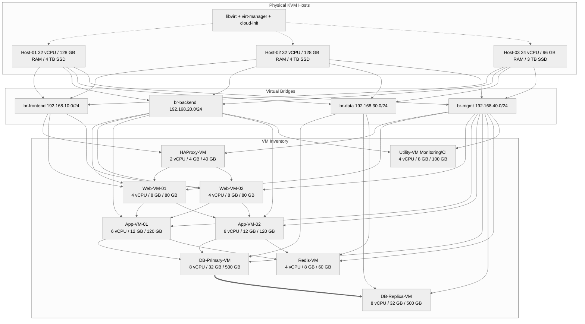

**Key takeaways**
- KVM bridges model the same trust boundaries as physical VLANs while preserving VM mobility and resource overcommit controls.
- Database guests receive the heaviest RAM and disk allocations because transactional workloads dominate resource consumption.
- A management bridge keeps operator tooling separate from customer traffic and data traffic.

## Diagram 2 — Docker Compose Architecture (Development)

This development-oriented stack shows a local or single-host Compose deployment with realistic supporting services for an ecommerce application.
It keeps the topology simple enough for developer laptops or test VMs while still reflecting service boundaries, ports, networks, and persisted volumes.

**When to use:** Use this for local development, QA sandboxes, or small integration environments where ease of startup matters more than production-grade failover.

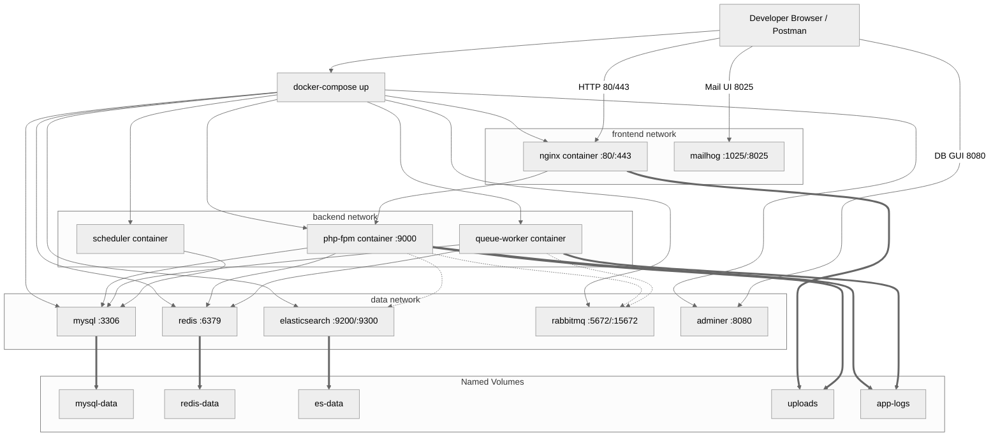

**Key takeaways**
- Compose networks emulate frontend, backend, and data isolation without requiring a full orchestrator.
- Named volumes preserve state across container restarts, which matters even in development for realistic debugging.
- Supporting tools like Mailhog and Adminer reduce environment friction while keeping the core topology recognizable.

## Diagram 3 — Docker Compose Production with Traefik

This diagram expands the containerized model into a production-style deployment using Traefik, multiple replicas, clustered dependencies, and health-aware routing.
It frames Docker Swarm or Compose-on-multiple-hosts as a bridge step before Kubernetes, especially for teams adopting containers incrementally.

**When to use:** Use this when the team wants container scheduling and SSL automation before investing in the operational complexity of a full Kubernetes platform.

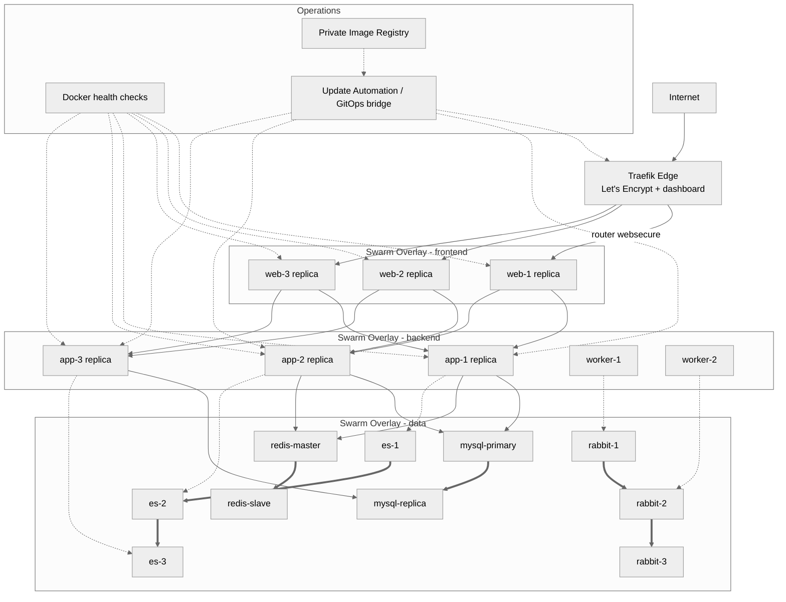

**Key takeaways**
- Traefik centralizes ingress, certificate management, and dynamic service discovery for container replicas.
- Clustered stateful services remain possible, but they demand careful volume and placement planning compared with stateless containers.
- This architecture is often a practical transition point between simple Compose and Kubernetes.

## Diagram 4 — Kubernetes Cluster Architecture

This cluster-level view separates the control plane from worker pools and shows how infrastructure services coexist with ecommerce workloads.
The node pools are grouped by operational intent so readers can see which workloads belong on system, web, app, and data nodes.

**When to use:** Use this for platform design conversations where the question is how to shape the cluster, not just how to deploy one application.

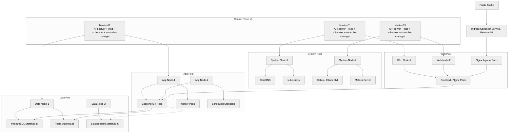

**Key takeaways**
- Pool-based scheduling makes it easier to isolate noisy neighbors, security controls, and maintenance windows.
- Infrastructure add-ons such as DNS, proxying, metrics, and CNI are platform dependencies and belong in the system layer, not application namespaces.
- StatefulSets should be treated differently from web and app Deployments because storage and pod identity matter.

## Diagram 5 — Kubernetes Ecommerce Complete Deployment

This is the application-centric deployment map showing the full ecommerce workload as Kubernetes resources across production, monitoring, and ingress namespaces.
Replica counts, autoscaling ranges, resource envelopes, and PVC usage are included so platform and application teams can reason about scheduling and scaling together.

**When to use:** Use this when you want a single-page reference for what runs in the cluster, how much of it runs, and which workloads are stateful versus stateless.

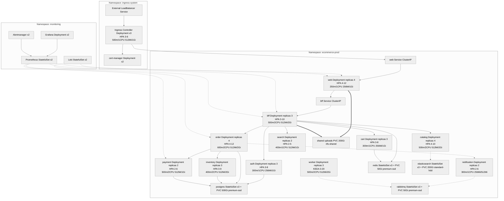

**Key takeaways**
- Replica counts and HPA ranges should be documented near the service map so scaling expectations are explicit.
- Stateful workloads carry PVC dependencies that materially affect placement, backup, and recovery design.
- Separating ingress and monitoring namespaces reduces blast radius and improves operational ownership boundaries.

## Diagram 6 — Kubernetes Networking Deep Dive

This network-focused diagram explains how external traffic enters the cluster, how services resolve and route internally, and how policy boundaries constrain pod-to-pod communication.
It also layers in service mesh sidecars and DNS resolution so both platform engineers and application developers can trace a request fully.

**When to use:** Use this for debugging connectivity, service discovery, policy denials, or latency introduced by ingress, mesh, or CNI behavior.

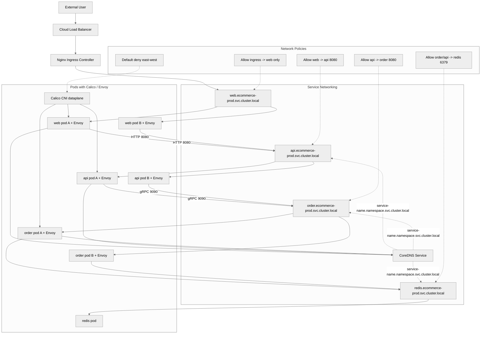

**Key takeaways**
- Cluster networking is a combination of ingress, service abstraction, DNS, and CNI enforcement—not a single component.
- Default-deny policy plus explicit allow rules makes pod communication predictable and auditable.
- Envoy sidecars add observability and policy power, but they also add network hops that should be understood during debugging.

## Diagram 7 — CI/CD Pipeline to Kubernetes

This pipeline view connects source control to build, test, scan, packaging, GitOps sync, and progressive deployment across environments.
It is intentionally left-to-right so release managers can read it as a promotion path from developer commit to production rollout.

**When to use:** Use this when defining delivery controls, approval gates, and how Helm or GitOps artifacts move between environments.

```mermaid
%%{init:{"theme":"neutral"}}%%
graph LR
    developer_ci[Developer] --> git_push[Git push / PR]
    git_push --> gh_actions[GitHub Actions or Jenkins]
    gh_actions --> build_step[Build image + unit tests]
    build_step --> integ_step[Integration + contract tests]
    integ_step --> scan_step[Trivy / SAST / dependency scan]
    scan_step --> registry_ci[Container Registry]
    registry_ci --> helm_pkg[Helm chart update]
    helm_pkg --> gitops_repo[GitOps config repo]
    gitops_repo --> argocd[ArgoCD detect drift + sync]
    argocd --> dev_env[Dev Cluster Namespace]
    dev_env --> qa_gate[QA / smoke tests]
    qa_gate --> staging_env[Staging Cluster Namespace]
    staging_env --> perf_gate[Performance + UAT gate]
    perf_gate --> approval_gate[Manual approval for prod]
    approval_gate --> prod_env[Production Cluster]
    prod_env --> rollout[Rolling update / canary]
    rollout --> verify[Post-deploy checks + rollback guard]
    gh_actions -.-> notify_chat[Slack / Teams notifications]
    scan_step -.-> vuln_ticket[Security findings / ticket]
    argocd -.-> drift_alert[Drift alerting]
```

**Key takeaways**
- The image build path and the environment promotion path should both be visible, because they are controlled by different tools and teams.
- Security scanning belongs before registry promotion so vulnerable images never become the default deploy artifact.
- GitOps turns cluster state into code, enabling auditability and safer rollback behavior.

## Diagram 8 — Production Kubernetes with Service Mesh (Istio)

This diagram adds Istio service mesh capabilities on top of the ecommerce deployment so routing, mTLS, telemetry, and canary releases are visible at pod level.
It shows how sidecars, ingress gateway, and mesh observability tools work together around normal application traffic.

**When to use:** Use this when you need fine-grained traffic policy, zero-trust service-to-service security, or progressive delivery beyond native ingress rules alone.

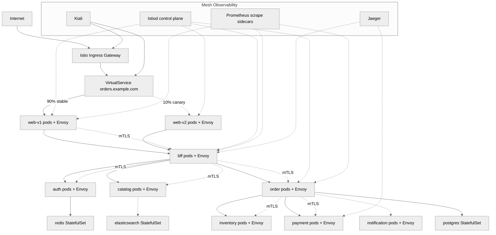

**Key takeaways**
- Service mesh makes traffic policy and service identity explicit, which is especially valuable for critical checkout paths.
- Canary percentage splits belong in architecture references because rollout policy is part of production behavior, not only deployment automation.
- Kiali, Jaeger, and Prometheus provide the feedback loop needed to use mTLS and routing rules safely.

## Diagram 9 — Kubernetes Storage Architecture

This storage diagram ties StorageClasses to the workloads that consume them so persistence decisions are visible alongside the services that depend on them.
It also shows backup flow through Velero to object storage, which matters for cluster-level recovery and migration plans.

**When to use:** Use this when deciding which storage profile each service should use and how persistent state will be protected across upgrades or failures.

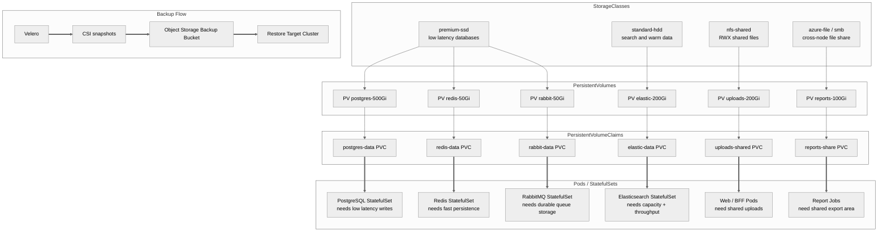

**Key takeaways**
- Storage class choice should match workload behavior, not just capacity numbers.
- RWX shared file needs are distinct from RWO database needs and should be represented separately.
- Velero plus CSI snapshots gives both object-level and cluster-level recovery leverage.

## Diagram 10 — Migration Path: Physical to VM to Docker to Kubernetes

This progression chart places the four common maturity stages side by side so teams can see what changes structurally at each step.
It emphasizes separation of concerns, packaging shifts, and operational capabilities gained during each transition rather than focusing only on runtime technology names.

**When to use:** Use this for roadmap planning, stakeholder alignment, or explaining why intermediate modernization stages still deliver meaningful value.

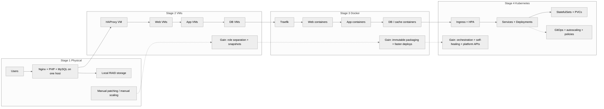

**Key takeaways**
- Each stage should preserve business capabilities while improving packaging, isolation, and operations incrementally.
- Virtualization and containers are not redundant steps; they solve different transition problems.
- Kubernetes is most effective when teams have already separated tiers and containerized deployments consistently.

## Diagram 11 — Kubernetes Scaling Architecture

This diagram shows how different autoscaling controllers combine to adjust replicas, node count, and resource sizing based on both internal and external signals.
It clarifies that horizontal, vertical, event-driven, and cluster-level scaling are complementary controls rather than mutually exclusive choices.

**When to use:** Use this when designing scale behavior for web traffic, asynchronous queue workers, and fluctuating infrastructure demand in the same cluster.

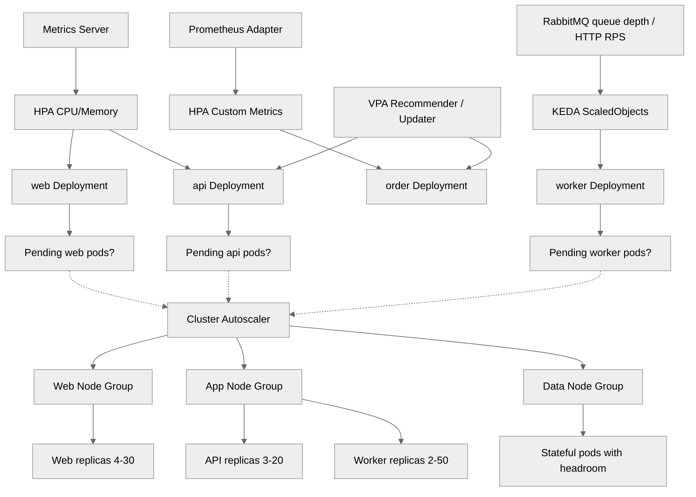

**Key takeaways**
- HPA handles fast replica changes, KEDA handles event-driven workloads, and Cluster Autoscaler handles underlying capacity.
- VPA is best treated carefully around stateful or latency-sensitive services but is valuable for recommendation loops.
- Scaling design should document triggers and bounds so cost and performance behavior stay predictable.

## Diagram 12 — Disaster Recovery: Multi-Region Kubernetes

This multi-region diagram maps primary and DR clusters, state replication, backup movement, and global entrypoint decisions for a Kubernetes-based ecommerce platform.
It makes the difference between warm standby capacity and data replication paths explicit so DR assumptions are visible before a real incident occurs.

**When to use:** Use this when the business needs a documented path from regional outage to restored service with measurable RPO and RTO expectations.

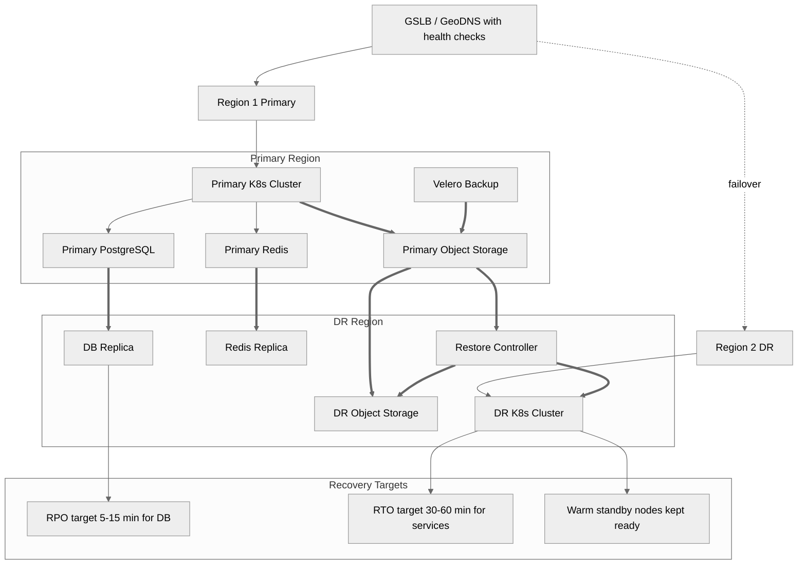

**Key takeaways**
- Regional DR is a combination of traffic steering, application capacity, and replicated state—not just a second cluster.
- Object storage replication and Velero backups provide a second recovery path when live replication alone is not sufficient.
- Documenting RPO and RTO in the diagram keeps recovery design anchored to business expectations.
